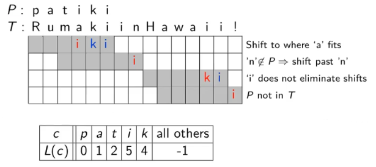

page: https://www.student.cs.uwaterloo.ca/~cs240/s20/

Instructor: Eric Schost,  Armin Jamshidpey, Gautam Kamath

- [Week 1. May 11](#week-1-may-11)
- [Week 2. May 18](#week-2-may-18)
- [Week 3. May 25](#week-3-may-25)
- [Week 4. June 1](#week-4-june-1)
- [Week 5. June 9](#week-5-june-9)
- [Week 6. June 16](#week-6-june-16)
- [Week 7. June 23](#week-7-june-23)
- [Week 8. June 29](#week-8-june-29)
- [Week 9. July 6](#week-9-july-6)
- [Week 10. July 14](#week-10-july-14)
- [Week 11. July 21](#week-11-july-21)
- [Week 12. July 28](#week-12-july-28)
- [Week 13. August 3](#week-13-august-3)

# Week 1. May 11

## running time simplifications
### random access machines model
*   the ram has a set of memory cells, each of which stores one item of dara
*   any access to a memory location takes constant time
*   any primitive operation takes constant time
*   the running time of a program = # of memory access + # of primitive operations

__defn.__ _(O-notation)_ $f(n)\in O(g(n))$ if there exist constants $c>0$ and $n_0>0$ such that $|f(n)| \leq c|g(n)|$ for all $n\geq n_0$. (upper bound)

__eg.__ f(n)=75n+500, g(n)=5n^2 (c=1, n0=20). (we ignore smaller inputs)

__eg.__ show $2n^2+3n+11\in O(n^2)$ from first principles.  
we need to find $c$ and $n_0$ so that we have $0 \leq 2 n^{2}+3 n+11 \leq c n^{2}, \forall n \geq n_{0}$.  
can let $n_0=1$, so $1\leq n\longrightarrow 1\leq n^2\longrightarrow11\leq 11n^2$, $1\leq n\longrightarrow n\leq n^2\longrightarrow 3n\leq 3n^2$, $2n^2\leq 2n^2$. so $2n^2+3n+11\leq 11n^2+3n^2+2n^2=16n^2$, so $c=16$. $\square$

__defn.__ _(Omega-notation)_ $f(n)\in \Omega(g(n))$ if there exist constants $c>0$ and $n_0>0$ such that $0\leq c|g(n)| \leq |f(n)|$ for all $n\geq n_0$. (lower bound)

__defn.__ _(Theta-notation)_ $f(n) \in \Theta(g(n))$ if $f(n) \in O(g(n))$ and $f(n) \in \Omega(g(n))$. (tight bound)

__eg.__ show $\frac{1}{2} n^{2}-5 n \in \Omega\left(n^{2}\right)$ from first principles.  
let $n_0=20$, have $n\geq 20\longrightarrow n^2\geq 20n\longrightarrow \frac{1}{4}n^2\geq 5n\longrightarrow \frac{1}{4}n^2-5n\geq 0$. so $\frac{1}{2}n^2-5n=\frac{1}{4}n^2+(\frac{1}{4}n^2-5n)\geq \frac{1}{4}n^2$. let $c=\frac{1}{4}$. $\square$

__defn.__ _(omega-notation)_ $f(n) \in o(g(n))$ if for all constants $c>0$, there exists a constant $n_0>0$ such that $|f(n)|<c|g(n)|,\forall n \geq n_{0}$.

__defn.__ _(theta-notation)_ $f(n) \in \omega(g(n))$ if for all constants $c>0$, there exists a constant $n_0>0$ such that $0\leq c|g(n)|<|f(n)|,\forall n \geq n_{0}$.

|notation|meaning|eg|
|:-:|:-:|:-:|
|Big O|asymptotically not bigger|
|Big Omega|asymptotically not smaller|
|Big Theta|asymptotically the same|
|small o|asymptotically strictly smaller||
|small omega|asymptotically strictly greater||

__theorem.__ $f(n) \in \Theta(g(n)) \Longleftrightarrow g(n) \in \Theta(f(n))$  
_proof._ there exist $n_0,c_1,c_2$ with $c_1|g|\leq|f|\leq c_2|g|,\forall n\geq n_0$, so $\frac{1}{c_2}|f|\leq|g|\leq\frac{1}{c_2}|f|,\forall n\geq n_0$. $\square$

__theorem.__ $f(n) \in O(g(n)) \Longleftrightarrow g(n) \in \Omega(f(n))$

__theorem.__ $f(n) \in o(g(n)) \Longleftrightarrow g(n) \in \omega(f(n))$

__theorem.__ $f(n) \in o(g(n)) \Longrightarrow f(n) \in O(g(n))$

__theorem.__ $f(n) \in o(g(n)) \Longrightarrow f(n) \notin \Omega(g(n)$

__theorem.__ $f(n) \in \omega(g(n)) \Longrightarrow f(n) \in \Omega(g(n))$

__theorem.__ $f(n) \in \omega(g(n)) \Longrightarrow f(n) \notin O(g(n))$

__theorem.__ _(identity rule)_ $f(n) \in \Theta(f(n))$

__theorem.__ _(max rules)_ suppose $f(n)>0$ and $g(n)>0$ for all $n\geq n_0$, then
1.   $O(f(n)+g(n))=O(\max \{f(n), g(n)\})$
2.   $\Omega(f(n)+g(n))=\Omega(\max \{f(n), g(n)\})$  

_proof._ (1) let $h\in O(f+g)$, then $\exist c, n_0>0$ with $|h|\leq c|f+g|\leq 2c|\max\{f,g\}|,\forall n\geq n_0$ so $h\in O(\max\{f,g\})$. let $h\in O(\max\{f,g\})$, then $\exist c,n_0>0$ with $|h|\geq c|\max\{f,g\}|=\frac{c}{2}|2\max\{f,g\}|\geq\frac{c}{2}|f+g|,\forall n\geq n_0$, so $h\in O(f+g)$. $\square$

__theorem.__ _(transitivity)_
*   if $f(n) \in O(g(n))$ and $g(n) \in O(h(n))$ then $f(n) \in O(h(n))$
*   If $f(n) \in \Omega(g(n))$ and $g(n) \in \Omega(h(n))$ then $f(n) \in \Omega(h(n))$

_proof._ (1) there exist $c_1,n_1>0$ with $|f|\leq c_1|g|,\forall n\geq n_1$, there exist $c_2,n_2$ with $|g|\leq c_2|h|,\forall n\geq n_2$. take $N=\max\{n_1,n_2\}$ we have $|f|\leq n_1n_2|h|,\forall n\geq N$. $\square$

__theorem.__ suppose $f(n)>0$ and $g(n)>0$ for all $n\geq n_0$, suppose $L=\lim _{n \rightarrow \infty} \frac{f(n)}{g(n)}$, then
$$
f(n) \in\left\{\begin{array}{ll}o(g(n)) & \text { if } L=0 \\ \Theta(g(n)) & \text { if } 0<L<\infty \\ \omega(g(n)) & \text { if } L=\infty\end{array}\right.
$$
the other side does not hold.

__eg.__ let $f(n)$ be a polynomial $f(n)=c_{d} n^{d}+c_{d-1} n^{d-1}+\cdots+c_{1} n+c_{0}$ for some $c_d>0$, then $f(n) \in \Theta\left(n^{d}\right)$.  
_proof._
$$
\begin{aligned}
\lim _{n \rightarrow \infty} \frac{f(n)}{n^{d}} &= \lim _{n \rightarrow \infty} \frac{c_{d} n^{d}+c_{d-1} n^{d-1}+\cdots+c_{1} n+c_{0}}{n^{d}}\\ 
 &= \lim_{n\rightarrow\infty}\frac{c_1n^d}{n^d}+\lim_{n\rightarrow\infty}\frac{c_{d-1}n^{d-1}}{n^{d}}+...+\lim_{n\rightarrow\infty}\frac{c_0}{n^d} \\ 
 &= c_d+0+...+0\\ 
 &= c_d >0
\end{aligned}
$$
use the limit rule we have $f(n) \in \Theta\left(n^{d}\right)$. $\square$

__eg.__ show $n(2+\sin n \pi / 2)$ is $\Theta(n)$.  
_proof._ note $\lim_{n\rightarrow \infty}\frac{n(2+\sin n\frac{\pi}{2})}{n}=\lim_{n\rightarrow\infty}(2+\sin n\frac{\pi}{2})$ does not exist.

note if $n_0=1$, then for all $n\geq n_0$ we have $-1\leq \sin n\frac{\pi}{2}\leq 1$, so add sides by $2$ and times $n$, we have $n\leq n(2+\sin n\frac{\pi}{2})\leq 3n$. $\square$

*   if $f(n) \in \Theta(g(n))$, then the _growth rates_ of both functions are the _same_.
*   if $f(n) \in o(g(n))$, then the growth rate of $f(n)$ is _less than_ the growth rate of $g(n)$
*   if $f(n) \in \omega(g(n))$, then the growth rate of $f(n)$ is _greater than_ the growth rate of $g(n)$

we write $\log n$ to represent $\log_2n=\frac{\ln n}{\ln 2}$

__eg.__ compare the growth rates of logn and n.  
$\lim_{n\rightarrow\infty}\frac{\log n}{n}=\lim_{n\rightarrow\infty}\frac{\frac{1}{n\ln 2}}{1}=\lim_{n\rightarrow\infty}\frac{1}{n\ln 2}=0$, so $\log n\in o(n)$ by LH.

__eg.__ compare the growth rates of $(\log n)^c$ and $n^d$ where $c,d>0$ are arbitrary.  
repeatedly apply LH we have $\lim_{n\rightarrow\infty}\frac{(\log n)^c}{n^d}=\lim_{n\rightarrow\infty}\frac{c!}{(\ln 2)^cd^cn^d}=0$ so $(\log n)^c\in o(n^d)$.

common growth rates from best to worse
*   $\Theta(1)$: constant complexity (array lookup)
*   $\Theta(\log n)$: logarithmic complexity (binary search)
*   $\Theta(n)$: linear complexity (search in array)
*   $\Theta(n\log n)$: linearithmic (mergesort)
*   $\Theta(n\log^k n)$ for some constant $k$: quasi-linear
*   $\Theta(n^2)$: quadratic complexity (polynomial multiplication)
*   $\Theta(n^3)$: cubic complexity (matrix multiplication)
*   $\Theta(2^n)$: exponential complexity

__eg.__ double the size of input for linearithmic algorithm, what's resultant running time?  
have $T(n)=cn\log n$, then $T(2n)=c2n\log 2n=2cn(\log n+\log 2)=2cn\log n+2cn=2T(n)+2cn$. not bad

techniques for analysis
*   running time depends on the input size n
*   identify elementary operations that require $\Theta(1)$ time
*   the complexity of a loop is expressed as the sum of the complexities if each iteration of the loop
*   nested loops: start with the innermost loop and proceed outwards

__eg.__
```cpp
Test1(n):
    auto sum = 0                    // Theta(1) --> c_1
    for i = 1, n:                   // \sum{i=1,n} A
        for j = i, n:               //  \sum{j=i,n} c_2 --> A
            sum = sum + (i-j)^2     //   Theta(1) --> c_2
    return sum                      // Theta(1) --> c_3
```
method1:
$$
\begin{aligned}
T(n) &= c_1+c_3+\sum_{i=1}^n\sum_{j=i}^nc_2 \\
&= c_0 +\sum_{i=1}^n(\sum_{j=i}^nc_2)\\
&= c_0+\sum_{i=1}^nc_2(n-i+1)\\
&= c_0+\sum_{i=1}^nc_2n-\sum_{i=1}^nc_2i+\sum_{i=1}^nc_2\\
&= c_0+c_2n^2-c_2(\frac{n(n-1)}{2})+c_2n\\
&= c_0+c_2(\frac{2n^2}{2}+\frac{n^2+n}{2}+\frac{2n}{n})\\
&= c_0+c_2(\frac{n^2+n}{2})\\
&= c_0+\frac{c_2}{2}(n^2+n)\in\Theta(n^2)
\end{aligned}
$$
method2:
$$
\begin{aligned}
T(n) &= c_1+c_3+\sum_{i=1}^n\sum_{j=i}^nc_2 \\
&\leq c_0+\sum_{i=1}^n\sum_{j=1}^nc_2\\
&= c_0+c_2\sum_{j=1}^n\sum_{j=1}^n1\\
&= c_0+c_2n^2\in O(n^2)\\

T(n) &= c_1+c_3+\sum_{i=1}^n\sum_{j=i}^nc_2\\
&\geq c_0+\sum_{i=1}^{n/2}\sum_{j=i}^nc_2\\
&\geq c_0+\sum_{i=1}^{n/2}\sum_{j=n/2+1}^nc_2\\
&= c_0+c_2\frac{n}{2}\sum_{i=1}^{n/2}1\\
&= c_0+c_2\frac{n^2}{4}\in\Omega(n^2)
\end{aligned}
$$

__eg.__ show $f(n)=\sum_{i=1}^n\sum_{j=i}^n\sum_{k=j}^i1\in\Theta(n^3)$  
$f(n)\leq\sum_{i=1}^n\sum_{j=1}^n\sum_{k=1}^n=n^3\in O(n^3)$  
$f(n)\geq\sum_{i=1}^{n/3}\sum_{j=2n/3+1}^n\sum_{k=n/3+1}^{2n/3}=...\in\Omega(n^3)$


# Week 2. May 18

The running time may depend on the characteristic of the input

__defn.__ let $T_A(I)$ denote the running time of an algorithm A on instance I of length n,
*   _best-case complexity_ take the best I, with shortest time
*   _worst-case complexity_ take the worst I, with longest time
*   _average-case complexity_ take the average I

we assume the worst-case complexity if not specified.

__eg.__
```cpp
Test(A, n):
    for i = 1, n-1:                     //     \sum_{i=1,n-1} M
        auto j = i
        while j > 0 and A[j] > A[j-1]:  //      M (worst: if j A[j] always > A[j-1]
            swap(A[j], A[j-1])          //         need to loop from 0 to i)
            j = j-1                     //
```
worst case: $\Theta(n^2)$

*   it is important not to try and make comparison between algorithms using O-notation
*   if A1, A2 solves same problem, A1 has worst O(n^3), A2 has worst O(n^2)
*   we cannot conclude A2 is more efficient than A1 for all input
    *   the worst-case runtime may only be achieved on some instances
    *   O is upper bound. A1 may have O(n).
    *   should always use $\Theta$-notation

## mergesort
### design
1.  split A into two subarrays AL consists of the first $\Bigl\lceil\dfrac{n}{2}\Bigr\rceil$ elements and AR consists of the last $\Bigl\lfloor\dfrac{n}{2}\Bigr\rfloor$ elements. 
2.  recursively call mergesort on AL and AR
3.  AL and AR are sorted, merge them into a single sorted array (merge two sorted arrays)

```cpp
mergesort(A[n], l = 0, r = n-1):
    if r <= l:                // \Theta(1)
        return                  // \Theta(1)
    else:
        auto m = (r+l)/2      // \Theta(1)
        mergesort(A, l, m)    // T(n/2)
        mergesort(A, m+1, r)  // T(n/2)
        merge(A, l, m, r)     // ?

// assume A[l:m], A[m+1:r] are sorted
merge(A[n], l, m, r):
    auto S = // auxiliary array of size n
    auto S[l:r] = A[l:r]  // copy A[l,...,r] to S[l,...,r]
                          // this is step 1, taking \Theta(n)
    int iL = l
    int iR = m+1
    for k = l, r:                // \sum_{k=l,r}
        if iL > m:
            A[k] = S[iR++]
        else if iR > r:
            A[k] = S[iL++]
        else if S[iL] <= S[iR]:
            A[k] = S[iL++]
        else:
            A[k] = S[iR++]
```
merge takes $\Theta(r-l+1)$, which is $\Theta(n)$ (!)  
so the total time for mergesort should be $T(n)=2T(\frac{n}{2})+\Theta(n)$

### analysis
let T(n) denote the time to run mergesort on an array of length n
*   step 1 takes $\Theta(n)$
*   step 2 takes $T(\Bigl\lceil\dfrac{n}{2}\Bigr\rceil)+T(\Bigl\lfloor\dfrac{n}{2}\Bigr\rfloor)$
*   step 3 takes $\Theta(n)$

the _recurrence relation_ for T(n) is:
$$
T(n)=\begin{cases}
T(\Bigl\lceil\dfrac{n}{2}\Bigr\rceil)+T(\Bigl\lfloor\dfrac{n}{2}\Bigr\rfloor)+\Theta(n) & \text{ if } n>1 \\ 
\Theta(1) & \text{ if } n= 1
\end{cases}
$$
it suffices to consider the _exact relation_, with constant factor c replacing $\Theta$'s
$$
T(n)=\begin{cases}
T(\Bigl\lceil\dfrac{n}{2}\Bigr\rceil)+T(\Bigl\lfloor\dfrac{n}{2}\Bigr\rfloor)+cn & \text{ if } n>1 \\ 
c & \text{ if } n= 1
\end{cases}
$$
the _sloppy recurrence_ (with floors and ceilings removed) is:
$$
T(n)=\begin{cases}
2T(\frac{n}{2})+cn & \text{ if } n>1 \\ 
c & \text{ if } n= 1
\end{cases}
$$
*   the exact and sloppy recurrences are identical when n is power of 2

#### solve with method 1
$$
\begin{aligned}
T(n) &= 2T(\frac{n}{2})+cn\\ 
 &= 2(2T(\frac{n}{2^2})+c\frac{n}{2})+cn=2^2T(\frac{n}{2^2})+2cn \\
 &= 2^2(2T(\frac{n}{2^3})+c\frac{n}{2^2})+2cn=2^3T(\frac{n}{2^3})+3cn \\
 &= ... \\
 &= 2^iT(\frac{n}{2^i})+icn \\
\end{aligned}
$$
at $i$-th level. since when $n=1$, we have $T(1)=c$, we can solve $1=\dfrac{n}{2^j}$ and get $j=\log n$, so
$$
T(n)=2^jT(1)+jcn=2^jc+jcn=cn+\log n\,cn\in\Theta(n\log n)
$$

#### solve with method 2
```
                   +----+cn +---+                 level 0: cn
                   v            v
         +------+cn/2         cn/2+-----+         level 1: 2*cn/2=cn
         |         +            +       |
         v         v            v       v
  +--+ cn/4      cn/4         cn/4     cn/4 +-+   level 2: 4*cn/4=cn
  |                                           |
.....           ......       ......         .....
  |                                           |       ...
  v                                           v
  c  c                .......              c   c  level logn: n*c=cn
```
first mergesort call have time cn (for merge), then it calls two mergesorts with size n/2, each of which has time cn/2, ...  
all rows in fact sums to cn, there are logn+1 rows, so $T(n)=(\log n+1)cn$

## useful formulas
### some recurrence relations
|recursion|resolves to|eg|
|:-|:-|:-:|
|$T(n)=T(\frac{n}{2})+\Theta(1)$|$T(n)\in\Theta(\log n)$|binary search|
|$T(n)=2T(\frac{n}{2})+\Theta(n)$|$T(n)\in\Theta(n\log n)$|mergesort|
|$T(n)=2T(\frac{n}{2})+\Theta(\log n)$|$T(n)\in\Theta(n)$|heapify|
|$T(n)=T(cn)+\Theta(n)$<br /> $\exist 0<c<1$|$T(n)\in\Theta(n)$|selection|
|$T(n)=2T(\frac{n}{4})+\Theta(1)$|$T(n)\in\Theta(\sqrt{n})$|range search|
|$T(n)=T(\sqrt{n})+\Theta(1)$|$T(n)\in\Theta(\log\log n)$|interpolation search|

### useful sums
*   arithmetic sequence
    $$\sum_{i=0}^{n-1}(a+di)=na+\frac{dn(n-1)}{2}\in\Theta(n^2),d\neq 0$$
*   geometric sequence
    $$
    \sum_{i=0}^{n-1}ar^n=\left\{\begin{matrix}
    a\dfrac{r^n-1}{r-1}&\in\Theta(r^n) & \text{ if } r>1\hphantom{--} \\ 
    an\hphantom{--}&\in\Theta(n) & \text{ if } r= 1\hphantom{--}\\ 
    a\dfrac{1-r^n}{1-r}&\in\Theta(1) & \text{ if } 0<r<1 
    \end{matrix}\right.
    $$
*   harmonic sequence
    $$\sum_{i=1}^n\frac{1}{i}=\ln n+\gamma+o(1)\in\Theta(\log n)$$
*   few more
    $$\sum_{i=1}^n\frac{1}{i^2}=\frac{\pi^2}{6}\in\Theta(1)$$
    $$\sum_{i=1}^ni^k\in\Theta(n^{k+1}),k\geq 0$$

### useful formulas
*   $x-1<\lfloor x\rfloor\leq x$
*   $x-1\leq\lceil x\rceil< x$

__eg.__ $\log(n!)=\log n+\log(n-1)+...+\log 1\in\Theta(n\log n)$  
_proof._ 
*   we have $f(n)=\log n+...+\log 1\leq \log n +...+\log n=n\log n\in\Theta(n\log n)$.  
*   if we choose $n\geq 4$, then $\log n\geq 2$ so $\log n-2\geq 0\Longrightarrow 2\log n-2\geq\log n\Longrightarrow \log n-1\geq\frac{1}{2}\log n\Longrightarrow \log n-\log 2\geq \frac{1}{2}\log n\Longrightarrow \log\frac{n}{2}\geq\frac{1}{2}\log n$ so $\frac{n}{2}\log\frac{n}{2}\geq\frac{1}{2}\frac{n}{2}\log n$.  
    so $f(n)\geq \log n+...\log\frac{n}{2}\geq \log\frac{n}{2}+...+\log\frac{n}{2}=\frac{n}{2}\log\frac{n}{2}\geq \frac{1}{4}n\log n\in\Omega(n\log n)$. $\square$

__eg.__ show $T(n)=2T(\frac{n}{2})+c$ reduces to $\Theta(n)$.  
$T(n)=2^iT(\frac{n}{2^i})+(2^0+2^1+...+2^{i-1}),\,\forall i$. let $i=\log n$ we have $T(n)=nc+\sum_{k=0}^{\log n-1}2^k=nc+\frac{2^{\log n}-1}{2-1}=nc+(n-1)\in\Theta(n)$. $\square$

## priority queues

### review of ADTs
#### stack
*   LIFO (last-in, first-out)
*   push: insert element
*   pop: remove element
*   implementation: array
    ```
    +---+---+---+---+  push 3  +---+---+---+---+   pop    +---+---+---+---+
    | 1 | 8 |   |   |   +-->   | 1 | 8 | 3 |   |   +-->   | 1 | 8 |   |   |
    +---+---+---+---+          +---+---+---+---+          +---+---+---+---+
    top: 1                     top: 2                     top: 1
    ```
*   implementation: linked list
    ```
    +---+  +---+  push 3  +---+  +---+  +---+    pop    +---+  +---+
    | 1 +->+ 8 |   +-->   | 3 +->+ 1 +->+ 8 |    +-->   | 1 +->+ 8 |
    +---+  +---+          +---+  +---+  +---+           +---+  +---+
      ^                     ^                             ^
    top                   top                           top
    ```

#### queue
*   FIFO (first-in, first-out)
*   enqueue: insert
*   dequeue: remove the least recently iserted item
*   implementation: (circular) array
    ```
    +---+---+---+---+ enqueue 3 +---+---+---+---+  dequeue +---+---+---+---+
    | 8 | 1 |   |   |    +-->   | 8 | 1 | 3 |   |   +-->   |   | 1 | 3 |   |
    +---+---+---+---+           +---+---+---+---+          +---+---+---+---+
    front: 0                    front: 0                   front: 1
    rear : 1                    rear : 2                   rear : 2
    ```
*   implementation: linked list
    ```
    +---+  +---+ enqueue 3 +---+  +---+  +---+  dequeue  +---+  +---+
    | 8 +->+ 1 |    +-->   | 8 +->+ 1 +->+ 3 |    +-->   | 1 +->+ 3 |
    +---+  +---+           +---+  +---+  +---+           +-+-+  +---+
      ^      ^               ^             ^               ^      ^
    front  rear            front         rear            front  rear
    ```

#### binary tree
*   a binary tree is either empty, or consists of a node and two binary trees left/right subtrees
*   the height of a non-empty tree is the length of the longest path from root to node. the height of the empty tree is -1, the height of tree with one node is 0.
*   a binary tree with n odes has height at least $\log(n+1)-1\in\Omega(\log n)$

### pqueue
*   `insert`: inserting an item tagged with a priority
*   `deleteMax`: removing the item of _highest_ priority
*   priority is also called key
*   application: 'todo' list, sorting

#### use pqueue to sort
```cpp
PQsort(A[n]):
    auto PQ = new priority_queue
    for k = 0, n-1:
        PQ.insert(A[k], key=A[k])  // fill elements to pqueue
    for k = n-1, 0, -1:
        A[k] = PQ.deleteMax()
```
run-time: $O(\sum_{i=0}^n\texttt{insert}(i)+\sum_{i=0}^n\texttt{deleteMax}(i))$, depending on how we implement the pqueue

#### realizations of pqueues
realization 1: use unsorted array
*   `insert`: O(1)
*   `deleteMax`: O(n), because we search the array for one with max key
*   PQsort with this realization yields _selection sort_, runtime is O(n^2)

realization 2: use sorted arrays
*   `insert`: O(n), because we need to iterate elements to find where to put the new item, and probably shift existing items to give empty space
*   `deleteMax`: O(1), simply remove the last entry
*   PQsort with this realization yields _insertion sort_, runtime is O(n^2)

### binary heap
*   a certain type of binary tree with following properties
    *   _structural_: all the levels of a heap are completely filled except (possibly) for the last level. the filled items in the last level are _left-justified_.
    *   _heap-order_: for any node i, the key of the parent of i is larger than or equal to key of i.
*   the max name is _max-oriented binary heap_

__lemma.__ the height of a heap with $n$ nodes is $\Theta(\log n)$  
_proof._ for a heap of height $h$, we have at least level 0(full) + level 1(full) + ... + level h-1(full) + level h(only 1) = $1+2+4+...+2^{h-1}+1=(2^h-1)+1=2^h$ nodes. and at most (all filled) = $1+2+4+...+h=2^{h+1}-1$ nodes.  
hence we have $2^h\leq n\leq 2^{h+1}-1\leq 2^{h+1}$, which is $h\leq \log(n)\leq h+1$. rearrange we have $\log(n)-1\leq h\leq \log(n)$ so $h\in\Theta(\log n)$. $\square$

#### storing heaps in arrays


*   let H be a heap of n items and let A be an array of size n. store root in A[0] and continue with elements _level-by-level_ from _top to bottom_, in each level _left-to-right_
*   the root node is at index $0$
*   the left child of node i is node $2i+1$
*   the right child of node i is node $2i+2$
*   the parent of node i is node $\Bigl\lfloor\dfrac{i-1}{2}\Bigr\rfloor$
*   the last node is $n-1$

# Week 3. May 25

#### insert in heaps
*   insert the node to the last position (n-1), it may break ordering. need to _fix-up_
*   if it breaks ordering, swap with its parent, continue until it is less than parent
*   the new item "bubbles up"

```cpp
// k is an index corresponding to a node
fix_up(A[], k):
    while parent(k) exist and A[parent(k)] < A[k]: // worst: swap until it becomes root
        swap(A[k], A[parent(k)])
        k = parent(k)

insert(A[], n, item):
    increase size of A by 1
    auto l = last(n) // n-1
    A[l] = item
    fix_up(A, l)
```
worst time = O(height of heap) = (logn)

#### deleteMax in heaps
*   the max item of a heap is the root node
*   we replace root by the last leaf (n-1). breaks ordering. need to _fix-down_
*   swap this new root with the larger of its children, continue until it is larger than children, or it becomes leaf

```cpp
// k is an index corresponding to a node
fix_down(A[], n, k):
    while k is not leaf:
        // find child with larger key
        // there can't be case when left doesn't exist and right exist
        auto j = leftchild(k)
        if j != last(n) and A[j+1] > A[j]:
            j = j+1
        if A[k] >= A[j]: break
        swap(A[j], A[k])
        k = j

deleteMax(A[], n):
    auto res = A[root()]
    swap(A[root()], A[last(n)])
    decrease size by 1 // remove original root (now last)
    fix_down(A, n-1, root())
    return res
```
worst time = O(height of heap) = (logn)

#### pqsort
```cpp
PQsortWithHeap(A[n]):
    auto hp = new heap
    for k = 0, n-1:
        hp.insert(key=A[k])  // just insert keys, no items
    for k = n-1, 0, -1:
        A[k] = hp.deleteMax()
```
*   both insert and deleteMax is O(logn), so it takes O(nlogn) time. it takes O(n) extra space

#### heapsort
problem: given n items all at once, build a heap containing all of them
*   naive: insert item one by one by calling fixup
*   use fixdowns, start from second bottom
```cpp
heapify(A[n] /* A is regular array */):
    for i = parent(last(n)), 0, -1:
        fix_down(A, i)
// worst time: O(n)
```
the running time of heapify $T(n)$ is $\Theta(n)$.  
_proof for $n=2^{h+1}-1$ (complete heap)_.
$$
\begin{aligned}
T(n) &\in \Theta(\text{worst case number of swaps}) \\
 &= \Theta(\text{level h, swap 0 times each + level h-1, 1 time each, + ... + level 0}) \\
 &= \Theta(0\cdot 2^{h-0}+1\cdot2^{h-1}+2\cdot2^{h-2}+...+h\cdot2^{h-h}) \\
 &= \Theta(2^h\sum_{i=0}^{h}\frac{i}{2^i}) \\
 &= \Theta(2^h) = \Theta(n)
\end{aligned}
$$
where each level $h-i$ has $2^{h-i}$ nodes. and $\sum_i\frac{i}{2^i}\leq 2$

we can use fix_ups, however, "The running time is at least nlogn. You can see this by noting there are n over two elements in the bottom layer, each of which are at a depth logn, which is the cost of a fixup operation."

```cpp
heapsort(A[], n):
    heapify(A)                        // O(n)
    // repeatedly find max
    while n > 1:                      // O(nlongn)
        // delete max (put it to last, and fixdown skips it)
        swap(A[root()], A[last(n)])
        n--
        fix_down(A, n, root())
```
takes O(nlogn) time

#### find smallest item
problem: find the k-th smallest item in an array A of n distinct numbers
*   sol1: make k passes through the array, deleting the minimum num each time
    *   $\Theta(kn)$
*   sol2: sort A, return A[n-k]
    *   $\Theta(n\log n)$
*   sol3: scan the array and maintain the k smallest numbers seen so far in a max-heap, finally take the root
    *   $\Theta(n\log k)$
*   sol4: create a min-heap with heapify(A). call deleteMin(A) k times
    *   $\Theta(n+k\log n)$ best

## sorting and randomized algorithms

selection problem: given an array A of n numbers, and $0\leq k<n$, find the element that would be at position k of the sorted array
*   special case: median finding: $k=\left\lfloor\dfrac{n}{2}\right\rfloor$
*   selection can be done with heaps with $\Theta(n+k\log n)$ (sol4)
*   median-finding with this is $\Theta(n\log n)$ (same as sorting first)

### quick-select
1.  _choose_pivot(A)_: return an index p in A. we use the pivot to rearrange the array
    ```cpp
    // simplest
    choose_pivot(A[]) => A.size - 1
    ```
2.  _partition(a, p)_: rearrange A and return pivot index i so that
    *   all items in A[0 : i-1] are less/eq than v
    *   pivot value is in A[i]
    *   all items in A[i+1 : n-1] are greater than v

easy partition: create smaller, equal, larger arrays separately, then concatenate them. O(n) time and space

#### efficient in-place partition
*   keep swapping the outermost wrongly-positioned pairs

```cpp
partition(A[n], p):
    swap(A[n-1], A[p])
    auto i = -1     // begin from left
    auto j = n-1    // begin from right
    auto v = A[n-1] // pivot index
    while true:
        // stop when A[i] is bigger than pivot
        do: i++ while i < n and A[i] < v
        // stop when A[j] is smaller than pivot
        do: j-- while j > 0 and A[j] > v
        // break if two pointers overlap, where two elems are in correct position
        if i >= j: break
        // swap wrongly positioned ones
        else: swap(A[i], A[j])
    swap(A[n-1], A[i])
    return i
```
takes $O(n)$.

#### quick-select 1

```cpp
quick_select1(A[], k):
    // selects kth element as if A is sorted
    auto p = choose_pivot(A)
    auto i = partition(A, p)
    if i == k:
        return A[i]
    else if i > k:
        return quick_select1(A[:i-1], k)
    else:
        return quick_select1(A[i+1:], k-i-1) // note index relative to new subarray
```
running time analysis:

__worst__: list is sorted eg `[1,2,3,4]`, and want to select 1st elem. choose pivot to be 4, then after partition the array is the same, qs recurses on `[1,2,3]`, ... recursive call always have size n-1.

we have
$$
T(n)\begin{cases}
T(n-1)+cn & \text{ , } x\geq 2 \\ 
c & \text{ , } x= 1
\end{cases}
=cn+c(n-1)+c(n-2)+...+c\cdot 2+c\in\Theta(n^2)
$$

__best__: the chosen pivot is just the kth elem. no recursive call (just partition). $O(n)$.

__average__:
*   simple assumption: all input numbers are distinct
*   characterize input by sorting permutation: the permutation that would put the input in order
*   assume all n! permutations are equally likely, then the average cost is (sum of costs of all perms) / n!

define $T(n,k)$ as average cost for selecting kth item from array of size n. then
*   $T(1,k)=c$
    * size is 1
*   $T(n,k)=cn+\frac{1}{n}\left( \sum_{i=0}^{k-1}T(n-i-1, k-i-1)+\sum_{i=k+1}^{n-1}T(i,k)\right)$
    *   i is the choice of pivot (0, ..., n-1). there are n possibilities, so 1/n
    *   if i < k, recurse on right subarray, cn+T(n-i-1,k-1-i)
    *   if i = k, only partition, cn
    *   if i > k, recurse on left subarray, cn+T(i,k)

__theorem.__ $T(n,k)\leq 4cn$.  
_proof._ use induction. base: if $n=1$, then $T(1,k)=c\leq 4c\cdot 1$.  
inductive:
$$
\begin{aligned}
    T(n,k)&\leq cn+\frac{1}{n}\left(\sum_{i=0}^{k-1}4c(n-i-1)+\sum_{i=k+1}^{n-1}4ci\right)\\
    &=cn+\frac{4c}{n}\left(\sum_{i=0}^{k-1}n-\sum_{i=0}^{k-1}(i+1)+\sum_{i=k+1}^{n-1}i\right)\\
    &=cn+\frac{4c}{n}\left(nk-\frac{(1+k)k}{2}+\frac{(k+1+n-1)(n-1-k)}{2}\right)\\
    &\leq cn+\frac{4c}{n}(nk-k^2+\frac{n^2}{2})\\
    &=cn+\frac{4c}{n}\frac{n^2}{2}+\frac{4c}{n}(nk-k^2) \,\,(\text{maximized when }k=\frac{n}{2})\\
    &\leq cn+2cn+\frac{4c}{n}(n\frac{n}{2}-\frac{n^2}{4})\\
    &=cn+2cn+\frac{4c}{n}(\frac{n^2}{4})\\
    &=4cn
\end{aligned}
$$
$\square$

that is $T\in O(n)$.

# Week 4. June 1

### randomized algorithm
*   once which relies on some random numbers in addition to the input
*   the runtime depends on the input and the random number used
*   goal: shift the dependency of runtime from what we can't control (input) to what we can control (random numbers)

__defn.__ the _expected running time_ is
$$T^{\text{exp}}(I)=E[T(I,R)]=\sum_RT(I,R)\cdot Pr[R]$$
where $T(I,R)$ is the running time of a randomized algorithm $A$ for an input instance $I$ and the sequence of random numbers $R$.

#### randomized quick-select
*   goal: create a randomized version of quick_select for which all input has the same expected runtime

first idea: randomly shuffle the input
```cpp
shuffle(A[]):
    for i = 0, n-2:
        swap(A[i], A[i+random(n-i)])
```
assuming the `random(n)` returns integers uniformly from 0, 1, ..., n-1.
*   drawback: costly, tricky to analysis

second idea: random pivot by changing pivot selection
```cpp
choose_pivot2(A[n]):
    return random(n)

quick_select2(A[], k):
    auto p = choose_pivot2(A)
    ...
```
the probability of choosing a pivot index i from 0 to n is $\frac{1}{n}$. so the analysis is the same as average case. expected runtime is $\Theta(n)$.

### quick-sort
```cpp
quick_sort1(A[n]):
    if n <= 1: return
    auto p = choose_pivot1(A) // last element
    auto i = partition(A, p)
    quick_sort1(A[:i-1])
    quick_sort(A[i+1:])
```

let $T(n)$ be the runtime for quick_sort1, then it depends on the pivot index i. we have
$$T(n)=\Theta(n)+T(i)+T(n-i-1)$$

__worst-case__: we always have i=0 or n-1
$$
T(n)\begin{cases}
T(n-1)+cn & \text{ , } x\geq 2 \\ 
c & \text{ , } x= 1
\end{cases}
$$
similar to worst-case quick select $T(n)\in\Theta(n^2)$.

__best-case__: we always have i = $\lfloor\frac{n}{2}\rfloor$ or $\lceil\frac{n}{2}\rceil$
$$
T(n)=\begin{cases}
T(\Bigl\lfloor\dfrac{n-1}{2}\Bigr\rfloor)+T(\Bigl\lceil\dfrac{n-1}{2}\Bigr\rceil)+cn &, n>1 \\ 
c &, n= 1
\end{cases}
$$
resolves to $\Theta(n\log n)$.

__average-case__: there are (n-1)! permutations have to pivot indices i
$$
\begin{aligned}
    T(n)&=\frac{1}{n!}\sum_{i=0}^{n-1}\sum_{\text{size of I is n, I has pivot i}}\text{running time for instance I} \\
    &\leq\frac{1}{n!}\sum_{i=0}^{n-1}(n-1)!(cn+T(i)+T(n-i-1))\\
    &=cn+\frac{1}{n}\sum_{i=0}^{n-1}(T(i)+T(n-i-1))
\end{aligned}
$$
__theorem.__ $T(n)\in\Theta(n\log n)$.  
_proof._ rewrite
$$
\begin{aligned}
    T(n)&=cn+\frac{2}{n}\sum_{i=0}^{n-1}T(i)\\
    nT(n)&=cn^2+2\sum_{i=0}^{n-1}T(i)\\
    (n-1)T(n-1)&=c(n-1)^2+2\sum_{i=0}^{n-2}T(i)\\
    nT(n)-(n-1)T(n-1)&=c(2n-1)+2T(n-1)\\
    nT(n)&=(n+1)T(n-1)+c(2n+1)\\
    \frac{T(n)}{n+1}&=\frac{T(n-1)}{n}+\frac{c(2n-1)}{n(n+1)}
\end{aligned}
$$
define $A(n)=\frac{T(n)}{n+1}$, we obtain
$$
\begin{aligned}
    A(n)&=A(n-1)+\frac{c(2n-1)}{n(n+1)}\\
    &=A(n-2)+\frac{c(2(n-1)-1)}{(n-1)n}+\frac{c(2n-1)}{n(n+1)}\\
    &...\\
    &=c\sum_{i=1}^n\frac{2i-1}{i(i+1)}\\
    &=2c\sum_{i=1}^n\frac{1}{i+1}-c\sum_{i=1}^n\frac{1}{i(i+1)}\\
    &\rightarrow\Theta(\log n)+\Theta(1)
\end{aligned}
$$
so $T(n)=(n+1)T(n)\in\Theta(n\log n)$. $\square$

optimizations:
*   by using randomized `choose_pivot2`, the expected time for quicksort2 is O(nlogn).
*   the auxiliary space is $\Omega$ (recursion depth)
    *   this is $\Theta(n)$ in worst-case
    *   it can be reduced to O(logn) worst-case by recurring in smaller sub-arrays first and replacing the other recursion by while loop
*   once should stop recursing when $n\leq 10$. run insertion sort at then end then sorts everything in O(n) since all items are within 10 units of their required position
*   arrays with many duplicates can be sorted faster by making `partition` to produce 3 subsets: <=v, ==v, >=v
*   tricks that apply in many situations:
    *   pass only range of indices instead of full array
    *   avoid recursion altogether by keeping an explicit stack

```cpp
quick_sort3(A[n]):
    auto S = new stack<pair<int, int>>
    S.push({0, n-1})
    while S is not empty:
        auto [l, r] = S.pop()
        while r-l+1 > 10:
            auto p = choose_pivot2(A, l, r)
            auto i = partition(A, l, r, p)
            if i-l > r-i:
                S.push({l, i-1})
                l = i+1
            else:
                S.push({i+1, r})
                r = i-1
    insertion_sort(A)
```

### lower bounds for sorting
comparison-based sorting lower bound is O(nlogn)
*   the comparison model data can only be assessed in two ways:
    *   compare
    *   swap/copy

__theorem.__ any correct comparison-based sorting algorithm requires at least $\Omega(n\log n)$ comparison operations to sort $n$ distinct items.  
_proof._ let $h$ be the max number of comparisons performed by the algorithm. in the decision tree, the number of leaves (permutations) $\geq n!$, and $\leq 2^h$. so $2^h\leq n!\Longrightarrow h\geq \log(n!)= \log n+\log(n-1)+...+\log(1)\geq\log n+\log(n-1)+...\log(\frac{n}{2}+1)\geq\frac{n}{2}\log(\frac{n}{2})=\frac{n}{2}\log n-\frac{n}{2}\in\Omega(n\log n)$. $\square$

non-comparison-based sorting can be O(n) under assumptions
*   assume keys are numbers in base _R_ (radix)
    *   most common: 2, 10, 16, 128, 256
*   assume all keys have the same number _m_ of digits
    *   eg: (R=4) `[123, 230, 021, 320, 210, 232, 101]`
*   can sort base don individual digits

### bucket sort (single digit)
*   sorts numbers by a single digit
*   create a "bucket" for each possible digit: array of linked lists, length R
*   copy item with digit i into bucket B[i]
*   at the end copy buckets in order into A

```
   A              B                              A
+-----+        +-----+                        +-----+
| 123 |        |B[0]  = 230 -> 320 -> 210     | 230 |
+-----+        +-----+                        +-----+
| 230 |        |B[1]  = 021 -> 101            | 320 |
+-----+        +-----+                        +-----+
| 021 |        |B[2]  = 232                   | 210 |
+-----+        +-----|                        +-----+
| 320 |  +-->  |B[3]  = 123           +-->    | 021 |
+-----+        +-----+                        +-----+
| 210 |                                       | 101 |
+-----+                                       +-----+
| 232 |                                       | 232 |
+-----+                                       +-----+
| 101 |                                       | 123 |
|-----|                                       +-----+
    ^
sort by this digit
```

```cpp
// A: array of size n, contains numbers with digits in {0, ..., R-1}
// d: index of the digit by which we wish to sort
bucket_sort(A[n], d):
    auto B = new array<list<int>>(length=R) // space: R+n
    for i = 0, n-1:
        B[dth digit of A[i]].append(A[i])
    auto i = 0
    for j = 0, R-1:
        while B[j] is not empty:
            A[i++] = B[j].front
            B[j].front = B[j].next
```
this is stable: equal items stay in original order
runtime: O(n+R), auxiliary space: O(n+R)

*   no need to maintain linked lists

count sort:
```cpp
key_indexed_count_sort(A[n], d):
    // count how many each kind there are
    auto count = new array(size=R, fill=0)
    for i = 0, n-1:
        count[dth digit of A[i]]++
    // find left boundary of each kind
    auto idx = new array(size=R)
    idx[0] = 0
    for i = 1, R-1:
        idx[i] = idx[i-1] + count[i-1]
    // move to new array in sorted order, then copy back
    auto aux = new array(size=n)
    for i = 0, n-1:
        aux[ idx[dth digit of A[i]] ] = A[i]
        idx[dth digit of A[i]]++
    A = aux
```

### MSD-radix-sort (most significant digit)
*   sorts by leading digit, then each group by next digit, etc

```cpp
// sort array of m-digit radix-r numbers recursively
msd_radix_sort(A[n], l=0, r=n-1, d=1 /* digit */):
    if l < r:
        key_indexed_count_sort(A[l:r], d)
        if d < m:
            for i = 0, R-1:
                auto [li, ri] = // boundaries of ith bin (A[li:ri] all have dth digit i)
                msd_radix_sort(A, li, ri, d+1)
```
*   `li`, `ri` are automatically computed with count_sort
*   drawback: many recursions
*   aux space: O(n+R+m) (for recursion stack)

### LSD-radix-sort
*   use the stability property
```cpp
lsd_radix_sort(A[n]):
    for d = m, 1, -1:
        key_index_count_sort(A, d)
```
*   loop-invariant: A is sorted with original same-digit order preserved
*   time: O(m(n+R))
*   aux space: O(n+R)
*   achieves O(nlogn) if input is special

# Week 5. June 9

## dictionary ADT
*   a dictionary is a collection of items, each of which contains
*   a key
*   some data
*   and is called a _key-value pair_. keys can be compared and are (typically) unique

operations:
*   search(k)
*   insert(k, v)
*   delete(k)

### elementary implementations
common assumptions
*   dictionary has n KVPs
*   each KVP uses constant space (O(1))
*   keys can be compared in constant time (O(1))

__using unordered array/linked list:__
*   search O(n)
*   delete O(1)
*   delete O(n) (need to search)

__using ordered array:__
*   search O(logn) (via binary search)
*   insert O(n) (have to move elements)
*   delete O(n)

### binary search trees
*   structure
    *   all internal nodes have two children
    *   every internal node stores a KVP
    *   every external node stores empty tree (usually not shown)
*   ordering
    *   every key k in T.left is less than the root key
    *   every key k in T.right is greater than the root key

BST_search(k)
*   start at root, compare k to current node. stop if found or node is external, else recurse at child
```cpp
BST_search(root, k):
    if      root == NULL : not found
    else if k == root.key: return root
    else if k < root.key : return BST_search(root.left, key)
    else                   return BST_search(root.right, key)
```

BST_insert(k, v)
*   search k. it is not found but the pointer is at right place, just add
```cpp
BST_insert(root, k, v):
    if root == NULL: return new node(k, v)
    if k < root.key: root.left = BST_insert(root.left, k, v)
    else           : root.right = BST_insert(root.right, k, v)
    return root
```

BST_delete(k)
*   first search for the node x that contains the key
*   if x is a leaf, just delete it
*   if x has one child, move child up
*   else, swap key at x with its ___inorder__ successor (or predecessor)_ node and then delete that node
```cpp
BST_delete(root, k):
    /* locate k */
    if root == NULL: return root
    if k < root.key:
        root.left = BST_delete(root.left, k)
        return root
    else:
        root.right = BST_delete(root.right, k)
        return root
    /* k has one child */
    if root.left == NULL:
        auto &tmp = root.right
        delete root
        return tmp
    else if root.right == NULL:
        auto &tmp = root.left
        delete root
        return tmp
    /* k has two children */
    else:
        auto succ_parent = root
        /* find successor */
        auto succ = root.right
        while succ.left != NULL:
            succ_parent = succ
            succ = succ.left
        if succ_parent != root:
            succ_parent.left = succ.right
        else:
            succ_parent.right = succ.right
        swap(root, succ)
        delete succ
        return root
```

all three operations cost $\Theta(h)$. for h
*   worst case: $n-1\in\Theta(n)$ (tree is linear)
*   best case: $\Theta(\log n)$ as any binary tree with n nodes has height >= log(n+1)-1
*   average case: can show $\Theta(\log n)$

### AVL tree
*   is a BST with an additional height-balance property
*   the heights of the left subtree L and right subtree R differ by at most 1
*   at each non-empty node, require height(R)-height(L)=-1,0,1
    *   -1 means tree is _left-heavy_
    *   0 means tree is balanced
    *   1 means tree is _right-heavy_
*   need to store at each node the height of the subtrees rooted at it
    *   it is sufficient to store height(R)-height(L). uses fewer bits, but code gets complicated

__eg.__  


__theorem.__ any AVL tree with $n$ nodes has height $h\in\Theta(\log n)$.  
_proof._ define $N(h)$ to be the least number of nodes in a height-h AVL tree. we have $N(0)=1, N(1)=2,N(2)=4,...$. suppose a tree has height $h$, wlog assume its left subtree has height $h-1$, then by defn of AVL tree its right subtree has to have height $h-1$ or $h-2$. since we are finding a lower bound, take $h-2$. hence we have $N(h)=N(h-1)+N(h-2)+1$.

will show by induction that $N(h)\geq(\sqrt{2})^h$. base: $h=0$, we have $1\geq 1$. inductive: $N(h)=N(h-1)+N(h-2)+1\geq 2N(h-2)\overset{\text{IH}}{\geq}(\sqrt{2})^2(\sqrt{2})^{h-2}=(\sqrt{2})^h$.

so we have $n\geq N(h)\geq(\sqrt{2})^h\Longrightarrow n\geq(\sqrt{2})^h\Longrightarrow h\leq\log_{\sqrt{2}}n=2\log n\in O(\log n)$. the other direction is known. $\square$

#### AVL_insert(k, v)
*   first insert (k, v) into T with the usual BST insertion
*   assume this returns the new leaf z where the key was stored
*   then move up the tree from z, updating heights
*   if the height difference becomes +-2 at node z, then z is unbalanced. must fix the tree to re-balance

```cpp
AVL_insert(root, k, v):
    auto &z = BST_insert(root, k, v)
    z.height = 0
    while z != NULL:
        setHeightFromChildren(z)
        if |z.left.height - z.right.height| == 2:
            AVL_fix(z)  // later
            break
        else:
            z = z.parent

setHeightFromChildren(u):
    u.height = 1 + max(u.left.height, u.right.height)
```

__eg.__
```
      +---+                           +---+                                +---+                     
      | 31|                           | 31|                                | 31|                     
      | 2 |                           | 2 |                                | 2 |                     
     /+---+\                         /+---+\                              /+---+\                    
    /       \                       /       \                            /       \                   
   /         \                     /         \                          /         \                  
+--+         +--+               +--+         +--+                    +--+         +--+               
|28|         |37|               |28|         |37|                    |28|         |46|               
|0 |         |1 |        -->    |0 |        2|1 |          -->       |0 |        /|1 |               
+--+         +--+\              +--+         +--+\                   +--+       / +--+\              
                  \                               \                            /       \             
                   \                               \                          /         \            
                   +--+                            +--+                   +--+          +--+         
                   |46|                            |46|                   |37|          |50|         
                   |0 |                           1|0 |                   |0 |          |0 |         
                   +--+                            +--+\                  +--+          +--+         
                                                        \    
                                                         \   
                                                         +--+
                                                         |50|
                                                        0|0 |
                                                         +--+
                                     not balanced!                           rotated left
```

#### AVL_fix(z)
*   preserve the original order
*   this is applied at node z with balance +-2, but the subtrees at z are AVL trees. it makes the subtree rooted at z balanced
```cpp
AVL_fix(z):
    // find child and grand-child that go deepest
    Node &x, &y
    if z.right.height > z.left.height:
        y = z.right
    else:
        y = z.left
    if y.right.height > y.left.height:
        x = y.right
    else:
        x = y.left
    // apply appropriate rotation to restructure at x,y,z
    if x.key < y.key < z.key:
        rotate_right(z)
    else if y.key < x.key < z.key:
        rotate_left(y)
        rotate_right(z)
    else if z.key < x.key < y.key:
        rotate_right(y)
        rotate_left(z)
    else /*if z.key < y.key < x.key*/:
        rotate_left(z)

// used for left-left imbalance
rotate_right(z):
    // rotate current subtree
    auto &y = z.left
    /* make y.right the new left child of z */
    /* make y the new root of the subtree */
    /* make z the new right child of y */
    setHeightFromChildren(z)
    setHeightFromChildren(y)
    // update the parent that originally points to z
    auto p = z.parent
    if p != NULL:
        if z == p.left:
            p.left = y
        else:
            p.right = y
    else:
        /* make y the overall root of the tree */

// used for right-right imbalance
rotate_left(z):
    /* same as rotate_right, swap left and right */
```

*   when left-left imbalance appears, rotate-right on z is used. in this case x<y<z  
    
*   when right-right imbalance appears, rotate-left on z is used. in this case z<y<x  
    
*   when left-right imbalance appears, double right rotation is used. first a left rotation _on y_, then a right rotation on z. in this case y<x<z  
    
*   when right-left imbalance appears, double left rotation is used. first a right rotation _on y_, then a left rotation on z. in this case z<x<y  

#### AVL_delete(k)
*   assume BST_delete returns the place where structural change happened ie the parent z of the node that got deleted. (this is not necessarily near the one that had k)
*   go back up to root, update heights, and rotate if needed
```cpp
AVL_delete(root, k):
    auto &z = BST_delete(root, k):
    while z != NULL:
        setHeightFromChildren(z)
        if |z.left.height - z.right.height| == 2:
            AVL_fix(z)
            // no break here - may have to call more than once
        z = z.parent
```

*   AVL_search: just like in BSTs the cost is Θ(height)
*   AVL_insert: total cost Θ(height)
    *   AVL_fix restores the height of the tree it fixes to what it was
    *   AVL_fix is called at most once
*   AVL_delete: total cost (height)
    *   AVL_fix may be called Θ(height) times
*   total cost for all operations is Θ(height)=Θ(logn)

# Week 6. June 16

### dictionary (continued)
__using binary search trees:__
*   search, insert, delete O(height)
*   remark: average-case height of a BST is O(logn), can turn into expected height via randomization

__using AVL trees:__
*   search, insert, delete O(logn)

### skip lists
*   a hierarchy $S$ of ordered linked lists (levels) $S_0,S_1,...,S_h$.
    *   each list $S_i$ contains the special keys $-\infty$ and $+\infty$ (sentinels)
    *   list $S_0$ contains the KVPs of $S$ in non-decreasing order (the other lists store only keys, or links to nodes in $S_0$)
    *   each list is a subsequence of the previous one ie $S_0\supseteq S_1\supseteq...\supseteq S_h$.
    *   list $S_h$ contains only sentinels
*   each KVP belongs to a _tower_ of nodes
*   there are (usually) more nodes than keys
*   the skip list consists of a refrence to the topmost left node
*   each node `p` has references `p.after` and `p.below`


#### search(k)
```cpp
get_predecessors(k):
// finds all nodes before where k would be
    auto &p = topmost left sentinel
    auto P = new stack<node>
    P.push(p)
    // go down & right as far as possible
    while p.below != NULL:
        p = p.below
        while p.after.key < k:
            p = p.after
        P.push(p)
    return P

skiplist.search(k):
    auto P = get_predecessors(k)
    auto &p0 = P.top()
    if p0.after.key == k:
        return p0.after
    else:
        /* not found */
```

takes O(logn) time.

#### insert(k, v)
*   randomly repeatedly toss a coin until a tail
*   let $i$ be the number of times the coin came up heads; this will be the height of the tower of key $k$: $P(\text{tower of key k has height } i) = (\frac{1}{2})^i$
*   increase height of skip list, if needed, to have $h > i$ levels
*   use get_predecessor(k) to get stack P, the top $i+1$ items are the predecessors $p_0,p_1,...,p_i$ of where k should be in each list $S_0,S_1,...,S_i$. we insert (k, v) after $p_0$ in $S_0$, and $k$ after $p_j$ in $S_j$ for $1 \leq j \leq i$.

__eg.__ insert k=100. coin tosses are HHHT -> i = 3. first increase height so h=4, we insert one k in base level, then insert 3 more in the tower  


#### delete(k)
```cpp
skiplist.delete(k):
    auto P = get_predecessors(k)
    while P:
        auto &p = P.pop()
        if p.after.key == k:
            // remove
            auto &tmp = p.after
            p.after = p.after.after
            delete tmp
        else: break
    auto &p = topmost left sentinel
    // remove "empty" levels until there is only one "empty" level
    // at top
    while p.below.after is inf-sentinel:
        // the two top lists are both only sentinels, remove one
        auto &tmp1 = p.below, &tmp2 = p.after.below
        p.below = p.below.below
        p.after.below = p.after.below.below
        delete tmp1; delete tmp2
```

__theorem.__ the average total number of nodes in a skiplist is $2n$ to contain $n$ keys.  
_proof._ for one tower $j$ (above a key k), we have $P(\text{tower j has height } i)=\frac{1}{2^i}$, then $E(\text{\# nodes at level }i\text{ in tower j})=1\frac{1}{2^i}+0(1-\frac{1}{2^i})=\frac{1}{2^i}$. so $E(\text{\# nodes at level }i)=\sum_{j=1}^n\frac{1}{2^i}=\frac{n}{2^i}$. for all towers, $E(\text{\# nodes in all towers})=\sum_{i\geq 0}\frac{n}{2^i}=2n$. $\square$

__theorem.__ an upper bound of average height of skiplist is $\log n$ to contain $n$ keys.  
_proof._ define 
$V_i=\begin{cases}
0 &,\text{level i is empty} \\
1 &,\text{else}
\end{cases},i\geq 0$. then $\text{height}=\sum_{i\geq 1}V_i$ so $E(\text{height})=E(\sum_{i\geq 1}V_i)=\sum_{i\geq 1}E(V_i)$.  
note since $V_i\in\{0,1\}$ we have $E(V_i)\leq 1$.  
also note $V_i$ is less/eq than # of nodes at level $i$, hence $E(V_i)\leq E(\text{\# nodes at level }i)=\frac{n}{2^i}$  
combine them we have $E(V_i)\leq\min(1,\frac{n}{2^i})$. if we let $i_0=\log n$, then $\sum_{i\geq 1}E(V_i)=\sum_{i=1}^{i_0}E(V_i)+\sum_{i>i_0}E(V_i)\leq \sum_{i=1}^{\log n}1+(\frac{1}{2}+\frac{1}{4}+\frac{1}{8}+...)=\log n+1$. $\square$

### reordering items

#### optimal static ordering

__eg.__  
|key|A|B|C|D|E|
|:-:|:-:|:-:|:-:|:-:|:-:|
|# times we access it|2|8|1|10|5|
|access-probability|2/26|8/26|1/26|10/26|5/26|

if use regular linear search, 
```cpp
linear_search(A[n], k):
    for i = 0, n-1: if A[i].key == k: return true
    return false
```
to access ith element we make i comparisons
*   order A,B,C,D,E has expected comparisons: $1\cdot\frac{2}{26}+2\cdot\frac{8}{26}+3\cdot\frac{1}{26}+4\cdot\frac{10}{26}+5\cdot\frac{5}{26}=3.31$
*   order D,B,E,A,C has expected comparisons: $1\cdot\frac{10}{26}+2\cdot\frac{8}{26}+3\cdot\frac{5}{26}+4\cdot\frac{2}{26}+5\cdot\frac{1}{26}=2.07$

__eg.__ suppose we have keys $k_1,...,k_n$ with access probabilities $p_1+...+p_n=1$.  
use regular linear search. (1) suppose distribution is uniform, then the average cost of search is $1\cdot\frac{1}{n}+2\cdot\frac{1}{n}+...+n\cdot\frac{1}{n}=\frac{n+1}{2}$.

(2) suppose $p_1=\frac{1}{2},p_2=\frac{1}{2^2},...,p_{n-1}=\frac{1}{2^{n-1}},p_n=\frac{1}{2^{n-1}}$. then average cost is $1\cdot\frac{1}{2}+2\cdot\frac{1}{2^2}+...+(n-1)\frac{1}{2^{n-1}}+n\cdot\frac{1}{2^{n-1}}<2$. (constant time)

(3) suppose array is like (2), but in reverse order. the average cost is $b_n=1\cdot\frac{1}{2^{n-1}}+2\cdot\frac{1}{2^{n-1}}+...+(n-1)\cdot\frac{1}{2^2}+n\cdot\frac{1}{2}$. note $b_n\leq n(\frac{1}{2^{n-1}}+\frac{1}{2^{n-1}}+...+\frac{1}{2})=n$, and $b_n\geq n\cdot\frac{1}{2}$. so $b_n\in\Theta(n)$.

__claim.__ over all possible static orderings, the one that sorts items by non-increasing access-probability minimizes the expected cost.  
let $L=k_1...k_n$, $p_1,...,p_n$ are access probilities. suppose $L$ minimizes average cost in all $n!$ permutations, then we claim $p_1\geq p_2\geq...\geq p_n$.  
proceed by contradiction. suppose there exists $1\leq i\leq n-1$ such that $p_i<p_{i+1}$. the average cost is $c(L)=\sum_{j=1}^np_jj=\sum_{j=1,i\neq j\neq i+1}^np_jj+p_ii+p_{i+1}(i+1)$. let $L'$ be obtained by swapping $k_i$ and $k_{i+1}$ in $L$, then $c(L')=...+p_{i+1}i+p_i(i+1)$. then $c(L)-c(L')=p_{i+1}-p_i>0$, this is a contradiction. $\square$

#### dynamic ordering
if we do not know the access probabilities ahead of time
*   rule of thumb (_temporal locality_): a recently accessed item is likely to be used soon again
*   in list: always insert at the front
*   _move-to-front heuristic (MTF)_: upon a sucessful search, move te accessed item to the front of the list (linked list)
*   for array, we should search and insert from the back so we have room to grow
*   _transpose heuristic_: upon a sucessful search, swap the accessed item with the item immediately preceding it

MTF works well in practice; can show MTF is "2-competitive": no more than twice as bad as the optimal static ordering

# Week 7. June 23

## lower bound for search
__theorem.__ in the comparison model, $\Omega(\log n)$ (on keys) comparisons are required to search a size-n dictionary.  
_proof._ the number of distinct answers is $n+1$ (indecies + not found) corresponding to leaves of the dicision tree, so the tree must have at least $n+1$ leaves, there are at most tree children for any node at any leaf, so the tree has height at least $\log_3(n+1)$. $\square$

### interpolation search
*   assumes keys are integers
*   binary search: compare at index $\left\lfloor\dfrac{\ell+r}{2}\right\rfloor=\ell+\left\lfloor\frac{1}{2}(r-\ell)\right\rfloor$
*   interpolation search: compare at index $\ell+\left\lfloor\dfrac{k-A[\ell]}{A[r]-A[\ell]}(r-\ell)\right\rfloor$

```cpp
interpolation_search(A[n], k):
    auto l = 0
    auto r = n-1
    while A[r] != A[l] and k >= A[l] and k <= A[r]:
        auto m = l + floor( (k-A[l])/(A[r]-A[l])*(r-l) )
        if A[m] < k:
            l = m + 1
        else if A[m] > k:
            r = m - 1
        else:
            return m
    if A[l] == k:
        return l
    return /* not found */
```

works well if keys are _uniformly_ distributed:
*   can show: the array in which we recurse into has expected size $\sqrt n$
*   recurrence relation: $T^{(\operatorname{avg})}(n)=T^{(\operatorname{avg})}(\sqrt{n})+\Theta(1)$
*   resolves to $T^{(\operatorname{avg})}(n) \in \Theta(\log \log n)$

worst case: $\Theta(n)$ eg search `n-1` in `[1,2,3,...,n-1,n^100]`

## tries

### standard tries

__defns.__
*   alphabet $\Sigma$ is a finite set of characters
*   word $w$ is a finite ordered sequence of characters in $\Sigma$
*   length of a word $|w|$ is the number of characters
*   _prefix_ of a string is S[0:n-1] is a substring S[0:i] for some 0<i<=n-1
*   _prefix-free_: there is no pair of binary strings in the dictionary where one is the prefix of the other

we use $\Sigma=\{0,1\}$ and words are bit-string; $\$$ denotes end-of-word, not counted to the length.

*   _trie (radix tree)_ is a dictionary of binary strings
    *   based on bitwise comparisons; similar to radix sort, use bits not whole key
*   keys can have different number of bits
*   assumption: dictionary is prefix-free
    *   always satisfied if all strings have same length
    *   always satisfied if all strings end with a special end-of-word character

__eg.__ a trie for S={00\$,0001\$,01001\$,011\$,01101\$,110\$,1101\$,111\$}  


#### search(x)
*   start from most significant bit, follow link that corresponds to current bit
```cpp
trie_search(root, x, d = 0):
// d: level of root, x: word
    if root is leaf:
        return root
    else:
        auto c = root.children[d]
        if c != NULL:
            return trie_search(c, x, d+1)
        else:
            /* not found */
```

#### insert(x)
*   search for x, not found
*   suppose we finish at node v that is missing a suitable child (not x has extra bits left)
*   expand the trie from the node v by adding necessary nodes that correspond to extra bits of x

#### delete(x)
*   search for x; let v be the leaf
*   delete v and all acestors of v until we reach an ancestor that has two children

time complexity of all operations: $\Theta(|x|)$ (length of string).

### variation 1. no leaf labels
do not actual keys at the leaves
*   key is stoed implicitly through the characters along the path to the leaf (values still kept)
*   halves the amount of space

### variation 2. allow proper prefixes
allow prefixes in dictionary
*   then internal nodes may also represent keys. a flag is used at each node to indicate whether this is a key
*   replaces the reference to the $-child with a flag; saves space
*   for bitstrings, looks like binary tree


### variation 3. remove chains to labels (pruned trie)
stop adding nodes to trie as soon as the key is unique
*   a node haas a child only if it has at least two descendants
*   saves space if there are only few long bitstrings
*   (cannot combine with variation 1)


### compressed tries (Patricia tries)
*   compress paths of nodes with only one child
*   each node stores an index indicating the next bit to be tested during a search
*   when arriving at a leaf, the input may be different from the stored key
*   a compressed trie storing n keys always has at most n-1 internal (non-leaf) nodes, 2n-1 nodes


#### search(x)
*   start from root, follow link corresponding to the current bit
*   if read a leaf, explicitly check whether word stored at leaf is x
*   else recurse on the new node and next bit of x
```cpp
patricia_trie_search(root, x):
    if root is leaf:
        // lexical
        return x == root.key ? root : /* not found */
    else:
        auto d = root.index
        if x.len < d:
            /* not found */
        auto c = root.children[x[d]]
        if c != NULL:
            return patricia_trie_search(c, x)
        else:
            /* not found */
```

#### insert(x)
*   search for x, not found; let v be the node where the search ended
*   conceptually simplest:
    *   uncompress path from root to v
    *   insert x as in an uncompressed trie
    *   compress paths from root to v and from root to x
*   also can only add needed nodes

#### delete(x)
*   search for x; let v be the leaf
*   delete v
*   compress along path to v whenever possible

time complexity of all operations: $O(|x|)$.

### multiway tries: larger alphabet
*   to represent strings over any fixed alphabet
*   any node will have at most $|\Sigma|+1$ children (bitstring it is 2+1=3)
*   operations are same
*   runtime is $O(|x|\cdot(\text{time to find appropriate child}))$
*   to store the children at each node
    1. store array of size $|\Sigma|+1$ at each node. O(1) time, O(|Σ|n) total space
    2. store list of children at each node. total space O(n), time to find child increases to O(|Σ|)
    3. use a good dictionary implementation at each node. total space O(n), time O(log|Σ|) or better.

# Week 8. June 29
## hashing
*   idea: map keys to integers in range {0,...,M-1} then use direct addressing
*   assumption: we know all keys come from some universe $U$ (typically $U=\mathbb{N}$)
    *   design a hash function $h:U\rightarrow\{0,1,...,M-1\}$ (usually mod M)
    *   store dictionary in _hash table_, an array T of size M
    *   an item with key k should ideally be stored in slot T[h(k)].
*   collisions: h is not injective

__eg.__ suppose pick $n$ values from $\{0,...,M-1\}$, indepdently uniform distribution. what is probability of having a collision?  
$p(n,M)=1-\frac{M}{M}\frac{M-1}{M}...\frac{M-(n-1)}{M}$.

### method 1: separate chaining
*   each slot stores a bucket containing 0 or more KVPs
*   a bucket could be any dictionary realization
*   simplest: unsorted linked lists for buckets

__eg.__ M = 11, h(k) = k mod 11  
inserting 79  


`insert` takes O(1), `search`, `delete` takes O( 1+size of bucket T[h(k)] )
*   average bucket size _(load factor)_ is $\alpha:=\frac{n}{M}$
*   if all keys hash to same slot then operation is $\Theta(n)$ on average despite average bucket size is still $\alpha$
*   _uniform hashing assumption_: for any key $k,0\leq j\leq M-1$, $h(k)=j$ happens with probability $\frac{1}{M}$ independently of where the other keys hash to
    *   under this, each key is expected to collide with $\frac{n-1}{M}$ other keys, and the average cost for search, delete is $O(1+\alpha)$

re-hashing:
*   have to keep load factor $\alpha$ small
    *   keep track of n and M throughout operations
    *   if $\alpha$ gets too large, create new (twice as big) hash table, new hash function(s) and re-insert all items
*   rehashing costs $\Theta(M+n)$, but happens rarely enough so ignorable
*   we should also re-hash of $\alpha$ is too small (table too sparse), so that $M\in\Theta(n)$ throughout and space is always $\Theta(n)$
*   if we maintain $\alpha\in\Theta(1)$, then the average cost is O(1) and space is $\Theta(n)$

### method 2: probe sequencing
*   avoid links needed for chaining by permitting only one item per slot, but allowing a key k to be in multiple slots
*   `search` and `insert` follow a _probe sequence_ of possible locations for key k until an empty spot is found
*   `delete`: cannot leave an empty spot behind; the next search might otherwise not go far enough
    *   lazy deletion: mark spot as deleted, and continue searching past deleted spots
*   simplest: linear probing $h(k,i)=(h_\text{hash}(k)+i) \text{ mod } M$ for some hash function h, and i goes from 0 to M-1

```cpp
probe_sequence_insert(T, k, v):
    for i = 0, M-1: // h is prob seq
        if T[h(k, i)] == NULL or T[h(k, i)] is "deleted":
            T[h(k, i)] = {k, v}
            return
    throw // fail to insert, need to rehash

probe_sequence_search(T, k):
    for i = 0, M-1:
        if T[h(k, i)] == NULL:
            return /* not found */
        else if T[h(k, i)] has key k:
            return T[h(k, i)]
        // ignore "deleted" and keep searching
    return /* not found */
```

### independent hash functions
*   some hashing methods require two hash functions
*   these two functions should be indepdedent, so random variables $P(h_0(k)=i),P(h_1(k)=j)$ are independent
*   risk: using two modular hash-functions often lead to dependencies
*   better idea: use _mulitplicative method_ for second hash function: $h(k)=\lfloor M(kA-\lfloor kA\rfloor)\rfloor$
    *   $A$ some float number
    *   $kA-\lfloor kA\rfloor\in[0,1)$ computes fractional part of $kA$
    *   multiply with $M$ to get a floating point number in $[0,M)$, then round down to get integer in $[0,M-1]$.
    *   suggests $A = \frac{\sqrt{5}-1}{2}$ (h values are spread)

### method 3: double hashing
*   assume we have two hash independent functions $h_0,h_1$
*   assume $h_1(k)\neq 0$, $h_1(k)$ is coprime with the table-size $M$ for all keys $k$
    *   choose $M$ prime
    *   modify standard hash function to ensure h1 is not 0 eg $h_1(k)=1+\lfloor (M-1)(kA-\lfloor kA\rfloor)\rfloor$
*   `search`, `insert`, `delete` same as linear probing, but with this probe sequence:  
    $h(k,i)=(h_0(k)+i\cdot h_1(k)) \text{ mod } M$

why coprime: we want to cycle through all the table to insert items, if M is multiple of h1, we cannot.

__eg.__ $M=11,h_0(k)=k\text{ mod } 11,h_1(k)=1+\lfloor 10(0.618k-\lfloor 0.618k\rfloor)\rfloor$

### method 4: cuckoo hashing
use two independent hash functions $h_0,h_1$ and two tables $T_0,T_1$
*   an item with key $k$ can _only_ be at $T_0[h_0(k)]$ or $T_1[h_1(k)]$
*   usual `search` and `delete` take constant time
*   `insert` always initially puts new item into $T_0[h_0(k)]$, if this position is occupied, kick out the other item and attempt to reinsert it to alternate position $T_1[h_1(k)]$. in case of failure, rehash with larger M and new hash functions

```cpp
cuckoo_insert(k, v):
    auto i = 0
    do:
        if Ti[hi(k)] == NULL:
            Ti[hi(k)] = {k, v}
            return
        swap({k, v}, Ti[hi(k)])
        i = 1-i
    while repeated less than 2n times
    throw /* fail to insert, need rehashing */
```
*   observation: if we enter the insert loop $2n+1$ times, we run forever.
*   two hash-tables need not be of the same size
*   load factor $\alpha=\frac{n}{\text{size of }T_0+\text{ size of }T_1}=\frac{n}{2M}$
*   if $\alpha$ is small enough the insertion has O(1) expected run time, requiring $\alpha<\frac{1}{2}$

### summary of open addressing strategies
for any open addresing scheme, must have load factor < 1; cuckoo requires < 1/2
|average case cost|search (unsuccessful)|search (successful)|insert|
|:-:|:-:|:-:|:-:|
|linear probing|$\frac{1}{(1-\alpha)^2}$|$\frac{1}{1-\alpha}$|$\frac{1}{(1-\alpha)^2}$|
|double hashing|$\frac{1}{1-\alpha}$|$\frac{1}{\alpha}\log\frac{1}{1-\alpha}$|$\frac{1}{1-\alpha}$|
|cuckoo hashing|1 (worst)|1 (worst)|$\frac{\alpha}{(1-2\alpha)^2}$|
all operations have O(1) average case time if hash function is uniform and load factor is kept small. but worst case time is (usually) $\Theta(n)$.

### universal hashing

*   goal: satisfy uniform hashing assumption (each hash-index is equally likely)
*   proving this is usually not possible, as it requires input distribution and hash function distirbution
*   can get good performance by choosing a hash function that is 1. unrelated to any possible pattern of data 2. depends on all parts of data
*   two methods: modular, multiplicative
*   use randomized hash function: $h(k)=((ak+b)\text{ mod } p)\text{ mod } M$, where $p<M$ is prime, $a,b\in[0,p-1],a\neq 0$ are random
    *   can show for any fixed numbers, the prbability of a collision is at most $\frac{1}{M}$ so expected run time is O(1) if load factor is small enough

advantages of balanced search trees:
*   O(logn) worst cast operations
*   does not require assumptions, special functions
*   predictable space usage (n nodes exactly)
*   never need to rebuild entire structure
*   ordered dictionary operations

advantages of hash tables:
*   O(1) operations
*   choose space-time tradeoff via load factor
*   cuckoo hashing achives O(1) worst case search and delete

# Week 9. July 6

## range search
*   _range search_: look for all items that fall within a given range
*   range can be open/closed interval
*   let s be the _output-size_, we need $\Omega(s)$ time simplt to report the items

__using unosrted list/array/hash table__: requires $\Omega(n)$ time, check for each time explicity whether it is in the range

__using sorted array__: done in $O(\log n+s)$ time
*   use binary search, find left endpoint i, and find right endpoint i'. report all items between A[i] and A[i']

__using BST__: done in O(height+s) more on this later

_(orthogonal) multidimensional range search_: given a rectangle A, find all points that lie within A

## quadtrees
we have n points $S=\{(x_0,y_0),...,(x_{n-1},y_{n-1})\}$ in the plane
*   need a _bounding box_ R: a square containing all points
    *   can find R by computing minimum and maximum x and y values in S
    *   the width/height of R should be power of 2

structure:
*   root r of the quadtree is associated with region $R$
*   if $R$ contains 0 or 1 points, then root r is a leaf that stores the point
*   else _split_: partition $R$ into 4 equal subspaces (_quadrants_) $R_{NE},R_{NW},R_{SW},R_{SE}$
*   partition S into sets $R_{NE},R_{NW},R_{SW},R_{SE}$ of points in these regions
    *   convention: points on split lines belong to right/top side
*   recursively build tree $T_i$ for points in regoins and make them children of the root

__eg.__  


__search__: analogous to BST and tries
```cpp
qtree_rangesearch(root, A):
// A: query rectangle
    // can determine result immediately
    if root.region ⊆ A:
        yield all points below root
        return
    else if root.region ⋂ A == Ø:
        return
    // node is a boundary node, recurse
    if root is leaf:
        auto &p = point stored in root
        if p in A: yield p
        else: return
    else:
        for child in root.children: // 4 quadrants
            yield from qtree_rangesearch(child, A)
```
we can compute the region each time instead of storing it.

__insert__:
*   search for the point
*   split the leaf while there are >= two points in one region

__delete__:
*   search for the point, remove it
*   if its parent has only one point left

### analysis
*   can have very large height for bad distribution of points
*   _spread factor_ of points S: $\beta(S)=\frac{\text{sidelength of }R}{\text{min distance between points in }S}$
*   can show height h of quadtree is $\Theta(\log\beta(S))$
*   complexity to build initial tree: $\Theta(nh)$ worst-case
*   complexity of range search: $\Theta(nh)$ worst-case even if answer is empty
*   in practice much faster

### summary
*   space potentially wastely, but good if points are well-distributed
*   variation: could stop splitting earlier and allow up to S points in a leaf (for some fixed bound S)
*   variation: store pixelated images by splitting until each regoin has the same color

when dimension is 1, quadtree degenerates to a trie

## kd-trees
*   quadtrees split square into equal quadrants
*   (point-based) kd-tree splits the region such that (roughly) half the points are in each subtree
*   each node of the kd-tree keeps track of a _splitting line_ in one dimension
    *   2d: either vertical of horizontal
    *   convention: points on split lines belong to right/top side
*   continue splitting, switching between vertical and horizontal lines, until every point is in a sperarate region

### building tree
build kd-tree with initial split by x on points S:
*   if $|S|\leq 1$ create a leaf and return
*   else $X:=\texttt{quickselect}(S,\left\lfloor\frac{n}{2}\right\rfloor)$ (select by x coordinate)
*   partition S by x-coordinate into $S_{x<X}$ and $S_{x\geq X}$
*   create left subtree recursively (splitting by y) for points $S_{x<X}$
*   create right subtree recursively (splitting by y) for points $S_{x\geq X}$
*   building with initial y-split is symmetric. alter between x and y each time

runtime: $\Theta(nh)$ expectd time. can be reduced by presorting to $\Theta(nh+n\log n)$ worst case.

*   _search_: same as quadtrees
*   _insert_: search, insert as new leaf
*   _delete_: search, remove leaf

problem: after inserting/deleting, the split might no longer be at exact median and the height is no longer guaranteed to be O(logn). can be remedied by allowing a certain imbalance and re-building the tree when it becomes too unbalanced.

__eg.__  


### analysis
assume points are in _general position_: no two point shave the same x coordinate or y coordinate, for building the kd-tree
*   then the split always puts $\lfloor\frac{n}{2}\rfloor$ points on one side, and $\lceil\frac{n}{2}\rceil$ on the other
*   so height satisfies the sloppy recurrence $h(n)\leq h(\frac{n}{2})+1$, reduces to $h\in O(\log n)$.
*   hence can build kd-tree in $\Theta(n\log n)$ time and $O(n)$ space.
*   if points share coordinate, height can be infinite

for range seach:
*   complexity: $\Theta(s+Q(n))$
    *   s: number of results
    *   Q(n): number of 'boundary' nodes
        *   kdtree_rangesearch called
        *   neither $R\subseteq A$ nor $R\cap A=\varnothing$
*   can show $Q(n)$ satisfies $Q(n)\leq 2Q(\frac{n}{4})+O(1)$, resolving to $Q(n)\in O(\sqrt{n})$
*   so the run time is $O(s+\sqrt{n})$

### higher dimensions
(assume general position and d is a constant):
*   storage: $O(n)$
*   height: $O(\log n)$
*   construction time: $O(n\log n)$
*   range search time: $O(s+n^{1-1/d})$

## range search of 1d BST

first consider 1d range search:
```cpp
BST_rangesearch(root, x1, x2):
// returns keys in tree that are in range [x1, x2]
    if root == NULL:
        return {}
    else if x1 <= root.key <= x2:
        auto L = BST_rangesearch(root.left, x1, x2)
        auto R = BST_rangesearch(root.right, x1, x2)
        return L ∪ {root} ∪ R
    else if root.key < x1:
        return BST_rangesearch(root.right, x1, x2)
    else if root.key > x2:
        return BST_rangesearch(root.left, x1, x2)
```
observation: keys are reported in original sorted order; copies of duplicates are reported

__eg.__ we can partition them into 3 parts


*   search for left boundary x1: this gives path P1
    *   in case of equality, go left to ensure that we find all duplicates.
*   search for right boundary x2: this gives path P2
    *   in case of equality, go right to ensure that we find all duplicates.
*   <span style="color:#4465b3">boundary nodes</span>: nodes in P1 or P2 I
    *   for each boundary node, test whether it is in the range.
*   <span style="color:#b3444b">outside nodes</span>: nodes that are left of P1 or right of P2
    *   these are not in the range, we stop the search at the topmost.
*   <span style="color:#1b9e31">inside nodes</span>: nodes that are right of P1 and left of P2
    *   stop the search at the topmost (allocation node). all descendants of an allocation node are in the range. for a 1d range search, report them.
*   running time O(log n + s)

## range tree
*   somewhat wasteful in space, but much faster range search
*   _primary structure_: balanced BST T that stores points and uses x coordinate as keys
*   each node v of T has an _associate structure_ T(v)
    *   let P(v) be all points in subtree v in T (including v)
    *   T(v) stores P(v) in a balanced BST, using y coordinate as key
    *   note: v is not necessarily the root of T(v)

__eg.__  


### space analysis
*   primary tree uses O(n) space
*   associate tree T(v) uses O(|P(v|) space
*   $w\in P(v)$ means v is an ancestor of w in T
    *   every node has O(logn) ancestors in T -> every node belongs to O(logn) sets P(v)
    *   so $\sum_v|P(v)|\leq n\cdot O(\log n)$
*   so range tree with n points uses O(nlogn) space

### dictionary operations
*   _search_: search by x coordinate in T (handle duplicates suitably)
*   _insert_: insert point by x coordinate into T. then walk up to the root and insert the point by y coordinate in _all_ associate trees T(v) of nodes on path to the root
*   _delete_: analogous to insertion
*   problem: we want binary search trees to be balanced
    *   makes insert/delete slow for AVL trees: a rotation at v changes P(v) and hence requires a rebuild of T(v)
    *   can also allow some imbalance

__range search__:
*   range A = [x1, x2] x [y1, y2]
*   perform range search for the interval [x1, x2] in primary tree T (_BST_rangesearch(T, x1, x2)_)
*   obtain boundary, topmost outside and allocation nodes
*   for every <span style="color:#4465b3">boundary node</span>, test if the point is within A
*   for every <span style="color:#1b9e31">inside node</span> v:
    *   let P(v) be the points in the subtree of v in T
    *   we know that all x-coordinates of points in P(v) are within range
    *   recall: P(v) is stored in T(v)
    *   to find points in P(v) where the y-coordinates are within range as well, perform a range search in T(v): _BST_RangeSearch(T(v),y1,y2)_

range search run time:
*   O(logn) time to find nodes in primary tree
*   there are O(logn) allocation nodes
*   $O(\log n+s_v)$ time for each allocation node v, where $s_v$ is the number of points in T(v) reported
*   two allocation nodes have to common point in their trees
    *   every point is reported in at most one associate structure
    *   $\sum_{\text{allocation node }v}s_v\leq s$
*   in total proportional to $\sum_{\text{allocation node }v}(\log n+s_v)\in O(\log^2 n+s)$

### higher dimensions
*   space: $O(n\log^{d-1}n)$
*   construction time: $O(n\log^d n)$
*   range search time: $O(s+\log ^dn)$

faster search, slower construction and more space than kd-trees.

# Week 10. July 14

## string matching
*   search for a string (pattern) in a large body of text
*   `T[0:n-1]`: the _text/haystack_ being searched within
*   `P[0:m-1]`: the _pattern/needle_ being searched for
*   return first $i$ such that $P[j]=T[i+j],\forall 0\leq j\leq m-1$
    *   the first occurence of P in T
    *   if P does not occur in T, fail

__defn.__ the empty string $\Lambda$ is considered substring, prefix and suffix of any string.

pattern matching algorithms consist of guesses and checks:
*   a _guess/shift_ is a position i such thaat P might start at T[i]. valid guesses (initially) are $0\leq i\leq n-m$.
*   a _check_ of a guess is a single position j with $0\leq j< m$ where we compare $T[i+j],P[j]$. we must perform m checks for a single correct guesses and maybe fewer checks for incorrect ones.

### brute force algorithm
```cpp
brute_force_PM(T[n], P[m]):
    for i = 0, n-m:
        if T[i:i+m-1] == P:
            return i
    return FAIL
```
worst possible input: $T=a^n,P=a^{m-1}b$; worse case run time: $\Theta((n-m+1)m)=\Theta(mn)$.

### preprocessing pattern: Rabin-Karp fingerprint algorithm
use hashing to eliminate gueses
*   compute hash function for each guess, compare with pattern hash
*   if values are unequal, then the guess cannot be an occurence
*   remark: hash function can be $h(T)=(T_{n-1}...T_0)_{10}\operatorname{mod}97$, treating each character as digit

```cpp
rabin_karp_simple(T[n], P[m]):
    auto hp = h(P)
    for k = 0, n-m:
        auto ht = h(T[k:k+m-1])
        if ht == hp:
            if T[k:k+m-1] == P:
                return k
    return FAIL
```
*   never misses a match since $h(k_1)\neq h(k_2)\rightarrow k_1\neq k_2$
*   `h(T[k:k+m-1])` depends on m characters -> $\Theta(m)$ time per shift -> slow
*   running time is $\Theta(mn)$ for search miss

using efficient rehash:
```cpp
rabin_karp_fast(T[n], P[m]):
    auto M = suitable prime number
    // h = s => sn-1...x1x0 % M
    auto hp = h(P)
    auto ht = h(T[0:m-1])
    auto s = 10^(m-1) % M
    for i = 0, n-m:
        if ht == hp:
            if T[i:i+m-1] == P:
                return i
        // compute ht using previous ht
        // since T segment lost one char at front, add one next char at end
        // 1.
        ht = ((ht - T[i]*s)*10 + T[i+m]) % M
    return FAIL
```
*   choose "table size" M at random to be huge prime
*   expected run time: $O(m+n)$
*   worst case: $\Theta(mn)$, unlikely
*   extends to 2d patterns

__remark.__ to explain 1. suppose $h(x)=x\operatorname{mod}M$,  
$T_i=t_i\cdot 10^{m-1}+...+t_{i+m-2}\cdot 10+t_{i+m-1}$  
in $i$ th iteration. then for next iteration,  
$T_{i+1}=t_{i+1}\cdot 10^{m-1}+...+t_{i+m-1}\cdot 10+t_{i+m}=(T_i-t_i\cdot10^{m-1})\cdot 10+t_{i+m}$  
so we can compute hash of $i+1$th iteration based on previous hash:  
$\begin{aligned}
    h(T_{i+1})&=((T_i-t_i\cdot10^{m-1})\cdot 10+t_{i+m})\operatorname{mod}M\\
    &=((T_i\operatorname{mod}M-t_i\cdot 10^{m-1}\operatorname{mod}M)\cdot 10+t_{i+m})\operatorname{mod}M\\
    &=((h(T_i)-t_i\cdot (10^{m-1}\operatorname{mod}M))\cdot 10+t_{i+m})\operatorname{mod}M
\end{aligned}$

### preprocessing pattern: Boyer-Moore (-Horspool) algorithm
brute-force search with changes:
*   reverse-order searching: compare P with a guess moving backwards
*   bad character jumps: when a mismatch occurs, eliminate guesses where P does not agree with this char of T
    *   in practice large part of T will not be looked at
*   we build the _last-occurrence function_ L mapping $\Sigma$ to indices
    *   `L(c)` defined as
    *   the largest index `i` such that `P[i] = c`
    *   `-1` if no such index exists
```cpp
boyer_moore(T[n], P[m]):
    auto L = last occurrences
    auto k = 0
    while k <= n-m:
        auto j = m-1
        while j >= 0:
            if T[k+j] != P[j]:
                break
            --j
        if j == -1:
            return k
        k = k + max(1, j-L(T[k+j]))
    return FAIL
```
*   on typical english text the algorithm probes approximately 25% of the characters in T
*   worst-case run time with only bad-character heuristic is $\Theta(mn+|\Sigma|)$
*   worst-case run time can be reduced to $\Theta(n+m+|\Sigma|)$ with _good-suffix heuristic_

__eg.__  


### preprocessing pattern: Knuth-Morris-Pratt algorithm

__eg.__ to search ababaca, use this automation:  


*   use a type of transition x ('failure'):
    *   use this transition only if no other fits
    *   does not consume a character
*   can store _failure-function_ in an array `F[0:m-1]`
    *   the failure arc for state j+1 leads to `F[j]`
    *   it is the length of the longest prefix of P that is a suffix of `P[1:j]`

__eg.__ compute a failure array for `P = ababaca`  


```cpp
kmp(T[n], P[m]):
    auto F = failure_array(P)
    auto i = 0  // current character of T to parse
    auto j = 0  // current state
    while i < n:
        if P[j] == T[i]:
            if j == m-1:
                return i-m+1
            else:
                i = i+1
                j = j+1
        else: // failure
            if j > 0:
                j = F[j-1]
            else:
                i = i+1
    return FAIL

failure_array(P[m]):
    auto F = new array(m)
    F[0] = 0
    auto i = 1
    auto j = 0
    while i < m:
        if P[i] == P[j]:
            j = j+1
            F[i] = j
            i = i+1
        else if j > 0:
            j = F[j-1]
        else:
            F[i] = 0
            i = i+1
    return F
```
*   no more than 2m iterations for failure_array, no more than 2n iterations for kmp
*   run time: $\Theta(m+n)$

### preprocessing text: suffix trees
*   search for many patterns P within the same fixed text T
*   observation: P is a substring of T iff P is a prefix of some suffix of T
*   store all suffixes of T in a compressed trie
    *   store indices to save space
    *   text T has n characters -> n+1 suffixes -> size is $\Theta(n)$
    *   can build the suffix tree by inserting each suffix of T into a compressed trie, takes time $\Theta(n^2)$ (O(n) exists)

assume we have a suffix tree of text T, to search for pattern P of length m:
*   assume P does not have \$
*   P is the prefix of some suffix of T
*   for uncompressed trie
    *   P exists in T iff P reaches a node in the trie
*   for compressed trie
    *   if search fails due to "no such child", then P is not in T
    *   if we reach end of P, say at node v, then jump to leaf $\ell$ in the subtree of v
    *   else we reach a leaf $\ell=v$ with some characters in P left
    *   should check is prefix
*   run time: O(|P|)

__eg.__  search reaches a leaf with remaining parts of P, compare P with T to test whether P is suffix. in this case it is not so P does not exist in T


### summary
||brute-force|RK|BM|DFA|KMP|suffix trees|
|:-:|:-:|:-:|:-:|:-:|:-:|:-:|
|preprocess||$O(m)$|$O(m+\vert\Sigma\vert)$|$O(m\vert\Sigma\vert)$|$O(m)$|$O(n^2)\rightarrow O(n)$|
|search|$O(nm)$|$O(n+m)$<br />(expected)|$O(n)$<br />(often faster)|$O(n)$|$O(n)$|$O(m)$|
|extra space||$O(1)$|$O(m+\vert\Sigma\vert)$|$O(m\vert\Sigma\vert)$|$O(m)$|$O(n)$|

# Week 11. July 21
## data compression

__defn.__ _compression ratio_: $\frac{|C|\log|\Sigma_C|}{|S|\log|\Sigma_S|}$ (length of compressed word * log size of compressed alphabet / length of original word * log size of original alphabet)

types of compression:
*   logical vs physical
*   lossy vs lossless

for media files, lossy, local compression is useful. we concentrate on physical, loseless compression as it is general.

### character-by-character encoding
we map each character in the source alphabet to a string in coded alphabet. define $E:\Sigma_S\mapsto\Sigma^*_C$, for $c\in\Sigma_S$, we call $E(c)$ the _codeword_ or $c$.

have 2 possibilities:
*   fixed-length code
    *   __eg.__ 7-bit ASCII code
*   variable-length code
    *   __eg.__ Morse code, UTF-8

```cpp
encode(E, S[n]):
// E: encoding dictionary, S: text with characters in ΣS
    string C
    for i = 0, n-1:
        C.append(E.search(S[i]))
    return C
```

for decoding
*   it must map $\Sigma^*_C$ to $\Sigma^*_S$
*   the code must be uniquely decodable
    *   false for Morse code, eg `.--.---` decodes to WATT and ANO and WJ
*   we only consider prefix-free codes $E$: no codeword is a prefix of a another
*   this corresponds to a trie with characters of $\Sigma_S$ only at the leaves
*   the codeword need no end-of-string symbol $ is E is prefix-free

__eg.__  


```cpp
prefixfree_decode(T, C[n]):
// T: trie of a prefix-free code, C: text with characters in ΣC
    string S
    auto i = 0
    while i < n:
        auto &r = T.root
        while r is not leaf:
            if i == n:
                /*invalid encoding*/
            auto c = child of r that is labelled with C[i]
            i = i+1
            r = c
        S.append(character stored at r)
    return S
```
runtime is $\Theta(|C|)$.

we can also encode directly from the trie:
```cpp
prefixfree_encode(T, S[n]):
// T: trie of a prefix-free code, S: text with characters in ΣS
    auto L = array of nodes in T indexed by ΣS
    for leaf in T.leaves:
        L[character at leaf] = leaf
    string C
    for i = 0, n-1:
        auto w = ""
        auto v = L[S[i]]
        // walk up the tree from leaf to get decoded portion
        while v is not root:
            w.prepend(character from v to its parent)
            v = v.parent
        C.append(w)
    return C
```
runtime is $O(|T|+|C|)$, which is $O(|\Sigma_S|+|C|)$ if T is full

### Huffman code
*   goal: find an encoding that is short
*   observation: some letters in $\Sigma$ occur more often than others. so use shorter codes for more frequent characters.

for given source text $S$, determine the best trie (shortest coding text):
1.  determine frequency of each character $c\in\Sigma$ in $S$
2.  for each $c$, create a height-0 trie holding $c$
3.  tries have a _weight_: sum of frequencies of all letters in trie. initially these are just the character frequencies
4.  find the two tries with the minimum weight
5.  merge these tries with new interior node; new weight is the sum
6.  repeat last two steps until there is only one trie left
7.  encode text using this trie

```cpp
huffman_encoding(S[n]):
    auto f = array indexed by ΣS, initially all 0 // O(|ΣS|)
    for i = 0, n-1: // O(n)
        f[S[i]] += 1
    auto Q = min pq
    for c in ΣS: // O(|ΣS|*log|ΣS|)
        if f[c] > 0:
            Q.insert(single-node trie for c with weight f[c])
    while Q.size > 1: // O(|ΣS|*log|ΣS|)
        auto &T1 = Q.deleteMin()
        auto &T2 = Q.deleteMin()
        Q.insert(trie with T1, T2 as subtries and weight = T1.weight+T2.weight)
    auto &T = Q.deleteMin()
    return prefixfree_encode(T, S), T // O(|ΣS|+|C|)
```

run time of encoding is $O(|\Sigma_S|\log|\Sigma_S|+|C|)$  
run time of decoding is $O(|C|)$

__eg.__  
  
compression ratio: $\frac{25\cdot\log2}{11\cdot\log5}=0.97$

### run-length encoding
*   variable length code
*   multi-character encoding: multiple source-text characters receive one codeword
*   bitstring

idea:
*   give the first bit of $S$ (0 or 1)
*   then give a sequence of integers indicating run lengths
*   we don't have to give the bit for runs since they alternate

_Elias gamma coding_: to encode $k$, add $\lfloor\log k\rfloor$ copies of 0, followed by the binary representation of $k$ (which always start with 1)
|$k$|$\lfloor\log k\rfloor$|$k$ in binary|encoding|
|:-:|:-:|-:|:-:|
|1|0|1|1|
|2|1|10|010|
|3|1|11|011|
|4|2|100|00100|
|5|2|101|00101|
|...|

__eg.__ 00000 111 0000 encodes to 0534, can convert to 0 00101 011 00100 (fordecoding, consecutive x 0's means we read the following x+1 bits for length)

__remark.__ a binary digit $x$ has $\lfloor\log x\rfloor+1$ digits.

```cpp
RLE_encoding(S[n]):
    string C
    C.append(S[0])
    auto i = 0
    while i < n:
        auto k = 1
        while i+k < n and S[i+k] == S[i]:
            k = k+1
        i = i+k
        // compute and append elias gamma code
        string K
        while k > 1:
            C.append(0)
            K.prepend(k % 2)
            k = floor(k/2)
        K.prepend(1)
        C.append(K)
    return C

RLE_decoding(C):
    string S
    auto b = C.pop_front()
    do:
        auto l = 0
        while C.front() == 0:       // length of base-2 number - 1
            l = l+1
            C.pop_front()
        auto k = 1
        for _ = 1, l:
            k = k*2 + C.pop_front() // construct count in decimal
        for _ = 1, k:
            S.append(b)
        b = 1-b
    while C is not empty
    return S
    // if pop is called when there are no bits, then C was not valid input
```
*   observation: an all-0 string of length n would be compressed to $2\lfloor\log n\rfloor+2\in o(n)$ bits
*   usually, we are not that lucky
    *   there is no compression until run-length $k\geq 0$
    *   even expansion when run-length k=2 or 4
*   used in some image formats
*   can be used to larger alphabet (then the encoding of each run must also store the character)
*   can be adapted to encode only runs of 0

### bzip2
uses text-transform: change input to different text that is not necessarily shorter, but has desirable qualities
1.  $T_0\rightarrow T_1$ Burrows-Wheeler transform
    *   if $T_0$ has repeated substrings, then $T_1$ has long runs of characters
2.  $T_1\rightarrow T_2$ move-to-front transform
    *   if $T_1$ has long runs of characters, then $T_2$ has long runs of 0s and skewed frequencies
3.  $T_2\rightarrow T_3$ modified RLE
    *   if $T_2$ has long runs of 0s, then $T_3$ is shorter. skewed frequencies remain
4.  $T_3\rightarrow T_4$ Huffman encoding
    *   compress well since frequencies are skewed

_move-to-front transform_:
```cpp
MTF_encode(S):
    auto L = array with ΣS in some pre-agreed, fixed order (usually ASCII)
    for char c in S:
        yield index i such that L[i] = c
        for j = i-1, 0, -1:
            swap(L[j], L[j+1])

MTF_decode(C):
    auto L = array with ΣS in some pre-agreed, fixed order (usually ASCII)
    for int i in C:
        yield L[i]
        for j = i-1, 0, -1:
            swap(L[j], L[j+1])
```

### Burrows-Wheeler transform
idea:
*   permute the source text S: the coded text C has exact same letters but different order
*   goal: if S has repeated substrings, then C should have long runs of characters
*   need to choose the permutation carefully so we can decode correctly

detail:
*   assume source text S ends with end-of-word character $ that occurs nowhere else in S
*   a _cyclic shift_ of S is the concatenation of `S[i+1:n-1]` and `S[0:i]` for some `i<n`
*   the encoded text C consists of the last characters of all the cyclic shifts of S after sorting them

__eg.__ encode example  
  
observe substring alf occurs three times and causes runs lll and aaa in C.

__eg.__ decode example  
  

```cpp
BWT_decode(C[n]):
    auto A = array(n)
    for i = 0, n-1:
        A[i] = (C[i], i) // store character and index
    stable_sort(A)
    for j = 0, n:
        if C[j] == $: break
    string S
    do:
        j = A[j].second
        S.append(C[j])
    while C[j] != $
    return S
```
encode cost $O(n(n+|\Sigma_S|))$ using radix sort
*   can be done in $O(n)$ assuming $|\Sigma_S|=O(1)$
*   sorting cyclic shifts of S is equivalanet to sorting the suffixes of $S\cdot S$ with length > n
*   can be done by traversing the suffix tree of $S\cdot S$

decoding uses $O(n+|\Sigma_S|)$. both uses $O(n)$ space.

they need all the text (no streaming possible). BWT is a _block compression method_.

# Week 12. July 28
### Lempel-Ziv-Welch
*   take advantages of repeated substrings without knowing them in advance
*   use _adaptive encoding_:
    *   there is a fixed initial dictionary $D_0$ (usually ASCII)
    *   for $i\geq 0$, $D_i$ is used to determine ith output character
    *   after writing the ith character to output, both encoder and decoder update $D_i$ to $D_{i+1}$

__eg.__ encoding example  


```cpp
LZW_encode(S):
    auto D = dictionary with ASCII in a trie
    auto idx = 128
    while S is not empty:
        auto &v = D.root
        auto K = S.front()
        // find longest existing prefix
        while v has child c labelled K:
            v = c
            S.pop_front()
            if S is empty: break
            K = S.front()
        // ouput list of numbers (idx)
        // this is usually converted to a bit-string with fixed
        // length encoding using 12 bits (if too long, start from
        // beginning, not shown)
        yield codenumber stored at v
        if S is not empty:
            create child of v labelled K with codenumber idx in D
            idx++

LZW_decode(C):
    auto D = dictionary maps from 0:127 to ASCII
    auto idx = 128
    string S

    auto code = C.pop_front()
    auto s = D[code]
    S.append(S)
    while C is not empty:
        auto sprev = s
        code = C.pop_front()
        if code < idx:
            s = D[code]
        else if code == idx: // special situation
            s = sprev + sprev[0]
        else:
            /*invalid*/
        S.append(s)
        D.insert(idx, sprev + s[0])
        idx++
    return S
```
*   encoding uses $O(|S|)$ time and uses a trie of encoded substrings to store the dictionary
*   decoding uses $O(|S|)$ time and uses an array indexed by codenumbers to store the dictionary
*   both only goes through the text once

### summary


## external memory

observation: accessing a single location in external memory automatically loads a whole block (page).

objective: minimize page loads

tree-based dictionaries have poor _memory locality_: if an operation accesses m nodes, then it must access m spaced-out memory locations. in AVL tree, $\Theta(\log_2 n)$ pages are loaded in worst case. better solution: do more in single node

### 2-3 trees
is a balanced search tree.
*   structural properties:
    *   every internal node is either
        *   _1-node_: 1 KVP and 2 children
        *   _2-node_: 2 KVPs and 3 children
    *   the external nodes are NULL (no keys)
    *   all external nodes are at the same level
*   order property: the keys at a node are between the keys in the subtrees  


__eg.__  


__search(k)__
```cpp
twothreetree_search(k, root):
    auto [c0,k1,...,kd,cd] = keys and children at v in order
    if k >= k1:
        auto i = max index such that ki <= k
        if ki == k: return ki
    else:
        i = 0
    twothreetree_search(k, ci)
```

__insert(k, v)__
*   search to find leaf l where the new key k belongs
*   add k and a NULL-child to $\ell$. if $\ell$ now as 3 keys (overflow):
    *   split $\ell$ into two nodes a, c with min and max key of $\ell$
    *   move median key b of $\ell$ into parent p of $\ell$. also make a, c child of p
    *   recurse in p if it now has overflow

__delete(k)__
*   as with BST, first swap the KVP k with its successor, so that it is now at a leaf $\ell$
*   delete k and one NULL-child from $\ell$
*   if $\ell$ now has 0 keys (underflow)
    *   if $\ell$ is the root, delete it. else let p be the parent of $\ell$
    *   if some immediate sibling u is a 2-node, perform a transfer:
        *   find the key $k_p$ in p that is between keys of $\ell$ and u
        *   "rotate": move $k_p$ into $\ell$, move adjacent KVP from u into p, and re-arrange children suitably
    *   otherwise, merge $\ell$ and a 1-node sibling u:
        *   find the key $k_p$ in parent p between keys of $\ell$ and u
        *   combine $\ell$ and u into one node and move $k_p$ into it
        *   recurse in p if it now has underflow

### (a, b)-trees
*   special case: (2, 3)-tree
*   each internal node has at least a children, unless it is the root, the root has at least 2 children
*   each internal node has at most b children
*   if a node has k children, then it stores k-1 KVPs
*   external nodes store no keys and are same level
*   the keys in the node are between the keys in the corresponding children

if $a\leq\frac{b+1}{2}$, then search, insert, delete works like for 2-3 trees.

the height of tree with n KVPs is $O(\log_an)$ and $\Omega(\log_bn)$.

### B-trees
a _B-tree of order m_ is a $(\lceil\frac{m}{2}\rceil,m)$-tree.  a 2-3 tree is a B-tree of order 3.

search, insert, delete each require $\Theta(\text{height})=\Theta(\log_mn)$ node operations / page loads.
*   assume each node stores its KVPs and child-pointers in a dictionary that supports $\Theta(\log m)$ search
*   so cost of search is $\Theta(\log_mn\log m)=\Theta(\log n)$.

# Week 13. August 3

### external sorting
given an array A of n numbers, sort them. n is huge and A is stored in blocks in external memory.
*   heapsort was optimal in RAM model, but accesses A at indices that are far apart -> one page load per access
    *   $\Theta(n\log n)$ pageloads
*   mergesort adapts well.
    *   $\Theta(\frac{n}{B}\log n)$ pageloads, where B is page size
*   it is better to use _d-way merge_

```cpp
d_way_merge(S1, ..., Sd)
// S1,... are sorted sets
    auto P = new min_priority_queue
    auto S = new set
    for i = 1, d:
        P.insert(key=Si.first(), val=i)
    while P is not empty:
        auto (x, i) = P.deleteMin()
        remove x from Si and append it to S
        if Si is not empty:
            P.insert(Si.first(), i)
    return S
```
*   standard mergesort uses d=2
*   d > 2 can be used in RAM but extra time to find minimum in pqueue means overall runtime is no better
*   runtime is O(nlogd)

to sort a long array on the disk
*   load a slice of the array of size $M$ into RAM, sort, copy back to disk, then load second subarray..., where $M$ is the RAM size
    *   use $\Theta(\frac{n}{B})$ IO-operations
*   merge the first $d\approx\frac{M}{B}-1$ sorted runs using d-way-merge
*   keep merging the next runs to reduce # runs by factor of d -> one round of merging.
    *   use $\Theta(\frac{n}{B})$ IO-operations
*   $\log_d\frac{n}{M}$ rounds of merging create sorted array
*   total page loads: $O(\frac{n}{B}\log_d\frac{n}{M})$

observations:
*   $\Omega(\frac{n}{B})$ IOs required to scan n elements
*   $\Omega(\frac{n}{B}\log_{\frac{M}{B}}\frac{n}{B})$ IOs required to sort n elements with comparisons
*   d-way mergesort with $d\approx\frac{M}{B}$ is optimal.


