page: https://www.student.cs.uwaterloo.ca/~cs241/

Instructor: Nomair Naeem, Gregor Richards

- [Week 1. May 11](#week-1-may-11)
- [Week 2. May 18](#week-2-may-18)
- [Week 3. May 25](#week-3-may-25)
- [Week 4. June 1](#week-4-june-1)
- [Week 5. June 8](#week-5-june-8)
- [Week 6. June 15](#week-6-june-15)
- [Week 7. June 23](#week-7-june-23)
- [Week 8. June 29](#week-8-june-29)
- [Week 9. July 6](#week-9-july-6)
- [Week 10. July 13](#week-10-july-13)
- [Week 11. July 21](#week-11-july-21)
- [Week 12. July 27](#week-12-july-27)
- [Week 13. August 3](#week-13-august-3)

# Week 1. May 11

__defn.__ a _bit_ is a binary digit that is 0 or 1.

__defn.__ a _nibble_ is 4 bits.

__defn.__ a _byte_ is 8 bits.

__defn.__ a _word_ is a machine-specific grouping of bytes, it is 4 bytes on 32-bit architectures, 8 bytes on 64-bit architectures.

__defn.__ the _Most Significant Bit (MSB)_ is the left-most bit (highest value/sign bit)

__defn.__ the _Least Significant Bit (LSB)_ is the right-most bit (lowest value)

## unsigned integers

__eg.__ convert from decimal to binary
$$
01010101_{2}=2^{6}+2^{4}+2^{2}+2^{0}=64+16+4+1=85_{10}
$$

__eg.__ convert from binary to decimal  
method1: break number to factors that are power of 2, eg 38 = 32 + 4 + 2 => 2^5 + 2^2 + 2^1 => 100110

method2: constantly divide number by 2, write all remainders in reverse:
|number|q|r|
|:-:|:-:|:-:|
|38|19|0|
|19|9|1|
|9|4|1|
|4|2|0|
|2|1|0|
|1|0|1|
after every division, the least significant digit is yielded as remainder

result: 100110

## signed integers

### sign-magnitude
use the first bit as sign bit, 0 for positive, 1 for negative.
*   two representations for 0 (00000000 and 10000000), which is awkward
*   tricky arithmetic

### two's complement (8-bit length)
*   to negate value: flip all bits and add 1, or locate the rightmost 1 bit and flip all bits before it:  
    __eg.__ `110110 10  -->  001001 10`

__eg.__ convert from -38 to two's complement  
```
-38
--> 38         take abs
--> 00100110   to binary
--> 11011001   flip
--> 11011010   add 1
```
converting 38 to two's complement is the same as unsigned

__eg.__ convert 0b11011010 to decimal  
method1:
```
11011010
--> 00100101  flip bits
--> 00100110  add 1
--> 38
--> -38       negative
```
method2: treat it as unsigned and convert to decimal, then subtract 2^8 from it
```
11011010
--> 218     to decimal
--> 218-256 since 1st bit is 1, it is negative
--> -38
```

__eg.__ arithmetic
addition works naturally
```
  .... .
  0000 0100 (+4)
+ 1111 1101 (-3)
= 0000 0001 (+1)
```
```
  .... .
  1111 1100 (-4)
+ 1111 1101 (-3)
= 1111 1101 (-7)
```
overflow occurs when add two numbers of the same sign but get a different sign
```
  .... ...
  0111 1111 (+127, CHAR_MAX)
+ 0000 0001 (+1)
= 1000 0000 (-128, CHAR_MIN)  # overflow
```

overflow is not possible if two operands have different signs.

## hexadecimal notation
__defn.__ the base-16 representation system is called the _hexadecimal system_. it consists of the numbers from 0 to 9 and the letters A, B, C, D, E and F (which convert to the numbers from 10 to 15 in decimal notation).

__eg.__ convert 3914 to hex
|number|q|r|
|:-:|:-:|:-:|
|3914|244|10|
|244|15|4|
|15|0|15|
write in reverse: 15 4 10 -> result: 0xF4A

__eg.__ convert 0xF4A to binary
each digit in hex represent a nibble in binary:
```
0xF4A
--> 15 4 10
--> 1110 0100 1010
```

## ASCII representation

...

## bitwise operation
__eg.__
```
AND:
  0001 0010 0011 0100 0101 0110 0111 1000
& 1000 0111 0110 0101 0100 0011 0010 0001
= 0000 0010 0010 0100 0100 0010 0010 0000

OR:
  0001 0010 0011 0100 0101 0110 0111 1000
| 1000 0111 0110 0101 0100 0011 0010 0001
= 1001 0111 0111 0101 0101 0111 0111 1001

SHL (x << n == x * pow(2,n)):
  0001 0010 0011 0100 0101 0110 0111 1000 << 16
= 0101 0110 0111 1000 0000 0000 0000 0000

SHR (arithmetic):
  0001 0010 0011 0100 0101 0110 0111 1000 >> 16
= 0000 0000 0000 0000 0001 0010 0011 0100
  1101 0010 0011 0100 0101 0110 0111 1000 >> 16
= 1111 1111 1111 1111 1101 0010 0011 0100
```

## 32-bit MIPS
```
+---------------------CPU----------------------+  +----------------+
|------+    +--------+   +-------------------+ |  |      RAM       |
|| hi  |    |general |   |                   | |  |                |
|------+    |purpose |   |                   | |  +-0x00           |
|| lo  |    |register|   |                   | |  +-0x01           |
+------+    +-$0     |   |     ALU           | |  +-0x02           |
|           +-$1     |   |                   | |  |...             |
+------+    |...     |   |                   | |  |                |
|| MAR |    |        |   |                   | |  |                |
|------+    |        |   +-------------------+ |  |                |
|| MDR |    |        |                         |  |                |
+------+    |        |                         |  |                |
|           |        |   +-------------------+ |  |                |
+------+    |        |   |                   | |  |                |
|| PC  |    |        |   |  Control unit     | |  |                |
|------+    |...     |   |                   | |  |                |
|| IR  |    +-$31    |   |                   | |  |                |
|------+    |--------+   +-------------------+ |  |                |
+----------------------------------------------+  +----------------+
```
*   each memory slot is 8 bits. 4 slots make up 1 word
*   PC stores the address of the next instruction

### machine language
fetch-execute cycle:
```
while true:
    IR = MEM[PC]    # reads the machine instruction that starts at
                    # memory address PC (program counter) and retrieves
                    # it into the IR (instruction register)
    PC += 4
    decode and execute instruction in IR
end
```
there are 32 registers $0, ..., $31. $0 will always hold the value zero, $29 will be used as a frame pointer, $30 as the stack pointer and $31 will store the return address
### add instruction
syntax:
```
  assembly                     machine
add $d, $s, $t:   000000 sssss ttttt ddddd 00000 100000
```
performs $d = $s + $t

need 5 bits to represent a register value since there are 32 general purpose registers numbered 0 to 31 

__eg.__ adds values in $5 and $7 and store result in $3
```
add $3, $5, $7    000000 00101 00111 00011 00000 100000
                           5     7     3
                         sssss ttttt ddddd

it is 0000 0000 1010 0111 0001 1000 0010 0000, ie 0x00A71820
```

### `sub` instruction
syntax:
```
sub $d, $s, $t:   00000 sssss ttttt ddddd 00000 100010
```
the values are interpreted as signed integers, to negate a value in `$1`, do `sub $1, $0, $1`

### `jr` instruction
syntax
```
jr $s: 000000 sssss 00000 00000 00000 001000
```
`$s` is interpreted as address. this jumps to the instruction at address stored in register `$s`.

MIPS programs must have an explicit jump to the return address:
```
// $31 stores the return address
jr $31:   0000 0011 1110 0000 0000 0000 0000 1000, ie 0x03e00008
```

### `lis` instruction
syntax:
```
lis $d: 000000 00000 00000 ddddd 00000 010100
```
treats the next instruction (appeared in memory) as data (an immediate), and place its value into `$d`, then skip to the next next instruction by incrementing PC by 4. (the fetch-exec cycle already increments PC by 4 once)

it does: first $d = MEM[PC] then: PC += 4

### `.word` directive
syntax:
```
.word i: iiii iiii iiii iiii iiii iiii iiii iiii
```
put literally the data i into the current address

__eg.__ program that adds integers 11 and 13 and stores result in $3
```asm
mem addr  shorthand       hex
0x00      lis $8          0x00004014
0x04      .word 11        0x0000000B
0x08      lis $9          0x00004814
0x0c      .word 13        0x0000000D
0x10      add $3,$8,$9    0x01091820
0x14      jr $31          0x03E00008
```

# Week 2. May 18

__defn.__ _assembly language_ is a textual representation of a machine language

`lo` and `hi` are not general purpose registers

## mult, mulu, div, divu
### `mult $s, $t`
*   ```000000 sssss ttttt 00000 00000 011000```
*   multiplies values in $s and $t. destination is not specified
*   result is stored in `hi` (for most significant word) and `lo` (for least significant word)
*   assumes numbers are signed two's complement
*   for CS241 it is safe to assume result is 32-bit and fits in `lo`

### `multu $s, $t`
*   ```000000 sssss ttttt 00000 00000 011001```
*   assumes numbers are unsigned

### `div $s, $t`
*   ```000000 sssss ttttt 00000 00000 011010```
*   performs signed division and put quotient \$s/\$t in `lo` and remainder \$s%\$t in `hi`
*   sign of remainder = sign of the divisor in $s

### `divu $s, $t`
*   ```000000 sssss ttttt 00000 00000 011011```
*   unsigned version

## move from hi and lo
### `mfhi $d`
*   ```000000 00000 00000 ddddd 00000 010000```
*   move from register `hi` to register `$d`

### `mflo $d`
*   ```000000 00000 00000 ddddd 00000 010010```
*   move from register `lo` to register `$d`

## branch
### `beq $s, $t, i`
*   ``` 000100 sssss ttttt iiii iiii iiii iiii```
*   compares values in $s and $t. if equal, then skip instructions, else continue to next
*   if $i positive, then pc += i*4, skip i instructions
*   if $i negative, then pc -= (|i|-1)*4, go up |i|-1 instruction

### `bne $s, $t, i`
*   ``` 000101 sssss ttttt iiii iiii iiii iiii```
*   if not equal, skip instructions

__eg.__
```asm
xxxx
yyyy
beq $0, $0, -2  // will jump to yyyy
beq $0, $0, 1   // will jump to tttt
zzzz
tttt
```

__eg.__ update $2 to 3 if the signed number in $1 is odd, and to 11 otherwise
```asm
lis $8
.word 2        // store comparer
lis $9
.word 3        // value if $1 odd
lis $2
.word 11       // value if $1 even
div $1, $8     // $1 / 2
mfhi $3        // extract remainder
beq $3, $0, 1  // remainder is 0, then $2 is already 11, skip 1 line
add $2, $9, $0 // else $2 <- $9
jr $31
```

## set less than
### `slt $d, $s, $t`
*   ``` 000000 sssss ttttt ddddd 00000 101010```
*   if $s < $t, then $d is set to 1, otherwise $d is 0

### `sltu $d, $s, $t`
*   ``` 000000 sssss ttttt ddddd 00000 101011```
*   unsigned version

__eg.__ determine the abs value of signed integer in $1 and store at $1
```asm
slt $1, $0, $2
beq $2, $0, 1   // if not less than 0, return
sub $1, $0, $1  // if less than 0, negate
jr $31
```

__eg.__ determines the minimum of signed integers in $1, $2, places it in $3
```asm
slt $4, $1, $2   0x0022202A
beq $0, $4, 2    0x10040002
add $3, $1, $0   0x00201820 // if less than
jr $31           0x03E00008
add $3, $2, $0   0x00401820 // if not less than
jr $31           0x03E00008
```

__eg.__ compute 13+12+...+1, store result at $3
```asm
lis $2
.word 13           // i = 13
lis $1
.word -1           // $1 = -1
add $3, $0, $0     // sum = 0

add $3, $3, $2     // sum += 2  // this line
add $2, $2, $1     // i -= 1
bne $2, $0, -3     // i != 0 && goto ^^

jr $31
```

## labels
when the assembler encounters the definition of a label it associates the name of the label with the address of the instruction at that point. When the assembler encounters a label being used, the assembler computes the number of instructions to skip.

__eg.__ compute 20+18+16+...+2 and store result at $3
```asm
0x00  lis $2
0x04  .word 20
0x08  lis $1
0x0c  .word 2
0x10  add $3, $0, $0
      loop:              // defined, addr is 0x14
0x14  add $3, $3, $2
0x18  sub $2, $2, $1
0x1c  bne $2, $0, loop  // used, computed addr is (0x14 - 0x20)/4 = -3
                        // (note PC is already at next)
0x20  jr $31
```

## store/load word
### `sw $t, i($s)`
*   ``` 101011 sssss ttttt iiii iiii iiii iiii```
*   takes 32-bit value currently in $t and stores it at MEM[\$s+i]
*   i is 16-bit two's complement immediate
*   value in $s is treated as a 32-bit address
*   MEM[\$s+i] stores the most significant byte and MEM[\$s+i+3] for least significant byte

### `lw $t, i($s)`
*   ``` 100011 sssss ttttt iiii iiii iiii iiii```
*   loads a word starting at MEM[\$s+i] to $t
*   mips can only perform operations on register data

__eg.__ $1 contains the address of an array and $2 contains # of elements in this array. place 7 in the last spot of the array
```
lis $4
.word $4          // word with
mult $2, $4
mflo $3           // $3 = len * 4
add $3, $3, $1    // addr just past end of array
lis $8
.word 7
sw $8, -4($3)     // len*4-4 is addr of last elem
jr $31
```

### IO
*   loading from `0xFFFF0004` reads _one_ character from stdin and store it as the lease significant byte within the register
*   storing to `0xFFFF000C` writes the least significant byte to stdout

__eg.__
```asm
read:
    lis $1
    .word 0xffff0004
    lw $2, 0($1)      // load one char from stdin into $2
write:
    lis $1
    .word 0xffff000c
    lis $2
    .word 67
    sw $2, 0($1)      // outputs 'C' to stdout
```

## procedures
*   $30 stores the stack pointer

when we call `bar`
*   assume `bar` uses $5 and $6, it will store the original values of $5 and $6 and update $30 to ensure it reflects the boundary between used and unused memory
*   `bar` changes $5 and $6 and calls `baz`. `baz` uses $6 and $9, so it will store the original values of them and update $30
*   when `baz` is done, before returning, it restore the values it overwrote in $6 and $9 and restores $30. when control is back to `bar`, the register values are the same
*   when `baz` is done, it will restore $5 and $6 and update $30
```
+-----------+0x00               +------------+              +----free----+   curr
|           |                   |            |              +-------------<--+$30
|           |                   |            |              | initial val|
|           |  ^                |    free    |              |  of $9     |
|           |  |                |            |              +------------+
|           |  |                |            |              | initial val|
|           |  |                |            |   curr       |  of $6     |
|           |  |free            +-------------<--+$30       +-------------<--+$30 by bar
|           |  |memory          | initial val|              | initial val|
|           |  |                |  of $6     |              |  of $6     |
|           |  |                +------------+              +------------+
|           |  |                | initial val|              | initial val|
|           |  v                |  of $5     |  initial     |  of $5     |  initial
+-----------+<-++$30            +------------+<--+$30       +------------+<--+$30
   INITIAL                         IN BAR                      IN BAZ
```
stack memory grows from bottom to top

pushing a register value on memory stack
```
sw $1, -4($30)     // store value of $1
lis $4
.word 4
sub $30, $30, $4   // update stack pointer
```
popping a value from memory stack into a register
```
lis $4
.word 4
add $30, $30, $4   // update stack pointer
lw $1, -4($30)     // load into $1
```

### `jalr $s`
*   jump and link register
*   ``` 000000 sssss 00000 00000 00000 001001```
*   stores the current value of PC to $31, then set PC to $s

__eg.__ calling a procedure
```sh
# a procedure
foo:
    ...
    jr $31            # jump to caller

# start of my caller
sw $31 -4($30)        # push $31 to stack
lis $31               # use $31
.word 4
sub $30, $30, $31

lis $21
.word foo
jalr $21              # jump to foo, at this time $31 is next
...                   # foo returns to here

lis $31               # $31 is changed, set it back to 4
.word 4
add $30, $30, $31
lw $31, -4($30)       # pop $31

jr $31                # return to loader
```

__eg.__ a procedure computing 13+12+...+1
```sh
# Sum1ToN adds all numbers 1 to N
# registers:
#   $1 scratch (original value preserved)
#   $2 input N (original value preserved)
#   $3 output  (overwrites)
Sum1ToN:
    sw $1, -4($30)         # preserve $1
    sw $2, -8($30)         # preserve $2
    lis $1
    .word 8
    sub $30, $30, $1       # update stack ptr

    add $3, $0, $0         # res = 0
    lis $1
    .word -1

    loop:
        add $3, $3, $2     # res += curr
        add $2, $2, $1     # counter--
        bne $2, $0, loop

    lis $1
    .word 8
    add $30, $30, $1       # update stack ptr
    lw $1, -4($30)         # restore $1
    lw $2, -8($30)         # restore $2
    jr $31
```

__eg.__ get the sum of digits of a positive integer in $1 and store result in $3
```sh
# $1: input N (preserved)
# $3: output (overwrites)
# variables:
# $1: remaining number, $4 temp, $10 holds 10
SumDigits:
    sw $1, -4($30)
    sw $4, -8($30)
    sw $10, -12($30)
    lis $4
    .word 12
    sub $30, $30, $4

    lis $10
    .word 10
    add $3, $0, $0       # res
    loop:
        div $1, $10
        mfhi $4          # remainder
        add $3, $3, $4
        mflo $1          # quotient
        bne $1, $0, loop # if not 0 divide again

    lis $4
    .word 12
    add $30, $30, $4
    lw $1, -4($30)
    lw $4, -8($30)
    lw $10, -12($30)
    jr $31
```

__eg.__ get the sum of digits in $1 and $2 and store result in $3
```sh
SumDigits2:
    # we call other procedures, so need to store $31
    sw $31, -4($30)
    sw $1, -8($30)
    sw $2, -12($30)
    sw $4, -16($30)
    lis $31
    .word 16
    sub $30, $30, $31

    lis $3                  # $1 has first number
    .word SumDigits
    jalr $3

    add $4, $3, $0          # result in $3, copy it to $4

    add $1, $2, $0          # copy number in $2 to $1
    lis $3
    .word SumDigits
    jalr $3

    add $3, $4, $3          # result

    lis $31
    .word 16
    add $30, $30, $31
    lw $31, -4($30)
    sw $1, -8($30)
    sw $2, -12($30)
    sw $4, -16($30)
    jr $31
```

# Week 3. May 25

## mips assembler

```
            +--------------------------------------------------------------------------------+
            |   +----------------------------------------------+                             |
            |   | +----------+ +-----------+   +-----------+   |     +------------------+    |
            |   | | scanning | |  parsing  |   | sematics  |   |     |                  |    |
mips +--------> | |         +---->        +----> analysis  +----------->  synthesis     | +-----------> mips machine
assembly    |   | +----------+ +-----------+   +-----------+   |     |                  |    |          language
language    |   |                   analysis                   |     +------------------+    |
            |   +----------------------------------------------+                             |
            |                               mips assembler                                   |
            +--------------------------------------------------------------------------------+

```
### analysis
*   scan strings into _tokens_
*   parse the tokens to determine the structure of the program and check syntax
*   semantics analysis checks uniqueness of labels, validness of variables, etc

### synthesis
*   once the input program is known to be correct assembly program, the synthesis stage generates the output (machine instructions)

#### process labels  
*   pass 1: scan, parse and generate symbol table and detect duplicate symbols
*   pass 2: semantic analysis and synthesis
```sh
0x00  main: lis $2
0x04        .word beyond         # symbol table
0x08        lis $1               # main   |  0x00
0x0c        .word 2              # top    |  0x14
            # comment            # begin  |  0x14
0x10        add $3, $0, $0       # beyond |  0x24
      top:  begin:
0x14        add $3, $3, $2
0x18        sub $2, $2, $1
0x1c        bne $2, $0, top    # computed: (defn-PC)/4=(0x14-0x20)/4=-3
0x20        jr $31
      beyond:
0x24
```

#### encode instruction
__eg.__ encode `add $3, $2, $4`  
*   this format requires three reg values and a function code
*   general `(s << 21) | (t << 16) | (d << 11) | func`
```
add $d, $s, $t:   000000 sssss ttttt ddddd 00000 100000
machine code:
    6bits opcode  5bits $s  5bits $t  5bits $d  5bits pad  6bits func
       000000      00010     00100     00011      00000      100000
                     2         4         3                     32
```
register indices are all positive, we have
```cpp
uint32_t instr = (0 << 26) | (2 << 21) | (4 << 16) | (3 << 11) | 32; // or +
```

__eg.__ encode `beq $1, $2, -3`
*   this format requires two reg values, and one immediate value. the immediate value is interpreted as signed two's complement
*   general `(op << 26) | (s << 21) | (t << 16) | (i & 0xffff)`
```
beq $s, $t, i: 000100 sssss ttttt iiiiiiiiiiiiiiii
machine code:
    6bits opcode  5bits $s  5bits $t  16bits offset
       000100      00001     00010    1111111111111101
         8           1         2           -3
```
note -3 is negative and has to be 16bits, we have to trim the extra leftmost 16bits because it is passed as a 32bit int
```cpp
//   1111111111111111 1111111111111101
// & 0000000000000000 1111111111111111
// = 0000000000000000 1111111111111101
uint32_t instr = (4 << 26) | (1 << 21) | (2 << 16) | (-3 & 0xffff);

// we can write the bytes out (from left to right)
unsigned char c;
cout << (c = instr >> 24);
cout << (c = instr >> 16);
cout << (c = instr >> 8);
cout << (c = instr);
```

# Week 4. June 1

## formal languages

__defn.__ an _alphabet_ is a non-empty finite set of symbols often denoted by $\Sigma$.

__defn.__ a _word_ (_string_) is a finite sequence of symbols chosen from $\Sigma$. the set of all words over an alphabet $\Sigma$ is denoted by $\Sigma^*$
*   the length of a word $w$ is $|w|$
*   $\epsilon$ is the empty word with $|\epsilon|=0$ and $\epsilon\in\Sigma^*\,\forall\Sigma$
*   we assume $\Sigma$ will never contain $\epsilon$

__defn.__ a _language_ is a set of strings.
*   $L=\varnothing \text{ or } \{\}$ is the empty language

__eg.__ $L=\{ab^na:n\in\mathbb{N}\}$ is the set of strings over the alphabet $\Sigma=\{a,b\}$ consisting of words like aa, aba, abba, ...

### recognition
__defn.__ a recognition algorithm is a decision algorithm that takes the specification of a language and an input word and answers whether the words satisfies the specification
*   from easy to hard
*   finite
*   regular
*   context-free
*   context-sensitive
*   recursive/decidable
*   impossible/undecidable

## finite languages

__eg.__ have language L={ bne, beq, mult, multu }. determine whether word is in L. each character is scanned exactly once without storing previous seen one.

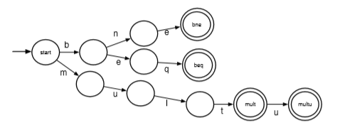

*   transition states based on the character. if there is no transition to next input character, reject the word. if input is exhausted, accept the word.

## regular languages
__defn.__ a language over an alphabet $\Sigma$ is regular if
1.  it is the empty language $\{\}$, or the language consisting of the empty word, $\{\epsilon\}$
2.  it is a language of the form $\{a\}$ for some $a\in\Sigma$
3.  it is a language built using union, concatenation, or Kleene star of two regular languages

let $L,L_1,L_2$ be regular languages, then the following are regular:
*   __union__: $L_1\cup L_2=\{x:x\in L_1 \text{ or }x\in L_2\}$  
    *   __eg.__ { up, down } ⋃ { hill, load } = { up, down, hill, load }
*   __concatenation__: $L_1L_2=\{xy:x\in L_1,y\in L_2\}$
    *   __eg.__ { up, down }{ hill, load } = { uphill, upload, downhill, download }
*   __Kleene star__: $L^*=\{\epsilon\}\cup\{xy:x\in L^*,y\in L\}=\bigcup_{n=0}^\infty L^n$, where $L^0=\{\epsilon\}$, $L^n=LL^{n-1}$
    *   __eg.__ { a, b }* = { ε,a,b,aa,ab,ba,aaa,bb,aba,... }

### regular expressions

__eg.__ regular expression for language over $\{a,b\}$ where words in the language have an odd number of $a$'s is $b^*ab^*(ab^*ab^*)^*$.

__eg.__ for even number of $a$'s: $b^*(ab^*ab^*)^*$.

__eg.__ a+ is same as aa*

# Week 5. June 8

## deterministic finite automata

*   one symbol only corresponds to transition to one target state
*   errors states are implicit: if a state does not define a transition on a symbol, it is error

__defn.__ a _DFA_ is a 5-tuple $(\Sigma,Q,q_0,A,\delta)$
*   $\Sigma$ is a finite non-empty set (alphabet)
*   $Q$ is a finite non-empty set of states
*   $q_0\in Q$ is a start state
*   $A\subseteq Q$ is a set of accepting states
*   $\delta:(Q\times\Sigma)\rightarrow Q$ is the [total] transition function

__eg.__ the DFA for $L=ab^*a$ is
*   $\Sigma=\{a,b\}$
*   $Q=\{S1,S2,S3\}$
*   $q_0=S1$
*   $A=\{S3\}$
*   $\delta(S1,a)=S_2,\delta(S2,b)=S_2,\delta(S2,a)=S3$. (note for some combination undefined, they are considered $\delta(q,w)=ERR$)

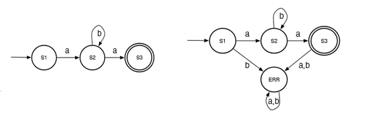

(left: shorthand)

__eg.__ labels in mips consisting of alphanumeric letters:
*   $\Sigma=\{a...z,A...Z,0...9,:\}$
*   $Q=\{q_0,q_1,q_2\}$
*   $q_0$ is start state
*   $A=\{q_2\}$
*   $\delta(q_0,\text{letter})=q_1,\delta(q_1,\text{letter or digit})=q_1,\delta(q_1,:)=q_2$. all others lead to error state

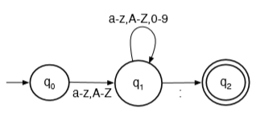

### DFA recognition algorithm

extend the definition of $\delta$ to handle a sequence of transitions based on input string and provide the resulting state after the _sequence of characters_ in the string has been consumed (left fold)
$$
\begin{aligned}
    \delta^*:(Q\times\Sigma^*)&\rightarrow Q\\
    (q,\epsilon)&\mapsto q\\
    (q,aw)&\mapsto\delta^*(\delta(q,a),w)
\end{aligned}
$$
where $a\in\Sigma,w\in\Sigma^*$.

__defn.__ a DFA given by $M=(\Sigma,Q,q_0,A,\delta)$ _accepts a string_ $w$ iff $\delta^*(q_0,w)\in A$.

__eg.__
```cpp
dfa_recog(w=w[1]w[2]...w[n], s=q[0]):
    for i = 1, n:
        s = delta(s, w[i]) or reject(w) /* if s is error */
    if s in A:
        accept(w)
    else:
        reject(w)
```

__defn.__ the _language of a DFA_ $M$, is $L(M)=\{w: M\text{ accepts } w\}$.

__theorem.__ _(Kleene)_ $L$ is regular iff $K=L(M)$ for some DFA $M$. ie the regular languages are precisely the languages accepted by DFAs.

__eg.__ dfa that correctly recognizes $0,$1,...,$31

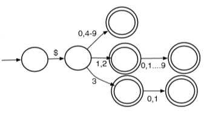

### finite transducer
*   for each transition, add an action to perform while taking the transition

__eg.__ convert a string of binary digits to its decimal representation (N)

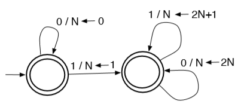

if input is "1011", when string is consumed, the number N is the decimal representation 11.
```lua
function convert(s)
    local n
    local state1, state2, errorstate = {}, {}, {}
    local state = state1
    local function delta(currstate, inputc) --> state
        if currstate == state1 then
            if inputc == '0' then
                n = 0
                return state1
            elseif inputc == '1' then
                n = 1
                return state2
            else
                return errorstate
            end
        elseif currstate == state2 then
            if inputc == '0' then
                n = 2 * n
                return state2
            elseif inputc == '1' then
                n = 2 * n + 1
                return state2
            else
                return errorstate
            end
        else
            error()
        end
    end
    for c in s:gmatch('.') do
        state = delta(state, c)
    end
    return n
end
print(convert('1011'))
```

## non-deterministic finite automata

*   allow more than one transition from a state on the same symbol. the machine chooses which path to go on

__defn.__ an _NFA_ is a 5-tuple $(\Sigma,Q,q_0,A,\delta)$:
*   $\Sigma$ is a finite non-empty set (alphabet)
*   $Q$ is a finite non-empty set of states
*   $q_0\in Q$ is a start state
*   $A\subseteq Q$ is a set of accepting states
*   $\delta:(Q\times\Sigma)\rightarrow 2^Q$ is the [total] transition function. note $2^Q$ denotes all subsets of $Q$.

only difference: DFA's transition function outputs a state, NFA's transition function outputs a _set_ of states.

### NFA recognition algorithm
can extend the definition of $\delta$:
$$
\begin{aligned}
    \delta^*:(2^Q\times\Sigma^*)&\rightarrow 2^Q\\
    (S,\epsilon)&\mapsto S\\
    (S,aw)&\mapsto\delta^*\left(\bigcup_{q\in S}\delta(q,a),w\right)
\end{aligned}
$$
where $a\in\Sigma$.

__defn.__ an NFA _accepts a string_ $w$ iff $\delta^*(\{q_0\},w)\cap A\neq\varnothing$.

> “board game style” interpretation of NFA recognition: you start with one piece in the start state. When you read a symbol, you remove your piece from the current state, and then place new pieces in each of the states you transition to on the corresponding symbol. Drop the pieces if it  In each turn, you do this for all the states you are currently in. You accept when at least one of your pieces is in an accepting state after reading the whole word.

__eg.__
```cpp
nfa_recog(w=w[1]w[2]...w[n], S={q[0]}):
    for i = 1, n:
        S = {...delta(q, w[i]) for q in S}
            or reject(w) /* if S = {} */
    if S ⋂ A is not Ø:
        accept(w)
    else:
        reject(w)
```

__eg.__ for the language L = {w: w ends with bba} over the alphabet {a,b}

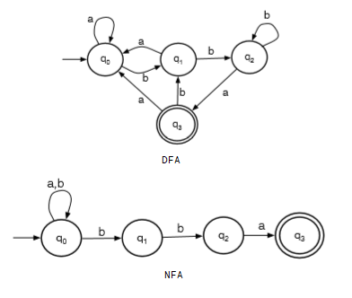

given an input word, the machine chooses to stay at q0 until it sees the ending bba. eg if the input is abbba:
|seen|remain|S|
|:-:|:-:|:-:|
|ε|abbba|{q0}|
|a|bbba|{q0}|
|ab|bba|{q0,q1}|
|abb|ba|{q0,q1,q2}|
|abbb|a|{q0,q1,q2}|
|abbba|ε|{q0,q3}|

{q0,q3} has accepting state q3, so abbba is accepted.

__defn.__ _the language of an NFA_ $M$, is $L(M)=\{w: M\text{ accepts } w\}$.

## NFA to DFA
*   can write down all $2^Q$ possible sets of states (as one final state) and connect them based on $\delta^*$.

subset construction
1.   start with state $S=\{q_0\}$.
2.   using the NDA, determine what happens for each $q\in S$ separately for each symbol $a\in\Sigma$. the set of resulting states becomes it own state in DFA and a transition is added from state S to this new state on symbol $a$.
3.   repeat previous step for each new state created until we exhausted every possibility.
4.   accepting states are any states that included an accepting state of the original NFA.

__eg.__  
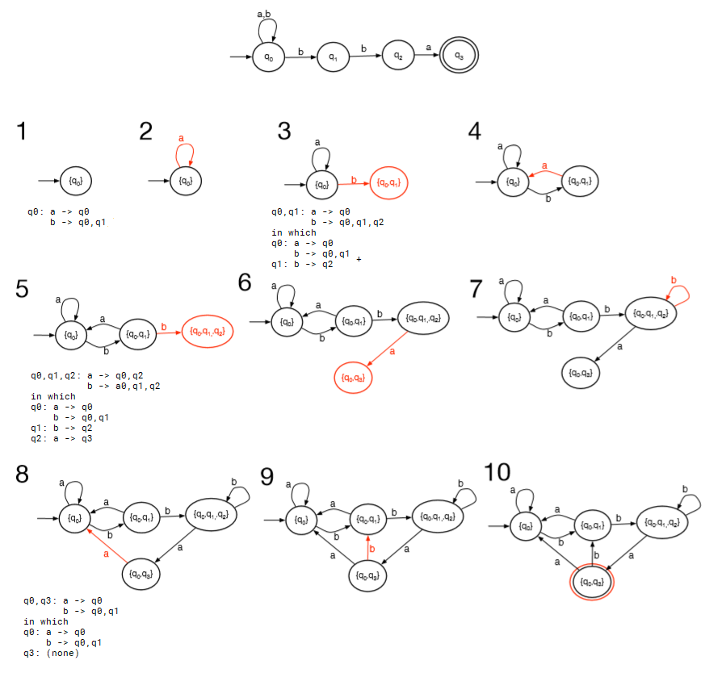

__eg.__ L = {cab}∪{w: w contains even number of a's}  
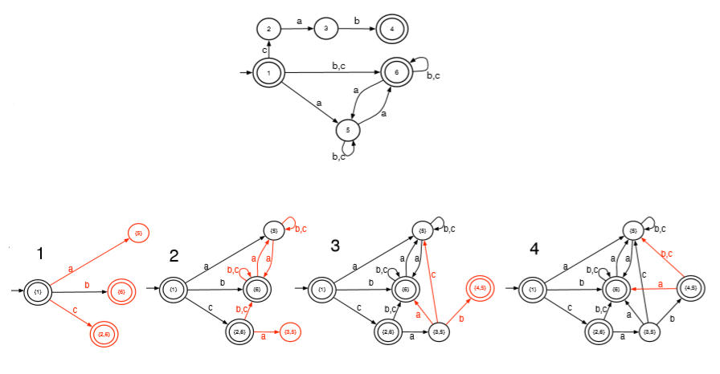

__eg.__ L = {abc}∪{w: w ends with cc}  
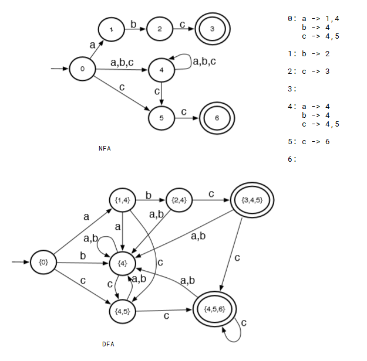

__eg.__ from video  
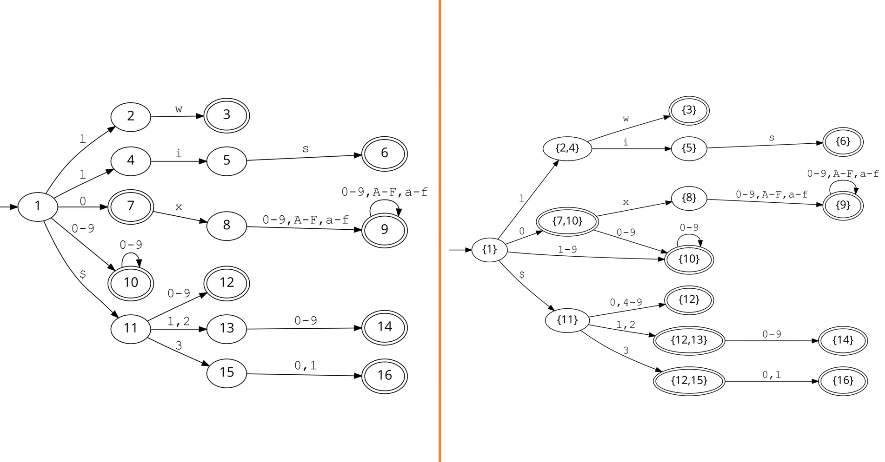

## ε-non-deterministic finite automata

*   allows state transition without consuming a symbol
*   can glue two DFAs

__defn.__ an _ε-NFA_ is a 5-tuple $(\Sigma,Q,q_0,A,\delta)$:
*   $\Sigma$ is a finite non-empty set (alphabet) _that does not contain the symbol $\epsilon$_
*   $Q$ is a finite non-empty set of states
*   $q_0\in Q$ is a start state
*   $A\subseteq Q$ is a set of accepting states
*   $\delta:(Q\times\Sigma\cup\{\epsilon\})\rightarrow 2^Q$ is the [total] transition function.

### ε-NFA recognition algorithm
__defn.__ the _epsilon closure_ $E(S)$ of a set of states $S$ is the set of all states reachable from $S$ in 0 or more ε-transitions. note $S\subseteq E(S)$.

can extend the definition of $\delta$:
$$
\begin{aligned}
    \delta^*:(2^Q\times\Sigma^*)&\rightarrow 2^Q\\
    (S,\epsilon)&\mapsto S\\
    (S,aw)&\mapsto\delta^*\left(\bigcup_{q\in S}E(\delta(q,a)),w\right)
\end{aligned}
$$
where $a\in\Sigma$.

__defn.__ an ε-NFA _accepts a string_ $w$ iff $\delta^*(\{q_0\},w)\cap A\neq\varnothing$.

__eg.__ L = {abc}∪{w: w ends with cc}  
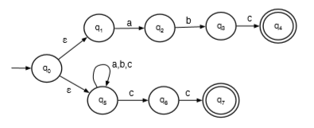  
in which the epsilon closure of q0 is {q0,q1,q5}

### ε-NFA to NFA
1.  if a transition path from `source` state to a `dest` state consists of a sequence of ε transitions followed by a single transition on symbol `a`, add a direct transition from `source` to `dest` labeled with `a`.
2.  if a sequence of ε transitions leads to an accepting state, make all states in the sequence accepting
3.  remove all ε states
4.  remove all unreachable states

__eg.__  
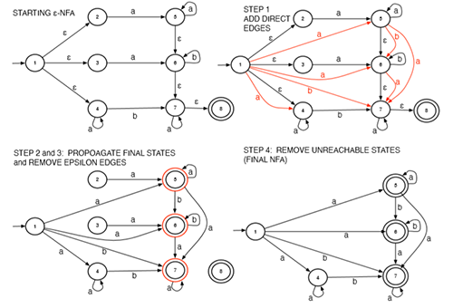

Kleene's theorem also says any regular expression can be converted to an ε-NFA.

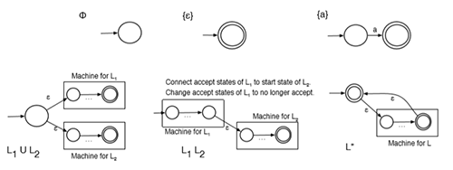

# Week 6. June 15

## maximal munch scanning
*   greedy, tries to find the longest match. uses backtrack if a longer match is not possible

__eg.__ L={a,b,abca}

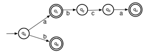
> Consider the input s = ababca. The algorithm consumes a and flags this state, q1, as it is accepting. Being greedy, the algorithm continues to consume more input rather than outputting this token. The algorithm consumes b and reaches state q2. At this point, the algorithm is stuck; it is not at an accepting state and there is no transition on symbol a (the next symbol in the input). The algorithm backtracks to the last seen accepting state, “un-consuming” input that it had greedily consumed. The last seen accepting state is q1, when only a had been consumed. The algorithm outputs an a token and resets the state to q0, the start state. The algorithm then resumes consuming b and flags state q5 as the last seen accepting state. At this point, the algorithm is stuck again as there is no transition on a. Since the current state is an accepting state, the algorithm outputs token b and resets to q0. The algorithm then consumes the second a, the second b, the first c, the third a and runs out of input. This last state, q4, is accepting so the last token abca is output.

problem: above procedure is O(n^2). eg `L="abc|(abc)*d"` with input `"abcabcabcabcabcabcabcabcabc"`.

problem: consider language `L={aa,aaa}`. if input is aaaaa, max munch gives `aaa`, `aaa`; if input is `aaaa`, max munch gives `aaa` even if `aa,aa` is possible.

### simplified maximal munch
*   do not do any back track at all.
*   eg `L={a,b,abca}`, input is `ababca`. it is rejected when the state is stuck at second `a`
```cpp
simplified_mm(w=w[1]w[2]...w[n], s=q[0]):
// for DFA
    for i = 1, n:
        next = delta(s, w[i])
        if next is error:
            if s in A:
                yield token for state s
                // continue with remaining characters
                s = q[0]
            else:
                reject(w)
        else:
            s = next
    if s in A:
        yield token for state s
        accept(w)
    else:
        reject(w)
```

# Week 7. June 23

typical compiler components:
```
                                                        parse tree
                                                        symbol
input  +---------+        +---------+parse  +----------+table  +-----------+ output
code   |         | token  |         |tree   |context   |...    | code      | code
+----> | scanner +------> | parser  +-----> |sensitive +-----> |generation +------->
       +---------+        +---------+       |analysis  |       +-----------+
                                            +----------+
                           analysis                              synthesis
        <---------------------------------------------->       <----------->
```
scanner weeds out lexically invalid programs (wrong keyword); context sensitive analysis weed out weed out semantically invalid programs (undefined identifier...)

## balanced parentheses problem

to recognize valid arithmetic expressions from `Σ={ID (var name) ,OP (+=*/) ,LPAREN, RPAREN}`, the following DFA can be used

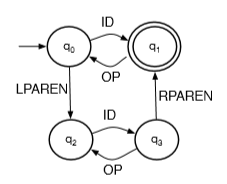

this allows one level paren eg `(a+b)*(c-d)`. (to allow nested parens, append after the second line with same arrows)

this regular language does not allow infinite nestings.

## context free grammars

__defn.__ a _context free grammar (CFG)_ is a 4 tuple:
*   $N$ is a finite, nonempty set  of _non-terminal symbols_
*   $T$ is an alphabet; a finite, nonempty set of _terminal symbols_
*   $P$ is a finite set of _productions/rules_, each of the form $A\rightarrow\beta$ where $A\in N,\beta\in(N\cup T)^*$
*   $S\in N$ is a start symbol

the set of all symbols $V=N\cup T$ is called the _vocabulary_.

__eg.__ a CFG representing valid arithmetic expressions with arbitrary balanced parens:  
```
N = { expr }
T = { ID, OP, LPAREN, RPAREN }
productions:
expr -> ID
expr -> expr OP expr
expr -> LPAREN expr RPAREN
S = expr
```
note each lhs must have a non-terminal, each rhs can have both terminal and non-terminal.

### conventions
*   $a,b,c,...$ are elements of $T$ (_terminals_)
*   $w,x,y,z,...$ are elements of $T^*$ (_words_)
*   $A,B,C,...$ are elements of $N$ (_non-terminals_)
*   $\alpha,\beta,\gamma,...$ ar elements of $V^*$ (_sequences of terminals and non-terminals_)
*   when not specified, the non-terminal on lhs of the first production is the start symbol

__defn.__ over a $CFG(N,T,P,S)$, we say $A$ _directly derives_ $\gamma$, $A\Rightarrow\gamma$, iff there is a rule $A\rightarrow\gamma$ in $P$.

__defn.__ over a $CFG(N,T,P,S)$, we say $\alpha$ _derives_ $\beta$, $\alpha\Rightarrow^*\beta$, if either $\alpha=\beta$, or there exists $\gamma$ such that $\alpha\Rightarrow\gamma$ and $\gamma\Rightarrow^*\beta$.

__defn.__ over a $CFG(N,T,P,S)$, a _derivation of a string of terminals_ $x$ is a sequence $\alpha_0\alpha_1...\alpha_n$ such that $\alpha_0=S$ and $\alpha_n=x$ and $\alpha_i\Rightarrow\alpha_{i+1}$ for $0\leq i\leq n$.

CFG is a set of rewriting rules that expand every non-terminals on rhs by terminals

__eg.__ `expr` directly  derives `ID` because there is `expr -> ID` in productions.

__eg.__ show `expr =>* ID OP LPAREN ID OP ID RPAREN`
```
expr => expr OP expr                        (apply expr -> expr OP expr)
     => ID OP expr                          (apply expr -> ID)
     => ID OP LPAREN expr RPAREN            (apply expr -> LPAREN expr RPAREN)
     => ID OP LPAREN expr OP expr RPAREN    (apply expr -> expr OP expr)
     => ID OP LPAREN ID OP expr RPAREN      (apply expr -> ID)
     => ID OP LPAREN ID OP ID RPAREN        (apply expr -> ID)
```
each step of the derivation chooses a non-terminal from the current $\alpha_i$ and rewrites it by replacing it with the rhs of some rule for that non-terminal.

### context free languages

__defn.__ the _language_ of a $CFG(N,T,P,S)$ is $L(G)=\{\omega\in T^*:S\Rightarrow^*w\}$.
*   $w$ must be all terminals.

__defn.__ a language is context-free iff there exists a CFG $G$ such that $L=L(G)$.
*   every regular language is context-free.

__eg.__ let $T=\{a,b\}$, write a CFG for $\{a^nb^n:n\in\mathbb{N}\}$. find a derivation for string $aaabbb$.
```
N = { S }
T = { a, b }
productions:
S -> ε
S -> aSb

aaabbb:
S => aSb => aaSbb => aaaSbbb => aaabbb
```
the shorthand is $S\rightarrow \epsilon|aSb$. note the lhs, first production rule tells the start symbol; and N, T are inferred from rules.

__eg.__ write a CFG for palindromes over { a,b,c }.
```
S -> aSa | bSb | cSc | M
M -> a | b | c | ε
```

__eg.__ write a CFG for regular expression `a(a|b)*b`.
```
S -> aMb
M -> aM | bM | ε
```

__eg.__ write a CFG for regular expression `a|b+`.
```
S -> a | M
M -> b | M b
```

### reduced grammars
if grammar has useless production rule of infinite recursion it is not reduced.

## parse trees
__eg.__ consider language L(G) = { abgh, abgef, cdgh, cdgef }
```
S -> BgC
B -> ab|cd
C -> h|ef
```
then for string `abgef` it has two derivations, but resulting in same parse tree
```
S => BgC => Bgef => abgef  (rightmost derivation, expand right non-terminal first)
S => BgC => abgC => abgef  (leftmost derivation, expand left non-terminal first)
                   
         S         
       / | \       
      /  |  \      
     /   |   \     
    B    g    C    
   / \       / \   
  /   \     /   \  
 /     \   /     \ 
a       b e       f
```
the root is the start symbol; non-leaf node is a non-terminal and its immediate descendants are rhs of the rule; leaf nodes are terminals of ε.  
parse trees has two properties:
*   a derivation uniquely defines a parse tree
*   an input string can have more than one parse tree

## ambiguous grammars

__defn.__ a grammar is _ambibuous_ if ther eis a word in the language which has more than one distinct leftmost derivation, or more than one distinct rightmost derivation.

__eg.__ consider a CFG for arithmetic operations
```
S -> a|b|c|SRS
R -> +|-|*|/
```
the string `a - b * c` has two derivations even with leftmost derivation:

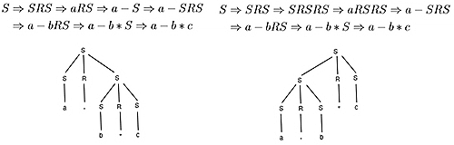

we can force a pair of brackets to specify the order, so that only `((a-b)*c)` or `(a-(b*c)) ` are accepted:
```
S -> a|b|c|(SRS)
R -> +|-|*|/
```

we can make the language right/left associative by controlling the recursion depth:

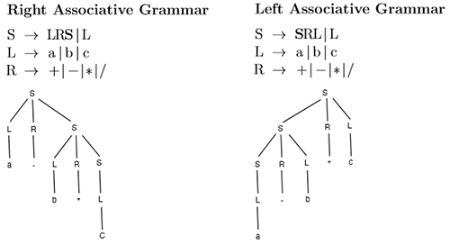

we can make * and / appear further down the tree so they take precedence:
```
S -> SPT|T
T -> TRF|F
F -> a|b|c|(S)
P -> +|-
R -> *|/
```
eg the input `a - b * c` has following tree:

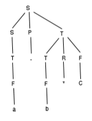

expression is evaluated using post-order, depth-first traversal.
```cpp
eval_tree(t):
    switch t:
        S -> SPT: return eval_expr(t.S, t.P, t.T)
        T -> TRF: return eval_expr(t.T, t.R, t.F)
        S -> T: T -> F: return eval_tree(t.child)
        F -> a|b|c: return values
        F -> (S): return eval_tree(t.S)
        P -> +|-: R -> *|/: return t.operator

eval_expr(left_tree, op_tree, right_tree):
    auto left = eval_tree(left_tree)
    auto op = eval_tree(op_tree)
    auto right = eval_tree(right_tree)
    return left op right
```

## decidability of ambiguous grammars
*   given a context free language $L$, there is no gurantee that an unambiguous grammar such that $L(G)=L$ exists.
*   it is not possible to algorithmically recognize whether a grammar is ambiguous.
*   given CFGs $G_1,G_2$ it is not algorimically determine whether $L(G_1)=L(G_2)$, whether $L(G_1)\cap L(G_2)=\varnothing$.

> Formally, context-free languages can be recognized by a model of computation called _Pushdown Automata_. A Pushdown Automaton (PDA) is a Finite Automaton with the addition of a stack, and stack actions on transitions: Each transition may push a symbol to the stack, pop a symbol, and/or require that a given symbol be on the top of the stack. Like Finite Automata, there are Deterministic PDA’s and Nondeterministic PDA’s. But, while the number of states is finite like Finite Automata, the stack is potentially infinite, and because of this infinite component, there is no conversion of NPDA’s to DPDA’s equivalent to the conversion of NFA’s to DFA’s. Without this conversion, it’s impractical to actually use PDA’s to recognize context-free languages. Instead, we use a number of parsing algorithms which are less powerful than PDA’s, parsing only a subset of CFL’s, but which are much more practical.

# Week 8. June 29

## augmented grammars
it is better if the start symbol has only one production rule. if not, we can augument the grammar CFG $G(N,T,P,S)$ to create $G'(N',T',P',S')$:
$$
\begin{aligned}
N^{\prime}&=N \cup\left\{S^{\prime}\right\}\\
T^{\prime}&=T \cup\{\vdash, \dashv\}\\
P^{\prime}&=P \cup\left\{S^{\prime} \rightarrow\, \vdash S \dashv\right\}\\
\end{aligned}
$$
where $S'$ is new start state with only one rule, $\vdash,\dashv$ are begin of file and end of file.

## top-down parsing
### LL(1)
given a string, we want to output a (leftmost) derivation. ie a sequence $\alpha_1...\alpha_n$.

__defn.__ _LL(1)_ means Left to right, Leftmost derivations, look ahead at 1 symbol.

__defn.__ a grammar is $LL(1)$ iff each cell of the predict table contains at most one rule.

following parsing is LL(1) parsing:
```cpp
top_down_parse(input):
    // given a first matched character a, current nonterminal A,
    // predict[A][a] gives a possible derivation
    auto stk = new stack
    stk.push(S')
    for a in "⊢ input ⊣":
        auto A = stk.top()
        // if TOS (top of stack) is a non terminal
        while A in N:
            stk.pop()
            if predict[A][a] gives "A -> γ":
                push to stk symbols in γ right to left
                // at his point link items in stack with tree nodes
                // at this point yield read+stack snapshot for derivation
            else:
                reject(input)
        // if TOS is a terminal
        if stk.top() != a:
            reject(input)
        else: // match
            stk.pop()
            // at this point put the actual string to token node
    accept(input) // stk is necessarily empty
```
it rejects input when 1. TOS is a terminal, but does not match the next input symbol, 2. the algorithm queries `predict` but finds no rules or multiple rules

__eg.__  
```
productions:           predict
1. S' -> ⊢ S ⊣            ⊢ a b c d w x y z ⊣
2. S  -> AyB           S' 1
3. A  -> ab            S     2 2
4. A  -> cd            A     3 4
5. B  -> z             B             6     5
6. B  -> wx
```
input is `abywx`, procedure is

|read|unread|stack||derivations (read+stack)|
|:-|:-|-:|:-|:-|
|ε|⊢ a b y w x ⊣|S'|pop S', `predict[S'][⊢]` gives 1, push ⊣ S ⊢|S'|
|ε|⊢ a b y w x ⊣|⊢ S ⊣|match ⊢|⊢ S ⊣|
|⊢|a b y w x ⊣|S ⊣|pop S, `predict[S][a]` gives 2, push B y A||
|⊢|a b y w x ⊣|A y B ⊣|pop A, `predict[A][a]` gives 3, push b a|⊢ A y B ⊣|
|⊢|a b y w x ⊣|a b y B ⊣|match a|⊢ a b y B ⊣|
|⊢ a|b y w x ⊣|b y B ⊣|match b||
|⊢ a b|y w x ⊣|y B ⊣|match y||
|⊢ a b y|w x ⊣|B ⊣|pop B, `predict[B][w]` gives 6, push x w||
|⊢ a b y|w x ⊣|w x ⊣|match w|⊢ a b y w x ⊣|
|⊢ a b y w|x ⊣|x ⊣|match x||
|⊢ a b y w x|⊣|⊣|match ⊣||
|⊢ a b y w x ⊣|ε||accept||

the derivation is 1, 2, 3, 6: `S' => ⊢S⊣ => ⊢AyB⊣ => ⊢abyB⊣ => ⊢abywx⊣`.

also note the concatenation of read and stack gives the $\alpha_i$'s obtained in the derivation used in parse tree.

### computing predict table

__defn.__
*   $\text{First}(\beta)=\{a\in T':\beta\Rightarrow^*a\gamma,\gamma\in V^*\}$, set of terminals that can be first non terminal symbol of some rule
*   $\text{Nullable}(\beta)=\text{true iff }\beta\Rightarrow^*\epsilon$, nonterminal that derives to empty string
*   $\text{Follow}(A)=\{b \in T': S' \Rightarrow^{*} \alpha A b \beta\text{ for some }\alpha, \beta \in V^{*}\}$, set of terminals that come immediately after A in a derivation starting at the start symbol S'
*   $\text{predict}[A][a]=\{A\rightarrow\beta:a\in\text{First}(\beta)\}\cup\{A\rightarrow\beta:\beta\text{ is nullable and }a\in\text{Follow}(A)\}$

__eg.__
```
1. S' -> ⊢ S ⊣             predict
2. S  -> E S                   ⊢ ⊣ id num : ; if then
3. S  -> ε                  S' 1
4. E  -> id                 S    3  2  2  2 3  2  3
5. E  -> num                E       4  5  6    7
6. E  -> : id S ;
7. E  -> if S then
```
*   iterate through non-terminals
*   if non-terminal -> terminal as first symbol, take that rule containing the first symbol
*   if non-terminal -> non-terminal as first symbol, expand that non-terminal
*   if non-terminal -> ε, consider what might follow this non-terminal

__computing nullable__  
observations:
*   $\text{Nullable}(\epsilon)=\text{true}$
*   $\text{Nullable}(\beta)=\text{false whenever } \beta\text{ has a terminal}$
*   $\text{Nullable}(AB)=\text{Nullable(A)}\land\text{Nullable(B)}$

```cpp
// compute Nullable(A) for all A in N'
nullable = [false for A in N']
do:
    for production in P:
        if P is "A -> ε" or (P is "A -> B1...Bk"
            and nullable[B1] == ... == nullable[Bk] == true):
            nullable[A] = true
while nullable changed
```
have to cycle enough times until the nullable result does not change from previous iteration.

__computing first__  
observations:
*   $\text{First}(\text{lhs})\subseteq\text{First}(\text{rhs})$ if lhs -> rhs
*   $\text{First}(a)=\{a\}$ if $a$ is a terminal
```cpp
// compute First(A) for all A in N'
first = [{} for A in N']
do:
    for "A -> B1...Bk" in P:
        for Bi in "B1...Bk":
            if Bi in T':
                first[A] ∪= {Bi}
                break
            else: // non terminal
                first[A] ∪= first[Bi]
            // only look at Bi+1 if current Bi is nullable, otherwise
            // next symbol does not contribute to first(A)
            if !nullable[Bi]:
                break
while first changed
```
we can also only compute first for one B1..., instead of lhs of a production rule
```cpp
first(B1...Bk):
// first(β) where β = B1...Bk in V*
    result = {}
    for Bi in "B1...Bk":
        if Bi in T':
            result ∪= {Bi}
            break
        else:
            result ∪= first[Bi]
            if !nullable[Bi]: break
    return result
```

__computing follow__  
```cpp
// Follow(A) for all A in N (N' - {S'})
follow = [{} for A in N]
do:
    for "A -> B1...Bk" in P:
        for Bi in "B1...Bk":
            if Bi in N:
                follow[Bi] ∪= first(Bi+1...Bk) // second ver
                if (nullable[Bi+1] == ... == nullable[Bk] == true)
                    or i == k:
                    follow[Bi] ∪= follow[A]
while follow changed
```

__computing predict table__  
```cpp
predict = [[{} for all a in T'] for all A in N']
for "A -> β" in P:
    for a in first(β): // second ver
        predict[A][a] ∪= "A -> β"
    if nullable(β):
        for a in follow[A]:
            predict[A][a] ∪= "A -> β"
```

__eg.__
```
1. S' -> ⊢ S ⊣         summary                             predict
2. S  -> b S d             Nullable   First   Follow          ⊢ ⊣ b d p q l
3. S  -> p S q          S'  false       ⊢                  S' 1
4. S  -> C              S   true      b,p,l   ⊣,d,q        S    4 2 4 3 4 4
5. C  -> l C            C   true        l     ⊣,d,q        C    6   6   6 5
6. C  -> ε
```
note this grammar is LL(1) since each entry in predict table has at most 1 rule.

### limitations of LL(1) parsing

__theorem.__ a grammar is $LL(1)$ iff:
*   no two distinct rules with the same LHS can generate the same first terminal
*   no nullable symbol $A$ has the same terminal $a$ in both its first and follow sets
*   there is only one way to derive $\epsilon$ from a nullable symbol

__theorem.__ a grammar is never $LL(k)$ if two or more rules for the same non-terminal with a common left prefix of length $k$.

__theorem.__ a grammar is never $LL(1)$ if it is left recursive.

__eg.__ consider this (left recursive) grammar
```
    1. S -> S + T
    2. S -> T
    3. T -> T * F
    4. T -> F
5.6.7. F -> a | b | c
```
it is not LL(1) since rules 1, 2, with same lhs can generate the same terminal. can show $S\rightarrow T\in\text{predict}[S][a]$ since $\{a\} \subseteq\text{First}(F)\subseteq\text{First}(T)$, and $S\rightarrow S+T\in\text{predict}[S][a]$ since $\{a\}\subseteq\text{First}(F)\subseteq\text{First}(T)\subseteq\text{First}(S)\subseteq(S+T)$.

solution 1: we can convert it to right recursive, then apply _left factoring_: suppose $A\rightarrow\alpha\beta_1|...|\alpha\beta_n$ all with common prefix $\alpha\neq\epsilon$, we can change it to:  
$A\rightarrow \alpha B$  
$B\rightarrow\beta_1|...|\beta_n$
```
left recursive            right recursive           factored
    1. S -> S + T             1. S -> T + S             1. S -> T X
    2. S -> T                 2. S -> T               2.3. X -> + S | ε
    3. T -> T * F             3. T -> F * T             4. T -> F Y
    4. T -> F                 4. T -> F               5.6. Y -> * T | ε
5.6.7. F -> a|b|c         5.6.7. F -> a|b|c         7.8.9. F -> a|b|c
```

solution 2:
use this transformation when converting from left recursive to right:  
replace $A\rightarrow A\alpha$ with $A\rightarrow\beta A'$  
replace $A\rightarrow\beta$ with $A'\rightarrow\alpha A'|\epsilon$  
where $\beta$ does not begin with the non-terminal $A$.
```
left recursive            right recursive
    1. S -> S + T             1. S -> T S'
    2. S -> T               2.3. S'-> + T S' | ε
    3. T -> T * F             4. T -> F T'
    4. T -> F               5.6. T'-> * F T' | ε
5.6.7. F -> a|b|c         7.8.9. F -> a|b|c
```

but the parse tree is also changed.

# Week 9. July 6
## bottom-up parsing
### LR(0)

> begin reading input symbols one character at a time left to right. If we recognize the RHS of a rule, replace it with its LHS

*   _shift_ of stack: consumes the next input symbol and push it to the stack
*   _reduce_ of stack: pops the RHS of a rule off the stack and pushes its LHS. (if RHS is ε, equivalent to pushing its LHS)

__eg.__  
```
1. S' -> ⊢ S ⊣
2. S  -> AyB
3. A  -> ab
4. A  -> cd
5. B  -> z
6. B  -> wx
```
input is `abywx`:

|read|unread|stack||derivations (stack+unread)|
|:-|:-|:-|:-|:-|
|ε|⊢ a b y w x ⊣||shift ⊢||
|⊢|a b y w x ⊣|⊢|shift a||
|⊢ a|b y w x ⊣|⊢ a|shift b||
|⊢ a b|y w x ⊣|⊢ a b|reduce rule 3: pop b,a; push A|⊢ a b y w x ⊣|
|⊢ a b|y w x ⊣|⊢ A|shift y||
|⊢ a b y|w x ⊣|⊢ A y|shift w||
|⊢ a b y w|x ⊣|⊢ A y w|shift x||
|⊢ a b y w x|⊣|⊢ A y w x|reduce rule 6: pop x,w; push B|⊢ A y w x ⊣|
|⊢ a b y w x|⊣|⊢ A y B|reduce rule 2: pop B,y; push S|⊢ A y B ⊣|
|⊢ a b y w x|⊣|⊢ S|shift ⊣||
|⊢ a b y w x ⊣|ε|⊢ S ⊣|reduce rule 1: pop ⊣,S,⊢; push S'|⊢ S ⊣|
|⊢ a b y w x ⊣|ε|S'|accept|S'|

this produces a reversed, rightmost derivation. the rules are 1, 6, 2, 3.

__defn.__ an _item_ is a production with a bookmark $\bullet$ somewhere on the RHS of the rule.
*   it keep tracks of how much of the rhs of a rule is on the stack

__eg.__ consider
```
1. S' -> ⊢ E ⊣
2. E  -> E + T
3. E  -> T
4. T  -> ID
```
then `E -> ●E + T` is _fresh_ item indicating none of the rhs is on the stack. if the algorithm pushes an E on the stack, we have `E -> E ●+ T`. finally `E -> E + T ●` means all items on rhs are on the stack thus _reducible_.

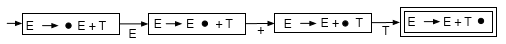

to track all rules at the same time, we can use ε-NFA to glue these automations for each rule together.

> The following steps can be used as a shortcut to produce the DFA directly:
> 1. Create a start state with a fresh item for the single rule for the start symbol
> 2. Select a state qi that has at least one non-reducible item. For each non-reducible item in qi, create a transition to a new state qj on the symbol X that follows the bookmark. Take all items from qi where the bookmark is followed by an X, update the bookmark to be right after X and add them as items in qj.
>>   • For each item in the newly created states, if the symbol following the updated bookmark is a non-terminal, say A, add fresh items for all rules for non-terminal A to the new state. If this creates fresh items where a bookmark is followed by a non-terminal, say B, add fresh items for all rules of B. Repeat if necessary.
> 3. Repeat step 2 until no new states are discovered.
> 4. Mark states containing reducible items as accept states. 

the LR(0) parsing DFA for this grammar is  
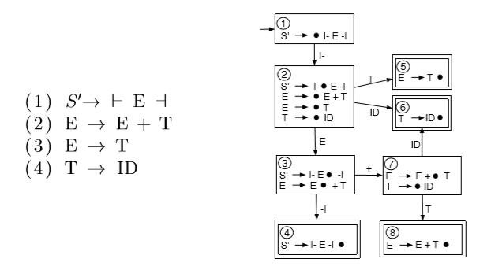

__defn.__ LR(0) means Left to right, Rightmost derivations, not looking ahead symbols.

__defn.__ given a grammar $G=(N,T,P,S)$, $\gamma$ is a _sentential form_ if $S\Rightarrow^*\gamma$. we say $\alpha$ is a _viable prefix_ if it is the prefix of a sentential form, ie $S\Rightarrow^*\alpha y$ for some $y$.

__defn.__ $\texttt{Reduce}(\alpha)=\{A\rightarrow\gamma\,\,\bullet:\alpha=\beta\gamma\text{ and }\beta A\text{ is a viable prefix}\}$

below is LR(0) parsing algorithm
```cpp
// whenever we read a symbol, push it to symbol_stack
// whenever we complete a transition, push the state to state_stack
// when we arrive at an accepting state (reducible), we have to go back k states
// where k is # of symbols
lr_0_parse(input, dfa{Σ,Q,q0,δ,A}):
    auto state_stack = new stack,
         symbol_stack = new stack

    state_stack.push(q0)
    for a in "⊢ input ⊣":
        // for LR(1), SLR(1), LALR(1) this line is
     // while reduce[state_stack.top(), a]  is "B -> γ":
        while reduce[state_stack.top()] is "B -> γ":
            symbol_stack.pop symbols in γ
            state_stack.pop |γ| states
            // state go to B
            symbol_stack.push(B)
            state_stack.push(δ(state_stack.top(), B))
        // cannot reduce, try shift
        symbol_stack.push(a)
        if δ(state_stack.top(), a) is error: reject(input)
        state_stack.push(δ(state_stack.top(), a))

    accept(input)
```
where reduce[state] is a function that given a state, tells us whether this is a reduce state and gives that rule.  
`symbol_stack` can be a tree stack: for terminal, we push leaf nodes, for non-terminals, we pop leaf nodes, connect it to a non-terminal node, then push the non-terminal node back to stack. eventually we will have a parse tree.

__eg.__ input is `⊢ ID + ID ⊣`
|read|unread|symbol stack|state stack||
|:-|:-|:-|:-|:-|
|ε|⊢ ID + ID ⊣||1|state 1 is shift state. shift ⊢|
|⊢|ID + ID ⊣|⊢|1 2|state 2 is shift state. shift ID|
|⊢ ID|+ ID ⊣|⊢ ID|1 2 6|state 6 is reduce state. reduce rule 4|
|⊢ ID|+ ID ⊣|⊢ T|1 2 5|state 5 is reduce state. reduce rule 3|
|⊢ ID|+ ID ⊣|⊢ E|1 2 3|state 3 is shift state. shift +|
|⊢ ID +|ID ⊣|⊢ E +|1 2 3 7|state 7 is shift state. shift ID|
|⊢ ID + ID|⊣|⊢ E + ID|1 2 3 7 6|state 6 is reduce state. reduce rule 4|
|⊢ ID + ID|⊣|⊢ E + T|1 2 3 7 8|state 8 is reduce state. reduce rule 2|
|⊢ ID + ID|⊣|⊢ E|1 2 3|state 3 is shift state. shift ⊣|
|⊢ ID + ID ⊣|ε|⊢ E ⊣|1 2 3 4|state 4 is reduce state. reduce rule 1|
|⊢ ID + ID ⊣|ε|S'||accept as soon as pushing S'|

there is error if no transition on given symbol exists.

### limitations of LR(0) parsing

__defn.__ a _shift-reduce conflict_ occurs when a state in the parsing DFA has two items if the form $A\rightarrow\alpha\bullet a\beta$ and $B\rightarrow\gamma\, \bullet$ where $a\in T'$ and $\alpha,\beta,\gamma\in V^*$.

__defn.__ a _reduce-reduce conflict_ occurs when a state in the parsing DFA has two items of the form $A\rightarrow\alpha\,\bullet$ and $B\rightarrow\beta\,\bullet$ where $\alpha,\beta\in V^*$.

__defn.__ a grammar is $LR(0)$ iff the $LR(0)$ automaton does not have any shift-reduce or reduce-reduce conflicts.

__eg.__  
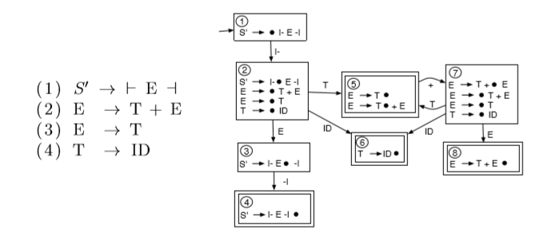  
in state 5, we have two choices: accept E -> T or waiting for another +. we cannot make decision since we cannot look ahead 1 symbol. this is a shift-reduce conflict. so this grammar is not LR(0).

### SLR(1)
means simplied LR(1).

we extend the definition of _items_: for each reducible item, add the follow set for the LHS non-terminal to the item. we thus extend the definition of LR(0) DFA by using one lookahead.

__defn.__ for SLR(1), $\operatorname{Reduce}(\alpha, \mathrm{a})=\{\mathrm{A} \rightarrow \gamma: \alpha=\beta \gamma \text { and } \beta A \text { is a viable prefix and } \mathrm{a} \in \text { Follow }(\mathrm{A})\}$, where $a$ is the next symbol.
*   this is not right. a in Follow set does not mean viable prefix.

__eg.__ for previous not LR(0) grammer,  
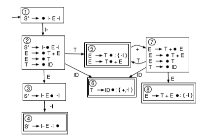

> at State 5. with SLR(1), we added the Follow set for E to the reducible item. The SLR(1) algorithm will reduce using the reducible item only if the next input symbol is in the Follow set of this reducible item. if the next input symbol is ⊣, we will reduce using the rule E -> T. However, if the next input symbol is not ⊣, we will shift the next input symbol (of course if the next input symbol happens to be something other than +, this would generate a parse error).

### limitation of SLR(1)

__eg.__  
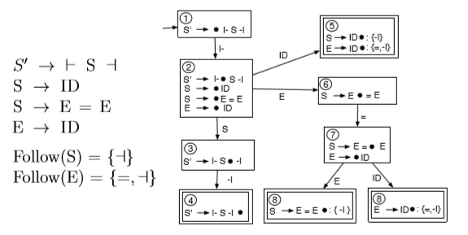

if input is `⊢ ID ⊣`, when in State 5, ⊣ is in both follow sets of the two rules. we do not know what to choose from. ie it is not SLR(1) because the intersection of two follow sets is not empty.

> the LR(1) DFA is created by only adding the lookahead that should be present for a particular rule to be used in the reduce step, ie only adding a subset of the Follow set to each reducible item. for this eg, we should only reduce using the rule S -> ID if the next input symbol is a. similarly, we should only reduce using the rule E -> ID, if the next input symbol is =.

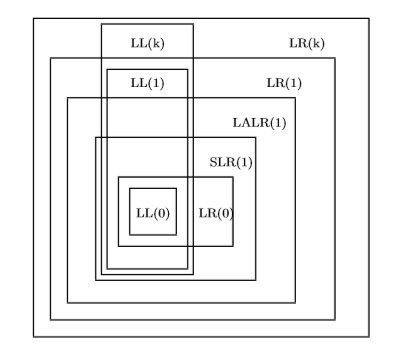

# Week 10. July 13

## context sensitive analysis

### WLP4
[guide](https://www.student.cs.uwaterloo.ca/~cs241/wlp4/WLP4tutorial.html)  
[WLP4 language specification](https://www.student.cs.uwaterloo.ca/~cs241/wlp4/WLP4.html)

sample parse tree:
```cpp
class Tree:
    string rule             // eg expr expr PLUS term
    vector<string> tokens   // from scanner
    vector<Tree> children
```

> the parse tree created by a parser is often called a _Concrete Syntax Tree_. often, this parse tree is passed through a tree transformation stage before applying Context Sensitive Analyses. during this stage, the tree is pruned by removing useless nodes such as those needed to ensure that the grammar is unambiguous and to satisfy the requirements of a specific parsing algorithm. This transformed tree is often called an _Abstract Syntax Tree_.

### identifiers
rules for surrounding variables
*   cannot declare more than one variable with same name in same scope
    *   can have same identifier name across difference scopes
    *   `symbol_table = map<procedure_name, map<variable_name, type>>`
*   a variable cannot be used before declared

```
procedure -> INT ID LPAREN params RPAREN
             LBRACE dcls statements RETURN expr SEMI RBRACE
     wain -> INT WAIN LPAREN dcl COMMA dcl RPAREN
             LBRACE dcls statements RETURN expr SEMI RBRACE
```
since declarations only appear at top of the procedure, just traverse once until `statements` is encountered to get all symbols. when using symbols, traverse through `statements` and find rules `factor -> ID` and `lvalue -> ID`.

__eg.__
```c
int f() { int f = 1; return f + 1; } // valid, local f shadows the function name.
int p(int p) { return p(p); }        // not valid, p is of type int
```

### call procedures
rules of interest are `factor -> ID LPAREN RPAREN` and `factor -> ID LPAREN arglist RPAREN` when calling procedures. before that have to check signatures, and finding the signature of a procedure when creating symbol tables
*   `signature = vector<type>`
*   `symbol_table = map<procedure_name, tuple<signature, map<variable_name, type>>>`

__eg.__
```c
int f() { int *a = NULL; return 9; }
int wain(int a, int b) { int x = 10; return x+a+b; }
```
symbol table:
```js
{
    f: {
        signature: [],
        variables: { a: "int*" }
    },
    wain: {
        signature: [ "int", "int" ],
        variables: { a: "int", b: "int", x: "int" }
    }
}
```

### type checking
a sample statement `a = x + 3` tree looks like  
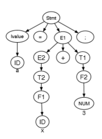

first get the type of ID by traversing first subtree. for rhs, traverse third subtree to get type. error if two are different.

for `expr -> term`, we have `type(expr) = type(term)`.  
for `factor -> LPAREN expr RPAREN`, we have `type(factor) = type(expr)`.

__eg.__ a program tree  
```c
int sum(int *arr, int len) {
    int i = 0;
    int ret = 0;
    while (i < len) {
        ret = ret + *(arr + i);
        i = i + 1;
    }
    return ret;
}
int wain(int *arr, int len) {
    return sum(arr, len) + len;
}
```
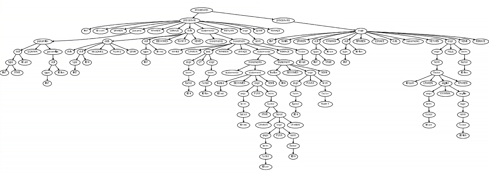

type inference rules for expressions:
*   NUMs have type `int`
*   NULL has type `int*`
*   adding parentheses does not change type
*   taking address of `int` produces `int*`
*   dereferencing `int*` produces `int`
*   `new int[E]` takes an `int` value E and produces an `int*`
*   multiplication, division, modulo, addition, subtraction of two `int`s produces `int`
*   addition of `int*` and `int` and vice versa produces `int*`
*   subtraction of `int*` and `int*` produces `int`
*   subtraction of an `int` from an `int*` produces a pointer
*   a procedure call checks argument types to match and produces that type
*   absense of a rule means error

__defn.__ we say a statement is _well-typed_ if its components are well-typed.

type checking for statements:
*   an expression is well-typed if a type can be inferred
*   `println(E)` statement is well-typed iff E is of type `int`
*   `delete[] E` is well-typed iff E is of type `int*`
*   `E1 = E2` (assignment) is well-typed iff types of lhs and rhs are same
    *   lhs must be lvalue, which is enforced by context free language
*   an empty sequence of statements is well-typed
*   a sequence of statements is well-typed iff each statement is well-typed
*   `E1 < E2`, `E1 <= E2`, `E1 > E2`, `E1 >= E2`, `E1 == E2`, `E1 != E2` is well-typed iff E1 and E2 have same type
*   an `if` statement is well-typed iff test condition, branch1, branch2 are well-typed
*   a `while` statement is well-typed iff test condition, statements are well-typed
*   an empty sequence of declarations is well-typed
*   a variable declared as an `int` is well-typed if it is initialized with an int value
*   a variable declared as an `int*` is well-typed if it is initialized with a `NULL` value
*   a procedure is well-typed if the declarations and statements are well-typed and it returns an `int`
*   pricedure `wain` is well-typed if the second parameter is `int`, and satisfies above condition

the program is syntactically and semantically valid if it passes all tests so far.

## code generation
### variables
__eg.__
```c
int wain(int a, int b) { // $1, $2
    int c = 0;
    return c; // $3
}
```
symbol table:
```
  stack                 symbol table
+--------+
|        |
|        |             sym   type   offset($29)
+--------+ <-$30      +------------------+
|   c    |            | a    int      0  |
+--------+            +------------------+
|   b    |            | b    int     -4  |
+--------+ <-$29      +------------------+
|   a    |            | c    int     -8  |
+--------+            +------------------+
```
generated code:
```sh
# prologue
lis $4              # convention, always store 4
.word 4
sub $29, $30, $4    # setup frame pointer
sw $1, 0($29)       # push a
sub $30, $30, $4    # update stack pointer
sw $2, -4($29)      # push b
sub $30, $30, $4    #
sw $0, -8($29)      # push c
sub $30, $30, $4    #

lw $3, -8($29)       # load c

# epilogue
add $30, $30, $4
add $30, $30, $4
add $30, $30, $4
jr $31
```

__convention.__
```sh
code(expr)
is the generated code that evaluates expr and stores result in $3

code(a) generates:      if a is variable
lw $3, 0($29)           where 0 is offset retrieved from table

push($X) generates:
sw $X, -4($30)
sub $30, $30, $4

pop($X) generates:
add $30, $30, $4
lw $X, -4($30)
```

### arithmetic expressions

__eg.__
```c
int wain(int a, int b) { // $1, $2
    int c = 3;
    return a + (b - c); // $3
}
```
generated code:
```sh
# prologue
lis $4
.word 4
sub $29, $30, $4
push($1)            # use $30 to push, but still use $29 get get values out
push($2)
lis $5
.word 3
push($5)

code(a)             # load a in $3
push($3)            # a to stack top
code(b)             # load b in $3
push($3)            # b to stack top
code(c)             # load c in $3
pop($5)             # b to $5
sub $3, $5, $3      #
pop($5)             # a to $5
sub $3, $5, $3      #

# epilogue
add $30, $30, $4
add $30, $30, $4
add $30, $30, $4
jr $31
```

for addition `expr1 -> expr2 PLUS term`, we have expansion
```sh
when both types are int:
code(expr1) = 
    code(expr2)
    push($3)
    code(term)
    pop($5)             convention: $5 holds intermediate values
    add $3, $5, $3
```
same for `MINUS`, `STAR`, `SLASH` and `PCT`.

for `S -> ⊢ procedure ⊣`, we have `code(S) = code(procedure)`.  
for `expr -> term`, we have `code(expr) = code(term)`.  
for `factor -> LPAREN expr RPAREN`, we have `code(factor) = code(expr)`.

### assignment

for assignment statement `statement -> lvalue BECOMES expr SEMI`, we have
```sh
when lvalue -> ID:
code(statement) =
    code(expr)
    sw $3, offset($29)      where offset is computed; if it is ID
                            then look up symbol table
```

### println statement
for `statement -> PRINTLN LPAREN expr RPAREN SEMI`, we have
```sh
code(println(expr);) =
    push($1)            if current $1 has to be preserved
    code(expr)
    add $1, $3, $0      parameter stored in $1
    push($31)
    lis $5
    .word print         external
    jalr $5
    pop($31)
    pop($1)
```

__convention.__
```sh
# prologue
.import print       # print.merl
.import init        # alloc.merl
.import new
.import delete
lis $4              # 4 always hold 4
.word 4
lis $10             # 10 always hold println
.word print
lis $11             # $11 always hold 1
.word 1
sub $29, $30, $4

# reserve space for variables

# WLP4 code

# epilogue
# deallocate parameters and local variables of wain

jr $31
```
> the only other convention that is not apparent from the snippet above is that while evaluating any arbitrary expression, we use register 5 temporarily hold values.

### comparisons
for `test -> expr1 < expr2` we have
```sh
when both types are int:
code(test) =
    code(expr1)
    push($3)
    code(expr2)
    pop($5)
    slt $3, $5, $3
```

for `test -> expr1 != expr2` we have
```sh
when both types are int:
code(test) =
    code(expr1)
    push($3)
    code(expr2)
    pop($5)
    slt $6, $3, $5
    slt $7, $5, $3
    add $3, $6, $7
```

for `test -> expr1 == expr2`, append `sub $3, $11, $3` to above to flip result (also applicable to `>=`).

### control flow statements

for `statement -> IF (test) {stmts1} ELSE {stmts2}`, we have
```sh
code(statement) =
    code(test)
    beq $3, $0, _else
    code(stmts1)
    beq $0, $0, _endif
    _else:
    code(stmts2)
    _endif:
```

for `statement -> WHILE (test) {statements}`, we have
```sh
code(statement) =
    _while:
    code(test)
    beq $3, $0, _endwhile
    code(statements)
    beq $0, $0, _while
    _endwhile:
```

# Week 11. July 21
### Null value
for `factor -> NULL`, we have
```sh
code(factor) = add $3, $0, $11
```
ie we set `NULL` to 1. so dereferencing `NULL` results in unaligned access error.

### dereference pointers
for `factor1 -> STAR factor2`, we have
```sh
code(factor1) =
    code(factor2)
    lw $3, 0($3)
```
since the code already passes type checks, we know `factor2` is an address.

### take address-of
for `factor -> AMP lvalue`, we have
```sh
when lvalue -> ID:
code(factor) =
    lis $3
    .word offset        look up symbol table
    add $3, $3, $29

when lvalue -> STAR factor2:
code(factor) =
    code(factor2)
```
note there is also third case when `lvalue1 -> ( lvalue2 )`, it degrades to `lvalue2`.

### assignment via pointer dereference
for `statement -> lvalue BECOMES expr SEMI`, we have
```sh
when lvalue -> STAR factor:
code(statement) =
    code(expr)
    push($3)
    code(factor)
    pop($5)
    sw $5, 0($3)
```

### comparisons of pointer type
same as comparisons of `int`, but both sides have to be `int*` (need to look up types). since pointers are unsigned, need to use `sltu`.

### arithmetic involving pointer type
for `expr1 -> expr2 PLUS term` when one operant is int and the other is pointer, we have
```sh
when expr2 is int*, term is int:
code(expr1) =
    code(expr2)
    push($3)
    code(term)
    mult $3, $4
    mflo $3
    pop($5)
    add $3, $5, $3

when expr2 is int, term is int*:
same, but switch order of code(expr2) and code(term)
```

for `expr1 -> expr2 MINUS term`, when `expr2` is `int*` and `term` is `int`, same as above, but change `add` to `sub`.

for `expr1 -> expr2 MINUS term`, when both operands are `int*`, we have
```sh
when both are int*:
code(expr1) =
    code(expr2)
    push($3)
    code(term)
    pop($5)
    sub $3, $5, $3
    div $3, $4
    mflo $3
```

### memory allocation
the presence of module `alloc.merl` is assumed; it provides procedures `new` and `delete`.

for `factor -> NEW INT [expr]`, we have
```sh
code(factor) =
    code(expr)
    add $1, $3, $0
    push($31)
    lis $5
    .word new
    jalr $5             call new
    pop($31)
    bne $3, $0, 1       if success, skip next instr
    add $3, $11, $0     if fails, set $3 to NULL
```

for `statement -> DELETE [ ] expr ;`, we have
```sh
code(statement) =
    code(expr)
    beq $3, $11, _skipdelete
    add $1, $3, $0
    push($31)
    lis $5
    .word delete
    jalr $5
    pop($31)
    _skipdelete:
```
note: `init` must be called before any `new` is called.

### assemble and link output
```sh
cs241.linkasm < output.asm > output.merl
cs241.linker output.merl print.merl alloc.merl > exec.merl
cs241.merl 0 < exec.merl > exec.mips

mips.{twoints,array} exec.mips
```

### procedures
the layout:
```sh
# prologue wain
# wain's code
# epilogue wain
jr $31

# prologue f
# f's code
# epilogue f
jr $31

...
```

for calling procedure `factor -> ID(expr1, ..., exprn)`, with caller-save semantics for the frame pointer, we have
```sh
code(factor) =
    push($29)       caller save $29
    push($31)

    code(expr1)     push arguments
    push($3)
    ...
    code(exprn)
    push($3)

    lis $5
    .word ID        procedure name
    jalr $5

    pop n times     pop arguments

    pop($31)
    pop($29)
```

for defining a procedure `procedure -> int ID ( params ) { dcls stmts RETURN expr; }`, we have
```sh
code(procedure) =
    ID:
    sub $29, $30, $4        assuming caller-saves old frame pointer 
    push registers to save  assuming calle-saves registers
                            5, 6, 7
    code(dcls)
    code(stmts)
    code(expr)
    pop saved registers
    add $30, $29, $4
    jr $31
```

when we call procedure, suppose we preserve $5,$6,$7 in the procedure, the stack layout is
```c
int foo(int a, int b) { int c = 3; int d = 4; ... }
int wain(...) { foo(1, 2); ... }
```
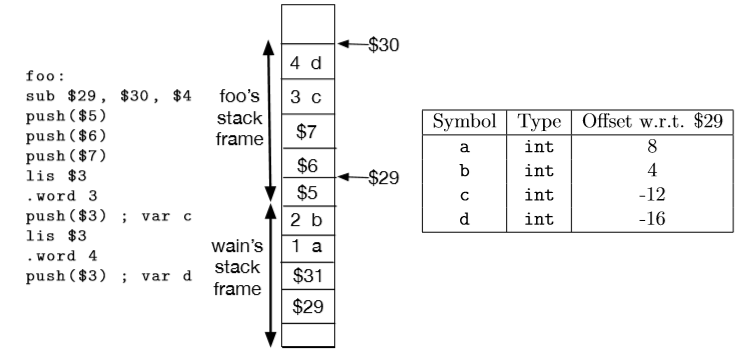
> parameter i is at 4(n−i+1) where n is the number of parameters. this gives us the offsets 4(21+1)=8 for a which is parameter 1 and 4(2-2+1)=4 for b which is parameter 2.  
> local variable i is at −4r−4(i−1) where r is the number of registers to preserve. in the example above, r was 3 so local variable 1, ie c is at offset -4(3)-4(1-1)=-12 and local variable 2, ie d, is at offset -4(3)-4(2-1)=-16.

# Week 12. July 27

## compiler optimizations
### constant folding
__eg.__ fold 1+2
```sh
original:
lis $3 .word 1      # code(1)
sw $3, -4($30)
sub $30, $30, $4    # push($3)
lis $3
.word 2             # code(2)
lw $5, 0($30)
add $30, $30, $4    # pop($5)
add $3, $5, $3      # 1+2

improved:
lis $3
.word 1             # code(1)
add $5, $3, $0
lis $3
.word 2             # code(2)
add $3, $5, $3

improved:
lis $3
.word 5
```

### constant propagation
__eg.__ fold `const int x = 1; return x + x;`
```sh
original:
lis $3
.word 1
sw $3, -12($29)     # x at offset -12
lw $3, -12($29)     # load operand 1
sw $3, -4($30)
sub $30, $30, $4    # push operand 1
lw $3, -12($29)     # load operand 2
lw $5, 0($30)
add $30, $30, $4    # pop operand 1
add $3, $5, $3      # x+x

improved:
lis $3
.word 1
sw $3, -12($29)
lis $3
.word 2
```

### eliminate common sub-expression
__eg.__ improve `x+x`
```sh
original:
lw $3, -12($29)     # load operand 1
sw $3, -4($30)
sub $30, $30, $4    # push operand 1
lw $3, -12($29)     # load operand 2
lw $5, 0($30)
add $30, $30, $4    # pop operand 1
add $3, $5, $3      # x+x

improved:
lw $3, -12($29)
add $3, $5, $3
```

### eliminate dead code
__eg.__
```c
if (a < b) {
    if (b < a) {
        // dead
    } else {}
} else {}

int x = 5;
int y = 10;
if (y < 2 * x) {
    // dead
} else {}

int z = 0;
// never use z
```

### allocate registers
>  for efficiency it would be nice if the compiler could store all, or as many as possible, variables in registers

### strength reduction
> in the real world, addition is much faster than multiplication. this means that it might be a good idea to replace multiplying with addition. a classic example is that instead of generating code for n*2, it is better to generate code for n+n

__eg.__ n*2 to n+n
```sh
original:
load n into $3
sw $3, -4($30)
sub $30, $30, $4
lis $3
.word 2
lw $5, -4($30)
add $30, $30, $4
mult $3, $5
mflo $3

improved:
load n into $3
add $3, $3, $3
```

### peephole optimizations
look for patterns in the generated code and replace with more efficient ones

__eg.__ a+b
```sh
original:
lw $3, offset_a($29)
push($3)
lw $3, offset_b($29)
pop($5)
add $3, $5, $3

after:
lw $3, offset_a($29)
add $5, $3, $0
lw $3, offset_b($29)
add $3, $5, $3
```
if the code is
*   a push of a register value
*   some code that does not update the stack
*   a pop into a register

we do not need to push and pop.

### inline procedures
```c
// original:
int foo(int x) { return x + x; }
int wain(int a, int b) { return foo(a); }

// improved:
int wain(int a, int b) { return a + a; }
```

### tail recursion
we do not grow stack but reuse the current one. for `factor -> ID(expr1, ..., exprn)` we have
```sh
code(factor) =
    code(expr1)
    sw $3, offset_param1($29)
    ...
    code(exprn)
    sw $3, offset_paramn($29)
    add $30, $29, $4            reset stack pointer to bottom of stack
    lis $5
    .word ID
    jr $5
```
that applies if the recursion is this pattern:
```c
int fact(int n, int acc) {
    int ret = 0;
    if (n == 0) { ret = acc; }
    else { ret = fact(n-1, acc*n); }
    return ret;
}
```

### overloading
__eg.__ name mangling
```c
// before:
int foo();
int foo(int a, int *b);

// after:
int F_foo();
int Fip_foo(int a, int *b);
```

## memory management: heap

### freelist algorithm
the allocator begins with a linked list containing one node representing the entire pool of free memory. each block has
*   `free` pointer points to the start of the free block
*   first word in the block stores the amount of memory available in this block
*   second word is a pointer to the next free block (set to null at beginning)

__eg.__
initial memory of 1024 bytes:
```
free
  v
  +----+-+--------------------------------------+
  |1024|/|               free                   |
  +----+-+--------------------------------------+
  <--------------------------------------------->
                     1024 bytes
```
after doing `A = new char[16], B = new char[28]`. note 4 bytes more is allocated at the front of each block, containing block size, the address returned to the user is after this word:
```
                    free
                      v
  +---------+---------+---+-+--------------------+
  |    A    |    B    |972|/|                    |
  +---------+---------+---+-+--------------------+
  <--------><--------><-------------------------->
      20        32              972 bytes
```
after doing `free(A)`, this free block is added to the front of the free list:
```
free       next free
  |   +---------------+
  v   |               v
  +--+-+----+---------+---+-+------------------+
  |20|*|    |    B    |972|/|                  |
  +--+-+----+---------+---+-+------------------+
```
after doing `free(B)`:
```
free
  |   +-----+   +-----+
  v   |     v   |     v
  +--+-+----+--+-+----+---+-+-------------------+
  |20|*|    |32|*|    |972|/|                   |
  +--+-+----+--+-+----+---+-+-------------------+

```
at this point there are contiguous blocks, which can be merged into one.

problem: repeated allocation and deallocation creates "holes" in the heap.

__eg.__ different heuristics-based approaches
```
+----+--+--------+--+-----+-------------+
|####|20|########|15|#####|     100     |
+----+--+--------+--+-----+-------------+
```
to allocate 10 bytes, options are
*   first fit: find the first satisfying block: 20
*   best fit: leave smallest hole behind: 15
*   worst fit: find biggest block: 100

### binary buddy system
only allocate blocks of size $2^k$. to request block of 20 bytes, will need to allocate 32 bytes. if it is available, use it, otherwise the smallest block bigger than 32 is split into "buddies" of the same size repeatedly.

__eg.__ first request 20 bytes, then 40 bytes
```
 A       B
+--+--+-----+-----------+------------------------+--------------------------------------------+
|32|32| 64  |    128    |         256            |                   512                      |
+--+--+-----+-----------+------------------------+--------------------------------------------+
codes:
100000 100001 10001 1001 101 11
```

> each block is assigned a code. the biggest initial block (1024 in eg) gets the code 1. when we break the block into two 512 byte nodes, the left buddy gets the code 10 and the right buddy the code 11. if the 10 block is split, the left buddy that is created gets the code 100 and the right buddy 101. note first, a block can find its buddy by simply flipping its own last bit. second, if a block's code has n digits, the size of the block is $1024/2^{n−1}$.
> 
> when memory is allocated, the free list can be searched for an appropriate sized block. this search can be conducted by determining the number of digits expected in the block size to be allocated (eg to allocate a 32 byte block we need to look for a block which has 6 digits in its code). if the free list has a 6 digit code, that block is chosen. If such a block is not found, a block with the most digits still less than the digits we wanted is chosen and split, eg 5.
>
> when a block is deallocated, the allocator can search for its buddy in the free list. if the buddy is found in the free block, the blocks are merged. 

disadvantage: causes internal fragmentation.

### garbage collection

#### _reference counting_
*   keeps track of the number of pointers that point to each block; whenever a block has reference ount 0, reclaim that memory
*   costs computational resources
*   problem: circular references

#### _mark and sweep_
*   > begins with a Mark phase where it discovers parts of the heap that are reachable from the stack and global variables. the entire stack (and global variables) are scanned for pointers leading into the heap. each such heap block is marked as reachable. if the marked heap blocks contain pointers, the algorithm repeatedly follows any such pointers to discover new parts of the heap that are also reachable.
*   > once the entire reachable part of the heap has been marked, the algorithm conducts the sweep phase; any block that was not marked is deallocated.
*   when gc runs, the program has to be stopped
*   works better when most objects survive collection

#### _copying collector_
*   splits heap into two halves named `from` and `to`, memory is only allocated from the `from` part. when this half fills up, the gc copies the reachable parts from `from` to `to`, then reverse these rules.
*   problem: stop the world; halves the amount of the available memory
*   works well when few objects survive collection

# Week 13. August 3

## loading and linking
### loader

the OS chooses programs and run them sequentially. pseudo-code for OS:
```
repeat:
    p <- choose program to run
    $3 <- loader(p)
    jalr $3
    beq, $0, $0, repeat
```
loader:
```cpp
a = findFreeRAM(N)
for i = 0, codeLength-1:
    mem[a+4i] = file[i]
$30 <- a + N
return a to OS
```
*   loader searches for a block of memory big enough (N contiguous bytes) for program use
*   the starting address is denoted `a`
*   ith word is copied to memory with this offset
*   `$30` is initialized to be top of stack

the memory assigned to the program includes instructions, stack, heap. can also have read-only data memory and global variables.

since in assemblied mips code, the start address is always assumed to be 0:
*   only label assembler directive is affected
*   `beq, a, b, label` is not affected as offsets are computed relatively
*   `.word label` is affected and address is off by `a` -> relocation needed

so we have to process the code (add offset `a` to each label) so it can be run at different starting addresses.

__defn.__ _object code_ contains machine code for the assembly program and additional needed by the loader and the linker.

### MERL
the assembler will generate MERL format instead of regular mips program.

__eg.__
```sh
 not relocatable asm             MERL relocatable

                                0x00 beq $0, $0, 2          # header
                                0x04 .word endModule        #
                                0x08 .word endCode          #
0x00 lis $3                     0x0c lis $3
0x04 .word 0xabc                0x10 .word 0xabc
0x08 lis $1                     0x14 lis $3
0x0c .word A                    0x18 reloc1:  .word A
0x10 jr $1                      0x1c jr $1
     B:                              B:
0x14 jr $31                     0x20 jr $31
     A:                              A:
0x18 beq $0, $0, B              0x24 beq $0, $0, B
0x1c .word B                    0x28 reloc2: .word B
                                     endCode:               # footer
                                0x2c .word 1                #
                                0x30 .word reloc1           #
                                0x34 .word 1                #
                                0x38 .word reloc2           #
                                0x3c endModule              #
```
before any `.word ` directive, a relocation label is prepended. footer have relocation entries, each entry consists of one word of 1 (REL to indicate this is an entry), followed by an address of a word that must be relocated.

can use this tool to create a MERL file
```sh
cs241.linkasm < input.asm > output.merl
```

to relocate a MERL file:
```cpp
read_word() // skip first word
auto endMod = readWord() // address of end of MERL file
auto codeSize = readWord() - 12 // use third word to compute size of code
auto a = findFreeRAM(codeSize)

for i = 0, codeSize-1, 4: // load actual program starting from a
    MEM[a+i] = readWord()

auto i = codeSize + 12 // start of reloc table
while i < endMod:
    if (auto format = readWord()) != 1:
        /*not a reloc entry*/ throw
    auto loc = readWord() // address to be relocated (relative to MERL)
    MEM[a+loc-12] += a-12
    i += 8
```
never hard code addresses in `.word `, use labels instead.

can use this tool to relocate a MERL file
```sh
cs241.merl 0x1234 < output.merl > output.mips
```

### linking
we want to split assembly code to different files, need to resolve labels that are defined and used in different locations.

the file that uses label `proc`, _external symbol reference (ESR)_ is used in the footer:
```sh
 assembly                MERL

                        beq $0, $0, 2       # header
                        .word endModule     #
.import proc            .word endCode       #
lis $1                  lis $1
.word proc              use1: .word 0      # placeholder for proc
jalr $1                 jalr $1
                        endCode:            # footer
                        .word 0x11          # format code for ESR
                        .word use1          # addr where proc is used
                        .word 4             # length of label
                        .word 112           # p
                        .word 114           # r
                        .word 111           # o
                        .word 99            # c
                        endModule:
```
if `proc` is `import`-ed, it will be resolved at linking instead of being determined offset right away when assembling.

the filr that defines label `proc`, _external symbol definitions (ESD)_ are used:
```sh
 assembly                MERL

                        beq $0, $0, 2       # header
                        .word endModule     #
.export proc            .word endCode       #
proc:                   proc:
jr $31                  jr $31
                        endCode:            # footer
                        .word 0x05          # format code for ESD
                        .word proc          # addr where proc is defined
                        .word 4             # length of label
                        .word 112           # p
                        .word 114           # r
                        .word 111           # o
                        .word 99            # c
                        endModule:
```

to link m1 and m2 in order and produce MERL, use algorithm:
```cpp
auto a = m1.endCode - 12
relocate m2.code by a
add a to each address in REL, ESR, ESD entries of m2
if m1.exports ∩ m2.exports is not Ø:
    throw
// dump labels defined in m2 to m1
for auto (addr1, label) in m1.imports:
    if exists (auto addr2, label) in m2.exports:
        m1.code[addr1] = addr2
        remove (addr1, label) from m1.imports
        add addr1 to m1.relocates
// dump labels defined in m1 to m2
for auto (addr2, label) in m2.imports:
    if exists (auto addr1, label) in m1.exports:
        m2.code[addr2] = addr1
        remove (addr2, label) from m2.imports
        add addr2 to m2.relocates
// output MERL
auto imports = m1.imports ∪ m2.imports
auto exports = m1.exports ∪ m2.exports
auto relocates = m1.relocates ∪ m2.relocates
yield 0x10000002
yield 12 + m1.codeSize + m2.codeSize + totalSize(imports, exports, relocates)
yield 12 + m1.codeSize + m2.codeSize
yield m1 code
yield m2 code
yield imports, exports, relocates
```

the linked MERL file is:
```sh
beq $0, $0, 2       # header
.word endModule     #
.word endCode       #
lis $1
use1: .word 0x18
jalr $1
proc:
jr $31
endCode:            # footer
.word 0x05          # ESD
.word proc          #
.word 4             #
.word 112           #
.word 114           #
.word 111           #
.word 99            #
.word 0x01          # REL
.word use1          # location to relocate
endModule:          #
```
