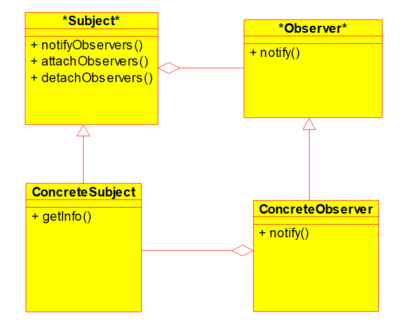
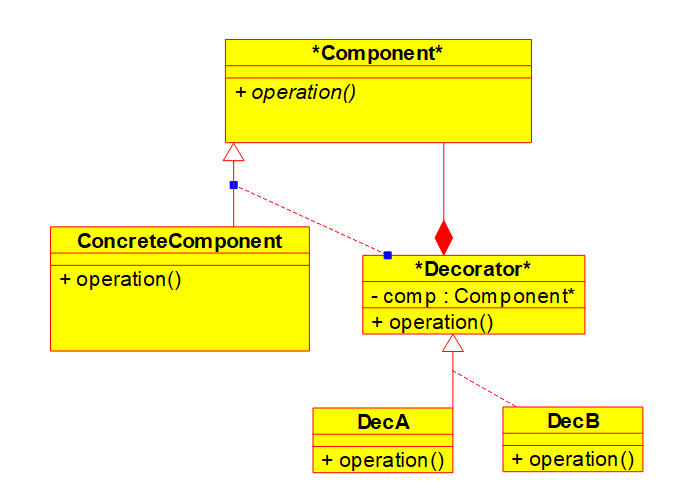
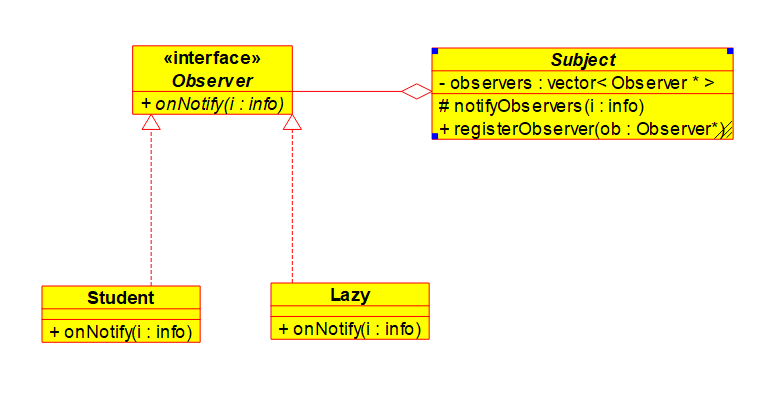
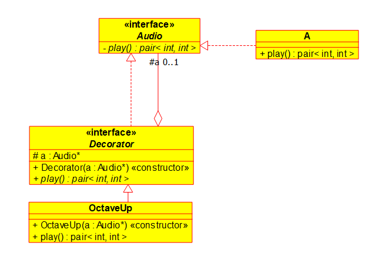
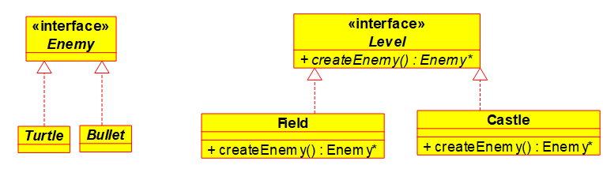
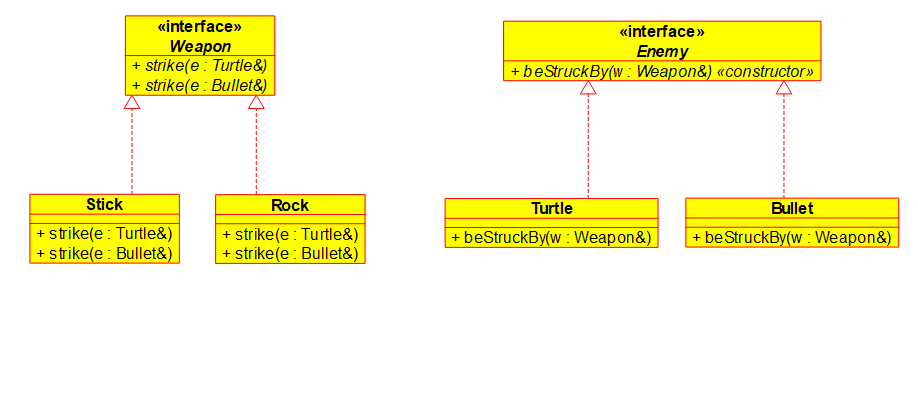

# Table of contents

- [lec 1. 9.5](#lec-1-95)
- [lec 2. 9.10](#lec2-910)
- [tut 1. 9.11](#tut-1-911)
- [lec 3. 9.12](#lec-3-912)
- [lec 4. 9.17](#lec-4-917)
- [tut 2. 9.18](#tut-2-918)
- [lec 5. 9.19](#lec-5-919)
- [lec 6. 9.24](#lec-6-924)
- [tut 3. 9.25](#tut-3-925)
- [lec 7. 9.26](#lec-7-926)
- [lec 8. 10.1](#lec-8-101)
- [tut 4. 10.2](#tut-4-102)
- [lec 9. 10.3](#lec-9-103)
- [lec 10. 10.8](#lec-10-108)
- [tut 5. 10.9](#tut-5-109)
- [lec 11. 10.10](#lec-11-1010)
- [lec 12. 10.22](#lec-12-1022)
- [tut 6. 10.23](#tut-6-1023)
- [lec 13. 10.24](#lec-13-1024)
- [lec 14. 10.29](#lec-14-1029)
- [lec 15. 10.31](#lec-15-1031)
- [lec 16. 11.5](#lec-16-115)
- [tut 7. 11.06](#tut-7-1106)
- [lec 17. 11.7](#lec-17-117)
- [lec 18. 11.12](#lec-18-1112)
- [tut 8. 11.13](#tut-8-1113)
- [lec 19. 11.14](#lec-19-1114)
- [lec 20. 11.19](#lec-20-1119)
- [lut 9. 11.20](#lut-9-1120)
- [lec 21. 11.21](#lec-21-1121)

# lec 1. 9.5

*   `cat /path/file`
    *   displays the content of file
    *   the first slash means starting from the root directory. root is the top of  file hierarchy.
    *   directories are files that store files.
    *   in linux, every text file must end with a newline character _including the last line_.
        *   when making a file, make it in linux.
        *   when printing output, make sure it ends with a newline.
        *   `cat` prints user's input to current output stream
        *   `-n` adds line number in front of input and prints output

*   `^C (control+C)`
    *   to force stop a program

*   `ls`
    *   lists the non-hidden files in the current directory
    *   `ls -a` including hidden ones

*   `pwd`
    *   prints the current location of the file hierarchy

*   `cat > file`
    *   writes output to file
    *   `^D` at the beginning of the line stops providing texts (sends `EOF`).

*   `command > file`
    *   executes the command and store the output to file

*   `cat < file`
    *   feeds input from file to `cat`

```bash
> cat > a.txt
> hello
> henlo
>^D
> cat a.txt   # cat receives a.txt as input and open it, prints contents
hello
henlo
> cat < a.txt # opens the file and sends contents to cat via input
hello
henlo
>
```

*   `*.txt`
    *   wildcard that matches any `.txt`

*   `cat < a.txt > b.txt`
    *   copies `a.txt` to `b.txt`


# lec 2. 9.10

*   `cat > file 2> errfile.txt`
    *   redirects stderr to file
    *   stderr is not buffered, stdout is 

__term.__ pipes `|` allow us to take output from one program and redirect it as input to another program.

__eg.__ how many words are there in the first 20 lines of `file.txt`?
```bash
head -20 file.txt | wc -w # wc: word count
```
*   `head` gives first 10 lines; `head -n num` gives first num lines.

__eg.__ have `words.txt` and `words2.txt`, each contains a list of words separated by lines. print the words without duplicate.
```bash
cat words*.txt | sort | uniq
# sort: sorts lines
# uniq: removes adjacent duplicate items
```

__eg.__ how to pass result of command as arguments to another command?
`files.txt` contains a list of file names
```bash
wc -w $(cat files.txt)
# same as
wc -w hhh.txt ggg.txt
```
double suppress matching patterns, single quote supress everything
__eg.__
```bash
> echo "hello, the date is $(date) and you are $(whoami) file*.txt"
# hello, the date is Tue Sep 10 14:56:18 EDT 2019 and you are xxxyyy file*.txt

> echo 'hello, the date is $(date) and you are $(whoami) file*.txt'
# hello, the date is $(date) and you are $(whoami) file*.txt
```

#### extended global regular expression print
*   `egrep pattern file(s)`
    *   prints each line that matches pattern
    *   __eg.__ `egrep "(cs246|CS246)" file.txt`

* `pat1|pat2|pat3`
* `(pattern)`
* `[a-Z]` `[a-z]` `[A-z]` `[A-Za-z]`  
* `[^...]`
* `?` 
    * __eg.__ `"cs(-|_| )?246"`
* `*`
* `+`
* `.`
* `^...$`

__eg.__ matches lines of even length.
```bash
"^(..)*$"
```
__eg.__ lists files in the current directory that contain exactly one a in their names.
```bash
ls | egrep "^[^a]*a[^a]*$"
```

*   `ls -l`
    *   prints file names in their long forms
    *   `type permission owner group size time name`
    *   files can have multiple owners but only one group
    *   ```bash
        d rwx rwx rwx
        # type user group else
        #         d          |        f
        # r-bit: read        | see the files (ls)
        # w-bit: write       | can add and remove files
        # x-bit: runnable    | can navigate (cd)
        ```

# tut 1. 9.11
__eg.__
```bash
wc test.c                         # has filename
# 18 13 90 testssss.txt
wc < test.c                       # no filename
# 18 13 90
```

__eg.__ prints the word count through echo
```bash
echo "dassfsafa" | wc
```

__eg.__ gets holidays for south korea in next 30 days
```bash
calendar -A 30 | grep "South Korea"
```

__eg.__ input lines, sort lines, dedup and add prefix with duplicate counts, sort numerically, prints last 2 lines.
```bash
sort | uniq -c | sort -n | tail -2
```
`(tail compose sort compose uniq compose sort)(text)`
```c
A  ->   A   ->  3 A  -> 1 C  -> 2 B
A       A       2 B     2 B     3 A
B       A       1 C     3 A
C       B
A       B
B       C
```


# lec 3. 9.12

*   `chmod`
    *   user type:
        *   `u` user
        *   `g` group
        *   `o` other roles
        *   `a` all
    *   operator:
        *   `+` add permission
        *   `-` subtract permission
        *   `=` set permission exactly
    *   permissions:
        *   `r`, `w`, `x`

__eg.__ gives other read permissions: `chmod o+r file`
__eg.__ gives exactly rx permissions to all: `chmod a=rx file`
__eg.__ gives writable to group and user: `chmod gu+w file`

__term.__ shell scripts are files containing sequence of shell commands, executed as a program.

__eg.__ a shell script `sc.sh`
```bash
#!/bin/bash
date
whoami
pwd
```

__syntax.__ variables
*   `name=content` (no spaces)
*   __eg.__ `x=1`
*   use `$` to fetch contents eg. `$x`
*   do not use `$` when assigning
*   can use `${x}` eg. `echo ${x}yz -> 1yz`
*   vars contain strings
*   special vars: `$1`, `$2`, ... are command args

__eg.__ check if a word occurs in the dictionary
```bash
#!/bin/bash
egrep "^$1$" file
```

__syntax.__ conditional
```bash
if [ $1 = "hello"]; then
    ...
elif [ $1 = "world" ]; then
    ...
else
    ...
fi
```

__eg.__ checks if a word does not occur in the dictionary
```bash
egrep "^${1}$" file > /dev/null
# egrep exits with 0 if found, 1 if not found
# $? stores status of most recently run program
if [ $? -eq 0 ]; then
    echo "bad password!"
else
    echo "good password!"
fi
```

__syntax.__ function
__eg.__ checks if a word does not occur in the dictionary
```bash
#!/bin/bash
usage() {
    echo "Usage: $0 password"
    exit 1
}

if [ $# -ne 1 ]; then
    # $# is arg count
    # -eq -ne
    # -lt -le
    # -gt -ge
    usage
fi
```

__syntax.__ while
__eg.__ print numbers from 1 to $1
```bash
x=1
while [ $x -le $1 ]; do
    echo $x
    x=$((x+1))
    # arithmetic operation format (spaces don't matter)
    # eg. $((5+4))
done
```

__syntax.__ for
__eg.__ loop over a list
```bash
for x in 1 2 3 4 5; do
    echo $x
done
```

__eg.__ rename all `.cpp` files to `.cc`
```bash
#!/bin/bash
for file in *.cpp; do
    mv $file ${file%cpp}cc
                #  %: removes cpp from end of var content if it exists, else no change
done
```

__eg.__ how many times does $1 occur in file $2
```bash
#!/bin/bash
x=0
for word in $(cat $2); do
    if [ $word -eq $1 ]; then
        x=$((x+1))
    fi
done
echo $x
```

# lec 4. 9.17

*   `awk`
    *   `awk '{print}' file` prints the file line by line like `cat`
    *   `awk '{print $1,$4}' file` splits the file lines, prints 1st and 4th columns, `$0` is the whole line, `$NF` is last column
    *   `awk '{print NR, $0}' file` prints lines with line numbers

__eg.__ find the last friday of this month.
```bash
report() {
    if [ $1 -eq 31 ]; then
        echo "payday is the 31st"
    else
        echo "payday is the ${1}th"
}

report $(cal | awk '{print $6}' | egrep "[0-9]" | tail -1)
                        # $6 means the 6-th col
```

### testing
*   essential part of program development
*   begins before you program
*   test suites -> expect behaviors
*   continue while you are programming
*   debugging occurs when tests are failing
*   can't prove program is correct; can prove it is wrong
*   no general formula
*   psychological barrier -> don't want to find out you are wrong
*   generally, developers and tests are different people

#### human testing
*   human look over code to find errors
*   code inspection walk through
*   explaining code aloud

#### machine testing
*   runs program on selected input
*   can't check anything
*   black/grey/white box
*   short & black box testing
    *   various classes of inputs
    *   boundaries of valid ranges (edge cases)
    *   multiple boundaries simultaneously (corner cases)
    *   intuition/experience (guess common errors)
    *   extreme cases (within reason)
*   white box testing
    *   execute all logical paths
    *   make sure all functions run
    *   not test
        *   invalid input unless a behavior is specified
*   performance testing
*   regression testing
    *   checking if program changes


## C++

__eg.__ hello world
```cpp
#include <iostream>
using namespace std;
int main()
{
    cout << "Hello world!" << endl;
    return 0; // implicitly returns 0
}
```

*   `std::cout` prints string literals/variables/int/bools/...
*   `std::endl` end-of-line character and flushes output buffer
*   `using namespace std` can omit `std::`

### compiling C++ program
```bash
g++ -std=c++14 program.cc -o program
# g++14 program.cc -o program
```

__remark.__ most C programs work in C++.

#### io input/output
*   `std::cin`
*   `std::cout`
*   `std::cerr`

#### io operations
*   `<<` "put to"
*   `>>` "get from"
*   the operators "points" in the direction of information flow

__eg.__ add two numbers
```cpp
int main()
{
    int x, y;
    cin >> x >> y; //ignores whitespace / delimited by whitespace
    cout << x + y << endl;
}
```

# tut 2. 9.18
__eg.__ moral: when expanding variables, use quotes
```bash
foo="bar baz"
egrep $foo file   # searches "bar" in files baz and file
egrep "$foo" file # right
```

__eg.__ get new extension names for files
```bash
#!/bin/bash
rename () {
    # $1: original name
    # $2: old ext
    # $3: new ext
    mv "$1" "${1%$2}%3"
}
for file in *.$1; do
    # $1: old ext
    # $2: new ext
    rename "$file" $1 $2
done
```

__eg.__ calculates the mean of numbers in file, throws error upon invalid param
```bash
#!/bin/bash
if [ $# -ne 1 ]; then
    echo "$0 takes exactly one arg."
    exit 1
fi
A="0"
B="0"
for n in $(cat $1); do
    A=$(( $A+$n ))
    B=$(( $B+1 ))
done
echo "The sum is $(( $A/$B ))."
```

__eg.__ a small program that checks whether param is present
```bash
#!/bin/bash
printf "${0}:\n"
for i in 1 2 3; do
    if [ -z "${!i+unset}" ]; then
        printf "\t${i}th param unset\n"
    else
        printf "\t${i}th param is: ${!i}\n"
    fi
done
```

# lec 5. 9.19

__eg.__ from last lec.
```cpp
cin << x << y;
```
q: what if input is not int? what if input too big/small or is char? what if there is no more input?  
a: statement fails; the var is set to `0`, `INT_MIN` or `INT_MAX`.
*   if read fails, `std::cin.fail()` returns true.
*   if EOF, `std::cin.eof()` and `std::cin.fail()` return true.

__eg.__ reads inputs until a bad input/EOF
```cpp
int main()
{
    int i;
    while (1)
    {
        cin >> i;
        if (cin.fail()) break;
        cout << i << endl;
    }
}
```

__syntax.__ bitwise right shift `>>`
```c
21      ->   0b010101
21 >> 3 ->   0b010
```
when the left side arg is `std::cin` it is the input operator called
```cpp
    cin   >>  x   >> y
//istream    int    int
// the expression cin >> x returns cin
// hence next setp is
//  cin >> y
```
there is an implicit conversion from `istream` to `bool`s. this conversion is the result of looking at `cin`'s fail bit negated.

__eg.__ reads inputs until a bad input/EOF
```cpp
int main()
{
    int i;
    while (cin >> i) // is implicitly converted to bool
        cout << i << endl;
}
```

__eg.__ reads inputs until EOF, skip non-int.
```cpp
int main()
{
    int i;
    while (1)
    {
        if (!(cin >> i))  // if read fails
        {
            if (cin.eof()) break;
            cin.clear();  // clear fail bit
                          //    inf loop if don't clear
            cin.ignore(); // ignore the current input char
                          //    inf loop if .ignore() not present
        }
        else
        {
            cout << i << endl;
        }
    }
}
```

### io manipulator `<iomanip>`
__eg.__ `std::hex` affects any following ints that will be converted to hex
```cpp
#include <iomanip>
...
    cout << hex << x; // converts x to hex for output
    cin >> hex >> y;  // reads x and store its hex 

    cout << hex << x << dec << x << oct << x << endl;
    // prints hex followed by dex followed by oct

    cin << hex; // this line affects all future inputs 
... 
```

### `std::string` in `<string>`
*   manages own memory; grows automatically
*   safe; don't have to worry about `'\0'`

__eg.__ string literal
```cpp
#include <string>
...
    string h = "hello"; // still a c-style string
    string w = "world"; // ...

    // equality compare
    h == w;
    // lexicographical compare
    h <= w;
    // fetch length in O(1)
    h.length();
    // fetch individual chars
    h[0], h[1], ...;
    // concatenation
    hw = h + w;
    hw += h;
        // helloworldhello
...
```

#### `std::string.substr`
```cpp
h.substr(1,2); // "el"
// start from 1st index, wants 2 chars
```

#### `std::getline(std::cin, my_str)`
reads a string `my_str` including whitespace from `std::cin`.


# lec 6. 9.24

### `<fstream>`
__eg.__ reads a file and prints it
```cpp
#include <fstream>
using namespace std;
int main()
{
    ifstream file{"file.txt"}; // initializing an ifstream; opens file
    string s;
    while (file >> s)
        cout << s << endl;
}
```

anything I can do with `std::cin`/`std::cout` I can do with `std::ifstream`/`std::ofstream`.

### `<sstream>`

__eg.__
```cpp
#include <sstream>
#include <string>
using std::string
using std::istringstream; // read from a string
using std::ostringstream; // write to string

string intToString(int n)
{
    ostringstream oss;
    oss << n;
    return oss.str(); // returns the string stored in the stringstream
}
```

__eg.__ convert a string to int (catch failures)
```cpp
...
    int n;
    while (1)
    {
        cout << "enter a number" << endl;
        string s;
        cin >> s;
        istringstream iss{s};
        if (iss >> n) break;
    }
    cout << "you entered " << n << endl;
...
```

__eg.__ reading ints from stdin, prints all ints, ignoring non-ints
```cpp
#include <string>
#include <sstream>
using namespace std;
int main()
{
    string s;
    while (cin >> s)
    {
        istringstream iss{s};
        int n;
        if (iss >> n)
            cout << n << endl;
    }
}
```

### default function parameter
__eg.__
```cpp
#include <string>
#include <sstream>
using namespace std;
void printSuiteFile(string name="suite.txt")
                             // default param (must be on the right)
{
    ifstream file{name};
    string s;
    while (file >> s)
        cout << s << endl;
}
int main()
{
    printSuiteFile();
    printSuiteFile("suite2.txt");
}
```

### function overloading
__eg.__ two versions of `neg` function
```cpp
int neg(int n) { return -n; }
bool neg(bool b) { return !b; }
int main()
{
    neg(3); neg(false);
}
```
*   compilers use the number and types of args to decide which function to call  
*   `int neg(int n, bool b=1);` is not a valid overload for `int neg(int n);`
*   overload must be unambiguous. must have different arg count or types of args
*   cannot overload return type

### `struct`
__eg.__ defining a struct
```cpp
struct Node
{
    int n;
    Node *next; // correct
};

struct Node
{
    int n;
    Node next; // incorrect
               // size cannot be determined
};
```

### `const`
```cpp
const int max = 100;
```
*   can't change value of variable
*   consts must be initialized with a value
*   declare as many as possible -- help compiler catch error
```cpp
Node n1 {5, nullptr}; // nullptr 
const Node n2 = n1;   // immutable copy of n1
```

### reference
```cpp
int y = 10;
int &z = y; // reference
z; // 10, not *z
```
*   references are like a const pointer we don't have to dereference.
*   in all instances `z` behaves exactly like `y` (an alias)

__eg.__ increments `c` by one
```cpp
void inc(int &c) { ++c; }
```
__remark.__ things I cannot do with reference
*   cannot leave uninitialized __eg.__ `int &z;//wrong`
    *   must be initialized with data with an address __eg.__ `int &3; int &x=y+z;//wrong`
        *   this is a left value reference (that can be on the left on assignments)
    *   can't create pointer to reference __eg.__ `int &*x; //wrong`
    *   can't create reference to reference __eg.__ `int &&z; //wrong`
    *   can't create array of references __eg.__ `int &r[3]={y,y,y}; //wrong`


# tut 3. 9.25

## review on i/o streams
### standard streams `<iostream>`
| | | |
|:-:|:-:|:-:|
|`std::cin`|is|read from stdin|
|`std::cout`|os|print to stdout|
|`std::cerr`|os|print to stderr|

### file streams `<fstream>`
| | | |
|:-:|:-:|:-:|
|`std::ifstream`|is|read from file|
|`std::ofstream`|os|write to file|

__eg.__
```cpp
ifstream ifs{"read.txt"};
ofstream ofs{"write.txt", ofstream::out | ofstream::app};
                                          // append mode
string s;
ifs >> s; // read
ofs << s; // write
```

### string streams `<sstream>`
| | | |
|:-:|:-:|:-:|
|`std::istringstream`|is|read from string|
|`std::ostringstream`|os|write to string|

__eg.__
```cpp
string s = "123";
istringstream iss{s};
int n;
iss >> n; // writes string to int var

ostringstream oss;
oss << 123;
string s = oss.str(); // writes int to string var
```

__eg.__ `cat`
```cpp
#include <fstream>
#include <iostream>
using namespace std;
void cat(string filename)
{
    ifstream ifs{filename};
    string s;
    while (getline(ifs, s))
        cout << s << endl;
}
int main()
{
    string s;
    while (cin >> s)
        cat(s);
}
```

__eg.__ complex multiplication
```cpp
#include <iostream>
#include <sstream>
using namespace std;

struct ComplexNumber
{
    int re;
    int im;
};

ComplexNumber readNum()
{
    int re, im;
    char sign, buff;
    string myNumStr;
    cin >> myNumStr;
    istringstream iss(myNumStr);
    iss >> re >> sign >> im >> buff;
    if (sign == '-') im = -im;
    ComplexNumber res = { re, im };
    return res;
}

ComplexNumber mult(ComplexNumber a, ComplexNumber b)
{
    ComplexNumber res = 
    {
        a.re * b.re - a.im * b.im,
        a.re * b.im + a.im * b.re
    };
    return res;
}

int main()
{
    ComplexNumber a = readNum();
    ComplexNumber b = readNum();
    ComplexNumber res = mult(a, b);
    cout << "ANS: \n\treal: " << res.re << "\n\timag: " << res.im << endl;
}
```

### overloading
__eg.__ an error
```cpp
void foo(int a, char b, int c=10); // signature (int, char, int)
void foo(int a, char b); // signature (int, char)

// at this point program runs.

int main()
{
    foo(10, 'a'); // error! does not which one to call
}
```
__eg.__ an error
```cpp
int foo();
string foo();
// wrong! signature does not include return type
```

# lec 7. 9.26

### reference (cont.)

__remark.__ references are good for
*   function params 
    ```cpp
    void inc(int &n);

    struct ReallyBig;
    int f(ReallyBig rb); // slow due to copying
    int g(ReallyBig &rb); // alias, no copy, fast, allows mutation
    int h(const ReallyBig &rb); // alias, no copy, fast, no mutation
    ```


### dynamic memory allocation `new` / `delete`
*   type-safe, less error-prone
*   must explicitly tell program when help allocated memory is deleted (otherwise memory leak)

__eg.__
```cpp
struct Node;
Node *np = new Node; // uninitialized
Node *np2 = new Node{ 5, nullptr };
delete np, np2;
```

### arrays
__eg.__
```cpp
Node * myNodes = new Node[10];
...
delete [] myNodes; // used to delete array whose contents are heap objects
```

### returning by value/pointer/ref
__eg.__
```cpp
// returns a value
Node getNode()
{
    Node n;
    return n;
}
// returns dangling pointer, wrong
Node *getNode()
{
    Node n;
    return &n;
}
// returns a pointer
Node *getNode()
{
    Node *n = new Node;
    return n;
}
```

### overloading operator
__eg.__ overloads `+`, `*`
```cpp
struct Vec
{
    int x,y;
};
Vec operator+(const Vec &v1, const Vec &v2)
{
    Vec v
    {
        v1.x + v2.x, v1.y + v2.y
    }
    return v;
}
//              left:int *  right:vec
Vec operator*(const int k, const Vec &v)
{
    return
    {
        k * v.x, k * v.y;
    }; // initializes the instance based on return type
}
//              left:vec *  right:int
Vec operator*(const Vec &v, const int k)
{
    return k * v;
}
...
Vec v{1,2}, w{3,5};
Vec x = v + w;
```

__eg.__ overloads `<<`, `>>`
```cpp
#include <iostream>
using namespace std;

struct Grade
{
    unsigned int theGrade;
};

ostream &operator<<(ostream &out, const Grade &g)
{
    out << g.theGrade << "%";
    return out; // important
}

istream &operator>>(istream &in, Grade &g)
{
    in >> g.theGrade;
    if (g.theGrade < 0) g.theGrade = 0;
    if (g.theGrade > 100) g.theGrade = 100;
    return in;
}

int main()
{
    Grade g;
    // gets grade
    cin >> g;
    // prints grade
    cout << g << endl;
}
```

## preprocessor `#`

*   transforms program before compiler sees it

### `#include FILE`
replaces include with contents of specified file

### `#define VAR VALUE`
*   sets preprocessor variable
*   replaces any instance of VAR by VALUE

__eg.__
```cpp
#define MAX 10
int x[MAX];
```
compiler sees
```cpp
int x[10];
```

### `#define VAR`
VAR's value is an empty string

### conditional compilation `#if #elif #else #endif`
__eg.__ decides which type to use
```cpp
#define SECURITYLEVEL 1
...
#if SECURITYLEVEL == 1
short int
#elif SECURITYLEVEL == 2
long long int
#endif
publicKey;
```

__eg.__ comments
```cpp
#if 0
...
#endif // this is effectively a comment
```

__eg.__ compile with -DX
```cpp
// file.cc
#include <iostream>
int main()
{
    std::cout << X << std::endl;
}
```
```bash
# terminal
> g++ file.cc -DX=10
> ./a.out
10
```

### `#ifdef #ifndef`

__eg.__ turning on debugging
```cpp
// file.cc
int main()
{
    #ifdef DEBUG
    ...
    #endif
}
```
```bash
# terminal
$ g++ file.cc -DDEBUG # replaces DEBUG to 1
```

## separate compilation
split program into multiple files/modules
*   interface`.h`
*   implementation`.cc`


# lec 8. 10.1

__recall.__
*   decleration - asserts exsitence
*   definition - full details, allocates space

__eg.__ separately written program
```cpp
// vec.h
struct Vec { int x, y; }
Vec operator+(const Vec &v1, const Vec &v2);
```
```cpp
// vec.cc
#include "vec.h"
Vec operator+(const Vec &v1, const Vec &v2)
{
    return { v1.x + v2.x, v1.y + v2.y };
}
```
```cpp
// main.cc
#include "vec.h"
int main()
{
    Vec { 1,2 };
    v = v + v;
    ...
}
```

__remark.__ an entity can be declared many times but defined only once.

__eg.__ compile above files
```sh
> g++ vec.cc
# linker error
undefined reference to 'main'
...
> g++ main.cc
# still linker error
undefined reference to 'operator+(Vec const&, Vec const&)'
...
...
> g++ -c vec.cc   # compiles only, do not link
> g++ -c main.cc 
> ls
main.cc main.o vec.cc vec.h vec.o # creates .o object files
> g++ main.o vec.o -o main  # creates main executable
                            # ./main
```

if change `vec.h`, then needs to recompile both `vec.cc` and `main.cc`.

## make
creates makefile taht says which files depend on which other files.

__eg.__ makefile for above files
```makefile
# makefile
# target: dependencies
#   recipe

main: main.o vec.o
    g++ main.o vec.o -o main
# ^ must be tab
main.o: main.cc vec.h
    g++ -c main.cc

vec.o: vec.cc vec.h
    g++ -c vec.cc

.PHONY: clean     # optional target - remove binaries

clean:
    rm *.o main
```
```sh
# compiles files with makefile
> make
# who project is built
... # changes vec.cc
> make
# only vec.cc is rebuilt and relinked project
```

*   make - builds only main
    *   what does main depend on?
        *   recursively builds dependencies if neccessary
        *   rebuilds main if neccessary
*   if a target is older than dependencies (last modified) it is rebuilt

__eg.__ rebuilt everything
```bash
> make clean && make
```

__eg.__ makefile containing variable
```makefile
CXX = g++ # compiler name
CXXFLAGS = -std=c++14 -Wall # option - enables all warnings
OBJECTS = main.o vec.o
EXEC = main

${EXEC}: ${OBJECTS}
    ${CXX} ${CXXFLAGS} ${OBJECTS} -o ${EXEC}

main.o: main.cc vec.h
vec.o: vec.cc vec.h
# can guess recipe is ${CXX} ${CXXFLAGS} -c ....cc

.PHONY: clean

clean:
    rm ${OBJECTS} ${EXEC}
```

### `g++ -MMD`
creates file containing dependencies in make's format

__eg.__
```bash
> g++ -MMD -c vec.cc # creates both .o and .d
> ls
main.cc vec.cc vec.d vec.h vec.o
> cat vec.d
vec.o: vec.cc vec.h
```

__eg.__ makefile with auto-updating dependencies
```makefile
CXX = g++
CXXFLAGS = -std=c++14 -Wall -MMD -g # -g: debug mode
OBJECTS = main.o vec.o
DEPENDS = ${OBJECTS:.o=.d}
EXEC = main

${EXEC}: ${OBJECTS}
    ${CXX} ${CXXFLAGS} ${OBJECTS} -o ${EXEC}

-include ${DEPENDS} # expands these .d files
```
as the project grows, only needs to add .o files.

__eg.__ global variable in .h
```cpp
// abc.h
int globalNum; // both declaration & definition
// every file containing abc.h defines a separate vars, program won't link
```
place it in .cc file -- not visible

solution:
```cpp
// abc.h
extern int globalNum;
```


# tut 4. 10.2

### review on references

__eg.__
```cpp
int n = 5;
int &k = n;
++k;
cout << n; // 6
cout << k; // 6
cout << &k; // address, same as &n

int &k = 2; // wrong
int &k = n+n; // wrong
```
*   good for passing parameter to functions -- always pass-by-const-ref on types bigger than int
    ```cpp
    void foo(const reallyBig &rb);
    ```
*   references are not nullable

### review on memory allocation
|C|C++|
|:-:|:-:|
|`malloc`|`new` / `new[]`|
|`free`|`delete` / `delete[]`|
|do not use|use|

__eg.__
```cpp
int *n = new int{5};
delete n;
int *m = new int[10]; // can be variable
                      // instead int m[var] is error since compiler
                      // doesn't know size to allocate on stack
delete [] m;
```

# lec 9. 10.3

### include guard
```cpp
// file.h
#ifndef FILE_H
#define FILE_H
...
#endif
```
first time the file is included, symbol `FILE_H` is not defined so file.h is included. subsequencetly `VEC_H` is defined so contents of vec.h are supressed.

*   always put include guard in .h files
*   do not put `using` in .h files - will be forced on any files including the file.
*   do not compile .h files
*   do not include .cc files

## classes and objects

we can put functions inside structs.  
__eg.__
```cpp
// student.h
struct Student
{
    int assns, mt, final;
    float grade();
};
```
```cpp
// student.cc
#include "student.h"
float Student::grade()
//           ↑
// scope resolution operator
{
    return assns * 0.4f + mt * 0.2f + final * 0.4f;
    // assns, mt, final are fields of the current object
}
```
```cpp
// main.cc
    Student s{ 60, 70, 80 };
    //  ↑         ↑
    // class    object
    cout << s.grade() << endl;
    //         ↑
    //       method
```

*   `object.field` 
*   `Class::field`

methods take a hiddent extra parameter `this` which is the pointer to the object.
```cpp
s.grade(); // this == &s
```

__eg.__ explictly write `this`
```cpp
struct Student
{
    ...
    // method written in class
    float grade()
    {
        return this->assns * 0.4f + this->mt * 0.2f + this->final * 0.4f;
    }
};
```

## initializing objects

C-style field init. ok but limited:
```cpp
Student billy{ 60, 70, 80 };
```

### constructor method
better - write a method that initializes
```cpp
struct Student
{
    int assns, mt, final;
    float grade();
    Student(int assns, int mt, int final);
};
Student::Student(int assns, int mt, int final)
{
    this->assns = assns;
    this->mt = mt;
    this->final = final;
}
...
Student billy{ 60, 70, 80 };
// if constructor is defined then these are passed to constructor
// else this is C-style struct init
```
__eg.__ another init method identical to above
```cpp
Student billy = Student{ 60,70,80 };
```
__eg.__ heap allocation
```cpp
Student *billy = new Student{ 60, 70, 80 };
```

advantage of constructors: default params, overloading, sanity checks  
__eg.__ default parameters
```cpp
Student::Student(int assns=0, int mt=0, int final=0);
Student Jane { 70, 80 }; // 70, 80, 0
Student newKid;          // 0, 0, 0
                         // calls default contructor
```

every class comes with a default constructors (which just default-constructs all fields that are objects).  
__eg.__
```cpp
Vec v; // default constructor does nothing // junk memory?
```
the built-in constructor goes away if you write any constructor  
__eg.__
```cpp
struct Vec
{
    int x, y;
    Vec (int x, int y)
    {
        this->x = x;
        this->y = y;
    }
};
Vec v; // error!
```

sturct containing constants or refs  
__eg.__
```cpp
struct My
{
    const int myConst;
    int &myRef;
}; // must initialize
```
```cpp
int z;
struct My
{
    const int myConst = 5;
    int &myRef = z;
};
```
__eg.__ this is not right
```cpp
struct Student
{
    const int id; // doesn't change, but not the same for all students.
    Student(int id)
    {
        this->id = id; // attempts to alter CONST field after initialization
    }
};
```

steps when objects are created:
1.  space is allocated
2.  fields are constructed in declaration order **
3.  constructor runs

# lec 10. 10.8

to initialize `const`s, we hijack step 2. by the use of member initialization list (MIL)
```cpp
struct Student
{
    const unsigned int id;
    int assns, mt, final;
    Student(unsigned int id, int assns, int mt, int final)
        :id{id} // field{param}
        ,assns{assns}
        ,mt{mt}
        ,final{final}
    {} // function body
};
```
*   `const`s must be initialized in MIL, other fields can and should be initiailized in MIL.
*   fileds are initialized in the order they appear in the struct definition, not in MIL order.
*   MIL is more efficient than initializing in the constructor body
    *   without MIL: construction and assignment
    *   with MIL: construction

__eg.__ overloading
```cpp
struct Vec
{
    int x = 0, y = 0;
    Vec() {}            // x=0, y=0
    Vec(int x): x{x} {} // x=x, y=0
                        // uses MIL instead of default field vals
};
```

### magic methods
every class comes with the following methods:
*   default constructor `Student s;`
*   copy constructor `Student r = s;`
*   copy assignment operator `Student t; t = s;`
*   destructor `delete s;`
*   move constructor `Student t = f(s);`
*   move assignment operator `Student t; t = f(s);`

#### copy constructor

__eg.__ copying
```cpp
Student billy{ 60,70,80 };
Student bobby = billy;  // calls a constructor that initializes the same type
```
__eg.__ own copy constructor
```cpp
struct Student
{
    ...
    Student(const Student &o) // exactly same functionality as default copy constructor
    :id{o.id}
    ,assns{o.assns}
    ,mt{o.mt}
    ,final{o.final}
    {}
};
```
*   note must pass by reference to the copy constructor otherwise infinite recursion (seg fault)

__eg.__ deep copy
```cpp
struct Node
{
    int data;
    Node *next;

    Node(int data, Node *next)
        :data{data}
        ,next{next}
    {}

    Node(const Node &o)
        :data{data}
        ,next{
            o.next != nullptr ? new Node{*o.next} : nullptr
                                // pass by another object
        }
    {}
};

Node *n = new Node {1, new Node{2, new Node{3, nullptr}}};
Node *m = n;
```
__remark.__ copy constructor is called when
*   object initialized by another object
*   object is passed-by-value
*   object is returned-by-value

__eg.__ be careful for one-parameter constructors
```cpp
struct Node
{
    ...
    Node(int data)
        :data{data}, next{nullptr}
    {}
};
Node n{4}; // fine
Node m = 5; // also calls constructor - implicit conversion

int f(Node n) { return n.data };
f(4); // also works - implicit coversion
```

__eg.__ explicit constructor types
```cpp
struct Node
{
    ...
    explicit Node(int data);
};
// now f(4) results in error
```

#### destructors
when an object destructor is destroyed (stack-allocated objects go out of scope and when heap-allocated objects are `delete`d), destructor runs.

1.  destructor body runs
2.  destructors are invoked for fields, in reverse of declaration order
3.  space is deallocated

__eg.__ default destructor
```cpp
struct Node
{
    ...
    ~Node() {}
};
```
__eg.__ completely delete nodes
```cpp
struct Node
{
    ...
    ~Node()
    {
        delete next; // nothing happens upon deleting nullptr
    }
};
```

# tut 5. 10.9

__eg.__ use radial form to create complex num
```cpp
struct Complex
{
    int re, im;
    Complex(float r, float theta);
};
explicit Complex::Complex(float r, float theta)
    :re{ r * cos(theta) }
    ,im{ r * sin(theta) }
{
    cout << "I'm initialized!\n";
}
```

__eg.__
```cpp
cout << "hi";
// is implicitly converted to
cout << string{"hi"};
```

# lec 11. 10.10

__eg.__ confusion
```cpp
Student billy{60,70,80};
Student jane = billy; // copy constructor called

Student joey; // default constructor
joey = billy; // copy assignment constructor called (default ver. is shallow)
```

#### assignment operator
__eg.__ linked list assignment constructor
```cpp
Node& Node::operator=(const Node &o)
{   
    this->data = o.data;
    delete this->next;
    this->next = o.next ? new Node{*o.next} : nullptr;
    return *this;
}
```
__eg.__ better linked list assignment constructor
*   checks self assignment
*   if `new` fails, prevent next being deleted and pointing to invalid mem
```cpp
Node& Node::operator=(const Node &o)
{
    // checks assigning self to self <- seg fault
    if (this == &o)
        return *this;
    Node *tmp = this->next;
    this->next = o.next ? new Node{*o.next} : nullptr;
    // if new fails, this->next unchanged, below is not run
    this->data = o.data;
    delete tmp;
    return *this;
}
```
__eg.__ copy and swap idiom
```cpp
#include <utility>

void Node::swap(Node &o)
{
    using std::swap;
    swap(this->data, o.data);
    swap(this->next, o.next);
}
Node& Node::operator=(const Node &o)
{
    Node tmp = o; // calls copy constructor in current stack frame
    swap(tmp);
    return *this;
    // at this point tmp's destructor runs and tmp.next is deleted
}
```

### rvalue reference `&&`
#### move constructor
__eg.__ consider
```cpp
Node plusOne(Node n) // copy
{
    for (Node *p = &n; p; p = p->next)
        ++p->data;
    return n;
}

Node n{1, new Node{2, nullptr}};
Node n2 = plusOne(n);
```
*   invokes copy constructor `Node(const Node&)`
    *   `plusOne(n)` is not an lvalue
        *   c++ allows this since the parameter is const
*   what happens to the returned node from `plusOne(n)`?
    *   temporary is returned and deleted when this line is complete
*   in the copy constructor, a copy of the temprorary object is created
*   if the object in the scope is about to be deleted, why make a copy?
    *   steal that object by rvalue reference

__eg.__ rvalue reference
```cpp
Node::Node(Node &&o)
    :data{o.data}
    ,next{o.next}
{
    o.next = nullptr;
}
```

#### move assignment operator
```cpp
Node& Node::operator=(Node &&o)
{
    this->swap(o);
    return *this; // originally &&o is about to be deleted, swap this with
                  // &&o, then this->next is deleted!
}

Node m;
m = plusOne(m);
```

*   if move constructor/assignment operator is not defined, then copy versions will be run. (fine but slow)
*   if defined they replace all copy constructor and copy operator= where the argument is a temporary rvalue
*   `return n` in `plusOne` returns using the move constructor

__eg.__ another move assignment operator
```cpp
Node &Node::operator=(Node &&o)
{
    delete next;
    data = o.data;
    next = o.next;
    o.next = nullptr;
    return *this;
}
```


# lec 12. 10.22
### copy/move elision
```cpp
Vec makeVec() {return {0,0};}
Vec v = makeVec(); // skips two move constructor calls
                   // returned value written directly to v's memory
```
*   `fno-elide-constructors` forces all constructors to run

in summary, if any of these is written
1.  copy constructor `Object::Object(Object&)`
2.  move constructor `Object::Object(Object&&)`
3.  copy assignment operator `Object& Object::operator=(Object&)`
4.  move assignment operator `Object& Object::operator=(Object&&)`
5.  destructor `Object::~Object()`

all five usually have to be written.

### member operators
left hand side is `this`

__remark.__ input/output operator should never be member operators
```cpp
ostream& operator<<(ostream &out, const Vec &v);
```

### arrays of objects
__eg.__ error
```cpp
struct Vec
{
    int x, y;
    Vec(int x, int y): x{x}, y{y} {}
};
Vec *vp = new Vec[10]; // error
Vec arr[10];           // error as entries have to be initialized, but no 
                       // parameterless constructor defined

// walkaround:
// 1. make a default constructor
// 2. for stack arrays
    Vec arr2[3] = {Vec{0,0}, Vec{0,0}, Vec{0,0}};
// 3. create array of pointers
    Vec **vp2 = new Vec*[10];
    for (int i = 0; i < 10; ++i) delete vp2[i];
    delete [] vp2;
```

### const objects
compiler ensures that fields are not modified by this method
```cpp
struct Student
{
    ...
    mutable int numMethodCalls = 0;
    float grade() const
    {
        // if want to change a field inside const it has to be 'mutable'
        ++numMethodCalls;
        return ....;
    }
};
```

### static members
associated with the class not a particular instance
```cpp
struct Student
{
    ...
    static int numInstances; // memory should not be in .h file -> multiple definition
    Student(int grade): grade{grade}
    {
        ++numInstances;
    }
    static void howMany()
    {
        cout << numInstances << endl;
    }
};

// in an cc file, do
int Student::numInstances = 0; // acts like a global var for class
```
static methods can access static members that do not belong to a specific instance

### invariants & encapsulation
__eg.__ consider
```cpp
Node n1{1, new Node{2, nullptr}};
Node n2{3, nullptr};
Node n3{4, &n2};
// when these three go out of scope
// all of n1, n2, n3 deleted
// n1: node and list reclaimed
// n2: node reclaimed
// n3: node reclaimed, next already deleted

// try to delete n2 twice
// delete stack-allocated memory - undefined behavior
// double free error
```
the node class relies on an assumption that next is nullptr or heap-allocated memory. this is an _invariant_ - a statement that must be true. we can't guarantee this will hold.

to enforce invariant, we use encapsulation. the clients treat the objects as a black box which abstracts away the specifies of the implementation of the class.

we will not allow clients to access fields -> only methods.


# tut 6. 10.23

#### new in C++11
*   uniform initialization `int n{5};`
*   aggregate initialization `Foo x = {1,2};`

__eg.__ when does UI work but `=()` doesn't?
```cpp
int n{3.5}; // does not work, no narrowing conversion
```
__eg.__ when does `=()` work but UI doesn't?

__eg.__
```cpp
struct Binary
{
private:
    void swap(Binary &o)
    {
        std::swap(cap, o.cap);
        std::swap(sz, o.sz);
        std::swap(arr, o.arr);
    }
public:
    int sz, cap;
    bool *arr;
    ~Binary() 
    {
        delete [] arr;
    }
    Binary(const Binary &o)
    :sz{o.sz}, cap{o.cap}, arr{new bool[cap]}
    {
        for (int i = 0; i < cap; ++i)
            arr[i] = o.arr[i];
    }
    Binary &operator=(const Binary &o)
    {
        Binary tmp{o};
        swap(tmp);
        return *this;
    }
};
```

# lec 13. 10.24
### `private`, `public`
*   private members can be accessed in methods
*   public members can be accessed anywhere

__eg.__
```cpp
struct Vec //by default struct is public
{
private: // fields after this are not accessible
    int x, y;
public:
    Vec operator+(const Vec &o) const;
};

class Vec2 // by default class is private
{
    int x, y;
};
```

__eg.__ llist
```cpp
// list.h
class List
{
    struct Node; // private nested struct
    Node *theList;
public:
    void addToFront(int n);
    int ith(int i);
    ~List();
}
```
```cpp
// list.cc
struct List::Node
{
    int data;
    Node *next;
    Node(int data, Node *next): data{data}, next{next} {}
    ~Node() {delete next;}
};

List::~List() 
{
    delete theList;
}

void List::AddToFront(int n)
{
    theList = new Node(n, theList);
}

int List::ith(int i)
{
    Node *cur = theList;
    for (int j = 0; j < i; ++j, cur = cur->next);
    return cur->data;
}

// nodes are hidden, can't traverse to the next
void printAll(List list, int size)
{
    for (int i = 0; i < size; ++i)
    {
        int elem = list.ith(i);
        cout << elem << endl;
    }
} // O(n^2)
```

### SE: design patterns
certain scenarios occur often. we can keep track of good solutions to reuse and adapt in similar situations

#### iterator patterns
problem: want to visit data stored in a struct without losing encapsulation  
solution: create a class that manages access to nodes. iterator class acts like a pointer.
__eg. llist iterator
```cpp
// list.h
class List
{
    struct Node;
    Node *theList;
public:
    class Iterator
    {
        Node *p;
    public:
        explicit Iterator(Node *p): p{p} 
        {}
        int &operator*()
        {
            return p->data;
        }
        Iterator &operator++()
        {
            p = p->next;
            return *this;
        }
        bool operator==(const Iterator &o) const
        {
            return p == o.p;
        }
        bool operator!=(const Iterator &o) const
        {
            return !(*this == o);
        }
    };
    Iterator begin()
    {
        return Iterator{theList};
    }
    Iterator end()
    {
        return Iterator{nullptr};
    }
    ...
}
```
```cpp
// main.cc usage
int main()
{
    List list;
    list.addToFront(1);
    list.addToFront(2);
    list.addToFront(3);
    for (List::Iterator it = list.begin(); it != list.end(); ++it)
    {
        cout << *it << endl;
    } // O(n)
}
```
Iterator constructor has to be public
*   needs to be accessible to List
*   it's current accessible to everyone
*   needs to be able to give access to certain class

#### `auto`
*   `auto x = y;` defines x to have the same type of y.
*   don't have to write down long type name
*   don't need to know the exact type name of `x`

#### `range-based for`
a class has a range-based for loop if it has
*   methods `begin` and `end` that return the same type (iterator)
*   that iterator supports `operator++`, `operator*` and `operator!=`

__eg.__
```cpp
for (int n: list)
    cout << n << endl;

// mutate
for (int &n: list)
    ++n;
```

*   the client can make iterators currently *
```cpp
auto it = List::Iterator{nullptr};
```
*   the client should only use `begin()` and `end()` to make iterator
*   list must be able to access to iterator constructor
    *   if constructor is private, list can't access it
    *   if cnstructor is public, everyone accesses it

#### `friend` to limit who can access it
```cpp
class List
{
public:
    class Iterator
    {
        Node *p;
        explicit Iterator(Node *p); // is private
    public:
        ...
        friend class List; // List has access to all private fields
                           // * is no longer possible
    };
    ...
};
```
friends weaken encapsulation - have as less `friend` as possible.

# lec 14. 10.29
__eg.__ providing private fields with access/mutator methods
```cpp
class Vec
{
    int x, y;
public:
    int getX() { return x; };
    void setX(int z) { x = z; };
};
```
about operator `<<`
*   needs access to class internals for printing
*   no problem if getters present
*   don't want to create getter just for this reason

__eg.__ make operator<< a friend function
```cpp
class Vec
{
    ...
    friend ostream &operator<<(ostream &o, const Vec &v);
};
ostream &operator<<(ostream &o, const Vec &v)
{
    o << "(" << v.x << "," << v.y << ")";
    return o;
}
```

### system modelling
visualize the structure of a system to aid in the design and implementation  
popular shortcut: uml (unified modelling language)

__eg.__ modelling a class
<div style="background:darkgreen;width:130px;padding:5px">
<b>Name:</b><br/>
Vec<br/>
<hr style="background:black"/>
<b>Fields:</b><br/>
-x: integer<br/>
-y: integer<br/>
<hr style="background:black"/>
<b>Methods:</b><br/>
+getX(): integer<br/>
+getY(): integer
</div>
+: public, -: private, :type: type

#### relationship: composition
```cpp
class Vec
{
    int x, y;
    Vec(int x, int y): x{x}, y{y} {}
};
class Basis
{
    Vec v1, v2;
    ...
};
Basis b; // error: can't init v1, v2
         // default constructor from compiler calls the default constructor of fields - but Vec does not have a default constructor
```
```cpp
class Basis
{
    Vec v1, v2;
public:
    Basis(): v1{{1,0}}, v2{{0,1}} {}
    // must have MIL
};
```
embedding an object insider another is called _composition_.  
relationshp: a Basis object owns a Vec object.  
if A owns B then typically:
*   B has no identity outside A
*   if A is destroyed, so is B
*   if A is copied, so is B (deep copy)

<div>
<div style="background:darkgreen;width:130px;padding:5px;float:left">
<b>Name:</b><br/>
Vec<br/>
<hr style="background:black"/>
<b>Fields:</b><br/>
...
<hr style="background:black"/>
<b>Methods:</b><br/>
...
</div>
<div style="width:100px;padding:5px;float:left">
<br/>
◆---> (2) v1, v2
</div>
<div style="background:darkblue;width:130px;padding:5px;float:left">
<b>Name:</b><br/>
Basis<br/>
<hr style="background:white!important"/>
<b>Fields:</b><br/>
...
<hr style="background:white!important"/>
<b>Methods:</b><br/>
...
</div>
<br style="clear:both"/>
</div>

◆ indicates composition (number) instance names

#### relationship: aggregation  
```cpp
struct Pond
{
    Goose *occupied[max];
};
```
the items stored in a house can exist without a house existing
*   items have an existence of their own
*   if A has B typically:
    *   B exists apart from its association with A
    *   if A is destroyed, B lives on
    *   if A is copied, B is not (shallow copy)

<div>
<div style="background:#51dbb9;color:black;width:130px;padding:5px;float:left">
<b>Name:</b><br/>
Pond<br/>
<hr style="background:black"/>
<b>Fields:</b><br/>
...
<hr style="background:black"/>
<b>Methods:</b><br/>
...
</div>
<div style="width:100px;padding:5px;float:left">
<br/>
◇---------> o..*
</div>
<div style="background:#c9c736;color:black;width:130px;padding:5px;float:left">
<b>Name:</b><br/>
Goose<br/>
<hr style="background:black"/>
<b>Fields:</b><br/>
...
<hr style="background:black"/>
<b>Methods:</b><br/>
...
</div>
<br style="clear:both"/>
</div>

o..* - any number within the range can be stored __eg.__ 1..n  
◇ indicates aggregation

#### relationship: specialization / inheritance
```cpp
class Book
{
    string title, author;
    int pages;
public:
    Book(string title, string author, int pages);
};
class Comic
{
    ... samething above
};
```
what if i want to store these books in an array?
```cpp
union BookTypes {
    Book *b, Text *t, Comic *c
};
BookTypes shelf[20];
// or
void *shelf2[20];
// both ignore/subvert the typing system
```

### inheritance
derived class inherit fields and methods from the base class.
```cpp
class Book
{
    ...
};
class Text: public Book
{
    string topic; // do not repeat field names in subclass
public:
    Text(string title, string author, int pages, string topic)
    :Book{title, author, pages}
    ,topic{topic}
    {}
};
class Comic: public Book
{
    string hero;
public:
    Comic(...);
};
```
subclasses cannot see private members.

when an object is constructed:
*   space allocated
*   superclass part is constructed
*   fields are constructed
*   constructor body runs

`Book` does not have a default constructor, so it cannot be constructed without calling the constructor in subclass.

if the superclass has no default contructor, the constructor of subclass must use MIL.


# lec 15. 10.31

#### `protected`
protected members can be seen by children and no one else.
```cpp
class Book
{
protected:
    string title, author;
    int pages;
public:
    Book(...)...
};
```
protected breaks encapssulation
*   prefer provate fields still
*   use public getter/setters if they exist
*   if getters/setters are not needed outside of our subclass, use protected methods

__eg.__ uml of inheritance  
<div>
<div style="background:darkgreen;width:130px;padding:5px;float:left">
<b>Name:</b><br/>
Book<br/>
<hr style="background:black"/>
<b>Fields:</b><br/>
#title: string<br/>
...
<hr style="background:black"/>
<b>Methods:</b><br/>
...
</div>
<br style="clear:both;"/>
<div>&nbsp;&nbsp;&nbsp;△<br/>&nbsp;&nbsp;&nbsp;&nbsp;|</div>
<div style="background:darkgreen;width:130px;padding:5px;float:left">
<b>Name:</b><br/>
Text<br/>
<hr style="background:black"/>
<b>Fields:</b><br/>
...
<hr style="background:black"/>
<b>Methods:</b><br/>
...
</div>
<br style="clear:both"/>
</div>

△ indicates inheritance  
\# protected members


__eg.__ slicing
```cpp
class Book
{
public:
    ...
    bool isHeavy() const {return pages > 200;}
};
class Comic: public Book
{
public:
    ...
    bool isHeavy() const {return pages > 30;}
};
Book b{"a little book", "author", 50};
Comic c{"a big comic", "author", 40, "hero"};
b.isHeavy(); // false
c.isHeavy(); // true

// ...
Book bb = Comic{"a big comic", "author", 40, "hero"};
// Comic is sliced, hero field is stripped, becomes a Book
bb.isHeavy(); // calls Book::isHeavy() false

// store a Comic in Book pointer
Comic *cp = &c;
Book *bp = &c;
cp->isHeavy(); // true as usual
bp->isHeavy(); // calls Book::isHeavy() false
```
right now a `Comic` is only treated as a `Comic` if it is being pointed to by a Comic pointer.


### `virtual`
declaring the method virtual tells C++ to call a method based on the type of the object being pointed, not the type of the pointer

```cpp
class Book
{
public:
    ...
    virtual bool isHeavy() const {return pages > 200;}
};
class Text: public Book
{
public:
    ...
    bool isHeavy() const {return pages > 500;}
};
class Comic: public Book
{
public:
    ...
    bool isHeavy() const override {return pages > 30;}
                        // redundant. but if it is not an override
                        // (no virtual) and we use the override word
                        // c++ tells us
};
```
subclass with method with same signature will have the subclass version. now `Book*` and `Book&` referring to a `Comic` object call the `Comic::isHeavy()`  method.

__eg.__ UML for virtual
<div>
<div style="background:darkgreen;width:130px;padding:5px;float:left">
<b>Name:</b><br/>
Book<br/>
<hr style="background:black"/>
<b>Fields:</b><br/>
...
<hr style="background:black"/>
<b>Methods:</b><br/>
<i>isHeavy: bool</i>
</div>
<br style="clear:both"/>
</div>
virtual: italic or cursive

# lec 16. 11.5
now can have an array of books
```cpp
Books *shelf[20];...
for (int i = 0; i < 20; ++i)
    if (shelf[i]) cout << shelf[i]->isHeavy(); // calls isHeavy() based on object
```

### polymorphism
the code accommodates multiple types under one abstraction

&nbsp;&nbsp;&nbsp;&nbsp;&nbsp;&nbsp;&nbsp;&nbsp;&nbsp;&nbsp;&nbsp;&nbsp;&nbsp;&nbsp;&nbsp;&nbsp;&nbsp;&nbsp;&nbsp;&nbsp;`istream`  
&nbsp;&nbsp;&nbsp;&nbsp;&nbsp;&nbsp;&nbsp;&nbsp;&nbsp;&nbsp;&nbsp;&nbsp;&nbsp;&nbsp;&nbsp;&nbsp;&nbsp;&nbsp;&nbsp;&nbsp;&nbsp;&nbsp;&nbsp;&nbsp;&nbsp;△  
&nbsp;&nbsp;&nbsp;&nbsp;&nbsp;&nbsp;&nbsp;&nbsp;&nbsp;&nbsp;&nbsp;&nbsp;&nbsp;&nbsp;&nbsp;&nbsp;&nbsp;&nbsp;&nbsp;&nbsp;&nbsp;&nbsp;&nbsp;&nbsp;&nbsp;&nbsp;|  
\--------------------------------------------  
`istringstream` &nbsp;&nbsp;&nbsp;`iftream` &nbsp;&nbsp;&nbsp;`iostream`


never use arrays of objects polymorphically, use pointers instead
```cpp
Text *myText[10]; // good
Text myText2[10]; // bad
```
```cpp
Book *b = new Text{...};d
delete b; // which destructor called?
          // runs ~Text() then ~Book()
```

when calling a destructor:
1.  destructor body runs
2.  free each field calling their destructors (if neccessary)
3.  superclass destructor runs
4.  deallocates space

__destructor of a superclass must be virtual.__


`valgrind`
```bash
> g++ main.cc -g
> valgrind --leak-check=full a.out
```


### abstract class
```cpp
class Student
{
protected:
    int numCourses;
public: 
    virtual int fees() const = 0; // pure virtual
};
class Regular: public Student
{
public:
    int fees() const override;
};
Student *s = new Regular{...}; // can have pointer
```
`fees()` is always the subclass version.   
*   a class with pure virtual functions cannot be initiated.  
*   abstract class are intended to organize subclasses  
*   all subclasses will itself be abstract classes unless all pure virtual methods are overrided  
*   non-abstract classes are called _concrete classes_

__eg.__ UML for interface
<div>
<div style="background:darkgreen;width:130px;padding:5px;float:left">
<b>Name:</b><br/>
<i>Student</i><br/>
<hr style="background:black"/>
<b>Fields:</b><br/>
...
<hr style="background:black"/>
<b>Methods:</b><br/>
...
</div>
<br style="clear:both"/>
<div>&nbsp;&nbsp;&nbsp;△<br/>&nbsp;&nbsp;&nbsp;&nbsp;|</div>
<div style="background:darkgreen;width:130px;padding:5px;float:left">
<b>Name:</b><br/>
Regular<br/>
<hr style="background:black"/>
<b>Fields:</b><br/>
...
<hr style="background:black"/>
<b>Methods:</b><br/>
...
</div>
<br style="clear:both"/>
</div>

interface: italic or cursive


### templates
__eg.__ `Stack`
```cpp
template <typename T>
class Stack
{
    int size, cap;
    T *contents;
public:
    Stack();
    void push(T t);
    T top();
    void pop();
};
Stack<int> myInts;
Stack<Book*> myBooks;
```
__eg.__ `LinkedList`
```cpp
template <type T>
class List
{
    struct Node
    {
        T data;
        Node *next;
    };
public:
    Node *theList;
    class Iterator
    {
        Node *p;
        explicit Iterator(Node *p);
    public:
        T& operator*();
        Iterator &operator++();
        ...
        friend class List<T>;
    }
    ...
    T th(int i) const;
    void addToFront(const T& t);
};

template <typename T>
void print(List<T> &lst)
{
    for (List<T>::Iterator it = l1.begin(); it != l1.end(); ++it)
        cout << *it << endl;
}
```

# tut 7. 11.06

### class relationships
*   composition (OWNS-A) __eg.__ car owns-an engine
    ```cpp
    class Car
    {
        Engine e;
    }; // ~Car() deletes e as well
    ```
*   aggregation (HAS-A) __eg.__ wall has-a poster
    ```cpp
    class Wall
    {
        Poster &p;
    }; // ~Wall() does not delete p
    ```
*   inheritance (IS-A)
    ```cpp
    struct Vec2D
    {
        int x, y;
        Vec2D(int x_, int y_): x{x_}, y{y_} {}
    };
    struct Vec3D: public Vec2D
    {
        int z;
        Vec3(int x_, int y_, int z_): Vec2D{x_, y_}, z{z_} {}
    };
    ```

__Liskov substitution principle.__ if A is a subclass of B then A should behave like a B in any context.

template is faster than polymorphism (virtuals)

# lec 17. 11.7
## STL
large collection of useful templates
### `<vector>` dynamic-length array
__eg.__ basics
```cpp
#include <vector>

std::vector<int> vec{ 4, 5 }; // [4, 5]
std::vector<int> vec2(4,5)    // [5, 5, 5, 5]

vec.emplace_back(6); // appends ; can be faster
vec.push_back(6); // appends 6

// iterating
for (size_t i = 0; i < vec.size(); ++i)
    std::cout << vec[i] << std::endl;
// or
for (int n: vec)
    std::cout << n << std::endl;
// reverse iterating
for (std::vector<int>::reverse_iterator it=vec.rbegin(); it != vec.rend(); ++it)
    std::cout << *it << std::endl;

vec.pop_back(); // removes last item
```
vectors are guaranteed to be implement as an array.  
use vectors instead of arrays.

after running a method that modifies an iterator, all iterators are invalid.  
__eg.__ `.erase`
```cpp
auto it = vec.erase(vec.begin()); // erases first element, returns the new iterator to the new first element
     it = vec.erase(vec.begin()+3); // erases 4th element, returns the new iterator to that position
     it = vec.erase(vec.end()-1); // removes the last item, returns .end()

// removes all 6 in vec
for (auto it = vec.begin(); it != vec.end();)
    if (*it == 6)
        it = it.erase(it);
    else
        ++it;
```
__eg.__ check index
```cpp
vec[999]; // out of range, undefined behavior
vec.at(999); // exception out_of_range
```

### `set`
### `map`

### exception
__eg.__ handle expection
```cpp
#include <stdexcept>

try
{
    std::cout << vec.at(999);
    std::cout << "......";
}
catch (std::out_of_range &err)
{
    std::cerr << "error: " << err.what() << std::endl;
}
```
the program resumes after the try-catch block. `......` is not run if last statement is error  
`std::exception::what` returns a string explaing what happens.

if `new` fails `std::bad_alloc` is thrown.

control goes through the call stack, unwinding the stack until a handler is found  
__eg.__
```cpp
void f() {throw out_of_range("f");}
void g() {int arr[10]; f();}
void h() {g();}
int main()
{
    try h();
    catch (out_of_range) {...}
}

/* call stack
    f:
    g: arr
    h:
    main:
*/
/*
    exception at f -> no handler -> travels to g -> no handler -> travels to h (arr deleted) -> no handler -> travels to main -> exception caught
    if main has no handler, program terminates
/*
```
__eg.__ what if we need to clean the stack but cannot recover from exception
```cpp
try ...
catch (some_error_type err)
{
    ...
    throw; // rethrows same exception, not neccessarily err; by value
}
```
why not `throw err`?   
the exception caught might be a subclass of `err`, we instead want to throw the actual object being caught.

__eg.__ catch everything
```cpp
try
{}
catch (...) // literally ...; no access to object; but can be thrown
{}
```

# lec 18. 11.12
*   you can throw anything
    *   prefer throwing objects
    *   catches only thrown objects with matching type
*   catch by reference to avoid slicing
*   do never let a destructor throw
    *   by default, if a destructor throws, the program terminates (calls `std::terminate`)
*   when an exception is thrown, the stack unwinds
    *   stack-based objects have destructors called
    *   if a destructor throws, we have a second thrown exception
        *   c++ can only handle throwing one exception at a time - program terminate

### observer pattern
publish-subcribe model  
*   one class as publisher/subject - generate data  
*   one or more subscriber/observer class - receive data and react

__eg.__ spredsheets  
subject: cells, observers: cells, graphs. updating a cell affects other cells and praphs

there can be many types of classes, and the subject does not need to know info about them - only need to notify



`Subject` contains code common to all subject. observer acts as an interface for all observers.  
sequence of methods:
1.  concrete subject has state updated
2.  `Subject::notifyObservers()` calls each observer's `notify()` method
3.  each notified observer calls `ConcreteSubject::getInfo()` to query state and act accordingly

```cpp
class Observer
{
public:
    virtual void notify() = 0;
    virtual ~Observer() {}
};


class Subject
{
    vector<Observer*> observers;
public:
    void attach(Observer *ob)
    {
        observers.push_back(ob);
    }
    void detach(Observer *ob)
    {
        // remove in some way
    }
    void notifyObservers()
    {
        for (auto o: observers) o->notify();
    }
    virtual ~Subject() = 0;
};


struct Celeb: public Subject
{
    string name;
    string lastTweet;
    Celeb(string name): name{name} {}
    void tweet(string msg)
    {
        lastTweet = msg;
        cout << name << " tweets " << msg << endl;
        notifyObservers();
    }
};


class Heckler: public Observer
{
    string name;
    Celeb *c;
    Heckler(string name, Celeb *c): name{name}, c{c}
    {
        c->attach(this);
    }
    void notify()
    {
        cout << name << " replied 'you suck!' to " << c->name << endl;
    }
};


class Supporter: public Observer
{
    ...
    void notify()
    {
        cout << name << " retweets " << c->lastTweet << " from " << c->name << endl;
    }
};

Celeb *th{"Tom"};
Supporter a{"Albert", &th};
Heckler b{"Bob", &th};
```
(a class can be abstract by making the destructor pure virtual)

### decorator pattern
we have an object that we want to add features to at run time  

__eg.__ video game character  
default behavior (can jump); gains ability to break blocks; gains ability to fire balls



*   component provides an interface: the operation the object provides  
*   concrete component implements the interface for basic functionality  
*   decorator: all other decorators inherit from. used by all decorators. can be written here to reduce repeating code
*   decorator is-a component and has-a component

```cpp
class Pizza
{
public:
    virtual float cost() const = 0;
    virtual string desc() const = 0;
    virtual ~Pizza() {}
};


class CrustAndSauce: public Pizza
{
public:
    float cost() const
    {
        return 5.99;
    }
    string desc() const
    {
        return "Pizza";
    }
};


class Decorator: public Pizza
{
protected:
    Pizza *comp;
public:
    Decorator(Pizza *p): comp{p} {}
    virtual ~Decorator()
    {
        delete comp; // has-a
    }
};


class StuffedCrust: public Decorator
{
public:
    StuffedCrust(Pizza *p): Decorator{p} {}
    float prize() const
    {
        return comp->cost() + 99.99;
    }
    string desc() const
    {
        return comp->desc() + " with stuffed crust";
    }
};


Pizza *p = new CrustAndSauce{};
p = new StuffedCrust{p};
p = new Topping{"cheese", p};
p = new Topping{"mushroom", p};
...
```


# tut 8. 11.13

### review on virtual destructor
problem:
```cpp
struct A
{
    ~A() {}
};
struct B: public A
{
    ~B() {...}
};
A *a = new B{};
delete a; // calls A::~A(), causes memory leak
// solution: mark A's destructor virtual
```
virtual desturctor ==> inheritance  
__note.__ don't inherit from concrete class  
__note.__ if need a class to be abstract, mark destructor as pure virtual. have to implement.
```cpp
struct A
{
    virtual ~A() = 0;
};
A::~A()
{
    delete ...
}
```
`A::~A()` will be called every time a subclass is destroyed even it is virtual.


### review on observer pattern`



__eg.__
```cpp
class Observer
{
public:
    virtual void onNotify(info i) = 0;
    virtual ~Observer() {}
};


class Student: public Observer
{
public:
    void onNotify(info i)
    {
        cout << i.course << i.content;
    }
};


class Lazy: public Observer
{
public:
    void onNotify(info i) {}
};


class Subject
{
    vector <Observer*> observers;
protected:
    void notifyObservers(info i)
    {
        for (auto ob: observers) ob->onNotify(i);
    }
public:
    void registerObserver(Observer *ob)
    {
        observers.emplace_back(ob);
    }
    virtual ~Subject() = 0; // implement this directly in Subject
};


class Piazza: public Subject
{
    string course;
public:
    Piazza(string course): course{course} {}
    void makePost(string content)
    {
        notifyObservers(info{course, content});
    }
};
```
### review on decorator pattern



__eg.__
```cpp
class Audio
{
    virtual pair<int, int> play() = 0;
    virtual ~Audio() {}
};


class Decorator: public Audio
{
protected:
    Audio *a;
public:
    Decorator(Audio *a)
        :a{a}
    {
    }
    virtual ~Decorator() 
    {  
        delete a;
    }
};


class A: public Audio
{
public:
    pair<int, int> play()
    {
        return { 440, 1000 };
    }
};


class OctaveUp: public Decorator
{
public:
    OctaveUp(Audio *a)
        :Decorator{a}
    {
    }
    pair<int, int> play()
    {
        auto p = a->play();
        return { p.first * 2, p.second };
    }
};
```

# lec 19. 11.14

### factory method pattern (virtual constructor pattern)
decide the type of object being created at runtime  



__eg.__ video game with two kinds of enemies: turtles and bullets. bullets are moer frequent on some later levels.

we don't know what enemy comes next time -> it is random. -> we don't know which constructor to call. additionally, we don't want to hard code the creation policies. so put a factory method in level
```cpp
class Level
{
public:
    virtual Enemy *createEnemy() = 0;
};


class Field: public Level
{
public:
    Enemy *createEnemy()
    {
        // create mostly turtles
        int n = ... // random number
        if (n < m) return new Turtle{};
        return new Bullet{};
    }
};

int main()
{
    level *l = new Field{};
    while (true)
    {
        Enemy *e = l->createEnemy();
        ...
        delete e;
    }
    delete l;
}
```

### template method pattern
allow subclasses limited specialization.  

__eg.__ draw turtles. some are red shells, some are green shells
```cpp
class Turtle
{
public:
    // Turtle::draw is a template of how to draw a turtle
    void draw() // not virtual
    {
        drawHead();
        drawshell();
        drawfeet();
    }
private:
    void drawHead() {...}
    void drawFeet() {...}
    virtual void drawShell() = 0;
};


class RedTurtle: public Turtle
{
    void drawShell() override {...}
};


Turtle *t = new RedTurtle{};
t->draw(); // called superclass
```

### extension non-virtual interface (NVI) idiom  
*   a public virtual method has two rules
    *   interface to client
        *   ensures invariant are maintained
        *   indicates provided beahavior
    *   interface to subclass
        *   a "hook" to insert specialized behavior

contradicting ideas: if a subclass can specialize behavior, we can't enofrce them to maintain invariants.
*   what if specialized behavior is broken into multiple methods
*   what if i want non-specialized steps in between

the NVI says
*   all public methods should be non-virtual
*   all virtual methods should be private or at least protected
*   exception: desturctor should be public and virtual

__eg.__ without NVI
```cpp
class DigitalMedia
{
public:
    virtual play() = 0;
    virtual ~DigitalMedia() {}
};
```
__eg.__ with NVI
```cpp
class DigitalMedia
{
public:
    void play()
    {
        doPlay();
    }
    virtual ~DigitalMedia() {}
private:
    virtual play() = 0;
};
```
we have extra control over play
*   we can later add/remove code that occurs before/after doPlay() which can't be changed eg play ads
*   add additional "hook" to the subclass by adding virtual methods eg `showCoverArt()`
*   does not change public interface of our class

## STL

### `<map>`
__eg.__
```cpp
#include <map>

std::map<char, int> m;
m['a'] = 1; // inserts pair 'a' ↦ 1
m['a']; // 1
m.erase('a'); // removes key 'a'

// do not use m[s] to check if s is in the map
m['g']; // if key is not found, it is inserted and default constructed, initializes 0
// use
if (m.count('g')); // 0 if not found, 1 if found


// iteratring occurs in sorted key order
// std::pair is included in <utility>
for (std::pair<char, int> &p: m)
    std::cout << p.first << p.second;
```

## GNU debugger
to use:
```bash
> # compile with -g
> gdb a.out

# commands
(gdb) r ...args # run program
(gdb) l # displays code around error line
(gdb) bt # prints traceback
(gdb) p var # prints content of var

(gdb) break linenum # set a breakpoint
(gdb) n # next breakpoint
(gdb) c # continue running
```

# lec 20. 11.19

__eg.__ what is called here:
```cpp
Book *b = new Text{};
void f(Book *b);
void f(Text *b);

f(b); // Book one is called // only virtual methods choose beased on type
```

### visitor pattern
want to select the methods called based on the type of two objects
*   perhaps `void f(Book*, Student*)`
*   cannot choose overload based on polymorphic pointers



```cpp
class Enemy
{
public:
    virtual beStruckBy(Weapon &w) = 0;
};


class Turtle: public Enemy
{
public:
    // calls correct weapon type method
    void beStruckBy(Weapon &w) override { w.strike(*this); }
};


class Bullet: public Enemy
{
public:
    void beStruckBy(Weapon &w) override { w.strike(*this); }
};

class Weapon
{
public:
    virtual void strike(Turtle &e) = 0;
    virtual void strike(Bullet &e) = 0;
};


class Stick: public Weapon
{
public:
    void strike(Turtle &e) override {...}
    void strike(Bullet &e) override {...}
};


Enemy *e = new Bullet{};
Weapon *w = new Stick{};
e->beStruckBy(*w); // calls Bullet::beStruckBy() calls Stick::strike(Bullet&)
```
*   to add new weapon - write `strike` methods only
*   to add new enemy - write `beStruckBy` for enemy, and write `strike` for each weapon

__eg.__ adding a visitor to the Book hierachy
```cpp
class Book
{
public:
    ...
    virtual void accept(BookVisitor &v) { v.visit(*this); }
};

class Text: public Book
{
    ...
    void accept(BookVisitor &v) override { v.visit(*this); };
};

class BookVisitor
{
public:
    virtual void visit(Book &b) = 0;
    virtual void visit(Text &b) = 0;
    virtual void visit(Comic &b) = 0;
    virtual ~BookVisitor() = default; // uses compiler-generated default
    // superclass shall always have a virtual destructor
};

// keeps track of books we have in our library based on info specific
struct Catalogue: public BookVisitor
{
    map<string, int> theCatalogue; // keeps track of number of visits
    void visit(Book &b) override { ++theCatalogue[b.getAuthor()]; }
    void visit(Text &b) override { ++theCatalogue[b.getTopic()]; }
    void visit(Comic &b) override { ++theCatalogue[b.getHero()]; }
};
```

`Book` needs `BookVisitor` in its details while `BookVisitor` needs `Book`  -> circular dependency.

### compilation dependencies
```cpp
class A {};
class B: public A {};           // include in header
class C { A myA; };             // include in header
class D { A *myA; };            // declare in header
class E { A foo(A myA); };      // declare in header
```
when do we need to `#include`?
*   when we need to know the size oo info about its attributes
*   class B needs to know how big it is -> need to know the size of parents
    *   need to know info, need to `#include`
*   class C needs to know ihe size of A to know the size of C
    *   need to `#include`
*   class D only needs the size of pointer (8)
    *   don't include, use forward declaration `class A;`
*   class E only needs to know class A exists for type checking
    *   don't include, use forward declaration `class A;`

# lut 9. 11.20

# lec 21. 11.21

### pImpl idom (pointer to implementation)
if we want to add/remove a private member, all files that include the header file have to be recompiled. we shall hide these details
```cpp
// window.h

class XWindowImpl;
class XWindow
{
    XWindowImpl *impl;
public:
    ...
};


// windowimpl.h

/**@interface*/
struct XWindowImpl
{
    ... 
};
struct XWindowImplLinux
{
    Display *d;
    Window *w;
    int s;
    GC gc;
    unsigned long colours[10];
};
```

### measures of design quality
coupling and cohesion

coupling: how much distinct program modules depend on each other
1.  (lowest) modules communicate via function calls and simple params
2.  modules pass struct/arrays back and forth
3.  module affect each other's control flow
4.  modules share global data
5.  (highest) modules have access to each others' implementation (friends)

high coupling:
1.  changes in one module require greater changes in another
2.  harder to reuse module

cohesion: how related components of a program are  
1.  (lowest) arbitrary grouping of unrelated elements (`<utility>`)
2.  elements share a common theme, but are otherwise unrelated (`<algorithm>`)
3.  elements manipulate state over the lifetime of an object `(fopen)`
4.  elements pass data to each other
5.  (highest) elements cooperate to perform one task

low cohesion:
1.  poorly organized code
2.  hard to maintain/understand

Goal: low coupling, high cohension


### decoupling
the majority of classes should not print things.

### single responsibility principle
a class should only have one reason to change.  
*   class should have only one goal
*   methods should try to accomplish one goal

Q: should main do all the interactions and method calls? no, main's responsibility is to manage the argv and start the program.

### model-view controller
seperate program into three views:
*   maintain data for the program (model)
    *   can have multiple views
    *   doesn't know details about views
    *   classic observer pattern (Subject[Model] - Observer[View])
*   presentation of data (view)
*   manipulate data (controller)
    *   communicate with user for input
        *   could be part of view (buttons)
    *   encapsulate turn-taking/game rules
        *   share with model. constrol modifies input to be useful for model


### exception safety
```cpp
void f()
{
    myClass mc;
    myClass *p = new MyClass;
    g();
    delete p;
}
// if g() throws, g is not deleted during stack unwinding
```

__eg.__ to be exception safe
```cpp
void f()
{
    myClass mc;
    myClass *p = new MyClass;
    try
    {
        g();
    }
    catch(...)
    {
        delete p;
        throw;
    }
    delete p;
}
```

### resource acquisition is initialization idom (RAII)
all resources should be allocated in a stack-allocated object where destructor will release

destructor deletes unique pointer stored
```cpp
#include <memory>

void f()
{
    myClass mc;
    std::unique_ptr<MyClass> p = std::make_unique<MyClass>(...args);
    // also can use std::unique_ptr<MyClass> = {new MyClass{...}};
    g();
    // auto q = p; // fails (copy constructor made uncallable)
}
```

# lec 22. 11.26
__eg.__ sample implementation
```cpp
template<typename T>
class unique_ptr
{
    T *ptr;

public:

    unique_ptr(T *p): ptr{p} {}

    ~unique_ptr() {delete ptr;}

    unique_ptr(const unique_ptr<T>&) = delete;

    unique_ptr<T> &operator=(const unique_ptr<T>&) = delete;

    unique_ptr(unique_ptr<T> &&o) {o.ptr = nullptr;};

    unique_ptr<T> &operator=(unique_ptr<T> &&o)
    {
        std::swap(ptr, o.ptr);
        return *this;
    }

    T &operator*() {return *ptr};

    T *get() {return ptr;}

};
```

what if we want multiple pointers to the same object?
*   who will own the resource, who deletes resource
*   the owner should have a unique_ptr
*   other pointers to the resource should be raw pointers initialized with get

if the resource should be shared, ie should not be owned by a specific object, but should be deleted if all references go out of scope, use shared_ptr

```cpp
{
    std::shared_ptr<MyClass> p = std::make_shared<MyClass>(...args);
    if (...)
    {
        auto q = p;
    } // q goes out of scope, data not deleted
} // p goes out of scope, data deleted
```

__eg.__
```cpp
struct Data
{
    int data;
    shared_ptr<Node> next;
    shared_ptr<Node> prev;
};

shared_ptr<Node> n = {2,nullptr,nullptr};
shared_ptr<Node> m = {4,n, nullptr};
n->prev = m;
// if n goes out of scope
```

### ...
there are three levels of exception safety for a function `f`
1.  basic guarantee: if `f` throws an exception, the state of the program is valid -> no mem leaked ad all invariants hold
2.  strong guarantee: if `f` throws (or propagates an exception), it acts like `f` is never called
3.  no throw guarantee: an exception is never thrown and `f` accomplishes task

__eg.__
```cpp
class A {...};
class B {...};
class C
{
    A a;
    B b;
public:
    void f()
    {
        a.g(); // strong
        b.h(); // strong
    }
};
```
is `C` exception safe?  
`a.g` if it throws, state not changed. if it doesn't throw, state could change  
`b.h` if it throws, state was changed by `a.g()`  
so `C:f` has the basic guarantee (at best)

__eg.__ better one 
```cpp
class C
{
    A a;
    B b;
public:
    A tempa = a;
    B tempb = b;
    tempa.g();
    tempb.h();
    a = tempa;
    b = tempb;
}
```

assign pointers does not throw
__eg.__ or
```cpp
struct CImpl
{
    A a;
    B b;
}
class C
{
    unique_ptr<Impl> impl;
public:
    void f()
    {
        auto temp = make_unique<CImpl>(*Impl); // invokes Impl copy constructor
        temp->a.g();
        temp->b.h();
        std::swap(impl, temp);
    }
}
```

# tut 10. 11.27
#### review on visitor pattern
__eg.__
```cpp
template<class C>
struct TreeNode
{
    C data;
    virtual int accept(TreeVistor<C> &v) = 0;
};

template<class C>
struct UnaryTreeNode: public TreeNode<C>
{
    UnaryTreeNode<C> *child;
    T accept(TreeVistor<C> &v) {return v.visit(*this);}
};

struct BinaryTreeNode<C>: public TreeNode<C> {...};

template<class C>
struct TreeVisitor
{
    virtual int visit(UnaryTreeNode<C> &t) = 0;
    virtual int visit(BinaryTreeNode<C> &t) = 0;
};

template<class C>
struct TreeLengthCounter<C>: public TreeVisitor<C>
{
    int visit(UnaryTreeNode<C> &t) {...}
    int visit(BinaryTreeNode<C> &t) {...}
};

template<class C>
struct TreePrinter<C>: public TreeVisitor<C> {...};

auto t = UnaryTree<int>{};
auto tv = TreeLengthCounter<int>{};
t.accept(tv);
```


# lec 23. 11.28
### inheritance and copy/move
__eg.__ a copy constructor and =
```cpp
struct Book
{
    ...// define copy/move constructor and assignment operators
};

struct Text: public Book
{
    string topic;
    // no move/copy
};

Text t = {"Algorithm", "CLRS", 500, "CS"};
Text t2 = t; // this uses compiler default copy constructor
             // calls super copy constructor, then copies fields
```
to implement:
```cpp
Text::Text(const Text &o)
    :Book{o}
    ,topic{topic}
{}

Text &Text::operator=(const Text &o)
{
    Book::operator=(o);
    topic = o.topic;
    return *this;
}
```

__eg.__ about move constructor and =
```cpp
Text::Text(Text &&o)
    :Book{std::move(o)} // if just pass o, o points to rvalue, but itself is lvalue
                        // that will cause copy constructor to run
    ,topic{std::move(topic)}
{}

Text &operator=(Text &&o)
{
    Book::operator=(std::move(o));
    topic = std::move(o);
    return *this;
}
```

__eg.__ consider
```cpp
Text t1{...}, t2{...};
Book *bp1 = &t1, *bp2 = &t2;
*bp1 = *bp2; // book's copy constructor called here -> partial assignment, wrong
```
solution 1: make them virtual
```cpp
struct Book
{
    virtual Book &operator=(const Book&);
};

struct Text: public Book
{                  // param same type
    Text &operator=(const Book&) override;
};

Text t{...};
Book b{...};
Book *bp = &t;
*bp = b; // assigning Text from Book -> bad
Comic c{...};
t = c    // assigning Text from Comic -> bad
// results in mixed assignment
```

recommendation: all superclasses should be abstract
```cpp
class _Book
{
    string title, author;
    unsigned pages;
protected:
    _Book &operator=(const _Book&); // not callable to clients
public:
    _Book(string, string, unsigned);
    virtual ~_Book() = 0;
};

struct Book: public _Book
{
    Book(string t, string a, unsigned p)
        :_Book{t, a, p}
    {}
    Book &operator=(const Book &o)
    {
        _Book::operator=(o);
        // if extra fields, copy
        return *this;
    }
};

struct Text: public _Book {...};

Text t{...}, t2{...};
Book b{...};
Text *tp = &t;
*tp = t2; // ok
_Book *ab = &t;
*ab = b; // error, cannot access protected operator= => prevents mixed and partial assignment
```

### C++ style casting
#### `static_cast`
__eg.__
```cpp
void f(double);
void f(int);
double d = 5.0;
f(static_cast<int>(d)); // runs second version
```
__eg.__ superclass to subclass pointer
```cpp
_Book *b = new Text{...};
Text *t = static_cast<Text*>(b);
// we promise the compiler that the pointer is the type we say it is
// or undefined behavior
```

#### `dynamic_cast`
basically a static cast with type checking  
we do not know what is stored in the pointer, but if it is the type we want, we will use it
```cpp
_Book *b = ...;
static_cast<Text*>(b)->getTopic(); // only safe when b points to a Text
Text *t = dynamic_cast<Text*>(b); // if b contains a Text*, that pointer is returned
                                  // if that fails, nullptr is returned
```
__eg.__
```cpp
string getTopic(_Book *bpr)
{
    Text *t = dynamic_cast<Text*>(b);
    if (t) return t->getTopic();
    throw runtime_error{"not a text!"};
}
```

__eg.__ can write a better polymrphic assignment operator  
make `_Book::operator=(const _Book&)` virtual
```cpp
class _Book
{
    ...
    virtual _Book &operator=(const _Book&);
};

struct Text: public _Book
{
    ...
    Text &operator=(const _Book &o) override
    {
        const Text &other = dynamic_cast<Text&>(o);
        // if fails, std::bad_cast is thrown
        if (this == &other) return *this;
        _Book::operator=(other);
        topic = other.topic;
        return *this;
    }
};

Text *t = new Text{...};
_Book *ab = ...;
try
{
    *t = *ab;
}
catch (const std::bad_cast &err)
{
    // recover
}
```

# lec 24. 12.3
#### `const_cast`
converts between const and non-const -> cast away constness
```cpp
void g(int *p);
void f(const int *p)
{
    g(p); // compiler error
    // if we know g does not change p, we can do
    g(const_cast<int*>(p));
}
```

#### `reinterpret_cast`
cast a type into any other type
* dangerous
* compiler dependent
```cpp
Student s;
Turtle *t = reinterpret_cast<Turtle*>(&s);
```

__eg.__ 2d rray
```cpp
int (*a)[10] = reinterpret_cast<int(*)[10]> (new int [10*15]);
// access like a[i][j]...
delete [] reinterpret_cast<int*>(a);
```

#### about smart pointers
```cpp
// casting smart pointers
std::shared_ptr<Student> foo;
std::shared_ptr<Turtle> fee;
foo = std::make_shared<Student>();
fee = std::dynamic_pointer_cast<Turtle>(foo);

// std::const_pointer_cast
// std::static_pointer_cast
```

## vtable

