page: https://www.student.cs.uwaterloo.ca/~cs251/S20/index.shtml

Instructor: Rosina Kharal, Mohammad Mazaheri Kalahrody

- [Week 1. May 11](#week-1-may-11)
- [Week 2. May 18](#week-2-may-18)
- [Week 3. May 25](#week-3-may-25)
- [Week 4. June 1](#week-4-june-1)
- [Week 5. June 8](#week-5-june-8)
- [Week 6. June 15](#week-6-june-15)
- [Week 7. June 22](#week-7-june-22)
- [Week 8. June 29](#week-8-june-29)
- [Week 9. July 6](#week-9-july-6)
- [Week 10. July 13](#week-10-july-13)
- [Week 11. July 20](#week-11-july-20)

# Week 1. May 11

Q1-Q12, A0-A6, T1-T3

__defn.__ _assembly language_ is any low-level programming language with a very strong correspondence between the instructions in the language and the architecture's machine code instructions.

```
                  compiler(cs241)     assembler(cs251)
high level language    ->    assembly    ->    binary machine code
```

## ARM overview

* computers execute assembly instructions
  * in binary on computer, but text for people
* only simple operations: add, sub, goto, conditional goto
* instructions operate on two types of data:
  * register: high speed access
  * ram: slow to access

```
                                                                        +---------------------+
                                                                        |  main program       |
      +------------------------------------------------------+          |                     |
      | CPU              main processor                      |          |                     |
      |                                                      |          |                     |
      |    +----------+                      +-----------+   |          |+-------------------+|
      |    |          |                      |           |   |          ||my program code data|
      |    |          |                      |           |   |          ||                   ||
      |    |instruction  +---------------+   |data       |   |          ||000 ...            ||
      |    |memory    |  | register file |   |memory     |   |          ||008 ...            ||
      |    |          |  |X0  2.fetch    |   |           |   |          ||                   ||
      |    |1.all code|  |X1  LDUR and   |   |1.all data |   |          ||                   ||
      |    |is copied |  |    execute..  |   |is copied  |   |          ||                   ||
      |    |here:     |  |    4.fetch    |   |here       |   |          ||                   ||
      |    |          |  |   ADD and exec.   |           |   |          ||                   ||
      |    |000 LDUR ..  |   5.fetch STUR|   |200 arr[0] |   |          ||                   ||
      |    |004 ADD ..|  |   and exec    |   |           |   |          ||                   ||
      |    |          |  |               |   |3.data     |   |          ||                   ||
      |    |          |  |X31/XZR        |   |accessed   |   |          ||                   ||
      |    |          |  +---------------+   |here       |   |          ||                   ||
      |    |          |                      |6.data     |   |          ||                   ||
      |    |          |                      |stored here|   |          ||                   ||
      |    +----------+                      +-----------+   |          ||                   ||
      |                                                      |          |+-------------------+|
      +------------------------------------------------------+          |                     |
                                                                        |                     |
                                                                        +---------------------+
```

fetch-execute cycle:

### register
each register holds max 64 bits. there are 32 registers: X0,X1,...,X31/XZR

__eg.__ exec in register  
```asm
// assume values are preloaded into X... registers
// X1: f, X2: g, X3: h, X4: i, X5: j

// f = (g + h) - (i + j)

// equivalent ARM:
//  dest lhs rhs
ADD X6, X2, X3  ;; X2, X3 not changed
ADD X7, X4, X5  ;; X6, X7 hold temp value
SUB X1, X6, X7  ;; X1 has the final value

// then put value in X1 to f
```

types of arm instructions:
*   R-format
    *   `ADD X1, X2, X3` adds content of X2 to contents of X3; store result in X1
*   D-format
    *   `LDUR X1, [X2, #20]` load data from address X2+20 into X1
    *   `STUR X1, [X2, #30]` store data from X1 into address X2+30
*   I-format
    *   `ADDI X1, X2, #100` adds immediate value 100 to contents of X2; store result in X1
*   B-format
    *   `B #28` go to 28 instructions later
*   CB-format
    *   `CBZ X1, #8` if X1 is 0, then go to 8 instructions later, else next instruction

there are instruction memory and data memory.

each instruction requires 32 bits (4 bytes)

__eg.__ program in memory  
```asm
//  PC      instruction
    000:    ADD X1,X2,X3
    004:    SUB X1,X3,X5
    008:    ADDI X2,X12,#16
```
first instruction line takes 32 bits to specify; start byte is 0; when i request byte 0, i also get 4 bytes in total (0-3)

#### branch
*   jump to x instructions later. add constant*4 to PC
```asm
100: B #3  // go to 100+(12)=112
104: ...
108: ...
112: ...
```

#### conditional branch `CBZ`
*   compare contents of register X1 to zero, if equal, add constant*4 and add to PC
*   if not, the instruction following branch is executed
*   constant can be negative
*   `CBNZ` similar but if X1 is zero
*   the branch target address ie `PC += PC + offset*4`

__eg.__
```asm
// multiply 5 six times
100: ADD X1, XZR, XZR   // XZR(X31) is 0. clear the content of X1
104: ADDI X2, XZR, #6   // store 6 to X2
108: ADDI X1, X1, #5    // X1 += 5
112: SUBI X2, X2, #1    // X2 -= 1
116: CBZ X2, #-2        // if X2 is 0, go to 116+(-8)=108, otherwise go to 120
120: ...
```

#### memory access
*   32 registers are not enough to store data
*   they are special arm instructions to access 2^64 byte RAM
*   `M` is data memory
*   `100: LDUR X1, [X2,#100]` read from `M[100+X2]` store in X1
*   `100: STUR X1, [X2,#100]` write X1 value to `M[100+X2]`
*   all addresses are multiple of 8

__eg.__
```asm
// f = (g + h) - (i + j)

// assume X10 contains the start address in mem of the data value f, and
// g, h, i, j are consecutive. each variable is 64-bit integer
LDUR X2, [X10, #8]  // g into X2
LDUR X3, [X10, #16] // h into X3
LDUR X4, [X10, #24] // i into X4
LDUR X5, [X10, #32] // j into X5

ADD X6, X2, X3
ADD X7, X4, X5
SUB X1, X6, X7

STUR X1, [X10, #0]  // X1 into f
```

__eg.__ read data located in mem at address 240, take data and write it to register 7
```
LDUR X7, [X31, #240]
```

# Week 2. May 18

## logic blocks
*   combinations: without memory
*   sequential: with memory
*   inputs and outputs are 1/0 (high/low voltage, true/false)

review electricity:
```V = IR```

## digitizing
### discrete signal
```
value
+
|  1
+-------+         +----------+
|       |         |          |
|       |         |          |
|       |   0     |          |
|       +---------+          +-----------+
|
+----------------------------------------+
                                   time
```

*   only high (1) or low (2)
*   DC: direct current flows in one direction through a circuit
*   in reality, the transformation from hi to lo could lead to intermediate values, which need to be designed out

```
 A    +--------+
+---> |        |   F
 B    |        +-------->
+---> |        |
 C    |        |
+---> +--------+

```
*   call these digital circuits, with inputs/outputs that can take only 1 of two possible values 0, 1
*   we analyze the 'work' or 'function' of a circuit based on the output it is generating. the output depend on inputs
*   First: circuit analysis via truth tables
*   second: look at how exactly a binary 0 and 1 are represented

### specifying input/output behaviors
#### truth tables
OR, AND, NOT, NOR, NAND, XOR:
|A|B|A+B|AB|$\overline{A}$|$\overline{A+B}$|$\overline{AB}$|A^B|
|:-:|:-:|:-:|:-:|:-:|:-:|:-:|:-:|
|0|0|0|0|1|1|1|0|
|0|1|1|0||0|1|1|
|1|0|1|0|0|0|1|1|
|1|1|1|1||0|0|0|

__eg.__ conclude a formula from a truth table ((A,B,C)->F)  
look at F's that have 1, use the product of A,B,C,~A,~B,~C to assemble 1
|A|B|C|F||$\overline{A}\cdot\overline{B}C$|$A\overline{B}C$|$ABC$||$\overline{A}\cdot\overline{B}C+A\overline{B}C+ABC$|
|:-:|:-:|:-:|:-:|:-:|:-:|:-:|:-:|:-:|:-:|
|0|0|0|0||||||0|
|0|0|1|__1__||1||||1|
|0|1|0|0||||||0|
|0|1|1|0||||||0|
|1|0|0|0||||||0|
|1|0|1|__1__|||1|||1|
|1|1|0|0||||||0|
|1|1|1|__1__||||1||1|
(empty cells are 0)  
we can say the formula that represents blackbox (A,B,C)->F is $\overline{A}\cdot\overline{B}C+A\overline{B}C+ABC$.

#### don't cares in truth tables
*   those represented as X instead of 0/1
*   when used in output, indicates that we don't care the output for that input
*   when used in input, indicates outputs are valid for all inputs created by replacing X by either 0 or 1

__eg.__
|A|B|C|F|
|:-:|:-:|:-:|:-:|
|...|...|...|...|
|1|0|1|__1__|
|1|1|0|__1__|
|1|1|1|__1__|
simplified:
|A|B|C|F|
|:-:|:-:|:-:|:-:|
|...|...|...|...|
|1|0|1|__1__|
|1|1|X|__1__|
__eg.__
|A|B|C|F||$\overline{A}\cdot\overline{B}C$|$AC$||$\overline{A}\cdot\overline{B}C+AC$|
|:-:|:-:|:-:|:-:|:-:|:-:|:-:|:-:|:-:|
|0|0|0|0|||||0|
|0|0|1|__1__||1|||1|
|0|1|X|0|||||0|
|1|X|0|0|||||0|
|1|X|1|__1__|||1||1|

#### laws of boolean algebra
||||
|:-|:-|:-|
|$\overline{\overline{X}}=X$|||
|$X+0=X$|$X\cdot1=X$|identity|
|$X+1=1$|$X\cdot 0=0$|zero/one|
|$X+X=X$|$XX=X$|absorption|
|$X+\overline{X}=1$|$X\overline{X}=0$|inverse|
|$X+Y=Y+X$|$XY=YX$|commutative|
|$X+(Y+Z)=(X+Y)+Z$|$X(YZ)=(XY)Z$|associative|
|$X(Y+Z)=XY+XZ$|$X+YZ=(X+Y)(X+Z)$|distributive|
|$\overline{X+Y}=\overline{X}\cdot\overline{Y}$|$\overline{XY}=\overline{X}+\overline{Y}$|DM|

__eg.__ simplify a formula
$$\begin{aligned}
F &=\bar{X} \bar{Y} Z+X \bar{Y} Z+X Y \bar{Z}+X Y Z \\
&=\bar{Y} Z(\bar{X}+X)+X Y(\bar{Z}+Z) \\
&=\bar{Y} Z(1)+X Y(1) \\
&=\bar{Y}Z+XY
\end{aligned}$$

q2: C

### gates
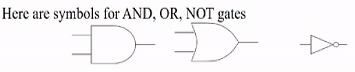

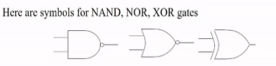

*   2-input AND, 2-input OR, 1-input Invertoer
*   each input is _one bit_ wide
*   NOT operator often drawn as "bubble" on input or output

__eg.__  
nice clean circuit: straight lines  
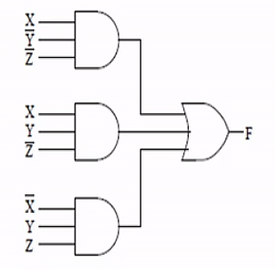

we have $\mathrm{F}=\mathrm{X} \overline{\mathrm{Y}}\cdot \overline{\mathrm{Z}}+\mathrm{XY} \overline{\mathrm{Z}}+\overline{\mathrm{X}} \mathrm{YZ}$

__eg.__ deriving truth table from circuit  
*   first label all intermediate values (A,B,C)
*   A is OR gate, with two inputs (X,Y) negated.
*   B is NAND gate, with two inputs (X,A)
*   C is NAND gate, with two inputs (Y,A)
*   F is OR gate, with two inputs (B,C) negated

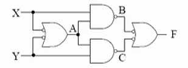

|X|Y||A|B|C||F|
|:-:|:-:|:-:|:-:|:-:|:-:|:-:|:-:|
|1|1||0|1|1||0|
|1|0||1|0|1||1|
|0|1||1|1|0||1|
|0|0||1|1|1||0|

## transistors
### implementing gates with transistors

*   transistor: an electrically-controlled switch  
    
*   NMOS transistor (n-transistor):  
    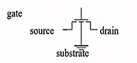
*   by control the voltage of gate, source, drain, we can control the current flow

__eg.__  
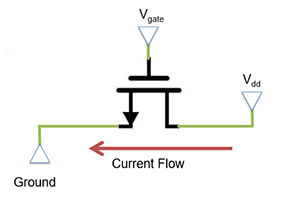

*   assume a voltage 5V at drain
*   current _wants to flow from Drain to Source_ (ground in this eg)
*   Gates acts as a barrier to this current
*   by increasing the voltage at gate, the barrier is removed and current flows
*   can model transistors as resistance
    *   high Vgate: low resistance -> current flows 
    *   low Vgate: high resistance -> no current
*   __rule__: if there is direct path way from power to ground, then F is low

#### NMOS as Not gate
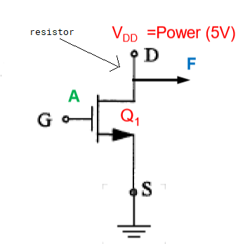
|input|resistance Q1|F|
|:-:|:-:|:-:|
|0|high|1|
|1|low|0|
*   arrow out from gate toward source
*   VDD is power source, G is gate, S is source (ground), F is output
*   A is low -> gate low voltage -> high resistance Q1 -> F is connected to VDD -> F is high
    *   current is blocked to ground, so all of it goes to F
*   A is high -> gate high voltage -> low resistance Q1 -> F is connected to ground -> F is low
    *   current is not blocked, so it can go to ground, a little (0.8V) current goes to F
*   in real world, there is a resistor between power and drain to prevent burning out

#### PMOS
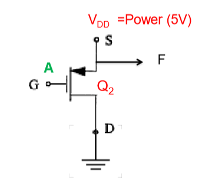
|input|resistance Q1|F|
|:-:|:-:|:-:|
|0|low|0|
|1|high|1|
*   reverse of NMOS
*   arrow towards gate out from VDD

A=1 is 5V, A=0 is 0.8V.

*   NMOS is not perfect, it transmits strong 0, but weak 1 (like 4V)
*   PMOS transmits strong 1, but weak 0

#### CMOS (complementary MOS transistor)
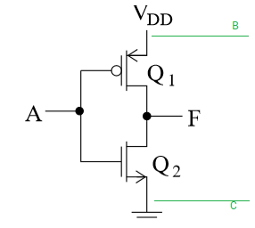
|A|Q1|Q2|F|
|:-:|:-:|:-:|:-:|
|0|low|high|1|
|1|high|low|0|
*   CMOS uses both NMOS and PMOS (circle means PMOS), NMOS grounded, PMOS at power
*   Qs are inner resistances of each transistor
*   no bad flow of current (short circuit)
*   no weak transmissions
*   when A is 0, Q2 blocks current to the ground so it goes to F
*   when A is 1, Q2 is "ON", the internal current will be enough to feed ground

__eg.__ what will the signal be at B?  
the only way B is 0 is both Q1,Q2 are low, which is not possible in the configuration. so B is always 1.  
in other cases B and F are in parallel, so voltages are equal

__eg.__ what will the signal be at C?  
C is always 0 because it is always grounded.

#### CMOS NAND
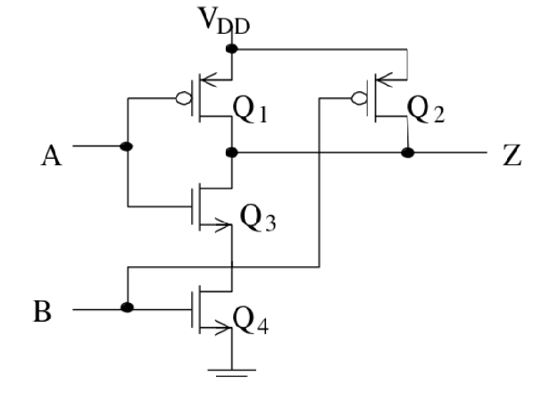  
|A|B|Q1|Q2|Q3|Q4|Z||
|:-:|:-:|:-:|:-:|:-:|:-:|:-:|:-:|
|0|0|low|low|high|high|1|
|0|1|low|high|low|high|1|
|1|0|high|low|low|high|1|
|1|1|high|high|low|low|0|
|||h|h|h|h|float|bad state|
|||l|l|l|l|short circuit|bad state|

*   NAND uses 4 transistors
*   Q3 and Q4 are in series, if one of them has high Q, then power->ground is blocked
*   if Q3 and Q4 are both low, they are "ON", generating enough current to feed ground

__eg.__ which resistances must be low to have a short circuit?  
one of Q1,Q2, both of Q3,Q4

__eg.__ which resistances must be high to have a float  
both of Q1,Q2, one of Q3,Q4

#### 2-input AND
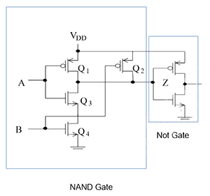
*   add one NOT gate
*   uses 2 more transistors

#### 3-input NAND


# Week 3. May 25

## decoders
*   translate the n-bit input into a signal that corresponds to the binary value of the n-bit input
*   __$n$ inputs map to $2^n$ outputs possible__
*   only one input is high for each input combination

__eg.__ 3-to-8 (or 3-bit) decoder  
|dec||A2|A1|A0||D7|D6|D5|D4|D3|D2|D1|D0|
|:-:|:-:|:-:|:-:|:-:|:-:|:-:|:-:|:-:|:-:|:-:|:-:|:-:|:-:|
|0||0|0|0||0|0|0|0|0|0|0|_1_|
|1||0|0|_1_||0|0|0|0|0|0|_1_|0|
|2||0|_1_|0||0|0|0|0|0|_1_|0|0|
|3||0|_1_|_1_||0|0|0|0|_1_|0|0|0|
|4||_1_|0|0||0|0|0|_1_|0|0|0|0|
|5||_1_|0|_1_||0|0|_1_|0|0|0|0|0|
|6||_1_|_1_|0||0|_1_|0|0|0|0|0|0|
|7||_1_|_1_|_1_||_1_|0|0|0|0|0|0|0|

we can draw the decoder using symbol  


implementation using only AND gates  
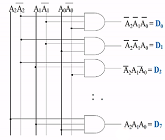
*   used three switches to respond to 8 outputs

### memory expansion

## multiplexer
*   also called a selector
*   _choose one input from $2^n$ inputs and reflect it on the output_
*   input: $2^n$ lines (D0,...,D2n-1), $n$ select lines (Sn-1,...,S0)
*   output: one single output based on one source of input data

q1 2

__eg.__ 4-1 multiplexer  
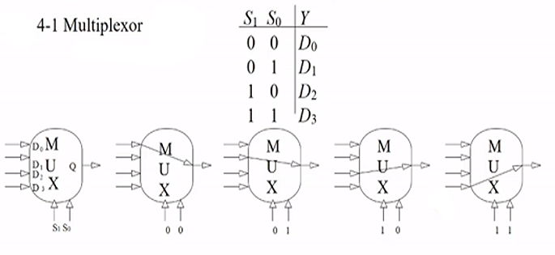

*   there are 4 lines to select from D0,D1,D2,D3
*   there are 2 select lines S0,S1
*   if S0,S1 are both 0, then 00 means zero, first line is selected
*   note S0 is always the lower order bit

implementation:  
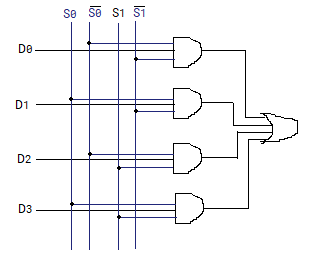  

or

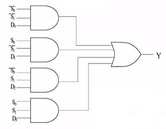
*   if S0,S1 are both 0, then only the first gate has both 1, all other three are short circuit. the result of Y is decided by D0.

__eg.__ realize truth table using one mux
```
         X---X
       +X     X
       |X     X
       |      +             X  Y  Z |F
 Z +---+D0    |             0  0  0 |0
       |      |             0  0  1 |1
       |      |             0  1  0 |0
 0 +---+D1    |             0  1  1 |0
       |      +------+F     1  0  1 |0
       |      |             1  0  0 |1
~Z +---+D2    |             1  1  0 |1
       |      |             1  1  1 |1
       |      |
 1 +---+D3    |
       |      X        (when X=Y=0, F is decided
       +X     X         by D0, we see Z behaves
        X ---X          the same as F...)
         +   +          when X=0,Y=1,...
         |   |
         +   +
        S1   S0
         X   Y
```

### array
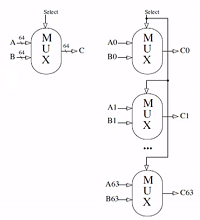
*   slash notation is used to indicate lines carrying multiple bits, implying parallel constructions
*   externally looks like 1 mux that takes 2 inputs and select 1
*   note _only one_ bit is needed to selected between A and B in this eg
*   output bits C0,...,C63 combine to result in C

q1 d

## clocks and sequential circuits
*   two types: synchronous (has a clock memory changes only at discrete points of time)
*   asynchronous: no clock potentially faster and less power-hungary
*   clocks: controlled input signal into the system
*   clock is high = 1, clock is low = 0
*   from one rising edge the next rising edge is a cycle

```
   rise       fall        1
      +-------+       +-------+
      |       |       |       |   0
+-----+       +-------+       +------+

      <--------------->
         clock cycle
```

## SR latch
*   simplest block of memory
*   a block to store a binary 0 or 1
*   __Set__ means set Q to 1
*   __Reset__ means set Q to 0
*   is not clocked

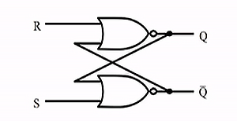

*   unclocked memory bit: 1 bit recycles through gates

__latch store S=0, R=0__. for any previous value (Q, ~Q), the outputs (Q, ~Q) don't change

__latch set S=1, R=0__. output becomes (Q, ~Q) = (1, 0)

__latch reset S=0, R=1__. output becomes (Q, ~Q) = (0, 1)

once set or reset completes, the system will return to steady state S=0, R=0. so new value stored.

__latch oscillate S=1, R=1__. undesirable behavior. should be avoided.
*   when S=R=1, the output becomes (Q, ~Q) = (0, 0)
*   but if then change to S=R=0, the output becomes (1, 1) and then to (0, 0), ...

## D-latch
*   add a clock pulse
*   use one single input source D
*   controls the inputs to the S and R such that they can never both be 1

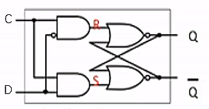

|C|D|next state of Q|
|:-:|:-:|:-:|
|0|x|no change|
|1|0|Q=0 (reset)|
|1|1|Q=1 (set)|

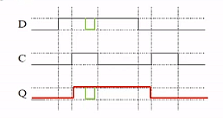

*   only can set/reset when clock is 1, otherwise Q stays same (red, 1st and 2nd vertical line)
*   drawback: any change in D during high clock pulse will be reflected in Q (green), no longer uniform (discrete point in time)
*   22 transistors needed in a d-latch (2+6+6+4+4)

## D Flip-Flop
*   state only to be affected at discrete points in time
*   master (left) slave (right) design
*   QE related to original clock: _update occurs on falling edge of clock pulse only_

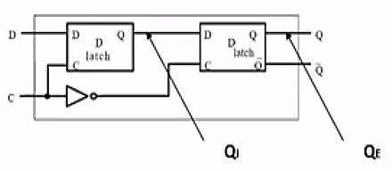

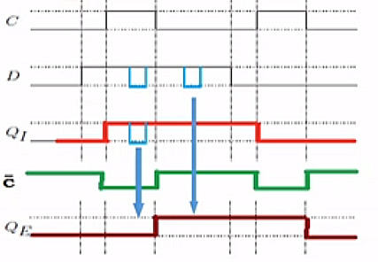

*   d flip flops used for each bit of each register in the register file
*   64-bit register needs 64 d-flip flops
*   useful for small memory eg RF ^

# Week 4. June 1

## register file

register: an array of flip-flops
*   stuff is computed during a clock cycle, after it finishes stuff is written on the falling edge of a clock cycle

register file: a way to organize registers
*   max number of registers to read from is 2 (`add x1,x2,x3`) (two 5bit numbers to specify because we have 31 registers)
*   number of registers to write to is 1 (one 5bit number to specify)
```
   5bit +---------------------------------+
+-------> read                  read data |   64bit
        | register #1           output #1 +--------->
   5    |                                 |
+-------> read                            |
        | register #2                     |
   5    |                                 |
+-------> write                           |
        | register #                      |
   64   |                       read data |   64
+-------> write                 output #2 +--------->
        | data                            |
        |            write                |
        +--------------^------------------+
                       |control bit
                       |
                       +
```
control bit is 1 if one wants to write stuff (`add`, `ldur`), it is 0 if not (`b`, `cbz`).

### write operation

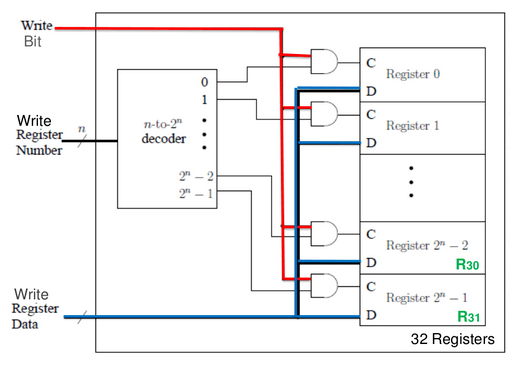
*   data goes to every register (D) even not all register gets modified
*   the write (control) bit and the output of the decoder decides whether register is enabled, which one is enabled
*   control bit (C) is only true for one register being chosen
*   clock is external, not in diagram!


note the number of register does not depend on architecture.

__eg.__ 64bit architecture, 16 register in total. then
*   each reg still stores 64 bits
*   64 bits of write data are provided
*   1 bit is for the write bit.

the only difference is the size of decoder (input/output).

### read operation
we read two registers in parallel.

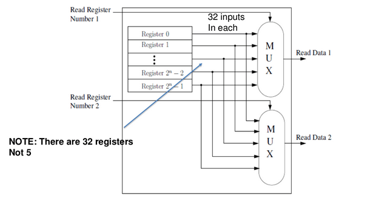
*   throw out all the contents of registers, and fed them into two muxes
*   the select line (5bits), which are the bits to specify regs, chooses one data to output
*   (note that the two big muxes are actually series of 32x1 1bit muxes)

we never do both read and write at the same time

## finite state machine (Moore)

__eg.__ traffic lights
```
         +  N  +
         |     |
         |     |
         +-----+
 NS light+-----+
+--------+     +-------+
                ||
W               ||     S
                ||
+--------+     +-------+
         |     |SW light
         |     |
         |     |
         +  S  +
```
*   NSlight, EWlight are states of the two traffic lights
*   state is one of red, green
*   EWcar means there are cars detected in east-west direction
    *   then EW light is green (EWgreen)
*   NScar means there are cars in north-south direction
    *   then NS light is green (NSgreen)

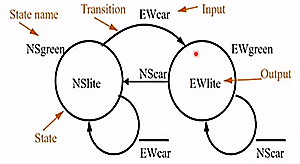

one bit is used to indicate green/red.

*   names of states outside ovals (NSgreen, EWgreen)
*   output in given state inside oval
*   transition arc labelled with boolean formula of inputs (bar indicates not)
*   must stay in one state for at least one clock cycle

__eg.__ extend the traffic light to handle yellow light

*   g means green, r means red, y means yellow
*   TS indicates whether 28 secs have passed (as input) (green must stay over 28 secs)
    *   so 28 is multiple of one clock cycle 
*   TR bit means to reset the above counter (as output)

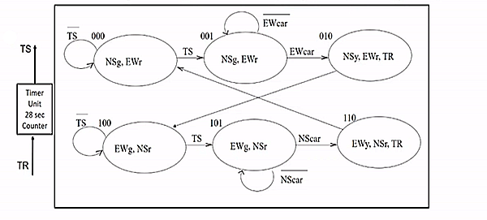

state transition table:

|current state|inputs|next state||
|:-:|:-:|:-:|:-:|
|S2 S1 S0|NScar EWcar TS|S2' S1' S0'||
|000|XX0|000|
|000|XX1|001|
|001|X0X|001|
|001|X1X|010|
|010|XXX|100|
|011|XXX|XXX|don't care|
|100|XX0|100|
|100|XX1|101|
|101|0XX|101|
|101|1XX|110|
|110|XXX|000|
|111|XXX|XXX|don't care|

*   X bit means don't care
*   011 and 111 never happen

use the min terms (output bit to be 1), we can conclude formula for each bit
*   $S_0'=\overline{S_1}\cdot\overline{S_0}\cdot TS+\overline{S_2}\cdot\overline{S_1}\cdot S_0\cdot \overline{EWcar}+S_2\cdot\overline{S_1}\cdot S_0\cdot\overline{NScar}$
*   $S_1'=\overline{S_2}\cdot\overline{S_1}\cdot S_0\cdot EWcar+S_2\cdot\overline{S_1}\cdot S_0\cdot NScar$
*   $S_2'=\overline{S_2}\cdot S_1\cdot\overline{S_0}+S_2\cdot\overline{S_1}$

output table:
*   only care about current state and its corresponding output
*   (output is not related to input)
*   if bit is present, it is 1

|S2 S1 S0|NSg NSy NSr EWg EWy EWr TR||
|:-:|:-:|:-:|
|000|1000010|NSg,EWr|
|001|1000010|NSg,EWr|
|010|0100011|NSy,EWr,TR|
|011|XXXXXXX||
|100|0011000|NSr,EWg|
|101|0011000|NSr,EWg|
|110|0010101|NSr,EWy,TR|
|111|XXXXXXX||

*   $NSg=\overline{S_2}\cdot\overline{S_1}$
*   $EWg=S_2\cdot\overline{S_1}$
*   $NSy=\overline{S_2}\cdot S_1\cdot\overline{S_0}$
*   $EWy=S_2\cdot S_1\cdot\overline{S_0}$
*   $NSr=S_2$
*   $EWr=\overline{S_2}$
*   $TR=S_1\cdot\overline{S_0}$

__eg.__ can draw a circuit for one state and one output of them

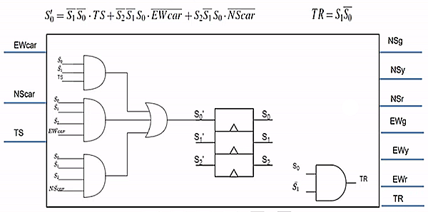

(triangle means clocked)

# Week 5. June 8

armv8 word:
*   1 byte = 8 bits; 4 bytes = 1 word; 8 bytes = 1 dword
*   bits numbered 63,62,...,0
*   MSB is 63, LSB is 0

## ASCII
...
*   7 bits for character code, 1 leftmost bit for checking
*   leading 1 -> even number of 1's in the rest 7 bits eg `1 0011011`
*   leading 0 -> odd

## unsigned and signed binary numbers
see cs241 note

__eg.__ with 4 bits, `1110` is -6. what's this number with 8 bits?  
copy old MSB to the new positions, answer is `1111 1110`.

## logic operations

||||
|:-:|:-:|:-:|
||1101|
|arithmetic shift right|1110|
|logical shift right|0110|
|shift left|1010|
|circular shift right|1110|use overflown bit for void space
|circular shift left|1011|
|bitwise and, or, xor, nor|

## full adder
*   basic building block of addition circuit

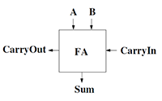

|A|B|CarryIn||CarryOut|Sum|
|:-:|:-:|:-:|:-:|:-:|:-:|
|0|0|0||0|0|
|0|0|1||0|1|
|0|1|0||0|1|
|0|1|1||1|0|
|1|0|0||0|1|
|1|0|1||1|0|
|1|1|0||1|0|
|1|1|1||1|1|

*   $S=A \text{ xor } B\text{ xor }C_\text{in}$
*   $C_\text{out}=AB+AC_{\text{in}}+BC_\text{in}$

### 4-bit ripple-carry adder
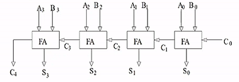

*   connect carries
*   S3S2S1S0 is the output
*   drawback: slow, "carry-lookahead" idea can be used

## arithmetic logic unit

### 1-bit ALU
*   extends functionality of full adder
*   input is 1 bit
*   can compute AND, OR and add

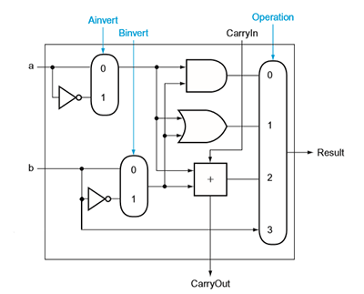

operation is the input to the mux (0,1,2,3)

|ALU operation|function||
|:-:|:-:|:-:|
|Ainv Binv Op1 Op0|||
|0000|AND|
|0001|OR|
|0010|add|
|0110|sub|
|1100|NOR|
|0011|Pass|result=B

__note__ Binv is connected to the first CarryIn

__eg.__ to compute subtraction a-b=a+(-b), we invert b, add to a, then add 1.  

__eg.__ to compute A NOR B, we invert both a and b, and perform A AND B. (since $\overline{A+B}=\overline{A}\cdot\overline{B}$)

__eg.__ it can also do NAND.

### 64-bit ALU
*   we can chain 64 of these to support 64 bit arithmetic:
*   given two n bit input, the result is n bit

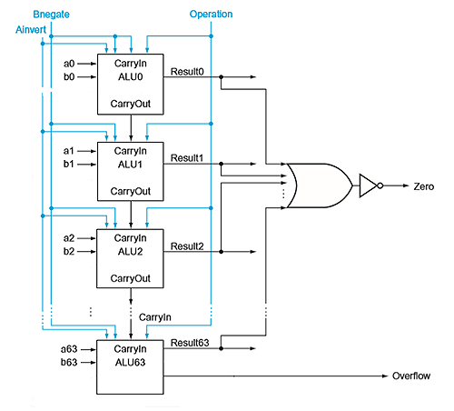

__eg.__ overflow happens only if A, B have same sign and the result has different sign, iff the final sign bit's CarryIn and CarryOut are different.  
if two operands have different sign, the final CarryOut is ignored if there is.

we use the following notation to represent ALU:

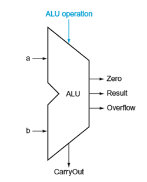

## multiplication
*   input: two n bit numbers, output: 2n bit number
*   multiplicand * multiplier = result

procedure for doing 64bit multiplication -> result is 128 bit:  
```
                +-----+
                |start|
                +--+--+
                   |
                   | <--------------------+
                   v                      |
Multiplier0=1 +----+-----+  Multiplier0=0 |
     +------+ |1.test    |-----+          |
     |        |Multiplier0     |          |
     |        +----------+     |          |
     v                         |          |
+----+-------+                 |          |
|1a.add      |                 |          |
|multiplicand|                 |          |
|to product; |                 |          |
|place result|                 |          |
|to Product  +---+         <---+          |
|register    |   |         |              |
+------------+   |         |              |
                 v         v              |
            +----+---------+-----+        |
            |2.shift multiplicand|        |
            |register left 1 bit |        |
            +---------+----------+        |
                      |                   |
            +---------v-----------+       |
            |2.shift multiplier   |       |
            |register right 1 bit |       |
            +--------+------------+       |
                     |                    |
               +-----v-----+              |
               |  64 reps? +--------------+
               |           |   No
               +-----------+
                     |Yes
                     v
                  +--+-+
                  |done|
                  +----+
```

the hardware:  
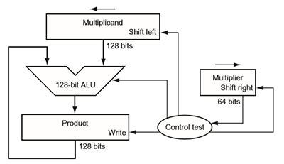

## floating point number
to represent a fractional number
*   uses idea of scientific notation: fraction, mantissa, exponent
*   normalized: single digit to left of decimal point
*   use 2 as base
*   eg: $1.01_2\times 2^4$ (normalized binary in scientific notation)
*   in normalized binary, leading digit of significant is always 1

__eg.__ convert a binary point number to decimal
```
10.10101   -> 1*2^1 + 0*2^0 + 1*2^-1 + 0*2^-2 1*2^-3 + +0*2^-4 + 1*2^-5
           -> 2.65625
```

### Floating Point registers
*   separate stack of FP
*   each FP register is 32 bits for single precision. double precision uses 64 bits or 2 consecutive FP registers

### IEEE 754
*   arm uses the IEEE 754 floating point standard format
```
31   30            22                           0
+---+-------------+-----------------------------+
| S |  exponent   |       significand           |
+---+-------------+-----------------------------+
1bit    8bits                23bits
```

1.  normalized numbers: always assume there exists a leading 1 in the number (save one bit). the only exception is when the number is 0
2.  biased exponent: x-127 (x is the value in the exponent field)
3.  sign: 1 means negative, 0 means positive

interpreted value from the hardware is 
$$(-1)^\text{Sign}\times(1+\text{significand})\times 2^\text{exponent - bias}$$
where bias=127 for single precision.

*   exponent is stored in biased notation: so 8 bit exponent field is a positive value. it is easier to 
*   special cases: exponents of 0000 0000 and 1111 1111 are reserved
*   range of exponents: -126 (0000 0001) to +127 (1111 1110)

__eg.__ i want an exponent of -50: 2^-50. what is my biased 8 bit representation?  
77-127=-50 so it is 77.

__eg.__ i want an exponent of -50: 2^50. what is my biased 8 bit representation?  
177-127=50 so it is 177.

__eg.__ convert 0.625 decimal to binary  
multiply fraction by 2 repeatedly:
||||
|:-:|:-:|:-|
|0.625*2=_1_.25|keep 1 as first digit|0.1|
|0.25*2=_0_.5|keep 0 as next digit|0.10|
|0.5*2=_1_.0|keep 1 as next digit|0.101|
rest digit is 0 so it is done. the result is precisely 0.101.

__eg.__ convert 2.625 to binary  
2 is 10 as binary,  
.625 is .101 as binary.  
so 2.625 is 10.101 * 2^0 as binary.  
need to normalize, so it should be 1.0101 * 2^1.  
SIGN BIT: 0 (positive)  
exponent: x-bias should give 1+127=128  
significant bits: 0101  
hence answer is 0 10000000 01010000000000000000000.

__eg.__ convert 0.1 to floating point number  
||||
|:-:|:-:|:-|
|0.1*2=0.2|keep 0 as first digit|0.0|
|0.2*2=0.4|keep 0 as next digit|0.00|
|0.4*2=0.8|keep 0 as next digit|0.000|
|0.8*2=1.6|keep 1 as next digit|0.0001|
|0.6*2=1.2|keep 1 as next digit|0.00011|
|0.2*2=0.4|repeat||
repeating pattern is $0.0\overline{0011}$ which is infinite. have to truncate.

__eg.__ what is binary reading from 0 01111111 10101000000000000000000  
exponent bit is 01111111 -> 127, so real exponent is 127-127=0. the binary number is 1.10101 * 2^0.

__eg.__ overflow is detected using exponent. 1.010101010101010101010101010101010101010101 * 2^-129 has overflow, but that is determined by "-129" not the precision bits (which are truncated anyways).

### addition
*   decimal example: 9.54\*10^2 + 6.83\*10^1
*   match exponents: 9.54\*10^2 + 0.683\*10^2
*   add significand with sign: 10.223*10^2
*   normalize: 1.0223*10^3
*   check for exponent overflow
*   round: 1.02*10^3
*   may have to normalize again

### multiplication
*   decimal example: 9.54\*10^2 \* 6.83\*10^1
*   add exponents: 2+1=3
*   multiply significands: 9.54*6.83=65.1582
*   result: 65.1582*10^3
*   normalize: 6.51582*10^4
*   check overflow
*   round: 6.52*10^4
*   may have to normalize again
*   set sign
*   same for binary number

# Week 6. June 15

## memory hierarchy
*   processor works with memory that is closest to it
    *   register file, instruction & data mem (cache)
    *   instructions and data stored in local caches close to the processor
*   main levels: caches, main memory (RAM), hard drive (Disk)

```
+---------------------------------------+   +------+
| +------+ +-----------------+  +-----+ |   |      |
| |      | |                 |  |     | |   | DRAM |
| | SRAM | | REGISTER FILE   |  |SRAM | |   |      |
| |      | |                 |  |     | |   |      | DISK
| |      | |                 |  |     | |   |      |
| |      | |                 |  |     | |   |      |
| |      | |                 |  |     | |   |      |
| +------+ +-----------------+  +-----+ |   |      |
+---------------------------------------+   +------+
```

### static random access memory (SRAM)
*   uses D latches
*   register file worked for smaller memory and would not scale up (decoders and mux too big). we use three-state buffers to fix mux problems and two-level encoding to fix decoder problem
*   updates to memory occur in one clock cycle
```
            21bits
    address +----> +-------------+
                   |             |
                   |             |
chip select +----> |             |
                   |   SRAM      | 16
    output  +----> |   2M x 16   +------>Dout[15-0]
                   |             |
write enable+----> |             |
                   |             |
            16bits |             |
   Din[15-0]+----> +-------------+
```
address is 21 bits and data is 16 bits in this eg.  

### three-state buffer
*   we have multiple of a bit cell
*   all data from memory is transmitted back to the process on the same path (transmission bus), so must have the ability of allow an address but block all others

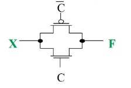
*   has three outputs 0, 1, floating (connected to neither power or ground)
*   uses a PMOS and a NMOS

|C|X|F||
|:-:|:-:|:-:|:-|
|1|1|1|both low resistance, transmit as-is
|1|0|1|both low resistance, transmit as-is
|0|x|-|both high resistance, both transistors off

__eg.__ 3-state buffer is depicted by triangle. use them to select a data

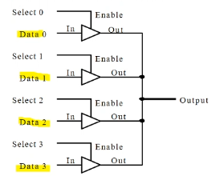
*   behaves like mux, but has 4 outputs, 4 select bits
*   allows multiple inputs to be tied to one source, but one and only one input is allowed to continue as output, or short-circuit.

__structure of SRAM__

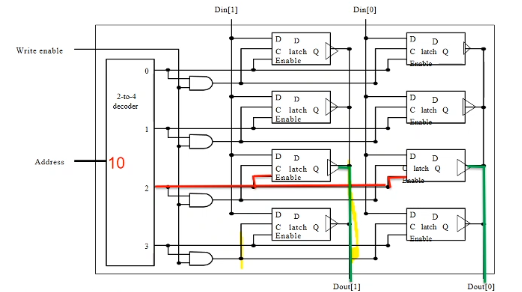
*   in this eg, word size is 2 bits (2 columns), there are 4 addresses (word lines)
*   the "enable" bit is connected to 3-state buffer as c

better SRAM uses min 6 transistors / bit, register file 46 transistors / bit.

### dynamic RAM (DRAM)
*   SRAM still uses a lot of transistors
*   use a capacitor to store a charge to represent 1, no charge to represent 0
*   use 1 capacitor to store data. use 1 transistor to connect to it r/w bit
*   must refresh charge. refresh is handled a row a time (external controller). fraction of timed to refresh is max 4% or 1-2% of active clock cycles. not heavy penalty.
*   SDRAM: synchronized DRAM (with external clock)

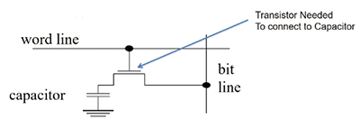

by using two level encoding, we split the address, half go to the decoder to select word, half go to the mux to select a particular bit out of the word.

__important:__
*   SRAM: expensive but fast. used in caches
*   DRAM: cheaper but slower. always need to refresh the capacitors. a read from a capacitor will dissipate the charge. for read, need to read the charge and write it back
*   DRAM: main memory typically implements DRAM, SDRAM, SDDRAM etc

## single cycle data path

### high level view

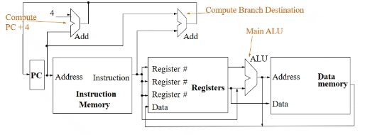

*   at beginning of a cycle, PC split: one current PC goes to right, one is the computed PC+4 (top); the computations of PC+4 and the execution of current instruction happen in parallel; when a cycle finishes, it will decide whether the next instruction is PC+4, or branch target address (that is computed using `CBZ`).
    *   actual PC is not updated until the end
    *   the top right Adder is for computing target address
    *   PC is stored in a register (64 bits) with d flip flop
*   for like `ADD`, two registers X2,X3 go to ALU, result goes back to register file as data, the specified register X1 is written.
*   ALU has 4 select bit. two are op, two are A,B-invert
*   i am allowed to do read/write at the same time in register file

### instruction formats
an instruction is specified by 32 bits
```
R-format:   ADD X1, X2, X3      =>   ADD Rd, Rn, Rm
    opcode (31-21)
    Rm (20-16)
    shamt (15-10)
    Rn (9-5)
    Rd (4-0)

I-format:   ADDI X1, X2, #4     =>   ADDI Rd, Rn, immediate
    opcode (31-22)
    ALU immediate (21-10) (unsigned 12 bit)
    Rn (9-5)
    Rd (4-0)

D-format:   LDUR X1, [X2, #200] => LDUR Rd, [Rn, immediate]
    opcode (31-21)
    DT address (20-12) (signed 9 bit)
    op (11-10) (not used)
    Rn (9-5)
    Rd (4-0)

B-format:   B #3000
    opcode (31-26)
    BR address (25-0) (signed 26 bit)

CB-format:  CBZ X1, #3000 => CBZ Rt, immediate
    opcode (31-24)
    COND BR address (23-5) (signed 19 bit)
    Rt (4-0)
```
*   all R-formats specify the instruction bits exactly the same. the only difference is the type of operation performed by ALU - a separate controller _ALU control unit_ determines what operation
*   opcode contains a portion called _funct bits_, which only exist for R-formats

#### opcodes
|instruction|opcode|format|
|:-:|:-|:-:|
|B|0001 01|B|
|ADD|1000 1011 000|R|
|ADDI|1001 0001 00|I|
|CBZ|1011 0100|CB|
|CBNZ|1011 0101|CB|
|SUB|1100 1011 000|R|
|SUBI|1101 0001 00|I|
|STUR|1111 1000 000|D|
|LDUR|1111 1000 010|D|

### full data path

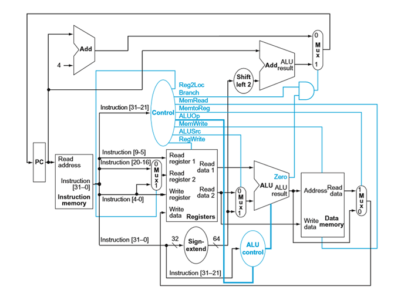

#### walking through data path

Control bits:
|type|Reg2Loc|ALUSrc|MemToReg|RegWrite|MemRead|MemWrite|Branch|ALUop1|ALUop0|
|:-:|:-:|:-:|:-:|:-:|:-:|:-:|:-:|:-:|:-:|
|R-format|0|0|0|1|0|0|0|1|0|
|LDUR|x|1|1|1|1|0|0|0|0|
|STUR|1|1|x|0|0|1|0|0|0|
|CBZ|1|0|x|0|0|0|1|0|1|

__eg.__ `ADD X1, X2, X3` is R-format  

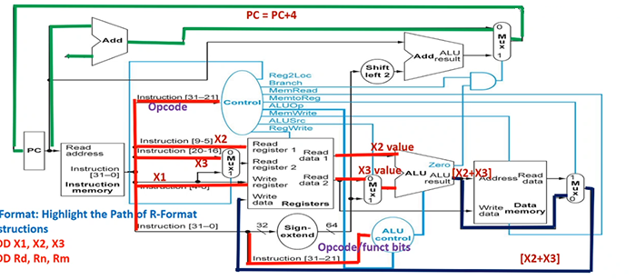

suppose current PC is 100. first these happen in parallel:
*   PC+4 is computed at the top adder
*   instruction[31-21] goes to control mux
    *   Reg2Loc (0) is chosen
    *   ALUOp is two bits 10 (below)
    *   note: Branch is 0
    *   note: ALUSrc is 0
    *   note: MemtoReg is 0
    *   RegWrite is 1
*   instruction[9-5] (`X2`) goes to Read register 1
    *   Read data 1 outputs
*   instruction[20-16] (`X3`) goes to Mux, 0 is chosen, so it goes to Read register 2
    *   Read data 2 outputs
*   instruction[4-0] (`X1`) goes to Write register; also goes to Mux but is not chosen
*   instruction[31-21] also goes to ALU control

to the right:
*   Read data 1 goes to ALU
*   Read data 2 goes to Mux, 0 is chosen because of ALUSrc, then goes to ALU
*   ALU performs operation according to ALU control.
    *   ALU result outputs

to the right:
*   ALU result goes to mem and Mux, since MemtoReg is 0, it will not read data from mem. 0 in Mux is chosen, it goes to register's Write data

at the top:
*   PC+4 goes to Mux. since Branch bit in Control is 0, mux selects 0, so PC+4 goes back to PC. PC becomes 104.

ALUop has four choices: 00,01,10,11. if it is 10, that means instruction is R format. we will use function bit from instruction[31-21] to determine what to do on ALU. otherwise function bits are useless, we forward the ALUop to ALU (ie 00 -> add, 11 -> sub, 01 -> passb). in this case `ADD` is R-format, so funct bits are used.

__eg.__ `ADDI X1, X2, #4` is I-format  
PC operations are same as above. first
*   instruction[31-21] goes to control mux (even though actual opcode is less than 11 bits)
    *   note: ALUop is 00
    *   ALUSrc is 1
*   instruction[9-5] goes to Read register (`X2`)
*   all instruction[31-0] goes to Sign-extend
    *   Sign-extend interprets opcode and if it is `ADDI` or `SUBI`, then instruction[21-10] are unsigned, 12 bit immediate value i care about. Sign-extend generates a 64 bit number by padding 0's even if top bit may be 1. (note if other instructions where immediates are signed, it will pad 1's correctly for negative values, such as `LDUR`)

to the right:
*   Read Data 1 goes to ALU
*   Sign-extend goes to Mux, since ALUSrc is 1, it goes to ALU
*   as ALUop is 00, the ALU control does not care "funct bits", since 00 -> add, ALU performs ALU addition
*   writing back similar

__eg.__ `LDUR X1, [X2, #400]` is D-format  

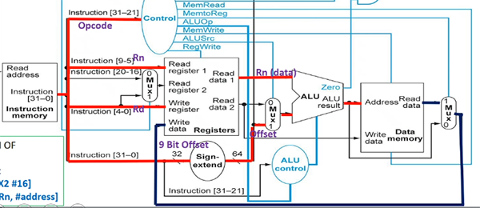

# Week 7. June 22

__eg.__ `CBZ X1, #100` is CB-format

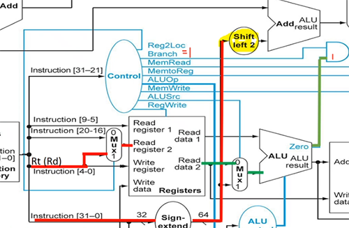

at the top:
*   instruction[23-5] goes to sign extend and convert the signed bits to 64 bit signed number by correctly padding 2's complement.
    *   it is then shifted by 2 (multiplied by 4)
*   current PC goes to top right adder
    *   so PC + (address*4) is computed

at same time:
*   instruction[4-0] goes to Mux
    *   since Reg2Loc is 1, the Mux selects 1. so it goes to Read register 2, then Read data 2 outputs

at the right:
*   since ALUSrc is 0, Read data 2 goes to Mux and selects 0, so it goes to ALU.
*   since this is not R-format, and ALUOp is 01, ALU control forwards pass-b.
    *   original X1 is output by ALU
    *   there is a Zero bit corresponding to ALU's result. if result (X1) is 0, then the top AND gate is on. hence the top right Mux is 1. otherwise the Mux choose 0, the default PC+4.
    *   so PC + (address*4) is chosen and written back

## single-cycle control

overview:

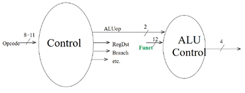

*   ALU control only tells ALU what to do (outputs inputs to ALU)


|operation|ALUop|opcode|ALU control input|action|
|:-:|:-:|:-:|:-:|:-:|
|LDUR|00||0010|add|
|STUR|00||0010|add|
|CBZ|01||0011|passb|
|ADDI|00||0010|add|
|SUBI|11||0110|sub|
|ADD|10|100010 11000|0010|add|
|SUB|10|110010 11000|0110|sub|
|AND|10|100010 10000|0000|and|
|ORR|10|101010 10000|0001|or|

*   Control (left) hardwares opcodes to control bits!
*   all combinational logic: no memory, no state bits, only AND, OR gates
*   there are _funct bits_ within opcode, which is only used when opcode is R-format

### timing

__eg.__ 

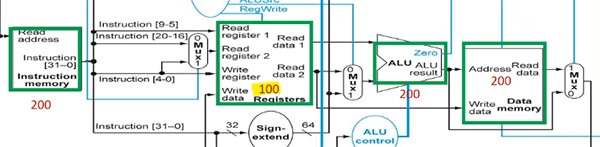

*   mem units: 200ps, ALU: 200ps, reg file: 100ps read + 100 ps write
*   other units negligible
*   then R-format takes 200 (instr mem) + 100 (read reg) + 200 (alu) + 100 (write reg) = 600ps
*   LDUR: 200 (instr mem) + 100 (read addr from reg) + 200 (alu (compute addr offset)) + 200 (read mem) + 100 (write to reg) = 800ps (slowest)
*   STUR: 200 + 100 + 200 + 200 = 700ps (don't need to write to reg)
*   CBZ: 200 (instr mem) + 100 (read reg) + 200 (alu) = 500ps (we say top right adder is negligible)
*   so clock period must be increased to 800ps.

__eg.__ now assume two top PC adders also take 200ps. timings stay the same because top two adders run in parallel with bottom.

__eg.__ now assume Control mux takes 10ps. then R-formats takes extra 10ps (reads both reg, have to wait for mux); LDUR does not (it only reads one reg); STUR takes extra 10ps; CBZ takes extra 10ps (its reg goes to Mux)

### modifying data path
*   normally design complete dada path for all instructions together
*   one approach:
    *   determine new data path needed for new command
    *   check if any components in current data path can be used
    *   wire in components of new data path into existing
    *   add new control signals, adjust old signals

__eg.__ `B #400`

31-26 is opcode, 25-0 is BR address. also compute PC + 4*offset.

|type|Reg2Loc|ALUSrc|MemToReg|RegWrite|MemRead|MemWrite|Branch|ALUop1|ALUop0|Uncond branch|
|:-:|:-:|:-:|:-:|:-:|:-:|:-:|:-:|:-:|:-:|:-:|
|B|x|x|x|0|0|0|x|x|x|1|
Uncond branch is 0 for other instructions.

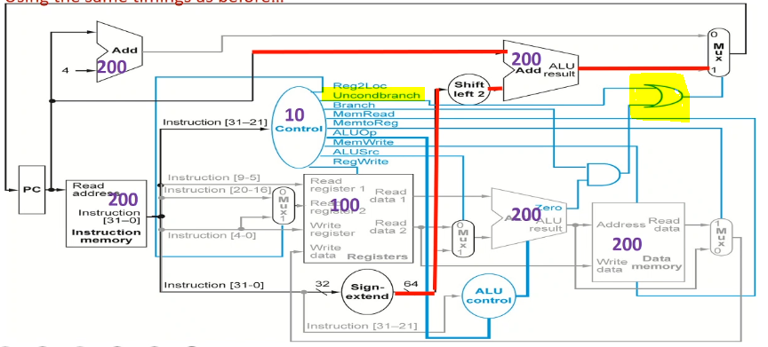

needs to take 400ps in above settings.

memread, memwrite, regwrite must not be don't care

# Week 8. June 29

## multicycle datapath
*   take this datapath and break it up into 5 steps. use several clock cycles to execute one instruction
*   steps:
    1.  IF: instruction fetch, update PC+4 all times (may update again for branch instructions)
    2.  ID: instruction decode, read from register file
    3.  EX: execute, use ALUs
    4.  MEM: r/w memory, or maybe update PC
    5.  WB: may write data back to register file

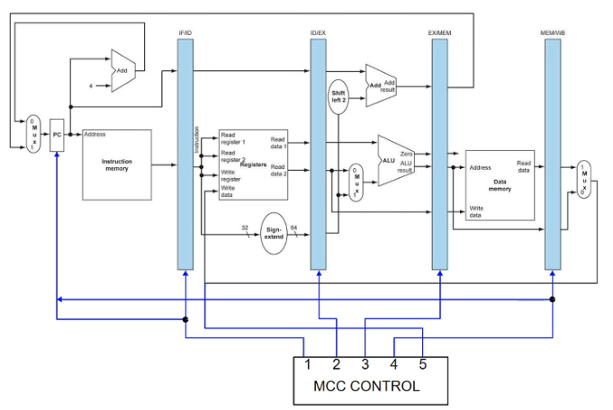

*   each step/clock cycle is 200ps; every instruction _must take 5 steps_; total exectution time for _every_ instruction is 1000ps (real muticycle control is smarter)
*   _register banks_ (intermediate registers) store information computed in one stage that is needed by later stages
*   simple finite state machine controller will cycle through 5 steps in order
    *   at a time one cycle is on; at the end of a cc, data is written to intermediate registers; at the beginning of a cc, data is retrieved from intermediate registers
*   similarity to single cycle: one instruction has exclusive use of the datapath

## pipelined datapath
*   intermediate registers are now _pipeline registers_: IFID, IDEX, EXMEM, MEMWB
    *   they store different control bits, regWrite, etc for different ongoing instructions
*   every stage of the pipeline contains a different instruction
*   one instruction begins every clock cycle
    *   ideal: one completed instruction every clock cycle
*   every pipeline register is updated every clock cycle
*   branch decision is in MEM stage

__eg.__ at the end of every clock cycle, PC is updated to PC+4 instantly

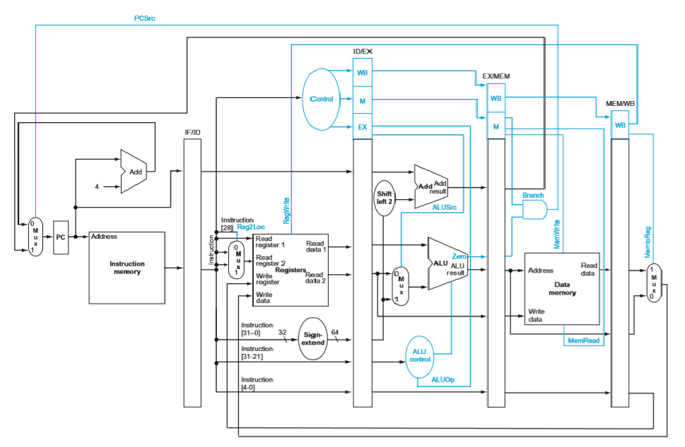

pipelined control
*   generate all control bits, and instructions carry them in subsequent stages
*   (no need for control signals for PC and new pipeline registers)
*   in each stage, some control bits are used, and are then no longer needed for future stages
*   for Reg2Loc bit, it is inferred directly from part of the instruction before generating Control bits, so registers know what to read from in ID stage, control bits are generated in parallel in ID stage

### pipeline hazards
hazard: event that blocks normal flow of instructions through pipeline
*   _structural hazard_: with single instruction/data memory, instruction fetch cannot overlap with load/store
    *   solution: separate instruction and data mem again
*   _data harzard_: result of one instruction is needed by next instruction
*   _control hazard_: conditional branch instruction may change sequence of instructions executed

### data hazard
__eg.__  
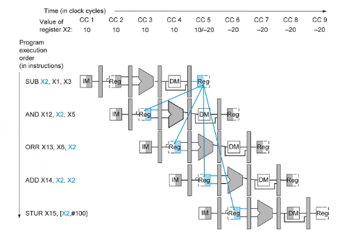
*   backward arrow means a value needs a future value - cannot go back in time
*   STUR is ok - value used after writing
*   ADD is ok: solution: allow reg file to be written to in 1st half, and read from in 2nd half
*   AND has data hazard: solution: delay 2 cycles
*   ORR has data hazard: solution: delay a cycle
*   new code:
    ```
    000 SUB X2,X1,X3
    004 NOP
    008 NOP
    012 AND X12,X2,X5
    016 ORR X13,X6,X2
    020 ADD X14,X2,X2
    024 STUR X15,[X2,#100]
    ```
*   `NOP` has its own line number, uses one clock cycle

solution2: in SUB, X2 is computed in ALU in CC3, in AND, X2 is an input of ALU in CC4. we can forward the computed value directly.  
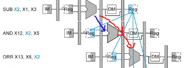

### forwarding datapath
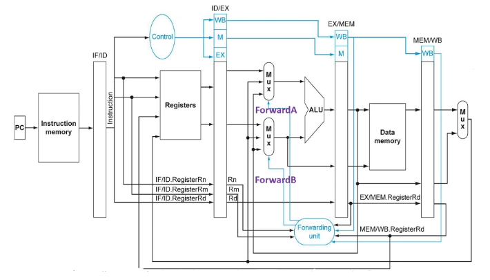

*   ALUSrc bit and mux omitted
*   Forwarding unit takes in three register numbers to determine if the farwarding is needed
    *   2 outputs: ForwardA, ForwardB to control input of ALU
        *   0: no forwarding
        *   1: forwarding from WB stage
        *   2: forwarding from MEM stage
*   only take data from where it is stable: pipeline registers, not middle of a clock cycle

__eg.__ have two R-formats. if destination register of one instruction is the first source of the next instruction, then the condition is
1.  EX/MEM.RegisterRd = ID/EX.RegisterRn1
2.  EX/MEM.RegWrite = 1

where
*   ID/EX.RegisterRn1 means the name of the register indicated in the Rn field of instruction _currently_ in ID/EX whose data come out of port 1 of the register file
*   ID/EX.RegisterRm2 means the name of the register indicated in the Rm field of instruction whose data come out of port 2 of the register file (output of Reg2Loc)

__eg.__
```
ADD X2, X6, X5
AND X12, X2, X5
```
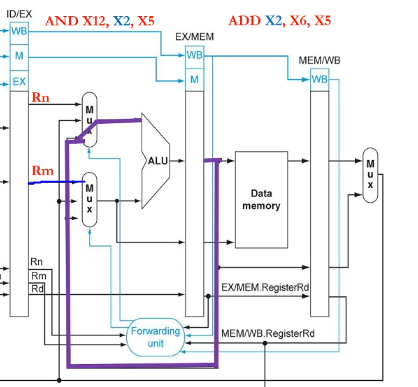

__eg.__ _load-use hazard_: this does not work if the first instruction is LDUR X2, [...] since the value is not ready. we have to delay it (by inserting a NOP between LDUR and AND), and do the forwarding next stage
```
LDUR X2, [X5, #100]     // NOP should be followed
AND X12, X2, X5
```


__eg.__ consider code
```
1. LDUR X1,[X2,#10]
2. LDUR X3,[X5,#10]     // load-use hazard
3. ADD X3,X5,X3
4. STUR X3,[X5,#10]
5. LDUR X1,[X6,#10]     // load-use hazard
6. ADD X3,X1,X4
7. STUR X4,[X3,#10]
8. ADDI X6,X4,X4
```
*   assuming forwarding, then we need to insert a NOP after lines 2, 5
*   assuming without forwarding, we need to insert 2 NOPs after lines 2, 3, 5, 6

# Week 9. July 6

__conditions of forwarding__
*   EX hazard 1a (forwarding from MEM to EX)
    *   if `EX/MEM.RegWrite and EX/MEM.RegisterRd != 31 and EX/MEM.RegisterRd == ID/EX.RegisterRn1`, then forwardA = 10
    *   1b similar, but with Rm2, ForwardB
*   MEM hazard 2a (forwarding from WB to EX)
    *   if `MEM/WB.RegWrite and MEM/WB.RegisterRd != 31 and not (EX/MEM.RegWrite and EX/MEM.Rd != 31 and EX/MEM.RegisterRd == ID/EX.RegisterRn1) and MEM/WB.RegisterRd == ID/EX.RegisterRn1`, then ForwardA = 01
    *   *   1b similar, but with Rm2, ForwardB

forwarding helps everything except LDUR.

### load-use stalling


*   the Hazard detection unit detects load-use hazard and inserts stalls in hardware
*   delay the instruction behind (ADD) for one cycle
    *   turn one copy of the instruction behind into a NOP by zeroing the control bits for the next clock cycle
    *   also block IF/ID register to not allow new instructions to be fetched and prevent PC from changing
*   so the instruction behind does nothing for one cycle, then continue going

__conditions__
*   instruction in ID/EX register must be load (can check MemRead signal)
*   if `ID/EX.MemRead and (ID/EX.RegisterRd == IF/ID.RegisterRn1 or ID/EX.RegisterRd == IF/ID.RegisterRm2)`

### code rearrangement with data forwarding
*   do not swap lines of code with data dependencies
*   do not swap into or out of loops

__eg.__ insert line 5 between 2 and 3 in the last eg to avoid NOP.

### timing
*   assign one clock cycle per instruction, plus the pipelining start time time (4 cycles)

__eg.__ in the last eg, it takes 8 (each) + 2 (two load-use stalling) + 4 (start) = 14 cycles

### control hazard (CBZ)

__eg.__  


before the branching decision is made in the _branch in mem stage_, three instructions (in IF, ID, EX stages) already began, we might want to cancel them if the branch condition is met.

*   if should take branch, flush the three instructions behind
*   zero out all control bits for 48 and 52 so they become NOP
*   44 does not have control bits yet, we may turn it into a harmless NOP instruction (changing opcode)
*   3 clock cycles wasted
*   if not take the branch, do nothing

### branch in ID stage
*   branch decision is pulled to ID stage instead of MEM stage
    *   because we already know the content of X1 in `CBZ X1,9` right after it goes out of register file
*   only flush one instruction in IF stage, thus wasting one clock cycle


__eg.__ what is the running time for
```
100 ADDI X1,XZR,#20
104 ADDI X2,XZR,#0
108 LDUR X3,[X4,#0]  // loop
112 ADD X2,X2,X3     // hazard <- insert stalling
116 ADDI X4,X4,#8
120 SUBI X1,X1,#1
124 CBNZ X1,#-4      // every time this jumps, add flushing
128 SUB X5,X5,X2
132 LDUR X3,[X6,#100]
136 ADDI X29,XZR,#100
```
assuming forwarding, stalling, and branching in MEM
*   2 (first 2 lines)
*   \+ 19(5+1+3) (first 19 iterations: 5 instr, 1 nop, 3 flush)
*   \+ 5+1 (last iteration, 5 instr, 1 nop, no flush)
*   \+ 3 (last 3 lines)
*   \+ 4 (start pipeline) = 186

if there is no flushing, we have to insert 3 NOPs after line 124.

assuming branching in ID
*   there is _branch data hazard_ in line 120 and 124 since CBNZ wants X1 in ID stage, but X1 now is being computed by SUBI in EX stage. we have to insert one _branch data stalling_ NOP in between so that SUBI can finish computation and store X1 result in MEM/WB register, then forwarded back to CBNZ in ID.
*   2 (first 2 lines)
*   \+ 19(5+1+1+1) (first 19 iterations: 5 instr, 1 stalling, 1 branch stalling, 1 flush)
*   \+ 5+1+1 (last iteration, 5 instr, 1 stalling, 1 branch stalling, no flush)
*   \+ 3 + 4 = 168

if there is no flushing, we have to insert 1 NOP after line 124.  
if we swap line 112 and 120, both data hazard in 112 and branch data hazard in 124 are also resolved -> time: 168-20(2)=128

a branch data hazard can exist in any pipelined datapath when forwarding is not present.

### branch prediction
in the IF stage
*   recognize the address of a CBZ instruction
*   store BTA in a prediction table which exists in IF stage
*   guess whether the branch will be taken


*   PC checks table every clock cycle, if it is CBZ, may choose to load the BTA right away
    *   or check the prediction bits
    *   eg: if branch was taken the last time this instruction is executed, take branch again
    *   still check if X1 is 0 in ID stage
    *   if branch was predicted incorrectly, flush it out
*   hardware needs to store
    *   address of CBZ instruction
    *   destination of CBZ instruction if taken

__eg.__ strategies:
```
100 ADDI X4,X31,#6
    ...
120 SUBI X1,X1,#1
124 CBNZ X4,#-5
128 ADD X1,X2,X3
```
*   _predict "not taken"_: 5 incorrect (always flush 128), 1 correct (go to 128)
*   _predict "taken"_: 5 correct (go to 100), 1 incorrect (flush 100)
    *   hard to implement: need to know BTA ahead of time
*   _"1-bit prediction"_: 1 incorrect, 4 correct, 1 incorrect
*   *   we update prediction if get wrong once
    *   first time handling CBZ, record its address and BTA. if the branch is taken, set prediction bit to 1 for this record
    *   next times handling CBZ, locate this CBZ using the address and BTA, if prediction bit is 1, predict taken, otherwise predict not taken
    *   if prediction is wrong, update prediction bit
    *   0 -> 1 -> 1 -> 1 -> 1 -> 1 -> 0

### 2-bit prediction
*   use 2 prediction bits
*   only if prediction is wrong twice will the prediction change


__eg.__ for the above eg
*   first time encountering this code: 00 -> 01 -> 10 -> 11 -> 11 -> 11 -> 10 (2 incorrect, 3 correct, 1 incorrect)
*   second time: 10 -> 11 -> 11 -> 11 -> 11 -> 11 -> 10 (5 correct, 1 incorrect)

### performance
*   assume 22% loads, 11% stores, 49% R-format, 16% branches, 2% jumps (uncond)
*   assume half of all loads followed by use (load-use hazard)
*   assume quarter of all branch predictions are incorrect (flushed)
*   average number of cycles per instruction: 0.22\*1.5 + 0.11\*1 + 0.49\*1 + 0.16\*1.25 + 0.02\*2 = 1.17
*   one cycle uses 200ps
*   B: also in ID stage, but automatic flush of next instruction

# Week 10. July 13
## memory hierarchies

principles of locality:
*   _temporal locality_: if one data location is referenced once, then it will tend to be referenced again soon
    *   loops: fetch same instructions over again
*   spatial locality: if one data location is referenced, that data locations with nearby addresses will also tend to be referenced soon

|speed|CPU|size|cost|current technology|
|:-:|:-:|:-:|:-:|:-:|
|fastest|memory|smallest|highest|SRAM|
||memory|||DRAM|
|slowest|memory|biggest|lowest|magnetic disk|
*   main memory implemented from DRAM
*   SRAM for levels closer to the processor (caches)

### cache associativity
ignore L2, L3; imagine we only have L1 cache (instruction memory/cache, data memory) and main memory.

### direct mapped cache
__eg.__ _one way associative_: items map to one and only one location  

when CPU needs memory access at address `abcde`, `cde` called _lower order 3 bits_, `ab` called _tag bits_.
*   8x1 configuration
*   memory has 2^5 places, cache has 2^3 occupiable places
*   when request for the first time, there is a miss, the cache unit at index `cde` is populated with data at `mem[abcde]` copied from memory, and has a tag bit `ab`. the valid bit is updated to 1.
*   when requesting later, `cde` is indexed in cache, if V is 1, check the tag bit, if it is `ab`, get the data there.
*   if tag field does not match, kick out the original cache

  
V: valid bit: cache is meaningful or empty cache

__eg.__ _2-way set associative cache_: 2 rows

memory address being `abcde`, for cache, index bit is `de`, have two tag fields, each 3 bits (`abc`)
*   4x2 configuration
*   memory has 2^5 places, cache has 2^2 places
*   each cache row can store two data, by using two tag fields.
*   when miss, index cache using `de`, then find empty slots in this row and store `abc` as tag bits and copy mem data.

  
generally increase number of hits

__eg.__ 4-way set associative cache: 2x4 configuration

__eg.__ fully associative cache: 1x8 configuration, only one unique addr, 8 tag fields, 5 tag bits

__eg.__ implementation of 4-way associative cache  
  
note all 4 columns are compared against tag bits in parallel.

__eg.__ as associativity (column) increase, lookup time remains the same but hardware increases, number of possible address in cache increases.

### replacement scheme
*   what to replace in cache when there is no more room
*   _LRU_: one location needs to be overwritten, replace least recently used

__eg.__  
  

### larger block size
*   in prior example we assumed block sizes of one word, and not differentiate between instruction cache and data cache
*   now:
*   when requesting, not only one word is fetched, but blocks of words are copied
*   data cache:
    *   word size in data cache is 64 bits / 1 dword
*   instruction cache:
    *   instruction size in instruction cache is 32 bits / 1 word
    *   however, the size of data brought in from RAM is going to be multiples of 8 bytes
    *   block of 1 = dword / 64 bits / 2 instructions

__eg.__  
  
*   block size: 4; always aligned; 1-way associative 8x4 configuration
*   if I try retrieve 104, i determine which block it belongs to (belongs to 96)
*   run time: 4 + 104 (miss) = 108cc
*   if I LDUR 368 (tag: 001, indx: 011, block: 10), i have miss. i will rewrite all 4 bytes starting from mem[352] (tag: 001, indx: 011, block: 00)
*   D: dirty bit:
    *   write back policy:
    *   if I STUR, I modify cache; now cache and mem have different data, turn D to 1
    *   if I LDUR same address, write cache content back to mem, then load mem back to cache (one extra 104cc), turn D to 0
*   if block size is 8, we need 3 block bit (take the lowest order indx bit and shift it to block bit; if indx bit needs more, take from tag bit)

__eg.__  
  
run time: 104\*3 (misses) + 104\*1 (writeback) + 6(instr), assuming no hazard
*   average run time per instruction: 1 + 104\*miss rate

# Week 11. July 20
## virtual memory

  

*   entire programs are stored on disk as _pages_ (virtual memory block)
    *   _page fault_: virtual memory miss
*   _virtual memory_ allows to page in and page out data as needed
    *   organizing relationship between RAM (physical memory) and disk
    *   run 2 programs on one processor
    *   every program thinks it begins at virtual address 0, virtual page 0
    *   _page table_ in dedicated region in RAM maps from virtual page to physical page (from virtual address to physical address)
    *   every program has its own page table
    *   virtual page size = physical page size
*   `LDUR X1, [X2,#0]` is virtual address

### page table

*   address broken up to 2 parts: _virtual page number_, _offset_
*   each page of data is a particular size
*   VPN -> PPN
*   offset into the page (12 bits) remain the same for both VP and PP
    *   indicates size of page: 4kb

  

when program 1 loaded:
*   step1: ptr stores the location of the page table.
*   step2: page table translates virtual page number (VPN) to physical page number (PPN)
    *   if that page is not loaded to memory yet (page fault), then go copy the page from disk
    *   valid bit tells this
*   and virtual address to physical address (PA) using a offset relative to page
    *   the offset needs not be multile of 4 or 8 -> go up by 1
    *   the offset is copied over (same for both virtual and physical)
    *   the full address is page number + offset

__remark.__ all pages are always on disk.

page replacement policy:
*   optimal: replace page used farthest into the future
    *   good approximation: LRU (least recently used)
*   VM must use write-back (copyback)
    *   use dirty bit to denote whether page changed
*   if page tables are large, can use multi level

### translation look aside buffer (TLB)
*   translation between virtual and physical addresses needs to look up page table in RAM
*   instead, use cache for address translations only
*   CPU gets a virtual address:
    *   first check TLB, if not present, check page table
    *   whenever there is miss, bring in data; also update page table and TLB


if Ref bit is on, that means the address translation exists in both page table and TLB. if we kick out the page from RAM (thus from page table), we release both page table and TLB references (set valid to 0, if dirty is 1, write back). we also remove cache entry.
*   if TLB is full, only kicking out an entry from TLB does not trigger memory write-backs, since the page still exists in page table
*   we can clear all reference bits to 0 if TLB is full


*   A best scenario: we hold virtual address, find physical address in TLB and data in cache. so we never leave CPU.
*   B TLB hit and cache miss
*   C TLB miss and cache hit
*   D worst: TLB miss and cache miss
*   TLB and cache are not interdepedent
    *   however cache and RAM access are dependenet
    *   TLB and RAM access are dependent
    *   page table and RAM access are dependent


__remark.__ there are two levels of dirty bits: page level and cache level. for STUR, we update cache, page, then to disk.

### swapping between two processes
*   need to save state of running program
    *   PC, registers, page table register all saved
    *   clear: flush cache and TLB
*   next program starts:
    *   PC: loaded back. PTR and state of registers restored
    *   initially cache and TLB will miss


