Page: https://cs.uwaterloo.ca/~lapchi/cs341/index.html

Instructor: Lap Chi LAU

Time: W,F 11:20am-12:50pm EST

- [Week 1. May 11](#week-1-may-11)
- [Week 2. May 19](#week-2-may-19)
- [Week 3. May 26](#week-3-may-26)
- [Week 4. June 2](#week-4-june-2)
- [Week 5. June 9](#week-5-june-9)
- [Week 6. June 16](#week-6-june-16)
- [Week 7. June 23](#week-7-june-23)
- [Week 8. June 30](#week-8-june-30)
- [Week 9. July 7](#week-9-july-7)
- [Week 10. July 14](#week-10-july-14)
- [Week 11. July 21](#week-11-july-21)
- [Week 12. July 28](#week-12-july-28)

# Week 1. May 11

* assn * 5 (50%)
* mt June 28 9am-9am (20%)
* final Aug 14 (30%)

computation model
* Word-RAM model
  * access an arbitrary position of an array in constant time
  * each word operation (add, mul, rw) done in constant time

__eg.__ graph problem on n vertices -> use $\log_2n$ bits to label vertices (assume they fit into a word)

__eg.__ binary search done in $O(\log_2n)$ assumes constant random access

__eg.__ (3-sum) have n numbers $a_1,a_2,...,a_n$ and a target number c, find indices i, j, k such that $a_i+a_j+a_k=c$ or report that such triples do not exist.

algo1: observe this can be rewritten as $c-a_i-a_j=a_k$, <ins>idea</ins>: enumerate all pairs $a_i,a_j$ and check whether $c-a_i-a_j=a_k$ for some k.
```cpp
sort(a)
for i = 1, n:
    for j = 1, n:
        if binary_search(a, c-a[i]-a[k]) is not nullptr:
            report them
```
runtime: $O(n\log n)+O(n^2\log n)=O(n^2\log n)$

(in worst case, hashing does not guarantee constant retrieval)

algo2: this can be rewritten as $a_i+a_j=c-a_k$ <ins>idea</ins>: enumerate all pairs $a_k$ and check whether $a_i+a_j=c-a_k$ for some pair i, j.
```cpp
sort(a)
for k = 1, n:
    // solve 2-sum problem in O(n) given a sorted array
```
runtime: $O(n^2)$

__eg.__ (2-sum) have n numbers $a_1\le a_2\le...\le a_n$ (sorted!) and a target number b, find indices i, j such that $a_i+a_j=b$ or report that such pairs do not exist.
```
b = 19:
|1 |4 |6 |8 |9 |11|14|20|
 ^                    ^
 L                    R
```
```cpp
auto L = 1
auto R = n
while L <= R: // allow equal
    auto sum = a[L] + a[R]
    if sum == b:
        report L, R
    else if sum > b:
        --R
    else:
        --L
nope
```
runtime: each iteration R-L decreases by 1, hence at most n iterations => O(n).

_proof of correctness_:
* if no such pairs exist - we won't find them
* if such a pair $i \le j$ exists. assume by contradiction that the algo missed it. at this time L > R. before the end, there exists a time such that L=i or R=j.  
  consider the first time that it happens, wlog assume L=1, then R>j. then $a_L+a_R=a_i+a_R>a_i+a_j=b$ (sum is too big). hence for the next iterations right R pointer will move left and until the sum is b, the left L pointer will freeze. but then i, j are found. $\square$

## solving recurrence

### mergesort
see CS240 (recursion tree)

lecture this time says T(n) = cnlogn (tree has logn levels) - why?

__eg.__ $T(n)=4T(\frac{n}{2})+n=O(n^2)$  
in the recursion tree, each level has $n$, $4\frac{n}{2}=2n$, $16\frac{n}{4}=4n$, $64\frac{n}{8}=8n$, ..., $4^{\log n}\cdot1=n^2$ (increasing). the order is dominated by the leaf level. $\square$

__eg.__ $T(n)=2T(\frac{n}{2})+n^2=O(n^2)$  
in the recursion tree, each level has $n^2$, $2(\frac{n}{2})^2=\frac{n^2}{2}$, $4(\frac{n}{4})^2=\frac{n^2}{4}$, ... (decreasing). the order is dominated by the root level. $\square$

__eg.__ mergesort $T(n)=2T(\frac{n}{2})+n$, the sequence is non-changing. order is the sum of all levels. $\square$

# Week 2. May 19

### recursion tree in general setting
__theorem.__ _(master theorem)_ consider $T(n)=aT(\frac{n}{b})+n^c$ where constant $a\ge1,b>0,c\ge0$ (a is integer). then let $r:=\frac{a}{b^c}$
* if $r=1$, then $T(n)=O(n^c\log_bn)$.
* if $r<1$, then $T(n)=O(n^c)$.
* if $r>1$, then $T(n)=O(n^{\log_ba})$.

_proof._
at the root level, work done is $n^c$, next level: $a(\frac{n}{b})^c$, next level: $a^2(\frac{n}{b^2})^c$, ....  
at the leaf level, the problem size should be bounded by constant ie $\frac{n}{b^i}\le K$ for the level number i. we then have $i\ge\log_bn-\log_bK$. eg we can let $i=\log_bn$. the number of leaves is $a^{\textrm{\# levels}}=a^{i}= a^{\log_bn}=n^{\log_ba}$.  
the work done on each level is a geometric sequence with ratio $\frac{a}{b^c}=r$.
1. if $\frac{a}{b^c}=1$, then every level has the same work. total work = (\# levels)(work at each level) = $n^c\log_bn$.
2. if $\frac{a}{b^c}<1$, then root level dominates, total work =$\sum_{i=0}^{\log_ba}n^c(\frac{a}{b^c})^i<n^c\sum_{i\ge0}(\frac{a}{b^c})^i=n^c\frac{1}{1-\frac{a}{b^c}}$.
3. if $\frac{a}{b^c}>1$, note the sequence diverges, leaf level dominates, total work = $O(n^{\log_ba})$. $\square$

__eg.__ $T(n)=T(\sqrt{n})+1$.  
note $T(n)=(T(n^{\frac{1}{4}})+1)+1=...$. the work done on each level is 1, so the total work = \# levels. at bottom level i we have $n^{\frac{1}{2^i}}\le K\Rightarrow \frac{1}{2^i}\log n\le \log K\Rightarrow\log n\le2^i\log K\Rightarrow i\ge\log\log n$ for bound $K$. this means as long as i is this large the problem size is bounded to this constant. we have $T(n)=O(\textrm{\# levels})=O(\log\log n)$. $\square$

__eg.__ $T(n)=T(n-1)+T(n-2)+n^c=O(1.618...^n\cdot n^c)$.

## divide & conquer
### counting inversion pairs
__eg.__ given n distinct numbers $a_1,...,a_n$, give the number of "inversion" pairs with $i\le j,a_i>a_j$.
* naive: list all pairs, O(n^2)
* eg. array is [3, 7, 5, 1, 4], then pairs are (3, 1), (7, 5), (7, 1), (7, 4), (5, 1), (5, 4) -> 6 pairs.
* (assume n is a power of two) break the array into two half, and suppose I already know the counts of each half.
  ```
  |3|7|2|5| |9|1|6|4|
   ^           ^
   i           j      -- crossing pair
  ```
* then we only need to count the "crossing" pairs whose left value (i) appears in the left subarray, and right value (j) on the right.
  * idea 1: sort left half
    * for all numbers on the right, find in left how many numbers are bigger than it <- use binary search
    * this step uses O(nlogn + nlogn)=O(nlogn)
  * idea 2: merge two sorted arrays
    * this step uses O(n)
* then add the three counts

```cpp
// idea 2
count_sort(A[n]):
    if n == 1:
        return 0
    int n1 = count_sort(A[1 : n/2])     // T(n/2)
    int n2 = count_sort(A[n/2+1 : n])   // T(n/2)
    int nm = merge_count(A)             // T(n)
    return n1 + nm + n2

merge_count(A[n]):
    int sum = 0
    // same as merge_sort's merge function
    // there are two ptrs l and r at the start of each sub array
    // whenever we put one value from right array at r, this means on the left array,
    // elements from l to end are bigger than it. hence we add the # of these values
    // to sum.
    return sum
```

idea 1 in total uses $T(n)=2T(\frac{n}{2})+O(n\log n)=O(n\log^2n)$.

idea 2 in total uses $T(n)=2T(\frac{n}{2})+O(n)=O(n\log n)$.

### maximum sum subarray
__eg.__ given n numbers $a_1,...,a_n$, find i, j that maximizes $\sum_{k=i}^ja_k$.
* naive: try all i and j, O(n^3)
* slightly better:
  * for all i
    * compute partial sum $\sum_{k=i}^ja_k$ for all j from i to n. these partial sums can be computed in one go, then select the max. this step is O(n)
  * total time is O(n^2)
* (assume n is a power of two) break array into two and suppose the max sums of each are known.
* we only need to find the max "crossing" sum and compare it with the existing two
  * then for $i\le\frac{n}{2}<j$, [i, j] is a max sum subarray crossing the midpoint iff $[i,\frac{n}{2}]$ is a max sum subarray ending at the end of left half and $[\frac{n}{2}+1,j]$ is a max sum subarray starting from the start of right array.
  ```
  |1|-2|3|-4|5|4|   |2|3|1|-3|-2|-1|
            /////   ///////               -- max left & right sum
  ```
  * use partial sum method. this step uses O(2n).

runtime: $T(n)=2T(\frac{n}{2})+O(n)=O(n\log n)$. (this is not the best)

### closest pair
__eg.__ given n points $(x_1,y_1),...,(x_n,y_n)$ on the 2d plane, find a pair $i\le i<j\le n$ that minimizes $\sqrt{(x_i-x_j)^2+(y_i-y_j)^2}$.
* assumption: all x's are distinct
* naive: find all pairs: O(n^2)
* we find a line L that divides the points into two halves Q and R.
  * so find the mediam x-value.
* suppose we already know the minimums in Q and R, and the minimum distance so far is $\delta$.
  * now we only need to find the crossing pairs: $(x_i,y_j)\in Q,(x_j,y_j)\in R$ with distance $<\delta$.
  ```
       -δ    L    δ
           . |    .
      .  .   |   . .     .
   .       . |       .
       .     |   .
             |
  ```
  * they then must exist within $(L-\delta,L+\delta)$
  ```
   -δ    L     δ
         |
   +---+---|---+---+
   |   |   |   |   |
   +---+---|---+---+
   | . | . | . | . |
   +---+---|---+---+
   | . | . | . | . |
   +---+---|---+---+
   | . | p | . | . |       . are candidate points
   +---+---|---+---+
   |   |   |   |   |
   +---+---|---+---+
           |
  ```
  * we divide this region into squares of side length $\frac{\delta}{2}$.
    * obs1: each square has at most one point (otherwise the distance between 2 is less than $\delta$)
    * obs2: points that are two squares apart have distance $>\delta (=2\frac{\delta}{2})$
    * hence there are at most 11 other candidate points around with distance $<\delta$
      * constant

the algo:
1. base case: if there is 1 point, minimum distance is inf; if there are 2 points, distance is their distance
2. find the dividing line L by computing the median using the x-values. O(n)
3. solve two subproblems. 2T(n/2)
4. using a linear scan, remove all points not within the narrow region. O(n)
5. sort points in non-decreasing order by their y-values. O(nlogn)
   * stable sort?
6. for each point, compute its distance to the next 11 points in this y-ordering (imagine flatting the boxes). O(n)
7. return minium distance found, and the two points

runtime: $T(n)=2T(\frac{n}{2})+O(n\log n)=O(n\log^2n)$
* we can sort the points by y at the beginning, then $T(n)=2T(\frac{n}{2})+O(n)=O(n\log n)$.
* we can sort the points by x at the beginning so the median-finding in the recursion is easy in practice - overall analytical runtime does not change

where do we use the assumption x being distinct?
* if there are points on the median line - need to alter the algo to not let them be
  * what if all points are on the same line? - sort then find adjacent dist

### integer multiplication
__eg.__ given two n-bit binary numbers $a=a_1...a_n,b=b_1...b_n$, find ab.
* normal long mult: O(n^2)
* suppose we know how to multiply n-bit numbers, how tow multiply 2n-bit numbers?
  * let $x=x_1x_2,y=y_1y_2$ where $x_1,x_2,y_1,y_2$ are n-bits.
  * $xy=(x_1\cdot2^n+x_2)(y_1\cdot2^n+y_2)=x_1y_1\cdot2^{2n}+(x_1y_2+x_2y_1)2^n+x_2y_2$
  * so $T(2n)=4T(n)+O(n)\Rightarrow T(n)=O(n^2)$ (2^n done in constant by shift)
  * no speedup just using divide & conquer!

_Karatsuba's algorithm_
* instead of 4 subproblems, we do 3 subproblems
* $xy=x_1y_1\cdot2^{2n}+((x_1+x_2)(y_1+y_2)-x_1y_1-x_2y_2)2^n+x_2y_2$
* time: $T(2n)=3T(n)+O(n)\Rightarrow T(n)=O(n^{\log_23})$. (not the best, see fft)

### matrix multiplication
__eg.__ given matrices $A,B\in \mathbb{R}^{n\times n}$, find AB.
* normal multiplication: O(n^3)

_Strassen's algorithm_
two multiply two matrices $\in\mathbb{R}^{2n\times 2n}$, we divide it into 4 submatrices $\in\mathbb{R}^{n\times n}$, and
$$AB=
\begin{bmatrix}
    P_5+P_4-P_2+P_6 &P_1+P_2\\
    P_3+P_4 &P_1+P_5-P_3-P_7
\end{bmatrix}
$$
where
$$
\begin{aligned}
    P_1&=A_{11}(B_{12}-B_{22})\\
    P_2&=(A_{11}+A_{12})B_{22}\\
    P_3&=(A_{21}+A_{22})B_{11}\\
    P_4&=A_{22}(B_{21}-B_{11})\\
    P_5&=(A_{11}+A_{22})(B_{11}+B_{22})\\
    P_6&=(A_{12}-A_{22})(B_{21}+B_{22})\\
    P_7&=(A_{11}-A_{21})(B_{11}+B_{12})
\end{aligned}
$$
runtime: $T(2n)=7T(n)+O(n^2)\Rightarrow T(n)=O(n^{\log_27})$. if $n\ge5000$, it is faster than normal algorithm.

_puzzle_: determine whether a graph contains triangles. hint: for each entry in Adj^i, it is the # of i-length paths. check Adj with Adj^2.

# Week 3. May 26

### median-finding
__eg.__ have n distinct numbers $a_1,...,a_n$, find the median.
* use sort: O(nlogn)

__eg.__ _relaxed_: have n distinct numbers, find the k-th smallest number.
1. find a pivot $a_i$, put all smaller elements on the left, bigger elements on the right
2. let r be the rank of $a_i$
   * if r = k, we are done
   * if r > k, then find the k-th element on the left (T(r-1))
   * id r < k, then find the k-th element on the right (T(n-r))

runtime: $T(n)\le \max\{T(r-1), T(n-r)\}+O(n)$.
* worst case, eg r=n, then $T(n)\le T(n-1)+O(n)\Rightarrow T(n)=O(n^2)$
* best, $r=\frac{n}{2}$, then $T(n)\le T(\frac{n}{2})+O(n)+p(n)$ where p is time to find a pivot. if $p(n)=O(n)$ then $T(n)=O(n)$. but this happens when the pivot is the median.. we run into loop
* suppose we throw away 10% of elements every run, eg $\frac{n}{10}\le r\le \frac{9n}{10}$, then $T(n)\le T(\frac{9n}{10})+p(n)+O(n)$ then $T(n)=O(n)$ - this is a good pivot.

we use this method to find the pivot in linear time:

_median of medians_
1. divide n elements into $\frac{n}{5}$ groups, each group has 5 numbers (O(n))
2. compute median of each group, call them $b_1,b_2,...,b_{\frac{n}{5}}$ (O(n))
3. return median of these numbers
   * lemma: let r be the rank of this number, then $\frac{3n}{10}\le r\le \frac{7n}{10}$.  
   _proof._ note all medians on the left $\frac{n}{10}$ groups are smaller than this median of medians. for each of these groups, the smallest 3 elements are smaller than individual group's median, thus smaller than the median of median. hence we eliminated $\frac{3n}{10}$ numbers on the left. similar for right side. $\square$

__puzzle__: what if we divide into groups of 3, 7, 9, ..., $\sqrt{n}$.

## breath first search
### graph connectivity
adjacency matrix vs. adjacency list
* can check edge in matrix for O(1)
* matrix uses $\Omega(n^2)$ space

__defn.__ two vertices $u,v$ are connected if there is a path from $u$ to $v$.

__defn.__ a subset of vertices $S\subseteq V$ is connected if $u,v$ are connected for all $u,v\in S$.

__defn.__ a graph is connected if $u,v$ are connected for all $u,v\in V$.

__defn.__ a connected component is maximally connected subset of vertices.

__eg.__ determine whether a graph is connected.  
pick s, run bfs. then graph is connected iff visited[v] = true for all v.

__eg.__ find all connected components of a graph.  
pick s, run bfs to find reachable vertices. this is one component. then do the same for remaining vertices. (O(n + m))

__eg.__ determine whether two vertices u, v are connected.  
run bfs from u, check visited[v] = true.

__eg.__ find shortest path between two vertices u, v. see next!

### breath first search
motivation: ask friend networks
__eg.__
```cpp
// G = (V, E), s ∈ V
// output: reachable vertices from v
reachable_vertices(G, s):
    auto visited = {v: false for v in G.V}
    auto Q = new queue
    Q.enqueue(s)
    visited[s] = true

    while Q is not empty:
        auto u = Q.dequeue()
        for each v in u:
            if not visited[v]:
                Q.enqueue(v)
                visited[v] = true
    return [v for v, b in visited if b]
```
runtime: each vertex is enqueued at most once, when we dequeue a vertex u, then the for loop is run deg(n) steps. total time: $O(n+\sum_{v\in V}\mathrm{deg}(v))=O(n+m)$. (recall handshake lemma: sum of degrees = 2*number of edges)

correctness:
* _lemma_: there is a path from s to v iff visisted[v] = true at the end.
  * suppose visited[v] = true, will use induction. base: visited[s] = true, and there is a path from s to s. inductive step: now suppose visited[v] = true and there is a path from s to v for checked v's, we want to show a newly visited[u] = true implies a path from s to u. since visited[u] = true, this step is run inside some for loop for some v (as a neighbor of it), as for that v, it is reachable from s, by extending this path to u, we have s reaches u.
  * suppose there is a path from s to v. its contrapositive is "if visited[v] = false, then there is no path from s to v". consider a set U of all vertices s.t. visited[v] = true for all vertices v. then there are no edges with one endpoint in U, and one endpoint in V-U (otherwise that endpoint in V-U would have visited=true in the for loop of the V-side endpoint otherwise). hence for all vertices in V-U, it is not reachable from s. $\square$


### BFS tree
how to trace out from a path from s to v?
* in the loop of u, do parent[v] = u
* the edges (v, parent[v]) form a tree
* the path from root to s on a BFST is a shortest path from root to s

_sproof._: use induction. base case is one vertex, clear. then in every for loop, we already have a tree (parent dict), we encounter a new unvisited child vertex, then we are just extending from a leaf vertex (as parent) to the current child, hence we maintain the tree. (|E|=|V|-1)  
for shortest path: when we enqueue & dequeue vertices from the queue, the 1-distance vertices will always be in the front (because we discovered them early, and we are using a queue), and then 2-distance... (closer vertices always in the front) we are also building a tree in this order, so this tree-building traversal should reflect the shortest path.
$\square$

__eg.__
```cpp
// G = (V, E), s ∈ V
bfst(G, s):
    auto visited = {v: false for v in G.V}
    auto Q = new queue
    auto parent = {}
    auto distance = {}
    Q.enqueue(s)
    visited[s] = true
    parent[s] = nullptr
    distance[s] = 0  // not necessary

    while Q is not empty:
        auto u = Q.dequeue()
        for each v in u:
            if visited[v]:
                continue
            Q.enqueue(v)
            visited[v] = true
            parent[v] = u
            distance[v] = distance[u] + 1
```

### bipartite graphs
__defn.__ a graph $G=(V,E)$ is bipartite if there is a bipartition $(L,R)$ of $V$ such that all edges have one endpoint in $L$ and one endpoint in $R$.

__eg.__ check whether a graph is bipartite.
* trivial: try all bipartition ($\Omega(n^2)$)
* idea: pick a vertex v, suppose it is lhs, then its neighbors must be on rhs, whose neighbors must be back to lhs... then this is a bipartite.
1. assume G is connected (otherwise run algo on all components)
2. let $L=\{v|\mathrm{dist}(s,v)\text{ is even}\}$,$R=\{v|\mathrm{dist}(s,v)\text{ is old}\}$ (use bfst)
3. if there is an edge with both endpoints in L, or both in R, then G is not a bipartite.
4. otherwise it is.

runtime: O(|V|+|E|).

_correctness_:
* if the algo says yes -> it is correct because we found a bipartite
* if the algo says no. it is sufficient to show there exists an odd cycle in G. wlog suppose there are two connected odd (even similar) vertices u, v with a least common ancestor w (which can be s). then regardless of the parity of w, length of $P_{uw}$ + length of $P_{vw}$ = even, plus the edge uv there is an odd cycle. $\square$
* (graph is bipartite iff it does not have odd cycles)

__remark.__
* this provides an algorithmic proof that a graph is bipartite iff it has no odd cycle
* this bfs algo is also linear time algo to find an odd cycle in an undirected graph
* having an odd cycle is a 'short' proof that a graph is non-partite

## depth first search
motivation: find path from s to t in a maze
* bfs is not a good idea - because we have to go back and forth. it is more straightforward to stick to one path until dead ends
* (random walk is O(n^2))

```cpp
dfs(G, s):
    auto visited = {v: false for v in G.V}
    visited[s] = true

    explore(u):
        for v in u:
            if not visited[v]
                visited[v] = true
                explore(v)

    explore(s)
    return [v for v, b in visited if b]
```

* runtime: each vertex v is called explore(v) at most once in the for loop, so there are deg(v) operations. total complexity O(n+m).
* dfs uses stack while bfs uses queue
* dfs can solve the same graph connectivity problems as bfs (except shortest path)

### DFS tree
how to trace out from a path from s to v?
* in the loop of u, do parent[v] = u
* the edges (v, parent[v]) form a tree

__defn.__ usual root, parent, ancestor, descendant

__defn.__ a non-tree edge uv is called a _back edge_ if either u is an ancestor or descendant of v. (in the graph)

__theorem.__ in an undirected graph, all non-tree edges are back edges.  
_proof._ it is sufficient to show it is impossible to have an edges that connects two leaf nodes in the tree (thus the only way is to connect back to the ancestor). suppose u and v are leaves, and u is in a subtree rooted at t. case 1: t is not done and we are at u, if we connect uv, then they have parent-child relation, and uv would be in-tree. case 2: t is done, then we backtrack to the node t and continue exploring its next child trees, then tv have parent-child relation. $\square$

# Week 4. June 2
### starting & finishing time
we can record the time when a vertex is first visited and when a vertex finished exploring:
```cpp
auto visited = {v: false for v in G.V}
visited[s] = true
auto start = {}
auto finish = {}
auto time = 1

    explore(u):
        start[u] = time++
        for v in u:
            if not visited[v]
                visited[v] = true
                explore(v)
        finish[u] = time++
explore(s)
```

__theorem.__ _(parenthesis)_ the intervals [start[u], finish[u]] and [start[v], finish[v]] are either disjoint or one interval contains the other.  
_proof._
* case 1: u is an ancestor of v. then start[u] < start[v] is clear. we must finish v before backtracking to u, thus finish[v] < finish[u]. so start[u] < start[v] < finish[v] < finish[u]
* case 2: u and v do not have ancestor relation, but have common ancestor w. then we must start and finish one of them (say u) before we can go to the other one v, hence start[u] < finish[u] < start[v] < finish[v]. $\square$

### cut vertices and cut edges
suppose $G$ is connected,
* a vertex $v$ is a cut vertex if $G-v$ is not a connected graph.
* an edge $e$ is a cut edge if $G-e$ is not a connected graph.

find all cut vertices and cut edges.

* naive: for all v, check whether G-v is connected (O(n(n+m))). edge similar.

__claim.__ in the dfs, a subtree $T_i$ below $v$ is a connected component in $G-v$ iff there are no edges with one endpoint in $T_i$ and another endpoint in an ancestor of $v$.  
_proof_:
* (forward) if $T_i$ is connected component, then it is clear it should not connect to any outer vertices. 
* (backward) by the property of back edges, an off-tree edge going out from $T_i$ to some ancestor is the only possibility to check. $\square$

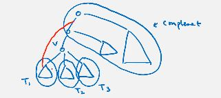

hence we only need to consider a few cases.

__lemma.__ for a non-root vertex $v$ in a dfs tree, $v$ is a cut vertex iff there is a subtree below $v$ with no edges going to an ancestor of $v$.  
_proof_:
* (forward) suppose v is cut vertex, then it is clear no edges from below v would go to any ancestors because that would cause the graph to be connected and v would not be cut vertex.
* (backward) by claim. $\square$

__lemma.__ for the root vertex $v$ in a dfs tree, $v$ is a cut vertex iff $v$ has at least two children.  
_proof_:
* case 1: v has degree 1. then it is clear that v is not a cut vertex (as the remaining graph is connected)
* case 2: v has degree >= 2. if i remove v, then the remaining parts must be disconnected to each other because subtrees have no ancestors at all. $\square$

idea: for each subtree $T_v$ rooted at v, find the vertex that is reached by back edges from $T_v$ that is closest to root.

* let low[v] := min {start[w] | all edges uw with $u\in T_v$} (this tracks the min depth)
* computeLow():
  * base case: v is leaf, then low[v] = min {start[w] | vw ∈ E} (O(deg(v)))
  * otherwise we have computed low[$u_i$] correctly for all direct child of v. then low[v] = min {low[$u_1$],...} U {start[w] | $vw\in E$} (O(deg(v)))
  * total runtime: $\sum_{v\in V}\mathrm{deg}(v)=O(n+m)$
* for every vertex v, to check whether it is a cut vertex, we check whether low[$u_i$] < start[v] for all i
  * if yes, then v is not a cut vertex
  * if no, then v is a cut vertex
  * runtime is also sum of degrees => O(n+m)

how to find cut edges? tree edge uv is cut edge iff low[v] > start[u]; back edges can never be cut edge.

## directed graphs
__defn.__ if $uv$ is a directed edge, then $u$ is the _tail_ and $v$ is the _head_.

__defn.__ the _in-degree_ of a vertex $v$, $\mathrm{indeg}(v)$, is the number of edges with $v$ being the head. $v$ is _source_ if indeg is 0.

__defn.__ the _out-degree_ of a vertex $v$, $\mathrm{outdeg}(v)$, is the number of edges with $v$ being the tail. $v$ is _sink_ if outdeg is 0.

__defn.__ a directed graph is a _directed acyclic graph_ if there is no directed cycle.

__defn.__ $t$ is _reachable_ from $s$ if there is a directed path from $s$ to $t$.

__defn.__ a directed graph $G=(V,E)$ is _strongly connected_ if for every pair of vertices $u,v\in V$, $u$ is reachable from $v$ and $v$ is reachable from $u$.

__defn.__ a subset $S\subseteq V$ is called strongly connected if for every pair of vertices $u,v\in S$, $u$ is reachable from $v$ and $v$ is reachable from $u$ (path can go outside)

__defn.__ a subset $S\subseteq V$ is a _strongly connected component_ if $S is a maximally strongly connected subset. ie S is strongly connected but S+v is not for any $v\in V-S$.

__eg.__ determine if a graph is strongly connected.

__eg.__ determine if a graph is a DAG.

__eg.__ find all strongly connected components of a directed graph.

both DFS and BFS are same as undirected graphs, except that we only explore out-neighbors.

### BFS tree
* by setting dist[v] = dist[u] + 1, we can compute all shortest path distances from s
* in undirected graphs, for all non-tree edges uv, dist[u]-1 <= dist[v] <= dist[u]+1
* in directed graphs, there could be non-tree edges uv with huge difference in dist[u] and dist[v], however they have to be 'backward edges'.

### DFS tree
* in undirected graphs, all non-tree edges are back edges
* in directed graphs, there could be 'cross edges' (only goes from right left to left leaf) or 'forward edges'

### strongly connected graphs
given a graph G=(V,E), return yes if G is strongly connected.
* naive: there are O(n^2) pairs to check. for each pair, do bfs/dfs, total: O(n^2(n+m))
* naive2: for each vertex v, check whether it can reach all other vertices. total: O(n(n+m))

__claim.__ G is strongly connected iff every vertex $v\in V$ is reachable from s and s is reachable from every vertex $u\in V$, where s is arbitrary.  
_proof._
* (forward) definition
* (backward) combine the path from s to v and the path from u to s, then u and v are connected. because these u and v are arbitrary, we have result.$\square$

__claim.__ given $G=(V,E)$, we reverse the direction of all edges to obtain $G^R=(V,E^R)$. then there is a path from v to s in G iff there is a path from s to v in $G^R$.
* so s is reachable from every $v\in V$ in G iff if every $u\in V$ is reachable from s in $G^R$.

algo:
* choose arbitrary vertex s.
* run bfs to check whether it can reach all other vertices
* reverse direction of all edges in G (linear)
* run bfs again from s
* both yes => graph is strongly connected

runtime: O(n+m)

__eg.__ find shortest walk from s to t with odd length.  
copy the graph and have odd vertices and even vertices. find path from even s to odd t.

### DAG
given a graph G=(V,E), return yes if it is DAG.

__prop.__ if a directed graph is acyclic, then one can find a vertex with indegree of 0.  
_proof._ suppose otherwise that all vertices in G has indegree at least 1. to prevent a directed cycle, we must have vertices laid out like: $v_1\rightarrow v_2\rightarrow ...$, the middle ones have indegree >= 1. when we run out of vertices, we cannot extend this pattern further, so we could only go backward. as all vertices must have indegree >= 1, we have to go back to $v_1$ but that would form a directed cycle. $\square$

__defn.__ a _topological ordering_ is an ordering of vertices such that all edges go forward.

__prop.__ a directed graph is acyclic iff there exists a topological ordering of the vertices.  
_proof._
* (backward) if such ordering exists, then all edges go forward, implying there are no cycles otherwise an edge would go backward.
* (forward) use induction. suppose G has exactly one vertex v, then there exists a topological ordering. now suppose for any smaller graph the statement is true, we want to show it is true for the bigger one too. consider G-v where v has indegree of 0, then it has a topological ordering. we put this v to the front of the ordering to get a topological ordering of G. $\square$

algo:
* repeatedly find a vertex v of indegree zero
  * remove v from the graph (remove the edges and thus possibly reduces some other vertices' indegree by 1), and put v to the beginning of the topological ordering
* if the only vertices left have indegree > 0, then G is not a DAG
* this also provides a topological ordering of G

runtime: O(n+m) (kahn's algo)

### DAG (2)

__theorem.__ _(parenthesis)_ the intervals [start[u], finish[u]] and [start[v], finish[v]] are either disjoint or one interval contains the other.  
_proof._ same as undirected. $\square$

__lemma.__ if G is DAG, then for any edge uv, finish[v] < finish[u] for any dfs.  
_proof._:
* case 1: start[v] < start[u]. since G is dag, and u reaches v, we have v cannot reach u, so u cannot be a descendant of v in dfs tree, so [start[v], finish[v]] and [start[u], finish[u]] are disjoint. so finish[v] < finish[u].
* case 2: start[v] > start[u]. then v is descendant of u, so [start[u], finish[u]] contains [start[v], finish[v]], so finish[v] < finish[u]. $\square$

algo:
* run dfs on whole graph
  * means if for some root s, we do not cover all vertices, then do more dfs on remaining vertices (O(n+m))
* output the ordering with decreasing finishing time
* check if it is a topological ordering. if not, G is not acyclic.
  * if G is acyclic, then lemma implies all edges in this ordering go forward.

runtime: O(n+m)

# Week 5. June 9

### strongly connected components
find all strongly connected components of a directed graph.

__claim.__ two strongly connected components must be vertex-disjoint.  
_proof._ otherwise the common vertex reaches and is reachable from all vertices in both components, then the two 'components' are not maximal, and we actually only have one strongly connected component. $\square$

__observation.__ contracting each strongly connected component results in a DAG (otherwise components are not maximal).  
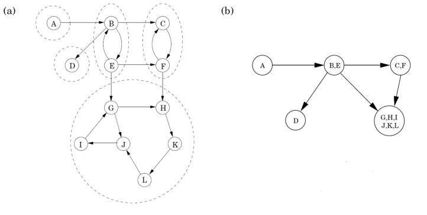

__observation.__ suppose we start a bfs/dfs on a 'sink component', then we can identify the vertices in that sink component. (eg GHIJKL)
* idea: after finding the sink component, we can remove it from the graph.
* how to find a vertex in a sink component?
* idea: if we topologically sort, we can find vertices with small outdegs
  * if we do dfs on the whole graph, then the vertex with the smallest finishing time is a sink
  * does not work if first starting from E - this ordering is not good enough

__lemma.__ if $C_1,C_2$ are strongly connected components and there are directed edges from $C_1$ to $C_2$, then the largest finishing time in $C_1$ is larger than the largest finishing time in $C_2$.  
_proof._
* case 1: first vertex v to be visited is in $C_2$, then every vertex in $C_2$ will be visited, and will be finished before any vertex in $C_1$ started because v does not go to $C_1$.
* case 2: first vertex v to be visited is in $C_1$, then v has to visit every vertex in both $C_1,C_2$ then finishes. $\square$

__observation.__ if we have the topological ordering (decreasing finishing time), then do dfs again using this ordering, then we will always first visit an 'ancestor component' before visiting a 'descendant component'.
* we instead want to start from descendant components - reverse graph

algo
1. run dfs on whole graph and sort vertices by decreasing finishing time
2. let c = components
3. for i=1,n do:
   * if visited[i] = false (and i is not in any c)
     * dfs($G^R$, i)
     * mark all vertices reachable from i in $G^R$ in this iteration to be in component c
     * append them to c

runtime: O(m+n)

## greedy algorithms
work by using simple and/or local rules to make decisions and then commit on them.

### minimizing total completion time
have n jobs with processing times $p_1,...,p_n$, find an ordering of the jobs to finish so as to minimize the total completion time, where the completion time of a job is defined as time time when it is finished.
* total completion time implies average completion time
* eg. have 7, 2, 6, 5, 8.
  ```
  | 2 | 5 | 6 | 7 | 8 |
      2  7   13   20  28
  ```
  total completion time: 70
* sort the job by increasing process time.

_correctness_: if it is not in non-decreasing order, then we want to show the solution is not optimal. then there exists an adjacent inversion pair, p[i] > p[i+1]. if we flip these two jobs, we can know that the sum completion times of all other jobs are the same (and after because p[i]+[i+1] does not change). for these two jobs, the time for old ordering is p[i]+p[i]+p[i+1], in the new ordering, it is p[i+1]+p[i+1]+p[i]. the new ordering is better. $\square$

### minimizing total completion time (2)
have n jobs, each with processing time $p_i$ and weight $w_i$. find an ordering of the jobs to finish so as to minimized to total weighted completion time, where weighted completion time of a job is defined as its weight * its completion time.
* eg. have p=3,7,2, w=1,3,1
  ```
  | 2 | 3 | 7 |
      2   5   36   total: 43

  | 7 | 2 | 3 |
      21  9   12   total: 42
  ```
* what is the answer?

### interval scheduling
given n intervals $[s_1,f_1],...,[s_n,f_n]$, find the maximum subset of disjoint intervals.

there are multiple natural greedy algos:
* earliest start time
  * counterexample: if we have a long job that starts earlier
* earliest finish time
* shortest intervals: good approximation
  * counterexample: consider [1,5], [4,6], [5,10]
* minimum conflicts (choose interval which overlaps with fewest other intervals)
  * counterexample: consider [0,1], [1,5], [4,6], [5,10], [10,11], and many [0,2]'s and many [9,11]'s

algo:
1. sort the interval so that $f_1\le...\le f_n$. let initial solution $S=\varnothing$
2. for $1\le i\le n$, if interval $[s_i,f_i]$ is disjoint from all intervals in S, then add it to S
   * we only need to check with the previous one for overlapping (need proof)
3. return S

runtime: O(nlogn + n)

__claim.__ there exists an optimal solution with $I_1=[s_1,f_1]$ chosen.  
_proof._ suppose there exists an optimal solution S that does not include $I_1$. suppose further the first interval in S conflicts with $I_1$. because $I_1$ has smallest finishing time, it is earlier than the second interval in S. we can swap the first interval with $I_1$ and the result is still optimal. $\square$

__lemma.__ there is an optimal solution using the first k intervals of the greedy solution for any k.  
_proof._ use induction on k. when k=1, this is the above claim. otherwise since we use disjoint intervals, we reuse the above argument. $\square$

if the number of intervals in solution is l, we apply the lemma with k=l.

### interval coloring
given n intervals $[s_1,f_1],...,[s_n,f_n]$, find a coloring of the intervals using the minimum # of colors possible, so that each interval gets one color and any two overlapping intervals get different colors.

algo:
1. sort intervals so that $s_1\le...\le s_n$.
2. for $1\le i\le n$, use the minimum available color to color the i-th interval

_correctness_: it is sufficient to show if the algo returns k colors, it is because at one moment there are k intervals pairwise overlapping with each other.
```
      t
------|-     1
  ----|--    2
 -----|----- 3
    --|---   k    current interval I_i
```
since all these intervals contain the start time $s_i$ (we sorted by start time), there are k intervals, so we need k. 

# Week 6. June 16
### huffman coding
__defn.__ we construct _prefix code_ so that no encoding string is a prefix of another encoded string.
* allows easy encoding and decoding without ambiguity.

given n symbols, with frequencies $\sum_{i=1}^n f_i=1$. find a binary decoding tree T with n leaves that minimizes $\sum_{i=1}^nf_i\cdot\mathrm{depth}_T(i)$ (average length of encoded strings).


__observation.__ any optimal binary decoding tree is full (every internal node is two children).  
_proof._ because we can just delete the violating internal node without affecting disambiguation. $\square$
```
    r                r
   /                /
  _          =>    w
 /
w
```

__corollary.__ in the decoding tree there are at least two leaves of maximum depth that are siblings.

__observation.__ _(simple claim)_ there is an optimal solution in which the two symbols with lowest frequencies are assigned to leaves of maximum depth, and furthermore they are siblings.  
_proof._ if we have $f_i>f_j$ but $\mathrm{depth}(i)>\mathrm{depth}(j)$, note: 
$$
\begin{aligned}
    &\quad \,\,(f_i\cdot\mathrm{depth}(i)+f_j\cdot\mathrm{depth}(j))-(f_i\cdot\mathrm{depth}(j)+f_j\cdot\mathrm{depth}(i))\\
    &=(f_i-f_j)(\mathrm{depth}(i)-\mathrm{depth}(j))\\
    &>0
\end{aligned}
$$
so we can always swap the two nodes and (original) $f_i\cdot\mathrm{depth}(i)+f_j\cdot\mathrm{depth}(j)>f_i\cdot\mathrm{depth}(j)+f_j\cdot\mathrm{depth}(i)$ (after). so lowest frequency symbols should appear at leaves. $\square$

algo:
1. if |S|=2, encode one symbol using 0 and the other using 1, and return tree
   ```
         R
    0 /    \ 1
    s1      s2
   ```
2. otherwise let y, z be two symbols with lowest frequencies.
3. delete y and z from S. add new pseudo symbol w with frequency $f_y+f_z$
4. solve this _reduced_ problem (n-1 symbols) recursively and get a tree T'
5. in T', look at the leaf associated with w, add two leaves to it (so that w becomes an internal node) and associate y and z with two new leaves.

(see cs240 - how are they different?)

_correctness_: use induction. base case is if there are 2 symbols, correct. if there are more than 2 symbols and our T' is optimal, for the new tree T after adding two symbols, $\mathrm{obj}(T)=\mathrm{obj}(T')-f_w\cdot\mathrm{depth}(w)+f_y\cdot(\mathrm{depth}(w)+1)+f_z\cdot(\mathrm{depth}(z)+1)=\mathrm{obj}(T')+(-f_w+f_y+f_y)\cdot\mathrm{depth}(w)+f_y+f_z=\mathrm{obj}(T')+f_y+f_z$. we want to show any other tree will have obj >= this.  
suppose an optimal solution is $T^*$. remove y and z from $T^*$ we have $T^*{}'$ is a feasible solution to the reduced problem. since $T'$ is optimal, we have $\mathrm{obj}(T')\le
\mathrm{obj}(T^*{}')$. using same calculation we have $\mathrm{obj}(T^*)=\mathrm{obj}(T^*{}')+f_y+f_z$ (1). so we have $\mathrm{obj}(T^*)\ge\mathrm{obj}(T')+f_y+f_z=\mathrm{obj}(T)$. $\square$

(1) how can you use same calculation T* might not have w? use the y & z's common parent because they are sibling.

runtime: O(nlogn) (use heap for get min)

### single source shortest path
given a directed graph G=(V,E), a non-negative length $l_e$ for each edge $e\in E$, and two vertices $s\in V$. find a shortest path from s to v for every vertex $v\in V$.

using reduction:
* we can reduce graph in to new graph G' but with length 1 -> break each edge into $l_e$ edges.
* if we follow the path G' we have path in G. use bfs
* runtime: will be proportional to the length of edges - slow

we want to simulate this process, but don't want to follow broken edges step by step. we keep track of an upper bound on the time a vertex to be found.
```
            5         1
      f <------- s ------> g
                 | 2
                 b
```
* starting from s, suppose sf has length 5, sg has length 1. we set f has bound 5
* when we move out, we reach g (bound set to 0), and f's bound is set to 4

algo _(dijkstra)_:
```cpp
dijkstra(G, s):
    auto parents = {}
    auto dist = {v: ∞ for v in G.V}
    auto Q = new priority_queue
    dist[s] = 0

    for v, bound in dist:
        Q.insert(v, key=bound)

    while Q is not empty:
        auto u = Q.delete_min()
        for each out_v in u:
            auto l = /*length of uv*/
            if dist[u] + l < dist[out_v]:
                dist[out_v] = dist[u] + l
                Q.set_key(out_v, dist[out_v])  // "decrease_key()"
                parents[out_v] = u  // may be set multiple times

    return ...
```

runtime:
* each vertex is enqueued once (beginning), dequeued once (in loop)
* heap operations all take O(logn)
  * make heap at beginning, then delete_max and heapify for each vertex
* total: $O(n\log n+\sum_v\mathrm{deg}(v)\log n)=O((n+m)\log n)$
* fibonacci heap: O(n +mlogn)

__puzzle.__ do not trust this; there are better formations than it

> Instead of filling the priority queue with all nodes in the initialization phase, it is also possible to initialize it to contain only source; then, inside the if dist[u] + l < dist[out_v] block, the decrease_priority() becomes an add_with_priority() operation if the node is not already in the queue.

### single source shortest path (2)
idea:
* grow a subset $R\subseteq V$ so that dist[v] is computed correctly
* initially, R={s} and we add more in each iteration
  * add the vertex closest to R

algo:
1. let dist = {v: ∞ for v in G.V}, dist[s] = 0, R = ∅
2. while R != G.V:
   1. pick the vertex u $\notin$ R with smallest dist[u]
   2. R = R U {u}
   3. for each edge uv in neighbors of u:
      1. if dist[u] + $l_{uv}$ < dist[v]:
         1. dist[u] = dist[v] + $l_{uv}$
* same implementation as above

_correctness_: we want to show the following invariant holds: for any v in R, dist[v] is the shortest path distance from s to v.  
proceed by induction. base case R={s}, then dist[s] = 0 is shortest. inductive: suppose R is computed correctly, now we have u, we want to show the shortest path from s to u is dist[v] + $l_{vu}$.
* since dist[v] is computed correctly, plus this edge, we have an upper bound of this distance: dist[u] <= dist[v] + $l_{vu}$.
* consider any path p from s to u, and passes some intermediate edges xy,... x is in R, and y is not in R. since dist[] is computed correctly for v, it will take longer than using $l_{vu}$. so length(p) >= dist[v] + $l_{xy}$ + ... >= dist[v] + $l_{vu}$. $\square$

shortest path tree:
* (v, parent[v]) form a tree
* we have succinct way to store all shortest paths from s using n-1 edges

__remark.__ algo breaks when length is negative. it fails at the ... in the proof.

# Week 7. June 23
## dynamic programming
on a high level, we can solve a problem by _dynamic programming_ if there is a recurrence relation with only a polynomial number of subproblems.

__eg.__ how to compute $F(n)=F(n-1)+F(n-2),F(1)=F(1)=1$? we compute the same term too many times and the run time is O(1.618^n).
* _top-down memorization_: we can use a visited[] array to ensure each subproblem is computed at most once, and also use array answer[] is store the value of F(i) for future lookup.
    ```cpp
    F(i):
        if visited[i]:
            return answer[i]
        if i == 0 or i == 1:
            return 1
        answer[i] = F(i - 1) + F(i - 2)
        visited[i] = true
        return answer[i]
    ```
  because of the visited array, each subproblem is computed at most once. there are n subproblems, so O(n) additions.
* _bottom-up computation_: compute F(0) and F(1) first, then we can compute F(i) that depend on eariler F(i)'s. runtime is O(n) additions.
    ```cpp
    F(N):
        auto F0, F1 = 1, 1
        for i = 2, N:
            F0, F1 = F1, F0 + F1
        return F1
    ```
* note runtime can be O(n^2) as the number gets big and we do not assume addition is constant!

in principle, to come up with bottom-up implementation, we just need to use a topological ordering of the 'subproblem dependency graph' to have correct order to solve subproblems.

### weighted interval scheduling
given n intervals $([s_i,f_i])_{i=1}^n$ and a weight $w_i$ for each interval i. find a subset of disjoint intervals that maximizes the total weight.

```
1      3        6       10
----   -------  ------  ----
 ----    -- --    8 -----
 2       4  5       9 ---
                7 ----- ------- 11
```

* exhaustive search: sort by start time, we can either pick the first interval or not. in each of the subproblem, we decide whether to pick the next available one. runtime is exponential.

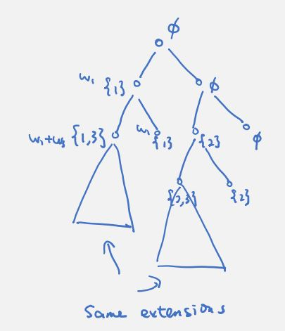

note if we already pick 1 and 3 and wish to extend this solution. this is solves the same problem as having picked 2 and 3 - what really matters is the last interval of the current partial solution.

we use a good ordering of the intervals and precompute some useful info.
* we sort the intervals be starting time in non-decreasing order
* for each interval i, define next(i) to be the smallest j such that j > i and $s_j>f_i$ (happens after i). next(i) = n+1 if no such j exists. then
  ```
  next(1) = 6   next(4) = 9
  next(2) = 4   next(5) = 8
  next(3) = 5   next(6) = 7
  ```
* __property.__ for interval i, intervals in {i+1,..., next(i)-1} overlap with i, and intervals in {next(i), ..., n} do not overlap with i,
* let D(i) be the maximum total weight of disjoint intervals using intervals {i,..., n} only.
* when facing the i-th interval, we can
  * choose to pick it, we can only choose intervals {next(i), ...}
  * choose to not pick it, we can choose intervals {i+1, ...} 
* recurrence: $D(i) = \max\{ w_i + D(\mathrm{next}[i]), D(i+1) \}$
* base case: D(n+1) = 0
* answer is D(1)

runtime (top-down):
* sorting O(nlogn)
* compute next[], use binary search O(nlogn)
* n subproblems, for each we look up two values => O(n)
* total: O(nlogn)

we can use bottom-up computation too, from n to 1.

__puzzle.__ how to print the intervals? (linked list to maintain linear time)

### subset sum
given n positives integers $(a_i)_{i=1}^n$ and an integer K. find a subset $S\subseteq[n]$ with $\sum_{i\in S}a_i=K$ or report no such subset exists.

```
a[1] = 3, a[2] = 2, a[3] = 7, a[4] = 8, ...
```

* exhaustive: when seeing one number, decide wether it select it => enumerate all possibilities O(2^n)

note after picking a[1] and a[3], we solve the similar subproblem as having picked a[2] and a[4].
* the subproblem is D[i][L] = true iff there is a subset in {i,..., n} whose sum is L, where i<=i<=n, i<=L<=K.
* when facing a[i]
  * if we choose a[i], then return true if D[i+1][L-a[i]]
  * if we do not choose a[i], then return true if D[i+1][L]
* recurrence: `D[i][L] = D[i + 1][L - a[i]] or D[i + 1][L]`
* base case:
  * `D[i][0] = true` for all i
  * `D[i][L] = false` if i > n
  * `D[i][L] = false` if L < 0
* answer is D[1][K]

bottom-up:
```cpp
for i = 1, n:
    for L = 0, K:
        D[i][L] = false

D[n][a[n]] = D[n][0] = true

for i = 1, n:
    D[i][0] = true

for i = n, 1, -1:
    for L = 1, K:
        D[i][L] ||= D[i + 1][L]
        if L - a[i] >= 0:
            D[i][L] ||= D[i + 1][l - a[i]]

return D[1][K]
```

runtime: nK subproblems, in each subproblem, look up two values => O(nK) _(pseudo polynomial)_.

__remark.__ if decision problem, we can keep only two rows. space complexity becomes O(K) instead of O(nK).

__remark.__ if using top-down, we do not necessarily compute all subproblems unlike bottom-up.
* take an element first may speed up

__remark.__ D[1][K] is true iff there exists a directed path from (1, K) to some nodes with 'true' base case.
* how to print a solution? keep a parent array we can know at which step, we take number or not take
* or just look at the created table and trace which subproblem is true

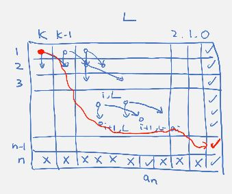

### knapsack
given n items, each of weight $w_i$ and value $v_i$, and a positive integer W. find a subset $S\subseteq[n]$ such that $\sum_{i\in S}w_i\le W$ that maximizes $\sum_{i\in S}v_i$.

approach 1:
* D[i][w][v] = true iff there is a subset in {i, ..., n} with total weight w and total value v
* recurrence: `D[i][w][v] = D[i + 1][w][v] or D[i + 1][w - w[i]][v - a[i]]`
* base case:
  * `D[i][0][0] = true` for all i
  * `D[n+1][w][v] = false` for all w !=0 and v != 0
* answer is `max{ v: D[i][w][v] = true and w <= W }`

runtime: $O(nW\cdot\sum_{i}a_i)$.

approach 2:
* D[i][w] = maximum value of a subset in {i, ..., n} with total weight at most w
* recurrence: `D[i][w] = max{ D[i + 1][w], a[i] + D[i + 1][w - w[i]] }`
* base case:
  * `D[n+1][w] = 0` for all w >= 0
  * `D[i][w] = -inf` for all w < 0 (illegal)
* answer is `D[1][w]`

runtime: O(nW)

### longest increasing subsequence
given n numbers $(a_i)_{i=1}^n$, a subsequence is a subset $a_{i_1},...,a_{i_k}$ with $i_1<...<i_k$. a subsequence is increasing if $a_{i_1}<...<a_{i_k}$. find an increasing subsequence of maximum length.

```
[5, 1, 9, 8, 8, 8, 4, 5, 6, 7] => 1 4 5 6 7
```

* let L[i] be the length of a longest increasing subsequence starting at a[i] and using numbers from {1[i], ..., a[n]} only.
* at step i, find the next number greater than it (O(n) to find)
* recurrence: `L[i] = 1 + max{ L[j]: a[j] > a[i] and i+1 <= j <= n }`
* base case: `L[n] = 1` (take only one number)
* answer is `max(L)`

runtime: O(n^2)

how to print the sequences?
```
i | 1  2  3  4  5  6  7   8   9
--+-----------------------------
a | 3  8  7  2  6  4  12  14  9
L | 4  3  3  4  3  3  2   1   1
    ^  ^              ^   ^

we know answer is of length 4. trace L from 4 to 1.
```
or use parent array.

__remark.__ if runtime == \# of subproblems, then algo is likely to be optimal. otherwise there might be better algo.

# Week 8. June 30

### longest increasing subsequence (2)
idea:
* use same recurrence
* for each length k, we only store the best position to start an increasing subsequence of length k
  * eg when computing L[7], we can throw away i=9 because anything greater than a[8]=14 is greater than a[9]=9
* then these 'best subproblems' satisfy monotone property - we can use binary search to locate next number greater than current, and skip everything in between

define $\mathrm{pos}[k]=\max_{j>i}\{a_j:L(j)=k\}$ to be the best position to extend a subsequence of length k, and let $m=\max_{i+1\leq j\leq n}L(j)$ be the length of a longest increasing subsequence we computed so far. then we only need L(pos[1]), ..., L(pos[m]) for future computations.

```
i | 1  2  3  4  5  6  7  8
--+------------------------
a | 2  7  6  1  4  8  5  3
L | 3  2  2  3  2  1  1  1
    ^  ^           ^
pos[1] = 6, pos[2] = 2, pos[3] = 1
```

__claim.__ _(monotone)_ `a[pos[1]] > ... > a[pos[m]]`: it is harder to extend a longer increasing subsequence than a shorter one.  
_proof._ suppose by contradiction there exists j such that a[pos[j]] >= a[pos[j-1]]. assume we have the longest increasing subsequence $a_{i_1}$=a[pos[j]] < $a_{i_2}<...<a_{i_j}$ of length j. then $a_{i_2}$ will be a position to start such a subsequence of length j-1. we have $a_{i_2}$ > a[pos[j]] >= a[pos[j-1]], which is a contradiction because $i_2$ would be a better place to start subsequence of length j-1. $\square$

algo:
```cpp
auto m = 1  // length
pos[1] = n // base
for i = n-1, 1, -1:
    if a[i] < a[pos[m]]:
        ++m
        pos[m] = i
    else:
        use binary search to find smallest j st a[pos[j]] <= a[i] // < a[pos[j-1]]
        pos[j] = i
return m
```
runtime: O(nlogn)

### longest common subsequence
given two strings $a_1a_2...a_n$ and $b_1b_2...b_m$, find the largest k such that there exist $i_1<...<i_k,j_1<...<j_k$ and $a_{i_l}=b_{j_l}$ for $1\leq l\leq k$.

longest increasing subsequence is a special case of this problem, where the second array is the sorted version.

```
       ___     _
S1 = 3 1 2 8 9 7
     ___   _
S2 = 1 2 3 7 8 9

answer = 1 2 7
```

let `C[i][j]` be the length of a longest common subsequence of `a[i]...a[n]` and `b[j]...b[m]`.
* when we scan `a[i]` and `b[j]`:
   1. do we match?
      * if `a[i] == b[j]`, we include this in the subsequence: `sol1 = 1 + C[i + 1][j + 1]`
        ```
        a[i]   a a a a a a
         ||
        b[j]   b b b b b b
        ```
      * else: `sol1 = 0`
   2. we can just stay at `a[i]` and skip `b[j]`: `sol2 = c[i][j + 1]`
      ```
         a[i]   a a a a a a
      x  b      b b b b b
      ```
   3. we can just stay at `b[j]` and skip `a[i]`: `sol3 = c[i + 1][j]`
* recurrence: `C[i][j] = max{ sol1, sol2, sol3 }`
* base case:
  * `C[n + 1][j] = 0` for all j
  * `C[i][m + 1] = 0` for all i
* answer is `a[1][1]`

runtime: there are O(nm) subproblems, each takes constant time => total O(nm).

bottom-up: count i from n to 1, and count j from n to 1.

### edit distance
given two strings $a_1a_2...a_n$ and $b_1b_2...b_m$, find the minimum k such that we can do k add/delete/change operations to transform $a_1a_2...a_n$ to $b_1b_2...b_m$.

let `D[i][j]` be the edit distance of `a[i]...a[n]` and `b[j]...b[m]`.
* when we scan `a[i]` and `b[j]`:
  1. do we match?
     * if i <= n and j <= n and a[i] == b[j]: `sol1 = D[i + 1][j + 1]`
     * else: `sol1 = inf`
  2. consider ADD a matching symbol to a, we match the rest of b:
     * if j <= m: `sol2 = 1 + D[i][j + 1]`
     * else: `sol2 = inf`
  3. consider DELETE current symbol in a, we match the rest of a:
     * if i <= n: `sol3 = 1 + D[i + 1][j]`
     * else: `sol3 = inf`
  4. consider CHANGE current symbol in a to a matching one, we match rest of both:
     * if i <= m and j <= n: `sol4 = 1 + D[i + 1][j + 1]`
     * else: `sol4 = inf`
* recurrence: `D[i][j] = min{ sol1, sol2, sol3, sol4 }`
* base case: `D[n + 1][m + 1] = 0`
* answer is `D[1][1]`

runtime: O(nm).

bottom-up: dependency points bottom-right. we only have one corner base case, fill in the bottom row and rightmost column first.

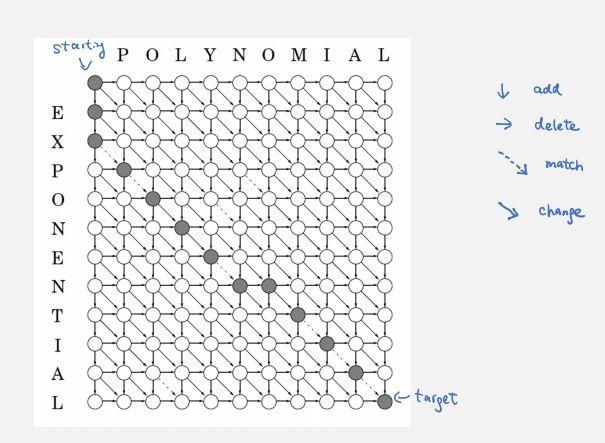

__puzzle.__ given DAG, what is length of longest path from s to t? order V by topo, let d[i] be the length of longest path from s to i, then `d[i] = i == s ? 0 : max { d[j]: j and i and neighbors  } + 1`, answer is d[t].

# Week 9. July 7
### maximum independent sets on trees
__defn.__ given a graph G=(V, E), a subset of vertices $S\subseteq V$ is an _independent set_ if $uv\notin E$ for all $u,v\in S$.

given a tree T=(V,E), find an independent set of maximum cardinality.

```
A -- B -- C -- D
sol: A and C, or A and D, or B and D. size 2.
```

we define subproblem as I[v] be the size of a maximum independent set in the subtree rooted at vertex v.
* suppose we are at node v
  * we include v in the answer, then we should skip its children and take grand children: size1 = $1+\sum_{w:\pi(\pi(w))=v}I(w)$
  * we do not include v, then we take children: size2 = $\sum_{w:\pi(w)=v}I(w)$
* recurrence: `max{size1, size2}`
* base case: `O[v] = 1` for all leaves v
* answer `I[root]`

runtime: there are n subproblems. in total, we look at $\sum_v({\text{\#children of }v +\text{ \# grandchildren of }v})$ vertices. this is the same as $\sum_v({\text{\#parent of }v +\text{ \# grandparent of }v})=\sum_v2=2n$.

__puzzle.__ how to solve max weighted independent set problem?

### maximum independent sets on trees (2)
* now define subproblem as J(v) be size of a maximum independent set with v included
* define M(v) be size of a maximum independent set with v excluded.
* recurrence:
  * $J(v)=1+\sum_{w:\pi(w)=v}M(w)$
  * $M(v)=\sum_{w:\pi(w)=v}\max\{J(w),M(w)\}$
* base case: `J[v] = 1, M[v] = 0` for every leaf v
* answer: `max{ J[root], M[root] }`

runtime: $O(\sum_v\mathrm{deg}(v))=O(m+n)=O(n)$.

### optimal binary search tree
given n keys $k_1<...<k_n$ and non-negative frequencies $\sum_{i}^nf_i=1$. find a binary search tree T that minimizes $\sum_{i=1}^nf_i\cdot\mathrm{depth}_T(i)$.

note optimal solution does not necessarily require key with highest frequency at the top - have to respect bst structure.

let C[i][j] be the objective value of an optimal bst with keys $k_i<...<k_j$.
* for each range i to j, we try all values as root, put smaller keys on left subtree, put greater keys on right subtree. see which arrangement has smallest obj
* recurrence: $C_{i,j}=\min_{i\leq l\leq j}\{f_l+(C_{i,l-1}+\sum_{k=1}^{l-1}f_k)+(C_{l+1,j}+\sum_{k=l+1}^jf_k)\}=\sum_{k=i}^jf_k+\min_{i\leq l\leq j}\{C_{i,l-1}+C_{l+1,j}\}$
* base case: `C[i][i] = f[i]`, `C[i][i-1] = 0` for all i
* answer: `C[1][n]`

runtime: n^2 subproblems, for each we take O(n) possibilities. total: O(n^3).

bottom-up: compute smaller width (j-i) first then larger subproblems.


better: Knuth's O(n^2).

### shortest paths with negative edges
given a directed graph G=(V,E), a length $l_e$ for each edge $e\in E$, and two vertices $s\in V$. find a shortest path from s to v for every vertex $v\in V$, assuming no negative cycles exist.

what is wrong with dijkstra's: if we suddenly find a negative edge that decreases the distance to a visited vertex m, then all vertices that are reached by m have to be updated.

```
    1        5
s -----> a -----> b -----> c
|        ^
v        | -1000
g -----> h
   100

if there are no negative edges, after deciding sa and dropping sg, we instantly know sa is
shortest to reach a. however, if negative edges exist, we cannot drop sg as ah makes it smaller.

update a, b and c!
```

_negative cycles_: shortest path distance is not well-defined if a cycles consisting of negative edges appear in the middle of path.
```
             -1
s -----> a -----> b ------> t
      -1 |       ^
         v  -1   | -1
         c ------+

we can keep walking in the cycle - the dist is not bounded below
```

idea: dijkstra will compute distance to some vertices correctly eg. first vertex on a path
* no negative cycles => shortest path is a simple path => shortest path has at most n-1 edge => at most n-1 iterations

let D[v][i] be the shortest path distance from s to v using at most i edges.
* recurrence: $D_{v,i+1}=\min\{D_{v,i},\min_{u:uv\in E}D_{u,i}+L_{uv}\}$
* base case:
  * `D[s][0] = 0`
  * `D[v][0] = inf` for all v except s
* answer: `D[v][n-1]`

runtime:
* at each step, finding min path from in-neighbor needs to check $\mathrm{indeg}(w)$ vertices
  * total: $O(\sum_w\mathrm{indeg}(w))=O(m)$
* at most n iterations => total O(mn)

space: O(n^2) (O(n) if just want distance, only keep D[v][i+1] and D[v][i])

algo _(bellman-ford)_:
* idea: keep a tighter upper bound on shortest path distance
```cpp
dist[s] = 0
for v in V - {s}:
    dist[v] = inf

for i = 1, n-1:
    for each edge uv in E:
        if dist[u] + L[uv] < dist[v]:  // relaxation step
            dist[v] = dist[u] + L[uv]
            parent[v] = u
```

__lemma.__ if there is a directed cycle C in the edges (parent[v], v), then C must be a negative cycle.  
_proof._ assume there is a directed cycle $v_1v_2...v_kv_1$ where the final edge is $v_kv_1$ (parent of $v_1$ is $v_k$). then for $2\leq i\leq k$, the for loop tells us $\mathrm{dist}[v_i] \geq \mathrm{dist}[v_{i-1}] + l_{v_{i-1}v_i}$. if we added the edge $v_kv_1$, we also have $\mathrm{dist}[v_1] > \mathrm{dist}[v_k] + l_{v_kv_1}$. adding the inequalities we get $\sum_{j=1}^k\mathrm{dist}[v_j]>\sum_{j=1}^k\textrm{dist}[v_j]+\sum_{e\text{ in cycle}}l_e\Rightarrow 0>\sum_{e\text{ in cycle}}l_e$, which only happens for negative cycles. $\square$

### negative cycles
given a directed graph G=(V,E), a length $l_e$ for each edge $e\in E$. find a negative cycle.

note D[v][i] is computed correctly even though graph can have negative cycles (we only used such assumption in last question for computing stopping condition).

idea:
1. assume every vertex can be reached from vertex s (otherwise do it in every component)
2. if there is no egative cycles, D[v][k] is finite for all v as k -> ∞
3. if there is, D[v][k] tends to -∞

__claim.__ D[v][n] = D[v][n - 1] for all $v\in V$ iff G has no negative cycles.  
_proof._
* forward: by recurrence, $D_{v,n+1}=\min\{D_{v,n},\min_{u:uv\in E}D_{u,n}+L_{uv}\}=\min\{D_{v,n-1},\min_{u:uv\in E}D_{u,n-1}+L_{uv}\}=D_{v,n}$. by induction we have $D_{v,k}=D_{v,n-1}$ for all v and all $k\geq n-1$, hence $D_{v,k}$ is finite and there is no negative cycle.
* backward: there is no negative edge => shortest path is simple, we at most n-1 edges, and using an extra edge does not reduce the dist. $\square$

__remark.__ early termination rules is D[v][k+1] = D[v][k] for all v.

hence for checking, using the above claim we can do bellman-ford with an extra iteration step.

__claim.__ if D[v][n] < D[v][n - 1] for some v, then in the walk (by tracing parent) between two repeated vertices we find a negative cycle.  
_proof._ then we know the shortest path using at most n edges to get to v must have exactly n edges (otherwise D[v][n] = D[v][n-1]). so there is at least one repeated vertex, meaning there is a cycle in the walk. we suppose otherwise that this cycle is not negative, then D[v][n-1] <= length(W') <= length(W) = D[v][n], where W' is done by using n-1 edges and W is done using n edges. this is a contradiction. $\square$

### all-pairs shortest paths
given a directed graph G=(V,E), a length $l_e$ for each edge $e\in E$. find shortest path distances from s to t for all $s,t\in V$. assume no negative cycles exist.

naive: use bellman-ford for all s. time is O(nm*n) (account for \# edges!).

define D[i][j][k] to be the shortest path distance from $v_i$ to $v_j$ using $\{v_1,...,v_k\}$ as intermediate vertices.
* do we want to use an extra intermediate node?
  ```
                          +--> k+1 --+
                          ^          | using {v[1], ..., v[k]}
  using {v[1], ..., v[k]} |          v
                          i ---------> j
  ```
* recurrence: `d[i][j][k] = min{ D[i][j][k], D[i][k+1][k] + D[k+1][j][k] }`
* base cases:
  * `D[i][j][0] = l[ij]` for all edges $v_iv_j$
  * `D[i][j][0] = inf` for all $v_iv_j\notin E$
* answer: `D[i][j][n]` for all i, j

algo _(floyd-warshall)_:
```cpp
D[i][j][0] = inf
for all edge v[i]v[j] in E:
    D[i][j][0] = l[ij]

for k = 1, n:
    for i = 1, n:
        for j = 1, n:
            d[i][j][k] = min(D[i][j][k], D[i][k+1][k] + D[k+1][j][k])
```

runtime: O(n^3)

__puzzle.__ reduce one dimension of D by using adj matrix?

### traveling salesman
given a directed graph G=(V,E), a length $l_e$ for each edge $e\in E$. find a directed cycle C that visits every vertex exactly once that minimizes $\sum_{e\in C}l_e$.

naive: try every combination of vertices and compute weights (O(n!)n).

define C[i][S] to be the shortest path distance from 1 to $v_i$ with vertex set $S\subseteq V$ on the path.
* suppose we computed C[i][S] for all |S|<=k and last vertex is $v_i$
  * want to compute C[i][S] for |S|=k+1, try all possible second last vertex of the path
* $C_{i,S}=\min_{j\in S-\{v_1,v_i\}}\{C_{v_j,S-\{v_i\}}+l_{v_jv_i}\}$
* base case: $C_{i, \{v_1,v_i\}=l_{v_1v_i}}$ for all i
* answer: $\min_{1\leq i\leq n}\{C_{v_i,V}+l_{v_iv_1}\}$

runtime:
* subproblems: all possible subset of V and times n: $O(2^nn)$ subproblems
* total: $O(2^nn^2)$
* disadvantage: space $\Theta(2^nn)$
  * there is clever way to reduce space to poly

# Week 10. July 14

## bipartite matching
__defn.__ a subset of edges $M\subseteq E$ is a _matching_ if edges in M are pairwise vertex disjoint.

__defn.__ given matching M, a vertex v is _matched_ if v is the endpoint of some edge $e\in M$, otherwise v is _unmatched/free_.

__defn.__ a matching M is a _perfect matching_ if every vertex is matched in M.

### bipartite matching
given a bipartite graph G=(X,Y;E), find a maximum cardinality subset of edges that are vertex disjoint.

__defn.__ a path $v_1v_2...v_{2k}$ is an _augmenting path_ with respect to a matching M if
* $v_1,v_{2k}$ are free
* $v_{2i-1}v_{2i}\notin M,1\leq i\leq k$ (odd edges not in matching)
* $v_{2i}v_{2i+1}\in M,1\leq i\leq k-1$ (even edges in matching)

we always have a partial solution (greedily), if we find an augmenting path, then we can remove middle (even) edges and add (odd) edges to increase size of matching by 1.

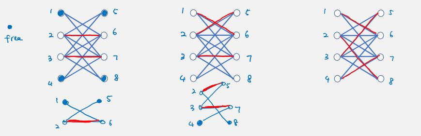

__prop.__ there is augmenting path with respect to M iff M is not a maximum matching.  
_proof._
* assume there is an augmenting path. let $M'=M-\{\text{even edges}\}\cup\{\text{odd edges}\}$, then $|M'|=|M|+1$. first and last edges were free before, now they are matched (degree 1), all other intermediate vertices still have degree 1, so M' is still a matching and bigger than M.
* assume M (--) is not a maximum matching. consider a maximum matching $M^*$ (==) with $|M^*|>|M|$. consider $M\cup M^*$, since in each matching, degree of its vertex is at most 1, then each vertex in this union has degree at most 2. so each connected component is either a path or a cycle:
  ```
  case 1: common edges
  +-----+
  x     y
  +=====+

  case 2: path with more == than --
  +----y     u
  ||   ||    ||
  x    z --- t

  case 3: path with same == and --
  +----y     u ---- v
  ||   ||    ||
  x    z --- t

  case 4: path with more -- than ==
        +----z     v ---- s
        ||   ||    ||
  x --- y    t --- u

  case 5: cycles with same == and --
  x --- y
  ||    ||
  z --- t
  ```
  note case 2 is already an augmenting path. since we assumed there are more == than -- (M' is bigger than M), and for all other cases, -- is at least of the same number of ==, case 2 must exist. $\square$

algo:
1. let M := empty
2. while there is an augmenting path $v_1...v_{2k}$ of M
   1. M = $M-\{v_{2i}v_{2i+1}:i\leq i\leq k-1\}\cup\{v_{2i-1}v_{2i}:1\leq i\leq k\}$
3. return M

runtime:
* let T(m, n) be time to find augmenting path of M in a graph with n vertices and m edges
* if there is augmenting path, then matching size increases by 1
* matching size $\leq\frac{n}{2}$ => O(n) iterations
* total: O(nT(m, n)) => O(nm)

faster: $O(m\sqrt{n})$ (edmonds and karp)

### finding augmenting path
given a bipartite graph G=(X,Y;E) and a matching M. find an augmenting path of M in G or report it does not exist.

because we have bipartite graph, we use directions to encode matching information. we assign one direction (from right to left) for all edges in M, and the other direction for unmatched edges ($G_M^\rightarrow$). then we can follow the directed alternating path.

__claim.__ there exists an augmenting path of M in G iff there exists a directed path from a free vertex on the left to a free vertex on the right in $G_M^\rightarrow$.  
_proof._ clear. $\square$

naive: do bfs on each free vertex on left (O(nm)).

we can add pseudo source and target nodes connected to free vertices to avoid enumerating all pairs. source in X, sink in Y.

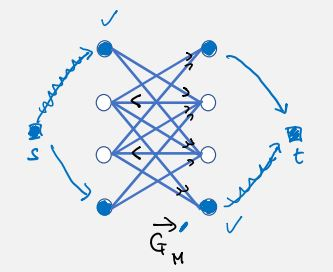

__claim.__ there is an augmenting path of M in G iff there exists directed path from s to t in $G_M^\rightarrow{}'$.  
_proof._: clear, just remove s and t from final answer. $\square$

algo:
1. create $G_M^\rightarrow{}'$ with directions and super source and sink
2. use bfs to find a path P from s to t
   1. if yes, return P without s and t
   2. if no, return no

runtime: O(m+n).

__puzzle.__ how to find maximum matching in general graphs? finding aug path step will break. (edmonds)

### bipartite vertex cover

__defn.__ given graph G=(V,E), a subset of vertices $S\subseteq V$ is a _vertex cover_ if $\{u,v\}\cap S\neq\varnothing$ for all $uv\in E$.

given a bipartite graph G=(X,Y;E), find a vertex cover of minimum cardinality.

__observation.__ _(lower bound of vertex cover)_  if we have any matching M, and any vertex cover S, then $|S|\geq |M|$.
```
x   z   u   s
|   |   |
y   t   v      matching of size 3, use at least 3 vertices to cover
```

__theorem.__ _(könig)_ in a bipartite graph G(X,Y;E), max size of a matching is equal to the min size of a vertex cover.  
_proof._ only need to consider the upper bound of |S|, ie suppose we run the matching finding algo and find a max matching M; we want to show $|S|\leq|M|$. since M is maximum, in $G_M^\rightarrow{}'$, we cannot find a path from super source s (in X) to super sink t (in Y). let R be set of reachable vertices from s, then there are no edge with tail in R and head in $X\cup Y-R$ (otherwise that edge will go to R from s). note also if R does not include some vertex in M, then it cannot include the corresponding matching pair - ie $x_l\in R\lor y_l\in R\iff x_l,y_l\in R,1\leq l< j$. this is because each $x_l$ has indegree = 1 and outdegree = 0, and its only in-neighbor is $y_l$; reaching one implies reaching the other.

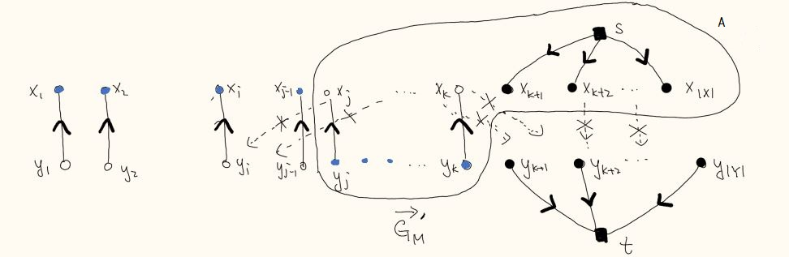

then set $(X-R)\cup(Y\cap R)=\{x_1,...,x_{j-1},y_j,...,y_k\}$ is a vertex cover, where $\{x_1,...,x_{j-1}\}$ will cover all edges with endpoint in $\{x_1,...,x_{j-1}\}$, and $\{y_j,...,y_k\}$ will cover all edges with endpoint in $\{x_j,...,x_{|X|}\}$ (this is all types of edges in bipartite graph). (how to show it is minimal?) $\square$

__remark.__ how to show perfect matching does not exist? vertex cover size is less than n/2.

algo:
1. find a max matching M, and $G_M^\rightarrow{}'$ with directions and super source and sink
2. do bfs on $G_M^\rightarrow{}'$ to get reachable vertices $R$
3. output $(X-R)\cup(Y\cap R)$

runtime: O(T(matching) + m+n)

__theorem.__ _(hall)_ a bipartite graph G=(X,Y;E) with |X|=|Y| has perfect matching iff for all $S\subseteq X$, we have $|N(S)|\geq|S|$ where N(S) is the neighbor set of S in Y.  
_pf._ use könig. $\square$

__corollary.__ every d-regular bipartite graph G=(X,Y;E) has perfect matching.  
_pf._ use könig. $\square$

__remark.__ randomized O(nlogn) algo exists to find it.

__puzzle.__ capacitated job assignment (each vertex in Y has capacity)? create copies of vertices according to its capacity. number of vertices becomes |X|+O(|X||Y|), number of edges becomes O(|X||E|).

### basketball league winner
given the current standing and the remaining schedule, tell whether it is possible that a team can still win in the league.

```
      standing                      remaining schedule
              W  L                    Miami-Boston x3
Boston        41 17                New York - Boston x2
New York      40 18                        ...
Philadelphia  38 19                Toronto - New York x2
       ...                                 ...
Toronto       33 25
```

idea: assume toronto win all its remaining games and in total $w^*$ wins. we want all other teams win less than $w^*$ games. say team i currently has $w_i$ wins, we want it to win no more than $w^*-w_i-1$ games.

create bipartite graph, one side is the teams with their capacity = their max wins, one side is games (each with two edges going to two teams). we will want to find a way to assign each game a winner. if such assignment exists, then toronto is possible to win.

__remark.__ it is hard for football games (draws)

### max-flow min-cut
find the maximum number of edge-disjoint paths between two vertices s and t (different paths can not use same edge).

if we find a 'cut' of k edges, then the maximum number of flows from s is k.

### duality
replace integral constraints $x\in\{0,1\}$ to linear constraints $x\geq 0$. 0 means not picked. gibstic

* max bipartite matching: maximize $\sum_{l\in E}x_l$ given $\sum_{l\in\delta(v)}x_l\leq 1\,\forall v\in V$ and $x_l\geq 0\,\forall l\in E$
* min bipartite cover: minimize $\sum_{v}y_v$ given $y_u+y_v\geq 1\,\forall uv\in E$ and $y_v\geq 0\,\forall v \in V$

augmenting path method can be understood as the simplex method of solving linear programs.

# Week 11. July 21
## polynomial time reduction

it is more convenient to restrict to decision problem so that every problem has same output format. if we know how to solve decision version of the problem in polynomial time, then we can use the decision algorithm as blackbox/subroutine to solve the the search version of problem in polynomial time.

__eg.__ find a max bipartite matching.
1. decision version: does G have a matching of size at least k?
2. use binary search on all k to find an optimal value k
3. try deleting an edge e from G. does G-e have a matching of size at least k?
   1. if yes: delete e
   2. if no: keep e and try other edge
   3. (reduces to |E| decision problems)
4. what is left is the matching

__defn.__ a decision problem A is _polynomial time reducible_ to decision problem B if there exists a polynomial time algorithm F that maps any input instance $I_A$ of A into an input instance $I_B$ of B such that $I_A$ is a YES-instance of problem A iff $I_B$ is a YES-instance of problem B. we write $A\leq_p B$ when such a polynomial time reduction exists, saying A is not more difficult than B in terms of polynomial time solvability.

algo _(solving problem A by reduction)_:
1. use reduction algorithm F to transform $I_A$ into $I_B$
2. return $\texttt{alg}_B(I_B)$

runtime: F maps $I_A$ to $I_B$ in $p(|I_A|)$, $\texttt{alg}$ solves $I_B$ in $q(|I_B|)$. total $q(p(|I_A|))$.

__corollary.__ if A cannot be solved in polynomial time, then B cannot be solved in polynomial time.
* by our current knowledge, we know almost nothing about proving a problem cannot be solved in polynomial time, so we cannot draw such strong conclusion.

__prop.__ _(transitivity)_ if $A\leq_p B$ and $B\leq_p C$, then $A\leq_p C$.  
_proof._ transform $I_A$ to $I_B$ then to $I_C$. $\square$

### three problems
__maximum clique (Clique):__

__defn.__ a subset $S\subseteq V$ is a _clique_ if $uv\in E$ for all $u,v\in S$.

decision version: given graph G=(V,E), is there a clique with at least k vertices?

__maximum independent set (IS):__

decision version: given graph G=(V,E), is there an independent set with at least k vertices?

__minimum vertex cover (VC):__

decision version: given graph G=(V,E), is there a vertex cover with at most k vertices?

__prop.__ $\texttt{Clique}\leq_p\texttt{IS}$ and $\texttt{IS}\leq_p\texttt{Clique}$.  
_proof._
* $\texttt{Clique}\leq_p\texttt{IS}$: define reduction $F((G,k))=(\overline{G},k)$ where $\overline{G}=(V,\overline{E})$ where $\overline{E}=\{uv:uv\notin E\}$. by definition, G has a clique of size at least k iff $\overline{G}$ has an independent set of size at least k.
* $\texttt{IS}\leq_p\texttt{Clique}$: same as above. $\square$

__prop.__ $\texttt{VC}\leq_p\texttt{IS}$ and $\texttt{IS}\leq_p\texttt{VC}$  
_proof._
* __observation.__ in G=(V,E), a subset $S\subseteq V$ is a vertex cover iff $V-S$ is an independent set.
  * S being vertex cover means all edges will have one endpoint in S. for V-S, there cannot be edges with both endponts in V-S because if there were, it would appear in S.
* $\texttt{VC}\leq_p\texttt{IS}$: define reduction $F((G,k))=(G,|V|-k)$. we claim G has a vertex cover of size at most k iff G has an independent set of size at least |V|-k.
* $\texttt{IS}\leq_p\texttt{VC}$: same as above. $\square$

so all three problems are equivalent in terms of polynomial time solvability.

### three more problems
__hamiltonian cycle (HC)__:

__defn.__ a cycle is hamiltonian if it touches every vertex exactly once.

decision version: given graph G=(V,E), does G have a hamiltonian cycle?

__hamiltonian path (HP)__:

__defn.__ a path is hamiltonian if it touches every vertex exactly once.

decision version: given graph G=(V,E), does G have a hamiltonian path?

__traveling salesman problem (TSP)__:

decision version: given graph G=(V,E) with an length $l_e$ for each edge $e\in E$, is there a hamiltonian cycle with total length at most $L$?

__prop.__ $\mathtt{HP}\leq_p\texttt{HC}$.  
_proof._ define reduction $F(_G(V,E))=_{G'}(V\cup\{s\},E\cup\{sv:v\in V\})$, where s is an additional vertex that goes to every existing vertex. claim G has a HP iff G' has a HC.
* if G has HP that ends at $a,b$, then in G', connect $av,bv$ we have a HC.
* if G' has HC, then in G, delete the two edges connecting $s$ we have a HP.
$\square$

__prop.__ $\mathtt{HC}\leq_p\texttt{HP}$  
_proof._ define reduction $F(_G(V,E))=_{G'}(V\cup\{x',t_1,t_2\},E\cup\{x'v:v\in N(x)\}\cup\{t_1x',t_2x\})$ where $x\in V$ is arbitrary. claim G has a HC iff G' has a HP.  

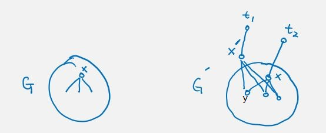  
* if G has a HC $x...yx$ that visits x, then in G', path $t_2[x...y]x't_1$ is a HP, where we break the cycle at the edge $yx$.
* if G' has a HP, then it must be $t_2x...yx't_1$ as $t_1,t_2$ has degree 1. then in G, we can use the edge $yx$ (which must exist as $yx'$ exists, and $x'$ is a clone of $x$) to close the cycle. $\square$

__prop.__ $\texttt{HC}\leq_p\texttt{TSP}$.  
_proof._ define transform $F(_G(V,E))=_{G'}(V,V^2)$ such that $G'$ is complete graph, and $l_{uv}=1\,\forall uv\in E,l_{uv}=2\,\forall uv\notin E$. claim G has a HC iff G' has a HC of total length at most $|V|$. $\square$

note (in hw) also need to show these transformations are done in polynomial time.

__remark.__ it is not clear how to reduce TSP to HC.

## 3-satisfiability
given n boolean variables $(x_i)_{i=1}^n$ which can be either True or False, and a formula in _conjunctive normal form (CNF)_ where it is an AND of the _clauses_ where each clause is an OR of the _literals_ where a literal is either $x_i$ or $\overline{x_i}$.

$$
(x_1\lor x_2\lor \overline{x_3})\land(\overline{x_2} \lor x_3 \lor \overline{x_4})\land(\overline{x_1}\lor \overline{x_3}\lor x_4)\land(\overline{x_2}\lor x_3)
$$

if each clause has at most 3 literals, is there a truth assignment to the variables that satisfies all the clauses?

__theorem.__ $\texttt{3SAT}\leq_p\texttt{IS}$.  
_proof._ given a 3SAT formula, we would like to construct a graph G so that the formula is satisfiable iff the graph has an independent set of size m where m is the number of clauses. for each clause, we connect at most three vertices corresponding to the literals (so single vertex/pair/triangle) (ensure in each clause we satisfy one literal). we also connect vertices $x_i\overline{x_i}$ (to prevent both of them appearing in the independent set at same time).

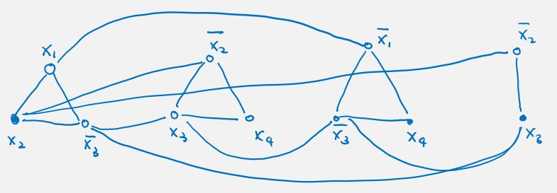

* suppose we have a satisfying assignment $(x_i)_i$, then if $x_i$ is True, we put $x_i$ in IS, if $x_i$ is False, we put $\overline{x_i}$ in IS. since we pick exactly one literal from each clause, we do not violate first type of edges. since we pick either $x_i$ or $\overline{x_i}$, we do not violate second type of edges. now we have a set of m vertices.
* suppose we have an IS of size m. because of second type, we will not have both $x_i,\overline{x_i}$, so for each vertex in G, if $x_i$ is in IS, then $x_i$ = True; if $\overline{x_i}$ is in IS, then $x_i$ = False; if both not in IS, then $x_i$ is arbitrary. because of the first type of edges, each clause has at most 1 vertex in the IS. because there are m clauses, each vertex in IS must come from one clause. so all clauses are satisfied. $\square$

__remark.__ it is not important how many literals in a clause.

## NP-completeness
it is not easy to compare every pairs (O(n^2)) of problems to see if they can be reduced to each other. we can identify the 'hardest' problems in a large class of problems.

a general feature of problems is that there is a short 'proof/solution' of a YES-instance - it is easier to verify.

__defn.__ for a problem X, each input instance of X is represented by a binary string s. a problem X is in the _class NP_ if there is a polynomial time verification algorithm $B_X$ s.t. the input s is a YES-instance iff there is a proof t which is a binary string of length $\mathrm{poly}(|s|)$ so that $B_X(s,t)$ returns YES.
* in most cases, t is simply a solution and $B_X$ is an efficient algo to check if t is indeed a solution.

```
input s --> +----+
            | Bx | --> YES/NO
proof t --> +----+
```

__eg.__ show vertex cover is in NP.  
we are given graph G and an integer k. we encode (G, k) into a binary string s, and t into a binary string of $S\subseteq V$. let $B_X$ be algo that takes s and t as input and checks if every edge is covered by $S$ with size <= k. then $B_X$ says yes if S is vertex of size <= k, and says NO if t does not correspond to a vertex cover of size <= k. $\square$

__eg.__ show 3SAT is in NP.  
we are given a truth assignment (size <= n). algo: check if it is satisfying (runtime O(m)) where m is number of clauses. iff is clear. $\square$

__remark.__ Clique, IS, HC, HP, subset-sum are all in NP.

__remark.__ _(non-HC)_ we do not know a short proof how to show graph has no HC.

__defn.__ X is in _co-NP_ if there is short proof and an efficient verification for NO-instances.

__eg.__ bipartite matching (at most size k) is in both NP and co-NP.  
for NO-instances (asking does G have graph has no matching >= k?), by konig, it is the same a asking 'whether G has vertex cover of size < k?', which is easy to check.

__remark.__ it is common belief $\mathrm{NP}\neq\mathrm{co-NP}$.

__remark.__ $\mathrm{P}\subseteq\mathrm{NP}$. if problem can be solved in poly time, it is trivially in NP (do not even need another t and $B_X$).

__remark.__ our NP definition is equivalent to saying "NP is class of problems solvable by a non-deterministic turing machine in poly time".

__remark.__ it is common belief $\mathrm{P}\neq\mathrm{NP}$.

__defn.__ a problem $X\in\mathrm{NP}$ is _NP-complete_ if $Y\leq_p X$ for all $Y\in\mathrm{NP}$.

__prop.__ P=NP iff an NP-complete problem can be solved in polynomial time.

to prove a problem X is NP-complete, we first show X is NP, then find an NP-complete problem Y show $Y\leq_p X$. (common mistake is showing X <=p Y)

# Week 12. July 28

### cook-levin theorem
we introduce an intermediate problem to show 3SAT is NP-complete.

_circuit-SAT_: given a circuit with AND/OR/NOT gates, some known input gates and some unknown input gates, assuming input circuit is DAG, and each AND/OR gate has only two incoming edges.. is there a truth assignment on the unknown input gates so that the output is True?

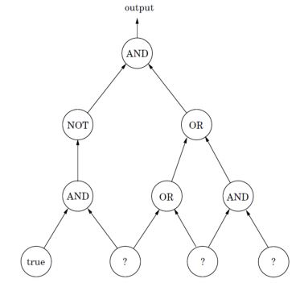

__theorem.__ circuit-SAT is NP-complete.  
_pf._ we want to show for all NP problem X we have $X\leq_p\texttt{Circuit-SAT}$. we start from the definition of NP (algorithm satisfaction: there exists a verification program that runs in poly time), and try to use a poly-time compiler to turn the verification algo into a circuit of poly size so that the circuit says YES if given input s and proof t is for YES instances, and NO if the problem's answer is NO no matter what proof is given. then input s is a YES-instance iff there is a satisfying assignment for Circuit-SAT. $\square$

__theorem.__ $\texttt{Circuit-SAT}\leq_p\texttt{3-SAT}$.  
_pf._ given circuit of n gates, we will construct a 3SAT formula with O(n) variables so that circuit is satisfiable iff the formula is satisfiable.:
* if we have a gate True, then we make a clause $a$
  ```
  true --> a
  ```
* if we have a gate False, then we make a clause $\overline{b}$
  ```
  false --> b
  ```
* if we have a NOT gate, then we make two clauses $a\leftrightarrow\overline{b}=(\overline{a}\lor\overline{b})\land(a\lor b)$
  ```
  a --> NOT --> b
  ```
* if we have an AND gate, then we make $(a\land b)\leftrightarrow c=(\overline{a}\lor\overline{b}\lor c)\land(a\lor\overline{c})\land(b\lor\overline{c})$
  ```
  a -->
         AND --> c
  b -->
  ```
* if we have an OR gate, then we make $(a\lor b)\leftrightarrow c=(a\lor b\lor \overline{c})\land(\overline{a}\lor c)\land(\overline{b}\lor c)$
  ```
  a -->
         OR --> c
  b -->
  ```
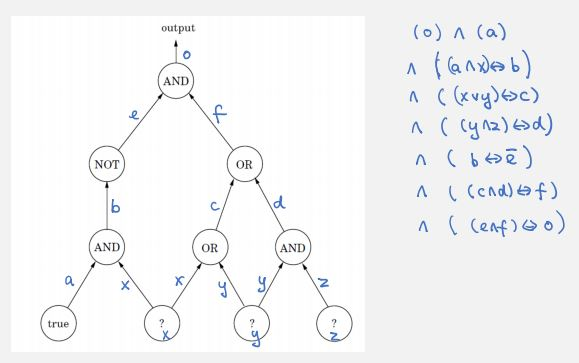

it is clear we can turn the circuit into a 3SAT formula in poly time in terms of size of circuit (# of gates/edges). plugging in x, y, z into the circuit, and simulate the circuit behavior regarding gates, then the resultant variables satisfy the formula too. if there is assignment of the formula, plugging them into the circuit will make the circuit happy as well. $\square$

__theorem.__ _(cook-levin)_ 3-SAT is NP-complete.

### hamiltonian cycle
__defn.__ a directed cycle is a _hamiltonian cycle_ if it touches every vertex exactly once.

_directed hamiltonian cycle (DHC)_: given directed graph G=(V,E), does G has a DHC?

__theorem.__ DHC is NP-complete.  
_proof._ it is easy to check DHC is in NP. we now will show $\texttt{3SAT}\leq_p\texttt{DHC}$, ie given a 3SAT formula with n variables $(x_i)_{i=1}^n$ and m clauses $(C_i)_{i=1}^m$, we would like to construct a directed graph G so that formula is satisfiable iff G has a DHC. we create a long 'two-way' path for each variable, so that going the path from left to right corresponds to setting variable to True, while from right to left corresponds to setting it to False.

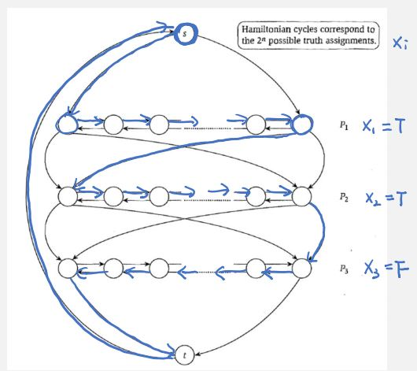

now a hamilton cycle in G has one-to-one correspondence with an assignment. now we want to add clause structures so that only satisfying assignments 'survive'. for each clause, we create a separate vertex. depending on whether literal is negated, we assign different directions for edges that go to the clause vertex (thus forcing the left/right direction of each $P_i$). note clause vertex only has edges to the portions reserved for the clause.

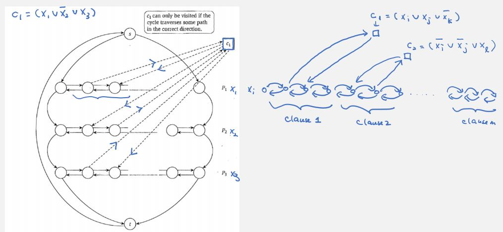

* if we have a satisfying assignment, then $x_i=T$ means we go from left to right on $P_i$, and $x_i=F$ means going from right to left. for each clause $C_a$, one literal is satisfied $x_j$, we can 'detour' to visit $C_a$ in the path $P_j$, and keep going forward (one variable may get multiple clauses, and variable might get no clauses). then every vertex is visited exactly once.
* if we have a DHC. we want to show it behaves exactly as we wanted, ie we do not have cycles that jumps out of certain $P_i$ at $v$ and goes to some $C_a$, and jumps to some other $P_j$. if jump happens, then we the next edge to $v$ becomes a dead end (thus once we go to a clause, we must come back immediately). since every clause is visited and each variable/path foes in the correct direction, we have a satisfying assignment with all clauses satisfied. $\square$

__prop.__ $\texttt{DHC}\leq_p\texttt{HC}$.  
_proof._ given input directed graph G, we use a length 3 path to simulate a directed edge. for each vertex $v$ in G, we create 3 vertices $v_{\textrm{in}},v_\textrm{mid},v_\textrm{out}$ connected with two middle edges, and $v_\textrm{in}$ has original in-edges in G, $v_\textrm{out}$ has out-edges. we claim G has a DHC iff G' has a HC.

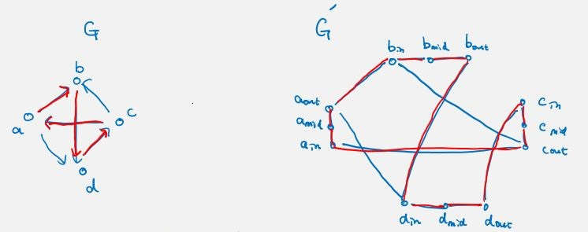

it is clear if G has a DHC, we can follow it in G' to form a HC. suppose we have a HC in G' and it starts from $a_\textrm{in}$, then must goto $a_\textrm{mid}$, then to $a_\textrm{out}$, then go to some other $b_\textrm{in}$, .... if we shrink each three vertex we get a DHC in G. (having mid vertex $a_\textrm{mid}$ forces a path to go to it onces it touches some in vertex $a_\textrm{in}$, otherwise it may just leave if some other $c_\textrm{out}$ goes to $a_\textrm{in}$, which is not what we want it to behave) $\square$

__corollary.__ HC is NP-complete.

### graph coloring
given undirected graph G=(V,E) and positive integer k, is it possible to use k colors to color all vertices so that every vertex receives one vertex and any two adjacent vertices receive different colors?

* when k=1, it is possible iff graph has no edges
* when k=2, it is possible iff graph is bipartite

__theorem.__ 3-coloring is NP-complete.  
_proof._ it is easy to check 3-coloring is in NP. we want to show $\texttt{3SAT}\leq_p\texttt{3-coloring}$, ie given a 3SAT formula with n variables $(x_i)_{i=1}^n$ and m clauses $(C_i)_{i=1}^m$, we would like to construct a graph G so that formula is satisfiable iff G is 3-colorable. we associate True and False as two colors. for each variable $x_i$, we create two vertices $v_i,\overline{v_i}$ and add an edge between them so they get different colors. to enforce they get True/False colors, we connect every literal vertex to a common vertex called base vertex colored using color B.

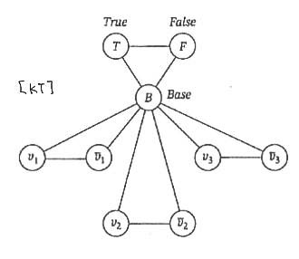

so there is 1-1 correspondence between truth assignments and the 3-colorings.

we now involve clauses so that only satisfying assignments remain. we can use a 'gadget' to connect to the three variables in the clause so that there is a 3-coloring for the gadget iff at least one of them gets the color T.
say we have clause $(x_1\cup\overline{x_2}\cup x_3)$, after trail-and-error, we can attach the following gadget to the base graph:

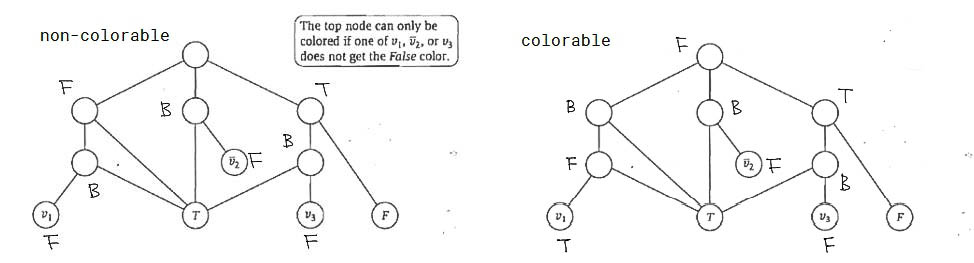

vertices with no labels mean they are added only for this clause. then suppose all $v_1,\overline{v_2},v_3$ are colored F => meaning clause is not satisfied. then all colors of vertices are forced, we cannot color the top node using any color. if any of them is colored T, then the top vertex can be colored using the 3 colors (check).

* if there is a satisfying assignment. for each variable $x_i$, if it is True, then we color $v_i$ = T and $\overline{v_i}$ = F; otherwise if it is False, we color $v_i$ = F and $\overline{v_i}$ = T. it is clear this is a valid coloring for the initial base graph (without gadgets). since assignment is satisfying, each clause gets at least one of the 3 'input' set to be T, and so it can be extended to a 3-coloring in the gadget.
* if there is a 3-coloring of graph, then for each gadget, there is at least one 'input' of the gadget with color T. by the initial base graph, the coloring on $(v_i,\overline{v_i})_{i=1}^n$ must be consistent with truth assignment, so we can use the coloring to get a truth assignment that satisfies all clauses. $\square$

### 3-dimensional matching
given disjoint sets X, Y, Z each of size n, a set $T\subseteq X\times Y\times Z$. does there exist a subset of n disjoint triples in T (cover every element exactly once)?

a subset of n disjoint triples is called perfect 3d-matching.

```
x1 -- y1 -- z1
x2 -- y2 -- z2
x3 -- y3 -- z3

T={(x1,y1,z1),(x2,y2,z2),(x3,y3,z3)}
```

__theorem.__ 3DM is NP-complete.  
_proof._ it is easy to check 3DM is in NP. we want to show $\texttt{3SAT}\leq_p\texttt{3DM}$, ie given 3SAT formula with n variables $(x_i)_{i=1}^n$ and m clauses $(C_i)_{i=1}^m$, we would like to construct a 3DM instance (hypergraph) so that the formula is satisfiable iff there is a perfect 3d-matching. for each variable $v$, we create $(x_i)_{i=1}^m,(y_i)_{i=1}^m,(z_i)_{i=1}^{2m}$ enclosed in a gadget. the $x,y$'s are private to this variable and $z$'s might be open. we have to cover a triple at a time and we try to cover all private nodes (cores).

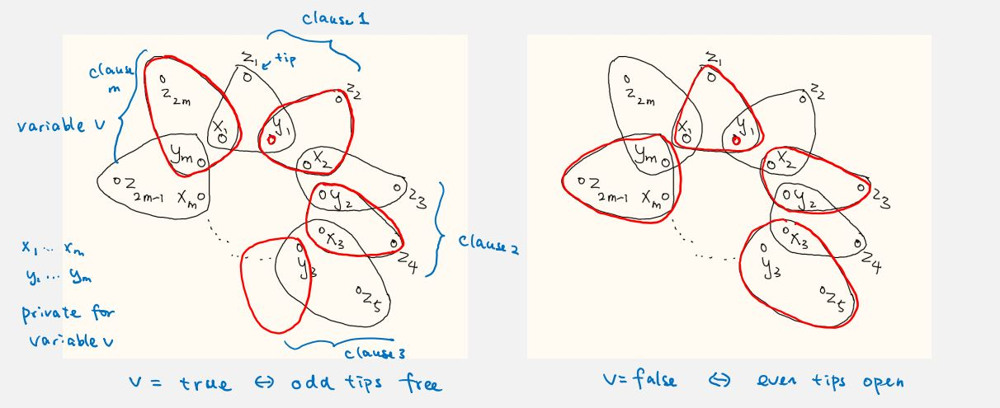

if three nodes are in a circle, it means such combination is possible (in T). note we have 2m $z$'s as we reserve 2 $z$'s for each clause, half of them is used to cover triples and half is open.

so we have 1-1 one correspondence between the value of a variable and how private nodes are covered. we have n such flowers corresponding to n variables.

we now add some clause structure to the 3dm instance so that only satisfying assignments survive. the clause structure for each clause contains $x_c,y_c$ and can contain a free $z$ from the existing flowers, reserved for that clause.

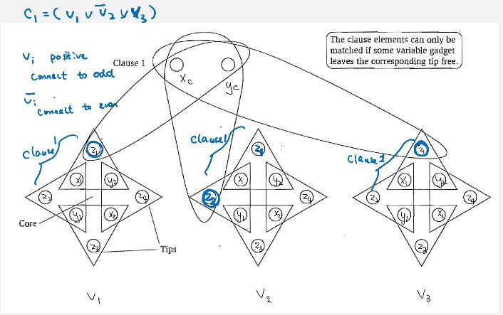]

at this point we have totally 2mn tips, # of tips covered by clauses is m. we have (2n-1)m
 tips left to cover (how about already-covered $z$'s in each variable? should you minus mn?). we add this number of 'dummy' clauses which can form triples connecting two dummy nodes and one free $z$ like they were clauses.
* if we have satisfying assignment, for each variable $x_i$, if it is True, in gadget i we leave odd tips open, if it is False, we leave even tips open. for each clause satisfied by some literal $x_j$, that clause covers the free $z$ in that gadget i. for remaining tips, the dummy ones can cover them, so we have perfect 3d-matching.
* if we have perfect 3d-matching. in each gadget, either all even tips are open (False) or all odd tips are open (True). because matching is full, for each clause, their clause elements must be covered, and it contains a $z$ meaning a value of variable depending on the parity of the $z$, so we have a satisfying assignment. $\square$

### subset sum
given n positive integers $(a_i)_{i=1}^n$ and an integer K, does there exist a subset $S\subseteq[n]$ with $\sum_{i\in S}a_i=K$?

__theorem.__ Subset-Sum is NP-complete.  
_proof._ it is easy to check it is in NP. we want to show $\texttt{3DM}\leq_p\texttt{Subset-Sum}$., ie given 3DM instance, we would like to construct a subset-sum instance so that there is perfect 3d-matching iff there is subset of certain sum K. we naturally represent each triple as a vector: if node is used in a triple, in the vector it has 1 else 0.

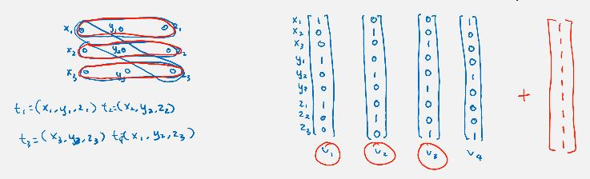

_vector Subset-Sum_: given a set of n 0-1 vectors, does there exist a subset of vectors that sum to $\mathbf{1}$? we can see there is a perfect 3DM iff there is a subset of vectors summing to $\mathbf{1}$. so this vector Subset-Sum is also NP-complete.

to turn this vector Subset-Sum into Subset-Sum, we map each 0-1 vector to a base (m+1)-numbers, then $(x_i,y_i,z_k)\mapsto(m+1)^i+(m+1)^{n+j}+(m+1)^{2n+k}$, where m is number of available triples in 3DM (|T|).
* if there exists a perfect 3DM, we can turn the matching into these numbers, then we have sum $\sum_{l=1}^{3n}(m+1)^l$.
* if we have the subset of numbers, because the base (m+1) is large enough, each 'coordinate' records how many times an element is covered. to achieve sum K, each element must be covered exactly once, we have a perfect 3DM. $\square$

__remark.__ to turn this vector Subset-Sum into Subset-Sum, we could interpret the 0-1 vector as the binary representation of a number, then $(x_i,y_j,z_k)\mapsto 2^i+2^{n+j}+2^{2n+k}$.
* if there exists a perfect 3DM, we can turn the matching into these numbers, then we have sum $\sum_{l=1}^{3n}2^l$ (all 1's in binary).

but reverse is not true <~ carrying may happen eg. 01+01+01=11=01+10. so we need base m+1 to avoid this.

__corollary.__ knapsack is NP-complete.

### map
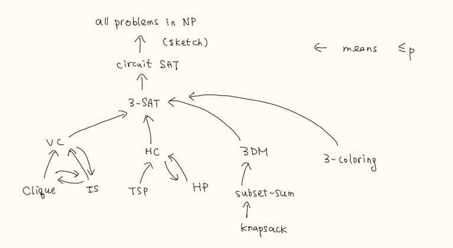

techniques for doing reductions:
* specialization:
  * $\texttt{Subset-Sum}\leq_p\texttt{knapsack}$
  * $\texttt{HC}\leq_p\texttt{TSP}$
  * $\texttt{HP}\leq_p\text{Bounded Degree Spanning Tree}$ (degree at max 2)
* local replacement:
  * $\texttt{Circuit-SAT}\leq_p\texttt{3-SAT}$
  * $\texttt{3DM}\leq_p\texttt{vector Subset-Sum}\leq_p\texttt{Subset-Sum}$
  * $\texttt{DHC}\leq_p\texttt{HC}$
* gadget design:
  * $\texttt{3SAT}\leq_p\texttt{DHC},\texttt{3DM},\texttt{3-coloring}$

### 2 vs 3
* 2SAT can be solved in poly time: $x_i\cup x_j=\overline{x_i}\rightarrow x_j$, find strongly connected component
* 2DM can be solved in poly time: perfect matching in bipartite graph
* 2 coloring can be solved in poly time: check if graph is bipartite
