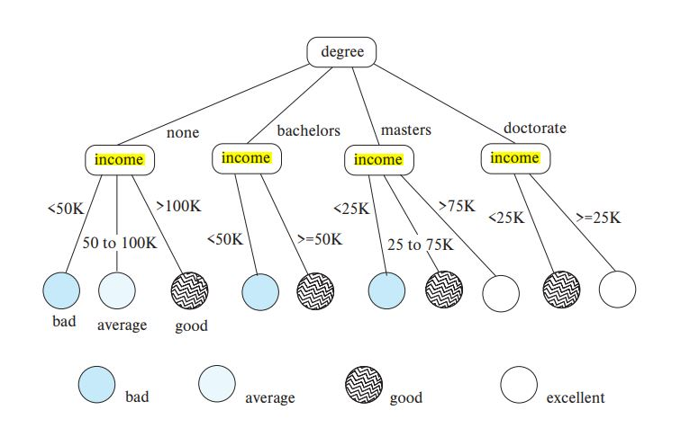

Instructor: Xi He

Coordinator: Ahmed Haj-Yasien

- [Week 1. May 11](#week-1-may-11)
- [Week 2. May 18](#week-2-may-18)
- [Week 3. May 25](#week-3-may-25)
- [Week 4. June 2](#week-4-june-2)
- [Week 5. June 8](#week-5-june-8)
- [Week 6. June 15](#week-6-june-15)
- [Week 7. June 22](#week-7-june-22)
- [Week 8. June 29](#week-8-june-29)
- [Week 9. July 6](#week-9-july-6)
- [Opt. July 27](#opt-july-27)

# Week 1. May 11

* 4 assns (10%, 8%, 8%, 9%)
* project (30%)
* mt (35%)

__defn.__ database: an organized body of related information

__defn.__ database management system (DBMS): a software system that facilitates the creation, maintenance and use of an electronic database
* data, persistency, query, modification

earily effort: CODASYL standard:
* programmers need to know how data is organized physically
* worry about data/workload characteristics

relational revolution (Edgar F. Codd) (1970s)
* simple model: data is stored in relations (tables)
* declarative query language _SQL_

standard DBMS features:
* logical data model; declarative queries and updates -> physical data independence
* multi-user concurrent access; persistent storage of data; safety from system failures
* performance

standard DBMS architecture:
```
+------------------+
|   applications   |
+----+-------+-----+
     |       ^
CRUD |       | response
     v       |
+----+-------+-----+
|      DBMS        |       +---------------------------+
+--------+---------+                                   |
         ^                                             |
         v  File system interface                      |
+--------+---------+                             bypass|
|      OS          |                                   |
+--------+---------+                                   |
         ^                                             |
         v  Storage system interface                   |
+--------+---------+                                   |
|      Disk        |       <---------------------------+
+------------------+

```

## relational data model

* relations (tables)
* each relation has attributes (columns)
* each attribute has domain (range)
* each relation has tuples (rows)
  * duplicates are not allowed

__defn.__ schema (metadata):
* specifies the logical structure of data
* defined at setup time, rarely changes

__defn.__ instance:
* represents the data content
* changes rapidly, but always conforms to the schema

__defn.__ integrity constraints:
* a set of rules that db instances should follow
* types:
  * tuple-level
    * domain restrictions, eg. age cannot be negative...
  * relation-level
    * key constraints eg. uid should be unique in the User relation
    * functional dependencies
  * database-level
    * referential integrity - foreign keys eg. uid must refer to a row in users...

__defn.__ a _(candidate) key_ if a set of attributes $K$ for a relation $R$ if
1. in no instance of $R$ will two different tuples agree on all attributes of $K$ (ie K is an identifier)
2. no proper subset of $K$ satisfies the above condition (ie K is minimal)

__eg.__ in `User(uid, name, age, pop)`
* `uid` is a key
* `age` is not a key
* `(uid, name)` is not a key (it is a superkey)

__defn.__ a _primary key_ is a designated candidate key in the schema declaration (we can have multiple keys)

__eg.__ _foreign keys_ ("pointer" to other rows)
```
|uid |name |age |pop |
|142 |bart |10  |0.9 |

|gid |       name         |
|dps |Deal Putting Society|

|uid |gid |  # refer to above two tables
|142 |dps |
```

_referential integrity_: a tuple with non-null value for a foreign key that does not match the primary key value of a tuple in the referenced relation is not allowed

### relational algebra
a language for querying relational data based on "operators"

__core operator 1: selection__
* input: table R
* notation: $\sigma_pR$
  * p is called a _selection condition_ or _predicate_
* goal: filter rows according to some criteria
* output: same columns as R, but only rows of R that satisfy p

__eg.__ users with popularity higher than 0.5: $\sigma_{\mathrm{pop}>0.5}\mathrm{User}$

* predicate can include any column of R, constants, comparisons, boolean connectives
* must be able to evaluate the condition over each single row of the input table eg. $\sigma_{\mathrm{pop}\ge\textrm{every pop in User}}$ is not allowed

__core operator 2: projection__
* input: table R
* notation: $\pi_LR$
  * L is a list of columns in R
* goal: output chosen columns
* output: "same rows" but only the columns in L

__eg.__ get user ages: $\pi_\mathrm{age}\mathrm{User}$

* duplicate output rows are removed

__core operator 3: cross product__
* input: two tables R and S
* notation: $R\times S$
* goal: pairs rows from two tables
* output: for each row r in R and each s in S, output a row rs (concatenation of r and s)

* column ordering is unimportant, so operator is commutative

__derived operator 1: join (theta join)__
* input: two tables R and S
* notation: $R\Join_pS:=\sigma_p(R\times S)$
* goal: relate rows from two tables according to some criteria
* output: for each row r in R and each row s in S, output a row rs if r and s satisfy p

__eg.__ info about users, plus IDs of their groups: $\mathrm{User}\Join_\mathrm{User.uid=Member.uid}\mathrm{Member}$
```
          USER                        MEMBER
|uid |name    |age |pop |           |uid |gid |
|123 |Milhouse|10  |0.2 |           |123 |gov |
|857 |Lisa    |8   |0.7 |           |857 |abc |
                                    |857 |gov |

    USER JOINS MEMBER ON UID=UID
|uid |name    |age |pop |uid |gid |
|123 |Milhouse|10  |0.2 |123 |gov |
|857 |Lisa    |8   |0.7 |857 |abc |
|857 |Lisa    |8   |0.7 |857 |gov |
```

__derived operator 2: natural join__
* input: two tables R and S
* notation: $R\Join S:=\pi_L(R\Join_pS)$ where
  * p = each pair of columns common to R and S
  * L is the union of column names from R and S
* goal: relate rows from two tables and
  * enforce equality between identically named columns
  * eliminate one copy of identically named columns

__eg.__ like in join eg, duplicate uid is omitted

__core operator 4: union__
* input: two tables R and S
* notation: $R\cup S$
  * R and S must have identical schema
* output: has same schema as R and S, contains all rows in R and all rows in S with duplicate removed

__core operator 5: difference__
* input: two tables R and S
* notation: $R-S$
  * R and S must have identical schema
* output: has same schema as R and S, contains all rows in R that are not in S

__derived operator 3: intersection__
* input: two tables R and S
* notation: $R\cap S=R-(R-S)=S-(S-R)$
  * R and S must have identical schema
* output: has same schema as R and S, contains all rows in both R and S

__core operator 6: renaming__
* input: a table R
* notation: $\rho_SR$, $\rho_{A_1\to A_1',...}R$, or $\rho_{S(A_1\to A_1',...)}R$
* goal: rename a table and/or its columns
* output: a table with same rows as R but called differently

__eg.__ create identical column names for natural joins:
* having `R(rid,...)`, `S(sid,...)`
* $R\Join_\mathrm{rid=sid}S=(\rho_\mathrm{rid\to id}R)\Join(\rho_\mathrm{sid\to id}S)$

__eg.__ find IDs of users who belong to at least two groups
```
  MEMBER
|uid |gid |
|100 |gov |
|100 |abc |
|200 |gov |
```
answer:
$$
\begin{aligned}
    \pi_\mathrm{uid1}(\\
    &\rho_\mathrm{uid\to uid1,gid\to gid1}\mathrm{Member}\\
    &\Join_\mathrm{uid1=uid2\land gid1\ne gid2} \\
    &\rho_\mathrm{uid\to uid2,gid\to gid2}\mathrm{Member}\\
    )
\end{aligned}
$$

__eg.__ USER(<ins>uid</ins>, name, age, pop), GROUP(<ins>gid</ins>, name), MEMBER(<ins>uid</ins>, <ins>gid</ins>)
* gids of groups of at least 2 users
  ```
                                π MEMBER1.gid
                                    |
          ⨝ MEMBER1.gid=MEMBER2.gid && MEMBER1.uid≠MEMBER2.uid
         /                                                   \
  ρ MEMBER1                                               ρ MEMBER2
     |                                                         |
   MEMBER                                                    MEMBER
  ```
* names of users in Lisa's groups
  ```
                 π uid
                  |
                 ⨝
                /  \
            π gid  MEMBER
              |
             ⨝
          /     \
  σ name=Lisa  MEMBER
       |
      USER
  ```
* IDs of groups Lisa does not belong to
  ```
            -
        /      \
       /        \
  π gid         π gid
    |             |
  GROUP          ⨝
             /        \
        σ name=Lisa MEMBER
             |
           USER
  ```
* who are the most popular?
  * who do not have the highest pop rating? -> whose pop is lower than somebody else's?
  ```
             -
         /       \
        /         \
    π uid       π USER1.uid
      |              |
    USER    ⨝ USER1.pop<USER2.pop
               /               \
            ρ USER1          ρ USER2
              |                 |
             USER              USER
  ```

__defn.__ the operator is _non-monotone_ if after adding more rows to the input, some old output rows may become invalid and need to be removed.
* eg: difference is monotone with respect to first relation R, and non-monotone with respect to second relation S
* all others are monotone
* composition of monotone operators produces a monotone query

relational calculus
* uses first order logic
* relational algebra = 'safe' relational calculus
  * eg. non safe operation: get users not in the database
* eg. who are the most popular: $\{u.\mathrm{uid}:u\in\mathrm{User}\land\lnot(\exists u'\in\mathrm{User}:u.\mathrm{pop}<u'.\mathrm{pop})\}$

limits of relational algebra:
* no recursion

# Week 2. May 18

## SQL
_SQL_: structured query language
* data-definition language(DDL): schemas, relations
* data-manipulation language (DML): query info, crud tuples
* integrity constraints
* triggers, views, indexes, programming, recursive queries...

### DDL
* case-insensitive, -- for comments

__create table__
* CREATE TABLE _table_name (..., column_name column_type, ...)_

__eg.__
```sql
CREATE TABLE User (uid DECIMAL(3,0), name VARCHAR(30), age DECIMAL(2,0), pop DECIMAL(3,2));
CREATE TABLE Group (gid CHAR(10), name VARCHAR(100));
CREATE TABLE Member (uid DECIMAL (3,0), gid CHAR(10));
```

__delete table__
* DROP TABLE _table_name_
* eg. `DROP User;`

__SFW statement__
* SELECT $A_1,...,A_n$ FROM $R_1,...,R_m$ WHERE cond;
* also called select-project-join query
* corresponds to $\pi_{A_1,...,A_n}(\sigma_\mathrm{cond}(R_1\times...\times R_m))$
  * not really equivalent to - sql has duplicate entries

semantics:
```cs
for t1 in R1:
    ...
    for tm in Rm:
        if cond(t1, ..., tm):
            compute and output A1,...,An as a row
```

__eg.__
```sql
-- all rows in the User table
SELECT * FROM User;

-- name of users under 18
SELECT name FROM User WHERE age<18;

-- where was Lisa born?
-- select list can contain exprs and funcs eg. SUBSTR, ABS
-- string literals (case sensitive) are enclosed in single quote
SELECT 2021-age FROM User WHERE name = 'Lisa';
```

__eg.__ list IDs and names of groups with a user whose name contains "Simpson"
```sql
-- gid and name column names are not unique, so specify table
SELECT Group.gid, Group.name
    FROM User, Member, Group
    WHERE User.uid = Member.uid          -- join clause
        AND Group.gid = Member.gid       -- join clause
        AND User.name LIKE '%Simpson%';  -- %: wildcard
```

__eg.__ Names of all groups that Lisa and Ralph are both in
```sql
SELECT g.name
    FROM User AS u1, User AS u2, Member AS m1, Member AS m2, Group AS g  -- can omit AS
    WHERE u1.name = 'Lisa' AND u2.name = 'Ralph'
        AND u1.uid = m1.uid AND u2.uid = m2.uid
        AND m1.uid = g.gid AND m2.uid = g.gid;  -- both people are in group with gid
```

* many queries can be written using only selection, projection, and cross product (or join)
* they can be written as general form: $\pi_L(\sigma_p(R_1\times...\times R_m))$

__eg.__ $\pi_{R.A,S.B}(R\Join_{p_1}S)\Join_{p_2}(\pi_{T.C}\sigma_{p_3}T)=\pi_{R.A,S.B,T.C}\sigma_{p_1\land p_2 \land p_3}(R\times S\times T)$ (combine selections, projections and products)

difference relational algebra vs. sql:
* r.a. uses set semantics -> no duplicates in output
* sql uses bag semantics by default -> allow duplicates
  * reason: efficiency
  * DISTINCT keyword can be used  
    __eg.__
    ```sql
    -- IDs of all pairs of users that belong to one group
    SELECT DISTINCT m1.uid uid1, m2.uid uid2
        FROM Member m1, Member m2
        WHERE m1.gid = m2.gid AND m1.uid > m2.uid;
    ```

__SQL set & bag operations__
* set: UNION, EXCEPT, INTERSECT
  * duplicates in input tables are first eliminated if any
  * duplicates in result are also eliminated (for union)
* bag: UNION ALL, EXCEPT ALL, INTERSECT ALL

__eg.__
```sql
Bag1       Bag2
Fruit      Fruit
-----      -----
apple      apple
apple      orange
orange     orange

-- add counts
> (SELECT * FROM Bag1) UNION ALL (SELECT * FROM Bag2);
Fruit
-----
apple
apple
orange
apple
orange
orange  -- apple: 3 orange: 3

-- proper subtraction on counts
> (SELECT * FROM Bag1) EXCEPT ALL (SELECT * FROM Bag2);
Fruit
-----
apple  -- 2-1=1

-- take minimum of two counts
> (SELECT * FROM Bag1) INTERSECT ALL (SELECT * FROM Bag2);
Fruit
-----
apple
orange
```

__table subqueries__
* use query result as a table

__eg.__ names of users who poked others more than others poked them
```sql
-- uid1   uid2
----------------
-- user1  user2

SELECT DISTINCT name
    FROM User,
        (SELECT uid1 FROM Poke)
        EXCEPT ALL
        (SELECT uid2 FROM Poke) AS T
    WHERE User.uid = T.uid;
```

__scalar subqueries__
* that returns a single row can be used as a value in WHERE, SELECT, etc

__eg.__ users at the same age as Bart
```sql
SELECT * FROM User WHERE age = (SELECT age FROM User WHERE name = 'Bart');
```
* if it returns more than 1 row -> error. can be avoided if name is key
* if it returns no rows -> it is nil

__IN subqueries__
* x IN (subquery)
* checks x is in the result of subquery

__eg.__ users at the same age as (some) Bart(s)
```sql
SELECT * FROM User WHERE age IN (SELECT age FROM User WHERE name = 'Bart');
```

__EXISTS subqueries__
* EXISTS (subquery)
* checks if the result of subquery is non-empty

__eg.__ users at the same age as (some) Bart(s)
```sql
-- a correlated subquery: subquery that references tuple variables in surrounding queries
SELECT * FROM User u WHERE EXISTS(SELECT * FROM User WHERE name = 'Bart' AND age = u.age);
```

__quantified subqueries__
* ... WHERE x op ALL(subquery)
  * true iff for all t the result of subquery, x op t is true
* ... WHERE x op ANY(subquery)
  * true iff there exists t the result of subquery, x op t is true

__eg.__
```sql
-- most popular users
SELECT * FROM User WHERE pop >= ALL(SELECT pop FROM User);
SELECT * FROM User WHERE NOT (pop < ALL(SELECT pop FROM User));
```

__aggregates__
* standard SQL aggregate funcs: COUNT, SUM, AVG, MIN, MAX

__eg.__
```sql
-- number of users under 18 and their avg pop
-- COUNT(*) -> number of rows
SELECT COUNT(*), AVG(pop) FROM User WHERE age < 18;

-- how many users are in some group?
SELECT COUNT(*) FROM (SELECT DISTINCT uid FROM MEMBER);
SELECT COUNT(DISTINCT uid) FROM MEMBER;
```

__grouping__
* SELECT ... FROM ... WHERE ... GROUP BY list_of_columns;

__eg.__
```sql
uid  name     age  pop
----------------------
142  Bart     10   .9
857  Lisa     8    .7
123  Milhouse 10   .2
456  Ralph    8    .3

-- average popularity for each age group
> SELECT age, AVG(pop) FROM User GROUP BY age;
age  AVG(pop)
-------------
10   .55
8    .5
```

* aggregate with no group by can be considered a single group.
* if a query uses aggregation/group by, then every column referenced in SELECT must be either
  * aggregation
  * a group by column
  * this ensures any SELECT expr produces only one value for each group

__having__
* SELECT ... FROM ... WHERE ... GROUP BY list_of_columns HAVING cond;
* filter groups based on the group properties

__eg.__
```sql
-- list avg pop for each age group with more than 100 users
SELECT age, AVG(pop) FROM User GROUP BY age HAVING COUNT(*) > 100;

SELECT T.age, T.apop
    FROM (SELECT age, AVG(pop) apop, COUNT(*) gsize FROM User GROUP BY age) T
    WHERE T.gsize > 100;
```

aggregation and group provide more expressive power to relational algebra
* subqueries do not

__order by__
* SELECT [DISTINCT] FROM ... WHERE ... GROUP BY ... HAVING ...  
  ORDER BY output_column [ASC|DESC], ...;

__eg.__
```sql
-- all users sort them by pop (descending), then name (ascending)
SELECT * FROM User ORDER BY pop DESC, name;
SELECT * FROM User ORDER BY 4 DESC, 2;
```

__three-valued logic__
* SQL has TRUE=1, FALSE=0 and UNKNOWN=0.5
* we have
  * x AND y = min(x, y)
  * x OR y = max(x, y)
  * NOT x = 1 - x
  * comparing a `NULL` with another values (>,>=,=,...) results in `NULL`
* WHERE and HAVING clauses only select TRUE rows.
* aggregate functions except COUNT(*) ignore `NULL`s.

__eg.__
```sql
-- if a row has NULL pop, following are not equivalent
SELECT AVG(pop) FROM User;
SELECT SUM(pop)/COUNT(*) FROM User;

-- if a row has NULL pop, following are not equivalent
SELECT * FROM User;
SELECT * FROM User WHERE pop=pop;

-- select users with NULL pop values
-- this does not work
SELECT * FROM User WHERE pop=NULL;
-- works
(SELECT * FROM User) EXCEPT ALL (SELECT * FROM User WHERE pop=pop);
SELECT * FROM User WHERE pop IS NULL; -- IS NOT NULL for non-null
```

__outerjoin__
* R ⟕ S for left outer join
  * includes rows $R\Join S$ plus dangling R rows padded with NULLs
* R ⟖ S for right outer join
  * includes rows $R\Join S$ plus dangling S rows padded with NULLs
* R ⟗ S for full outer join
  * includes both

__eg.__
```sql
            Group
gid  name                               uid  gid
----------------------------            ---------
abc  Book Club                          142  dps
gov  Student Govrnt                     123  gov
dps  Dead Putting Society               857  abc
nuk  United Nuclear Workers             857  gov
                                        789  foo

> SELECT * FROM Group FULL OUTER JOIN Member ON Group.gid = Member.gid;
gid  name                    uid
--------------------------------
abc  Book Club               857
gov  Student Govrnt          123
gov  Student Govrnt          857
dps  Dead Putting Society    142
foo  United Nuclear Workers  NULL
foo  NULL                    789

> SELECT * FROM Group LEFT OUTER JOIN Member ON Group.gid = Member.gid;
gid  name                    uid
--------------------------------
abc  Book Club               857
gov  Student Govrnt          123
gov  Student Govrnt          857
dps  Dead Putting Society    142
foo  United Nuclear Workers  NULL

-- similar for ... INNER JOIN ... ON ...;
--             ... NATURAL JOIN ...;
```

### DML

__insert__
* inserts one row or insert the result of a query

__eg.__
```sql
-- User 789 joins dps
INSERT INTO Members VALUES (789, 'dps');

-- everybody joins dps
INSERT INTO Member (
    SELECT uid, 'dps' FROM User
    WHERE uid NOT IN (
        SELECT uid FROM Member WHERE gid = 'dps'
    )
);
```

__delete__

__eg.__
```sql
-- delete everything from table
DELETE FROM Member;

-- User 789 leaves dps
DELETE FROM Member WHERE uid = 789 AND gid = 'dps';

-- Users under age 18 must leave unk
DELETE FROM Member WHERE uid in (
    SELECT uid FROM User WHERE age < 18
) AND gid = 'nuk';
```

__update__

__eg.__
```sql
-- User 142 changes name to Barney
UPDATE User SET name = 'Barney' WHERE uid = 142;

-- change everyone's pop
-- note subquery avg is always computed ahead using old table...
UPDATE User SET pop = (SELECT AVG(pop) FROM User);
```

### constraints
common constraints
* __NOT NULL__
* key declaration
  * __PRIMARY KEY__ (at most one per table)
  * __UNIQUE__

__eg.__  
```sql
CREATE TABLE Member (uid DECIMAL(3,0) NOT NULL, gid CHAR(10) NOT NULL, PRIMARY KEY(uid, gid));
```

__referential integrity__
* referenced columns must be PRIMARY KEY
* referencing columns form a FOREIGN KEY

__eg.__ if an uid appears in Member, it must appear in User, if gid appears in Member, it must appear in Group (to ensure no dangling ptrs exist)
```sql
CREATE TABLE Member (
    uid DECIMAL(3,0) NOT NULL REFERENCES User(uid),
    gid CHAR(10) NOT NULL,
    PRIMARY KEY(uid, gid),
    FOREIGN KEY (gid) REFERENCES Group(gid) -- required for multiple-key eg Member(uid,gid)
);
```
enforcing referential integrity
* insert breaks integrity - reject
* delete breaks integrity - options
  1. reject
  2. ripple the deletion
  3. set the dangling ones to NULL
* deferred constraint checking - can occur at end of transaction

__general assertion__
* CREATE ASSERTION assert_name CHECK assert_cond;
* cond is checked for each modification that could potentially violate it.

__eg.__
```sql
CREATE ASSERTION MemberUserRefIntegrity CHECK (
    NOT EXISTS (
        SELECT * FROM Member WHERE uid NOT IN (
            SELECT uid FROM User
        )
    )
);
```

__tuple- and attribute-based checks__
* associated with a single table
* only checked when a tuple/attr is inserted/updated
  * reject if cond is FALSE

__eg.__
```sql
CREATE TABLE User (age INTEGER CHECK(age IS NULL OR age > 0), ...);

CREATE TABLE Member (uid INTEGER NOT NULL CHECK(uid IN (SELECT uid FROM User)), ...);
```

# Week 3. May 25
## triggers
a _trigger_ is an event-condition-action (ECA) rule
* when event occurs, test condition; if true, execute action
* events:
  * UPDATE ON
  * INSERT ON
  * DELETE ON
  * UPDATE [OF col] ON table
* timing:
  * AFTER
  * BEFORE
  * INSTEAD OF
* granularity
  * FOR EACH ROW
  * FOR EACH STATEMENT

__eg.__ if user with pop < 0.5 joins group, delete them
```sql
CREATE TRIGGER PickySGroup
AFTER UPDATE OF pop ON User     -- event
REFERENCING NEW ROW AS newUser  -- transition variable
FOR EACH ROW
    WHEN (newUser.pop < 0.5)  -- cond
        AND (newUser.uid IN (SELECT uid FROM Member WHERE gid = 'sgroup'))
    DELETE FROM Member -- action
        WHERE uid = newUser.uid AND gid = 'sgroup';

-- same
CREATE TRIGGER PickySGroup2
AFTER UPDATE OF pop ON User
REFERENCING NEW TABLE AS newUsers  -- can only be used with AFTER trigger
FOR EACH STATEMENT
    DELETE FROM Member
        WHERE gid = 'sgroup'
            AND uid IN (SELECT uid FROM newUsers WHERE pop < 0.5);
```

availability for AFTER trigger:
|event|row|statement|
|:-:|:-:|:-:|
|delete|old row; old table|old table|
|insert|new row; new table|new table|
|update|old row, new row; old table, new table|old table, new table|

availability for BEFORE trigger
|event|row|statement|
|:-:|:-:|:-:|
|delete|old row||
|insert|new row||
|update|old row, new row||

statement- vs. row-level triggers
* row-level triggers easier to implement - maintains less states

system issues
* recursive firing of triggers
  * can get into infinite loop
* interaction with constraints
  * when to check if a triggering event violates constrains?
    * DB2:
      * after a BEFORE trigger
      * before an AFTER trigger
* be best avoided when alternatives exist

## views
a _view_ is like a virtual table
* defined by a query which describes how to compute the view contents on the flow
* stored by DBMS instead of view contents
* can be used in queries like regular table

__eg.__ reuse query sgroup
```sql
CREATE VIEW SGroup AS
    SELECT * FROM User WHERE uid IN (SELECT uid FROM Member WHERE gid = 'sgroup');

SELECT AVG(pop) FROM SGroup;

-- deletion
DROP VIEW SGroup;
```

reasons to use views:
* hide complexity from users
* hide data from users
* logical data independence
* provide uniform interface for difference impl or sources

sql92 updateable views:
* no join, no aggregation, no subqueries

__eg.__ let the average pop be 0.5
```sql
CREATE VIEW AveragePop(pop) AS  -- renamed column
    SELECT AVG(pop) FROM User;

CREATE TRIGGER AdjustAveragePop
INSTEAD OF UPDATE ON AveragePop  -- don't do action on view, do it in base table
REFERENCING OLD ROW AS o, NEW ROW AS n
FOR EACH ROW
    UPDATE User SET pop = pop + (n.pop - o.pop);

UPDATE AveragePop SET pop = 0.5;
```

## indexes
an _index_ is an auxiliary persistent data structure
* search tree, lookup date
* an index on R.A can speed up accesses of the form
  * R.A = value
  * R.A > value (depends)
* an index on $(R.A_1,...,R.A_n)$ can speed up
  * $R.A_1=v_1\land...\land R.A_n=v_n$
  * $(R.A_1,...,R.A_n)>(v_1,...,v_n)$ (depends)
* CREATE [UNIQUE] INDEX indexname ON table(col1, ...)
* dbms typically create indexes for primary keys

## recursive queries
* sql2 had no recursion
* sql3 introduces recursion
  * implemented in PostgresSQL

__eg.__ find all ancestors of Bart
```sql
parent  child
--------------
Homer   Bart
Homer   Lisa
Marge   Bart
Marge   Lisa
Abe     Homer
Ape     Abe

-- nonlinear recursion
WITH RECURSIVE Ancestor(anc, desc) AS ((
        -- base case
        SELECT parent, child FROM Parent
    ) UNION (
        -- recursive relation
        SELECT a1.anc, a2.desc
        FROM Ancestor a1, Ancestor a2
        WHERE a1.desc = a2.enc
    )
    -- execution stops until a fixed point
)
SELECT anc FROM Ancestor WHERE desc = 'Bart';

-- linear recursion
WITH RECURSIVE Ancestor2(anc, desc) AS ((
        SELECT parent, child FROM Parent
    ) UNION (
        SELECT anc, child
        FROM Ancestor2, Parent
        WHERE Ancestor2.desc = Parent.parent
    )
)...
```
((mysql) should you put "desc" condition in base case?)

__defn.__ for $f:D\rightarrow D$, a _fixed point_ of $f$ is a value $x$ such that $f(x)=x$.

to compute a fixed point of f, start with a seed $x\leftarrow x_0$, compute $f(x)$
* if $f(x)=x$, stop; x is a fixed point
* otherwise $x\leftarrow f(x)$, repeat

__defn.__ a query q is just a function that maps an input table to an output table, so a fixed point of q is a table T such that q(T)=T.

to compute fixed point of q, start with empty table $T\leftarrow\varnothing$, eval q over T
* if the result is same as T, stop; T is fixed point
* otherwise T is the new result; repeat

linear vs. nonlinear recursion
* linear is easier to implement
  * for linear, just keep joining newly generated Ancestor rows with Parent
  * for non-linear recursion, need to join newly generated Ancestor rows with all existing Ancestor rows
* non-linear recursion may take fewer steps to converge, but takes more work

__eg.__ Natural = 1,2,3,... 1 is odd; odd+1 is even; even+1 is odd/
```sql
WITH RECURSIVE Even(n) AS (
    SELECT n FROM Natural WHERE n = ANY(SELECT n+1 FROM odd)
), RECURSIVE Odd(n) AS ((
        SELECT n FROM Natural WHERE n = 1
    ) UNION (
        SELECT n FROM Natural WHERE n = ANY(SELECT n+1 FROM Even)
    )
)...
```
semantics:  
WITH RECURSIVE R1 AS Q1,..., RECURSIVE Rn AS Qn  Q;
1. $R_1\leftarrow\varnothing,...,R_n\leftarrow\varnothing$
2. eval $Q_1,...,Q_n$ using current contents of $R_1,...,R_n$
3. if $R_i^{\textrm{new}}\ne R_i$ for some i
   1. $R_1\leftarrow R_1^\textrm{new},...,R_n\leftarrow R_n^\textrm{new}$
   2. goto 2
4. compute $Q$ using current contents of $R_1,...,R_n$ and output

if q is monotone, then starting from empty set produces the _unique minimal fixed point_
* all these fixed points must contain this fixed point
* this is the 'natural' answer

if q is non-monotone:
* the fixed-point iteration may never converge
* there could be multiple minimal fixed points (don't know to choose which)

should recursive queries contain negation?
* construct a _dependency graph_
  * one node for each table defined in WITH
  * if R is defined in terms of S, then add directed edge from R to S
    * if R is not monotone with respect to S, then label the edge with '-'
* if there are no cycles with '-' edge, then this is legal sql3 recursion
  * called _stratified negation_

__eg.__ find pairs of persons with no common ancestors
```sql
WITH RECURSIVE Ancestor(anc, desc) AS
    (SELECT parent, child FROM Parent) UNION
    (SELECT a1.anc, a2.desc
    FROM Ancestor a1, Ancestor a2
    WHERE a1.desc = a2.anc)),

Person(person) AS
    ((SELECT parent FROM Parent) UNION
    (SELECT child FROM Parent)),

NoCommonAnc(person1, person2) AS
    ((SELECT p1.person, p2.person
    FROM Person p1, Person p2
    WHERE p1.person <> p2.person)
    EXCEPT
    (SELECT a1.desc, a2.desc
    FROM Ancestor a1, Ancestor a2
    WHERE a1.anc = a2.anc))

SELECT * FROM NoCommonAnc;
```


evaluating stratified negation
* the _stratum_ of a node R is the max number of '-' edges on any path from R
  * Ancestor: 0
  * Person: 0
  * NoCommonAnc: 1
* strategy:
  * compute tables lowest-stratum first
  * for each stratum, use fixed-point iteration on all nods in that stratum

## using sql
### cursor
* open (a result table), get next, close

### SQL/PSM
* CREATE FUNCTION, FOR, DECLARE, ...

advantages:
* more processing features for DBMS
* more application logic can be pushed to data
cons:
* sql is already too big
* complicate optimization and make it impossible to guarantee safety

### working with SQL through API
* SQL/CLI (call-level interface) standard
* prepared statements

### embedded sql
pros:
* be processed by a preprocessor prior to compilation -> catch sql-related error ahead
* while in api, sql statements are interpreted at runtime

cons:
* new host language code -> complicate debugging

### support db features through an OO language
* object mapping (sqlalchemy)

### extend a general-purpose programming language with sql-like constructs
* (linq)

# Week 4. June 2

## database design
1. understand real-world domain being modeled -> specify it using database design model
2. translate specs to date model of DBMS
3. create DBMS schema

## entity-relationship model
* _entity_: a 'thing'
* _entity set_: a collection of things of same type, like a relation of tuples or a class of objects
  * rectangle
  * key is represented by underlining
* _relationship_: an association among entities
* _relationship set_: a set of relationships of same type (among same entity sets)
  * diamond
  * each relationship is uniquely identified by the entities it connects
* _attributes_: properties of entities or relationships
  * ovals

__eg.__  how to add info regarding isMemberOfSince?


### multiplicity of relationships
* _many-many_:  
  
* _many-one_: each entity in E is related to 0/1 entity in F; each entity in F is related to >0 in E (inplies _(0,1)_)  
  
* _one-to-one_: one entity in E related to 0/1 in F; one in F related to 0/1 in E (two arrows pointing inward) (inplies _(0,1)_)

### general cardinality constraints
* _general cardinality constraints_: lower and upper bounds on the number of relationships of a given relationship set in which a component entity may participate

__eg.__  

* each student can take 3-5 courses
* each course can be taken by 6-100 students

### weak entity sets
* if entity E's existence depends on entity F
  * F is a _dominant entity_
  * E is a _subordinate entity_
* _weak entity sets_ contain subordinate entities
  * double rectangle
  * relationship sets are called _supporting relationship sets_ drawn in double diamond
  * a weak entity set must have many-to-one/one-to-one relation to a distinct entity set
  * attributes of weak entity set only form key relative to a given dominant entity -> _discriminator_ (dotted line)
  * primary key of a weak entity set = discriminator + primary key of dominant entities' entity set
* _string entity sets_: contains no subordinate entities

__eg.__ seats in rooms in building  

* to identify a room, the key is (Room.Rnumber, building.name)

### ISA (extension)
* represented as triangle pointing to the parent class.
* COVER: subclasses must be disjoint in attributes
* OVERLAP: subclasses can overlap in attributes

__eg.__  


### structured attributes (extension)
* composite attributes (Address is composition of Street, City, ...)
* multi-valued attributes:
  * double edges
* aggregation: relationships can be viewed as high-level entities

__eg.__ an emplyee can have multiple hobbies  


### attributes or entity sets?
__eg.__ how to model employee's phones?  


* rules:
  * is it a separate object?
  * do we maintain info about it?
  * can several of them belong to a single entity?
  * does it make sense to delete such an object?
  * can it be missing from some of the entity set's entities?
  * can it be shared by different entities?
* if any of them is true => suggests a new entity set

### entity sets or relationships?

__eg.__
* entity set:  
  
* n-nary relation:  
  
* binary relations:  
  
  * we can always represent a relationship on n entity sets with n binary relationships

* methodology:
  * recognize entity sets
  * recognize relationships sets and participating entity sets
  * recognize attributes of entity and relationship sets
  * define relationship types and existence dependencies
  * define general cardinality constraints, keys and discriminators
  * draw diagram

__eg.__
* design a database representing cities, counties, and states
  * For states, record name and capital (city)
  * For counties, record name, area, and location (state)
  * For cities, record name, population, and location (county and state)
* assume the following:
  * Names of states are unique
  * Names of counties are only unique within a state
  * Names of cities are only unique within a county
  * A city is always located in a single county
  * A county is always located in a single state


### translate entity sets
* entity set -> table
  * attributes -> columns
  * key attributes -> key columns
* weak entity set -> table
  * key -> keys + borrowed keys from the dominant

### translate relationship sets
* relationship set -> table
  * key of connected entity sets -> columns
  * attributes of the relationship set (if any) -> columns
  * key -> determined by multiplicity
* relationship set has *-one relation -> an extra key on the 'one' side
* double diamonds (IN) -> nothing
  * the relationship is contained in the weak entity set's translation

__eg.__  


### translate ISA
* method 1: entity-in-all-superclass
  * two tables
  * an entity is represented in the table of superclass
  * an extra table includes only the attributes directly attached to the corresponding entity set + the inherited key
  * pro: all data found in one table
  * con: data of subclasses are scattered
* method 2: entity-in-most-specific
  * one table
  * table includes the attributes directly attached to the corresponding entity set + all inherited attributes
  * pro: all attributes found in one table -> no joining
  * con: data are scattered
* method 3: all-entities-in-one-table
  * one table
  * find all possible subclasses' attributes (optionally plus a 'type' attr), and set them to null if they do not apply
  * use sql database constraints to limit 'type'
  * pro: everything in one table
  * con: lots of NULL's; too complex

__eg.__  


### represent aggregation
* to represent relationship set involving aggregation of R, treat the aggregation like an entity set whose primary key is the primary key of the table for R 

principle
* KISS
* avoid redundancy
* capture essential constraints, but no unnecessary restrictions
* use common sense

# Week 5. June 8

__eg.__ supplier & part
```sql
SuppliedItems(*Sno*, Sname, City, *Pno*, Pname, Price)
-- vs
Suppliers(*Sno*, Sname, City)
Parts(*Pno*, Pname)
Supplies(*Sno*, *Pno*, Price)
```
single-table schema suffer from
* _update anomalies_ (fix other rows if one changes)
* _insert anomalies_
* _delete anomalies_
* likely increase in space requirements

## designing good dbs
goals:
* a method for evaluating schemas (detecting anomalies)
* a method for transforming bad schemas to good ones

### functional dependency
a _functional dependency_ has the form X->Y where X and Y are sets of attributes in the relation. whenever two rows agree on all the attributes in X, they must agree on all attributes in Y.
* superkey -> whole relation

__eg.__
```
EmpProj(*SIN*, *PNum*, Hours, EName, PName, PLoc, Allowance)
```
1. SIN determines employee name: SIN -> EName
2. project # determines project name and location: PNum -> PName, PLoc
3. allowances are always the same for the same number of hours at same location: PLoc, Hours -> Allowance

__defn.__ a set of FDs $\mathcal{F}$ _logically implies_ a FD X->Y if X->Y holds in all instances of R that satisfy $\mathcal{F}$.

__defn.__ $\mathcal{F^+}:=\{X\rightarrow Y: \mathcal{F}\text{ logically implies } X\rightarrow Y\}$ is the _closure_ of a FD set $\mathcal{F}$.

__axioms.__ _(Armstrong's)_
* _reflexivity_: if $Y\subseteq X$, then $X\rightarrow Y$ (eg. SIn,EName -> EName)
* _augmentation_: if $S\rightarrow Y$, then $XZ\rightarrow YZ\,\,\forall Z$
* _transitivity_: if $X\rightarrow Y,Y\rightarrow Z$, then $X\rightarrow Z$

__theorem.__ _(decomposition)_ if $X\rightarrow YZ$, then $X\rightarrow Y$ and $X\rightarrow Z$.

__theorem.__ _(union)_ if $X\rightarrow Y,X\rightarrow Z$, then $X\rightarrow YZ$.

__eg.__ given
* SIN, PNum -> Hours
* SIN -> EName
* PNum -> PName, PLoc
* PLoc, Hours -> Allowance

show SIN, PNum -> Allowance.

||||
|:-:|:-|:-:|
|1|SIN, PNum -> Hours|in F|
|2|PNum -> PName, PLoc|in F|
|3|PLoc, Hours -> Allowance |in F|
|4|SIN, PNum -> PNum|reflexivity|
|5|SIN, PNum -> PName, PLoc|transitivity, 4, 2|
|6|SIN, PNum -> PLoc|decomposition, 5|
|7|SIN, PNum -> PLoc, Hours|union, 6, 1|
|8|SIN, PNum -> Allowance|transitivity, 7, 3|

__defn.__ the _closure of attributes_ $Z$ in a relation (denoted $Z^+$) with respect to a set of FDs is the set of all attributes $\{A_1,A_2,...\}$ such that $Z\rightarrow A_1,A_2...$.

to compute $Z^+(Z,\mathcal{F})$:
1. start with closure = Z
2. if X->Y and X is already in the closure, then also add Y to the closure
3. repeat until no new attrs can be added

__eg.__ we can show SIN, PNum -> Allowance by claiming {Allowance} is contained by Z+({SIN, Num}, F).

__eg.__ to check K is a key of R, check its attribute closure is equal to the set of all keys.

### decomposing relation

__defn.__ let R be a relation schema, the collection $\{R_1,...,R_n\}$ of relations is a decomposition of R if $R=R_1\cup...\cup R_n$.

'good' schema decomposition
* lossless-join
  * able to construct the instance of the original table from the instances of the tables in the decomposition
  * a decomposition $\{R_1,R_2\}$ is _lossless_ iff the common attributes of $R_1$ and $R_2$ form a superkey for either schema, ie $R_1\cap R_2\rightarrow R_1$ or $R_1\cap R_2\rightarrow R_2$.
* dependency-preserving
  * given schema R and set of FDs $\mathcal{F}$, decomposition of R is _dependency preserving_ if there is an equivalent set of FDs $\mathcal{F}'$, none of which is interrelational (join) in the decomposition.

__eg.__ R={Student, Assignment, Group, Mark}, F={Student, Assignment -> Group, Mark}  
* R1={Student, Group, Mark}
* R2={Assignment, Mark}
* this is a bad decomposition as it is lossy -> R1 ∩ R2 is not a superkey of either R1 or R2

__defn.__ a relation R is in _BCNF_ iff whenever $(X\rightarrow Y)\in \mathcal{F}+$ and $XY\subseteq R$, then either
* $X\rightarrow Y$ is trivial (ie $Y\subseteq X$)
* X is a superkey of R (ie $X\rightarrow R$)

BCNF decomposition algorithm:
1. find a BCNF violation, ie a nontrivial FD $X\rightarrow Y$ where X is not superkey
2. decompose R into
   * $R_1$: attributes $X\cup Y$
   * $R_2$: attributes $X\cup Z$, where Z contains all attrs of R that are in neither $X$ nor $Y$
3. repeat until all in BCNF

__theorem.__ BCNF decomposition is lossless, ie given nontrivial $X\rightarrow Y$ in R where X is not a superkey, we have $R=\pi_{XY}R\Join \pi_{XZ}R$.
* not necessarily dependency preserving

__eg.__  


__defn.__ a relation R is in _3NF (third normal form)_ iff whenever $(X\rightarrow Y)\in \mathcal{F}+$ and $XY\subseteq R$, then either
* $X\rightarrow Y$ is trivial (ie $Y\subseteq X$)
* X is a superkey of R (ie $X\rightarrow R$)
* each attribute in $Y-X$ is contained in a candidate key of R

__defn.__ a set of FD is _minimal_ if
* every rhs of a FD is a single attributes
* there are no redundant FDs that can be implied from others
* there are no redundant attributes in lhs for each FD

finding minimal cover:
1. remove first violation: replace $X\rightarrow YZ$ with $X\rightarrow Y$ and $X\rightarrow Z$
2. remove second violation:  remove $X\rightarrow A$ from $\mathcal{F}$ if $A\in\text{compute}X^+(X,\mathcal{F}-\{X\rightarrow A\})$
3. remove third violation: remove A from lhs of $X\rightarrow B$ iif $B\in\text{compute}X^+(X-\{A\},\mathcal{F})$

computing 3NF decomposition:
1. initialize the decomposition with empty set
2. find a minimal cover for $\mathcal{F}$, let it be $\mathcal{F}^*$
3. for every $(X\rightarrow Y)\in \mathcal{F}^*$, add a relation $\{XY\}$ to the decomposition
4. if no relation contains a candidate key for R, then compute a candidate key K for R, and add $\{K\}$ to decomposition.

3NF allows more redundancy, but is dependency-preserving.

# Week 6. June 15
## physical data organization
|location|cycles||
|:-:|:-:|:-:|
|registers|1|
|on-chip cache|2|
|on-board cache|10|
|memory|100|
|disk|10^6|non volatile
|tape|10^9|non volatile

```
              spindle
                 |
dsik      ===============   platter
head ---------+  |
          ===============   platter
          ===============   platter
                 |

tracks (concentric circles)
```
### magnetic disks
disk access time is the sum of:
* _seek time_: for disk heads to move to the correct cylinder
* _rotational delay_: for the desired block to rotate under the disk head
* _transfer time_: time to read/write data of the block

random disk access:
* average seek time: should skip 1/3 of them $\sum_{s=1}^n\sum_{e=1}^n\frac{|e-s|}{n^2}\approx\frac{n}{3}$
  * 'typical: 5ms
* average rotational delay: half rotation $\sum_{s=1}^n\sum_{e=s+1}^n\frac{|e-s|}{n^2}\approx\frac{n}{2}$
  * 'typical': 4.2ms (7200rpm)

sequential disk access:
* seek time: 0 (assuming data is on same track)
* rotational delay: 0 (assuming data is on the next block on the track)

### SSD
* 1-2 orders of magnitude faster random access than hard drives
* little difference between random vs. sequential read performance
* random write will hurt: in-place update requires erasing the whole 'erasure block' and rewriting it

consequences:
* reduce io
* cache blocks from stable storage in memory
  * dbms maintains a memory buffer pool of blocks where r/w operate
  * dirty (updated) memory blocks are 'flushed' back to stable storage

performance tricks:
* disk layout strategy: keep related things close (same block, track, disk or adjacent)
* prefetching
* parallel io
* disk scheduling eg _elevator algorithm_
* track buffer: r/w on entire track at a time

### record layout
record = row in a table
* variable-format records
  * rare
* fixed-format records
  * fixed-length fields and occasionally variable

__eg.__ fixed-length fields
```sql
CREATE TABLE User(uid INT, name CHAR(20), age INT, pop FLOAT);

0     4                      24   28         36
+-----+----------------------+----+----------+
| 142 | 'Bart'               | 10 |    0.9   |
```
what about NULL?
* can add a bitmap at the beginning of record

__eg.__ variable-length record
```sql
CREATE TABLE User(uid INT, name VARCHAR(20), age INT, pop FLOAT, comment VARCHAR(100));
```
put all variable-length field at then end, and
* method 1: use field delimiters ('\0')
* method 2: store offsets
* update is messy if it changes the length of a field

__eg.__ LOB fields
```sql
CREATE TABLE User(uid INT, name CHAR(20), age INT, pop FLOAT, avatar BLOB(32000));
```
* user records get de-clustered - bad because most queries do not involve image
* can use decomposition (auto done by dbms)
  * (uid, name, age, pop) and (uid, avatar)

### block layout
_NSM (N-ary Storage Model)_:
* store records from the beginning of each block
* use a directory at end of each block
  * to locate records and manage free space
  * necessary for variable-length records
* reorganize after every update/delete to avoid fragmentation
  * need to rewrite half of block on average
  * special case: records are fixed-length
    * only need to move one record
    * need a pointer to the beginning of free space
    * or use a bitmap to indicate which slot is available
* have many cache misses if we are selecting columns (data not aligned to cache)


_PAX (Partition Attributes Across)_:
* most queries only access a few columns
* cluster values of the same column in each block


_column stores_:
* store tables by columns instead of rows
  * better cache performance, fewer io, aggressive compression
  * more disruptive changes in query execution and optimization

## indexing
* _dense_: one index entry for each search key value
  * one entry may 'point' to multiple records
  * can tell directly if record exists
* _sparse_ / _clustered_: one index entry for each block
  * records must be clustered according to search key
  * smaller size, easier to update
* a relation may have at most one clustering index, and any number of non-clustering indices (_secondary key_).
* _primary index_: created for primary key of table
  * usually clusted by primary key


### ISAM (index sequential access method)
* if index is till too big, then put another (sparse) index on top of that
* B+-tree: a hierarchy of nodes with intervals
  * balanced: performance guarentee
  * disk-based: one node per block; large fan-out

B+-tree:
* height constraint: all leaves at same lowest level
* fan-out constraint: all nodes at least half full (except root)

__range query__:  


__insert__:
* insert if we do not have overflow
* if target node is full, have to split nodes
* worset case: propagating split to root => one additonal level created

__deleteion__:
* have to merge nodes under least common ancestor if underflow
* worst case: propogating delete to root => one additional level created

performance:
* i/o for each operation:
  * locate index use O(h)
  * plus some to manipulate actual records
  * plus O(h) for reorganization (rare if f (fan-out) is large)
  * manus one if we cache the root
* $h\approx\log_fN$ where N is number of records
* fan-out f is typically large (100s)

in practice:
* complex reorganization for deletion often is not implemented
  * leave nodes less than half full and periodically reorganize
* most commercial dbms use B+tree instead hashing to handle range queries

the halloween problem:
* consider there is a B+-tree index on Payroll(salary)
  ```sql
  UPDATE Payroll SET salary = salary * 1.1 WHERE salary >= 100000;
  ```
* the update never stops because it sets the same record over and over again
* solution:
  * scan index in reverse
  * scan index and create to-do list before actual update, or maintain a 'done' list
  * tag every row with transaction/statement id

B+-tree vs. ISAM
* isam is more static; B+-tree is more dynamic
* isam is more compact - fewer io
* isam may not be balanced - b+-tree provides performance

B+-tree vs. B-tree
* B-tree store records (or ptrs) in non-leaf nodes
  * records can be accessed with fewer ios
* problem: storing more data in a node decrease fan-out and increase h
  * vast majority of records live in leaves; leave record require more io to access

### multi-attribute indices
__eg.__
```sql
CREATE INDEX NameIndex ON User(LastName, FirstName);

-- beneficial
SELECT * FROM User WHERE LastName = '...' AND FirstName = '...';
-- not beneficial
SELECT * FROM User WHERE FirstName = '...';
```

__eg.__ index-only plan
```sql
-- if there is non-clustering index on (firstname, pop)
SELECT COUNT(*) FROM User WHERE pop > '0.8' AND firstname = '...';
```
* non-clusted index contains all cols needed to answer the query without going to access base relation => reduce one io

guidelines for indices:
* do not index unless performance increase outweights update overhead
* attrs mentioned in WHERE clauses are candidates for index search keys
* multi-attr search keys should be considered when
  * a WHERE clause contains several conditions or
  * it enables index-only plans
* choose indices that benefit as many queries as possible
* range queries benefit most from clustering (primary key)

# Week 7. June 22
## query processing
notation:
```
|u1 u2|
|u3 u4|

Memory:
- # memory blocks: M

| User | Member |
| u1   | m1     |
| u2   | m2     |

Disk:
- # rows for a table: |Users|
- # disk blocks for a table: B(Users) = |Users| / # rows per block
```

### table scan
scan table R and proces the query
* selection over R
* projection of R without duplicate elimination
* IOs: B(R)
  * trick for selection: stop early if it is a lookup by key
* memory usage: 2 blocks
  * 1 for input, 1 for buffer output
  * increase memory does not improve io
* do not count the cost of writing result out
  * may be pipelined into another operator

__nested-loop join__: $R\Join_p S$
```cs
for each block of R:
  for each row r in R block:
    for each block of S:
      for each row s in S block:
        if p(r, s) is true:
          output rs
```
* R is called _outer_ table, S is called _inner_ table
* IO: B(R) + |R|*B(S)
* memory requirement: 3 (1 for R, 1 for S, 1 for output)

__blocked-based nested-loop join__
```cs
for each block of R:
  for each block of S:
    for each r in R block:
      for each s in S block:
        if p(r, s) is true:
          output rs
```
* IO: B(R) + B(R)*B(S)
* memory: 3

more improvements
* stop early if the key of the inner table is being matched
* stuff memory with as much of R as possible, stream S by, and join every S tuple with all R tuples in memory
  * IO: $B(R)+\lceil \frac{B(R)}{M-2}\rceil\cdot B(S) \approx B(R)\cdot \frac{B(S)}{M}$
  * memory: M (as much as possible)

### sorting
sort R, but R does not fit in memory. use external merge sort
* phase 0: read M blocks of R at a time, sort them, and write out a level-0 run
* phase 1: merge (M-1) level-0 runs at a time, and write out a level-1 run
* ... until we have 1 sorted run

__eg.__
```
3 memory blocks available, each holding 1 number
input: 1,7,4,5,2,8,3,6,9

phase 0:
- 1,7,4 -> 1,4,7
- 5,2,8 -> 2,5,8
- 9,6,3 -> 3,6,9
phase 1:
- 1,4,7+2,5,8 -> 1,2,4,5,7,8
- 3,6,8
phase 2:
- 1,2,4,5,7,8+3,6,9 -> 1,2,3,4,5,6,7,8,9
```
* IO: $2 B(R) \cdot\left(1+\left\lceil\log _{M-1}\left\lceil\frac{B(R)}{M}\right\rceil\right\rceil\right)-B(R)\approx O(B(R)\cdot\log_MB(R))$
* memory: M (as much as possible)

__sort-merge join__: $R\Join_{R.A=S.B}S$
```cs
sort R by A, sort S by B
r = R[0], s = S[0]
repeat:
  if r.A > s.B:
    s = next in S
  else if r.A < s.B:
    r = next in R
  else:
    output all matching tuples
    s = next in S
    r = next in R
until R or S is exhausted
```
* IO: sorting + O(B(R) + B(S)) (most cases)
  * worst: B(R)*B(S) everything joins

optimization of SMJ:
* idea: combine join with last merge phase of merge sort
* IO: 3*(B(R) + B(S))
* if smj completes in two phases: memory: $M>\sqrt{B(R)+B(S)}$

other sort-based algos:
* union, difference, intersection (like SMJ)
* eliminate duplicates
* grouping & aggregation
  * produce 'partial' aggregate values. doe not always work eg sum(distinct), median()

### hashing
__hash join__: $R\Join_{R.A=S.B}S$

main idea:
* partition R and S by hashing their join attrs and then consider corresponding partitions of R and S
* if r.A and s.B get hashed to different partitions, they do not join

steps:
* partition: partition R and S according to same hash function and join attrs
* read in each partion of R, stream in the corresponding partition of S, join
  * typically build a hash table for the partition of R
* IO:
  * phase 1: read B(R) + B(S) into memory to partition and write partitioned B(R) + B(S) to disk
  * phase 2: read B(R) + B(S) into memory to merge and join
  * IO: 3(B(R) + B(S))
* memory requirement: $M>\sqrt{\min(B(R), B(S))}+1$

what if partition is too large for memory? read the partition back and partition it again. at most $O(\log_MB(R))$ times

hash join vs smj
* hash join wins when two relations have very different sizes
* hash join performance depends on quality of the hash
* smj can be adapted for inequality join predicates
* smj wins if R or S is already sorted
* smj wins if the result needs to be ordred

other hash algorithms:
* union, difference, intersection
* duplicate elimination
* grouping & aggregation - apply hash function to the group key

### index-based algos

__selection using index__:
* equality predicate: $\sigma_{A=v}(R)$
  * use isam, B+-tree, or hash index on R(A)
* range predicate: $\sigma_{A>v}(R)$
  * use an ordered index (isam or B+-tree) on R(A)
* indices other than those on R(A)
  * eg B+-tree index on R(A, B)

__index nested-loop join__: $R\Join_{R.A=S.B}S$
```cs
for each block of R:
  for each r in R block:
    if r.A exists in S(B) s:
      output rs
```
* IO: B(R) + |R|*(index lookup)
* better pick R to be smaller relation
* memory: 3 blocks

__zig-zag join using ordered indices__: $R\Join_{R.A=S.B}S$
* idea: use the ordering provided by the indices on R(A) and S(B) to eliminate the sorting step of smj

index vs table scan:
* index-only queries wins because no actual tuple retrivial needed
* primary index clustered according to search key
  * one lookup leads to all result tuples
* table scan wins in secondary, non-clusted index on R(A)
  * index method needs to follow pointer to actual tuple
* index nested-loop join beats other joins if |R| is not too big

### summary

- selection
  - scan without index (linear search): $O(B(R))$
  - scan with index - selection condition must be on search-key of index
    - B+ index: $O(\log (B(R))$
    - hash index: $O(1)$
- projection
  - without duplicate elimination: $O(B(R))$
  - with duplicate elimination
    - sorting-based: $O\left(B(R) \cdot \log _{M} B(R)\right)$
    - hash-based: $O(B(R)+t)$ where t is the result of the hashing phase
- join
  - block-based nested loop join (scan table): $O\left(B(R) \cdot \frac{B(S)}{M}\right)$
  - sort-merge join $O\left(B(R) \cdot \log _{M} B(R)+B(S) \cdot \log _{M} B(S)\right)$
  - hash join $O\left(B(R) \cdot \log _{M} B(R)+B(S) \cdot \log _{M} B(S)\right)$
  - index nested loop join $O(B(R)+|R| \cdot$ (index lookup))

# Week 8. June 29

## query optimization
```
query      tree           logical plan      physical plan
   parser  -->   validator   -->   optimizer   -->   executer
```

### parsing and validation
* parser: SQL -> parse tree
  * detect and reject syntax errors
* validator: parse tree -> logical plan
  * detect and reject semantic errors: nonexistent tables, wrong type, insufficient privileges...
  * expand *; expand view definitions
  * information required are found in _system catalog_

logical plan:
  * nodes are logical operators (relational algebra operators)
  * there are many equivalant logical plans

### physical plan
physical plan:
* tells dbms query processor how to execute query
  * a tree of physical plan operators, which implements a query processing algo
  * each operator accepts a number of input tables/streams and output one table/stream
* dbms query optimizer picks best possible physical plan
  * questions:
    1. how to estimate costs?
    2. how to enumerate possible plans?
    3. how to pick the 'best' one?
  * often the goal is to avoid horrible ones

__eg.__
```sql
SELECT Group.name FROM User, Member, Group
WHERE User.name = 'Bart' AND User.uid = Member.uid AND Member.gid = Group.gid;

-- physical 1:
                 PROJECT(Group.name)
                         |
                 MERGE-JOIN(gid)
                     /       \
                    /         \
                SORT(gid)  SCAN(Group)
                  |
          MERGE-JOIN(uid)
            /        \
           /          \
FILTER(name='Bart') SORT(uid)
       |               |
   SCAN(User)      SCAN(Member)

-- physical 2:
                        PROJECT(Group.name)
                               |
                 INDEX-NESTED-LOOP-JOIN(gid)
                      /                 \
                     /                   \
      INDEX-NESTED-LOOP-JOIN(uid)    index on Group(gid)
         /                 \
        /                   \
INDEX-SCAN(name='Bart')   index on Member(uid)
       |
index on User(name)
```
* we have: cost estimation for each operator
  * eg SORT(gid) => $O(B(\text{input})\cdot\log_MB(\text{input}))$
  * but how to get the intermediate input size?

### cardinality estimation
__selection with equality predicate__: $Q=\sigma_{A=v}R$
* suppose we have size of R: |R|
* number of distinct A values in R: $|\pi_A R|$
* assumptions:
  * values of A are uniformly distributed
  * values of v are uniformly distributed over all R.A values
* result: $|Q|\approx\frac{|R|}{|\pi_AR|}$
  * _selectivity factor_ of (A=v) is $\frac{1}{|\pi_AR|}$

__eg.__ consider |User| = 1000, $|\pi_{\text{name}}\text{User}|$ = 50
```sql
FILTER(name='Bart')
       |
   SCAN(User)
```
then size of this output is 1000/50=20.

__selection with conjunctive predicate__: $Q=\sigma_{A=u\land B=v}R$
* assumptions:
  * (A = u) and (B = v) are independent
  * no 'over'-selection.
    * counterexample: when A is key (size is 0 or 1)
* result: $|Q|\approx\frac{|R|}{|\pi_AR||\pi_BR|}$
  * reducing total size by all selectivity factors

__selection with negation__: $Q=\sigma_{A\neq v}R$
* result: $|Q|\approx|R|(1-\frac{1}{|\pi_AR|})$

__selection with disjunctive predicate__: $Q=\sigma_{A=u\lor B=v}R$
* result: $|Q|\approx|R|(\frac{1}{|\pi_AR|}+\frac{1}{\pi_BR}-\frac{1}{|\pi_AR||\pi_BR|})$

__eg.__ consider |User| = 1000, $|\pi_{\text{name}}\text{User}|$ = 50, $|\pi_{\text{pop}}\text{User}|$ = 5.  
then $|\sigma_{\text{name=Bart}\lor pop=2}\text{User}|$ = 1000/50 + 1000/(50\*5) - 1000/(50*5) = 216.

__selection with range__: $Q=\sigma_{A>v}R$
* assume we have largest R.A value: $h$
* smallest R.A value: $l$
* result: $|Q|\approx|R|\frac{h-v}{h-l}$
* in practice, second highest/lowest are used - people use first to represent invalid values

__two-way equi-join__: $Q=R(A,B)\Join S(A,C)$
* assumption: _containment of value sets_
  * every tuple in smaller relation joins with some tuple in the other relation
  * $|\pi_AR|\leq|\pi_AS|\Rightarrow \pi_AR\subseteq\pi_AS$
  * holds in common case of foreign key joins
* result: $|Q|\approx\frac{|R||S|}{\max(|\pi_AR|,|\pi_AS|)}$
  * selectivity factor of (R.A=S.A) is $\frac{1}{\max(|\pi_AR|,|\pi_AS|)}$

using similar ideas, we can estimate size of projection, duplicate elimination, union, difference, aggregation (with grouping).

__eg.__ estimate io cost of physical 1 plan from bottom to up.

### heuristics-based query optimization
we use _heuristic transformation rules_ to find a cheaper plan, for example:

__convert σ−× to/from $\Join_p$__: $\sigma_p(R\times S)=R\Join_pS$

__merge/split σ's__: $\sigma_{p}(\sigma_qR)=\sigma_{p\land q}R$

__merge/split π's__: $\pi_{L_1}(\pi_{L_2}R)=\pi_{L_1}R$ when $L_1\subseteq L_2$

__push down/pull up σ__: $\sigma_{p\land p_r\land p_s}(R\Join_{p'}S)=(\sigma_{p_r}R)\Join_{p\land p'}(\sigma_{p_s}S)$, where
* $p_r$ only involves R columns
* $p_s$ only involves S columns
* $p,p'$ involves both R and S columns
* we bring selections closer to input table so that join is not that big

__push down π__: $\pi_L(\sigma_pR)=\pi_L(\sigma_p(\pi_{LL'}R))$, where
* $L'$ is the set of columns referenced by p that are not in L
* we strip away irerelevant columns

__eg.__  


heuristics-based query optimization:
* start with logical plan
* push selections/projections down as much as possible
* join smaller relations first, and avoid cross product
* convert transformed logical plan to physical plan

cost-based optimization:
* need statistics to estimate sizes of intermediate results to find best physical plan

# Week 9. July 6
## transactions
problems to solve:
* concurrent operations:
  * we need to worry about interaction between two apps when
    * one reads while other writes to database
    * both write to database
  * if two apps both read, we do not worry about it
* system failure
  * we need to worry about partial results when crash occurs in the middle of all changes

__defn.__ a _transaction_ is a sequence of database operations with the following properties (ACID):
* _atomic_: operations are excuted all-or-nothing
* _consistency_: assume all db constraints are met at the start of transaction, they should remain satisfied at end of the transaction
* _isolation_: transactions must behave as if they were in complete isolation from each other
* _durability_: if dbms crashes after a transaction commits, all effects of the transaction must remain in db when dbms comes back up

### sql transactions
sql transactions:
* automatically started when a user executes an sql statement
* subsequent statements in the same session are executed as part of this transaction
  * statements see changes made by earlier ones in the same transaction
  * statements in other concurrently running transactions do not
* operations: COMMIT, ROLLBACK

fine prints:
* schema operations (eg CREATE TABLE) implicitly commit current transaction
  * since it is often diffucult to undo them
* many dbms support AUTOCOMMIT which auto commits every single statement

__atomicity__:
* partial effects of a transaction must be undone when
  * user explicitly aborts transaction with ROLLBACK
  * dbms crashes before a transaction commits
* partial effects of a modification statement must be undone when any constraint is violated
  * some systems roll back only this statement and let transaction continue; others roll back whole transaction

__durability__:
* dbms accesses data on stable storage by bringing data into memory
* how to implement:
  * forcing all changes to disk at end of every transaction? too expensive
  * use logging

__consistency__:
* guaranteed by constrains and triggers
* when inconsistency arises:
  * abort statement/transaction or
  * fix the inconsistency within the transaction (eg defer)

__isolation__:
* transactions must appear to be executed in a serial schedule
* for performance, dbms executes transactions using a serializable schedule
  * operations from different transactions can interleave
  * but schedule guarantees to produce same effects
* how to implement? locking, multi-version concurrency control, etc.

### sql isolation
sql isolation levels:
* SET TRANSACTION ISOLATION LEVEL lvl READ [ONLY | WRITE];
* strongest: _SERIALIZABLE_
* weaker levels (hi to low): _REPEATABLE READ, READ COMMITTED, READ UNCOMMITTED_
  * increase performance by eliminating overhead and allowing more concurrency
  * trade-off: sometimes get 'wrong' answer
* READ UNCOMMITTED can only be READ ONLY

__READ UNCOMMITTED__:
* can read 'dirty' data - ie item written by an uncommitted transaction
* problem: get wrong answer if transaction that updates aborts

```sql
-- t1
UPDATE User SET pop = 0.99 WHERE uid = 142;  -- 1
ROLLBACK;                                    -- 3
-- t2
SELECT AVG(pop) FROM User; COMMIT;           -- 2
```

__READ COMMITTED__:
* no dirty reads, but _non-repeatable reads_ are possible
  * ie reading same data twice can produce different results

```sql
-- t1
UPDATE User SET pop = 0.99 WHERE uid = 142; COMMIT;  -- 2
-- t2
SELECT AVG(pop) FROM User;                           -- 1
SELECT AVG(pop) FROM User; COMMIT;                   -- 3
```

__REPEATABLE READ__:
* reads are repeatable, but may see _phantoms_
* t2 can still see different results

```sql
-- t1
INSERT INTO User VALUES(789, '', 10, 0.1); COMMIT;   -- 2
-- t2
SELECT AVG(pop) FROM User;                           -- 1
SELECT AVG(pop) FROM User; COMMIT;                   -- 3
```

__SERIALIZABLE__:
* avoid all dirty reads, unrepeatable reads and phantoms
* serial excution of t1 and t2 will definitely prevent these 3 anomalies
* how to do them concurrently?

__defn.__ let
* $o_i(x)$ be some operation of transaction T operating on data item x, where $o_i\in\{\text{read, write}\}$ and $o_i$ is atomic
* $OS=\bigcup_i\{o_i\}$ be operations
* $N\in\{\text{abort, commit}\}$ be last operations

then _transaction T_ is a partial order $T=\{\Sigma,<\}$ where
* $\Sigma=OS\cup\{N\}$
* for any two operations $o_i,o_j\in OS$, if $o_i=\{r(x)\text{ or }w(x)\}$ and $o_j=w(x)$ for any data item x, then either $o_i<o_j$ or $o_j<o_i$
* for all $o_i\in OS,o_i<N$

__eg.__ consider transaction `T = {read(s), read(y), x=x+y, write(x), commit}`
* we have a set of operations `{r[x], r[y], w[x], c}`
* partial orders: `{r[x]<w[x], r[y]<w[x], r[x]<c, r[y]<c, w[x]<c}`
* DAG:
  ```
  r[x] -
        \
         +---> w[x] ---> c
        /
  r[y] -
  ```

__defn.__ an execution history over a set of transactions $T_1,...,T_n$ is an interleaving of the operations of $T_1,...,T_n$ where the operation ordering imposed by each transaction is preserved
* assumptions:
  * transactions interact with each other only via reads and writes of objects
  * a db is a __fixed__ set of __independent__ objects

__eg.__ $T_1=\{w_1[x],w_1[y],c_1\},T_2=\{r_2[x],r_2[y],c_2\}$, we can have history
* $H_a=w_1[x]r_2[x]w_1[y]r_2[y]c_1c_2$ (interleaving)
* $H_b=w_1[x]w_1[y]c_1\,\,r_2[x]r_2[y]c_2$ (serial)
* $H_c=w_1[x]r_2[x]r_2[y]w_1[y]c_1c_2$
* ...
* $H_a$ is 'equivalent' to $H_b$  
  
* $H_b$ is not equivalent to $H_c$ because T2 reads different y in Hb and Hc

we can check equivalence also by:

__defn.__ two operations _conflict_ if
1. they belong to different transactions,
2. they operate on same object, and
3. at least one of the operations is a write.

__defn.__ two histories are _(conflict) equivalent_ if
* they are over the same set of transactions, and
* the ordering of each pair of conflicting operation is same in each history.

__defn.__ a history $H$ is _(conflict) serializable_ if there exists some serial hostory $H'$ that is (conflict) equivalent to $H$.

__eg.__ show $H_c=w_1[x]r_2[x]r_2[y]w_1[y]c_1c_2$ is not serializable.
* $T_1=w_1[x]w_1[y]c_1,T_2=r_2[x]r_2[y]c_2$
* we only have two serial excution to check:
  * $H_b:T_1$ then $T_2$
  * $H_d:T_2$ then $T_1$
* |conflicting pairs|$H_b$|$H_c$|$H_d$|
  |:-:|:-:|:-:|:-:|
  |$w_1[x],r_2[x]$|<|<|>|
  |$w_1[y],r_2[y]$|<|>|>|
* choosing either we cannot preserve the order $\square$

__defn.__ a _serialization graph_ $SG_H(V,E)$ for history H is
* $V=\{T:T\text{ is commited transaction in }H\}$
* $E=\{T_i\rightarrow T_j:\exists o_i\in T_i,o_j\in T_j\text{ conflict and }o_i<o_j\}$

__theorem.__ a history is serializable iff its serialization graph is acyclic.

__eg.__ show $H_a=w_1[x]r_2[x]w_1[y]r_2[y]c_1c_2$ is serializable.
* note conflict: $w_1[x]<r_2[x]$
* note conflict: $w_1[y]<r_2[y]$
* graph has no cycles: $\square$
  ```
  T1 ----> T2
  ```

### locking (for isolation)
rules:
* if a transaction wants to read, it must first request a _shared lock (S mode)_ on that object
* if a transaction wants to modify, it must first request an _exclusive lock (X mode)_ on that object
* allows one X lock, multiple S lock

lock compatibility:
||S|X|
|:-:|:-:|:-:|
|S|grant|no|
|X|no|no|

__eg.__ basic locking is not enough. given a non-serializable history:  


x and y start from x=y=100. at end x=202, y=201. the interleaving breaks x=y.

_two-phase locking_:
* all lock requests precede all unlock requests
  * having locking phase and unlocking phase


remaining problem of 2PL:
* if T2 has read uncommitted data written by T1, if T1 aborts then T2 must abort.
* _cascading aborts_ is possible if other transaction have read data written by T2
* if T2 commits before T1: schedule is not recoverable if system crashses right after T2 commits (we do not have enough info)
* a transaction is _deadlocked_ if it is blocked and will remain blocked until there is an intervention
  * locking-based concurrency control algos may cause deadlocks requiring aborting one of the transactions

_strict 2PL_:
* only release X-lcoks at commit/abort time
  * a writer will block all other readers until writer commits or aborts

### recovery
execution model:
* to read/write X:
   1. disk block containing X must be first brought into memory
   2. X is read/written in memory
   3. memory block containing X, if modified, must be flushed to disk eventually

failures:
* system crashes right after T1 commits but not all effects of T1 were flushed
  * how to complete/redo T1 (durability)?
* system crashses in the middle of T2 and partial effects of T2 were flushed
  * how to redo T2 (atomicity)

naive approach
```
T1:
    read(A, a); a = a - 100;
    write(A, a);
    read(B, b); b = b + 100;
    write(B, b);
    commit;
```
* _force_: all writes must be reflected on disk when a transaction commits
  * without force: not all writes are on disk when T1 commits. if system crashes after T1 commits, effects of T1 are lost
  * ensures durability
  * cons: losts of random writes hurt performance
* _no steal_ (atomicity): writes of a transaction can only be flushed at commit time
  * with steal: some writes are on disk before T commits. if system crashes before T1 commits, there is no way to undo the changes
  * ensures atomicity
  * cons: holding on to all dirty blocks requires lots of mem

_logging_:
* _database log_ is a sequence of _log records_ recording all changes made to database, written to stable storage (eg disk) during normal operation
* procedure:
  1. when transaction Ti starts, write `<Ti, start>`
  2. record values before and after each modification `<Ti, X, oldval, newval>`
  3. Ti is committed when its commit log record is written `<T, commit>`
* _write-ahead logging_: before X is modified on disk, log record pertaining X must be flushed
  * otherwise system may crash after X is modified on disk before its log record - no way to undo

steps:
* U: used to track set of active transactions at crash
* redo phase: scan forward to end of log
   1. `<T,start>`: add T to U
   2. `<T,commit|abort>`: remove T from U
   3. `<T,X,oldval,newval>`: issue write(X, new)
* undo phase: scan log backward
   1. `<T,X,oldval,newval>`: write(X, old) and log this operation too ('repeating-history' paradigm)
   2. when all effects are undone, log `<T,abort>`

checkpointing:
* shortens the amount of log needed to be undone or redone
* a _checkpoint record_ contains a list of active transactions
* steps:
   1. write a `begin_checkpoint` record to log
   2. collect checkpoint data into the stable storage
   3. write `end_checkpoint` record to log
* when recovering, check the last begin_checkpoint

# Opt. July 27
## distributed systems
data delivery alternatives:
* delivery modes:
  * pull-only, push-only, hybrid
* frequency:
  * periodic, conditional, ad-hoc or irregular
* communication methods:
  * unicast, one-to-many
* not all combinations make sense

distributed dbms promises:
* transparent management of distributed, fragmented and replicated data
* improved reliability/availability via distributed transactions
* improved performance
* easier and more economical system expansion

distributed dbms architecture:
```
                         +-------+
                         | USER  |
                         ++-----++
                          ^     |
+-------------------------+-----+-----------------------------------------------------------+
|                         |     v                                                           |
| user             +------+-----+-----------+           +----------------+                  |
| processor        | user interface handler | <-------+-+external schema |                  |
|                  +-----------+------------+         | +----------------+                  |
|                              v                      |                                     |
|                  +-----------+------------+ <-------+                                     |
|                  |semantic data controller|                                               |
|                  +-----------+------------+ <-------+ +------------------------+          |
|                              v                      +-+global conceptual schema|          |
|                  +-----------+------------+         | +------------------------+          |
|                  | global query optimizer | <-------+                                     |
|                  +-----------+------------+                                               |
|                              v                                                            |
|                  +-----------+------------+                                               |
|                  |global execution monitor|                                               |
|                  +------------------------+                                               |
+------------------------------|------------------------------------------------------------+
+------------------------------v------------------------------------------------------------+
|                  +------------------------+            +-----------------------+          |
| data             | local query processor  | <--------+ |local conceptual schema|          |
| processor        +-----------+------------+            +-----------------------+          |
|                              v                                                            |
|                  +-----------+------------+            +-----------+                      |
|                  |local recovery manager  | <--------+ |system log |                      |
|                  +-----------+------------+            +-----------+                      |
|                              v                                                            |
|                  +-----------+------------+            +-----------------------+          |
|                  |runtime support processor <--------+ |local internal schema  |          |
|                  +-----------+------------+            +-----------------------+          |
|                              |                                                            |
+------------------------------+------------------------------------------------------------+
                               v
                            +--+---+
                            |store |
                            +------+
```

client/server architecture:  


distributed database server:
```
             +---------+                      +-------+
             | clients |        ...           |clients|
             +----+----+                      +---+---+
network           |                               |
<-----------------+--+----------------------+-----+--------------->
                     |                      |
                     |                      |
            +--------+---------+   +--------+---------+
            |application server|   |application server|  ...
            +--------+---------+   +--------+---------+
                     |                      |
network              |                      |
<-------------+------+----------+-----------+------+--------------->
              |                 |                  |
              |                 |                  |
       +------+--------+ +------+--------+ +-------+-------+
       |database server| |database server| |database server|
       +------+--------+ +------+--------+ +-------+-------+
              ^                 ^                  ^
              v                 v                  v
           +--+--+           +--+--+            +--+--+
           |store|           |store|            |store|
           |     |           |     |            |     |
           +-----+           +-----+            +-----+
```

* single server can be bottle neck
* in distributed, server load is distributed
  * each client can have home server or they may need to contact each server themselves

peer-to-peer architecture:
```
              +-------------------------------------------------------------+
              |                                                             |
              |                   +-----------------------+                 |
local query   |    +---------+    | data management layer |                 |
      +----------->+ data    |    |                       |    +--------+   |
global query  |    | mgmt    |    | +query manager        |    | P2P    |   |
      +----------->+ api /   +<-->+ |                     +<-->+ network|   |
results       |    | user    |    | |update manager       |    | layer  |   |             +--------+
      <------------+interface|    | |                     |    +--------+   |             |  peer  |
              |    +---------+    | +cache manager        |                 |             +--------+
              |                   |                       |                 +<--->  cloud
              |               v-->+--------+------------+-+                 |
              |            wrapper         ^            ^                   |             +--------+
              |              ^v            v            v                   |             |  peer  |
              |          +----------+  +---+----+     +-+--------+          |             +--------+
              |          |local data|  |semantic|     |remote    |          |
              |          |source    |  |mappings|     |data cache|          |
              |          |          |  |        |     |          |          |
              |          +----------+  +--------+     +----------+          |
              |                                                             |
              |                                                      peer   |
              +-------------------------------------------------------------+
```

### data distribution
* fragmentation/partitioning:
  * horizontal (sharding), vertical, hybrid
* allocation
* reasons:
  * data localization
  * execution parallelization

__eg.__ horizontal fragmentation:
```sql
             PROJ
Pno     Pname    Budget     Loc
------------------------------------
P1      instrut  150000     montreal
P2      db dev   135000     NY
P3      cad/cam  250000     NY

-- projects with budgets < 200000
             PROJ1
Pno     Pname    Budget     Loc
------------------------------------
P1      instrut  150000     montreal
P2      db dev   135000     NY

-- projects with budgets >= 200000
             PROJ2
Pno     Pname    Budget     Loc
------------------------------------
P3      cad/cam  250000     NY
```

__eg.__ vertical fragmentation:
```sql
-- project budget info
    PROJ3
Pno     Budget
----------------
P1     150000
P2     135000
P3     250000

-- project other info
Pno    Pname    Loc
------------------------
P1     instrut  montreal
P2     db dev   NY
P3     cad/cam  NY
```

allocation alternatives:
* partitioned (non-replicated): each fragment residers at one site
* replicated
  * fully replicated: each fragment at each site
  * partially replicated: each fragment at some of the sites

if $\frac{\text{read-only queries}}{\text{update queries}}\gg 1$, then replication is advantageous, otherwise problems.

### query processing
```
       +        calculus query on
       |        distributed relations
       |                  v
       |       +-------------------------+
       |       |query normalization      |    +-----------------+
control|       |analysis, simplification | <- |global schema    |
site   |       +-------------------------+    +-----------------+
       |                  v
       |        algebraic query on
       |        distributed relations
       |                  v
       |       +-------------------------+    +------------------+
       |       |data localization        | <- |fragment schema   |
       |       +-------------------------+    +------------------+
       |                  v
       |            fragment query
       |                  v
       |       +-------------------------+    +------------------+
       +       |global optimization      | <- |stats on fragments|
               +-------------------------+    +------------------+
                          v
                optimized fragment query
       +        with communication operations
       |                  v
  local|       +-------------------------+    +------------------+
  sites|       |local optimization       | <- |local schema      |
       |       +-------------------------+    +------------------+
       |                  v
       +        optimized local queries
```

data localization:
* input: algebraic query on distributed relations
* determine which fragments are involved
* localization program: substitute for each global query its materialization program and optimize

__eg.__ $\texttt{Proj}\Join\texttt{Emp}\Rightarrow (\texttt{Proj1}\Join\texttt{Emp})\cup(\texttt{Proj2}\Join\texttt{Emp})$ (parallel).


global query optimization:
* input: fragment query
* find the best (not necessarily optimal) global schedule:
  * minimize a cost function
  * distributed join processing
    * bushy vs. linear trees
    * which relation to ship where
    * ship-whole vs. ship-as-needed
  * decide on the use of semijoins
    * semijoin saves on communication at expense of more local processing
  * joins methods
    * nested loop vs ordered joins

cost-based optimization:
* solution space: set of equivalent algebra expression trees
* cost function (of time):
  * io cost + cpu cost + communication cost
  * they might have different weights in different environments
  * can also maximize throughput
* search algos: how to move inside the solution space?
  * exhaustive search, heuristic algos (iterative improvement, simulated annealing, genetic, ...)

cost function:
* total time:
  * reduce each cost component individually
  * do as little of each cost component as possible
  * optimize utilization of the resources => increase system throughput
* response time:
  * do as many things as possible in parallel
  * longest execution path dominates response time
  * may increase total time because of increased total activity

### concurrency control
* enforcing isolation by maintaining serializable histories
* both local histories and global histories are involved
* multiple techniques:
  * 2PL, timestamping, optimistic
* for global serializability, two conditions are necessary:
   1. each local history is serializable
   2. two conflicting operations are in the same relative order in all of local histories where they appear together

distributed locking:
* _centralized 2PL_: single lock table managed by single scheduler at a central site
* _distributed 2PL_: each site has a scheduler that manages lock table for local data

distributed reliability:
* problem: different sites do different things - how to synchronize?
* commit protocols:
  * execution commit command for distributed transactions
  * issue: how to ensure atomicity and durability in distributed setting?
  * need to get agreement among sites about fate of each transaction
* _two-phase commit_:
  * phase 1: coordinator gets participants ready to write results into db
  * phase 2: everyone writes results into db
  * _coordinator_: process at the site where transaction originates and which controls execution
  * _participant_: process at other sites which are involved in the transaction
  * global commit rule:
    * coordinator aborts transaction iff at least one participant votes to abort it
    * coordinator commits a transaction iff all participants vote to commit it

### data replication
* pros:
  * system availability: avoid single point sof failure
  * performance: localization
  * scalability: in numbers and geographic area
  * application requirements
* cons:
  * replication transparency
  * consistency issues: updates

one-copy equivalence: effect of transactions performed by clients on replicated objects should be the same as if they had been performed on single set of objects.

```
             write(x)
                v
              +---+
              | x |                      logical data
              +---+                      item
  +------------+------------+
wtite(x1)    write(x2)    write(x3)
  v            v            v
+--+          +--+         +--+
|x1|          |x2|         |x3|          physical items
+--+          +--+         +--+          (replicas)
```

consistency models: how to reason about consistency of the 'global execution state'?
* _mutual consistency_: how to keep values of physical copies of a logical data item synchronized?
  * strong consistency:
    * all copies updated within the context of update transaction
    * when update transaction completes, all copies have same value
    * typically done via 2PC
  * weak consistency:
    * eventual consistency: copies are not identical when update completes, but eventually converge to same value
    * versions: time-bounds, values-bounds, drifts
* _transactional consistency_: how to guarantee global execution history over replicated data is serializable?
  * one-copy serializability (1SR): effects of transactions performed by clients on replicated objects should be same as if they had been performed one at-a-time on single set of objects
  * weak forms: snapshot isolation, RC-serializability

update management strategies:
* by where updates can take place:
  * centralized, distributed
* by when updates are propagated:
  * eager, lazy

__eg.__ there is only one copy which can be updated (_master_), all others (_slaves_) are updated reflecting changes to the master.

## parallel systems
* _inter-operation_: subdivide a query into its operations
  * p operations of the query in parallel
* _intra-operation_: same operation in parallel over different data

_parallel dbms_:
* loose definition: dbms implemented on a tightly coupled multiprocessor
* alternative extremes:
  * straight porting of relational dbms (software vendor edge)
  * new hardware/software combination (computer manufacturer edge)
* differences from distributed dbms:
  * locality of computing nodes
  * tighter coordination of computing nodes
  * usually homogeneous computing nodes
* objectives:
  * better cost/performance than mainframe solutions
  * high-performance by parallelism
    * high throughput with inter-query parallelism
    * low response time with intra-operation parallelism
  * high availability and reliability by data replication
  * extensibility with ideal goals
    * _linear speed-up_: linear increase in perf for a constant db size and proportional increase of system components
    * _linear scale-up_: sustained perf for linear increase of db size and proportional increase of system components (not nodes)
    * _linear scale-out_: linear increase in perf for linear increase of db size + number of computing nodes
* barriers:
  * startup: time needed to start parallel operation may dominate actual computation time
  * interference: when accessing shared resources, each new process slows down others (host spot problem)
  * skew: response time of set of parallel processes is time of the slowest one
  * parallel data management techniques overcome these

parallel system architectures:
* multiprocessor architecture alternatives:
  * _shared memory_: dbms on symmetric multiprocessors; share memory, disks
    * pros: simplicity, load balancing, fast communication
    * cons: network cost, low extensibility due to bottle neck
    * if shared memory is replaced with distributed physical memory but single address space => (NUMA)
  * _shared disk_: each processor has its own memory; they share disks
    * pros: network cost lower, more extensible, migration from uniprocessor
    * cons: complexity, potential performance problem for cache coherency
    * used by most dbms vendors
  * _shared nothing_: each node is a complete system
    * pros: extensibility, availability
    * cons: complexity, difficult load balancing
    * most popular right now?
    * supports new computation models such as MapReduce
* hybrid architectures:
  * non-uniform memory architecture (NUMA)
  * cluster


issues:
* data partitioning and replacement
  * physical placement of db onto multiple nodes
  * static vs. dynamic
* parallel data processing
* parallel query optimization
  * choice of best parallel execution plans
  * auto caramelization of queries and load balancing
* transaction management
  * similar to distributed transaction management

## warehousing
* most common use of relation database is for _operational data_
  * eg students enrolling in courses, customers purchasing products
* databases that support basic operations of a business are generally classified as _on-line transactional processing (OLTP)_ systems
  * workload characteristics:
    * simple queries
    * many short transactions make small changes
  * systems tuned to maximize throughput of concurrent transactions
* uses of operational data:
  * _decision support_: summarizing data to support high-level decision making
    * complex queries with much aggregation
  * _data mining_: searching for trends/patterns in data
    * simple queries, but very data-intensive
* _data warehousing_: a _data warehouse_ is a separate copy of operational data used for executing decision support and/or data mining queries

```
    OLAP    data          data
     +   visualization   mining
     |       +            +
     |       |            |
     +-v     v      v-----+
      +------+-------+
      |data warehouse|
      |              |
      +-+----+-----+-+
        |    |     |
        |    |     |
        |    |     |
        |    |     |
        |    |     |
   v----+    v     +---v
+--+       +-++        +--+
|  |       |  |        |  |
|  |       |  |        |  |
+--+       +--+        +--+

   operational databases
```

creating warehouse:
* extract: run queries against operational database to retrieve necessary data
* clean: delete/repair data with missing or invalid info
* transform: reorganize data to fir the conceptual schema of warehouse
* load: populate warehouse table; build indices/materialized views
* data needs to be refreshed periodically.
  * to make it efficient, steps need to be executed incrementally

### on-line analytical processing (OLAP)
* OLAP is particular type of decision support:
  * data modeled as multidimensional array
  * queries are usually ad hoc
  * queries select and aggregate cells of array
* OLAP systems categories:
  * special-purpose OLAL systems:
    * store data as multidimensional array (AOLAP)
    * provide OLAP-specific query language
  * relational databases:
    * store data in relations (ROLAP)
    * SQL queries

OLAP queries:
* typically aggregate over one or more dimensions
  * eg. total sales; total sales this year for each product category
* OLAP is tool for ad hoc data exploration/visualization
  * ad hoc queries tend to be iterative
  * desirable to express queries using operations over previous result
* a _data cube_ extends a multidimensional array of data to include all possible aggregated totals

__eg.__
```sql
                   Location
lid     store     city      province     country
-------------------------------------------------
A       Weber     Waterloo  ON           CA
B       F-H       Kitchener ON           CA
C       Park      Kitchener ON           CA

              Product
pid     pname     category      price
---------------------------------------
1       Bolt      Hardware      .1
2       Nut       Hardware      .05
3       Wrench    Tools         1.99

              Sales
--------------------------------------
lid     pid       tid           sales
A       1         1             11
A       2         1             12
B       1         1             14
...

                      Time
tid     date     week     month      quarter    year
----------------------------------------------------
virtual relation
```
operations:  


generating the data cube:
```sql
SUM(sales) GROUP BY location, product, time; -- raw cells
SUM(sales) GROUP BY location, time;
SUM(sales) GROUP BY product, time;
SUM(sales) GROUP BY product, location;
SUM(sales) GROUP BY product;
SUM(sales) GROUP BY location;
SUM(sales) GROUP BY time;
SUM(sales);

-- sql:1999 cube operator groups by all combinations
SELECT lid, pid, tid, SUM(sales) FROM Sales GROUP BY CUBE(lid, pid, tid);

-- materialized view
-- useful for any query that
-- 1. rolls-up the Location dimension to at least City
-- 2. rolls-up the Time dimension to at least Quarter
CREATE VIEW ByCityQuarter(city, pid, quarter, sales) AS
    SELECT city, pid, QUARTER(tid), SUM(sales)
    FROM Sales S, Location L
    WHERE S.lid = L.lid
    GROUP BY city, pid, QUARTER(tid);
```

issues related to using materialized views:
* which views to materialize (view selection)
* which views are useful to answer query (view matching)
* which indices to build on the views
* how to refresh data in view:
  * synchronous incremental maintenance
  * asynchronous incremental maintenance
  * no synchronization: periodic recreation
* these are very same issues that apply to entire data warehouse, relative to data in the operational databases

### data mining
* _data mining_ is process of semi-automatically analyzing large databases to find useful patterns
* prediction based on past history
  * eg if a credit card applicant poses good credit risk based on some attrs and past history
* prediction mechanisms:
  * _classification_: given new item whose class is unknown, predict its class
  * _regression formulas_: given set of mappings for an unknown function, predict the function result for new parameters
* descriptive patterns:
  * _associations_: find books that are often bought by 'similar' customers
    * may be used as first step in detecting _causation_
  * _clusters_: eg typhoid cases were clustered in an area surrounding a contaminated well

__classification rules__:
* classification rules help assign new objects to classes
  * eg given a new automobile insurance applicant, should they be classified as low risk, medium risk or high risk?
* rules are not necessarily exact
* rules can be shown compactly as decision trees



construction of decision trees:
* _training set_: data sample in which classification is already known
* greedy top down generation of decision trees
  * each internal node of tree partitions data into groups based on a _partitioning attribute_ and a _partitioning condition_ for node
  * leaf node either
    * all (most) of items at node belong to same class
    * all attrs have been considered, and no further partitioning is possible

other types of classifiers:
* neural net classifiers
* bayesian classifiers
  * bayes theorem: $p(c_j|d)=\frac{p(d|c_j)}{p(d)}p(c_j)$ where
    * $p(c_j|d)$: probability of instance d being in class $c_j$
    * $p(d|c_j)$: probability of generating instance d given class $c_j$
    * $p(c_j)$: probability of occurrence of class $c_j$
    * $p(d)$: probability of occurrence of instance d
  * requires computation of $p(d|c_j)$, precomputation of $p(c_j)$
  * $p(d)$ ignored since it is same for all classes
* _naive bayesian classifiers_: assume attrs have independent distributions, and estimate $p(d|c_j)=\prod_{i}p(d_i|c_j)$
  * each $p(d_i|c_j)$ estimated from histogram on $d_i$ values for each class $c_j$
    * histogram computed from training instances
  * histograms on multiple attrs are more expensive to compute and store

__association rules__:
* eg. someone who buys bread is likely to buy milk: `bread => milk`
* an association rule must have associated _population_ which consists of set of _instances_
  * eg each sale is an instance; set of all sales is the population
* rules have associated _support_: measure of what fraction of population satisfies both antecedent and consequent of the rule
  * eg. only .001% of purchases include milk and screwdrivers, then support for the rule `milk => screwdrivers` is low
* rules have _confidence_: measure of how often consequent is true if antecedent is true
  * rule `bread => milk` has confidence of 80% if 80% of purchases including bread also include milk

__clustering__:
* intuitively, finding clusters of point sin given data such that similar points lie in same cluster
* formalized using several distance metrics:
  * group points into k sets such that average distance of points from the centroid (average of coordinates) of their assigned group is minimal
  * minimize average distance between every pair of points in a cluster

hierarchical clustering:
* eg: biological classification
* agglomerative algos: build small clusters, then cluster small clusters into bigger clusters
* divisive clustering algos: start with all items in single cluster, repeatedly break clusters into smaller ones

```
                     chordata
             /                    \
       mammal                   reptiles
     /      \                  /      \
leopards    humans        snakes     crocodiles
```
