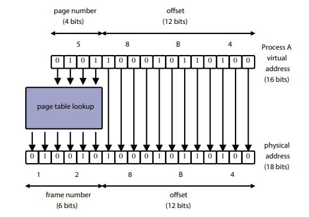
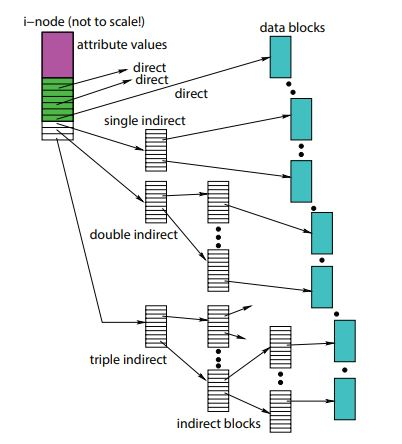

Page: https://student.cs.uwaterloo.ca/~cs350/S21/

Instructor: Lesley Istead

Time: T,Th 11:15am-12:40pm

- [Week 1. May 11](#week-1-may-11)
- [Week 2. May 18](#week-2-may-18)
- [Week 3. May 25](#week-3-may-25)
- [Week 4. June 1](#week-4-june-1)
- [Week 5. June 8](#week-5-june-8)
- [Week 6. June 15](#week-6-june-15)
- [Week 7. June 22](#week-7-june-22)
- [Week 8. June 29](#week-8-june-29)
- [Week 9. July 6](#week-9-july-6)
- [Week 10. July 13](#week-10-july-13)
- [Week 11. July 20](#week-11-july-20)
- [Week 12. July 27](#week-12-july-27)
- [Opt. Aug 3](#opt-aug-3)

# Week 1. May 11

normal = (.02 * A0 + .1 * A1 + .15 * A2 + .13 * A3) + .075 * R1 + .075 * R2 + .1Q + .35F

OS/161 essentials:
* [Install161](https://student.cs.uwaterloo.ca/~cs350/common/Install161.html)
* [Install161NonCS](https://student.cs.uwaterloo.ca/~cs350/common/Install161NonCS.html)
* [WorkingWith161](https://student.cs.uwaterloo.ca/~cs350/common/WorkingWith161.html)
* [gdb](https://student.cs.uwaterloo.ca/~cs350/common/gdb.html)
* [os161-man](https://student.cs.uwaterloo.ca/~cs350/common/os161-man/)
* [sys161-man](https://student.cs.uwaterloo.ca/~cs350/common/sys161manual/)

__defn.__ generally, an OS is a system that
* manages resources
* creates execution environments
* load programs
* provides common services and utilities

three views of an OS:
* application view: what services does it provide?
  * provides resources
  * provides interfaces which provide simplified, abstract view of hardware to apps
  * isolates running programs
* system view: what problems does it solve?
  * manages the hardware resources
  * allocates resources among running programs
  * control the sharing of resources
* implementation view
  * concurrency
  * real-time

__defn.__ the kernel is the part of the operating system that responds to system calls, interrupts and exceptions

__defn.__ monolithic kernel: includes device drives, file system, virtual memory, IPC, etc

__defn.__ microkernel: only absolutely necessary components are a part of the kernel. all other elements are user programs (QNX)

__defn.__ real-time OS: an OS with stringent event response times, guarantees, and preemptive scheduling (QNX)

## threads and concurrency
* sequence of instruction
* a normal sequential program consists of a single thread of execution
* threads provide a way to express concurrency
* in threaded application there are multiple threads of execution occurring at the same time
  * threads may perform the same task
  * threads may perform different tasks

reasons to use threads:
* resource utilization: eg. blocked/waiting threads give up CPU, etc.
* parallelism
* responsiveness: eg. dedicated threads to UI
* priority: higher priority more CPU time
* modularization

### OS/161 thread interface
```c
// kern/include/thread.h
// creation
int thread_fork(const char *name, struct proc *proc, void (*func)(void *, unsigned long), void *data1, unsigned long data2);
// termination
void thread_exit(void);
// yielding
void thread_yield(void);
```

other thread libraries:
* pthread
* OpenMP
* GPGPU programming eg. CUDA

### review: MIPS registers
|num|name|use||num|name|use|
|:-:|:-:|:-:|:-:|:-:|:-:|:-:|
|0|z0|always zero||24,25|t8,t9|temps (caller-save)|
|1|at|assembler reserved||26,27|k0,k1|kernel temps|
|2|v0|return val/syscall #||28|gp|global ptr|
|3|v1|return val||29|sp|stack ptr|
|4-7|a0-a3|subroutine args||30|s8/fp|frame ptr (callee-save)|
|8-15|t0-t7|temps (caller-save)||31|ra|return addr (`jal`)|
|16-23|s0-s7|saved (callee-save)||
* convention enforced in compiler; used in OS
* _caller-save_: calling function to save/restore values in these registers
* _callee-save_: called function to ...

### concurrent program execution (two threads)
```
                   +--------------------+
   +---------------+ thread 2 CPU       |
   |   PC          | Registers          +-----+
   |               +--------------------+     |
   |                                          |SP
+--|------------------------------------------|----------------+
|--v---++-------+                       +-----v---++---------+ |
||code ||data   |    address space      |thd stack||thd stack| |
|--^---++-------+     (shared)          +---------++-----^---+ |
+--|-----------------------------------------------------|-----+
   |                                                  SP |
   |               +----------------------+              |
   |    PC         | thread 1 CPU         |              |
   +---------------+ Registers            +--------------+
                   +----------------------+
```

### implementing concurrent threads:
options
  * hardware support: P processors, C cores, M multithreading per core -> PCM threads simultaneously
  * timesharing
  * hardware support + timesharing

### timesharing
* when timesharing, the switch from one thread to another is called a _context switch_
  1. decide which thread will run next (scheduling)
  2. save register contents of current thread
  3. load register contents of next thread
* _thread context_ must be saved/restored carefully since thread execution continuously changes the context


# Week 2. May 18
## context switch
context switch in MIPS
```c
/* kern/arch/mips/thread/switch.S */
switchframe_switch:
   /*
    * a0 contains the address of the switchframe pointer in the old thread.
    * a1 contains the address of the switchframe pointer in the new thread.
    */

   /* Allocate stack space for saving 10 registers. 10*4 = 40 */
   addi sp, sp, -40

   /* Save the registers */
   sw   ra, 36(sp)
   sw   gp, 32(sp)
   sw   s8, 28(sp)
   sw   s6, 24(sp)
   sw   s5, 20(sp)
   sw   s4, 16(sp)
   sw   s3, 12(sp)
   sw   s2, 8(sp)
   sw   s1, 4(sp)
   sw   s0, 0(sp)

   /* Store the old stack pointer in the old thread */
   sw   sp, 0(a0)

   /* Get the new stack pointer from the new thread */
   lw   sp, 0(a1)
   nop           /* _delay slot_ for load (because load is slow in pipeline) */

   /* Now, restore the registers */
   lw   s0, 0(sp)
   lw   s1, 4(sp)
   lw   s2, 8(sp)
   lw   s3, 12(sp)
   lw   s4, 16(sp)
   lw   s5, 20(sp)
   lw   s6, 24(sp)
   lw   s8, 28(sp)
   lw   gp, 32(sp)
   lw   ra, 36(sp)
   nop                  /* delay slot for load (not needed?) */

   /* and return. */
   j ra                 /* jump to new thread */
   addi sp, sp, 40      /* in delay slot */
   .end switchframe_switch
```
the caller of `switchframe_switch()` has to save t registers (kern/thread/thread.c:`thread_switch`).

### reasons of context switch:
* `thread_yield()`
* `thread_exit()`
* running thread blocks via a call to `wchan_sleep()`
* running is preempted (involuntarily stops running)

### thread states
ready, running, blocked
```
+----------------+          preemption or thread_yield()         +------------------+
|  ready         |  <------------------------------------------  |   running        |
|                |                                               |                  |
+----------------+  ------------------------------------------>  +------------------+
                                   dispatch
        ^                                                                 |
        |                                                                 |
        | resource avail                                        resource  |
        | or                                                    not avail |
        | wake_all/one()                                        or        |
        |                                                       sleep()   |
        |                      +--------------------+                     |
        +--------------------  |   blocked          |  <------------------+
                               |                    |
                               +--------------------+
                                    wait channels
```

### voluntarily context switch
* programs calls `thread_yield()`
  * which calls `thread_switch()`
    * which chooses a new thread and calls `switchframe_switch()`.

### timesharing and preemption
* timesharing - the _scheduling quantum_ is an upper bound on how long a thread can run before it must yield the CPU
* how to stop a running thread that never yields/blocks/exits when the quantum expires?
  * _preemption_ forces a running thread to stop
  * to implement it, the thread library must have a means of "getting control" (causing thread lib code to run) even if the running thread has not called thread lib function
  * it is normally accomplished using _interrupts_.

### interrupt
* an _interrupt_ is an event that occurs during the execution of a program
* caused by hardware eg timer, disks controller, a network interface
* then hardware automatically transfers control to a fixed location in memory
  * thread lib places a procedure called an _interrupt handler_ at that mem loc
  * which create a _trap frame_ to record thread context at the time of interrupt
    * has to backup all registers (before interrupt)
  * determines which device caused in the interrupt and performs device-specific processing
  * restores the saved thread context from the trap frame and resumes execution of the thread

a preemptive scheduler uses the scheduling quantum to impose a time limit on running threads
* periodic timer interrupts can track thread run time
* if thread has run too long, timer interrupt handler preempts the thread by `thread_yield()`
  * similar to voluntary...
  * preempted thread changes state from running to ready and is placed on the _ready queue_
  * each time a thread goes from ready to running, runtime is 0 (not accumulating)
* otherwise thread may block or yield before their quantum expiry

os/161 threads use preemptive round-robin scheduling.

__eg.__ interruption
```
       thd 1 (interrupted)                     thd2 (take on)
+----------------------------+        |                            |   0x0
|     switchframe_switch()   |        |                            |
|----------------------------|        |                            |
|       thread_switch()      |        |                            |
|----------------------------|        |                            |
|       thread_yield()       |        |     switchframe_switch()   |
|----------------------------|        |----------------------------|
|  interrupt hdler frame(s)  |        |       thread_switch()      |
|----------------------------|        |----------------------------|   ^
|          trap frame        |        |       thread_yield()       |   |
|----------------------------|        |----------------------------|   |
|... program stack frame ... |        |... program stack frame ... |   |
```
questions:
* when interrupt happens, first save trap frame, then call yield to save callee-save registers. are we saving same thing twice? no, the first one is before interrupt and the second one is after.

__eg.__
```cpp
int main() { helper(NULL, 0); }

void helper(void *, unsigned long i) {
    if (i < 3) {
        kprintf("%ld", i);
        thread_fork("helper1", NULL, helper, NULL, i+1);
        thread_fork("helper2", NULL, helper, NULL, i+1);
    }
    if (i == 0)
        kprintf("%ld", i);
    thread_exit();
}
/*
 which following outputs are not possible?
 a) 01221220
 b) 01120222
 c) 01342560   x  flow stops when i==3
 d) 01222120   x  cannot have three 2's after one fork (at most 2)
 e) 01122220
 f) 01234560   x  flow stops when i==3
 g) 01212220
 h) 00112222
*/
```

__eg.__
```cpp
for i = i, N:
    busy(C ms)
    sleep(S ms)
```
there is one processor and two threads running the program. assume C < quantum and C < S. they run at t=0, at which time do they finish at first time? answer: N(C + S) + C
```
let C = xx, S = yyy

th0| xxyyy|xxyyy|xxyyy| ... |xxyyy
th1|   xxy|yyxxy|yyxxy| ... |  xxy|yy
```

what if C > S? answer: 2NC + S
```
let C = xxx, S = yy, extra waiting = _

th0| xxx|yy_|xxx|yy_|xxx|yy_| ... |xxx|yy_
th1|     xxx|yy_|xxx|yy_|xxx| ... |yy_|xxx|yy
```

# Week 3. May 25
## synchronization
* all threads share access to the program's global variables and the heap
* the part of concurrent program in which a shared object is accessed is a _crital session_
* _race condition_ is when the program result depends on the order of execution.
  * occur when multiple threads are reading and writing the same memory at the same time
  * can happen due to context switch or concurrent access by multiple cpus
  * constants and memory that all thread only read do not cause race conditions

### (spin) lock acquire and release
hardware-specific synchronization instructions:
* provide way to implement atomic _test-and-set_ for synchronization primitives like locks
* eg x86/x64 xchg: `xchg src,addri`
  ```
  xchg(value, addr) {
      old = *addr
      *addr = value
      return old
  }
  ```
* eg ARM exclusive load (LDREX) and exclusive store (STREX)
  * LDREX and STREX must be used together
  * LDREX loads a value from addr
  * STREX attempt to store a value to addr
  * STREX will fail to store value at addr if addr was touched between the LDREX and STREX calls (or even if they are located close together (< 128bits))
    * try again
* eg in MIPS, similar to ARM. but names are ll and sc.

```c
#if x86
    void Acquire(bool *lock) {
        while (Xchg(true, lock));
    }

#elif arm
    w ARMTestAndSet(w value, void *addr) {
        w tmp = LDREX addr;
        w result = STREX value, addr;
        if (result == SUCCEED)  // may fail, so return true to keep trying
            return tmp;  // successfully changed it, return it
        return truthy;
    }

    void Acquire(bool *lock) {
        while (ARMTestAndSet(true, lock));
    }

#endif

void Release(bool *lock) {
    *lock = false;
}

void my_program() {
    extern bool lk;
    Acquire(&lk);
    // critical session
    Release(&lk);
}
```

* when using spinlocks, threads actively use the cpu while they wait for the lock => lock is owned by the cpu.
  * disabled interruption (preemption)

### os/161
test and set in os/161
```c
/* return value 0 indicates lock was acquired */
spinlock_data_testandset(volatile spinlock_data_t *sd)
{
    spinlock_data_t x, y;
    y = 1;
    __asm volatile(
        /* assembly instructions x = %0, y = %1, sd = %2 */
        ".set push;"       /* save assembler mode */
        ".set mips32;"     /* allow MIPS32 instructions */
        ".set volatile;"   /* avoid unwanted optimization */
        "ll %0, 0(%2);"    /* x = *sd */
        "sc %1, 0(%2);"    /* *sd = y; y = success? */
        ".set pop"         /* restore assembler mode */
        : "=r" (x), "+r" (y) : "r" (sd)  /* outputs : inputs */
    );
    if (y == 0)
        return 1;
    return x;
}
```

assumption:
* only one write happens in memory at the same time. (true)

### os/161 locks
* spin locks spin, locks _lock_
  * a thread that calls `lock_acquire` blocks until the lock can be acquired
* spin locks are owned by cpus, locks are owned by calling threads

thread blocking
* when a thread blocks, it stops running
  * the scheduler chooses a new thread to run
  * a context switch from the blocking thread to the new thread occurs
  * the blocking thread is queued in a _wait queue (wait channels)_ (not on ready list)
    * one queue per lock (or other rsc)?
* eventually a blocked thread is signaled and awakened by another thread

in os/161, wait channels (queues) are used to implement thread blocking
* `void wchan_sleep(struct wchan *wc);`
  * blocks calling thread on wait channel; causes ctx switch, like `thread_yield`
* `void wchan_wakeall(struct wchan *wc);`
* `void wchan_wakeone(struct wchan *wc);`
* `void wchan_lock(struct wchan *wc);`

```cpp
typedef struct Lock {
    char *name; // dbg
    bool held;
    Thread *owner;
    wchan *wc;
    Spinlock *spin;
} Lock;

void lock_acquire(Lock *lk) {
    KASSERT(lk);
    KASSERT(!(lk->held && lk->owner == currthread));  // i dont own it
    spin_acquire(lk->spin);
    while (lk->held) {
        wchan_lock(lk->wc);
        spin_release(lk->spin);
        wchan_sleep(lk->wc);
        // after waking up
        spin_acquire(lk->spin);
    }
    lk->held = true;
    lk->owner = currthread;
    spin_release(lk->spin);
}

void lock_release(lock *lk) {
    KASSERT(lk);
    KASSERT(lk->held && lk->owner == currthread);
    spin_acquire(lk->spin);
    lk->held = false;
    lk->owner = NULL;
    wchan_wakeone(lk->wc);
    spin_release(lk->spin);
}
```
semaphore impl is almost identical..

### semaphores
* a _semaphore_ is a synchronization primitive that can be used to enforce mutual exclusion and
* it has an integer value which supports two operations
  * P: if the semaphore value is greater than 0, decrement the value; otherwise wait until the value is greater than 0 (then decrement it)
  * V: increment the value

types of semaphores:
* _binary semaphore_: with a single resource; behaves like a lock; but does not keep track of ownership
* _counting semaphore_:
* _barrier semaphore_: used to force one thread to wait for others to complete; initial count is typically 0
  * join: to join other 5 threads, create semaphore(-4), other threads increment it when finishing
  * to join another threads, create semaphore(0)

differences between lock and semaphore:
* V does not have to follow P
* semaphores do not have owners

# Week 4. June 1

```c
void P(Semaphore *sem) {
    KASSERT(sem);
    spin_acquire(sem->spin);
    while (sem->sem_count == 0) {
        wchan_lock(sem->wc);      // prevent sleeping on available resource
        spin_release(sem->spin);  //
        wchan_sleep(sem->wc);
        // after waking up
        spin_acquire(sem->spin);
    }
    --sem->sem_count;
    spin_release(sem->spin);
}

void V(Semaphore *sem) {
    KASSERT(sem);
    spin_acquire(sem->spin);
    ++sem->count;
    wchan_wakeone(sem->wc);
    spin_release(sem->spin);
}
```

__eg.__ producer/consumer synchronization with bounded buffer
* suppose we have threads that add items to buffer and threads that remove items
* want to ensure consumers do not consume if buffer is empty - they wait
* buffer has finite capacity N and want to ensure producers must wait if buffer is full

```c
Semaphore *items = sem_create("", 0);
Semaphore *spaces = sem_create("", N);

void Producer() {
    P(spaces);
    // add item to buffer (has to be atomic)
    V(items);
}

void Consumer() {
    P(items);
    // remove item from buffer (has to be atomic)
    V(spaces);
}
```

### condition variables
* each cv is intended to work together with a lock
  * cvs are only used from within the critical section that is protected by lock
* operations:
  * wait: causes calling thread to block and releases the lock. once the thread is unblocked it reacquires the lock
  * signal: if threads are blocked on the signaled condition variable, then one of those thread is unblocked
  * broadcast: signal all
* a thread is in critical section when it calls `wait`, and it will be in the critical section section when `wait` returns. however, in between the call and the return, while the caller is blocked, the caller is out of the critical section, and other threads may enter.

```c
void cv_wait(cv *cv, Lock *lk) {
    KASSERT(cv && lk);
    KASSERT(lk->held && lk->owner == currthread);
    wchan_lock(cv->wc);
    lock_release(lk);
    wchan_sleep(cv->wc);
    lock_acquire(lk);
}

void cv_signal(cv *cv, Lock *lk) {}
```

__eg.__ bounded buffer producer & consumer
```c
int volatile count = 0;
Lock *mutex;
cv *notfull, *notempty;

void Produce(item) {
    lock_acquire(mutex);
    while (count == N) {
        cv.wait(notfull, mutex);
    }
    // add item to buffer
    ++count;
    cv_signal(notempty, mutex);
    lock_release(mutex);
}

void Consume() {
    lock_acquire(mutex);
    while (count == 0) {
        cv.wait(notempty, mutex);
    }
    // remove item from buffer
    --count;
    cv_signal(notfull, mutex);
    lock_release(mutex);
    cb(item);
}
```

### volatile (os/161)
* race conditions can occur for reasons other than programmers control:
  * compiler; cpu
  * _memory models_ describe how thread access to memory in shared regions behave
    * tells compiler & cpu which optimizations can be performed
* `volatile` disables optimization that may
  * optimize variables from memory to registers
  * rearrange instructions
* modern cpus has memory model as it reorders loads and stores to improve performance
  * modern architecture provides barrier and fence instructions

### deadlocks

__eg.__
```c
void a() {
    acquire(A);
    acquire(B);
    // body
}

void b() {
    acquire(B);
    acquire(A);
    // body
}
```

techniques:
* no hold and wait: prevent a thread from requesting resources if it currently has resources allocated to it
  * if want to get n resources, either get all n or get none
* resource ordering: order the resource types, and require that each thread acquire resources in increasing resource type order. ie a thread may make no requests for resources of type <= to i if it is holding resources of type i.

__eg.__ no hold and wait
```c
int try_acquire(Lock *lk) {
    spin_acquire(lk->spin);
    if (lk->held) {
        spin_release(lk->spin);
        return error;
    }
    lk->held = true;
    lk->owner = currthread;
    return 0;
}

void a() {
    acquire(A);
    while (try_acquire(B) != 0) {
        release(A);
        acquire(A);
    }
    // body
}

void b() {
    acquire(B);
    while (try_acquire(A) != 0) {
        release(B);
        acquire(B);
    }
    // body
}
```

__eg.__ resource ordering
```c
void a() {
    acquire(A);
    acquire(B);
    // body
}

void b() {
    acquire(A);
    acquire(B);
    // body
}
```

__eg.__ have n queues, need to support an operation `transfer(i,j)` that moves an element from queue i to queue j unless i has to elements. how to use locks?
1. use one lock per queue and no holding wait: no deadlock. can can n/2 transfers (# unique pairs) at the same time
2. use one lock per queue and resource ordering:
   ```c
   transfer(q1, q2) {
       if (q1->num < q2->num) {
           acquire(q1);
           acquire(q2);
       } else {
           acquire(q2);
           acquire(q1);
       }
   }
   ```

# Week 5. June 8
## processes

* a _process_ is an environment where an application program runs.
  * includes virtualized resources: threads, virtual memory, fd
  * each process isolates it from other programs in other processes

os/161 process management calls:
* creation: `fork`, `execv`
  * after `fork`, both parent and child are executing copies of the same program
    * virtual mems of parent and child are identical at the same of fork, but may diverge afterwards
    * fork is called by parent, but returns in both parent and child
  * `execv` changes the program that the process is running
    * calling process's current vmem is destroyed
    * process gets new vmem initialized with the code and data of the new program
    * pid stays the same
* destruction: `exit`
  * kernel records exit status code in case another process asks for it
* synchronization: `waitpid`
  * only on child
* attribute mgmt: `getpid`

__eg.__ how many processes in total? 8
```c
int main() {
    fork();
    fork();
    fork();
}
```

### system calls
_system calls_ are the interface between processes and the kernel.

```
  +-------------------+
  |   application     |
  +-------------------+
  |system call library|
  +-------------------+    unprivileged code
============================================
  +-------------------+    privileged code
  |      kernel       |
  +-------------------+
```

* the cpu implements different levels (rings) of _execution privilege_ as security and isolation mechanism
* kernel code runs at highest privilege level
* application code runs at lower privilege since their user program should not be permitted to perform some tasks
* restriction allow the kernel to keep processes isolated frm one another - and from kernel

### exceptions
there are only two things that make kernel code run:
* interrupt
* _exceptions_
  * caused by instruction execution when needing attention
  * detected by the cpu during instruction execution
  * cpu handles exceptions like it handles interrupts
    * control is transferred to fixed location where an exception handler is located
    * the processor is switched to privileged execution mode
  * exception handler is part of the kernel

in mips, the same mechanism handles exceptions and interrupts.

```c
EX_IRQ  0  /* Interrupt */
EX_MOD  1  /* TLB Modify (write to read-only page) */
EX_TLBL 2  /* TLB miss on load */
EX_TLBS 3  /* TLB miss on store */
EX_ADEL 4  /* Address error on load */
EX_ADES 5  /* Address error on store */
EX_IBE  6  /* Bus error on instruction fetch */
EX_DBE  7  /* Bus error on data load *or* store */
EX_SYS  8  /* Syscall */
EX_BP   9  /* Breakpoint */
EX_RI   10 /* Reserved (illegal) instruction */
EX_CPU  11 /* Coprocessor unusable */
EX_OVF  12 /* Arithmetic overflow */
```

how does the kernel know which syscall the app is requesting?
* kernel defines a code for each syscall
* kernel expects the app to place a code in a specified location before executing the `syscall` instruction
  * os/161 on mips: code goes in register v0, arguments to a0-a3
  * success/fail code is in a3 on return; return value or error code is in v0 in return
* kernel's exception handler checks this code
* the codes and code location are part of the _kernel ABI_
* `kern/include/kern/syscall.h`

how do syscalls work
1. app calls library wrapper function for syscall
2. library function performs `syscall` instruction
3. kernel flips to privileged mode and exception handler runs
   1. create trap frame
   2. determines this is a syscall exception
   3. determine which syscall
   4. does the work for requested syscall
   5. restores the application program state from the trap frame
   6. returns from exception
4. library wrapper finishes and returns

### user and kernel stacks
every os/161 process thread has two stacks though it uses one at a time
* _user (application) stack_
  * located in the app's vmem
  * holds activation records for application functions
  * kernel creates this stack when it sets up the virtual address memory for the process
* _kernel stack_: when kernel switches to privileged mode after exception
  * holds activation records for kernel functions
  * also holds trap frames and switch frames
* `kern/arch/mips/locore/exception-mips1.S:common_exception` -> `trap.c:mips_trap` -> `kern/arch/mips/syscall/syscall.c:syscall`

### inter-process communication
* file, socker, pipe, shared memory
* message passing/queue: a queue/data strean provided by the os to send data between processes

# Week 6. June 15
## A2
* lock: increase # cpus to increase chance of race conditions
* cv: don't put spin locks in cv
  * `sys161 kernel-ASST0 'sy2; q'`
* cannot run tests (sy2) back to back until A3

## virtual memory
* physical memory:
  * if physical addresses are P bits, then max addressable physical memory is 2^P bytes
  * sys/161 uses 32 bit physical addresses
  * modern cpus use 48 bits (256 TB)
* kernel provides a separatee, private _virtual memory_ for each process holding code, data, stack
* if virtual addresses are V bits, the max size of a virtual memory is 2^V bytes
  * mips: V=32
* running applications see only virtual addresses
* why use virtual memory:
  * each process is isolated in its vmem and cannot access other processes
  * potential to support virtual vmem larger than physical mem
  * total size of all vmems can be larger than physical memory

os/161:
```
                         grow
|code|data                 <- |stack|
```

### address translation

* each virtual mem is mapped to different parts of physical memory
* address translation is performed in hardware, on the _memory management unit (MMU)_ using info provided by the kernel

dynamic relocation
```
   process A vmem                        process B vmem
+------+- - - - - - +                 +----------+- - - - +
| 28KB |            |                 |   48KB   |        |
+------+- - - - - - +                 +----------+- - - - +
0x0    0x6fff                         0x0        0x8fff

          physical mem

       B offset   B limit
       v          v
+------+----------+--------+------+-------------+
|      |  proc B  |        |proc A|             |
+------+----------+--------+------+-------------+
0x0                        ^      ^
                           A off. A limit
```
* offset (relocation, R) is the position in the physical mem where process memory begins.
* limit L is the amount of memory used by the process.
* given virtual address v,
  * if v < L then physical address = v + R,
  * else exception

problem:
* dynamic relocation suffer from _internal fragmentation_.
* stack grows from opposite direction, do we need a big contiguous chunk of memory where nothing is in the middle?
  ```
  +----+-----------------------------------------+-----------+
  |code|  data  data                     <- stack|           |
  +----+-----------------------------------------+-----------+
  0x0                                            0x7fffffff (hi end)
  ```

### segmentation
* instead of mapping entire vmem to physical, can map each _segment_
* kernel maintains offset and limit for each segment
* a virtual address have two parts: (segment ID, offset within segment)
* with K bits for segment id, we can have up to
  * 2^K segments
  * 2^(V-K) bytes per segment

translation:
* approach 1: mmu has _relocation register_ and _limit register_ for each segment
  * steps:
    1. split v into segment number (s) and address within segment (a)
    2. if a < $L_s$ return a + $R_i$
    3. else exception
  * for dynamic relocation, kernel maintains a separate set of relocation offsets and limits for each process, and changes values in mmu's registers when switching processes
* approach 2: maintains segment table
  * instead of using registers to store R and L, use memory to store them for lookup
  * a bit slower

__eg.__
```
proc A
---------------------------------------------------------
segment        limit register         relocation register
0              0x2000                 0x38000
1              0x5000                 0x10000
---------------------------------------------------------

translation for A:
---------------------------------------------------------
addr          segment        offset       physical addr         remark
0x1240        0              0x1240       0x39240               addr = 0|001 0010 0100 0000
0xA0A0        1              0x20AD       0x120AD               addr = 1|010 0000 1010 0000
---------------------------------------------------------
```

# Week 7. June 22

### paging
* physical memory is divided into fixed-size chunks called _physical pages_ or _frames_.
  * normally 4KB
* virtual mem's pages map to different frames using a _page table_
* each _page table entry (PTE)_ indexed by _page numbers_
* a valid bit is used to indicate if the PTE is used (since not all pages of virtual mem are used).
```
process A vmem
+-+-+---+
|o|o|   |
+-+-+---+


proc A page table
-----------------
page frame valid?
0x0  0x0f  1
0x1  0x26  1
0x3  0x00  0
0x4  0x00  0
-----------------
```

* mmu includes a _page table base register_ pointing to the table table of current process
* translation:
  1. determine the page number and offset of the virtual address
     * page number: virtual address / page size
     * offset = virtual address % page size
  2. look up page table. if valid=0, throw exception
  3. physical address = (frame number * frame size) + offset

formulas (note there is only one page table!):
* \# PTEs = max virtual memory size / page size (not addr space)
* \# bits for offset = log(page size)
* \# bits for page number = log(\# PTEs)



other info found in PTEs:
* _write protection bit_: mmu raise exception when it translates virtual address for read-only mem
* _bits to track page usage_:
  * reference bit: has the process used this page recently?
  * dirty bit: have contents of this page been changed?
  * set by mmu, read by kernel

__eg.__ if V=32bits, then the maximum virtual mem size is 4GB. assuming page size is 4KB, and PTE size is 4 bytes, then page table is 4GB/4KB*4~4MB. if V=48bits, then page table size is 256GB!

__eg.__ consider 32-bit virtual and physical addresses and a page size of 2^12 bytes (4KB). suppose process P is running using only 128KB of vmem. the first 5 entries in its page table is as follows:
```
page    frame      v
--------------------
0x0     0x00234    1
0x1     0x00235    1
0x2     0x0023f    1
0x3     0x00ace    1
0x4     0x00004    1
```
1. what is total number of entries in P's page table? 2^32 / 2^12 = 2^20 PTEs => 20 bits for page num
2. how many valid entries? 128KB / 4KB = 32 entries
3. translate following virtual addresses:
   * 0x00001a60 => 0x00235 a60 (note first 20 bits for page num)
   * 0x00000fb5 => 0x00234 fb5
   * 0x00004664 => 0x00004 664
4. if page size were 16KB. how many entries in P page table? 2^32 / 2^14 = 2^18 => 18 bits for page num
   * how many bits for offset? log(2^14) = 14

why do we keep all pages in page table instead of only valid ones? because entries are not contiguous.

### multi-level paging
* instead of having a single page table to map an entire virtual memory, we organize it and split the page table into multiple _levels_
  * multiple smaller tables, each fitting onto a __single page__. parent tables store pointers to child tables
  * if a table contains no valid PTEs, do not create that table
* virtual address now contains multiple page numbers for each page level
  * use them to traverse the tree of page tables. raise exception if invalid bit is encountered

in practice, multi-level paging is smaller than single page.

formulas:
* \# PTEs for a page = page size / PTE size
* \# of bits for page number = log(\# PTEs for a page)
* \# bits for offset = log(page size)
* \# levels = ceil((V - \# bits for offset) / \# bits for page number)

__eg.__ V=32, PTE size = 2^2, page size = 2^12. levels = ceil((32 - log(2^12)) / log(2^12 / 2^2)) = ceil((32 - 12) / 10) = 2. if V=48, then 4 levels.

__eg.__ consider virtual addresses and physical addresses are 64 bits. page size is 1MB (2^20 bytes). the size of page table entry is 16 (2^4) bytes.
1. how many bits for virtual address page offset? log(2^20) = 20
2. what is maximum number of entries in an individual page table? 2^20 / 2^4 = 2^16
3. how many levels?
   * bits for page number: log(2^16) = 16
   * levels = ceil((64 - 20) / 16) = 3
4. a process uses 128MB (2^27) of vmem, with a virtual address range from 0 to 2^27-1. how many individual page tables at each level required to translate the process' address space? 1 1 1

### TLB
* address translation via page table adds a minimum of one extra memory operation -> slow
* use _translation lookaside buffer_ in mmu
* _hardware-managed_: mmu handles tlb misses
* when mmu translate virtual address, find it in tlb, else _(tlb miss)_ find it in memory and add it to tlb
* if mmu cannot distinguish TLB entries from different address spaces, then kernel must clear or invalidate the TLB on each context switch
  * os161: `as_activate()` clears TLB

software-managed TLBs:
* mips has _software-managed TLB_
* when translate virtual address, find it in tlb, else raise exception and kernel must
  * determine frame number for p
  * add it to TLB, evicting another entry if necessary
* retries the instruction after tlb miss is handled

mips R300 tlb:
```
<--          hi 32 bits      --><--      low 32 bits    -->
+-------------------+-----+----+--------------+---+-------+
|        20         |  6  |    |      20      |   |       |
+-------------------+-----+----+--------------+---+-------+
       page #         PID           frame #   valid/perm...
                  (not used)
```
why PID is not used: because we clear cache after every context switch anyways.  
benefit of PID: cache affinity, security...

conslusion:
* paging does not introduce external fragmentation
* multi-level paging reduces amt of memory required to store mappings
* TLB misses are increasingly expensive with deeper page tables -> one miss for each page table

### os/161 (`dumbvm`)
* uses segmentation (code, data, stack segments) - that contains contiguous 'pages'
* 32 bit paged virtual and physical address
* software-managed TLB
  * `vm_fault` for TLB exception handling

```
                            npages2
                          <--------->
                       vbase2
-------------------------v
+- - -+----------+- - - -+----------+- - - - - - - - - - - - - - - - +-----+
|     |   code   |       |   data   |        virtual memory          |stack|
+- - -+----------+- - - -+----------+- - - - - - - - - - - - - - - - +-----+
------^
    vbase1
      <---------->
         npages1

  stackbase
-----v
+----+-----+------------+----------+---+--------+--------------------------+
|    |stack|            |   data   |   |  code  |     physical memory      |
+----+-----+------------+----------+---+--------+--------------------------+
------------------------^--------------^
                     pbase2          pbase1
```

```c
struct addrspace {
    vaddr_t as_vbase1;     /* base virtual address of code segment */
    paddr_t as_pbase1;     /* base physical address of code segment */
    size_t as_npages1;     /* size (in pages) of code segment */
    vaddr_t as_vbase2;     /* base virtual address of data segment */
    paddr_t as_pbase2;     /* base physical address of data segment */
    size_t as_npages2;     /* size (in pages) of data segment */
    paddr_t as_stackpbase; /* base physical address of stack */
};

...

// USERSTACK = 0x8000 0000, DUMBVM STACKPAGES = 12, PAGE SIZE = 4KB.
auto vbase1 = as->as_vbase1;
auto vtop1 = vbase1 + as->as_npages1 * PAGE_SIZE;
auto vbase2 = as->as_vbase2;
auto vtop2 = vbase2 + as->as_npages2 * PAGE_SIZE;
const auto stackbase = USERSTACK - DUMBVM_STACKPAGES * PAGE_SIZE;
const auto stacktop = USERSTACK;

if (faultaddress >= vbase1 && faultaddress < vtop1)  // code
    paddr = (faultaddress - vbase1) + as->as_pbase1;
else if (faultaddress >= vbase2 && faultaddress < vtop2)  // data
    paddr = (faultaddress - vbase2) + as->as_pbase2;
else if (faultaddress >= stackbase && faultaddress < stacktop)  // stack
    paddr = (faultaddress - stackbase) + as->as_stackpbase;
else
    return EFAULT;
```

os/161 uses ELF binary files:
* pre-loads address space before program runs (`execv`)
* header contains address space segment descriptions
    * virtual address of the start of the segment
    * length of segment in virtual address space
    * location of the segment in the ELF
    * length of segment in the ELF
* contains virtual address for entry point
* `dumbvm` assumes ELF contains two segments: _text_ and _data_, but no stack. stack is created by `dumbvm` for each process.
* `kern/syscall/loadelf.c`

# Week 8. June 29
### virtual memory for kernel

challenges if kernel lives in virtual memory:
* bootstrapping: kernel helps to implement virtual mem, how can kernel run in virtual mem when it is just starting?
  * architecture-specific
* sharing: data need to be copied between kernel and application - how to do it if they are in different virtual address spaces
  * solved by making kernel virtual mem overlap with process' virtual mem
  * lower 50% user addr - higher 50% kernel addr split

```
        user               |        kernel
+-------------------+------+-----+-----+----------+
|                   |stack |kseg0|kseg1|  kseg2   |
+-------------------+------+-----+-----+----------+
0x0                        |0x8000 0000           0xffff ffff
```

os/161:
* only supports 1GB of physical memory - remaining 3GB unused
* kernel mem is divided into 3 segments
  * kseg0 - 512MB: kernel data stractures, stacks, etc
  * kseg1 - 512MB: addressing devices
  * kseg2 - 1GB: unused (mips)
* physical memory is divided into frames. frame use is managed by kernel in _coremap_

address translation is os/161:
* dynamic relocation is used. TLB is not used when cpus is in privileged mode
* to translate kseg0: virtual addr - 0x8000 0000 = physical addr
* to translate kseg1: virtual addr - 0xa000 0000 = physical addr
* raise exception for kseg2
* both kseg0 and kseg1 map to __first 512 MB__ is physical memory. ksegs will not use all of the allowed kseg memory - they overlap with user program

### using secondary storage
* goal:
  * allow larger virtual address space than physical
  * allow greater multiprogramming by using less primary memory for each process
* solution:
  * allow pages from virtual mem to be stoed in secondary storage
  * swap pages (segments) between secondary storage and primary memory
* set of virtual pages present in physical memory is called _resident set_ of a process
* each PTE needs a _present bit_ to tell whether page is in memory

reducing page faults:
* accessing secondary storage can be orders of magnitude slower
* limit number of processes so that there is enough physical memory per process
* hide latencies - predict and use prefetching
* try to be smart about which pages are kept in physical mem, and which evicted - use FIFO?
* _MIN_: replace page that will not be referenced for longest time
  * can't use - requires knowledge of the future
* _LRU_:
  * _temporal locality_: programs are more likely to access pages that they have accessed recently
  * _spatial locality_: programs are likely to access parts of memory that are close to parts they have accessed recently
  * can't use - kernel don't keep records after translation unless exception

measuring usage:
* add a _use bit_ to each PTE
  * set by the mmu each time a page is used ie translation happens
  * can be read and cleared by kernel
* _clock algorithm_: a victim pointer cycles through page frames. pointer moves whenever a replacement is necessary
   ```cs
   while use bit of victim is set:
       clear use bit of victim
       victim = (victim + 1) % num_frames
   choose this vitcim for replacement  // do not set bit; mmu will set it
   victim = (victim + 1) % num_frames
   ```


# Week 9. July 6
## scheduling
### simple scheduling model
simple scheduling model:
* given a set of _jobs_ to schedule, only one of job run at a time
* for each job, we are given
  * $a_i$: job arrival time
  * $r_i$: job run time
* for each job, we define
  * _response time_: between job's arrival and when job starts to run
  * _turnaround time_: between job's arrival and when jobs finishes
  * we want ot minimize of of them

__first come, first served__:
* jobs run in order of arrival (queue)
* simple, avoids starvation
```
   A     B       C       D
+-----+----+-----------+----+

order of arrival: A(a=0,r=6) B(a=0,r=5) C(a=0,r=12) D(a=10,r=5)
```

__round robin__:
* used in os/161
* jobs are queued by order of arrival, but have allowed running time. when preempted, it is placed at the back of the line
* no starvation

```
   A    B   C   A   D    C  C
+----+----+----+-+----+----+-+

max time: 5
order of arrival: A(a=0,r=6) B(a=0,r=5) C(a=0,r=12) D(a=10,r=5)
```

__shortest job first__:
* run jobs in increasing order of runtime
* mimimizes average turnaround time
* starvation is possible
  * those longer jobs are never run

```
   B     A    D       C
+----+-----+----+----------+

order of arrival: A(a=0,r=6) B(a=0,r=5) C(a=0,r=12) D(a=10,r=5)
```

__shortest remaing time first__:
* preemptive variant of SJF; arriving jobs preempt running job
* select one with shortest remaining time
* starvation is still possible

```
   B    A  A   D       C
+----+----+-+----+----------+

order of arrival: A(a=0,r=6) B(a=0,r=5) C(a=0,r=12) D(a=10,r=5)
```

### cpu scheduling
* in cpu scheduling, jobs to be scheduled are the threads
* cpu scheduling typically differs from simple scheduling model:
  * run times of threads are normally not known
  * threads are sometimes not runnable: when they are blocked
  * threads may have different priorities
* the objective of scheduler is normally to achieve balance between responsiveness, fairness, efficiency

_multi-level feedback queues_:
* most commonly used
* objective: good responsiveness for interactive threads, non-interactive threads make as much progress as possible
  * interactive threads are frequently blocked, waiting for user input etc
* approach: give higher priority to interactive threads so they run whenever they are ready
* problem: how to determine which threads are interactive?

algo:
1. n round-robin ready queues where priority of $Q_i>Q_j$ if i>j
2. threads in $Q_i$ use quantum $q_i$ and $q_i\leq q_j$ if i>j
3. scheduler selects a thread from highest priority queue to run
   1. threads in $Q_{n-1}$ are only selected when $Q_n$ is empty
4. if a thread from $Q_n$ is preempted, it is pushed to $Q_{n-1}$
5. when a thread wakes after blocking, it is put onto the highest-priority queue
6. to prevent starvation, all threads are periodically placed in the highest-priority queue
   * some variants allow preempting low-priority threads when a thread wakes to ensure fast response
7. since interactive threads tend to block frequently, they will 'live' in higher-priority queues while non-interactive threads sit down to the bottom

```
  +---------+  wake
  |         v
  |     +---------+
  +<--- |  Qn,qn  |  highest priority, lowest quantum
  |     +---------+
  |         | preemption
  |         v
  |     +---------+
  +<--- |Qn-1,qn-1|
  |     +---------+
  |         | preemption
  |         v
  |     +---------+
  +<--- |  Q1,q1  |  lowest priority, highest quantum
        +---------+
```

_linux completely fair scheduler_:
* each thread assigned a _weight_
* goal: ensure each thread gets a share of the processor in proportion to its weight
* basic ops:
  * track _'virtual' runtime_ of each runnable thread
  * always run thread with lowest virtual runtime
* virtual runtime is actual runtime adjusted by the thread weights
  * formula: actual runtime times $\frac{\sum_{\text{all }j} w_j}{w_i}$, where $w_i$ is weight for ith thread
  * virtual runtime advances slowly for threads with higher weights, quickly for threads with low weights
* same quantum for all threads and priority
* how to deal with new thread with 0 actual runtime? assign some value to it initially between lowest actual runtime and highest.

### scheduling on multi-core processors
shared ready queue: contention

per core ready queue: scalable, cache affinity. downside: load-balancing

## device and IO
* a _device_ is how a computer receives input and produces output
  * sys/161 example:
    * timer/clock (most important): current time, timer, beep
    * disk drive
    * serial console: character input/output
    * text screen: character-oriented graphics
    * network interface
* a _bus_ is a communication pathway between devices
  * _internal bus (main bus)_: memory bus or front side bus is for communication between cpu and ram. it is fast and close to cpus
  * _peripheral bus (expansion bus)_: allows devices in the computer to communicate
* a _bridge_ connects two different buses
* communication with devices carried out through _device registers_
  * _status register_: tells about the device's current state. typically read
  * _command register_: issue command to device by writing to it
  * _data register_: used to transfer larger blocks of data to/from the device
  * some device registers are combination of primary types

sys/161 clock:
|offset|size|type|desc|
|:-:|:-:|:-:|:-:|
|0|4|status|current time (s)|
|4|4|status|current time (ms)|
|8|4|command|restart-on-expiry|
|12|4|status and command|interrupt (reading clears)|
|16|4|status and command|countdown time (ms)|
|20|4|command|speaker (beeping)|

clock is used to implement preemption.

os/161 serial console:
|offset|size|type|desc|
|:-:|:-:|:-:|:-:|
|0|4|command and data|character buffer|
|4|4|status|writeIRQ (complete status)|
|8|4|status|readIRQ|

if a write is in progress, the device exhibits undefined behaviour if another write happens. (mutex needed for writing)

### device drivers
* a _device driver_ is part of kernel that interacts with a device
* though majority of device drivers are (dynamically loadable) part of the kernel, some exist in user-space (eg printer)

__eg.__ write character to tty
```cs
P(output device write semaphore)
write character to device data register
do:
    read writeIRQ register  // polling
while status is not 'completed'
V(output device write semaphore)
```
why use semaphore? we may be in different threads (?)

```cs
// use interrupts to avoid polling
// device driver write handler
P(output device write semaphore)
write character to device data register

// interrupt handler for serial device
write write IRQ register to ack completion
P(output device write semaphore)
```

accessing devices:
* how to access device registers?
  * option 1: _port-mapped IO_ with special IO instructions
    * device registers are assigned 'port' numbers with correspond to regions of memory in a smaller address space
    * special IO instructions eg `in` and `out` on x86 are used to transfer data between specified port and cpu register
    * pro: fast - less read/write
    * cons: very restricted (eg arithmetics done outside port), very small number of devices
  * option 2 _memory-mapped IO_
    * each device register has physical memory address
    * device drivers read/write device registers using normal load and store instructions
    * cons: slow - all devices connected to main bus, lots of decoding
  * modern: use both

mips/os161: each device is assigned to one of 32 64KB device slots. a device's registers and data buffers are mem-mapped into its assigned slot.

larger data transfer:
* _program-controlled IO_: device driver moves data between memory and buffer on the device
  * cpu is busy while data is being transferred
  * sys/161
* _direct memory access_: device itself is responsible for moving data to/from memory.
  * cpu is not busy
  * modern

# Week 10. July 13

### persistent (non-volatile) storage
_persistent_ storage is any device where data persists even when device is without power.
* punched cards of metal or paper (1700s-1970s)
* magnetic tapes (1920s): small, cheap, actively used today. cons: has life span
* floppy (1970s-2000s) and hard disks (1950s)
* CD (1980s), DVD (1990s), Blu-ray (2000s)
* SSD (1970s, 1990s)
* resistive RAM (2000s)

### hard disks

```
              spindle
                 |
r/w       ===============   platter (glass or porcelain, ferromagnetic-coated)
head ---------+  |
          ===============   platter
          ===============   platter
                 |

tracks (concentric circles)
```

* disk is an array of numbered blocks (sectors) of same size (eg 512B)
* blocks are unit of transfer between disk and memory
  * typically, one or more contiguous blocks can be transferred in single operation

cost model for disk io:
* _seek time_: move r/w heads to appropriate track
  * depends on _seek distance_: distance in tracks between previous and current request
  * value: 0 ms to cost of max seek distance
  * dominates
* _rotational latency_: wait until desired sector spin to the r/w head
  * depends on rotational speed of disk
  * disk is always spinning
  * value: 0 ms to cost of single rotation
* _transfer time_: wait while desired sector spin past r/w heads
  * depends on rotational speed of disk and amount of data accessed

__eg.__ a disk has total capacity of 2^32 bytes. disk has single platter with 2^20 tracks. each track has 2^8 sectors. disk operates at 10000RPM and has max seek time of 20ms.
* BytesPerTrack = DiskCapacity / NumTracks
  * 2^32 / 2^20 = 2^12
* BytesPerSector = BytesPerTrack / NumSectorsPerTrack
  * 2^12 / 2^8 = 2^4
* MaxRotationalLatency = 60/RPM
  * 60/10000 = 0.006s = 6ms
* AvgSeekTime = MaxSeekTime / 2
  * 20/2 = 10ms (dominating)
* AvgRotationalLatency = MaxRotationalLatency / 2
  * 6/2 = 3ms
* cost to transfer 1 sector: SectorLatency = MaxRotationalLatency / NumSectorsPerTrack
  * 6 / 2^8 = 0.0195ms
* expected cost to read 10 consecutive sectors: Seek + RotationalLatency + TransferTime
  * we do not know positions, so use avg. 10 + 3 + 10(0.0195) = 13.195ms

performance implications:
* larger transfers are more efficient than smaller ones
* sequential io is faster than non-sequential io
* seek time dominates
* we can group requests to try and reduce avg request time

### disk head scheduling
* goal: reduce seek times by controlling order of requests
* may be performed by the device, operating system, or both
* _first-come, first-served_ is fair and simple, but offers no optimization for seek times
* _shortest seek time first_: choose closest request to last one.
  * seek time reduced, but requests may starve

_elevator algorithms (SCAN)_:
* disk head moves in one direction until there are no more requests in front of it, then reverses direction
* many variations
* reduces seek times while avoiding starvation

sys/161 disk controller:

|offset|size|type|desc|
|:-:|:-:|:-:|:-:|
|0|4|status|# of sectors|
|4|4|status and command|status|
|8|4|command|sector number|
|12|4|status|RPM|
|32768|512|data|transfer buffer|

writing:
```cs
// only one disk request at a time
// device driver write handler:
P(disk semaphore)
copy data from mem to device transfer buffer
write 'write' command to disk status register
// wait for request to complete
P(disk completion semaphore)
V(disk semaphore)

// interrupt handler
write disk status register to ack completion
V(disk completion semaphore)
```

reading:
```cs
// only one disk request at a time
// device driver read handler:
P(disk semaphore)
write target sector number to disk sector number register
write 'wread' command to disk status register
// wait for request to complete
P(disk completion semaphore)
copy data from device transfer buffer to mem
V(disk semaphore)

// interrupt handler
write disk status register to ack completion
V(disk completion semaphore)
```

thread initiating r/w must wait until r/w is completed.

### SSD
* no mechanical parts; use integrated circuits
* variety of implementations:
  * DRAM: requires constant power to keep values
  * flash memory: traps electrons in quantum cage
* logically devided into blocks and pages: 2/4/8KB pages, 32KB-4MB blocks
* r/w at page level
  * pages are initialized to 1s; can transition 1->0 at page level
  * high voltage requires to switch 0->1 (overwriting/deleting)
  * overwriting/deleting data must be done at block level
    * naive: read whole block to mem, reinitialize block then write back
    * SSD controller handles requests (faster):
      * mark page to be deleted/overwritten as invalid
      * write to an unused page
      * update translation table
      * requires garbage collection
* SSD controller does _wear leveling_, distributing writes evenly across blocks
* defragmentation is harmful to lifespan of SSD, and servers no performance advantage

### persistent ram
* values are persistent in the absence of power
* used to cache part of file in hard disk

## A3
* currently kmalloc() only advances pointer and kfree() does nothing
* make sys_exit generic to handle signals (diff exit code)
* _core-map_: keeps track which mem is used or free
  * do not malloc at the point of writing core-map. compute addr and write to it
  * all mem accesses after this point use core-map instead of ram_stealmem (global flag to determine whether coremap is created)

# Week 11. July 20

## file system
* _files_: persistent, named data objects
  * data consists of sequence of numbered bytes
  * may change over time
  * has associated meta-data
* _file system_: data structures and algorithms to store, retrieve and access files
  * _logical file system_: high-level api (what user sees)
  * _virtual file system_: abstraction of lower level file systems, persent multiple different underlying file systems to user as on
  * _physical file system_: how files are actually stored on physical media (exFAT, NTFS, ...)

basic file interfaces:
* `open`: returns _file descriptor (identifier / handle)_
* `close`: invalidates a valid fd
  * kernal tracks while file descriptor are currently valid for each process
* `read`: copies data from file to virtual address space
* `write`: copies data from virtual address space to file (cached)
* `seek`: enables non-sequential rw (does not modify the file)
* get/set file metadata eg `fstat, chmod, ls`

### directory and file names
* a directory maps file names (strings) to _i-numbers_ (unique identifier for a file or directory)
* directories provide way for applications to group related files
* fs' directories can be viewed as 'tree' with single _root_ directory
  * directories can be either internal node or leaves
  * files must be leaves
  * both directories and files have i-number
* files may be identified by _pathnames_ describing path through the directory tree from root to file
* directories also have pathnames
* only kernel is permitted to edit directories

```
/root  -->  2
 +- bin/ -->  312
 |   +- prog1  -->  654
 |   +- prog2  -->  100
 |   +- misc/  -->  145
 |       +- test  -->  5
 +- foo/ -->  24
     +- uu  -->  654
     +- docs/  -->  93
```

links:
* a _hard link_ is an association betwwen name and i-number
  * each entry in directory is hard link
* once file is created, additional hard links can be made to it
* linking to existing file creates new pathname for that file
  * each file has unique i-number but multiple hard links
* when last hard link to a file is removed, file is also removed
  * the file has no pathname and can no longer to opened
* not possible to hard link to directory (to avoid cycles - causing infinite number of pathnames)

### multiple file systems
* it is common to have multiple file systems in system
* some kind of global file namespace is required
* windows: two-part filenames: file system name (C:\\), pathname within file system
* unix: create single hierarchial namespace that combines namespaces of two systems (`mount`)
  * internally they are still two fs so we do not mix i-numbers

### VSFS
persistent data: file data, metadata, diretories and links, fs metadata

non-persistent: per process open file fd table (file handle, file position); system wide (open file table, _cached_ copies of persistent data)

example:
* 256 KB
* most disks have sector size of 512 bytes
  * memory is usually byte addressable
  * disk is usually sector addressable
* group every 8 consecutive sectors into a block (4 KB)
  * better spatial locality (fewer seeks)
  * reduce number of block pointers
  * 4KB block is convenient for demand paging
  * 64 total blocks on this disk

```
              inodes                  data
+--+-----+--------------+   +-----------------------+
|su|i |d |I |I |I |I |I |   |D |D |D |D |D |D |D |D |      ...
+--+-----+--------------+   +-----------------------+
0                       7   8                       15
```
* most blocks should store data
* create array of i-nodes, where each i-node contains metadata for a file
  * index into the array is file's index number (i-number)
* assuming each i-node is 256 bytes and we dedicate 5 blocks for i-nodes
  * allows for 80 total i-nodes/files

to know which i-nodes and blocks are free:
* we need to know a free i-node when creating new file; free block when writing a file
  * file size may be different from its size on disk - because we do not share data blocks across file
* in VSFS, use a bit map for each (i, d)
  * can also use free list
  * can copy and traverse inode array each time creating file - slow
* a block size of 4 KB means we can track 32K i-nodes and 32K blocks as one bit is used to track them (more than we need)

superblock:
* first block is reserved as _superblock_
* containing meta-info about entire fs (how many i-nodes and blocks, where i-node table begins, etc.)

i-nodes:
* an _i-node_ is a fixed size index structure holding file metadata and small number of pointers to data blocks
  * file type, permission, length, number of blocks, last access
  * last i-node update, last file update
  * number of hard links to file
  * direct data block pointers
  * single, double, triple indirect data block pointers
    * when we run out of direct pointers, we use extra blocks to store pointers to blocks, and these indirect pointers direct to them
    * increase file size on disk since we cannot share



__eg.__ block size is 4 KB, pointer size is 4 B.
1. inode has 12 direct pointers, how big is file we can access from direct pointers?
   * AccessibleFromDirectPtrs = NumDirectPtrs * Blocksize
   * 12 * 4KB = 48 KB
2. inode has 1 single indirect pointer, how big can we access from single indirect pointers?
   * NumPtrsPerBlock = BlockSize / PtrSize
   * AccessibleFromSinglePtrs = NumSinglePtrs * NumPtrsPerBlock * BlockSize
   * 1 * (2^12 / 2^2) * 4KB = 2^22 bytes = 4 MB
3. inode has 1 double indirect pointer, how big can we access from double indirect pointers?
   * AccessibleFromDoublePtrs = NumDoublePtrs * (NumPtrsPerBlock)^2 * BlockSize
   * 1 * (2^10)^2 * 4KB = 2^32 bytes = 4 GB
4. inode has 1 triple indirect pointer, how big can we access from triple indirect pointers?
   * AccessibleFromTriplePtrs = NumTriplePtrs * (NumPtrsPerBlock)^3 * BlockSize
   * 1 * (2^10)^3 * 4KB = 2^42 bytes = 4 TB
5. how big a file can we store?
   * 48KB + 4MB + 4GB + 4TB

__eg.__ assume fs uses a block size of 1024 bytes, pointer size 4 bytes, and that i-nodes include 9 direct pointers, 1 indirect pointer, and 1 double-indirect pointer. The fs has a block cache (intially empty) and an i-node cache.
```c
char x[1000];
// assume that f is a descriptor referring to a
// large file that has already been opened
lseek(f, 10500, SEEK_SET);
write(f, x, 1000);
read(f, x, 1000);
```
* ptrs per block: 1024/4 = 256
* access from direct ptrs: 9 * 1KB = 9KB => [0, 9216)
* single indirect: [9216, 9216+256*1024) =>
  * A: [9216, 10240)
  * B: [10240, 11264)
  * C: [11264, 12288)
  * D: [12288, 13312)
  * ...
* lseek: 0r, 0w
* write from 10500 to 11500: r inode, r ptr block, r B, w B, r C, w C, w inode
* read from 11500 to 12500: r D, w inode (C in cache)

__eg.__ reading from file (/foo/bar):

assuming foo directory fit in single block. no caching.

|op|data bitmap|inode bitmap|root inode|foo inode|bar inode|root data|foo data|bar data[0]|bar data[1]|
|:-|:-:|:-:|:-:|:-:|:-:|:-:|:-:|:-:|:-:|
|`open(bar)`| | |read|
|||||||read
|         | | ||read
||||||||read
|         | | |||read|
|`read()`|||||read|
|||||||||read
||||||write

* reading bar's inode first time:
   * check permission
   * fd is returned and added to process's fd table
   * file added to kernel's list if open files
* reading data from /foo/bar on block at a time:
  * intially follow first direct pointer
  * inode is written to update access time
* if we follow indirect pointer, more read
* even user wants single byte of file, entire block must be read

# Week 12. July 27

__eg.__ create file (/foo/bar)
|op|data bitmap|inode bitmap|root inode|foo inode|bar inode|root data|foo data|bar data[0]|bar data[1]|
|:-|:-:|:-:|:-:|:-:|:-:|:-:|:-:|:-:|:-:|
|`create(bar)`|||read
|||||||read
|||||read
||||||||read
|||read
|||write
||||||||write
||||||read
||||||write
|||||write
|`write()`|||||read
||read
||write
|||||||||write
||||||write

* when writing a partial block, that block must be read first. when writing an entire block, no read is required.
* if we follow triple indirect pointers, at most 3 more reads.

delete:
1. remove entry from directory;
2. remove file index from i-node table;
3. mark file's data blocks free in free space index

how does quick format work? clear all bitmap (and inodes).

### chaining
* VSFS uses per-file index (direct/indirect ptrs) to access blocks
* alternative approaches:
  * _chaining_: each block includes a pointer to next block (linked list)
  * _external chaning_: chain kept as external data structure (FAT)
* directory table contains name of file and each file's starting block
* acceptable for sequential access, very slow for random access
  * improvement: introduces special file access table that specifies all chains to avoid loading real file data

### file system design
for general purpose file system, design it to be efficient for common case
* most files are small, 2KB
* average file size growing
* on average, 100 thousand files
* typically small directories (contain few files)
* even as disks grow large, the average fs usage is 50%

file system parameters:
* how many i-nodes should a fs have? a lot
* how many direct and indirect blocks? more direct ptrs
* what is right block size? small

### failures
* a single local file system operation may require several disk io operations
* system failures will destroy in-memory file system structures
* persistent structures should be _crash consistent_ ie should be consistent when system restarts after a failure
* special-purpose consistency checkers (unix `fsck`, berkeley FFS, ext2):
  * runs after crash, before normal operations resume
  * find an attempt to repair inconsisten fs data structures
* journaling (NTFS, ext3), _write-ahead logging_:
  * record file system metadata changes in a log so sequences of changes can be written to disk in a single operation
  * after changes have be logged, update disk data structures
  * after a failure, redo logged updates in case they were not done before failure

## virtual machines
* a _virtual machine_ is a simulated/enumated computer system
  * sys/161 is emulation of a mips r3000
* vm provide ability for one machine to act as many
* operating systems and programs can run on vm in isolation
  * os and program should not be aware of the virtualized hardware and operate normally without modification, patching
  * in reality not

pros:
* provide safe, inexpensive sandbox environment for users
  * run sensitive applications without affecting integrity of real system
  * test program for a different architecture or os
* resource utilization
  * permit multiple users to use a server of cloud in isolation
* checkpoints/snapshots: let users pause a vm and continue later from exact saved position

### first attempt
* the virtual cpu executes instructions of its _guest_ and user program running within that OS
  * 'capture' the instructions meant for this virtual cpu
  * translate these instructions into instructions for real cpu
    * type-2 hypervisors have problems:
    * interrupts: key pressed, who handles interrupt?
    * privilege: vm is a user program. guest runs privileged code, should translated code run in privileded mode in host os?
    * virtual memory: both os use their own virtual memory implementation, what if we have address collision?

```
guest OS           vm          host OS       physical CPU
+------+       +--------+      +-----+       +---------+
|os/161|  -->  |sys/161 |  --> |linux|  -->  |intel cpu|
+------+       +--------+      +-----+       +---------+
```

### privileges
* a _hypervisor_ is virtual machine manager
* type 1: hypervisor runs on bare hardware
  * vms run less priviledged modes; they cannot disable interrupts, etc
  * unprivileged instructions may execute normally (probably no translation)
  * privileged instructions trap to hypervisor, where their behavior is handled
    * hypervisor may pass these instructions through for execution or emulate the behaviour (eg priveleged code)
    * either way, interrupts are turned off
* type 2: hypervisor on host os
  * unprivileged instructions can be translated and executed as a normal user process
  * hypervisor will emulate behaviour of privileged instructions and make system calls to  host OS as appropriate

```
                              +--+            +--+
                              |VM|            |VM|
                              +--+            +--+
                               v               v
+--+            +--+          +-----------------+
|VM|            |VM|          |type 2 hypervisor|
+--+            +--+          +-----------------+
 v               v                    v
+-----------------+               +-------+
|type 1 hypervisor|               |host OS|
+-----------------+               +-------+
        v                             v
      +---+                         +---+
      |CPU|                         |CPU|
      +---+                         +---+
```

how does hypervisor differentiate betweern os and user program excuting privileged instruction?
* 'rings' of privilege at the cpu; not just privileged vs. unprivileged
* hypervisor runs in highest privileged mode
* gues os runs in next highest mode
* guest user programs run in lowest privileged mode
* when excution of privileged instruction causes trap to hypervisor, it can determine cpu privilege to determine source

### virtual memory
* each guest os may map virtual pages to same real physical page, but only one could technically use that page
* type 1 hypervisors manage memory so that collisions on physical pages do not occur by _shadow page tables_
  * a shadow page table treats guest physical pages as another level in table, and will map it to physical page that will not collide
  * but then every translation must go to hypervisor instead of just mmu - costly
  * modern cpus support _extended page tables_ in mmu
    * mmu can translate guest virtual addresses to host physical addresses directly
    * entries in guest physical tables are pointers to the shadow page table containing host physical pages
    * hypervisor should update mmu's page table base register on a world swap (when vm executing changes)

### io and devices
* guest os requiresk disk to save data
  * each guest could have its own disk partition - what if more vms than feasible partitions?
  * hypervisor creates a file on disk and presents it to the vm as a file system
* other devices for io:
  * _device pass through_: lets device be assigned to specific vm
  * _device isolation_: ensures if keyboard is assigned to a particular vm, that device does not affect other guests
  * _interrupt redirection_: lets interrupt from a device be directed to specific vm they are assigned to
  * hardware support required

# Opt. Aug 3
## networking
5-layer model:
* application
  * chrome, email, file transfter, common protocols (HTTP, FTP, ...), application who sends/receives messages
  * user programs
* transport
* network
* link
* physical

transport layer:
* responsible for sending and receiving data for applications
* takes messages from app and hands them to the 'postman'
* reiceives messages from 'postman' and hands them to app
* TCP: relieable, in-order transmission
* UDP: unreliable, fast
* TCP, UDP live in kernel

network layer:
* the 'postman'
* collects and transfers messages from/to sockets
* transports data from _origin_ to _destination machines_
* IP (internet protocol): used to send application messages
* ICMP: used to send error messages, control parameters

link layer:
* protocols used by NIC (network interface card) to send/receive data
* transports data from between _links_, nodes in network
  * network card to router
* Ethernet, wifi 802.11a/c/b/n
* implemented in drivers

physical layer:
* methods for
  * detecting signal collisions
  * multiplexing, ...

### kernel's role in 5-layer model
* sockets (part of transport layer)
  * a labelled 'door'
  * typically, each TCP socket can only be used by a single process
  * socket labels are unique port numbers
* packets arriving to the machine via network layer are sent to appropriate socket
* packets leaving machine go out the docket to network layer and into network

```c
int ping() {
    // all syscalls
    int sfd = socket(AF_INET, SOCK_STREAM, 0);
    bind(sfd, addr, addrlen);
    listen(sfd, backlog);
    send(sfd, msg, msglen, 0);
}
```

* network layer is also part of kernel
  * sockets may transport packets between each other
  * network layer transports packets between machines
  * network takes packets sent through sockets
    * converts packets to datagrams, which may invlove fragmentation into smaller chuncks
    * forward datagrams to NICs
    * converts datagram to packets and delivers assembled packets to correct sockets
    * receives datagrams from NICs
* link layer is partially in kernel
  * drivers for ethernet, ...
    * convert/format dataframs into frames
    * convert/format frames into datagrams
* routing and forwarding
  * kernel participates in routing algorithms
  * maintains routing/forwarding tables
    * used to direct packets through network (more than one path - which to take?)
  * _ARP (address resolution protocol)_: kernel maintains table that maps MAC address (address of NIC) to IP addresses
* packet filtering
  * system calls are used to add entries to packet filter table
  * in the transport layer, do not pass packet to sockets
* _NAT (network address translation)_: hide devices on home network behind a single, public IP
  * maps unused socket numbers to local IP addresses
  * translates packet socket number to appropriate IP address for machine on local network

not (usually) a part of kernel:
* DNS caches
* DHCP
* ping, traceroute, and other tools used to diagnose networks
* however often implemented/offered by OS
* wireless: every pkt to everyone is visible on one machine
