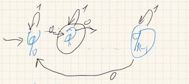
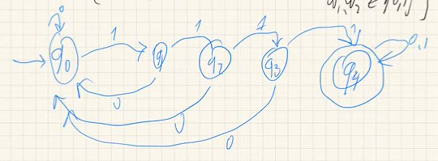
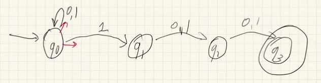
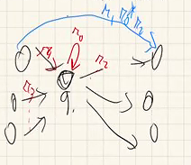
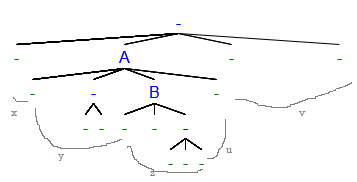
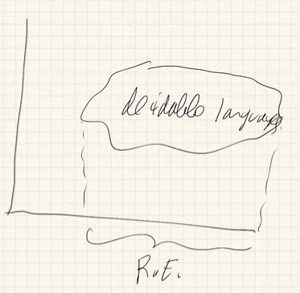
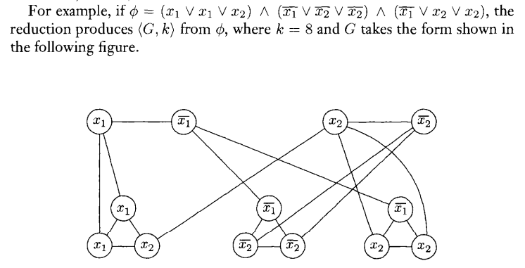

Instructor: Shai Ben-David

Time: MW 4:00PM - 5:20PM MC4063

.1A * 4<sup>+</sup> + .2MT + .4FE

+: best 4 of 5

- [Week 1. Jan 6](#week-1-jan-6)
- [Week 2. Jan 10](#week-2-jan-10)
- [Week 3. Jan 17](#week-3-jan-17)
- [Week 4. Jan 24](#week-4-jan-24)
- [Week 5. Jan 31](#week-5-jan-31)
- [Week 6. Feb 7](#week-6-feb-7)
- [Week 7. Feb 14](#week-7-feb-14)
- [Week 9. Feb 28](#week-9-feb-28)
- [Week 10. Mar 7](#week-10-mar-7)
- [Week 11. Mar 14](#week-11-mar-14)
- [Week 12. Mar 21](#week-12-mar-21)
- [Week 13. Mar 28](#week-13-mar-28)
- [Week 14. Apr 4](#week-14-apr-4)

# Week 1. Jan 6
## countability of sets

__notation.__ set operations
* _symmetric difference_ $A\triangle B:=(A-B)\cup(B-A)=A\cup B-A\cap B$
* _complement_ $A^C:=X-A$ for $A\subseteq X$ for univseral set $X$
* _cartesian product_: $A\times B:=\{(a,b):a\in A,b\in B\}$
* _power set_: $\mathcal{P}(A):=2^A:=\{B:B\subseteq A\}$
* _power of set_: $A^B:=\{f|f:B\rightarrow A\}$
  * think about how subsets and function that maps element to {0,1} are same

__notation.__ _multisets_: multiplicity matters.

__notation.__ _sequence sets_: multiplicity and order matter.

__defn.__  _relations_ are subsets of cartesian products.

__eg.__ in a graph $G=(V,E)$, edges $E\subseteq V^2$ are relation.

__defn.__ an _order relation_ is set of pairs in a relation such that the first element is less than or equal to the second. it has
* _transitivity_: if $(x,y)\in R,(y,z)\in R$, then $(x,z)\in R$
* _reflexivity_: $(x,x)\in R$
* _linearity_: $\forall x\forall y:(x,y)\in R\cup(y,x)\in R$

__defn.__ a _function relation_ of $f:A\rightarrow B$ is $R_f\subseteq A\times B=\{(x,f(x)):x\in A,f(x)\in B\}$.
* requirements of $R$ to be a function relation:
  1. $\forall x\in A\,\exist y\in B:(x,y)\in R$
  2. $\forall x\in A\,\forall y_1,y_2\in B$, if $(x,y_1)\in A$ and $(x,y_2)\in A$, then $y_1=y_2$

__defn.__ a function $f:A\rightarrow B$ is _one-to-one_ if for all $x_1,x_2\in A$, $x_1\neq x_2$ imples $f(x_1)\neq f(x_2)$.

__defn.__ a function $f:A\rightarrow B$ is _onto_ $B$ if for every $y\in B$ there exists $x\in A$ such that $f(x)=y$.

__defn.__ an _equivalent relation_ is a relation with
* _symmetry_: if $(x,y)\in R$ then $(y,x)\in R$
* _transitivity_
* _reflexivity_

__defn.__ $|A|\leq|B|$ if there exists a one-to-one function $f:A\rightarrow B$.

__defn.__ $|A|=|B|$ if any of following true
* $|A|\leq|B|$ and $|B|\leq|A|$;
* there exists $f:A\rightarrow B$ that is both one-to-one and onto.

__theorem.__ _(Cantor–Bernstein)_ two definitions above are equivalent.

__eg.__ let $E=\{2m:m\in \mathbb{N}\}$. then $|E|\leq|\mathbb{N}|$ because we have $f(m)=\frac{m}{2}$, and $|\mathbb{N}|\leq|E|$ because we have $f(m)=2m$. so $|E|=|\mathbb{N}|$.

__eg.__ let $A=(0,1)\subseteq \mathbb{R},B=[0,1]\subseteq\mathbb{R}$. then $|A|\subseteq|B|$ because we have $f(x)=x$, and $|B|\leq|A|$ because we have $f(x)=\frac{x}{2}+\frac{1}{4}$ (shrink B to fit in A). so $|A|=|B|$. but it is not obvious to find a both one-to-one and onto function.

__eg.__ show $|\mathbb{Z}|=|\mathbb{N}|$.  
define $g:\mathbb{Z}\rightarrow\mathbb{N}$

$$
g(x)=\begin{cases}
2x & \text{, } x\geq 0 \\
-2x+1 & \text{, } x<0
\end{cases}
$$
it is both one-to-one and onto. $\square$

examples of infinite sets of same cardinality:
* $E\approx\mathbb{N}$
* $(0,1)\approx[0,1]$
* $\mathbb{Z}\approx\mathbb{N}$
* $\mathbb{R}\approx(0,1)$: use $\tan:(-\frac{\pi}{2},\frac{\pi}{2})\rightarrow \mathbb{R}$ function
* any two real intervals are of same cardinality

__theorem.__ _(Cantor)_ $\mathbb{N}\approx\mathbb{Z}\approx E\not\approx (0,1)\approx[0,1]\approx\mathbb{R}$.  
_proof._ show there does not exist an onto function from $\mathbb{N}$ to $(0,1)$ (or equivalently $(0,1)$ to $\mathbb{N}$). let $f: \mathbb{N}\rightarrow(0,1)$ be any function, write

$$
f(0)=0.x_0^0x_1^0x_2^0...x_n^0...\\
f(1)=0.x_0^1x_1^1x_2^1...x_n^1...\\
...\\
f(m)=0.x_0^mx_1^mx_2^m...x_n^m...\\
...\\
$$
choose the diagonal $d=0.x_0^0x_1^1...x_n^n...$, and let $r_f=0.y_0y_1...y_n$ where for all $i$ we have $y_i\neq x_i^i$. we claim $r_f$ is not in the range of $f$. so $f$ is not onto. $\square$

__theorem.__ _(generalized Cantor)_ for every set $A$, $A\not\approx 2^A$.  
_pf._ let $f:A\rightarrow2^A$ and we want to show it cannot be onto. define $Z_f=\{x\in A:x\notin f(x)\}\subseteq A$, we have $Z_f\in2^A,$ we want to show for no $x\in A$ we get $f(x)=Z_f$ ($f$ must miss this subset in $2^A$). assume for contradiction that we have $x_0$ such that $f(x_0)=Z_f$, if $x_0\in Z_f$ then $x_0\notin Z_f$, and vice versa... $\square$

# Week 2. Jan 10

__eg.__ show for all $A$ we have $A\leq \mathcal{P}(A)$.  
define one-to-one mapping $f(a)=\{a\}\forall a\in A$. further by generalized Cantor we have $A<\mathcal{P}(A)$. $\square$

__eg.__ show $\mathbb{R}\approx\mathcal{P}(\mathbb{N})$.  
start by $\mathbb{R}\approx(0,1)$. note we can use binary expansion to represent numbers in (0,1), eg 0.10110100... but for each number, this series of 0 and 1's will represent a subset of natural numbers if 1 represents chosen and 0 otherwise for $i\in\mathbb{N}$-th digit. eg f(0.10101) = {0,2,4}. $\square$

__corollary.__ $|\mathbb{N}|<|\mathbb{R}|$.

__puzzle.__ suppose we have $A<\mathcal{P}(A)<\mathcal{P}(\mathcal{P}(A))<...$ what is the size of these sets altogether? the 'number' of sizes is larger than the 'size' of any set.

__puzzle.__ is there any set $A$ such that $|\mathbb{N}|<|A|<|\mathbb{R}|$, ie size between that of $\mathbb{N}$ and $\mathbb{R}$? there is no way to answer this question.

__notation.__
* $\alef_0=|\mathbb{N}|$
* $\alef_1=$ next infinite set of size larger than $\alef_0$
* $\alef_2=$...

__defn.__ set of size $\alef_0$ are called _countable sets_.
* every infinite subset $A\subseteq\mathbb{N}$ is countable.

__defn.__ set of size greater than that of $\mathbb{N}$ is _uncountable_.

__theorem.__ _(closure properties of family of countable sets)_
1. if $A,B$ are both countable, so is $A\cup B$.
   * _proof._ we know $A\approx2\mathbb{Z},B\approx2\mathbb{Z}+1$. then we naturally have one-to-one function that maps even+odd numbers to integers, then to naturals. $\square$
2. if there are finite countable sets $A_1,A_2,...$ that are countable, then so is $\bigcup_{i\in\mathbb{N}}A_i$.

__corollary.__ $\mathbb{Q}$ is countable.  
because you can use a pairs of naturals to represent rationals, then union them.

__theorem.__ some further notes about sizes of infinite sets:
1. every infinite set $A$ has a proper subset $B$ such that $|A|=|B|$.
2. for pairs of infinite sets $A,B$, then $|A\cup B|=\max\{|A|,|B|\}$
3. for every infinite set $A$ and natural number $n$, $|A^n|=|A|$
   1. it is not the case if $n$ is infinite, eg $|\mathbb{N}^\mathbb{N}|>|\mathbb{N}|$

## regular languages
|||
|:-:|:-:|
|computation devices|tasks|
|DFA|given some language and a word,<br />does this word belong to the language?|

__defn.__
1. an _alphabet_ $\Sigma$ is any finite set of symbols
2. for all $n\in\mathbb{N}$, $\Sigma^n:=\Sigma\times...\times\Sigma$ (n times) is the set of all _sequences_ $a_1...a_n$ such that for all $i\leq n$ we have $a_i\in\Sigma$
3. $\Sigma^*:=\bigcup_{n\in\mathbb{N}}\Sigma^n$, ie the set of all finite sequence of members of $\Sigma$
4. a _language_ is a subset of $\Sigma^*$.

every alphabet $\Sigma$ that we discuss will be finite.

__theorem.__ $|\Sigma^n|=|\Sigma|^n$.

__theorem.__ $\Sigma^*\approx\mathbb{N}$, ie it is countable.

__theorem.__ the set of all languages over $\Sigma^*$ is not countable.  
_proof._ $\mathcal{P}(\Sigma^*)\approx\mathcal{P}(\mathbb{N})\approx\mathbb{R}$. $\square$

__defn.__ a _deterministic automaton (DFA)_ is a 5-tuple:
* $\Sigma$ the alphabet of inputs to A
* $Q$: finite set of states of A
* $q_0\in A$: the initial state
* $\delta:Q\times\Sigma\rightarrow Q$: a transition function
* $F\subseteq Q$: accepting states

__defn.__ the language $L$ is accepted by $A$, ie $w=\sigma_1...\sigma_n\in L(A)$ iff $\exists x_1,...,x_n\in Q$ such that $x_0=q_0$ and $\forall i\, x_{i+1}=\delta(x_i,\Sigma_{i+1})$ and $x_n\in F$.

__eg.__ construct a DFA that accepts a string $w\in\{0,1\}^*$ iff the number of 1's in $w$ is even.
||q0|q1|
|:-:|:-:|:-:|
|0|q0|q1|
|1|q1|q0|

accepting state is q0.

__eg.__ describe a DFA $A$ such that $L(A)=\{w=w_1...w_n:n\in\mathbb{N},w_n=1\}$ (it it ends with 1).


__eg.__ find a DFA such that $L(A)=$ all strings that starts and ends with the same symbol.  
start from q0, if the first symbol is 1, then go to the same DFA above; if first symbol is 0, ...

__eg.__ find $A$ such that $L(A)=\{w:\#_0(w)\equiv1\mod k\}$ where $\#_0=$ number of symbols 0 in $w$.  
we need to store how many 0's we have seen so far.



__eg.__ describe a DFA such that $L(A)=\{w=w_11111w_2:w_1,w_2\in\{0,1\}^*\}$, ie it has four 1's.



how can we prove that the language is accepted by A? one way of providing such statement is, for every state $q_i\in Q$, let $L(q_i)=\{w:\text{upon reading }w\text{ we end in state }q_i\}$. describe each language $L(q_i)$ and prove by induction on the length of $w$ that $w\in L(q_i)$ iff it satisfies properties.

__theorem.__ there are languages $L\subseteq\Sigma^*$ such that no DFA accepts it.  
_proof._ for every nonempty alphabet $\Sigma$ we have $\Sigma^*=|\mathbb{N}|=\alef_0$, then $\{L:L\subseteq\Sigma^*\}=|\mathcal{P}(\mathbb{N})|>\alef_0$, so the number of languages uncountable. we claim the number of DFAs over a given $\Sigma$ is countable. let $W_n=\{A:A\text{ is DFA with at most }n\text{ states}\}$, then we have at most $n^{n|\Sigma|}$ possible transition tables. recall that $A=(q_0,\{q_0,...,q_{n-1}\},\delta,F)$, the number of possible $F$ is $2^n$, so $|W_n|\leq nn^{n|\Sigma|}2^n$ is finite. hence the set DFAs is countable, but the number of languages are not. we cannot cover all the languages. $\square$

__definition.__ a _regular language_ is a language that is accepted by a DFA.

__corollary.__ the number of regular languages based on $\Sigma$ is countable.

__theorem.__ _(closure properties of the set of regular languages)_
1. _closure under complement_: if $L$ is a regular language then so is $\overline{L}=\{w:w\notin L\}$
   * _proof._ flip the accepting states. $\square$
2. if both $L_1,L_2$ are regular, then so is $L_1\cup L_2$
   * _proof._ let $A_1=(\Sigma,Q_1,\delta_1,F_1,q_0^1),A_2=(\Sigma,Q_2,\delta_2,F_2,q_0^1)$ be such that $L(A_1)=L_1,L(A_2)=L_2$. let the new DFA be $A_u=(\Sigma,Q_u,\delta_u,F_u,q_0^u)$ where
     * $Q_u=Q_1\times Q_2$
     * $q_0^u=(q_0^1,q_0^2)$
     * $\delta_u((q_i,q_j),\sigma)=(\delta_1(q_1,\sigma),\delta_2(q_j,\sigma))$
     * $F_u=F_1\times Q_2\cup Q_1\times F_2=\{(q_i,q_j):\text{either }q_1\in F_1\text{ or }q_2\in F_2\}$.

   use induction to show it satisfies. $\square$
3. if both $L_1,L_2$ are regular, then so is $L_1\cap L_2$.
   * _pf._ same but $F^\cap=F_1\times F_2$. $\square$


# Week 3. Jan 17

__defn.__ a _non-deterministic automaton (NFA)_ is a tuple $N=(\Sigma,Q,\delta,F,q_0)$ where
1. $\delta:Q\times(\Sigma\cup\{\epsilon\})\rightarrow\mathcal{P}(Q)$

or informally, NFA is a DFA plus following relaxations:
1. allowing multiple same-label transition out of state
2. allowing _$\epsilon$-transition_  (switching between states without reading an input symbol)

__defn.__ the language $L$ is accepted by $N$, ie $w\in L(N)$ iff $\exists\overline{w}$ obtained from $w$ by inserting the symbol $\epsilon$ in as many places and $\exists x_1,...,x_m$ such that $x_1=q_0$ $\forall i\,x_{i+1}\in\delta(x_i,y_i)$ where $y_i$ is ith symbol in $\overline{w}$ and $y_m\in F$.

__eg.__ given DFA's $A_1,A_2$ construct $A_3$ accepting $L(A_1)\cup L(A_2)$


__eg.__ let $L=\{w\in\{0,1\}^*:\text{third-last symbol in }w\text{ is }1\}$ = {111, 000100, 00101, ...}.



we can choose many paths. if any path leads us to an accepting state then w is accepted.

using DFA, we would remember the last 3 letters and each correspond to a state.

__theorem.__ _(closure properties of the set of languages accepted by NFAs)_
1. _closure under concatenation_: if $L_1,L_2$ are accepted by $N_1,N_2$, respectively, then $L_1\circ L_2=\{w_1w_2:w_1\in L_1,w_2\in L_2\}$ is accepted by an NFA.
   * _proof._ we chain $N_1$ and $N_2$: let the accepting states of $N_1$ transit to the starting state of $N_2$ using $\epsilon$, and let the accepting states of $N_1$ be no longer accepted. $\square$
2. _closure under * operation_: given language $L$ accepted by $N$, let $L_0=\varnothing,L_1=L,L_{n+1}=L_nL$, then $L^*=\bigcup_{n\in\mathbb{N}}L_n=\{w_1...w_n:w_i\in\Sigma,n\in\mathbb{N}\}$ is accepted by an NFA.
   * _proof._ construct $N^*$ with a new starting state $q_*$ which is also accepted, and transits to starting state of $N$, $q_0$, using $\epsilon$. let all the accepting states of $N$ transit to $q_0$ via $\epsilon$.  $\square$

__remark.__ if we do not add this new $q_*$ but reuse $q_0$ we would have error: a word finishes scanning and land on non-accepting state which can transit to $q_0$, then this word is suddenly accepted.

__theorem.__ a language $L$ is accepted by an DFA iff is accepted by a NFA.  
_proof._
* (forward) every DFA is also an NFA.
* (backward) given some NFA $N=(Q,q_0,\delta,\Sigma,F)$, construct $A=(Q',q_0',\delta',\Sigma,F')$ where
  * $Q'=\mathcal{P}(Q)$
  * $q'=\{q_0\}$
  * $\delta'(R,a)=\bigcup_{q\in R}\delta(E(q),a)$ where $E(q)$ is the set of states reachable from $q$ via ϵ-transitions only
  * $F'=\{w\subseteq Q:w\cap F\neq\varnothing\}$ $\square$

__corollary.__ converting an NFA into a DFA, the DFA may have $2^n$ states.

__corollary.__ a language is regular is regular iff it is accepted by an NFA.

__corollary.__ the set of all regular languages is closed by union, intersection, concatenation and star.

__theorem.__ every finite language is regular.  
_proof._ let $L=\{w_1,...,w_n\}$. we know for every word $w_i=a_{i1}...a_{ik_i}$, the individual letters $\{a_{i1}\},...\{a_{ik_i}\}$ are regular, by closure of concatenation, we know for every word $w_i$, $L_{w_i}=\{w_i\}=\{a_{i1}...a_{ik_i}\}$ is regular. by closure of union we know $L=L_{w_1}\cup...\cup L_{w_n}$ is regular. $\square$

__theorem.__ every regular language can be derived from these basic languages by a finite sequence of closure operations.

### inductive definition of regular languages

we can define sets in 3 ways:
* listing all elements
* describing common properties
* _inductive definition_: define domain (universe) $X$, core set $A$, and operations $O$, then $I(X,A,O)$ is minimal set $W$ containing $A$ and is closed under operations in $O$.
  1. we will require both $X$ and $A$ are defined and
  2. $A\subseteq X$
  3. O is a set of functions from $X^n$ to $X$

# Week 4. Jan 24

__eg.__ X = all human beings, A = {me}, O = {parent of, child of, spouse of}. my blood relatives are I(X,A,O).

__theorem.__ if $W_1,W_2$ are two sets that contain $A$ and is closed under $O$, then $W_1\cap W_2$ also contains $A$ and is closed under $O$.

__theorem.__ _(minimality)_ define $W=\bigcap_iW_i$ where $W_i$'s are all sets that contain $A$ and is closed under $O$, then not only $W$ contain $A$ and is closed under $O$, but also is minimal in this respect.  
_proof._ because if any set $\overline{W}$ satisfies the properties, then it is among the sets intersected in the definition of $W$, so $W\subseteq\overline{W}$. $\square$

__theorem.__ such $W=\bigcap_i W_i$ is unique.

__eg.__ assume we know real numbers, define natural numbers: $I(\mathbb{R},\{0\},\{x\mapsto x+1\})=\mathbb{N}$.

__eg.__ define set of all polynomials with integer coefficients.
* $X=$ all finite strings over $\Sigma=\mathbb{N}\cup\{+,\land,*\}$
* $A=\{+1,-1,x\}$
* $O=\{(p,q)\mapsto p+q,(p,q)\mapsto p* q\}$

__eg.__ set of all propositional formulas.
* $X=$ all finite strings over $\Sigma=$ lower case English letters with/without indices $\cup\{(,),\land,\lor,\rightarrow,\lnot\}$
* $A=$ all lower letters with/without indices
* $O=\{\frac{\alpha,\beta}{\alpha\lor\beta}\},\{\frac{\alpha,\beta}{\alpha\land\beta},\{\frac{\alpha,\beta}{\alpha\rightarrow\beta}\},\{\frac{\alpha}{\lnot\alpha}\}\}$

inductive sets have the ability to prove properties by structural induction.
  * formally: let $R\subseteq X$ be some property, if $A\subseteq R$ and whenever $[x_1,...,x_n]\in R^n$ so is $f(x_1,...,x_n)$ for every $f\in O$, then $I(X,A,O)\subseteq R$.

__eg.__ have 3 cups initially positioned as ∪∩∪, one can flip two cups each time. can i finally flip all of them upright?
* base set: {∪∩∪}
* operations: {flip left two, flip right two, flip two ends}
* property: number of upright cups is even.
  1. for base set: we know ∪∩∪ satisfies property.
  2. if we have a configuration $c$ satisfying this property, if we flip two, then either i flipped two in same position => number changed by 2 => no effect on oddity; or i flipped one up and one down => number does not change. so we still have even number.
  3. we can never have all cups upright (∪∪∪ is outside R). $\square$

we can use inductive sets to revisit regular expressions.

__defn.__ set of regular expressions is $I=(\text{alphabet}^*,A,O)$ where:
1. alphabet: $\Sigma\cup\{\epsilon,\varnothing,(,),\circ,*,\cup\}$
2. core: $A=\Sigma\cup\{\epsilon,\varnothing\}$
3. operations: $O=\{\frac{R_1,R_2}{R_1\cup R_2},\frac{R_1,R_2}{R_1\circ R_2},\frac{R_1}{R_1^*}\}$

we can generate $\epsilon,a,b,a\circ b,a^*,(a\cup b)^*$, etc.

for simplicity we omit "$\circ$", and delete brackets according to priorities: $* >\circ>\cup$. it is also common to use $+$ instead of $\cup$.

__theorem.__ for alphabet $\Sigma$, we define a function $L$ that maps regular expressions to languages for every regular expression $r$ such that $L(r)$ is subset of $\Sigma^*$
1. $L(\varnothing)=\varnothing$ (empty expression -> empty language)
2. $L(\epsilon)=\{\epsilon\}$
3. $L(a)=\{a\}$ for every $a\in\Sigma$
4. $L(R_1\cup R_2)=L(R_1)\cup L(R_2)$
5. $L(R_1R_2)=L(R_1)L(R_2)$
6. $L(R^*)=(L(R))^*$

such $L$ is well-defined.  
_idea._ this is well defined whenever I(X,A,O) has a unique readability property, ie for every $r\in I(X,A,O)$, either $r\in A$ or there are uniquely defined $f\in O$ and $r_1,r_2\in I(X,A,O)$ such that $f(r_1,r_2)=r$.

__remark.__ why do we need $\varnothing$ in definition of regular languages? because there are languages that do not accept anything, and we need a mapping from regular languages to it.

__eg.__ assume $\Sigma=\{a,b\}$, let $L_1=$ all strings containing $a$, $r=(a\cup b)^*a(a\cup b)^*$, then $L(r)=L_1$.

__eg.__ let $r=(a+b)\varnothing$, what is $L(r)$? it is $\varnothing$ because it is followed by empty set => cannot generate.

__eg.__ find $r$ such that $L(r)=$ all strings where every $a$ is immediately followed by a $b$. $r=((\epsilon\cup a)b)^*$.

__defn.__ a _generalized non deterministic automaton (GNFA)_ is a tuple $(\Sigma,Q,q_0,q_F,\delta)$
1. $\Sigma$: finite alphabet
2. $Q$: finite states
3. starting state: $q_0$
4. accepting states: $q_F$
5. transitions $\delta:(Q-\{q_0\})\times(Q-\{q_F\})\rightarrow (Q-\{q_0\})$: $\delta$ defines the labeling of edges in the GNFA, where edges are regular expressions

or informally an NFA where,
1. there is a unique start state $q_0$ and no arrows go into it
2. there is a unique end state $q_F$ and no arrows go out of it
3. every arrow is labeled by a regular expression

__defn.__ a string $w$ is accepted by GNFA $D$, ie $w\in L(D)$, iff there exists a path $q_0...q_kq_F$ such that $w=w_0w_1...w_k$ and for every $i\leq k$ we have $w_i\in L(\delta(q_i,q_{i+1}))$ and $w_k\in L(\delta(q_k,q_F))$. ie we are matching the input word by regexes part by part.

```
aaabb:

      a*        b*
q0 ------> q1 ------> qF
```

__theorem.__ for every DFA $D$, there exists a NGFA $G$ accepting same language, ie $L(D)=L(G)$.  
_proof._ we need to remove labels entering $q_0$: add a new nonaccepting starting state $\overline{q}_0$ that goes to the original $q_0$ by ϵ. then need to remove labels leaving accepting states: add a new accepting state $\overline{q}_F$ and any previous accepting states go to it by ϵ. make the previous accepting states non-accepting.

if we have self-loops $q_1\rightarrow q_2$ by $a$, we can star it: $a^*$.

then we relabel using regexes and eliminate useless states. given any GNFA $G=(\Sigma,Q,q_0,q_F,\delta),Q=\{q_0,...,q_k,q_F\}$, we will construct GNFA's $G_1,...,G_k$ such that $Q(G_{i+1})=Q(G_i)-\{q_i\}$ and $L(G_{i+1})=L(G_i)$, $Q(G_k)=\{q_0,q_F\}$ (?). connect any $q$ with an edge leading into $q_i$ to any node with an arrow from $q_i$ to that state



(if state $q_1$ goes to $q_2$ by two arrows $r_1,r_2$, then replace two arrows by a single one $r_1+r_2$)

we shrink edges until we only have two states from $q_0$ to $q_F$. $\square$

we now have the third type of automaton aside from DFA and NFA, we we can show the following theorem.

__theorem.__ for every $\Sigma$, $\{L(r):r\text{ is regular expression over }\Sigma\}=\{L(A):A\text{ is a DFA over }\Sigma\}=$ _all regular languages_ over $\Sigma^*$.  
_proof._ we want to show for a regular expression $r$, there exists some DFA $A_r$ such that $L(A_r)=L(r)$. we know regular expressions = I(X=strings, A={∅,ϵ}∪Σ, O={...}), we want to show it has equivalent automaton. by induction, base: we just show each member $A$ has a DFA:
* ∅ (rejects everything): just a single starting state $q_0$ non-accepting, and transits everything to itself
* ϵ (accepts only empty string): one starting state $q_0$ accepting, and it transits to $q_1$ via ϵ non-accepting. $q_1$ transits to itself via ϵ.
* Σ: one starting state $q_0$ non accepting, transits to an accepting state by letters in Σ

induction: let $r_1,r_2$ be regular expressions, assume there are DFAs $D_1,D_2$ s.t. $L(D_1)=L(r_1),L(D_2)=L(r_2)$ (IH), we want to show after operations IH still holds:
* show there exists $D_3$ s.t. $L(D_3)=L(r_1\cup r_2)=L(r_1)\cup L(r_2)$: recall the family of regular languages is closed under union and result is still regex, by IH it has an $D_3$.
* show there exists $D_3$ s.t. $L(D_3)=L(r_1r_2)=L(r_1)L(r_2)$: recall the family of regular languages is closed under union...
* show there exists $D_3$ s.t. $L(D_3)=L(r^*)=L(r)^*$: recall the closure of regular languages under *...

so for every regular expression $r$ there exists some DFA $D$ s.t. $L(D)=L(r)$, and left ⊆ right.

the remaining direction is for every DFA, there is a same regular language. we just convert it into a GNFA with only two states. the regex on the edge is the regular expression we want. $\square$

# Week 5. Jan 31

### the pumping lemma

__corollary.__ for every $\Sigma$ there exists $L\subseteq\Sigma^*$ that is not regular.  
_proof._ we know the set of languages is uncountable and set of DFAs over $\Sigma^*$ is countable (so set of regular expressions over $\Sigma^*$ is countable). $\square$

can we point to a non-regular language?

__theorem.__ _(the pumping lemma)_ for every regular language $L$ there exist some number $n_L$ such that for every $w\in L$ such that $|w|>n_L$ there is a partition of $w$ into sections $w=xyz$ satisfying:
1. $|xy|\leq n_L$,
2. $y\neq\epsilon$,
3. $\forall i\in\N\in xy^iz\in L$.

_proof._ let $A$ be a DFA accepting $L$ and let $n_L$ denote number of states in $A$. let $w\in L$ with $|w|>n_L$, consider the sequence of states $q_0,\delta(q_0\sigma_1),,\delta(q_0\sigma_1\sigma_2),...,\delta(q_0\sigma_1...\sigma_m)$ where $w=\sigma_1...\sigma_m$, then there exists $\sigma_r,\sigma_s$ such that $\delta(q_0\sigma_1...\sigma_n)=\delta(q_0\sigma_1...\sigma_n\sigma_r...\sigma_s)$ (we are repeating some states).

now define $x=\sigma_1...\sigma_n,y=\sigma_{r+1}...\sigma_s,z=\sigma=\delta_{s+1}...\sigma_m$ by picking $r$ such that  $\delta(q_0\sigma_1...\sigma_r)$ is different than any $\delta(q_0...q_i)$ for any $i<n$ and that $\delta(q_0\sigma_1...\sigma_{r+1}),\sigma(q_0\sigma_1...\sigma_{r+2}),...,\delta(q_0\sigma_1...\sigma_s)$ are all different, we are guaranteed that $|xy|\leq n_L$. then $\delta(q_0\sigma_1...\sigma_r(\sigma_{r+1}...\sigma_s)^i\sigma_{s+1}...\sigma_m)=\delta(q_0\sigma_1...\sigma_r(\sigma_{r+1}...\sigma_s)^j\sigma_{s+1}...\sigma_m)$ for all $i,j\in\N$. $\square$

* converse is not true

__eg.__ given $L=\{a^nb^n:n\in\N\}$, show it is not regular.  
pick any $n_L$, given a word $w=a^{n_L+1}b^{n_L+1}\in L$, since we want to have $|xy|\leq n_L$ we pick partition $xy$ to be a sequence of $a$'s. then $xy^2z$ will have $n_L+1+|y|$ $a$'s and $n_L+1$ $b$'s, which is not in $L$, failing the pumping lemma (3). $\square$

__eg.__ show palindromes $L=\{ww^R:w\in\{a,b\}^*\}$ is not regular.  
consider $w=a^{n_L+1}bba^{n_L+1}$.

__eg.__ _(languages over an alphabet with just one symbol)_ let $L\subseteq\{a\}^*,L_n=\{w\in L:|w|=n\}$, show every infinite language $K$ where for arbitrarily large numbers $k$ there exists $n_k$ such that for all $n_k\leq i\leq n_k+k$ such that $L_i=\varnothing$ is not regular.
```
given any number there is a hole of that length
a aa ... a^5 a^6 a^7 ... a^15 a^16 
```
pick any $n_L$, and pick any $k>n_L$ such that $w:=a^k\in K$ and for all $i\leq n_L+1$ we have $a^{k+i}\notin K$. then let $xyz$ be any partition of this word such that $|xy|\leq n_L$, then $|xy^2z|=|w|+|y|\leq k+n_L<k+n_L+1$ and it is not in $K$. $\square$

the machine will lose track of states and 'sleep' after rejecting too many.

__eg.__ $\{a^{n^2}:n\in\N\}$ is not regular.  
because the gap between $n^2$ and $(n+1)^2$ can be arbitrarily large.

__eg.__ $\{a^p:p\text{ is prime}\}$ is not regular.  
it is an infinite language but for every $k$ there exists a prime number $p$ such that $p+1,...,p+k$ is not in the language.

__eg.__ show $L=\{w\in\{a,b\}^*:\#_a(w)\neq\#_b(w)\}$ is not regular.  
use closure property. consider $\{ab\}^*-L=a^nb^n$, we know it not is regular either by last example, but it should if $L$ were regular. $\square$

### combinatorial definition of regular languages
the pumping lemma is not a characteristic of regular languages, but MN theorem is.

__defn.__ given a language $L\subseteq\Sigma^*$, we say $w,w'\in\Sigma^*$ are _distinguishable_ with respect to $L$ if there exists some $z\in\Sigma^*$ such that one of $wz,w'z$ is in $L$ and the other is not.

__claim.__ given $L$ we define an equivalence relation over $\Sigma^*$ by $w\equiv_Lw'$ if $w,w'$ are not distinguishable via $L$.  
_proof._
* reflexivity: clear
* transitivity: let $w_1\equiv_L w_2,w_2\equiv_L w_3$, then for all $z$, $w_1z\in L\iff w_2z\in L\iff w_3z\in L$ so $w_1\equiv_L w_3$.
* commutativity: clear $\square$

using this relation we can partition $\Sigma^*$ into equivalence classes.

__eg.__ let $L_e=\{w:|w|\in2\N\}$. then $ab$ and $abb$ are distinguishable (a simplest empty string as $z$ will work). we can also partition $\Sigma^*$ into two equivalence classes (even length and odd).

__eg.__ let $L=\{a^nb^k:n,k\in\N\}$. then there are infinitely many equivalent classes $\{w:\#_a(w)-\#_b(w)=i\}$ for all $i$...

__eg.__ let $L_k=\{w\in\Sigma^*:\#_a(w)\leq k\}$. depending on how many $a$'s there are $k+2$ equivalent classes.
* $W_{i}=\{w:\#_a(w)= i\}$ for $0\leq i\leq k$
* $W_{>k}=\{w:\#_a(w)> k\}$

__theorem.__ _(Myhill Nerode)_ a language $L$ is regular iff the number of equivalence classes of $\equiv_L$ is finite. furthermore, the number of equivalence classes is the number the minimal number of states in any DFA for $L$.
* equivalently: L is regular iff number of subsets $W\subseteq\Sigma^*$ such that every two of its elements are distinguishable by $L$, is finite.

_proof._
* assume $L$ is regular. then there are a DFA $D=(\Sigma,Q,q_0,\delta,F)$ that accepts $L$. note for every $q\in Q$, $\{w\in\Sigma^*:\delta(q_0,w)=q\}$ (final state) is an $\equiv_L$ equivalence class, by that for every $z\in\Sigma^*$, any words concatenated with $z$, $w,w'$ will re-start at the same previous final state (q), so $wz,w'z$ must be (un)distinguishable at the same time. 
  * __corollary.__ the number of $\equiv_L$ equivalence classes is less than $|Q|$ and therefore finite.
* assume the number of $\equiv_L$ equivalence classes is finite. for a word $w$, let $[w]_L$ denote its belonging $\equiv_L$ class. construct a DFA $D=(\Sigma,Q,q_0,\delta,F)$ by letting
  * $Q=\{w\subseteq\Sigma^*:W\text{ is equivalence class to }\equiv_L\}$
  * $q_0=[\epsilon]_L$
  * $\delta([w]_L,\sigma)=[w\sigma]_L$
  * $F=\{[w]_L:w\in L\}$.
  * for all $w\in\Sigma^*$, we have $\delta(q_0,w)=[w]_L$, so $L(D)=\{w\in\Sigma^*:\delta(q_0,w)\in F\}=\{w\in\Sigma^*:[w]_L\in F\}=\{w\in\Sigma^*:w\in L\}$.
* we have $|Q|\leq$ number of equivalence classes. the equivalence classes of $\equiv_L$ are merges of the difference kinds of inputs so number of equivalence classes $\leq|Q|$. $\square$

__eg.__ show $L=\{w=w_1...w_n\in\{a,b\}^*:n\geq k,w_{n-k+1}=a\}$ is regular.  
we see $w\equiv_L w'$ iff the last k-long substring in $w$ is the same as the last k-long substring in $w'$. so we have $2^k$ equivalence classes depending on the available combinations. $\square$

__claim.__ any nonmempty language $L$ accepted by a DFA with $k$ states must accept some word of length less than or equal to $k$.

## context-free languages
every CFL is defined by a context-free grammar. while regular languages are defined by either a DFA/NFA or a regular expression (description), CFL are defined by a method generating the language.

__defn.__ a _context-free grammar (CFG)_ is a tuple $G=(\Sigma,V,S,R)$ where
* $\Sigma$ is the alphabet
* $V$ is a finite set of symbols representing _variables_, and we require $\Sigma\cap V=\varnothing$
* $S\in V$
* $R$ is a finite set of generation rules of the form $A\rightarrow w$ for some $A\in V,w\in(V\cup\Sigma)^*$

__defn.__ a _context-free language_ for $G$ is $L=I((\Sigma\cup V)^*,C,O)\cap\Sigma^*$, where $C=S$, $O$ is a collection of operations $w\mapsto w'$ where $w=uAv,w'=u\overline{w}v$ and $A\rightarrow\overline{w}\in R$.

__eg.__ show the language for the following grammar is $L=\{0^n1^n:n\in\N\}$.
```
Σ: {0,1}
V: {s}
S: s
R: s -> 0s1, s -> ϵ

words before intersection: 0s1, 00ss1, ..., 0000s1111, 00001111, ...
```
* language for this CFG = $U=I(\{0,1\}, \{s\}, O)$
* show $U\subseteq L$ by structural induction of $U$:
  * showing $U$ has the form $0^ns1^n$ or $0^n1^n$
  * base: there is only one element in the core set: $s$, and it is in $L$.
  * inductive: assume $w=0^ns1^n$ has this form, then using the first rule we have result $0^{n+1}s1^{n+1}$, using the second rule we have result $0^n1^n$.
  * this suffices since applying rule 2 removes $s$ to become $0^n1^n$
* show $L\subseteq U$ by usual induction on $n$:
  * let $w=0^ns1^n$ and show it is in $U$
  * base: $n=0$, then word is $s$
  * inductive: assume $0^ns1^n\in U$, then we use rule 1 to get $0^{n+1}s1^{n+1}\in U$
  * this suffices because finally applying rule 2 removes $s$ $\square$

__eg.__ find a CFG to generate $L=\{a^nb^k:n\leq k\}$.
```
Σ: {a,b}
V: {S,T}
S: S
R: S -> aSbT | ϵ
   T -> bT | ϵ
```

__eg.__ find a CFG to generate $L=\{w\in\{a,b\}^*:\#_a(w)=\#_b(w)\}$.
```
Σ: {a,b}
V: {S}
S: S
R: S -> aSbS | bSaS | ϵ
```
showing $L$ includes this is easy. proving this includes $L$: use induction on $|w|$, assume every 'balanced' $w=w_1...w_n$ of length $n$ can be generated by the grammar. let $m$ be minimum index from which $w_1...w_m$ is balanced, then we claim $w_1\neq w_n$. so $w_2...w_{m-1}$ is balanced, so my grammar will generate based on this portion. $\square$

__theorem.__ every regular language is a context-free language.  
_proof._ use induction on all regular languages: $I(\mathcal{P}(\Sigma^*),\{\varnothing,\epsilon\}\cup\Sigma,\{\cup,\circ,*\})$
* base: for empty language $\varnothing$, just use one rule `S -> S`; for $\epsilon$, use rule `S -> ϵ`; for each `a` in $\Sigma$, use rule `S -> a` to generate the language
* inductive: assume we have CFG $L(G_1)=L_1,L(G_2)=L_2$
  * $L(G_1)\cup L(G_2)$: `A -> w`, `A -> v` to `A -> w|v`
  * $L(G_1)L(G_2)$: wrap $G_1$'s starting rule `S -> w` with extra `D' -> S` and; wrap $G_2$'s `T -> v` with extra `T' -> T`. then use new starting symbol `C` with rule `C -> ST`
  * $L(G_1)^*$: wrap starting rule `S -> w` by `S' -> S` and use new starting symbol `C` with rule `C -> S'|CC|ϵ` $\square$


# Week 6. Feb 7
_parse tree_: internal nodes are in $V$. leaves are in $\Sigma^*$. it describes the generating sequence too.

a parse tree for a given $w\in L(G)$ is not necessarily unique.

__eg.__ set of well formed propositional logic expressions
```
Σ: {(,),∧,∨,¬,→,p1,...,pn}
V = {S}
R = S -> p1 | ... | pn
      | ¬S
      | (S ∧ S)
      | (S ∨ S)
      | (S → S)
      | ϵ
```
parse tree for $(p_1\lor p_2)\rightarrow p_3$:


the brackets are necessary to avoid ambiguity (multiple possible pares trees for same expression).

### the pumping lemma
the set of context-free languages over an alphabet is countable because derivation rules are finite objects.

__defn.__ the _degree_ of a tree is the max number of down-going edges from any vertex; the _height_ of a tree is the length of the longest branch of the tree.

__lemma.__ for any tree $T$, the number of leaves of $T\leq d^h$ where $d=\text{deg}(T),h=\text{height}(T)$.

note that if T is a derivation tree for a word $w$ in some $L$, then $\text{\# leaves}\geq|w|$, and $d(T)\leq\max_{|w|}\{A\rightarrow w\in R\}$ (longest word produced by one rule), so $h\geq\log_{d}|w|$.

__theorem.__ _(the CFL pumping lemma)_ for every CFL $L$, there is some number $p\in N$ such that for every $w\in L$ if $|w|>p$ then there is a partition of $w$ into 5 parts $w=xyzuv$ and
1. $|yzu|\leq p$,
2. $|yu|\geq1$,
3. $xy^izu^iv\in L$ for all $i\in\N$.

_proof._ let $G$ be the grammar and let $p=d^{|V|+1}$ where $d$ is the degree of any derivation tree and $|V|$ be number of variables. let $w\in L(G)$ be a word longer than $p$. pick a derivation tree for $w$ with minimal possible number of vertices so we have the 'height' of derivation steps $h\geq|V|+1$, which means we must have repeated some variables. consider the two lowest occurrences of such variables, call these nodes $A,B$ and $A$ is on the left of $B$. as the leaves of the tree are the word itself, we pick
1. the leftmost subtree of $A$ as $x$, 
2. to the leftmost subtree of $B$ as $y$,
3. to the rightmost subtree of $B$ as $z$,
4. to the rightmost subtree of $A$ as $u$,
5. the rightmost subtree of $A$ as $v$.

we can generate powers of $y$ and $u$ because we can mimic the reuse of variable seen in $A$ and $B$ in the leaf level. $\square$



__eg.__ let $L=\{a^nb^nc^n\in\{a,b,c\}^*:n\in\N\}$, show it is not context-free.  
given any $p\in\N$, pick $w=a^pb^pc^p\in L$. for every partition $w=xyzuv$, we have $|yzu|\leq p$ (1), there exists a letter in a,b,c that does not appear in it. now pick $i=2$ and consider $xy^2zu^2v$, then apply (2) that $|yu|\geq 1$ (it is not empty). we found that we are only increasing the count of possibly one or two letters, but not for the third letter, so the count for all three letters do not equal, failing (3). $\square$

__eg.__ let $L=\{ww:w\in\{a,b\}^*\}$ is not context-free (in contrast, set of palindromes are using `S -> aSa|bSb|ϵ`).  
given any $p\in\N$, consider $w=a^pb^pa^pb^p\in L$. a division $yzu$ can only touch 2 parts at most. $\square$

__theorem.__ _(closure property of CFL)_ if $L_1,L_2$ are context-free, then
1. $L_1L_2$ is context-free
2. $L_1\cup L_2$ is context-free
3. $L_1^*$ is context-free.

__defn.__ $L$ is a _boolean combination_ of $L_1,L_2$ if there is a function $*:\{T,F\}^2\rightarrow\{T,F\}$ such that for all $w\in\Sigma^*$ we have $w\in L$ iff $*(w\in L_1,w\in L_2)=T$.

the set of CFL is however not closed under boolean operations.

__eg.__ show $L_1=\{a^kb^nc^n:n,k\in\N\},L_2=\{a^nb^nc^k:n,k\in\N\}$ are CFL, but their intersection is not.  
the rules for $L_1$ is:
```
S -> AB | ϵ
A -> Aa | ϵ
B -> bBc | ϵ
```
for $L_2$ it is similar. we have $L_1\cap L_2=\{a^nb^nc^n:n\in\N\}$ which is not context-free. $\square$

we also know the complement of a CFL can also be not closed because complement can be represented by union/intersection and negations.

### pushdown automata
we use pushdown automata to compute CFL. it is an NFA endowed with a stack memory. whenever we scan a new letter, we can compare it with the top elements on the stack, and push it to the stack.

# Week 7. Feb 14

__defn.__ a _pushdown automata_ is a tuple $P=(\Sigma,Q,q_0,F,\delta,\Gamma)$ where
* $\Sigma$ is vocabulary
* $Q$ is set of states
* $q_0\in Q$ is start state
* $F\subseteq Q$ is accepting states
* $\delta:(\Sigma\cup\{\epsilon\})\times Q\times (\Gamma\cup\{\epsilon\})\rightarrow \mathcal{P}(Q\times(\Gamma\cup\{\epsilon\}))$ is transition function, which changes state and changes stack symbol
  * to push in $\gamma$, $(a,q,\epsilon)\mapsto (q',\gamma),...$ (pretend we have an $\epsilon$ on top of stack, replacing this virtual element with $\gamma$ is addition)
  * to delete from stack, $(a,q,\gamma)\mapsto(q',\epsilon),...$
* $\Gamma$ is a stack symbols

__defn.__ a word $w$ is accepted by $P$, ie $w\in L(P)$ iff there exist $w_0w_1...w_m\in(\Sigma\cup\{\epsilon\})^*$, $r_0r_1...r_m\in Q$, $s_0s_1...s_m\in(\Gamma\cup\{\epsilon\})^*$ (ie some live contents of letter, state and stack) such that for all $i$ we have $(r_{i+1},b)\in\delta(r_i,w_i,a)$ such that $s_i=at$ (curr stack) and $s_{i+1}=bt$ (new stack) for $t\in\Gamma^*$ (sequence of stack contents), and last state $r_m\in F$.

we can use a 3d matrix to represent the transition function...

__eg.__ construct a PDA accepting language $L=\{a^nb^n:n\in\N\}$.  
whenever we see $a$, we push a symbol, when we see $b$, we pop a symbol. if we reach the bottom when we finish the word, we accept it.

let $P=(\Sigma=\{a,b\},Q=\{q_0,q_1,q_2,q_3\}, q_0, F=\{q_0,q_3\}, \delta, \Gamma=\{\$,a\})$, where the transition is

|$Q\backslash\Sigma$|$\epsilon$|$a$|$b$|
|:-:|:-:|:-:|:-:|
|$q_0$|$\epsilon\mapsto(q_1,\$)$||
|$q_1$||$\epsilon\mapsto(q_1,a)$|$a\mapsto(q_2,\epsilon)$|
|$q_2$|$b\mapsto(q_3,\epsilon)$||$a\mapsto(q_2,\epsilon)$|
|$q_3$||||

(incomplete)

can we read/write multiple symbols on stack? nothing changes as long as we bound the length of word, just split the operation into some auxiliary states.

__eg.__ construct PDA for $L=\{a^nb^ic^k:n=i\lor i=k,n,i,k\in\N\}$. 

__theorem.__ a language $L$ is context-free iff there exists a PDA $P$ such that $L=L(P)$.  
_proof._
* assume $L$ is context-free with grammar $G$, we want to construct a PDA $P$ such that $L(P)$. the special symbol $S$ means start of word, $\$$ means end. $a$ means any letter, $e$ means epsilon.  
    

  namely just push necessary letters to stack, and then pop from word to match.
* suppose we have a PDA $P$. then define the language: variables $V=\{A_{pq}:p,q\in Q\}$, and rules
   1. $A_{pq}\rightarrow\epsilon$ for every $p,q\in Q$
   2. $A_{pq}\rightarrow A_{pr}A_{rq}$ for every $p,q,r\in Q$  
      ```
           ---          ----        stack height
         --   --      ---   -
      ---        -----       --
      --p---------r-----------q--
      ```
   3. $A_{pq}\rightarrow aA_{rs}b$ whenever for some stack string $u$ we have $(r,u)\in\delta(p,a,\epsilon),(s,\epsilon)\in\delta(s,b,u)$
      ```
      --p--a------r-----s--b--q--
      ```

  we claim $\forall p,q\in Q,\forall x\in\Sigma^*$, $A_{pq}\rightarrow x$ iff upon reading $x$ from state $p$ with an empty stack we can get to state $q$ with empty stack.
    * too complicated, skipped

__corollary.__ if $L$ is a CFL and $L'$ is regular, then $L\cap L'$ is a CFL.  
_proof._ let $P$ be a PDA for $L$, and $D$ be a DFA for $L'$. define a new PDA such that it is a product of $P$ and $D$:
* $Q=P\times D$
* $q_0=(q_{0P},q_{0D})$
* $F=\{(q,q'):q\in F_P,q'\in F_D\}$
* $\delta(a,(q,q'),t)=\{(k,\delta_D(a,q')),t):(k,t)\in\delta_P(a,q,t)\}$ $\square$

__eg.__ given $L$ is CFL and $R$ is regular, is $L-R$ a CFL?  
note $L-R=L\cap\overline{R}$, so it is CFL. $\square$

__eg.__ show $L=\{w\in\{a,b,c\}^*:\#_a(w)=\#_b(w)=\#c(w)\}$ is not context-free.  
assume for contradiction $L$ is context-free, then consider $L'=L\cap L(a^*b^*c^*)=\{a^nb^nc^n:n\in\N\}$ which is not an CFL. but since $L(a^*b^*b^*)$ is CFL (regular) it should. $\square$

# Week 9. Feb 28

## turing machines
_church thesis_: all reasonable ways of defining what are computable tasks, are equivalent.

__eg.__
* those can be computed using turing machines.
* set of functions $I(\text{functions},\{+,-,\times,...\},\{f,g\mapsto f\circ g\})$
* the set of all predicate functions (eg $\vdash\forall x...$)
* any tasks solvable by a computer program (independent of the programming language or hardware)

__defn.__ a _turing machine_ is a tuple $T=(\Sigma,\Gamma,Q,q_0,q_\text{acc},q_\text{rej},\delta)$ where
* $\Sigma$: finite vocabulary
* $\Gamma$: finite symbols that can be used in the tape
* $Q$: finite states
* $q_0$: initial state
* $q_\text{acc}$: accepting state
* $q_\text{rej}$: rejecting state
* $\delta:Q\times\Gamma\rightarrow Q\times\Gamma\times\{L,R\}$
  * $(q,\gamma)\mapsto(q',\gamma',R)$ means when the head is symbol $\gamma$ on tape and machine is in state $q$, move the head right one location and replace symbol with $\gamma'$ and move to state $q'$

__defn.__ a _configuration_ of a turing machine is $C=(u,q,v)$ where $u$ is the tape locations before the current location, $u$ is the locations after the current location, $q$ is the current state.
```
_________|a|_______
<---u--->  <--v--->
```

__defn.__ $C\overset{*}{\to} C'$ if allows going from $C$ to $C'$ in finitely many steps.

__eg.__ $(uaqbv)\to(uacq'v)$ means $\delta(q,b)=(q',c,R)$; $(uaqbr)\to(uq'acv)$ means $\delta(q,b)=(q',c,L)$.

__defn.__ a word $w\in\Sigma^*$ is accepted by $T$, ie $w\in L(T)$ iff there exist some $u,v\in\Gamma^*$, such that $(\epsilon q_0w)\overset{*}{\to}(uq_\text{acc}v)$.
* it is not in $L(T)$ if either it leads to rejecting states (no configuration leading to accepting) or it leads to indefinite moving.

__defn.__ a language $L$ is _turing recognizable_ if there exists some turing machine $T$ such that $L=L(T)$.

__defn.__ a language is _decidable_ if there exists a turing machine for it and the machine gets to either accepting or rejecting states.

__eg.__ fix some first order logic, let $L=\{\alpha:~\vdash\alpha\}$ (any proof that proves $\alpha$). it is recognizable as $T$ will go over all finite sequence of formulas, for each it will 1) check whether it is legal proof 2) is the last formula $\alpha$. it is not decidable however.
* consistent language not decidable...

```
              countable      uncountable
decidable ⊆ recognizable ⊆ unrecognizable
```

note
* the family of decidable languages is closed under complement (just switch $q_\text{acc},q_\text{rej}$).
* however turing recognizable languages are not closed under complement (those that never halt)

### robustness of TM model of computation
we can consider some variations of turing machines that are equivalent.

__eg.__ allowing the reading head not move left or right: $Q\times\Gamma\rightarrow Q\times\Gamma\times\{L,R,S\}$.  
can be simulated by a standard TM: go left then back right without changing state

__eg.__ have $k$ tapes simultaneously: $\delta:Q\times\Gamma^k\rightarrow Q\times\Gamma^k\times\{L,R\}^k$.  
clearly the k-tape machine is as powerful as a standard TM. create a tape that has $k$ segments, and for each of them duplicate the $\gamma_i$'s. each has a special letter $\overline{\gamma}_j$ where $j$'s are different across segments.

```
-----+----------------------+-----
-----+----------------------+-----
 tape 1      ...             tape k
```

__eg.__ two-stack PDA.  
one stack for left side, one for right side. moving head to right => moving top element from right stack to left stack, ...

__eg.__ _non-deterministic turing machines_: $\delta:Q\times\Gamma\rightarrow\mathcal{P}(Q\times\Gamma\times\{L,R\})$. a word $w$ is accepted by it iff there is a way to get $(uq_\text{acc}v)$ from $(q_0w)$.  
use a 3-tape TM to simulate it. start from $C_0=(q_0w)$, we can go to three configurations $C_{11},C_{12},C_{13}$, which can each have three configurations... using BFS, if there is a way to get to accepting state, then it is accepted. for the 3 tapes
* first tape contain the input $w$
* second tape pick some determinism to some computation mode
  * just a temp memory to do computation
* third tape list nodes that have been covered. it keeps track which computation we are doing now

### numerating machines
add a new state $q_\text{print}$. when the machine reaches $q_\text{print}$, we view the current content of the tape as the output.

__defn.__ a word $w$ is accepted by the enumerator $E$, ie $w\in L(E)$, iff it can be printed.

__defn.__ $L$ is _recursively enumerable_ if there exists some enumerator $E$ such that $L=L(E)$.

__claim.__ $L$ is recursively enumerable iff it is recognizable.  
_proof._
* given a turing machine $T$ that recognizes $L$, define a enumerator such that
  * we have two tapes. first tape is for storing contents so fat, second tape is like $T$. let $w_0w_1...w_n..$ be a word at step $i$, run $T$ on $w_0w_1...w_i$ for $i$ many steps, write them on the first step and repeat. note if $w\in L(T)$ reaches its $q_\text{acc}$. if $w\in L(T)$ then it reaches $q_\text{acc}$ and so at $q_\text{print}$ it is printed. if $w\notin L(T)$ then either runs forever or reaches $q_\text{rej}$.
* given an enumerator $E$ that accepts $L$, construct a turing machine where we just compare the word with what would have been printed by $E$, accept if there is a match. $\square$

__theorem.__ a language $L$ is decidable iff both $L$ and $\Sigma^*-L$ are recursively enumerable.  
_proof._
* suppose $L$ is decidable, then it is recognizable so is its complement, so they are recursively enumerable.
* suppose $L,\overline{L}$ are RE. let $E,\overline{E}$ be their enumerators. define a turing machine that accepts $L$ and halts on every input: for any input $w\in\Sigma^*$, run $E,\overline{E}$ in parallel, we know $w$ must be eventually printed by one of them in finite steps. $\square$

__remark.__ language is decidable if enumerator can print strings in lexicographical order.

how can one show a language is not decidable?

_hilbert's 10th problem_: given a polynomial of several variables $P(x,y,z,...)=0$ decide if it has integer solutions.
* if there is one variable $P(x)=a_0+a_1x+...+a_kx^k$ we can calculate a bound on the absolute values of any potential solution. it is decidable.

__theorem.__ $L_p=\{\lang P\rang:P\text{ is a polynomial with integer solution}\}$ is undecidable. (angle bracket: encode object as a binary string)

__eg.__ $\{\lang G\rang:G\text{ is undirected graph that is connected}\}$ is decidable.  
try design a TM to scan the encoded string..

__eg.__ $L_\text{DFA}=\{\lang w,D\rang:D\text{ is DFA that accepts }w\}$ is decidable.  
just run the DFA with w...

__eg.__ $E_\text{DFA}=\{\lang D\rang:D\text{ is DFA and }L(D)=\varnothing\}$ is decidable.  
use pumping lemma, if $D$ accepts no word of length less than $|Q|+1$ then it does not accept other words (assume otherwise, choose a word > this number in language, pump by power of 0 to create contradiction).

__eg.__ $L_\text{DFA-eq}=\{\lang D,D'\rang:D,D'\text{ are DFAs and }L(D)=L(D')\}$ is decidable.  
note $L(D)=L(D')$ iff both $L(D)-L(D')$ and $L(D')-L(D)$ are empty. construct the difference DFA (product DFA) and go to the previous eg.

__eg.__ $L_\text{PDA}=\{\lang w,G\rang:w\in L(G)\}$ is decidable.  
turn the grammar G into a PDA...

__eg.__ $E_\text{CFG}=\{\lang G\rang:L(G)=\varnothing\}$ is decidable.  
pumping... the threshold is $|s|^{|V|+1}$ where $|s|=\max\{|s|:A\rightarrow s\in R\}$

__eg.__ $L_\text{CFG-eq}=\{\lang G,G'\rang:L(G)=L(G')\}$ is undecidable.  
construct $\overline{G}$ such that $L(\overline{G})=L(G)-L(G')$. turns out that it is undecidable...

# Week 10. Mar 7
__eg.__ $A_{\text{TM}}=\{\lang T,w\rang:w\in L(T)\}$ is undecidable.  
assume for a contradiction that it is decidable and let $A$ be the turing machine/algorithm. define a new algorithm $D$ as follows:
* fix $w$, on any input $\lang M\rang$ that encodes a turing machine, and $D(\lang M\rang)=\text{accept}$ iff $A(\lang M\rang,w)=\text{reject}$.

then feed $\lang D\rang$ into $D$. if $D(\lang D\rang)=\text{accept}$, then $A(\lang D\rang,w)=\text{reject}$, then it means $D(\lang D\rang)=\text{accept}$. same for the other direction. so we get contradiction. $\square$

however it is recognizable. given word of and the machine, just run it.

the problem for rejecting a word is it can possibly run forever.

__eg.__ _(halting problem)_ $H=\{\lang M,w\rang:M\text{ halts on input }w\}$ is undecidable.  
we use proof by reduction. suppose otherwise it has decider $H$. given $\lang T\rang,w$ be input for $A_{\text{TM}}$ problem. then feed this into $H$, then it can either accept or reject and run in finite steps. then we have solved $A_\text{TM}$ but we should not. $\square$

__eg.__ $E_\text{TM}=\{\lang M\rang:L(M)=\varnothing\}$ is undecidable.  
suppose otherwise it has decider $ETM$. given $\lang T\rang,w$ be input for $A_\text{TM}$ problem, fix $w$ and define $M'$ such that
* if $M$ ever accepts a word $x$, compare with $w$ and if equal, accept, otherwise reject.

feed $M'$ into $ETM$, as it runs in finitely many steps we can solve $A_{\text{TM}}$ problem. $\square$

__eg.__ $\text{EQ}_\text{TM}=\{\lang M,M'\rang:L(M)=L(M')\}$ is undecidable.  
suppose otherwise it has decider $EQ$. let $M_0$ be some machine that accepts nothing. then for an input $\lang M\rang$ for the $E_{\text{TM}}$ problem, $L(M)=L(M_0)$ iff $L(M)=\varnothing$ so we can use $EQ$ to solve it. $\square$

__eg.__ $\text{All}=\{\lang M\rang:L(M)=\text{everything}\}$ is undecidable.

examples of undecidable problems that do not mention turing machines
* existence of integer solutions of polynomial
* given finite pile of domino tiles, each of them has two sides with a finite word on each side. we can copy and reuse some of the tiles. can they be arranged in a way such that the concatenation of face words = concatenation of back words?

### word complexity

how to measure complexity of a words? try do this by its 'description length', ie how long is the shortest way to describe the word.

_the Barry paradox_: consider a number has a short definition if there is an English sentence of words less than 200 characters that defines it. is the set of all shortly described numbers finite?  
* say we have 40 chars in English. then there are $40^{200}$ possible descriptions so the set is infinite.
* then 'the smallest number that cannot be described in $40^{200}$ letters'.

the problem is the description must be some fixed 'description language'.

__eg.__ a Python program that given empty inputs it returns a string. then the program is the description.

__defn.__ _kolmogorov complexity_ is the length of the shortest description $K_d(s):=\min\{|p|:d(p)=s\}$.

__theorem.__ some properties:
1. for every $d$, there exists $c\in\N$ such that for all $c$ we have $K_d(s)\leq|s|+c$.
   * __eg.__ `print {s}`
2. there exists description that is much shorter than the word.
   * __eg.__ `'1' repeated 2^n times` (length logn)
3. there are infinitely many string $s$ such that $K_d(s)\geq|s|$.
   * _proof._ we ask how many descriptions of size less than $|s|$ are there: $\sum_{i=1}^{|s|-1}2^i=2^{|s|}-1$ (assume alphabet is binary encoded). however there are $2^{|s|}$ strings of size $|s|$, so for every length $n$, there is one string $s$ such that $|s|=n$ and $K_d(s)\geq|s|$. $\square$

__defn.__ we say string $s$ is _b-compressible_ if $K_d(s)\leq|s|-b$.

__claim.__ for every $b>1$ and for all large enough $n$, most of the string of length $n$ are not b-compressible.  
_proof._ there are at most $\sum_{i=1}^{|s|-b}2^i=2^{|s|-b}-1$ descriptions of size below $|s|-b$ and there are $2^{|s|}$ strings of length $|s|$. even b = 1 we cannot compress half of them. $\square$

how to say a string is random? can you use probability? no because strings have same probability to be generated
```
10101010101010101010  p=1/2^20
10110101000101010111  p=1/2^20
```

Chaitin defines a string to be 'random' if it is not compressible.

__defn.__ a property $P$ of a string is _rare_ if $\lim_{n\rightarrow\infty}\frac{|\{s:|s|=n,s\text{ has }P\}|}{2^n}=0$.

__claim.__ for every rare property $P$, for every $b$ there exists $n$ such that all strings of length $n$ that satisfy $P$ are b-compressible.
* in other words, incompressible strings do not satisfy rare properties.

_pf._ 'the i-th string that satisfies P' is a compressed description of that string once $P$ is random and $i$ is larger ($c+\log i$).

__theorem.__ some straightforward 'positive' results (upperbound of $K_d$):
1. $\forall x~\exists c~K_d(xx)\leq c+K_d(x)$
2. $\forall x\forall y~\exists c~K_d(xy)\leq c+K_d(x)+K_d(y)+\log(K_d(x))$
   * log: we have to know how long to express $x$
3. for every two programming languages $d,d'$ and every string $s$, there is some constant $b_{d,d'}$ such that $K_d(s)\leq K_{d'}(s)+b_{dd'}$.
   * $b_{dd'}$ is length of compiler that translates $d$ to $d'$
4. for every pairs of strings $s_1,s_2$ there exist programming languages $d_1,d_2$ such that $K_{d_1}(s_1)<<K_{d_2}(s_2)$ and vice versa.

__theorem.__ for any given programming language $d$ there is no algorithm such that for every $s$ it computes $K_d(s)$ ($K_d$ is not computable).  
_proof._ following the argument of the Barry paradox. assume there is some algo $A$ that computes correctly $K_d(s)$ for all $s$. what is the length of the a d-program computing 'the first string s of $K_d(s)>L$ for $L$? then it is
```
for each string in lexicographical order:
    for each si:
        run A to find si
        return first si such that A(si) > L
```
then the length of this program is $K_d'(s)=c+\log L$ (L is the only variable and we need $\log L$ bits). if $L$ is sufficiently large, then we can always find some $c+\log L<L$. we get contradiction.

_another proof halting problem is undecidable_: given program that decides HP, we could then compute $K_d(s)$ for every $s$: by going over all programs in lexi order. given empty input, check if any program of size $<|s|$ outputs $s$. before we run program, use HP to check whether it halts on empty input.

we know that for every length $L$ there are only finitely many strings $s$ with $K_d(s)\leq L$. can we prove a lower bound?

__theorem.__ for any proof system there is some $L<\infty$ such that this system cannot proof $K_d(s)>L$ for any $s$.  
again use Barry paradox.

# Week 11. Mar 14
### computable functions

__defn.__ a function $f:\Sigma^*\rightarrow\Sigma^*$ is _computable_ if there is a turing machine $M$ such that for every $w\in\Sigma^*$ as input, $M$ eventually halts with $f(w)$ as its tape content.

we know recognizable and recursively enumerable are equivalent notions. it is also equivalent to $L$ being the range of some computable function $f$ (ie $L=\{f(n):n\in\N\}$).

__defn.__ for languages $A,B$, we say $A$ is _mapping reducible_ to $B$, denoted $A\leq_m B$, if there is computable function $f:\Sigma^*\rightarrow\Sigma^*$ such that for every $w\in\Sigma^*$, $w\in A$ iff $f(w)\in B$.
* we do not care one-to-one or onto

__theorem.__ if $A\leq_mB$ and $B$ is decidable, then $A$ is decidable.

__theorem.__ if $A\leq_mB$ and $B$ is recognizable, then $A$ is recognizable.

we know already recognizable language does not imply complement is recognizable. but can there be language such that itself and its complement are both not recognizable?

__claim.__ both $\text{EQ}_{\text{TM}}$ and $\overline{\text{EQ}_{\text{TM}}}$ are not recognizable.  
_proof._
* we first show $A_\text{TM}\leq_m\text{EQ}_{\text{TM}}$ by reduction: given input $(M,v)$ for $A_\text{TM}$, construct $M_1$ = always accept, and $M_2$ = on any input $x$, run $v$ on $M$ and accept $x$ if $M$ accepts $v$. we have mapping $f(M,v)\rightarrow f(M_1,M_2)$. then we have $L(M_1)=L(M_2)$ iff $M$ accepts $v$. this statement is equivalent to $\overline{A_\text{TM}}\leq_m\overline{\text{EQ}_{TM}}$. we know $A_\text{TM}$ is recognizable but not decidable, so $\overline{A_\text{TM}}$ is not recognizable, so $\overline{\text{EQ}_{TM}}$ is not recognizable.
* we show $A_\text{TM}\leq_m\overline{\text{EQ}_\text{TM}}$ by reduction: given input $(M,v)$ for $A_\text{TM}$, construct $M_1$ = always reject and $M_2$ same as above. then $L(M_1)=L(M_2)$ iff $M$ rejects $v$. this statement is equivalent to $\overline{A_\text{TM}}\leq_m\text{EQ}_\text{TM}$, so we know $\text{EQ}_\text{TM}$ is not recognizable. $\square$

__defn.__ we say $f:\N\rightarrow N$ _dominates_ $g:\N\rightarrow\N$ if there exists $m_0$ such that for all $n>m_0$, $f(n)\geq g(n)$.

__lemma.__ for every countable set of such functions $F$, there exists a function $g_F$ that dominates every member of $F$.  
_proof._ since $F$ is countable we can find some indexing such that $F=\{f_n:n\in\N\}$. define $g_F$ by for every $n$, $=\max_{i,j\leq n} f_i(j)+1$. $\square$

__corollary.__ there exists $g_c$ that dominates every computable function.  
this is because set of all computable functions is countable (turing machine is countable (finite codes)).

note for every $n$ there are only finitely many functions computable by a turing machine with at most $n$ states. given any number $k$, define $g_c(k)$ by $\max_{M\text{ with }\leq k\text{ states},i\leq k\text{ s.t. }M\text{ halts on input }i}\{\text{\# computation steps of }M\text{ on input }i\}$. then this $g_c$ is not computable. if it were, we could decide $A_\text{TM}$ as we have a maximum of steps to take to scan any input $\lang M,w\rang$.

__theorem.__ _(Ramsey)_ there exists a number $r(m)$ such that for every undirected graph $G=(V,E)$ where $|V|\geq r(m)$ there is either a click of size $m$, or an isolated set of size $m$, ie there exists $A\subseteq V$ such that $|A|\geq m$ and either, for all $x,s\in A,xy\in E$, or for all $x,y\in A,xy\notin E$.

or more generally, for every $m,b,l$ there is a number $r(m,k,l)$ such that for every $W$, if $|W|\geq r(m,k,l)$, for all $f:W^k\rightarrow[l]$, there exists $A\subseteq W$ such that $f$ on $A^k$ is constant and $|A|\geq m$.
* take a look at its enhanced version Paris–Harrington theorem
* Goodstein function

the function $r$ is not computable...

if $L$ is such that $f_i(i)=\{|i|:i\text{th }w\text{ that is in }L\}$. $f$ is fast growing function, and $L$ is not recognizable.

### logic
first order logic:
* syntax
  * the language
  * vocabulary
  * symbols $(,),\land,\rightarrow,\lor,\lnot,\forall,\exist$ and variables
  * language-specific symbols: constant symbols, relation symbols, function symbols
  * proof system and $\vdash$
  * assume equality always exists
* sematics
  * 'meaning' of language
  * structure/model/interpretation M=(universe set, set of interpretations of relation and function symbols)
  * theorems and $\vDash$
* _terms_: if $t$ is a term and $f$ is function symbol then $f(t)$ is a term
* _atomic formulas_: apply relation symbols to terms
* _general formulas_

__eg.__ for $M=(\N,\{a,*,+,<\})$, we have language $L=\{...,a,g(,),f(,),R(,)\}$ to represent the relations and functions. we can use these to write formulas eg $\forall x\exist y(R(x,y)\land\forall s\forall t(g(s,t)=y\implies s=y\lor t=y))$ ('there are infinitely many primes').

__defn.__ a formula is called a _sentence_ if all of its variables are quantifiers.
* it is either true or false
* while formulas have unassigned free variables, we do not know whether it is true or false yet since we do not know its meaning

__defn.__ given structure $M$, its _theorems_ is $\text{Th}(M)=\{x:M\vDash x\}$ (true sentences).

__theorem.__ for a language $L$ and structure $M$ for that language, then for every sentence $x$ in the language, then either $x\in\text{Th}(M)$ or $x\notin\text{Th}(M)$.

question: is there an algo that on any given $\alpha$ it can decide whether it belongs to the theory of the structure $M$? in other words, given language $L$, is $\text{Th}_L(M)$ decidable?

__claim.__ let $L_+=\{P(,,)\}$ with only one three-place relation, and $M=(\N,\{x,y,z:x+y=z\})$. then $\text{Th}_{L_+}(M)$ is decidable.  
show by induction by the number of quantifiers...

__claim.__ let $L_{+*}=\{P(,,),G(,,)\}$ and $M=(\N,\{x,y,z:x+y=z\},\{x,y,z:xy=z\})$. then $\text{Th}_{L_{+*}}(M)$ is undecidable.  
_proof._ note for this language we do not explicitly define ordering, 0, 1 etc. as they can be expressed in the form of formulas, so it describes properties of $\N$.

by reduction to $A_\text{TM}$. given $\lang T,v\rang$ as input for $A_\text{TM}$, we want to construct a sentence $\alpha$ such that $\lang T,w\rang\in A_\text{TM}$ iff $\alpha\in\text{Th}_{L_{+*}}(M)$. we can encode sequence of natural numbers as natural numbers.
* eg given $(a_1,...,a_k)\in\N^k$, we map it to $2^{a_1}3^{a_2}5^{a_3}...p_{k+1}^{a_k}\in\N$, and this mapping is bijective and computable

and $w\in A_\text{TM}$ iff there exists some $s_1,...,s_k$ such that each $s_i$ is a pair $(q\in Q,w\in \Gamma^*)$, $s_0=(q_0,\epsilon)$ and $s_k=(q_\text{acc},w)$. note each of these steps can be written as a natural number, and then one natural number. if we can decide which number satisfies theorem, then we can decide the $A_\text{TM}$. $\square$

it is not recognizable either. if it were, then its complement recognizable (due to definition of theory), then it is decidable.

__defn.__ a _proof system_ $P$ is set of rules that defines which formula a 'formal theorem' is provable ($\vdash_P\alpha$), ie satisfying.
1. there is a certificate 'proof' in the proof system and the set of all legal proofs is decidable;
2. _sound_: for some structure $M$, for all $\alpha$ we have $\vdash_P\alpha\implies M\vDash\alpha$

__claim.__ if $P$ is a proof system satisfying property $L$, then $\{\alpha:~\vdash_P\alpha\}$ is recognizable.  
_proof._ go over all strings in lexi order and given string $w$ apply the proof system decider to check whether $w$ is legal proof in $L$, if so, print out what $w$ proves.

__claim.__ $\{\alpha:~\vdash_P\alpha\}\subseteq\text{Th}(\N)$.

__corollary.__ for every proof system $P$ that is sound for $\text{Th}_{+*}(\N)$ there is a sentence $\alpha$ such that $\N\vDash\alpha$ and $\not\vdash_P\alpha$.

# Week 12. Mar 21
we know the set $\{\alpha:\N\vDash\alpha\}$ is 'complete' in the sense that either for every $\alpha$, either $\alpha\in\text{Th}(\N)$ or $\lnot\alpha\in\text{Th}(\N)$. it is recursively enumerable but not decidable.

observe $\text{Th}(P)$ for some system $P$ is not complete, namely there exists some $\alpha$ such that $\not\vdash_P\alpha,\not\vdash_P\lnot\alpha$.

how to define natural numbers? we cannot prove anything but we can try focusing on natural numbers only. Peano arithmetic is an accepted proof system for $\N$.

ZFC (Zermelo-Fraenkel set theory) can prove every axiom of PA.

if $\phi(x,y)$ denotes a function over $\N$, then we need
* $\forall x\forall y\forall y':\phi(x,y)\land\phi(x,y')\implies y=y'$
* $\forall x\exist y:\phi(x,y)$

a function is computable iff it can be expressed by a formula $p$ such that $\text{PA}\vdash\text{two properties}$.

as corollary, there exist functions such that ZFC can prove both properties but they grow faster than any computable function (can cannot be proved by PA).

example of ZFC is not complete:

__eg.__ _(continuous hypothesis)_ ZFC cannot prove the statement "$|\R|=\alef_0$" nor its negation.

__eg.__ _(Goldel's 2nd incompleteness)_ for any consistent proof system $P$, $P\not\vdash\text{Cons}(P)$ ie $P$ cannot prove $P$ is consistent.

however $\text{ZFC}\vdash\text{Cons}(\text{PA})$.

## complexity

once a language/problem is computable, now we can consider its time complexity and space complexity.

__defn.__ for functions $f,g:\N\rightarrow\N$, we say $f(n)=O(g(n))$ if there exists some $c\in\N$ such that for all $n>n_0$ such that $f(n)<cg(n)$.
* $f(n)=O(g(n))$ if $\lim_{n\rightarrow\infty}\frac{f(n)}{g(n)}=0$.

__defn.__ the _time complexity_ up to a polynomial of a problem is the time it takes for the most efficient algorithm.

__eg.__ find the time complexity of $\{a^kb^k:k\in\N\}\subset\{a,b\}^*$.
given string of length $n$. after checking $a$'s are followed by $b$'s, given a one-tape machine we can do
* algo1: delete leftmost $a$, then move cursor and delete rightmost $b$, repeat. then this will take $O(n^2)$ steps
* algo2: go from left to right, delete every second $a$ and every second $b$, go back and repeat. then this will take $O(n\log n)$ steps

if we have two-tape machine
* algo3: move all $a$'s from first tape to second tape, then run both taps to check if numbers are equal. $O(n)$ steps.

_refined church thesis_: for every problem and evert two 'reasonable' models of computation, the time complexity of solving the problem on those machines is within a polynomial of each other.

__eg.__ for every problem solvable in any time $f(n)$ by a two-tape machine, the problem can be solved by a 1-tape machine in time $O(f(n)^2)$.  
for the 1-tape machine, put a barrier so that it has two parts corresponding to the 2 tapes. if on the 2-tape machine we cross the tapes at most $f(n)$ times, then the 1-tape machine has to move $O(f(n)^2)$ times to account for this. $\square$

__defn.__ the class P is the family of all problems solvable in polynomial time (in terms of input size $n$).
$$
P=\bigcup_{k\in\N}T(n^k)
$$

the class P is commonly accepted as modeling 'feasible problems'.

issues of this interpretation:
* is $n^{10000}$ feasible? 'the exponent is fixed for all input sizes.'
* only asymptotic
* there is worst-cast condition

__eg.__ for problems over graphs, we represent a graph by its adjacency matrix $M_G$. then the size of this representation $|\lang G\rang|\approx|V|^2$. we also know $M_G$ is symmetric iff $G$ is undirected.

__eg.__ for the problem $L_p=\{n:n\text{ is prime}\}$. we represent number by its binary representation $|\lang n\rang|\approx\log n$. can we solve this in polynomial time?
* algo1: given input $n$, for all $i\leq\sqrt{n}$ we compute $\frac{n}{i}$, accept if no division if without a remainder. the run time is roughly $O(\sqrt{n})$ but the $n$ is the number we check (not representation). the real run time is $O(\sqrt{2^{|\lang n\rang|}})$, so it is not a poly algo.

__defn.__ a language $L$ belongs to _NP_ if there exists a polynomial time (in the size of $w$) deciding (verification) algorithm $V$ such that $L=\{w:\exist c ~V(w,c)=\text{accept}\}$.

__observation.__ $P\subseteq NP$.  
just take $\epsilon$ as the certificate for every $w$ and let $V$ be the algorithm deciding $L$.

__eg.__ _(clique)_ given input $\lang G=(V,E),k\rang$, $L_\text{Cl}=\{\lang G,k\rang:G\text{ contains a clique of size }k\}$.  
given such an input, a certificate $c$ will be a list of $k$ vertices $c\subseteq V$ and the verifier just check for every $x,y\in c,xy\in E$.

__eg.__ $L_\text{HamPath}=\{\lang G\rang:G\text{ has a Hamiltonian path}\}$.  
the certificate is the path.

__eg.__ $L_\text{composite}=\{\lang n\rang:n\text{ is not prime}\}$.  
the certificate is two numbers such that they are not 1 and multiply to make $n$. in terms of input size this is poly.

__prop.__ the class P is closed under complementation.  
use same algorithm and flip answer.

however it is not clear if NP is closed under complementation (NP = CoNP?).

__defn.__ $\text{CoNP}=\{L:\overline{L}\in NP\}$.

__eg.__ $SAT=\{\varphi:\varphi\text{ is a satisfiable formula in propositional logic}\}$. formula is satisfiable if there exists a truth assignment such that formula gets true.  
* such a truth assignment is a certificate and the verification is done in poly time.  
* but $\overline{SAT}$ does not have an easy certificate..  
* similarly $TUAT=\{\varphi:\varphi\text{ is a tautology}\}$ it is not clear if it is NP..

why is this class called NP?

__defn.__ an algorithm/turing machine is _nondeterministic_ if at every step it may have more than one next step configurations. such algorithm is _polynomial time nondeterministic_ if no matter which choices are picked, the run ends in some polynomial time.

__defn.__ a language $L$ is accepted by a nondeterministic turing machine iff at least one of the possible paths of the TM ends in accept state.

__theorem.__ a language $L$ is in NP iff it can be decided by a nondeterministic polynomial time algorithm.  
* assume $L$ is accepted by such a TM. for every $w\in L$, let the certificate be the choice that the sequence of next step choices made by the TM that leads an accept state. then we can run this sequence in TM in poly time
* assume for some verifier $V$ and $L=\{w:\exist c~V(w,c)=\text{accept}\}$. the nondeterministic TM for it will go over all binary $c$'s of length $\leq O(n^{k})$, the upper bound on the runtime of $V$, and use $V$. then one of them ends in poly time. $\square$

__remark.__ $P\subseteq NP\subseteq\bigcup_{k\in\N}UT(2^{n^k})$.

it is not clear whether $P=NP$.

__eg.__ how to credit card store pincode?  
it uses _one way functions_ that are easy to compute forward but hard to compute backward. the card has $f(\text{pin})$, the ATM computes $f(\text{userPin})$ and compare. if P=NP then we can inverse easily.

__defn.__ given $L_1,L_2$, $f:\Sigma^*\rightarrow\Sigma^*$ is a _polynomial time reduction_ if $f$ runs in polynomial time and $\forall w:w\in L\iff f(w)\in L_2$.

__observation.__ given $L_1<_p L_2$, if $L_2\in P$, then $L_1\in P$.  
_proof._ if $f$ is $O(n^k)$ computable then for every $w$, $f(w)$ has size at most $|w|^k$. so if $A$ solves $L_2$ in time $n^{k+1}$ and $f$ runs in time $n^{k_2}$, we get a solve for $L_1$ in time $(n^{k_2})^{k_1}$. $\square$

__defn.__ $L$ is NP-complete if $L\in NP$ and $\forall \overline{L}\in NP:\overline{L}<_p L$.

# Week 13. Mar 28

__defn.__ the class $S(n^k)$ is all languages decidable in space $O(n^k)$, ie there exists deciding $M$ such that input $w$ requires space (tape size) $O(|w|^k)$. then
$$
P_{SPACE}=\bigcup_{k}S(n^k)
$$

__defn.__ a function $f$ is _time constructable_ if $f$ on input $0^n$, $f$ computes $f(n)$ in time $O(f(n))$.

every 'reasonable' function ($n.n^2,2^n,...$) is time constructable.

__theorem.__ _(time hierarchy)_ for every 'reasonable' $f,g:\N\rightarrow\N$, if $f(n)=O\left(\frac{g(n)}{\log g(n)}\right)$, there is a language $L\in T(g(n))-T(f(n))$ (it is in the middle of the two).  
_proof._ define $L=\{\lang M\rang01^k:M\text{ is code of a TM},M(\lang M\rang01^k)\text{ outputs reject in time }<f(|\lang M\rang01^k|)\}$. diagonalization argument can show $L\notin T(f(n))$. by the term 'reasonable', we can show $L\in T(g(n))$. $\square$

this means containing $P$, we can have more classes, eg
* $E=\bigcup_{c\in\N}T(c^n)=\bigcup_{c\in\N}T(2^{cn})$ strictly contains $P$
* $EXPTIME=\cup_{k\in\N}T(2^{n^k})$ strictly contains $E$

we can do the same for $P_{SPACE}\subset E_{SPACE}\subset...$

__claim.__ $T(f(n))\subseteq S(f(n))$.  
because we can use more space than time.

but we do not know if $T(f(n))=S(f(n))$.

__claim.__ $P_{SPACE}\subseteq EXPTIME$.  
simulate all possible computations, there is only exponential of them.

but we do not know if $P=P_{\text{SPACE}}$ or $P_\text{SPACE}=EXPTIME$. but by time hierarchy, one of them must be unequal.
```
P ⊂? PSPACE ⊂? EXPTIME
```

__claim.__ for every RE language $L$, there is a decidable language $L'$ such that $L=\{w:\exists v~(w,v)\in L'\}$
* by this we can also get $\overline{L}=\{w:\forall v~(w,v)\in\overline{L'}\}$



we can generate more complex languages based on $L$ by using this 'projection' operation.
* or by complementation of a projection

we do not know if similarly $NP\cap CoNP=P$.

_poly time hierarchy_ each step we get something new


$\Sigma_n=\{L':\exist L'\in \Gamma_{n-1}~\exist v_1:(w_1,v_1)\in L'\}$, where
* $\Gamma_{n}=\{L':\exist L'\in\Sigma_{n-1}\forall v:(w,v)\in L'\}$
* we change exists to for all then to exists ..., language will be more and more complex (_logical complexity_)

we do not know whether the intersection of all this hierarchy is $P$.

there are lots of connections between P/NP/coNP and logics.

__defn.__ we say $A$ is reducible to $B$, $A\leq_m^C B$ if there is a reduction $f:A\rightarrow B$ within the resources class $C$.
* we will consider $\leq_m^P$, the reduction function should be computable within poly time.

__observations.__
1. $\forall A:A\leq_m^P A$
2. $\forall A,B,C:A\leq_m^P B\land B\leq_m^P C\implies A\leq_m^P C$
   * __claim.__ if $f,g\in P$ then $f\circ g\in P$.  
     _proof._ let $f\in T(n^k),g\in T(n^l)$ for some $k,l$, this means for all $w$, $|g(w)|=O(|w|^l)$, so $f(g(w))\in T((|w|^l)^k)$ so $g(n)=O(n^{kl})$. $\square$

__corollaries.__
1. $\forall A,B\in P:A\leq_m^P B$
2. $\forall A\in P,B\in NP:A\leq_m^p B$
3. $\forall B\in P:A\leq_m^P B\implies A\in P$

some examples of reduction:

__defn.__ a 3-SAT variable is any propositional variable, a 3-SAT literal is any variable or its negation, a 3-SAT clause is $\land,\lor$ of 3-SAT literals, a _CNF (conjunctive normal form) formula_ has clauses that have $\lor,\lnot$, and clauses are joined using $\land$.
* every propositional formula is equivalent to a CNF formula

in fact for every boolean function $f:{1,0}^n\rightarrow\{0,1\}$ there exists a CNF formula such that the truth table of $f$ equals the truth table of that formula.
* whenever we see a row like $1001 \rightarrow1$, we construct $p_1\land \lnot p_2\land\lnot p_3\land p_4$, use de morgan's law to convert to CNF
* finally use $\lor$ to join all rows

_3-SAT_: the set of all CNF formulas in which every clause has 3 literals.

__claim.__ $CNF-SAT\leq_m^p 3SAT$.  
split clause into pieces, eg $p_1\lor p_2\lor p_3\lor p_4\equiv(p_1\lor p_2\lor p_3)\land(\lnot p_1\lor p_3\lor p_4)$.

__claim.__ $3SAT\leq_m^P \text{K-Clique}$.  
_proof._ given $\varphi=C_1\cap C_2\cap...\cap C_k=(l_{11}\lor l_{12}\lor l_{12})\land...\land(l_{k1}\lor l_{k2}\lor l_{k2})$ as input of 3SAT. for each clause, spawn 3 vertices. we connect every pair of vertices by an edge except if either the pair belongs to the same triplet, or labeled with contradictory literals. then if $\varphi$ is satisfiable iff $G$ has a k-clique. $\square$

__defn.__ a language $L$ is _NP-hard_ if $SAT\leq_m^P L$.

__defn.__ $L$ is _NP-complete_ if $L\in NP$ and for all $V\in NP$, $V\leq_m^P$ to $L$.
* in other words, it is NP and NP-hard.

__theorem.__ _(cook-levin)_ for every $L$ in $NP$, $L\leq_m^PSAT$, ie $SAT$ is NP-complete.
* even $3SAT$ is NP-complete

__corollary.__ $\text{K-Clique}$ is NP-complete.

__corollary.__ if $SAT$ can be solved by poly time, then so can any problem in $NP$.

__corollary.__ for every $L$ such that $SAT\leq_m^P L$, if $L$ is solvable in poly time, then so is every problem in $NP$.

after this theorem, we know $P=NP\iff 3SAT\in P$ (or any other NPC problem).

many practical problems can be cast as instances of SAT (hardware verification).

there are lots of SAT solvers.

# Week 14. Apr 4
_outline of proof for cook-levin_: given an NP language $L$, we want to find a poly time reduction $f$ such that $w\in L$ iff $f(w)$ is satisfiable formula. we know there is some non-deterministic TM $M=\{\Sigma,\Gamma,Q,q_0,q_{\text{acc}},\delta\}$ with $w\in L$ iff some computation of $M$ that starts with input $w$ and ends in $q_\text{acc}$. let $k$ be such that each run of $M$ on $w$ consists of at most $|w|^k$ steps.

we now construct a prop formula $\varphi_{M,w}$ that encodes a run of $M$ on $w$.


the number of cols is roughly $|w|^k$. we want our formula to express the following:
* $\varphi_1=\text{first row is }\#q_0w_1...w_n...\#$
* $\varphi_2$ = every entry in the matrix is either in $\Gamma$ or in $Q$
* $\varphi_3$ = in every raw exactly one entry is in $Q$
* $\varphi_4$ = in one of rows we have $q_\text{acc}$
* $\varphi_5$ = every row is a $\delta$ move from the row above it

for each $i,j\leq n^k,s\in\gamma\cup Q$, we will have a prop variable $p_{ijs}$. we give this variable true iff $s$ is the content of the $(i,j)$ entry of the matrix. then the first row can be described by:

$$
p_{11\#}\land p_{12q_0}\land...\land p_{ijw_{j-2}}
$$

and more...

$$
\bigvee_{i,j;q\in Q}p_{ijq}, \bigvee_{i,j;r\in \Gamma}p_{ijr}, \bigwedge_{i; j\neq j';q,q'\in Q}p_{ijq}\rightarrow p_{ij'q'}
$$
and continue in this fashion we will get a formula satisfiable iff we have a valid run on the input.

are there languages $L$ such that $L\in NP$ and $L\notin P$? if all $L\in NP$ except empty and universe is $NPC$ then $P=NP$.

__eg.__ we say a graph $G=(V,E)$ has a k-size vertex cover if there is some $W\subseteq V,|W|=k$ such that every $e\in E$ contains one vertex in $W$. let $L_{VC}=\{\lang G,k\rang:G\text{ has vertex cover of size }k\}$. then it is NP-complete.  
it suffices to show $3SAT\leq_m^P L_{VC}$. given 3SAT formula $\varphi$, construct a graph $G$ and a number $k$.
* type 1 vertices: for each variable $p$ in $\varphi$, produce an edge connecting two nodes $p$ and $\overline{p}$.
* type 2 vertices: then for each clause, add three nodes corresponding to the three literals and connect them to each other within the clause gadget, and to the type 1 nodes that have same labels.

then the total number of vertices is $2m+3l$ where $m$ is number of variables and $l$ is number of clauses. choose $k=m+2l$.



...

roughly speaking, we view problems in P as feasible (solvable in measurable time) and NP-hard problems as infeasible. the difference is not so sharp
1. a problem can be outside P due to just very rare hard instances
2. being in P does not yield easy solutions since the poly time exponent may be to large

consider following scenario: $SAT\notin P$ but there is algo that solves $SAT$ in time $n^{s(n)}$ where $s$ is a very slow growing function (inverse of difficult-to-compute fast growing function) and we cannot notice the difference. still cannot prove.

### aside

oracle computation: endow a turing machine with the ability to query some 'oracle language' $L$. the $M^L$ machine has a new query tape, and when it writes some $w$ on that tape, it gets bit 1 iff $w\in L$.
* eg: $CoNP\in P^{NP}$. given any $w$, write copy $w$ to the oracle tape of $SAT$ and get the answer. this is poly time machine that computes $\Sigma^*-SAT$.
* solavary-gill proved that there exist languages $A,B$ such that $P^A=NP^A,P^B\neq NP^B$
* as corollary, no diagonalization argument can resolve the P vs. NP question.

circuit complexity:


