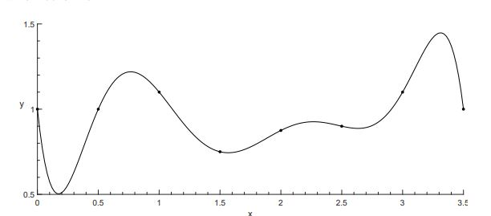
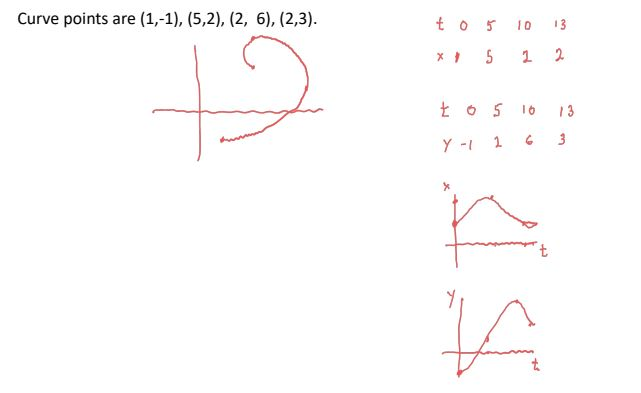
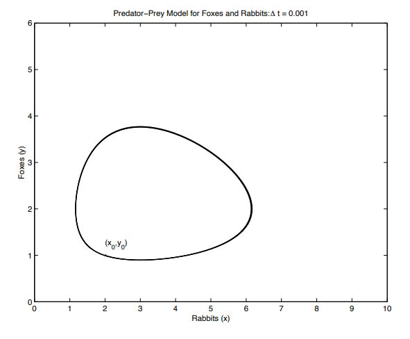
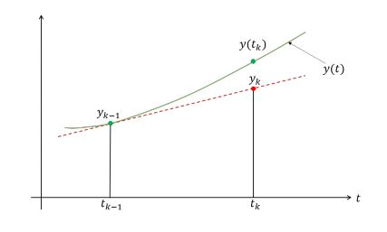
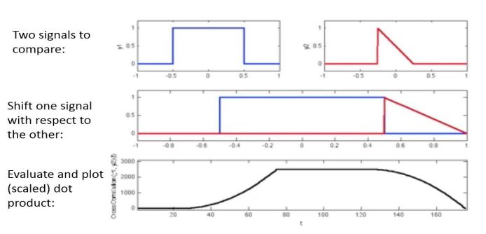
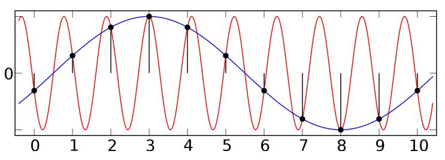
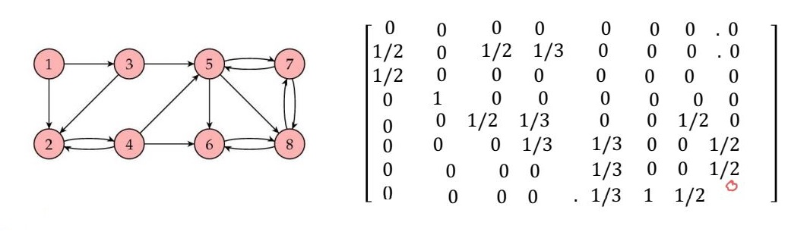

Instructor: George Labahn

- [Week 1. May 10](#week-1-may-10)
- [Week 2. May 17](#week-2-may-17)
- [Week 3. May 25](#week-3-may-25)
- [Week 4. June 1](#week-4-june-1)
- [Week 5. June 7](#week-5-june-7)
- [Week 6. June 15](#week-6-june-15)
- [Week 7. June 21](#week-7-june-21)
- [Week 8. June 28](#week-8-june-28)
- [Week 11. July 19](#week-11-july-19)
- [Week 12. July 26](#week-12-july-26)

# Week 1. May 10

prereq:
* calculus (taylor series, derivatives, integrals)
* complex numbers
* big-O
* basic linear algebra
* jupyter

mt (june 24), final (aug 13), 5 assns: 25%, 35%, 40%

## Topic 1: floating point number systems

### pitfalls of computation

__eg.__ compute $e^{-5.5}$ using 5-digit arithmetic

recall:
$$e^x=1+\frac{x}{1!}+\frac{x^2}{2!}+\frac{x^3}{3!}+...$$

so
$$
\begin{aligned}
    e^{-5.5} &= 1+\frac{-5.5}{1!}+\frac{(-5.5)^2}{2!}+\frac{(-5.5)^3}{3!}+... \\
    &\approx 1-5.5+15.125-27.730+...=0.0026363
\end{aligned}
$$

$$
\begin{aligned}
    e^{-5.5} &= \frac{1}{e^{5.5}}=(1+\frac{5.5}{1!}+\frac{5.5^2}{2!}+\frac{5.5^3}{3!}+...)^{-1} \\
    &\approx (1+5.5+15.125+27.730)^{-1}=0.0040865
\end{aligned}$$

why?

__eg.__ let $I_n=\int_0^1\frac{x^n}{x+\alpha}dx$

note
$$
\begin{aligned}
    I_n&=\int_0^1\frac{x^n+x^{n-1}\alpha-x^{n-1}\alpha}{x+\alpha}dx \\
    &=\int_0^1\frac{x^{n-1}(x+\alpha)}{x+\alpha}dx-\int_0^1\frac{\alpha x^{n-1}}{x+\alpha}dx \\
    &=\int_0^1x^{n-1}dx-\alpha\int_0^1\frac{x^{n-1}}{x+\alpha}dx \\
    &=\frac{1}{n}-\alpha I_{n-1}
\end{aligned}
$$

where $I_0=\log(\frac{1+\alpha}{\alpha})$.

```py
import numpy as np

def In(alpha, n):
    I = np.log((1 + alpha) / alpha)
    for n in np.arange(1, n+1):
        I = 1./n - alpha*I
    return I

In(0.5, 100)  # 0.006644371123395131
In(2, 100)  # 6058010443603.891 weird
```

Strange since $I_n=\int_0^1\frac{x^n}{x+\alpha}dx\le\int_0^1\frac{x^n}{1}dx=\frac{1}{n+1}$ if $0\le x\le 1$ and $\alpha>1$. and we should have $I_{100}\le\frac{1}{101}$.

if $I_n^{\mathrm{Exact}}=I_n^\mathrm{Approx}+\mathrm{Err}_n$ then,

$$
\begin{aligned}
    \mathrm{Err}&=I_n^E-I_n^A\\
    &=\left(\frac{1}{n}-\alpha I_{n-1}^E\right)-\left(\frac{1}{n}-\alpha I_{n-1}^A\right) \\
    &=-\alpha(I_{n-1}^E-I_{n-1}^A) \\
    &=-\alpha\mathrm{Err}_{n-1} \\
    |\mathrm{Err}_n|&=|\alpha|^n|\mathrm{Err}_0|
\end{aligned}
$$

* so if $|\alpha|<1$ then $|\mathrm{Err}|\to 0$, the computation is stable.
* if $|\alpha|>1$ then $|\mathrm{Err}|\to \infty$, the computation is unstable.

## float point numbers
* computers can represent numbers by fixed point (int) and floating point (real)
* always in normalized form
* issues:
  * density: only keeps a finite number of digits
  * range: only keeps a finite range of exponent

__see.__ CS251

t: significant digits, L: lower bound, U: upper bound

single precision F(b=2, t=24, L=-126, U=127):
* one bit sign, 23 digits for precision, 8 digits for exponent

double precision F(b=2, t=53, L=-1022, U=1023):
* one bit sign, 52 digits for precision, 11 digits for exponent

note implicit leading 1 in precision is used.

special number:
* 0: 00000000 00000000 00000000 00000000
* __eg.__ suppose in F(10, 8, -35, 35)
  * largest number is 0.99999999 * 10^35
  * smallest number: 0.10000000 * 10^-35
  * anything larger: overflow
  * anything smaller: underflow (typically rounded to 0)

__defn.__ if $x=\plusmn0.x_1...x_tx_{t+1}...*\beta^p$, then $\mathrm{fl}(x)=\plusmn0.x_1...x_t*\beta^p$, ie we use truncation. _relative error_ is

$$
\delta_x=\frac{\mathrm{fl}(x)-x}{x} \\
$$

note $\mathrm{fl}(x)=(1+\delta)x$.

we have
$$
\begin{aligned}
    \delta_x&=\frac{-0.0...0x_{t+1}...}{x_1.x_2...x_tx_{t+1}...}\beta\\
    |\delta_x|&\le\frac{0.x_{t+1}...*\beta^{-t}}{1}\beta\\
    &\le\beta^{1-t} = E
\end{aligned}
$$
this quantity is called _machine epsilon_ E.
* it is independent of the numbers involved
* relates to the number of significant digits in the result (t)
* eg. a result is correct to roughly s digits if relative error  ≈ 10^-s

it also often defined as the smallest positive number E such that $\mathrm{fl}(1.0+E)>1.0$, and also often called _unit round-off error._

if we use rounding we could get $E=\frac{1}{2}\beta^{1-t}$.

### arithmetics

to do arithmetics, we do
* put numbers into a computer (fl())
* do normal arithmetics as two reals
* put number back into the computer

__eg.__ suppose x and y are real numbers, then error of addition:
$$
\begin{aligned}
    x\oplus y&=\mathrm{fl}(\mathrm{fl}(x)+\mathrm{fl}(y)) \\
    &=(\mathrm{fl}(x)+\mathrm{fl}(y))(1+\delta_z)
\end{aligned}
$$
$$
\begin{aligned}
    \left|\frac{x+y-x\oplus y}{x+y}\right|&\le \frac{\left|x+y-(x(1+\delta_x)+y(1+\delta_y))(1+\delta_z)\right|}{|x+y|} \\
    &=\frac{|x\delta_x+y\delta_y+x\delta_z+y\delta_z+x\delta_x\delta_z+y\delta_y\delta_z|}{|x+y|}\\
    &\le \frac{|x||\delta_x|+|y||\delta_y|+|x||\delta_z|+|y||\delta_z|+|x||\delta_x||\delta_z|+|y||\delta_y||\delta_z|}{|x+y|}\\
    &=\frac{(|x|+|y|)}{|x+y|}(2E+E^2)
\end{aligned}
$$
* if x and y are of the same sign then |x+y|=|x|+|y| then the relative error $\le(2E+E^2)$
* if x and y are of the opposite sign and nearly the same size then |x+y| is very small, so the relative error is very large (this is called _catastrophic cancellation_, why the first way of computing e^-5.5 is wrong)

# Week 2. May 17
## Polynomial interpolation
_interpolation_: given n points (x's distinct), find a nice function that go through the points.
* nice means polynomial (of degree at most n-1)
* nice means spline
* points might not be distinct

### vandermonde system
with n points $(x_1,y_1),...,(x_n,y_n)$ and distinct $x_i$'s and a polynomial p(x) of degree at most n-1 satisfying $p(x_1)=y_1,...,p(x_n)=y_n$ results in n equations with n unknowns. In matrix form this is
$$
\begin{bmatrix}
 1&  x_1&  x_1^2& ...& x_1^{n-1}\\ 
 1&  x_2&  x_2^2& ...& x_2^{n-1}\\ 
 ...&  &  & & ...\\ 
 1&  x_n&  x_n^2& ...& x_n^{n-1}
\end{bmatrix}
\begin{bmatrix}
    c_1\\c_2\\...\\c_n
\end{bmatrix}=
\begin{bmatrix}
    y_1\\y_2\\...\\y_n
\end{bmatrix}
$$
the matrix of coefficients is called _vandermande matrix_ V.

we have $|V(x_1,...,x_n)|=\prod_{i<j}(x_i-x_j)$. when x's are distinct then V is nonsigular. the system has a unique solution that always exists.

__eg.__ have four points (1, 1), (-1, 7), (2, 1), (3, -5), find $p(x)=c_1+c_2x+c_3x^2+c_4x^3$.  
substitute the points note we have
$$
\begin{aligned}
    p(1)=\quad&c_1&+c_2&+c_3&+c_4&=1\\
    p(-1)=\quad&c_1&-c_2&+c_3&-c_4&=7\\
    p(2)=\quad&c_1&+2c_2&+4c_3&+8c_4&=1\\
    p(3)=\quad&c_1&+3c_2&+9c_3&+27c_4&=-5
\end{aligned}
$$
use gaussian elimination to get $p(x)=1-2x+3x^2-x^3$.

### lagrange interpolation
_lagrange form_: given distinct points $(x_1,y_1),...,(x_n,y_n)$ and distinct $x_i$'s define
$$
L_i(x)=\frac{(x-x_1)...(x-x_{i-1})(x-x_{i+1})...(x-x_n)}{(x_i-x_1)...(x_i-x_{i-1})(x_i-x_{i+1})...(x_i-x_n)}=\prod_{j\in[n]-\{i\}}\frac{x-x_j}{x_i-x_j}
$$
then the interpolating polynomial is $p(x)=y_1L_1(x)+...+y_nL_n(x)$.

_proof._
* for each $i$ degree of $L_i$ is n-1
* $L_i(x_j)=0$ if $i\ne j$
* $L_i(x_i)=1$
* so $p(x_i)=y_i$, p is the unique interpolating polynomial. $\square$

### cubic hermite interpolation
given 2 points $(x_1,y_1), (x_2,y_2)$ and two derivative values $s_1,s_2$. find a polynomial $S(x)$ of degree at most 3 with
$$
S(x_1)=y_1,S(x_2)=y_2\\
S'(x_1)=s_1,S'(x_2)=s_2
$$
then the polynomial is
$$
S(x)=a+b(x-x_1)+c(x-x_1)^2+d(x-x_1)^3
$$
which is 4 eqs with 4 unknowns. the solution is
$$
\begin{aligned}
    a&=y_1\\
    b&=s_1\\
    c&=\frac{3y'-2s_1-s_2}{\Delta x}\\
    d&=\frac{s_1+s_2-2y'}{\Delta x^2}
\end{aligned}
$$
where $\Delta x=x_2-x_1,\Delta y=y_2-y_1,y'=\frac{\Delta y}{\Delta x}$.

# Week 3. May 25

issues with poly interpolation
* fits point correctly, but might not be so correct elsewhere
* not easy to compute (numerically) for large n

__eg.__  


## Spline interpolation

_piecewise polynomial interpolation_: given n points $(x_1,y_1),...,(x_n,y_n)$ with $x_i$'s distinct. we want to find a piecewise polynomial S(x) s.t.
$$
S(x)=\left\{\begin{matrix}
 S_1(x)&,x_1\le x\le x_2 \\
 ...\\
 S_{n-1}(x)&,x_{n-1}\le x \le x_n
\end{matrix}\right.
$$
with each $S_i(x)$ a polynomial (usually same degrees) and $S(x)=y_i$.

_linear piecewise polynomial_: given n such points, each $S_i(x)$ is line joining $(x_i,y_i)$ to $(x_{i+1},y_{y+1})$ (a poly with degree <= 1).


* problem: not continuous

### cubic spline interpolation
given n points $(x_1,y_1),...,(x_n,y_n)$ with $x_i$'s distinct. we want to find a piecewise polynomial S(x) s.t.
$$
S(x)=\left\{\begin{matrix}
 S_1(x)&,x_1\le x\le x_2 \\
 ...\\
 S_{n-1}(x)&,x_{n-1}\le x \le x_n
\end{matrix}\right.
$$

with each $S_i(x)$ a polynomial of degree at most 3 satisfying
* $S(x_i)=y_i$
* $S(x)\in C^2$

__remark.__ cubic spline interpolation is not unique.
* n points => n-1 intervals, and each interval has 4 unknowns (deg 3 poly) => 4(n-1) unknowns
* we have 2(n-1)+2(n-2) conditions
  * for every interval, $S(x_i)=y_i$ on both sides => 2(n-1) conditions
  * S' continuous (n-2 joining points, their derivative has to match) => (n-2) conditions
  * S'' continuous => (n-2) conditions
* so 2 more unknowns than conditions $\square$

we can use _boundary conditions_ to let the result be unique.

__defn.__ _(natural)_: $S''(x_1)=S''(x_n)=0$.

__defn.__ _(clamped)_: $S'(x_1)=s_1$ and $S'(x_n)=s_n$ where $s_1,s_n$ are given in advance.

__defn.__ _(periodic)_: $S'(x_1)=S'(x_n)$ and $S''(x_1)=S''(x_n)$ (assuming $y_1=y_n$).

__defn.__ _(not-a-knot)_: $S_1'''(x_2)=S_2'''(x_2)$ and $S_{n-1}'''(x_{n-1})=S_n'''(x_{n-1})$.
* forcing first two polys are same, and last two polys are same

__eg.__ by using cubic hermite for each interval $[x_i,x_{i+1}]$, we have
$$
S_i(x)=a_i+b_i(x-x_i)+c_i(x-x_i)^2+d_i(x-x_i)^3
$$
and $S_i(x_i)=y_i,S_i(x_{i+1})=y_{i+1},S_i'(x_i)=s_i,S_i'(x_{i+1})=s_{i+1}$, where $s_i,s_{i+1}$ are unknowns. from here we know $S$ interpolates the points and the derivative is continuous. to let second derivative be continuous, we also have $S_i''(x_{i+1})=S_{i+1}''(x_{i+1})$ for $i=1,...,n-2$. note
$$
S_i''(x)=2c_i+6d_i(x-x_i),\quad S_{i+1}''(x)=2c_{i+1}+6d_{i+1}(x-x_{i+1})
$$
plugging in $x=x_{i+1}$ we get (delta_i is from i to i+1)
$$
c_i+3d_i\Delta x_i=c_{i+1}\\
\frac{3 y_{i}^{\prime}-2 s_{i}-s_{i+1}}{\Delta x_{i}}+3 \frac{s_{i}+s_{i+1}-2 y_{i}'}{\Delta x_{i}^{2}}\Delta x_i=\frac{3 y_{i+1}-2 s_{i+1}-s_{i+2}}{\Delta x_{i+1}}\\
\Delta x_{i+1} s_{i}+2\left(\Delta x_{i}+\Delta x_{i+1}\right) s_{i+1}+\Delta x_{i} s_{i+2}=3\left(\Delta x_{i+1} y_{i}^{\prime}+\Delta x_{i} y_{i+1}^{\prime}\right)
$$
which are n-2 equations for n unknowns.

suppose we want natural boundary conditions: $S''(x_1)=S''(x_n)=0$.

this is the same as $S_1''(x_1)=S_{n-1}''(x_n)=0$. combine the equations for $\{S_1'',c_1,d_1\}$ and $\{S_{n-1}'',c_{n-1},d_{n-1}\}$ we have additional two eqs.
$$
3y_1'=2s_1+s_2,\quad 3y_{n-1}'=2s_n+s_{n-1}
$$

note the coefficient matrix looks like diagonal and each row has 2 or 3 non-zero values, and it takes O(n) to determine $s_1,...,s_n$.

### parametric curves
given n points $(x_1,y_1),...,(x_n,y_n)$ with $x_i$'s not distinct. we look for a curve $C(t)=(x(t), y(t)),t_1\le t\le t_n$ that goes through the points. steps:
1. get parameter values $t_1,...,t_n$
2. separate x and y into two distinct interpolation problems:
   * find x(t) that interpolates $(t_1,x_1),...,(t_n,x_n)$
   * find y(t) that interpolates $(t_1,y_1),...,(t_n,y_n)$

how to find parameter values?
1. use $t_1=0,t_2=1,...,t_n=n-1$
2. use arc length: $t_1=0,t_{i+1}=t_i+\sqrt{(x_{i+1}-x_i)^2+(y_{i+1}-y_i)^2}$

to plot the curve C(t):
1. determine a set of parameter values $\tau_0,...,\tau_{N},N>>n$
2. plug $\tau_i$ into $x(t),y(t)$ to get $\chi_i,\varphi_i$'s, then plot the points $(\chi_i,\varphi_i)$.

__eg.__  


# Week 4. June 1
## ODEs

__eg.__ _(population model)_ suppose $p'(t)=rp(t),p(t_0)=p_0$ where $r$ is constant, the solution is $p(t)=p_0e^{r(t-t_0)}$.

### general first order ODE
__defn.__ if $\frac{dy}{dt}=f(t,y)$ or $y'(t)=f(t,y(t))$ where $t_0\le t\le t_f$, f is a function of two variables t and y, then $f$ is called _system dynamics function_.

_initial value problem (IVP)_:
let $\mathbf{y}=[y_1,...,y_N]$ and $\mathbf{f}(t,y)=[f_1,...,f_N]$ (function of N+1 variables), $t_0\le t\le t_f$ given
$$
\left\{\begin{aligned}
 \frac{d\mathbf{y}}{dt}&=\mathbf{f}(t,\mathbf{y}) \\ 
 \mathbf{y}(t_0)&=\mathbf{a}
\end{aligned}\right.
$$
what is $\mathbf{y}$?

__eg.__ _(Predator-Prey)_ $x'(t)=x(t)(a-\alpha y(t)),y'(t)=y(t)(-b+\beta x(t))$ where $a,\alpha,b,\beta$ are constants (the populations interact; when there are many prey, predators increase in number ... until they eat too many).



### second order ODE
for $t_0\le t\le t_f$, given
$$
\left\{\begin{aligned}
    \frac{d^2y}{dt^2}&=f(t,y,\frac{dy}{dt})\\
    y(t_0)&=u_0\\
    \frac{dy}{dt}(t_0)&=v_0
\end{aligned}\right.
$$
what is $y$? let $y_1=y,y_2=\frac{dy}{dt}$, we can rewrite it to first order ODE (vector form).

__eg.__ pendulum:
$$
\left\{\begin{aligned}
    &\ddot\theta+\frac{c}{m L} \dot\theta+\frac{g}{L} \sin \theta=0 \\
    &\theta(0)=\theta_{0} \\
    &\dot\theta(0)=v_{0}
\end{aligned}\right.
$$
let $y_1=\theta,y_2=\dot\theta$, then this system is equivalent to:
$$
\left\{\begin{aligned}
    &\dot y_1=y_2\\
    &\dot y_2=-\frac{c}{mL}y_2-\frac{g}{L}\sin(y_1) \\
    &y_1(0)=\theta_{0} \\
    &y_2(0)=v_{0}
\end{aligned}\right.
$$

### forward euler method
consider first order ODE
$$
\left\{\begin{aligned}
    y'(t)&=f(t,y(t))\\
    y(t_0)&=\alpha
\end{aligned}\right.
$$
suppose at $t=t_{k-1}$, we have $y_{k-1}\approx y(t_{k-1})$. at $t=t_k$, we use $y_{k-1}$ to compute $y_k$.

__using geometric__



let $h_{k-1}=t_k-t_{k-1}$ be the _time step size_. by ode, we have $y'(t_{k-1})=f(t_{k-1},y(t_{k-1}))$, we have approximation $y'(t_{k-1})=\text{slope of y at } t_{k-1}\approx\frac{y_k-y_{k-1}}{h_{k-1}}$. we assume our approximation is correct so we replace $y(t_{k-1})$ by $y_{k-1}$ so the approximation is:
$$
\begin{aligned}
    \frac{y_k-y_{k-1}}{h_{k-1}}&=f(t_{k-1},y_{k-1})\\
    y_k&=y_{k-1}+h_{k-1}f(t_{k-1},y_{k-1})
\end{aligned}
$$
this requires one function evaluation for each time step.

__using taylor expansion__

_local truncation error_: assume timestep is constant h and we have a method computing $y_k$. then $y_k-y(t_k)=O(h^{p+1})$. the bigger p the better.

by taylor, we have $y(t_k)=y(t_{k-1}+h_{k-1})=y({t_{k-1}})+h_{k-1}y'(t_{k-1})+\frac{h^2_{k-1}}{2!}y''(\epsilon_k)$ where $t_{k-1}<\epsilon_k<t_k$. substitute the ode we have $y\left(t_{k}\right)=y\left(t_{k-1}\right)+h_{k-1} f\left(t_{k-1}, y\left(t_{k-1}\right)\right)+O(h^{2})$. use the approximation $y(t_{k-1})\rightarrow y_{k-1},y(t_k)\rightarrow y_k$ we get the result. and $y(t_k)-y_k=O(h^2)$.

__eg.__ compute
$$
\left\{\begin{aligned}
    y'(t)&=\sin t-\cos y(t)\\
    y(0)&=1
\end{aligned}\right.
$$

we use even interval $h=\frac{1}{N}$ (ie $t_0=0,t_1=h,...,t_N=1$).

1. let $y_0=1$
2. for $k=1,2,...,N$, do $y_k=y_{k-1}+h\cdot(\sin t_{k-1}-\cos y_{k-1})$

__eg.__ compute
$$
\left\{\begin{aligned}
    x'(t)&=2x(t)-3y(t)\\
    y'(t)&=tx(t)-3y(t)\\
    x(0)&=2\\
    y(0)&=1
\end{aligned}\right.
$$
where $0<t<1$. use interval $h=\frac{1}{N}$ so $t_k=kh$
1. let $[x_0,y_0]=[2,1]$
2. for $k=1,...,N$ do $[x_k,y_k]=[x_{k-1},y_{k-1}]+h\cdot[2x_{k-1}-3y_{k-1},t_{k-1}x_{k-1}-3y_{k-1}]$

# Week 5. June 7

### trapezoid method
__algo.__
$$
\begin{aligned}
    y_0&=\alpha\\
    y_k&=y_{k-1}+\frac{h_{k-1}}{2}(f(t_{k-1},y_{k-1})+f(t_k,y_k))
\end{aligned}
$$
we have to solve for $y_k$ at each step.

__using taylor__

note by taylor
$$
y(t_k)=y(t_{k-1})+hy'(t_{k-1})+\frac{h^2}{2!}y''(t_{k-1})+\frac{h^3}{3!}y'''(\epsilon_k)\\
y'(t_k)=y'(t_{k-1})+hy''(t_{k-1})+\frac{h^2}{2!}y'''(\alpha)
$$

isolate $hy''$ we have $hy''(t_{k-1})=y'(t_k)-y''(t_{k-1})-\frac{h^2}{2!}y'''(\alpha)$, so
$$
\begin{aligned}
    y(t_k)&=y(t_{k-1})+hy'(t_{k-1})+\frac{h}{2!}(y'(t_k)-y'(t_{k-1})-\frac{h^2}{2!}y'''(\alpha))+\frac{h^3}{3!}y'''(\epsilon_k)\\
    &=y(t_{k-1})+\frac{h}{2!}(y'(t_{k-1})+y'(t_k))+O(h^3)\\
    &=y(t_{k-1})+\frac{h}{2!}(f(t_{k-1},y(t_{k-1}))+f(t_k,y(t_k)))+O(h^3)
\end{aligned}
$$
use the approximation $y(t_{k-1})\rightarrow y_{k-1},y(t_k)\rightarrow y_k$ we get the result.

### modified euler method
consider first order ODE
$$
\left\{\begin{aligned}
    y'(t)&=f(t,y(t))\\
    y(t_0)&=\alpha
\end{aligned}\right.
$$

__algo.__ approximate derivative at any point by taking average slope at starting point and approximated endpoint:
$$
\begin{aligned}
    y_0&=\alpha\\
    y_k^*&=y_{k-1}+h_{k-1}f(t_{k-1},y_{k-1})\\
    y_k&=y_{k-1}+\frac{h_{k-1}}{2}(f(t_{k-1},y_{k-1})+f(t_k,y_k^*))
\end{aligned}
$$

__using taylor__

as before:
$$
\begin{aligned}
    y(t_k)&=y(t_{k-1})+\frac{h}{2!}(f(t_{k-1},y(t_{k-1}))+f(t_k,y(t_k)))+O(h^3)\\
    &=y(t_{k-1})+\frac{h}{2}(f(t_{k-1},y(t_{k-1})+f(t_k,y^*_k)))+\frac{h}{2}(-f(t_k,y^*_k)+f(t_k,y(t_k)))+O(h^3)
\end{aligned}
$$
since from forward euler we have $y(t_k)-y^*_k=O(h^2)$, so from taylor of $f(t_k,y(t_k))$ as function of y: $f(t_k,y(t_k))=f(t_k,y^*_k)+O(y(t_k)-y^*_k)=f(t_k,y^*_k)+O(h^2)$. hence

$$
\begin{aligned}
    y(t_k)&=y(t_{k-1})+\frac{h}{2}(f(t_{k-1},y(t_{k-1}))+f(t_k,y^*_k))+\frac{h}{2}O(h^2)+O(h^3)\\
    &=y(t_{k-1})+\frac{h}{2}(f(t_{k-1},y(t_{k-1}))+f(t_k,y^*_k))+O(h^3)
\end{aligned}
$$

### local truncation error
* LTE for forward euler is is $O(h^2)$
* LTE for trapezoid is $O(h^3)$
* LTE for modified euler is $O(h^3)$

__in general__

given $y_n=$ formula in $y_n,y_{n-1},...$, to determine the LTE
1. replace all $y_k$ by the actual values $y(t_k)$ (assume formula is correct)
2. compare taylor of $y(t_n)$ with taylor at $t_n$ and at $t_{n-1}$
   * remember $f(t_k,y(t_k))=y'(t_k)$ and has a taylor expansion


__eg.__ what is error of $y_k=y_{k-1}+\frac{h}{4}f(t_{k-2},y_{k-2})+\frac{3h}{4}f(t_k,y_k)$.
1. replace:
   $$
    \begin{aligned}
    y(t_k)&=y\left(t_{k-1}\right)+\frac{h}{4} f\left(t_{k-2}, y\left(t_{k-2}\right)\right)+\frac{3 h}{4} f\left(t_{k}, y\left(t_{k}\right)\right) \\
    &=y\left(t_{k-1}\right)+\frac{h}{4} y^{\prime}\left(t_{k-2}\right)+\frac{3 h}{4} y^{\prime}\left(t_{k}\right)
    \end{aligned}
   $$
2. expand centered around $t_{k-1}$
   $$
   y'(t_k)=y'(t_{k-1})+hy''(t_{k-1})+\frac{h^2}{2!}y'''(t_{k-1})+...\\
   y'(t_{k-2})=y'(t_{k-1})-hy''(t_{k-1})+\frac{h^2}{2!}y'''(t_{k-1})+...\\
   $$
3. plug in and see where there is a difference between our result and expansion of formula
   $$
   y\left(t_{k}\right)=y\left(t_{k-1}\right)+hy^{\prime}\left(t_{k-1}\right)+\frac{h^{2}}{2}y^{\prime \prime}\left(t_{k-1}\right)+\frac{h^{3}}{2}y^{\prime \prime \prime}\left(t_{k-1}\right)+...\\
   y\left(t_{k}\right)=y\left(t_{k-1}\right)+hy^{\prime}\left(t_{k-1}\right)+\frac{h^{2}}{2}y^{\prime \prime}\left(t_{k-1}\right)+\frac{h^{3}}{6}y^{\prime \prime \prime}\left(t_{k-1}\right)+...\text{(actual formula)}
   $$
it is O(h^3).

### timestamp control
how to determine if numerical method likely gives a correct answer?
* obvious: run the method with timestamp h, then run again with timestamp h/2. compare answers.

we can combine forward euler and modified euler:
$$
y_k^\mathrm{FE}=y(t_k)+Ah^2+O(h^3)\\
y_k^\mathrm{ME}=y(t_k)+O(h^3)
$$
so we have
$$
\text{local error}\approx|Ah^2|=|y_k^\mathrm{FE}-y_k^\mathrm{ME}|
$$

in general, at every timestamp consider two rules, one for order p, one for order p+1, the local error is the difference between two methods: |local error|=$|Ah^p|=|y_k^{(1)}-y_k^{(2)}|$.

if error is too big then reduce timestep h by 2 and repeat.

__eg.__ a common method: runge kutta methods (RKF45)
$$
\begin{aligned}
&k_{1}=h f\left(t_{n}, y_{n}\right) \\
&k_{2}=h f\left(t_{n}+\frac{h}{4}, y_{n}+\frac{k_{1}}{4}\right) \\
&k_{3}=h f\left(t_{n}+\frac{3 h}{8}, y_{n}+\frac{3 k_{1}}{32}+\frac{9 k_{2}}{32}\right) \\
&k_{4}=h f\left(t_{n}+\frac{12 h}{13}, y_{n}+\frac{1932 k_{1}}{2197}-\frac{7200 k_{2}}{2197}+\frac{7296 k_{3}}{2197}\right) \\
&k_{5}=h f\left(t_{n}+h, y_{n}+\frac{439 k_{1}}{216}-8 k_{2}+\frac{3680 k_{3}}{513}-\frac{845 k_{4}}{4104}\right) \\
&k_{6}=h f\left(t_{n}+\frac{h}{2}, y_{n}-\frac{8 k_{1}}{27}+2 k_{2}-\frac{3544 k_{3}}{2565}+\frac{1859 k_{4}}{4104}-\frac{11 k_{5}}{40}\right) \\
&y_{n+1}^{*}=y_{n}+\frac{25 k_{1}}{216}+\frac{1408 k_{3}}{2565}+\frac{2197 k_{4}}{4104}-\frac{k_{5}}{5} \text { with error } O\left(h^{4}\right) \\
&y_{n+1}=y_{n}+\frac{16 k_{1}}{135}+\frac{6656 k_{3}}{12825}+\frac{28561 k_{4}}{56430}-\frac{9 k_{5}}{50}+\frac{2 k_{6}}{55} \text { with error } O\left(h^{5}\right)
\end{aligned}
$$

### timestamp control (2)
instead of dividing by 2, we can also do:

suppose we require $|Ah^p|=|y_k^{(1)}-y_k^{(2)}|$ < TOL, at next step we can change the timestep to some $h_2$:
$$
y_{k+1}^{(1)}=y(t_{k+1})+Ah_2^p+O(h_2^{p+1})\\
y_{k+1}^{(2)}=y(t_{k+1})+O(h_2^{p+1})
$$
now again we want local error = $|Ah_2^p|=\frac{h_2^p}{h^p}|y_k^{(1)}-y_k^{(2)}|$ < TOL. this implies we can use $h_2<\left(\frac{\mathrm{TOL}}{|y_k^{(1)}-y_k^{(2)}|}h\right)^\frac{1}{p}$.

### stability

__eg.__ the system dynamic function is $y'(t)=-\lambda y(t)$ and $y(t_0)=y_0$. if we use forward euler to solve it, we have
$$
\begin{aligned}
    y_k&=y_{k-1}+hf(t_{k-1},y_{k-1})\\
    &=y_{k-1}+h\cdot(-\lambda y_{k-1})\\
    &=y_{k-1}(1-h\lambda)\\
    &=...\\
    &=y_0(1-h\lambda)^k
\end{aligned}
$$
true solution is $y(t)=y_0e^{-\lambda t}$ (goes to 0 as t -> inf). so method is stable when $|1-h\lambda|<1$, or $h<\frac{2}{\lambda}$.

* when using modified euler method, condition is also $h<\frac{2}{\lambda}$.
* using _backward euler_ ($y_{k+1}=y_{k}+h f\left(t_{k+1}, y_{k+1}\right)$) and trapezoid it is always stable.

### event function
__defn.__ _event function_ is a function which changes sign.
* how to tell numerical solver when to stop? trigger an _event_
* event is triggered when event function changes sign, the solver can use it to decide whether to stop or continue

__eg.__ predator catches prey: Event(predator, prey) = |dist(predator, prey)| - ϵ.

__eg.__ we shoot a golf ball with some initial speed. in the middle of the field there is a wall that goes up and down (h = Acos(wt+y)). whenever ball hits the wall, it stops; whenever it hits the group, it also stops. Event(ball, barrier) = |dist(top of barrier to ball)| - ϵ and = |height of ball| - ϵ. [link](https://www.youtube.com/watch?v=_8qjwqXLy8Q)

# Week 6. June 15
## fourier analysis

reviews of algebra:
* $(e^{2j\pi/N})^N=1$.
* $e^{ja}=\cos a+ j\sin a$
* $\cos a=\frac{e^{ja}+e^{-ja}}{2},\sin a=\frac{e^{-ja}-e^{ja}}{2}j$
* $a_k\cos a+b_k\sin a=(\frac{a_k}{2}-\frac{b_k}{2}j)e^{ja}+(\frac{a_k}{2}+\frac{b_k}{2}j)e^{-ja}$
* $a_k\cos \phi+b_k\sin \phi=\sqrt{a_k^2+b_k^2}\cos(\phi+\theta),\tan\theta=-\frac{b}{a}$
* if $W=e^{2j\pi/N}$
  * $\sum_{k=0}^{N-1}W^{kr}=\left\{\begin{aligned}N,&W^r=1\Leftrightarrow r=0\\0,& r\neq 0\end{aligned}\right.$
  * $W$ is the N-th root of unity
  * $W^2,...,W^{N-1}$ are all N-th root of unity too

__defn.__ _fourier series of f(t)_ is $f(t)=a_0+a_1\cos(qt)+b_1\sin(qt)+a_2\cos(2qt)+b_2\sin(2qt)+...=\sum_{k\ge 0}(a_k\cos(kqt)+b_k\sin(kqt))$ where q (=$\frac{2\pi}{T}$) is a constant factor.
* $a_k,b_k$, or $\sqrt{a_k^2+b_k^2}$ measure amount of function/data that repeats k times.

__defn.__ we can write $f(t)=\sum_{k=-\infty}^\infty c_ke^{jkt}$, where $c_0=a_0,c_k=\frac{a_k}{2}-\frac{b_k}{2}j,c_{-k}=\frac{a_k}{2}+\frac{b_k}{2}j$ for k > 0.
* modulus of $c_k$ gives amplitude of given frequency of wave
* argument of $c_k$ gives that frequency's phase

__defn.__ given N points $f_0,...,f_{N-1}$, _discrete fourier transform_ is the N values $F_0,...,F_{N-1}$ where $F_k=\frac{1}{N}(f_0+W^{-k}f_1+W^{-2k}f_2+...+W^{-(N-1)k}f_{N-1})=\frac{1}{N}\sum_{n=0}^{N-1}W^{-nk}f_n$, and $W=e^{2\pi j/N}$.
* note $F_0=\frac{1}{N}\sum_{n=0}^{N-1}f_n$ is the average
* _inverse fourier transform_: $f_k=F_0+W^kF_1+...=\sum_{n=0}^{N-1}W^{nk}F_n$

_proof of inverse dft_:
the dft as matrix operation:
$$
\frac{1}{N}\left[\begin{array}{ccccc}
1 & 1 & 1 & \cdots & 1 \\
1 & W^{-1} & W^{-2} & \cdots & W^{-(N-1)} \\
\vdots & \vdots & \vdots & \cdots & \vdots \\
1 & W^{-(N-1)} & W^{-2(N-1)} & \cdots & W^{-(N-1)(N-1)}
\end{array}\right]\begin{bmatrix}
f_{0} \\
f_{1} \\
\vdots \\
f_{N-1}
\end{bmatrix}=\begin{bmatrix}
F_{0} \\
F_{1} \\
\vdots \\
F_{N-1}
\end{bmatrix}
$$
the inverse dft as matrix operation:
$$
\left[\begin{array}{ccccc}
1 & 1 & 1 & \cdots & 1 \\
1 & W & W^{2} & \cdots & W^{(N-1)} \\
\vdots & \vdots & \vdots & \cdots & \vdots \\
1 & W^{N-1} & W^{2(N-1)} & \cdots & W^{(N-1)(N-1)}
\end{array}\right]\begin{bmatrix}
F_{0} \\
F_{1} \\
\vdots \\
F_{N-1}
\end{bmatrix}=\begin{bmatrix}
f_{0} \\
f_{1} \\
\vdots \\
f_{N-1}
\end{bmatrix}
$$
we want to show the two operations are inverses. their product should have 1 entries on diagonal and 0 otherwise, use the algebra review above. $\square$

__eg.__ suppose all N points are 1, then:
* $F_0=1$
* $F_k=\frac{1}{N}\sum_{n=0}^{N-1}W^{-nk}=\frac{1}{N}(\frac{1-W^{-Nk}}{1-W^{-k}})=0$

__eg.__ suppose $f_k=2^k$, then $F_k=\frac{1}{N}\sum_{n=0}^{N-1}(2W^{-k})^n=\frac{1}{N}(\frac{1-(2W^{-k})^N}{1-2W^{-k}})=\frac{1}{N}(\frac{1-2^N}{1-2W^{-k}})$ (note denominator cannot be 0 since $W^{-k}\neq\frac{1}{2}$).

# Week 7. June 21
### meaning of dft
given N equally spaced samples of a function f(t) over 0 to $2\pi$, this implies we should keep only N coefficients from the fourier series of f(t):
$$
c_{-N/2+1},...c_{-1},c_0,c_1,...,c_{N/2}
$$
where $|c_{-n}|=|c_n|=\frac{\sqrt{a_n^2+b_n^2}}{2}$ is the information about f(t) of frequency k. note $|c_0|,|c_{N/2}|$ are special. we can approximate the fourier series (which is infinite sum) using these N numbers (we lose some info):
$$
f(t)\approx\sum_{k=-\frac{N}{2}+1}^{\frac{N}{2}}c_ke^{jkt}
$$
we have $f_k=f(k\frac{2\pi}{N}),0\le k<N$ and so for each sample $f_k$ we have $f_k=f(t_k)=\sum_{n=-N/2+1}^{N/2}c_ne^{jnt_k}$ where $t_k=\frac{2\pi}{N}k$. let $W=e^{2\pi j/N}$, after some algebra
$$
\begin{aligned}
    f_k&=\sum_{n=0}^{\frac{N}{2}}c_nW^{nk}+\sum_{n=-\frac{N}{2}+1}^{-1}c_nW^{nk}\\
    &=\sum_{n=0}^{\frac{N}{2}}c_nW^{nk}+\sum_{n=-\frac{N}{2}+1}^{-1}c_nW^{(N+n)k}\quad\text{(unity)}\\
    &=\sum_{n=0}^{\frac{N}{2}}c_nW^{nk}+\sum_{n=\frac{N}{2}+1}^Nc_{-n}W^{nk}
\end{aligned}
$$
we have
$$
|F_n|=|F_{N-n}|=|c_{-n}|=|c_n|
$$
the $f_k$ is then the inverse dft:
$$
f_k=\sum_{n=0}^{N-1}W^{nk}F_n\\F_k=\sum_{n=0}^{N-1}W^{-nk}f_n
$$

note
* high frequency in the middle
* low frequency on both sides

# Week 8. June 28
### fast fourier transform
normally computing $F_0,...,F_{N-1}$ we require O(n^2) operations. now assume N is even, and further more is a power of 2. we can compute them in O(NlogN) steps.

__observation.__ if W is an Nth root of unity, then $W^2$ is an $\frac{N}{2}$ root of unity.

__observation.__ if W is an Nth root of unity, then $W^{N/2}=-1$. hence we also have $W^{kN/2}=(-1)^k$.

we separate the computation into k=even terms and k=odd terms.

$$
\begin{aligned}
    NF_k&=\sum_{n=0}^{N-1}f_nW^{-nk}\\
    &=\sum_{n=0}^{N/2-1}f_nW^{-nk}+\sum_{n=N/2}^{N-1}f_nW^{-nk}\\
    &=\sum_{n=0}^{N/2-1}f_nW^{-nk}+(W^{-(N/2)k})\sum_{n=N/2}^{N-1}f_nW^{-(n-N/2)k}\\
    &=\sum_{n=0}^{N/2-1}f_nW^{-nk}+(-1)^k\sum_{n=N/2}^{N-1}f_nW^{-(n-N/2)k}\\
\end{aligned}
$$
when k=2k is even, $(-1)^k=1$, otherwise k=2k+1 $(-1)^k=-1$, let $U=W^2$, so

$$
\begin{aligned}
    \frac{N}{2}F_{2k}&=\sum_{n=0}^{N/2-1}f_nW^{-2nk}+\sum_{n=N/2}^{N-1}f_nW^{-(n-N/2)2k}\\
    &=\sum_{n=0}^{N/2-1}f_nU^{-nk}+\sum_{n=N/2}^{N-1}f_nU^{-(n-N/2)k}\\
    &=\sum_{n=0}^{N/2-1}(f_n+f_{N/2+n})U^{-(n-N/2)k}
\end{aligned}
$$

$$
\begin{aligned}
    \frac{N}{2}F_{2k+1}&=\sum_{n=0}^{N/2-1}f_nW^{-n(2k+1)}-\sum_{n=N/2}^{N-1}f_nW^{-(n-N/2)(2k+1)}\\
    &=\sum_{n=0}^{N/2-1}f_nW^{-n}U^{-nk}-\sum_{n=N/2}^{N-1}f_nW^{-n}U^{-(n-N/2)k}\\
    &=\sum_{n=0}^{N/2-1}(f_n-f_{N/2+n})W^{-n}U^{-(n-N/2)k}
\end{aligned}
$$
the fourier transform can be divided into even and odd terms' fourier transforms.

__algo.__

define two sequences of length N/2:
$$
g_k=\frac{f_k+f_{N/2+k}}{2}\\
h_k=\frac{f_k-f_{N/2+k}}{2}W^{-k}
$$

1. compute fourier transform of $g_0,...,g_{N/2-1}$ to get $G_0,...,G_{N/2-1}$
2. compute fourier transform of $h_0,...,h_{N/2-1}$ to get $H_0,...,H_{N/2-1}$
3. then $F_{2k}=G_k,F_{2k+1}=H_k$
   * ie output $F_0,F_1,...,F_{N-1}=G_0,H_0,G_1,H_1,...,G_{N/2-1},H_{N/2-1}$

cost: C(N) = 2C(N/2) + cN => O(NlogN)

_butterfly algorithm_ (inplace fft):
```
f[n]  ------->  f[n] + f[n+N/2]
      \     ^
       \   /
        \ /
         \
        / \
       /   \
      /     v
f[n+N/2] ----> f[n+N/2] - f[n+N/2]
```

```cs
var N = 2 ** m
var W = e ** (2*j*pi / N)
for k = 1, m:
    for j = 1, 2**(k-1):
        var v = (j - 1) * N
        for n = 0, N / 2 - 1:
            var wf = W ** -n
            var temp = wf * (f[n] - f[n + N/2])
            f[n + v] = 1/2 * (f[n] + f[n + N/2])
            f[n + v + N/2] = temp / 2
    N /= 2
output in reverse binary form // (for 8 nums, F[1] => F[0b001] => F[0b100] => F[4])
```

### signal filtering
basic idea:
* transform time/space data into frequencies via fft
* manipulate data in frequency domain
* transform frequency data into time/space data via inverse dft

__eg.__ given signal 1: sound of both trains and bird sounds. we would like to decompose it into
* signal 2 train whistle sounds: low frequency
* signal 3 bird sounds: high frequency

### correlating two signals
then we want to find M and L such that
* region 1: $F_M<...<F_{M+N/2}$ for middle region of high frequencies
* region 2: $...<F_L, F_{N-L}<...$ for start and end regions of low frequencies.

__defn.__ given two signals $y_0,...,y_{N-1}$ and $z_0,...,z_{N-1}$, the _correlation function_ is $\phi_k=\frac{1}{N}\sum_{n=0}^Ny_{n+k}z_n,k=0,...,N-1$.
* typically we want to find the index k such that $\phi_k$ is maximized.
* if k = n is the maximum value then shifting by n positions gives the best match of data.



wrap-around effects:
* correlation assumes two signals are periodic. in practice, input data are not often periodic, giving _wrap-around_ effects
* to avoid _wrap-around pollution_, we pad both arrays with zeros up to twice their original length
* padding zeros does not change offset

typically computing correlation takes O(n^2). however we can convert the computation into fourier transform:

__algo.__
1. compute fourier transform of $y_0,...,y_{N-1}$ to get $Y_0,...,Y_{N-1}$
2. compute fourier transform of $z_0,...,z_{N-1}$ to get $Z_0,...,Z_{N-1}$
3. multiply $\Phi_k=Y_k\overline{Z_k}$
4. compute inverse ft of $\Phi_0,...,\Phi_{N-1}$ to get $\phi_0,...,\phi_{N-1}$

__proof.__

let $\Phi_k$ be the ft of $\phi_k$, we have $\Phi_k=\frac{1}{N}\sum_{n=0}^{N-1}\phi_nW^{-nk}=\frac{1}{N^2}\sum_{n=0}^{N-1}\sum_{u=0}^{N-1}y_{u+n}z_uW^{-nk}$. 

let $y_{u+n}=\sum_{s=0}^{N-1}Y_sW^{s(u+n)}$, $z_u=\sum_{v=0}^{N-1}Z_vW^{vu}$, then
$$
\begin{aligned}
&\Phi_{{k}}=\frac{1}{N^{2}} \sum_{n=0}^{N-1} \sum_{u=0}^{N-1} \sum_{s=0}^{N-1} Y_{{s}} {W}^{(u+{n}) {s}} \sum_{v=0}^{N-1} Z_{{v}} {W}^{{vu}} {W}^{-{nk}} \\
&=\frac{1}{N^{2}} \sum_{S=0}^{N-1} Y_{{s}} \sum_{v=0}^{N-1} Z_{{v}} \sum_{n=0}^{N-1} \sum_{u=0}^{N-1} {~W}^{{u}({s}+{v})} {W}^{{n}({s}-{k})} \\
&=\frac{1}{N^{2}} \sum_{s=0}^{N-1} Y_{{s}} \sum_{v=0}^{N-1} Z_{{v}} \sum_{u=0}^{N-1} {~W}^{{u}({s}+{v})} \sum_{n=0}^{N-1} {~W}^{{n}({s}-{k})} \\
&=\frac{1}{N} \sum_{s=0}^{N-1} Y_{{s}} \sum_{v=0}^{N-1} Z_{{v}} \sum_{u=0}^{N-1} {~W}^{{u}({s}+{v})} \delta_{{s}, {k}} \\
&=\frac{1}{N} {Y}_{{k}} \sum_{v=0}^{N-1} Z_{{v}} \sum_{u=0}^{N-1} {~W}^{{u}({k}+{v})} \\
&={Y}_{{k}} \sum_{v=0}^{N-1} Z_{{v}} \delta_{{v}, {N}-{k}} \\
&={Y}_{{k}} {Z}_{{N}-{k}} \\
&={Y}_{{k}} \overline{{Z}_{{k}}}
\end{aligned}
$$
where $\delta_{s,k}$ = 1, when s = k, 0 otherwise. $\square$

### signal aliasing
__defn.__ _fourier frequency_ is the number of cycles per second = $\frac{k}{T}=\frac{kF_S}{N}$, where sampling rate $F_S=\frac{N}{T}$ = number of discrete samples per second.

if a real input signal contains high frequencies, but the spacing of discretely sampled data points is inadequate, then _aliasing_ occur.



(wagon-wheel effect; stationary rotor of helicopter)

recall for $f_k=f(k\frac{2\pi}{N})$, we have $F_k=c_k+c_{k+N}+c_{k-N}+c_{k+2N}+c_{k-2N}+...$, sums of true continuous fourier series coefficients $c_k$ of increasing frequency. so frequencies $c_k$ for $|k|>\frac{N}{2}$ get aliased to lower frequencies. (?)

to avoid aliasing:
* increase sampling resolution to capture higher frequencies
* filter before sampling to remove (too) high frequencies so they do not cause aliasing

### data compression


consider 1D array of greyscale.


a dominant pattern appears 4 times, so $F_4$ is large. we can discard data with less frequencies.

1D compression strategy:
* create an (approximate) compressed version of the image $f_n$ by throwing away $f^*$ 'small' fourier coefficients such that $|F_k|$ < TOL
* run inverse dft to get modified pixels $f^*_n$ to reconstruct the image
* discard imaginary parts of $f^*_n$ to ensure new data is strictly real


### image processing in 2D
consider 2D image in grey scale with a 2D array X with MN pixels. assume data is scaled so that $0\le X(i,j)\le 1$.

we move from time/space domain to frequency domain using 2D dft:
$$
\begin{aligned}
    F_{j,k}&=\frac{1}{MN}\sum_{n=0}^{N-1}\sum_{m=0}^{M-1}f_{n,m}W_N^{-nk}W_M^{-mj}\\
    &=\frac{1}{N}\sum_{n=0}^{N-1}W_N^{-nk}\left(\frac{1}{M}\sum_{m=0}^{M-1}f_{n,m}W_M^{-mj}\right)\quad\text{(DFT per row)}
\end{aligned}
$$
where $W_N$ is Nth root of unity and $W_M$ is Mth root of unity.

the 2D FFT can be computed efficiently using nested 1D FFTs:
1. transform each row (separately) using 1D fft
2. transform each column of the result using 1D fft

complexity: $O(MN(\log M+\log N))$.

### JPEG
1. break down image into 8x8 blocks - image does not change very much in such small block
2. transform each block from spatial to frequency domain using 2D discrete cosine transform
   * $F_{u,v}=c\sum_{n=0}^7\sum_{m=0}^7f_{n,m}\cos\frac{2n+1}{16}\pi u \cdot\cos\frac{2m+1}{16}\pi v$
   * helps separate image into parts of differing importance
3. reduce blocks in order to reduce size of higher frequencies
   * keep F[0,0] separate (DC component)
   * then reduce size of all other components via _quantization table_ Q
     * Fnew[j,k] = round(F[j,k] / Q[j,k])
   * then reduce higher frequency values more ie discard unnecessary info
4. entropy encoding: treat DC component separate since it is usually large. save first value then determine difference for each block afterwards
5. convert 2D array into 1D array using a zigzag pattern - compress by skipping 0 continuous values

# Week 11. July 19

## linear algebra
### solving system of linear equations
recall:
* _elementary matrix_ is identity matrix with single row operation
* row operations are same as multiplication on the left by elementary matrix

given nonsigular matrix A and vector $\mathbf{b}$, solve $A\mathbf{x}=\mathbf{b}$ for $\mathbf{x}$.

steps:
1. _LU decomposition_: factor A into $A = LU$ where L is lower triangular and U is upper triangular
   * do gaussian elimination on A keeping operations in L
     * if $E_1,...,E_n$ are some row operations, then to get an upper triangular U matrix from A, we did $E_n...E_1A=U$. then $A=(E_n...E_1)^{-1}U=(E_1^{-1}...E_n^{-1})U=:LU$.
2. solve $L\mathbf{y}=\mathbf{b}$
   * apply same operations to $\mathbf{b}$ getting result $\mathbf{y}$ (forward solve)
3. solve $U\mathbf{x}=\mathbf{y}$
   * (backward solve)

__eg.__ solve Ax=b:
$$
\begin{bmatrix}
1&2&3 \\
4&5&6 \\
7&8&1
\end{bmatrix}\begin{bmatrix}
    x_1\\x_2\\x_3
\end{bmatrix}=\begin{bmatrix}
    4\\4\\-4
\end{bmatrix}
$$

first perform factorization A=LU:
$$
\begin{bmatrix}
1&2&3 \\
4&5&6 \\
7&8&1
\end{bmatrix}=\begin{bmatrix}
1&0&0 \\
4&1&0 \\
7&2&1
\end{bmatrix}\begin{bmatrix}
1&2&3 \\
0&-3&-6 \\
0&0&-8
\end{bmatrix}
$$
then solve Ly=b:
$$
\begin{bmatrix}
1&0&0 \\
4&1&0 \\
7&2&1
\end{bmatrix}\begin{bmatrix}
y_1 \\
y_2 \\
y_3
\end{bmatrix}=\begin{bmatrix}
4\\4\\-4
\end{bmatrix}
$$
note we can get $y_1=4$ directly, then use this to compute $y_2$, then use them to compute $y_3$. we have $\mathbf{y}^T=[4,-12,-8]$.

finally solve Ux=y:
$$
\begin{bmatrix}
1&2&3 \\
0&-3&-6 \\
0&0&-8
\end{bmatrix}\begin{bmatrix}
x_1 \\
x_2 \\
x_3
\end{bmatrix}=\begin{bmatrix}
4\\
-12\\-8
\end{bmatrix}
$$

note we get $x_3=1$ directly, then use this to compute $x_2$, then use them to compute $x_1$. we have $\mathbf{x}^T=[-3,2,1]$.

cost:
* factoring A=LU
  * for first column of A, do row operations to eliminate 2nd to last elements; for second column, eliminate 3rd to last elements, etc. in total $(n-1)^2+(n-2)^2+...+1+0=\frac{(n-1)n(2n-1)}{6}=\frac{1}{3}n^3+O(n^2)$ ops.
* forward solve: $1+2+...+(n-1)=\frac{(n-1)n}{2}=\frac{n^2}{2}+O(n)$
* backward solve: same as forward solve

### PLU decomposition

LU decomposition does not work when pivot is 0 => we have 0 on diagonal and we need to swap rows to preceed.

$$
\left[\begin{array}{ccc|c}
0 & 4 & 5 & 1 \\
-2 & 3 & 3 & -2 \\
3 & 0 & 6 & 9
\end{array}\right]\Rightarrow\left[\begin{array}{ccc|c}
-2 & 3 & 3 & -2 \\
0 & 4 & 5 & 1 \\
3 & 0 & 6 & 9
\end{array}\right]
$$

we need to permute rows => a permutation matrix P so that PA = LU.

steps:
1. _PLU decomposition_: factor A into $PA = LU$ where L is lower triangular and U is upper triangular
2. solve $L\mathbf{y}=\mathbf{b'}$ (b': permuted version of b)
3. solve $U\mathbf{x}=\mathbf{y}$

start with P set to nxn identity matrix I. whenever we swap a pair of rows during LU factorization, also swap corresponding rows of P, the final P is the permutation matrix (in implementation, we do not store P explicitly).

what happens when pivot is nearly 0? forming $\frac{a_{ik}}{a_{kk}}$ gives number of large magnitude, causing large float point error during subtraction and magnify existing error.

_partial pivoting_ strategy: find the row with entry having largest magnitude in current column beneath current row. swap rows if its entry has larger magnitude than diagonal entry.

__eg.__ consider in 4-digit arithmetic.
$$
\left\{\begin{matrix}
    10^{-5}x+y=1\\
    x+y=2
\end{matrix}\right.
$$

pivot is $10^{-5}$. multiple first row by $10^{5}$ we have $(1-10^5)y=2-10^5\Rightarrow (10^5-1)y=10^5-2\Rightarrow 99999y=99998\Rightarrow 9999y=9999$ (truncation) so $y=1$ and $x=0$.

if we switch rows, the pivot is 1
$$
\left\{\begin{matrix}
    x+y=2\\
    10^{-5}x+y=1\\
\end{matrix}\right.
$$
and $(1-10^{-5})y=1-2\cdot10^{-5}\Rightarrow y=1,x=1$ which is better solution.

# Week 12. July 26

### conditioning of matrix
we want to recognize when matrix might be ill-formed for solving. this is what would happen if we get one answer for solving Ax=b but significantly different answer when we perturb b slightly. we want to measure the matrix A.

__defn.__ $||\cdot||$ is a _matrix norm_ if
1. $||A||\geq 0$ and $||A||=0\iff A=0$
2. $||cA||=|c|||A||$ for any scalar c
3. $||A+B||\leq||A||+||B||$ (triangle inequality)
4. $||AB||\leq ||A||\cdot||B||$ (show by using 4.)
5. $||A\mathbf{v}||\leq||A||\cdot||\mathbf{v}||$ (obvious from following defn)
6. $||I_n||=1$

__defn.__ if $||\,||$ is a vector form then we can define a matrix norm by $||A||=\max_{\mathbf{x}\neq \mathbf{0}}\frac{||A\mathbf{x}||}{||\mathbf{x}||}$ for any vector $\mathbf{x}$.

__prop.__
* $||A||_1=\max_j\sum_{i=1}^n|A_{ij}|$ = maximum column sum
* $||A||_2=\sqrt{|\lambda|}$ where $\lambda$ is largest eigenvalue of $AA^\intercal$
* $||A||_\infty=\max_i\sum_{j=1}^n|A_{ij}|$ = maximum row sum

when we work in float point environment we get $A\mathbf{x}^\mathrm{num}=\mathbf{b}^\mathrm{num}$. having accurate solution means we want small $\frac{||\Delta \mathbf{x}||}{||\mathbf{x}||}$ where $\Delta\mathbf{x}=\mathbf{x}^\mathrm{exact}-\mathbf{x}^\mathrm{num}$, however we cannot measure this relative error because we do not know the exact solution. we can measure the residual $\frac{||\Delta\mathbf{b}||}{||\mathbf{b}||}$ where $\Delta\mathbf{b}=\mathbf{b}^\mathrm{exact}-\mathbf{b}^\mathrm{num}$. we want to connect them.

to determine accuracy we want to estimate:
* relative change in $\mathbf{x}$ due to relative change in $\mathbf{b}$: $\frac{||\Delta\mathbf{x}||}{||\mathbf{x}||}\leq(||A||\cdot||A^{-1}||)\frac{||\Delta\mathbf{b}||}{||\mathbf{b}||}$
  * _proof._ note we have $A\Delta\mathbf{x}=\Delta\mathbf{b}\implies \Delta\mathbf{x}=A^{-1}\Delta\mathbf{b}\implies||\Delta\mathbf{x}||=||A^{-1}\Delta\mathbf{b}||\leq||A^{-1}||||\Delta\mathbf{b}||$. also $||\mathbf{b}||=||A\mathbf{x}||\leq||A||||\mathbf{x}||\implies \frac{1}{||\mathbf{x}||}\leq\frac{||A||}{||\mathbf{b}||}$. $\square$
* relative change in $\mathbf{x}$ due to change in $A$: $\frac{||\Delta\mathbf{x}||}{||\mathbf{x}+\Delta\mathbf{x}||}\leq(||A||\cdot||A^{-1}||)\frac{||\Delta A||}{||A||}$ (how to show?)

__defn.__ the _condition number_ of matrix A is denoted $\kappa(A)=||A||\cdot||A^{-1}||$.
* different for different matrix norms
* $\kappa\approx1$: A is well-conditioned
* $\kappa\gg1$: A is ill-conditioned

suppose $\kappa(A)\approx\beta^q$, from $\frac{||\Delta\mathbf{x}||}{||\mathbf{x}||}\leq\kappa(A)\frac{||\Delta\mathbf{b}||}{||\mathbf{b}||}$ we estimate
* relative error $\frac{||\Delta\mathbf{b}||}{\mathbf{b}}$ is at level of roundoff error - eg $\beta^{1-t}$ ie last digit.
* so relative error $\frac{||\Delta\mathbf{x}||}{\mathbf{x}}$ magnifies this by $\beta^q$ and so is around $\beta^{q+1-t}$ ie last q digits.

__improving solutions:__

recall we wanted $A\mathbf{x}=\mathbf{b}$ but get $A\mathbf{x}^\mathrm{num}=\mathrm{b}^\mathrm{num}$, now $\mathbf{x}=\mathbf{x}^\mathrm{num}+\Delta\mathbf{x}$ and $\mathbf{b}=\mathbf{b}^\mathrm{num}+\Delta\mathbf{b}$ so $A\Delta\mathbf{x}=\Delta\mathbf{b}$. we can solve this equation (cheap as we have done row reduction for A) to get estimate for $\Delta\mathbf{x}$. then $\mathbf{x}^\mathrm{new}=\mathbf{x}+\Delta\mathbf{x}$ is an improved solution.

### page rank
we represent web's structure as a directed graph. nodes represent pages, arcs represent links from one page to another. (out)degree of a node is defined as number of edges leaving that node. web is stored as an adjacency matrix (the degree of node is sum of its column).

_local importance_: we interpret links as _votes_: if page j links to page i, this is considered a vote by j that i is important. outgoing links of a page j have equal influence, so the importance that j gives to i is $\frac{1}{\mathrm{deg}(j)}$.

```
         2 -----------+
                      v
+-------------------- 4
v                     |
5 ------------> 6 <---+

page 4 gives importance of 1/2 to page 5
```
so if page i has many incoming links, it is probably important.

_global importance_: what if page j only has one link to it but that page is important? => a node is important if important nodes link to it (this is a bit recursive)

ranking by random surfer model:
* user starts at random page (with all pages equally likely) and follows links at random for k steps
* user will probably end up on important pages more often
* select new start page and follow k random links again. repeat r times.
* at the end, we estimate overall importance as $\mathrm{Rank}(\text{page }i) =\frac{\text{\# visits to }i}{\text{\# visits}}$

issues:
* large size of web: many pages and links, many iterations
* number of steps taken per random surf sequence must be large
* major issue: dead end links (stuck on one page)
* major issue: cycles in graph (stuck in a closed subset of pages)

we can view actions of random surfer as transition matrix on the web

__defn.__ if the surfer is at node i then all outnodes are equally likely, we define 
$$
P_{ij}=\left\{\begin{matrix}
    \frac{1}{\mathrm{deg}(j)},&\text{link }j\text{ to }i\text{ exists}\\
    0,&\text{else}
\end{matrix}\right.
$$
then probability that the random surfer is at node i after k steps is $m_i^{(k)}=\sum_{j=1}^R P_{ij}m_j^{(k-1)}$.


__defn.__ let $\mathbf{e}=[1,...,1]^\intercal$ and $\mathbf{d}=[d_1,...,d_R]^\intercal$ where $d_i=1$ if i is a dead end node, then $\frac{1}{R}\mathbf{e}\mathbf{d}^\intercal$ is a matrix of probabilities which transitions from a dead end node to any other node with equal probability.
* we add this to P so it it possible to avoid being stuck at a dead end node

__defn.__ let $\mathbf{e}=[1,...,1]^\intercal$, then $\frac{1}{R}\mathbf{e}\mathbf{e}^\intercal$ is a matrix of probabilities which transitions to any other node with equal probability.
* to restart and escape cycles

__defn.__ we define _google matrix_ as $M=\alpha(P+\frac{1}{R}\mathbf{e}\mathbf{d}^\intercal)+(1-\alpha)\frac{1}{R}\mathbf{e}\mathbf{e}^\intercal$ where $0<\alpha<1$. so
* $\alpha$ is fraction of time random surfer follows links and special action and dead end nodes
* $1-\alpha$ is fraction of time random surfer restarts



__property.__ _(1)_ each element of M satisfies $0\leq M_{ij}\leq 1$, and columns of M all add to 1. so M is still a _markov matrix_.

__property.__ _(2)_ if $\mathbf{x}=[x_1,...,x_R]^\intercal$ sums to 1, then $\mathbf{y}=M\mathbf{x}$ sums to 1.

__property.__ _(3)_ 1 is an eigenvalue of M, so $M\mathbf{x}=1\mathbf{x}$.  
_pf._ note $M^\intercal\mathbf{e}=\mathbf{e}$. $\square$

__property.__ _(4)_ if $\lambda_1,...,\lambda_R$ are eigenvalues of M then $|\lambda_1|,...,|\lambda_R|\leq 1$.  
_proof._ for each eigenvalue $\lambda$, we have $M^\intercal\mathbf{v}=\lambda\mathbf{v}$ for all $\mathbf{v}$. then for all i, $m_{1i}v_1+...+m_{Ri}v_R=\lambda v_i\implies|\lambda v_i|\leq m_{1i}|v_1|+...+m_{Ri}|v_R|\leq (m_{1i}+...+m_{1R})\max_{1\leq k\leq R}|v_k|=1\cdot\max_{1\leq k\leq R}|v_k|$, so $|\lambda|\leq\frac{|v_i|}{\max_{1\leq k\leq R}|v_k|}\leq 1$. $\square$

__property.__ _(5)_ M has only one eigenvalue of length 1. all others are less than 1.

__property.__ _(6)_ if M has eigenvalues $1=\lambda_1\geq|\lambda_2|\geq...\geq|\lambda_R|$ and $\mathbf{x}^{(0)}=[\frac{1}{R},...,\frac{1}{R}]^\intercal$, then there are eigenvectors $\mathbf{v}_i$ such that $\mathbf{x}^{(0)}=\sum_{i=1}^Rc_i\mathbf{v}_i$.

_page rank algorithm_:
1. let $M=\alpha(P+\frac{1}{R}\mathbf{e}\mathbf{d}^\intercal)+(1-\alpha)\frac{1}{R}\mathbf{e}\mathbf{e}^\intercal$ where $0<\alpha<1$
2. let $\mathbf{x}^{(0)}=[\frac{1}{R},...,\frac{1}{R}]^\intercal$ (start with equal probs)
3. for k = 1 to _stopping criterion_:
   1. $\mathbf{x}^{(k)}=M\mathbf{x}^{(k-1)}$
4. ranking vector is then $\lim_{k\rightarrow\infty}\mathbf{x}^{(k)}=:\mathbf{x}^{(\infty)}$
   * pages with more probability is more important
   * note eventually $M\mathbf{x}^{(\infty)}=\mathbf{x}^{(\infty)}$, ie we are at a fixed point.

P is sparse while M is dense, but M is special and we can do $M\mathbf{x}$ without dense linear algebra,
1. first do $\mathbf{y}=P\mathbf{x}$ via sparse matrix multiplication, ie $y_i=p_{i1}x_1+...+p_{ik}x_k$
2. similarly we include dead end pages directly via $y_i\leftarrow y_i+x_1+...+x_k$
3. so final $\mathbf{y}=M\mathbf{x}$ has components $y_i=\alpha(p_{i1}x_1+...+p_{ik}x_k+x_1+...+x_k)+\frac{1-\alpha}{R}$

convergence: by using property 6, we have $\mathbf{x}^{(k)}=c_1\mathbf{v}_1+ \sum_{i=2}^Rc_i\lambda_i^k\mathbf{v}_i\rightarrow c_1\mathrm{v}_1$ as $k\rightarrow\infty$. second eigenvalue tells us when to stop, and is $\lambda_2=\alpha$. our stopping criterion is then $|\lambda_2|^{k-1}<\epsilon$. if we have precision 8 and $\alpha=.85$ we would stop at iteration 114.
