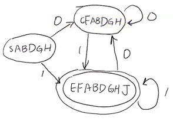
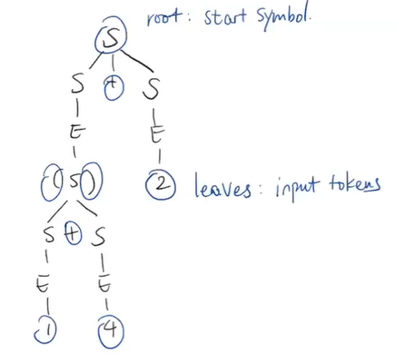
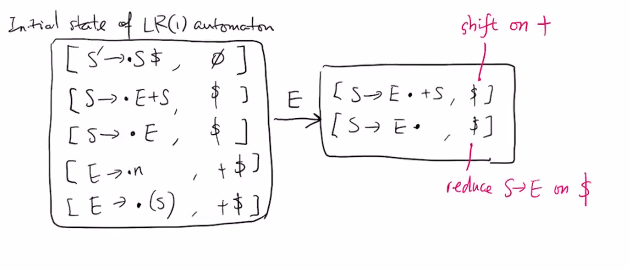
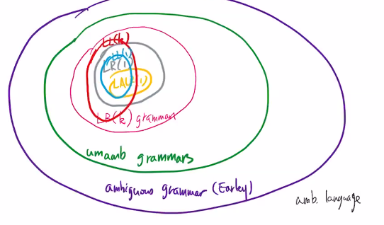
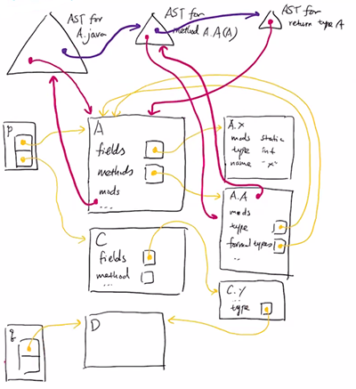
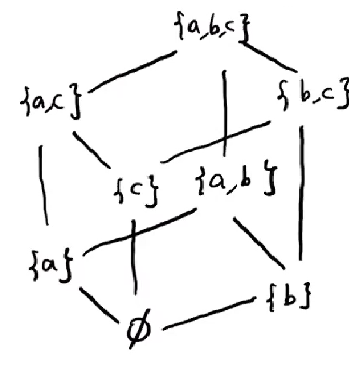
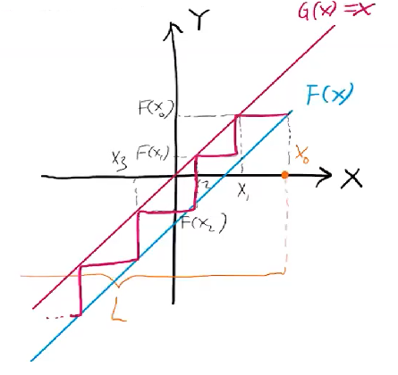
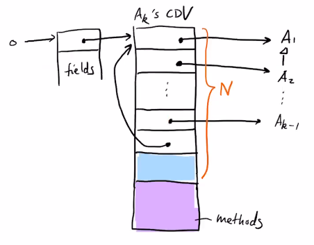
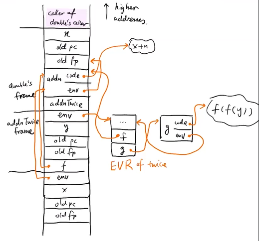

instructor: Yizhou Zhang 

E21736 TTh 10-12:00

https://student.cs.uwaterloo.ca/~cs444/

https://student.cs.uwaterloo.ca/~cs444/joos/features/

https://uwaterloo.zoom.us/j/99282696444?pwd=R1FCWEgraTJsYWZXVWFlS0NKZ29zUT09

assn * 6 (63%) + secret test (10%) + fe (25%)

- [Week 1. Jan 10](#week-1-jan-10)
- [Week 2. Jan 17](#week-2-jan-17)
- [Week 3. Jan 24](#week-3-jan-24)
- [Week 4. Jan 31](#week-4-jan-31)
- [Week 5. Feb 7](#week-5-feb-7)
- [Week 6. Feb 14](#week-6-feb-14)
- [Week 8. Feb 28](#week-8-feb-28)
- [Week 9. Mar 7](#week-9-mar-7)
- [Week 10. Mar 14](#week-10-mar-14)
- [Week 11. Mar 21](#week-11-mar-21)
- [Week 12. Mar 28](#week-12-mar-28)
- [Week 13. Apr 4](#week-13-apr-4)


# Week 1. Jan 10

big picture:
* front end (machine independent)
  * lexical analysis (tokenization)
  * parsing: create AST
  * semantic analysis: eg decorate AST with types
  * intermediate code generation
* back end
  * optimizations; code generation
  * register allocation and optimization

bigger picture: compiler => assembler => linker => loader

## lexing/tokenization

```java
if (b == c) /* ... */ a += "hi";
^  ^^ ^  ^^ ^         ^ ^  ^   ^
```
tokens: integer literal, string literals, keywords, operators, comment

given input string, we ignore comments, whitespaces (javadoc comments are exception).

the token class includes token type + attribute + metadata (eg source location)

__eg.__ naive scanning identifier
```cpp
while true:
    auto c = input.read()
    if !idChar(c):
        break
    id.append(c)
```
challenges: no backtracking (cannot handle overlapping tokens), no lookaheads

improved:
```cpp
while idChar(input.peek()):
    id.append(input.read())
```

one can use _regular expressions_ to define legal tokens to synthesize such lexer code.
|R|L(R)|meaning|
|:-|:-:|-:|
|a|{"a"}
|ϵ|{""}
|R\|S|L(R) ∪ L(S)|alternation
|R⋅S|{rs: r∈L(R), s∈L(S)}|concatenation
|R*|L(ϵ) ∪ L(R) ∪ L(RR) ∪ ...|kleene star

extensions
|R|L(R)|
|:-|:-:|
|R?|R\|ϵ
|R+|R(R*)
|[abc]=[a-c]|a\|b\|c
|[^ab]|any char not a or b
|.|[^\n]
|[^]|any char

lex generators: lex/flex/jflex/...
* input: RE + action for each token
* output: node that resulted action on matched token
* actions:
  * create/discard tokens
  * raise errors
  * side effects
* abbreviations
  * eg `digit = [0-9]`
  * `posint = [1-9]{digit}*`
  * `id = [a-z]{id}*|[a-z]` (note: not an RE)

_language matching token rule_: always match the longest token.

__eg.__ how would java tokenize `elsex = 0` ?  most languages will treat `elesx` as an identifier.

__eg.__ how would java tokenize `x = +++y` ?  
* if we follow longest token rule, then we have `"x" "=" "++" "+" "y"`, and we have errors.
* it would typecheck if we treated it as 3 plus tokens
* in Joos, it does not support `++`, so output error

__eg.__ how would java tokenize `a++b` ?
* can have `"a" "++" "a"` and faills parsing
* can have `"a" "+" "+" "a"` and passes parsing
* in Joos, we would have `"a" "++" "a"` and reject

__eg.__ how would java tokenize `List<List<Integer>>` ?
* if we follow longest token rule, then we treat `>>` as one token and fail
* java fixes it by adding a special rule

how does lexer generator work?  given spec
```
spec = re1 {act}
 | re2 {act}
 | ...
// in decreasing order
```
it does spec => NFA => DFA => loop + table.

__defn.__ a _DFA_ consist of:
* initial state $q_0$
* alphabet Σ
* final state F
* transition function $\delta(q,c)=q'$

```cpp
auto q = q0
while i <= len(input):
    q = delta(q, input[i]):
    ++i
if q in F:
    ...
```

# Week 2. Jan 17
### computing delta
strawman idea: directly map RE to DFA. but things like `R1="IF",R2="IDENT"` do not not work in general. we need to convert to NFA first.

__defn.__ an _NFA_ is a DFA plus
* transitions labelled by ϵ
* multiple exit arrows with same label
* accepts if there is any way to reach final state

__algo.__ _(RE to NFA method)_ suppose $[[R]]$ denotes a DFA for a regular expression with one enter and one exit state. we use base cases:
```
               a
[[a]] = -> ◯ ---> ◎

               ϵ
[[ϵ]] = -> ◯ ---> ◎
```
and induction cases
```
                       ϵ
[[R1⋅R2]] = -> [[R1]] ---> [[R2]]  (change R1's final state to non-final)

 
                  [[R1]]
               ϵ /       \ ϵ
[[R1|R2]] =  -> ◯        ◎       (change R1,R2's final state to non-final)
               ϵ \       / ϵ
                  [[R2]]

                 ϵ          ϵ
           -> ◯ ---> [[R]] ---> ◎
               |       ^ |       ^
[[R*]] =       |       | | ϵ     |  (change R's final state to non-final)
               |       +-+       |
               +-----------------+
                        ϵ
```

__eg.__ convert `(0|1)*1` to NFA.  


NFA-DFA idea: a DFA state = set of all NFA states that can be reached by reaching same sequence of symbols.

__defn.__ the ϵ-closure of q is the set of states reachable from q using >= 0 ϵ-edges.
* base case: $q\in\epsilon-\mathrm{closure}(q)$;
* inductive: $q'\rightarrow q''\text{ via }\epsilon,q'\in\epsilon-\mathrm{closure}(q)\implies q''\in\epsilon-\mathrm{closure}(q)$

__eg.__ `ϵ-closure(G) = {G, H}, ϵ-closure(F) = {F, G, H, A, B, D}, ϵ-closure({G, F}) = ϵ-closure(G) ∪ ϵ-closure(F)`.

__algo.__ _(computing ϵ-closure)_  
equations:
* `ϵ-closure[q][q] = true`
* `ϵ-closure[q][q'] = ` $\bigvee_{q''\rightarrow q'\text{ via }\epsilon}$`ϵ-closure[q][q'']`
```cpp
compute(q):
    for all states q' in NFA:
        ϵ-closure[q][q'] = false
    worklist = {q}
    // invariant: q' equation is not satisfied => q ∈ worklist'
    while worklist:
        auto q' = worklist.pop()
        update ϵ-closure[q][q'] per its equation
        if ϵ-closure[q][q'] changed:
            for every q' such that q'' -> q' via ϵ:
                add q'' to worklist
```

correctness:
* by invariant: equation of each state is satisfied on termination
* why it terminates: `ϵ-closure[q][q']` can only change from 0 to 1, and there are finite number of them

complexity: O(N), where N is number of NFA states.

__algo.__ _(construct DFA from NFA)_
* initial state of DFA is $\epsilon-\textrm{closure}(q_0)$ where $q_0$ is NFA's start state
* states of DFA: all subsets of DFA states
* transitions of DFA: $\delta(Q,x)=\epsilon-\textrm{closure}(\bigcup_{q\in Q}\{q':q\rightarrow q'\text{ via }x\})$
* final states: Q is final state of DFA if any $q\in Q$ is final state in NFA

__eg.__ convert `(0|1)*1` to DFA.  


this DFA is not minimal, we can minimize it. we want to ask when two DFA states are equivalent.

__defn.__ two DFA states $Q_1,Q_2$ are not equivalent when
* one of them is final state, and the other is not;
* there exists $x$ such that $\delta(Q_1,x)$ and $\delta(Q_2,x)$ are not equivalent.

use worklist algo, we start with every pair of states being equivalent, and unequate them.

__theorem.__ _(myhill-nerode)_ for any DFA, there exists a unique minimal DFA accepting some input.

the states SABDGH and CFABDGH are equivalent, so they can be merged.

__eg.__ suppose we have a spec
```
spec = R1   {act 1}
       | R2 {act 2}
```

and we generate an NFA and a DFA
```
    ◯ ... ◎ A
  /
◯                    -----> ◯ -> ... ◎ AB
  \
    ◯ ... ◎ B
```
the final state contains both A and B. what action should lexer do? it should do action A because of decreasing priority.

finally, the generated code should do
* run the DFA until stuck
* backtrack to the last final state reached (longest matching token rule)

__eg.__ suppose `R1=abc, R2=(abc)*d`. what does `abcabc...abcx` match?  
lexer will reach `x` and fail, then it backs up to beginning and match `R1`. then it starts from the second `abc` and reach `x` again, ... the time complexity is O(N^2).

minimization algo of DFA exists to reduce complexity to O(N).

### interpreting REs by derivatives
start from regular expression `RE0`, receive input $x_1$, then we transit to regular expression `RE1` and so on..
* $RE_{i+1}$ is derivative of $RE_i$ upon consuming $x_{i+1}$.

__defn.__ the _derivative_ of regular expression $R$ wrt $a$, $\partial aR$ is
* base cases:
  * $\partial aa=\epsilon$
  * $\partial ab=\varnothing$ (re that accepts nothing)
  * $\partial a\epsilon=\varnothing$
* inductive:
  * $\partial a(R_1+R_2)=\partial aR_1+\partial aR_2$
  * $\partial aR^*=(\partial aR)R^*$
  * $\partial a(R_1R_2)=(\partial aR_1)R_2+v(R_1)(\partial aR_2)$
    * where $v(R_1)=\epsilon$ if $R_1$ accepts empty string, otherwise $\varnothing$

## parsing
we use _context-free-grammar_ (rewrite does not depend on context)

__eg.__
```
start symbol: S
terminals: + * n ( )
nonterminals: S, E
productions:
  S -> S + S | S * S | E
  E -> n | ( S )
```

__defn.__ a _derivation_ is sequence of rewrites from start symbol to a token stream.
* at each step, $\alpha X\beta\rightarrow\alpha\gamma\beta$, where $X\rightarrow\gamma$ is a production.

__notation.__
* we use $L(G)$ to denote the language of grammar G; 
* a token stream $\in L(G)$ iff there is a derivation using G;
* uppercase english letters are nonterminals;
* lowercase english letters are terminals;
* greek letters are strings of symbols.

__eg.__ how to derive `(1+4)+2` ?
```
S
S + S
E + S             // leftmost derivation:
( S ) + S         // expand leftmost terminal first
( S + S ) + S
( E + E ) + E
( 1 + 4 ) + 2

S
S + S
S + E
S + 2             // rightmost derivation
...
```

its parse tree is  


leftmost derivation corresponds to top-down parsing; rightmost derivation corresponds to bottom-up parsing.

__defn.__ G is ambiguous if some string in L(G) has multiple parse trees.

__eg.__ `1+2*3` has two parse trees, so the grammar above is ambiguous. the precedence of `+` and `*` is not enforced.

__eg.__ `1+2+3` has two parse trees. the associativity of `+` is not enforced.

fixing ambiguity:
```
S -> S + T | T
T -> T * F | F
F -> n | ( S )

// precedence left +
// precedence left *
```

this defines the same language but unambiguous because
* cannot have `+` under `*`
* cannot have `+` under RHS of `+`

many parser generators allow specifying precedence and associativity.

__eg.__ dangling else problem
```bash
S -> if E then S
   | if E then S else S
   | ...
```

how do we parse `if E1 then if E2 then S1 else S2` ? we can let the `else` belong to the inner `if`, or let it belong to the outer `if`. most languages choose the first parse (the "closest-if rule").
```bash
if E1 then
    if E2 then S1
    else S2
```

this grammar is ambiguous. to fix it, we observe there are two kinds of statements
* U: if-statements ending in an unmatched `then` => should not be followed by `else`
* M: all other statements

we can fix using
```bash
S -> M | U
M -> if E then M else M
   | ...
U -> if E then S
   | if E then M else U

// precedence noassoc if
// precedence noassoc else
```

__eg.__ needing context: how to parse `HashTable<K, V> x;` ? there are 2 solutions
1. lexer receives feedback from later stages from compiler (not ideal)
2. parser creates parse tree with ambiguous nodes; ambiguity is resolved at later stage

__eg.__ significant whitespace (python): lexer inserts extra indent/dedent tokens.

# Week 3. Jan 24
## LL parsing
aka top-down parsing / recursive-descent parsing

__eg.__ given S-expression (scheme)
```
S -> ( L ) | x
L -> ϵ | S L
```
we parse like this
```java
class SExpr {}
class ListExpr extends SExpr {}
class Id extends SExpr {}

SExpr parseS() {
    switch (peek()) {
        case LPAREN:    // S -> (L)
            consume();  // LPAREN
            List<SExpr> l = parseL();
            consume();  // RPAREN
            return new ListExpr(l);
        case IDENT:     // S -> x
            String id = consume();  // IDENT
            return new Id(id);
        default:
            throw SyntaxError;
    }
}

List<SExpr> parseL() {
    switch (peek()) {
        case ID: case LPAREN:  // S -> S L
            SExpr S = parseS();
            List<SExpr> l = parseL();
            return new List<>(s, new ListExpr(l));
        case LPAREN:  // L ->
            return new List<>();
        default:
            throw SyntaxError;
    }
}
```

if we parse `"(x x)"` we get
```
       ListExpr
          |
      List<SExpr>
      /        \
     /          \
Id("x")        Id("x")
```

predictive parsing table (PPT) for one lookahead:
||(|x|)|
|:-:|:-:|:-:|:-:|
|S|S → (L)|S → x|None
|L|L → SL|L → SL|L → ϵ

__defn.__ a grammar is LL(1) if a 1-lookahead PPT can be constructed.

LL(k>=2) grammars are not generally used. if $\Sigma$ represents vocabulary, then there are $2^{|\Sigma|}$ columns in a PPT.

to build prediction table, we build 3 tables
* `Nullable(X)`: true iff X can derive ϵ
* `First(X)`: set of tokens that can start X
* `Follow(X)`: set of tokens that can follow X

__eg.__ for the S-expr grammar, we get
```
Nullable(S) = 0
Nullable(L) = 1

First(L) = (, x
Follow(L) = )
```

we will build a table such that `Cell(x, a)` in PPT contains
* `X → γ` where `a ∈ First(γ)`.
* `X → γ` where `Nullable(γ) = 1` and `a ∈ Follow(X)`

__claim.__ _(proving string is nullable)_
* `ϵ` is nullable;
* if `X → γ ∈ G` and `γ` is nullable, then `X` is nullable;
* if `X` is nullable and `β` is nullable, then `Xβ` is nullable.

__algo.__ _(computing nullable using iterative solving)_  
equations:
* `Nullable[x] = `$\bigvee_{X\rightarrow\gamma\in G}$`Nullable[γ]`
* `Nullable[γ] =`
  * 1 if `γ = ϵ`
  * 0 if `γ = β`
  * `Nullable[x] ∧ Nullable[β]` if `γ = Xβ`

```cpp
for each nonterminal X:
    nullable[X] = 0
repeat until no more changes:
    for each X in G:
        update nullable[X] per X equation
return nullable
```

correctness:
* nullable mapping can only flip from false to true
* partial correctness: by construction
* termination: O(N^2)
  * the inner loop has at most O(N) iterations
  * the outer loop has at most O(N) iterations since each nonterminal flips at most once

__algo.__ _(computing nullable using worklist)_
```cpp
for each nonterminal X:
    nullable[X] = 0
auto worklist = {X: X → ϵ ∈ G}
// invariant: if X's equation is not satisfied, then X is in work list
while worklist is not empty:
    auto X = worklist.pop()
    update nullable[X] per X equation
    if nullable[X] changed:
        for each Z → αXβ ∈ G:
            worklist.add(Z)
return nullable
```

__claim.__ _(proving string is in first set)_
* `a ∈ First(aβ)` for all `β`
* if `X → γ ∈ G` and `a ∈ First(γ)`, then `a ∈ First(X)`
* if `a ∈ First(X)`, then `a ∈ First(Xβ)`
* if `Nullable(X)` and `a ∈ First(β)`, then `a ∈ First(Xβ)`

equations:
* `First(X) =` $\bigcup_{X\rightarrow\gamma\in G}$`First(γ)`
* `First(γ) =`
    * ∅ if `γ = ϵ`
    * `{a}` if `γ = aβ`
    * `First(X)` if `γ = Xβ` and `X` is not nullable
    * `First(X) ∪ First(β)` if `γ = Xβ` and `X` is nullable

we can similarly provide two algos to compute first.

__claim.__ _(proving string is in follow set)_
* if `Y → aXβ ∈ G` and `a ∈ First(β)`, then `a ∈ Follow(X)`
* if `Y → aXβ ∈ G` and `Nullable(β) = 1` and `a ∈ Follow(Y)`, then `a ∈ Follow(X)`

equation: `Follow(X) = `$\bigcup_{Y\rightarrow\alpha X\beta\in G}$`(First(β) ∪ (if Nullable(β) then Follow(Y) else ∅))`

__eg.__ failing cases: Cell(X,a) has >= productions.  
we can use LL(2+), but it causes state explosion. we can use following tricks:

(1) shared first set:
```
L -> S | S L  // not LL(1)

fix:
L  -> S L'
L' -> ϵ | L
```

(2) left recursion
```
L -> S | L + S  // not LL(k) since First(L+S) = First(S)

fix:
L -> S(+S)*      // parse (+S)* using a loop
```
```java
Expr parseL() {
    Expr result = parseS();
    while (peek()) {
        consume();  // '+'
        result = new Plus(result, parseS());
    }
    return result;
}
```

## earley parser
problem with top-down parsing: must predict production before seeing entire input going into the production. this is not required for button-up parsing.

earley parser: chooses productions as late as it can
* can handle all CFG
* can handle ambiguous grammars => creates 'parse forest'

straw man: fork off a parser thread for each possible production.

key idea: simulates threads in poly time by tracking all parses as sets of (earley) items.
* an _earley item_ is `[A → β•γ, i]`
  * where `A → βγ` is a CFG production
  * `•` is current input position
  * `i` is input position where thread for this item was spawned
* processes input left-to-right, one token at a time
* for each input position $j$, construct a set of items $I_j$
* start from $I_0=$`{[S' → •S, 0]}`
* CFG accepts input $a_0...a_n$ if $I_n$ contains `[S' → S•, 0]`

__algo.__ _(how to construct $I_j$)_:
```cpp
for each j:
    do until no changes to I[j]:
        scan:
        if [A→β•cγ,k] ∈ I[j], next token is c:
            add [A→βc•γ,k] to I[j+1]
        predict:
        if [A→β•Cγ,k] ∈ I[j]:
            for all C→γ ∈ G, add [C→•γ,j] to I[j]:
        complete:
        if [C→γ•,k] ∈ I[j] and [A→β•Cδ,m] ∈ I[k]:
            add [A→βC•δ,m] to I[j]
```

__eg.__
```
S -> S + E | E
E -> n | ( S )

input: (1)+2

I[0] = [S'→•S,0], [S→•S+E,0], [S→•E,0], [E→•n,0], [E→•(S),0]

get (:
  I[1] = [E→(•S),0] [S→•S+E,1], [S→•E,1], [E→•n,1], [E→•(S),1]
get 1:
  I[2] = [E→n•,1], [S→E•,1], [E→(S•),0], [S→S•+E,1]
get ):
  I[3] = [E→(S)•,0], [S→E•,0], [S'→S•,0], [S→S•+E,0]
get +:
  I[4] = [S→S+•E,0], [E→•n,4], [E→•(S),4]
get 2:
  I[5] = [E→n•,4], [S→S+E•,0], [S'→S•,0], [S→S•+E,0]
                                   ^
                            successful thread
```

the derivation in successful thread is
```
S' -> S -> S+E -> S+2 -> E+2 -> (S)+2 -> (E)+2 -> (1)+2
```

time complexity: O(n^3) for arbitrary CFG; O(n^2) for unambiguous grammars; O(n) for LR(k) grammar with optimization (eg doing lookahead in complete operation)

## LR parsing
a specialization of earley parser. we precompute a parsing table (DFA) with which parser knows whether to scan or complete.

aka shift-reduce parser => shift is scan + prediction (closure), reduce is complete

__eg.__ parse the same `(1)+2`.
||stack|unconsumed|
|:-|:-:|-:|
|||(1)+2
|shift|(|1)+2
|shift|(1|)+2
|reduce E→n|(E|)+2
|reduce S→E|(S|)+2
|shift|(S)|+2
|reduce E→(S)|E|+2
|reduce S→E|S|+2
|shift|S+|2
|shift|S+2|
|reduce E→n|S+E
|reduce S→S+E|S

LR parsing table: given current stack and current lookahead token, tells whether shift or reduce (and which production)

the table can be ambiguous: shift-reduce conflicts and reduce-reduce conflicts.

# Week 4. Jan 31

in LR(k) parser, it has
* k lookahead tokens
* a stack of symbols and automaton states (parser state)

### LR(0) parser
the automaton state is a set of LR(0) items `[X → α•β]` (not parser state).

__algo.__ _(construct LR(0) automaton)_
1. `initial_state = ϵ-closure[S' → •S$]`
2. do until no more states or transitions:
   1. for each symbol to right of `•` in some state:
      1. add transition to a state with all matching terms advanced and closure taken

__eg.__
```
S -> S + E | E
E -> n | ( S )
```


how to use the DFA:
* when we read a token and transit, push token and state to stack
* if we read a token that does not have transition, then it is syntax error.
* after reaching a terminal state `X→γ•`, we reduce. we pop `γ` and its states from stack and push `X` into stack. find next state by walking back `|γ|` states.

__eg.__ parse `(1+2)`.
||stack|unconsumed input|
|:-|:-|-:|
||o|(1+2)$|
|shift 2|o(<sub>2</sub>|1+2)$
|shift 1|o(<sub>2</sub>1<sub>1</sub>|+2)$
|reduce E→n|o(<sub>2</sub>E|+2)$
|goto 3|o(<sub>2</sub>E<sub>3</sub>|+2)$
|reduce S→E|o(<sub>2</sub>S|+2)$
|goto 4|o(<sub>2</sub>S<sub>4</sub>|+2)$
|shift 5|o(<sub>2</sub>S<sub>4</sub>+<sub>5</sub>|2)$
|shift 1|o(<sub>2</sub>S<sub>4</sub>+<sub>5</sub>2<sub>1</sub>|)$
|reduce E→n|o(<sub>2</sub>S<sub>4</sub>+<sub>5</sub>E<sub>7</sub>|)$
|reduce S→S+E|o(<sub>2</sub>S<sub>4</sub>|)$
|shift 6|o(<sub>2</sub>S<sub>4</sub>)|$
|reduce E→(S)|oE<sub>3</sub>|$
|reduce S→E|oS<sub>8</sub>|$
|shift 9|oS<sub>8</sub>$<sub>9</sub>|
|reduce S'→S$|S'|

SLR parsing: reduce `X→γ` only if lookahead `a ∈ Follow(X)`.

__eg.__ SLR can help shift-reduce conflict
```
S -> E + S | E
E -> n | ( S )
```


### LR(1) parsing

an LR(1) item is `[X → α•β, λ]` = LR(0) item + 1 lookahead set.
* note `λ` are tokens that could appear after β

construction of LR(1) automaton is same as LR(0), however the closure of LR(1) item is different: if state includes `[X → α•Yβ, λ]`, then new state should include items `[Y → •γ, λ']` where
* `Y → γ ∈ CFG`
* `λ' = First(β)` if `Nullable[β] = false`
* `λ' = First(β) ∪ λ` otherwise

__eg.__
```
S -> E + S | E
E -> n | ( S )
```


for unambiguous grammar,
* lookahead sets of reduce items do not overlap
* lookahead set of a reduce item does not overlap with shift item

__eg.__ precedence left plus
```
E -> E + E | E * E

+---------------
|E → E+E•    +     <- reduce E→E+E on +
|E → E•+E    ...   <- shift on +
+---------------

+---------------
|E → E*E•    +     <- reduce E→E*E on +
|E → E•+E    ...   <- shift on +
+---------------
```
the conflict can be solved by specifying
```
precedence left PLUS;
precedence left TIMES;
```

### LALR(1) parsing
LR(1) automaton has too many states. LALR(1) merges LR(1) states with same LR(0) items into an LALR(1) state.

__eg.__
```
two LR(1) states, unambiguous
+------------+     +------------+
|E → n•    + |     |E → n•    $ |
|E → E+n•  + |     |E → E+n•  $ |
+------------+     |------------+

one LALR(1) state, ambiguous
+-------------+
|E → n•    $+ |
|E → E+n•  $+ |
+-------------+
```

venn diagram:  


### AST
the parser creates a parse tree, which is different from the AST.

ast design principle: don't fight your language
  * oop: use class hierarchy with method dispatch: Node class, Unary|binaryExpr class, Stmt class, etc.
  * fp: use variant type with pattern matching

how do parsers construct ASTs:
* recursive descent: recursive function returns AST
* bottom-up parser: AST constructed on reduce

__eg.__ specify action on the parser generator
```
expr := expr:e1 PLUS expr:e2 { RESULT = new BinaryExpr(op.Plus, e1, e2) }

stack before reduce:
( E + E
  ^   ^
  e1  e2

stack after reduce:
( E
  ^
 BinaryExpr(...)
```

## semantic analysis
this pass either
* catch semantic errors (no more errors from now on)
* returns valid, decorated AST

valid = well-formed
* acyclic class hierarchy
* no uninitialized variables
* no type errors

decorated = extra info useful for later passes
* types
* data layout

__eg.__ need to resolve names.
```java
package p;
class A {
      ^ // declaration of name
    static int x;
    A A(A A) {
    ^ - ^ = // reference, declaration, reference, declaration
        return (A)A.A(A);
                ^ = - =  // all references
    }
}
```

how to represent declaration of names?
* option 1: declaration as ASTs; references point to declaration's AST
  * problems:
    * ASTs not always available: source references bytecodes
    * inefficient: implies we have to do AST traversals in type checking
    * error-prone
* options 2: declaration as class objects, method objects, local var objects, etc.

__eg.__
```java
package p;
import q.*;
class C {
    D y;
    int z = A.x;
    ... y.w.z ...
}

package q;
class D extends C { C w;}

package q;
class C { String z; }
```
first step: define environment (context/symbol table), which maps symbols to objects:



second step: resolve uses of type names to class objects.

do we want to combine 1st and 2nd steps into a single AST traversal? no, there are mutual recursive classes.

note qualified names like `a.b.c.d` are deferred until type checking.

third step: preliminary checking on class hierarchy.

__notation.__
* suppose we have code `class A extends B implements C, D, E {}`, we say `super(A) = {B,C,D,E}`. 
* suppose we have code `interface F extends G, H, I`, we say `super(F) = {G,H,I}`

__defn.__ $A$ is subtype of $B$, ie $A<:B$,
* if $B\in\mathrm{super}(A)$;
* or if $A<:T$ and $T<:B$.

__defn.__ `Declare(T)` = methods and fields that are derived in class/interface T
* method `m ∈ Declare(T)`: `name(m), sig(m), mods(m), type(m)`
  * sig includes name and params
* field `f ∈ Declare(T)`: `name(f), type(f), mods(f)`

__defn.__
* `Inherit(T)` = set of methods and fields inherited into T
* `Contain(T)` = `Declare(T) ∪ Inherit(T)`
* `Replace` = binary relation between methods
  * `(m, m') ∈ Replace` means 'm replaces m''
  * m is static: m hides m'
  * m is nonstatic: m overrides m'

# Week 5. Feb 7
_replace_:
* if `S ∈ Super(T), sig(m) = sig(m'), m' ∈ Contain(S), m ∈ Declare(T)`, then `(m, m') ∈ Replace`
  * T inherits from S. T and S both define m.
* if `S ∈ Super(T), m ∈ Contain(S), S' ∈ Super(T), m'∈ Contain(S'), sig(m) = sig(m'), abstract ∈ mods(m'), abstract !∈ mods(m), NoDecl(T, m)`, then `(m, m') ∈ Replace`
  * T inherits from S and S'. S::m is concrete and S'::m is abstract. T does not define m.
  * where `NoDecl(T, m) := ∀m' ∈ Declare(T), sig(m') !m sig(m)`

_inherit_:
* if `m ∈ Contain(S), S ∈ Super(T), NoDecl(T, m), abstract !∈ mods(m)`, then `m ∈ Inherit(T)`
  * T inherits from S. S defines m.
* if `m ∈ Contain(S), S ∈ Super(T), NoDecl(T, m); ∀S' ∈ Super(T) ∀m' ∈ Contain(S'), sig(m) = sig(m') => abstract ∈ mods(m')`, then `m ∈ Inherit(T)`
  * T inherits from S and S'. S defines m, S' deines m'.
* if `f ∈ Contain(S), S ∈ Super(T); ∀f' ∈ Declare(T), name(f') != name(f)`, then `f ∈ Inherit(T)`

technicality: `java.lang.Object` is a supertype of all class and interface types. methods `equals(Object)`, `hashCode()`, `toString()` are implicitly in the `Declare` of an interface.

__eg.__ a protected method must not replace a public method.  
this translates to `∀(m, m') ∈ Replace, public ∈ mods(m') => protected !∈ mods(m)`.

__eg.__ a method must not replace a method with a different return type.  
this translates to `∀(m, m') ∈ Replace, type(m) = type(m')` (no covariance).

### symbol table
an ast traversal will decorate the AST with types:
```java
abstract class Expr {
    Optional<Type> type;  // initially null, filled by typechecking
    abstract void typeCheck() throws SemanticError;
}

class BinExpr extends Expr {
    Op op;
    Exp left, right;
    void typeCheck() {
        left.typeCheck();
        right.typeCheck();
        switch (op) {
            case PLUS: {
                if (left.type.eq(Int) && right.type.eq(Int)) {
                    this.type = Int;
                    return;
                } else if (left.type.eq(StringTy) || right.type.eq(StringTy)) {
                    this.type = StringTy;
                    return;
                } else {
                    throw new SemanticError();
                }
            }
            case ...
        }
    }
}
```

we need context to remember names
```java
class Context {
    Type get(String name) throws UnboundIdent;
    void put(String name, Type type) throws BoundIdent;
}

class LocalVar extends Expr {
    String name;
    void typeCheck(Context c) {
        this.type = c.get(this.name);
    }
}

class LocalVarDeclare extends Stmt {
    String name;
    TypeNode tn;
    void typeCheck(Context c) {
        tn.typeCheck(c);
        try {
            c.get(name);
            throw new SemanticError("already declared");
        } catch (UnboundIdent) {
            c.put(name, tn.type);
        }
    }
}

class Block extends Stmt {
    List<Stmt> stmts;
    void typeCheck(Context c) {
        c.pushFrame();  // or clone and discard
        for (s : stmts) {
            s.typeCheck();
        }
        c.popFrame();
    }
}
```
implement the context using a stack of hashtables.
* entry: push table O(1)
* exit: pop table O(1)
* put: O(1)
* get: O(depth)

### AST traversal
ast traversal is used in
* environment building
* type linking
* type check
* build CFG
* generate intermediate code
* generate x86 (with intermediate code)

OO style: all AST nodes have a `typeCheck()` method that does traversal:
* \+ all code about AST type in one place
* \- boilerplate code repeated in all passes
* \- awkward to add new passes

FP style: a `typeCheck()` function does pattern matching
* \+ all code about a pass in one place
* \- boilerplate
* \- awkward to add new AST constructors

resolve tension
* better programming language features (C# extension methods, OCaml polymorphic variants, Julia multimethods, family polymorphism)
* design pattern: data types a la carte (FP), visitor pattern (OOP)

```java
class Visitor {
    void visitBinExpr(BinRxpr e) {}
    void visitIf(If n) {}
    ...
}

class TypeChecker extends Visitor {
    Context c;
    void visitBinExpr(BinExpr r) {
        var t1 = e.left.type, t2 = e.right.type;
        // compare if t1 and t2 are compatible
    }
}

class BinExpr {
    void accept(Visitor v) {
        left.accept(v);
        right.accept(v);
        v.visitBinExpr(this);
    }
}
```
* \+ easy to add new passes
* \+ avoid boilerplate
* \- awkward to add new AST types

### types
at compile time = statically; at run time = dynamically.

static type = type at compile time + type checking at compile time
* \+ types are approximations of runtime behavior => generate faster code
* \+ programmer guidance
* \- annotation is harder (can be somewhat alleviated by type interference)

dynamic typing = values carry types at run time + type checking at run time
* \- runtime cost
* \- hard to generate faster code
* \+ no annotation burden

strong typing ≈ no undefined behaviors
* ok to nondeterminism
* eg C is not strongly typed


||strong typing|weak typing|
|:-:|:-:|:-:|
|static typing|ocaml, haskell|C/C++
|static & dynamic typing|Java, C#
|dynamic typing|javascript, python|perl, postscript
|untyped|λ-calculus, assembly

static type checking:
* whether program goes wrong at run time is undecidable
* idea: use static type checking to ensure well-typed programs do not go wrong at run time
  * program is _well-typed_ if it satisfies the type system (rules)
  * _sound typing/type safety_: statically well-typed => dynamically cannot go wrong
  * _complete typing_: dynamically cannot go wrong => statically well-typed

__eg.__
```java
Map m = new HashMap();
m.put("foo", "bar");
String s = m.get("foo");  // m.get() returns Object
```
the program will run successfully. but it does not typecheck in Joos.

the design of a type system is balancing act.

decidability of type checking:
* most type systems are decidable (eg Joos)
* java's type system is undecidable (because of wildcards supertype constraints)

types in Joos:
```
τ,σ ::= C (class/interface type)
    | boolean | short | byte | char | int
    |'null type'
    | void (return type)
    | τ[] (τ is C, boolean, ..., int)
```

types in other languages:
* function types `τ1 -> τ2`
* array types `τ[]` and `τ[e]` (dependent typing)
* product/tuple types `τ1 * τ2 * ... * τn`
* record types `{f1: τ1, ..., fn: τn}`
  * C structs: nominal record types
* sum/union/variant types `τ1 + ... + τn`
* algebraic data types `data T = x1: τ1 -> T | ... | xn: τn -> T`
* pointer types
* parameterized types `class Cell<T> { T content; }`
  * is a function (type constructor)

formalizing type system:
* typing rules: declarative spec for type system
* _typing judgement form_:
  * expression: `Γ ⊢  e : τ` , where `Γ` iis context, `e` is expr, `τ` is static type
  * statement: `Γ; σ ⊢ S`, where `σ` is return type of current function
* type system is a proof system of typing rules

__eg.__ some typing rules
* plus: `(Γ ⊢ e1: int, Γ ⊢ e2: int) => Γ ⊢ e1 + e2: int`
* var: `x: τ in Γ => Γ ⊢ x: τ`
* intliteral: `Γ ⊢ n: int`

__eg.__ typing derivation is a proof tree
$$
\cfrac{\cfrac{}{\Gamma\vdash2:\texttt{int}}\text{(intlit)},\cfrac{\cfrac{y:\texttt{int}\in\Gamma}{\Gamma\vdash y:\texttt{int}}\text{(var)},\cfrac{}{\Gamma\vdash3:\texttt{int}}\text{(intlit)}}{\Gamma\vdash y*3:\texttt{int}}\text{(times)}}{\Gamma\vdash2+y*3:\texttt{int}}\text{(plus)}
$$
where $\Gamma=x:\texttt{bool},y:\texttt{int}$.

some Joos typing rules:
* literals:
  * `Γ ⊢ 3: int`
  * `Γ ⊢ true: boolean`
  * `Γ ⊢ null: NullType`
  * `Γ ⊢ "123": String`
* variables:
  * `x: τ in Γ => Γ ⊢ x: τ`
  * note a special "this" variable
* operators:
  * `Γ ⊢ e: boolean => Γ ⊢ !e: boolean`
  * `(Γ ⊢ e1: String, Γ ⊢ e2: τ2, τ2 != void) => Γ ⊢ e1 + e2: String`
* field access:
  * `(Γ ⊢ e: C, (τ, f) ∈ Contain(C)) => Γ ⊢ e.f: τ`
  * `(static τ f) ∈ Contain(C) => Γ ⊢ C.f: τ`
* assignment:
  * `(x: τ1 in Γ, Γ ⊢ e: τ2, τ1 := τ2) => Γ ⊢ x = e: τ1`
    * "τ2 is assignable to τ1"

# Week 6. Feb 14
assignability (jls sec5):
* `τ := τ`
* widening conversions:
  * `int := char`
  * `short := byte`
  * `int := byte`
  * `int := short`
  * char is unsigned: 0 ~ 2^16-1
  * short is signed: -2^15 `~` 2^15-1
* if `D <= C` then `C := D`
  * if `D < C`, then `D <= C`
  * `C <= C`
  * if `C1 <= C2, C2 <= C3`, then `C1 <= C3`
* `C := NullType`
* `τ[] := NullType`
* `Object := τ[]`
* `Clonable := τ[]`
* `Serializable := τ[]`
* if `D <= C`, then `C[] := D[]`

__eg.__
```java
B[] bs = new B[1];
Object[] os = bs;  // typechecks
os[0] = "123";     // typechecks
B b = bs[0];       // runtime problem
```
java: adds runtime check at every array write: throws `ArrayStoreException` on 3rd line.

rules (continued):
* assignment:
  * `Γ ⊢ e1: C, Γ ⊢ e2: τ2, "τ1 f" in Contain(C) => Γ ⊢ e1.f = e2`
    * field access
  * `"static τ1 f" in Contain(C), Γ ⊢ e: τ2, τ1 := τ2 => Γ ⊢ C.f = e`
    * static field
* array:
  * `Γ ⊢ e1: τ1[], Γ ⊢ e2: τ2, num(τ2) => Γ ⊢ e1[e2]: τ1`
  * `Γ ⊢ e1: τ1[], Γ ⊢ e2: τ2, num(τ2), Γ ⊢ e3: τ3, τ1 := τ3 => Γ ⊢ e1[e2] = e3`
  * `Γ ⊢ e: τ', num(τ') => Γ ⊢ new τ[e]: τ[]`
  * `Γ ⊢ e: τ[] => Γ ⊢ e.length: int`
* method calls:
  * `Γ ⊢ e: C, Γ ⊢ e2: τ2, "τ m(τ1,...,τn)" in Contain(C) => Γ ⊢ e.m(e1,...,en): τ`
    * instance method
  * `... => Γ ⊢ C.m(e1,...,en): τ`
    * static method
* casts:
  * `Γ ⊢ e: τ', num(τ), num(τ') => Γ ⊢ (τ) e: τ`
  * `Γ ⊢ e: τ1, τ2 := τ1 => Γ ⊢ (τ2) e: τ2`
    * upcast: no runtime check
  * `Γ ⊢ e: τ1, τ1 := τ2 => Γ ⊢ (τ2) e: τ2`
    * downcast: need runtime check
  * `Γ ⊢ e: τ1, t1 is interface, τ2 is interface/nonfinal class => Γ ⊢ (τ2) e: τ2`
    * C implements J, I; wants to cast from I to J
  * `Γ ⊢ e: τ1, τ2 is interface, τ1 is interface or nonfinal class => Γ ⊢ (τ2) e: τ2`
* instanceof:
  * `Γ ⊢ e: τ1, τ2 is reference type, Γ ⊢ (τ2)e: τ2 => Γ ⊢ e instance of τ2: boolean`

statement rules: `Γ; σ ⊢ S`
* `Γ; void ⊢ return;`
* `Γ ⊢ e: τ, σ := τ => Γ; σ ⊢ return e;`
* `Γ ⊢ e: τ', τ := τ', Γ[x->τ]; σ ⊢ S => Γ; σ ⊢ τ x = e; S`
  * []: declare new local variable x with type τ
* `Γ; σ ⊢ S => Γ; σ ⊢ {S};`
* `Γ ⊢ e: boolean, Γ; σ ⊢ S1, Γ; σ ⊢ S2 => Γ; σ ⊢ if (e) S1 else S2;`
* `Γ ⊢ x = e: τ, Γ; σ ⊢ x = e;`

## dataflow analysis
essense of type system: approximate facts/properties of runtime behavior statistically.

__eg.__ definitive assignment:
```java
public static int f(List<Integer> l) {
    int x;
    try {
        x = l.get(0);
    } catch (IndexoutofBoundsException e) {
        System.err.println("empty list");
    }
    return x;
}
```
this program does not typecheck in java, since `x` may not be initialized. this is observed at compile-time.

dataflow analysis is special case of program analysis, which includes:
* definite assignment (a4)
* reachable statement analysis (a4)
* live variable analysis (a4)
* null pointer analysis
* escape analysis (check if variable is only used inside a method)
* exception analysis
* termination analysis
* in general these are undecidable

### live variable analysis
* register allocation: assigning registers to program variables
* variable x is live at some point = value x may be needed later

__eg.__
```java
            // live = {a,e}
b = a + 2;
            // live = {b,e}
c = b + b;
            // live = {c,e}
d = c * e;
            // live = {d}
return d;
            // live = {}
```
* <= 2 vars are live at any point => use 2 registers
* a, b, c, d are never live together => eax; e => ecx

__eg.__
```java
int x = y;
f();       // is x is live iff f() terminates? undecidable
return x;
```
conservative approximation: overestimate liveness.

we compute facts over a _control-flow-graph (CFG)_:

__eg.__ consider
```arm
    cmp t1 t2       //I1
    jz l1           //I2
    mov t3, 42      //I3
L1: add t3, t4      //I4
```

the CFG would be:
```
I1 -> I2
I2 -> I3 (false)
I3 -> I4
I2 -> I4 (true)
```

__eg.__ consider code
```java
while (c) {
    x = y + 1;
    if (d) {
        x = y + z;
    }
    z = 1;
}
```
the CFG would be


### simple liveness analysis
an IR-like language:

|CFG node| IR-equivalent|use|def||
|:-:|:-:|:-:|:-:|:-:|
|x <- e|move(x, e)|vars(e)|{x}|write
|[e1] <- e2|move(mem(e1), e2)|vars(e1) ∪ vars(e2)|∅|mem address write
|if e|cjump(e, l1, l2)|vars(e)|∅|
|start|label(f)|∅|∅|
|return e|return(e)|vars(e)|∅|

expression `e := e1 OP e2 | [e] | ...`.

we use `use[n]` to denote set of variables read at n, `def[n]` to denote set of variables written at n.

__eg.__
* `use[a <- b+c] = {b, c}`
* `def[a <- b+c] = {a}`
* `use[[a] <- b] = {a, b}`
* `def[[a] <- b] = {}`

__defn.__ variable x is live on CFG edge E if there is a path from E to a use of variable, and there is no def of x in between.

we also define
* `in[n]` to be facts true on all incoming edges, or vars that may be live before n executes
  * `in[n] = use[n] `$\cup$ `(out[n] - def[n])`
* `out[n]` to be facts true on all outgoing edges, or vars that may be live after n executes
  * `out[n] = `$\bigcup_{n'>n}$`in[n']`
  * n' > n, or n < n' means n' is a successor of n

__algo.__ _(using iterative solving to compute in[n])_
1. initialize `in[n] := ∅` for all n in CFG
2. repeat until no more changes to `in[n]`:
   1. for all node n in CFG:
      1. `in[n] = use[n] `$\cup$ `(`$\bigcup_{n'>n}$ `in[n'] - def[n])`

correctness:
* equations must be satisfied on termination => partial correctness
  * `in[n]` can only grow
  * `in[n]` can only grow |V| times, where |V| is # of of vars in the program
  * terminates in O(|V||N|) time, where |N| is # of CFG nodes

__algo.__ _(using worklist to solve in[n])_
1. initialize `in[n] := ∅` for all n in CFG
2. initialize worklist `w :=` all nodes in CFG
   * invariant: node n's equations are not currently satisfied => n in w
3. while w is not empty:
   1. `w := w - {n}`
   2. `in[n] := use[n] `$\cup$ `(`$\bigcup_{n'>n}$ `in[n'] - def[n])`
   3. if `in[n]` changed:
      1. `w := w `$\cup$ `{n': n' < n}`


correctness:
* invariant is proven by induction => equations are satisfied on termination => partial correctness
* terminates O(|N||V|) time

__eg.__ we can use this to detect dead assignments:
```java
while (z < 1000) {
    int y = 100;
    if (z > 10) {
        return y;
    } else {
        y = z;
        z = z + 1;
    }
}
int y = z;
return y;
```
the statement `y = z` is a dead assignment.

__eg.__ by jls 14.20 all statements must potentially execute
```java
f();  // reachable only if f() terminates (unreachable)
x = y + 1;
return;
if (x > 1) {...}  // cannot potentially execute
```

# Week 8. Feb 28
### reachable statement analysis
the CFG will be all joos statements (same graph) + 2 synthetic nodes: start and end.

__eg.__
```java
int f(int x) {
    while (g(x) > 0) {
        S;
    }
    return 0;
}
```
the CFG is:  


if we change `while (g(x) > 0)` to `while (1>0)`, then the edge labelled F is gone. the return statement is now unreachable. if we change it to `while (1<0)`, then the edge labelled T is gone, S is unreachable.

specially, JLS says if-else conditions are not treated as constants for reachability purposes
* justification: so that programmer can flip conditions for debug
* although constant folding can be done for optimization

to compute reachability, we define
* `in[n]` = true iff program point before n may be reached
  * `in[n] = `$\bigvee_{n'<n}$`out[n']`
  * compiler needs to report error of `in[n] = false`
  * `in[start]` is always true
* `out[n]` = true iff program point after n may be reached
  * `out[n] = false` if n is `return;` or ` return e;`
  * `out[n] = true` if n is start
  * `out[n] = in[n]` otherwise

this is a _forward analysis_ (info propagates from start node), while the liveness analysis is a _backward analysis_.

__algo.__ _(computing out[n] with iterative solving)_
1. initialize `out[n] := false` for all n in CFG
2. repeat until no changes to `out[n]`:
   1. `out[n] = `the formulas

__algo.__ _(computing out[n] with worklist)_
1. initialize `out[n] := false` for all n in CFG
2. set worklist `w :=` all nodes in CFG
3. while w is not empty:
   1. `w = w - {n}`
   2. `out[n] = `the formulas
   3. if `out[n]` changed:
      1. `w = w `$\cup$ `{n': n' > n}`

__eg.__ LJS also requires if method return type is not void, then every finite execution path must return.
```java
int f(int x) {
    if (x > 0) {
        return 1;
    }
    // need to error
}
```


we look at `in[end]`. if it is true, then we are missing a return statement.
* this is because we always set out to be false for return nodes, and in[end] is the union of end's predecessors' outs.

### available copies analysis
__eg.__
```java
y = f(0);
x = y;
...
z = 3 * x;
```
we can know `y` is copied over to the assignment of `z`. then we can convert the code to
```java
y = f(0);
...
z = 3 * y;
```

define some auxiliary functions:
|n|`gen[n]`|`kill[n]`|
|:-|:-:|:-:|
|x <- y|{x=y}|{∀z:x=z} ∪ {∀z:z=x}|
|x <- e|∅|{∀z:x=z} ∪ {∀z:z=x}|
|[e1] <- e2|∅|∅|
|if e|∅|∅|
|return|∅|∅|
|start|∅|all available copies

define
* `in[n] = `available copies before n executes (`{x1=y1, ..., xn=yn}`)
  * `in[n] = `$\bigcap_{n'<n}$`out[n']`
* `out[n] = `available copies after n executes
  * `out[n] = gen[n] ∪ (in[n] - kill[n])`

this is also a forward analysis, we can use same worklist algo.

### dataflow analysis framework
in summary:
||top|transfer function|meet operator|
|:-|:-|:-|:-|
LVA (backward)|∅|`in[n] = use[n] ∪ (out[n] - def[n])`|`out[n] = `$\bigcup_{n'>n}$`in[n']`|
RSA (forward)|false|`out[n] = ...`|`in[n] = `$\bigvee_{n'<n}$`out[n']`
ACA (forward)|all copies|`out[n] = gen[n] ∪ (in[n] - kill[n])`|`in[n] = `$\bigcap_{n'<n}$`out[n']`

dataflow analysis framework:
* L = space of facts (dataflow values)
  * for LVA, it is set of live vars
  * for RSA, it is true/false
  * for ACA, it is set of available copies
  * ℓ ∈ L: fact about a program point in CFG
* direction = forward or backward
* how CFG nodes transform the facts:
  * forward: `out[n] = Fn(in[n])`
  * backward: `in[n] = Fn(out[n])`
* meet operator ∏:
  * forward: `in[n] = `$\prod_{n'<n}$`out[n']`
  * backward: `out[n] = `$\prod_{n'>n}$`in[n']`
* top element in L: maximal info in the space of facts
  * is the least conservative option

the worklist algo does not specify in which order to remove n from worklist, so it can be inefficient if CFG has cycles.
* we can first find all strongly connected components in the CFG, then do a topo sort on the SCCs
* so we can do a single traversal in this order => more efficient
* there might still be cycles in SCCs, but they are smaller

__algo.__ _(iterative solving for forward analysis)_
1. initialize `out[n] := top` for all n in CFG
2. repeat until convergence:
   1. for each node n:
      1. `out[n] = `$F_n\left(\prod_{n'\prec n}\texttt{out[n']}\right)$

### iterative solving

claim: iterative approximation = computing a fixed point.

given N nodes in CFG, start from $(T,T,...,T)\in L^N$, result is $(\ell_{n_1},...,\ell_{n_N})\in L^N$. we use a single transfer function $F:L^N\to L^N$ with
$$
F(\ell_{n_1},...,\ell_{n_2})=\left(F_{n_1}\left(\prod_{n'\prec n_1}\ell_{n'}\right),...,F_{n_N}\left(\prod_{n'\prec n_N}\ell_{n'}\right)\right)
$$
__algo.__ _(iterative solving)_
1. init `X := (T, ..., T)`
2. repeat until convergence:
   1. `X = F(X)`

we need some conditions to ensure convergence and correctness:

__claim.__ L must be a _partial order_ (a set with a binary relation $\leq$)
* satisfies relations:
  * reflexive: $\ell\leq\ell$
  * transitive: if $\ell_1\leq\ell_2$ and $\ell_2\leq\ell_3$, then $\ell_1\leq\ell_3$
  * antisymmetric: if $\ell_1\leq\ell_2$ and $\ell_2\leq\ell_1$, then $\ell_1=\ell_2$
* $\ell_1\leq\ell_2$ means $\ell_2$ is at least as informative as $\ell_1$
  * LVA: $\ell_1\leq\ell_2$ iff $\ell_1\subseteq\ell_2$
  * RSA: $\texttt{true}\leq\texttt{false},\texttt{false}\leq\texttt{false},\texttt{true}\leq\texttt{true}$
  * ACA: $\ell_1\leq\ell_2$ iff $\ell_1\subseteq\ell_2$

__eg.__ for any set S, $(2^S,\subseteq)$ is a partial order.  
we can use hasse diagram for S={a,b,c} case:



the height is 3.

__eg.__ if $(L,\leq)$ is partial order, then $(L,\geq)$ is also a partial order.

__claim.__ L must be a _lower semilattice_ (partial order + GLB operator $\sqcap$).
* +two requirements
  1. lower bound: $\ell_1\sqcap\ell_2\leq \ell_1,\ell_1\sqcap\ell_2\leq\ell_2$
  2. greater: $\forall \ell_3,\ell_3\leq\ell_1\land\ell_3\leq\ell_2\implies\ell_3\leq\ell_1\sqcap\ell_2$
* LVA: $\sqcap=\cup$; RSA: $\sqcap=\vee$; ACA: $\sqcap=\cap$

__claim.__ _(condition 1)_: L must be a bounded lower semilattice (lower semilattice + top element).
* +requirement on T: $\forall\ell\in L,\ell\leq T$

__notation.__
* $(\ell_1,...,\ell_N)\leq(\ell_1',...,\ell_N')$ iff $\ell_i\leq\ell_i'$ for all i
* $(\ell_1,...,\ell_N)\sqcap(\ell_1',...,\ell_N')=(\ell_1\sqcap\ell_1',...,\ell_n\sqcap\ell_N')$
* $T\in L^N=(T,...,T)$

__claim.__ if L is PO/semilattice/bounded semilattice, then so is $L^N$.

the iterative solving then says given $X_0=(T,...,T)$, we have $X_{i+1}=F(X_i)=F^2(X_{i-1})=...=F^{i+1}(X_0)$. if it converges in k-th iteration, then we should have $X_{k+1}=F(X_k)=X_k$.

__eg.__ L={true, false}, <= is not more informative, F(l)=¬l. what if we apply iterative solving? it never converges. so we need more condition on tranfer function.

__claim.__ _(condition 2)_ F must be _monotone_, ie $\ell_1\leq\ell_2\implies F(\ell_1)\leq F(\ell_2)$.

__eg.__ `Fn(l) = use[n] ∪ (l - def[n])` is monotone. it is also true $F:L^N\to L^N$ is also monotone.

__eg.__ suppose we want to find the fixed point of transfer function F.


we first apply F to x0, then apply F to x1 and so on until we approach a fixed point xk. our algo then terminates.

what if we have a transfer function that is not bounded below:



it will descend forever.

__claim.__ _(condition 3)_  L must be of finite height.
* $\ell_0>\ell_1...>\ell_k>...$
* L has height h => $L^N$ has height Nh.

we can use this to prove termination of iterative solving. if we know $X_1\leq X_0$, then by transitivity and condition 2 we know $X_2=F(X_1)\leq F(X_0)=X_1$... using inductive argument we can prove that $X_{i+1}\leq X_{i}$ for all i. by condition 3, there must exist a k such that $X_0\geq X_1\geq X_k=X_{k+1}$ where $k\leq Nh$.

so blindly applying the transfer function Nh times we will get a fixed point.

next we want to show $F^{Nh}(T)$ is the greatest fix point, ie $X=F(X)\implies X\leq F^{Nh}(T)$. we know $X\leq T$, then $X=F(X)\leq F(T)\leq F^2(T)\leq...\leq F^{Nh}(T)$.

in summary, if L is bonded lower semilattice + top + finite height, F is monotone, then iterative solving will give best fixed point in Nh iterations.

# Week 9. Mar 7
## IR
source -> AST (with optimization) -> IR (can have high level IR, middle level IR, low level IR) -> machine code

IR design goals
* simplicity
* language independence
* machine independence
* support optimization + codegen

approaches:
1. low-level AST IR with mem ops and jumps (TIR, appel's)
2. stack-based IR (JUM, wasm)
   * easy to generate code/interpret IR code
   * harder to do optimizations (less like asm language)
3. _3-address code_. quadruples (llvm)
   * `x1 <- x2 op x3`
   * no subexpressions => easier to do analysis
   * harder to do intruction selection
4. _A-norm_ ≈ 3addr code + higher order control
   * pass lambda around
   * (functional languages)

|TIR|IR node type|abbreviation||
|-:|:-:|:-:|:-|
|`Expression e ::=`|` CONST(n)`|`n`|literal(any type)
||`TEMP(t)`|`t`|assume infinite supply of temps
||`OP(e1, e2)`|`e1 op e2`|binary op
||`MEM(e)`||memory at
||`CALL(`$e_f,\vec{e}$`)`||$e_f$ is addr of code
||`NAME(l)`||l is a code/data label
||`ESEQ(s, e)`|`s;e`|do statement s, then evaluate e
|`OP ::=`|`ADD\|MUL\|SUB\|DIV`<br/>`MOD\|AND\|OR\|XOR`<br/>`NOT\|RSH\|LSH\|ASH`<br/>`EQ\|NEQ\|LT\|GT`<br/>`LE\|GE`
|`Statement S ::=`|`MOVE(`$e_{\text{dst}},e$`)`||$e_{\text{dst}}$` ::= TEMP(t) \| MEM(e)`
||`EXP(e)`||evaluate e, discard result
||`SEQ(`$\vec{s}$`)`|`s1;...sn;`|
||`JUMP(e)`||e is address
||`CJUMP(e, l1, l2)`||eval e, if 0 then jump to l1, else to l2
||`LABEL(l)`||naming current program point
||`RETURN(e)`

interpreting TIR: post-order traversal on IR AST except at c|jump/call/return.
* `/u/cs444/pub/tir`

### translating from source language to IR
we have two mutually recursive functions:
* `E[[e]] = e'`: takes source expression and returns IR expressions
* `S[[S]] = S'`: takes source statement and returns IR statement

expression:
* `E[[n]] = CONST(n)`
* `E[[true]] = CONST(1)`
* `E[[false]] = CONST(0)`
* `E[[e1 + e2]] = OP(E[[e1]], E[[e2]])`
* `E[[x]] = TEMP(x)`
* `E[[f(e1, ..., en)]] = CALL(NAME(f), E[[e1]], ..., E[[en]])`

translating function:
```scala
F[[τ f(τ1 x1, ..., τn xn) {s}]] =
  LABEL(f);
  MOVE(TEMP(x1), TEMP(ARG1));
  ...
  MOVE(TEMP(xn), TEMP(ARGn));
  S[[s]];
```
statements:
* `S[[int x = e;]] = MOVE(TEMP(x), E[[e]])`
* `S[[s1; ...; sn]] = SEQ(S[[s1]], ..., S[[sn]])`
* `S[[if(e) s]] = SEQ(CJUMP(E[[e]], lt, lf); LABEL(lt); S[[s]]; LABEL(lf))`
  * shorthand:
    ```scala
    CJUMP(E[[e]], lt, lf);
    lt: S[[s]];  ; fresh labels
    lf:
    ```
* `S[[return e]] = RETURN(E[[e]])`

logical and (with shortcircuit):
```scala
E[[e1 && e2]] = /*ESEQ(SEQ(*/
  MOVE(t, 0);
  CJUMP(E[[e1]], lt, lf);
  lt: MOVE(t, E[[e2]]);
  lf:/*)*/ TEMP(t)/*;)*/
```

__eg.__ how to translate `S[[if (e1 && e2) s]]`? can compose two translations above
```scala
CJUMP(ESEQ(SEQ(...), TEMP(t)), lt, lf)
lt: ...
lf: ...
```
there are fragmented branches => inefficient. we can do
```scala
CJUMP(E[[e1]], l, lf);
l: CJUMP(E[[e2]], lt, lf);
lt: S[[s]]
lf: ...
```

we define `C[[e, lt, lf]] =` IR stmt that jumps to lt if e is nonzero:
* `C[[true, lt, lf]] = JUMP(lt)`
* `C[[false, lt, lf]] = JUMP(lf)`
* `C[[!e, lt, lf]] = C[[e, lf, lt]]`
* ```scala
  C[[e1 && e2, lt, lf]] =
    C[[e1, l, lf]];
    l: C[[e2, lt, lf]]
  ```
* ```scala
  C[[e1 || e2, lt, lf]] =
    C[[e1, lt, l]];
    l: C[[e2, lt, lf]]
  ```

when we have this, then we can easily translate the if statement:
```scala
S[[if (e) S]] =
    C[[e, lt, lf]]
    lt: S[[S]]
    lf: ...
```

translating while:
```scala
C[[while (e) s]] =
  lw: C[[e, lt, lf]]
    lt: S[[s]]
        JUMP(lw)
    lf: ...
```

### arrays
we represent arrays as sequence of 4-byte words
```
int[] a = new int[n];

+-----------+
|  length   |
+-----------+
|  vtable   | <- TEMP(a)
+-----------+
|   a[0]    |
+-----------+
|   ....    |
+-----------+
|  a[n-1]   |
+-----------+
```

translating indexing:
```scala
E[[e1[e2]]] =
  MOVE(ta, E[[e1]])
  CJUMP(EQ(ta, 0), l_err, l_nn)  // check for null
  l_err: CALL(NAME(__exception)) // lib function
  l_nn: MOVE(ti, E[[e2]])
  CJUMP(LTU(ti, MEM(ta - 4)), l_ib, l_err)  // unsigned lt
  l_lb: MEM(ta + ti * 4 + 4)
```

translating assignment to array element:
```scala
E[[e1[e2] = e3]] =
  MOVE(ta, E[[e1]])
  // check for null
  MOVE(ti, E[[e2]])
  // check for bounds
  MOVE(te, E[[e3]])
  MOVE(MEM(ta + ti * 4 + 4), te)
  te
```

translating new array:
```scala
E[[new int[e]]] =
  MOVE(tn, E[[e]])
  // check nonnegative
  MOVE(tm, CALL(NAME(__malloc), tn * 4 + 8))
  MOVE(MEM(tm), tn)  // store length
  MOVE(MEM(tm + 4), ...)  // store vtable
  // loop to store arr elements which are 0-initialized
  TEMP(tm + 4)
```

### IR lowering
what are different from assembly:
* deep trees of nested expressions/statements => >=1 side effects per statement
* calls as expressions
* two-way jumps

plan:
1. flatten all SEQs and ESEQs into a toplevel SEQ
   * no nested statements
   * expr cannot have side effects
   * one side effect per statement
2. CALLs become statements
3. CJUMP's false branch becomes fall through

we will have lowered IR:
```scala
code ::= SEQ(s1, ..., sn)
   s ::= MOVE(e_dst, e)   e_dst ::= MEM(e) | TEMP(t)
         JUMP(e)
         CJUMP(e, l)  // deal later
         LABEL(l)
         RETURN(e)
         CALL(e_f, ...e)
   e ::= CONST(n) | TEMP(t) | OP(e1, e2) | MEM(e) | NAME(l)
```

we have function:
* `L[[e]] = `$\vec{s}$` | e'` (TIR expr => LIR stmt and a pure LIR expr)
  * pure: either const, temp or label
  * we separate side effects and results
* `L[[S]] = `$\vec{s'}$ (TIR stmt => LIR stmt)

translating statements:
* `L[[LABEL(l)]] = LABEL(l)`
* `L[[SEQ(s1, ..., sn)]] = L[[s1]]; ...; L[[sn]]`
* `L[[JUMP(e)]] = `$\vec{s}$`; JUMP(e')` given `L[[e]] = `$\vec{s}$` | e'`
* `L[[CJUMP(e, l1, l2)]] = `$\vec{s}$`; CJUMP(e', l1, l2)` given `L[[e]] = `$\vec{s}$` | e'`
* `L[[EXP(e)]] = `$\vec{s}$ given `L[[e]] = `$\vec{s}$` | e'`
* `L[[RETURN(e)]] = `$\vec{s}$`; RETURN(e')` given `L[[e]] = `$\vec{s}$` | e'`

expressions:
* `L[[e]] = |e` if e is pure
* `L[[MEM(e)]] = `$\vec{s}$` | MEM(e')` given `L[[e]] = `$\vec{s}$` | e'`
* `L[[ESEQ(s, e)]] = `$\vec{s'}$`; `$\vec{s''}$` | e'` given `L[[s]] = `$\vec{s'}$ and `L[[e]] = `$\vec{s''}$` | e'`
* `L[[OP(e1, e2)]] = `$\vec{s_1}$`; `$\vec{s_2}$` | OP(e1', e2')` given `L[[e1]] = `$\vec{s_1}$` | e1'` and `L[[e2]] = `$\vec{s_2}$` | e2'`
  * use only if $\vec{s_2}$ and `e1'` commute
* `L[[OP(e1, e2)]] = `$\vec{s_1}$`; MOVE(tm, e1'); `$\vec{s_2}$`; | OP(t, e2')`
  * fallback rule
* `L[[CALL(e0, e1, ..., en)]] = `$\vec{s_0}$`; MOVE(t0, e0'); ...; `$\vec{s_n}$`; MOVE(tn, en'); CALL(t0, t1, ..., tn); TEMP(ret)` given `L[[ei]] = `$\vec{s_i}$` | ei'` for all i
  * ret ~ eax

translating move:
* `L[[MOVE(TEMP(t), e2)]] = `$\vec{s}$`; MOVE(t, e2')` given `L[[e2]] = `$\vec{s}$` | e2'`
* `L[[MOVE(MEM(e1), e2)]] = `$\vec{s_1}$`; MOVE(t, e1'); `$\vec{s_2}$`; MOVE(MEM(t), e2')` given `L[[e1]] = `$\vec{s_1}$` | e1'` and `L[[e2]] = `$\vec{s_2}$` | e2'`

when can we know side effects in $\vec{s_2}$ cannot affect $e_1'$?
* if $\vec{s_2}$ assigns into temp that is read by $e_1'$
  * $\vec{s_2}$ writes `TEMP(t3)` and $e_1'$ reads `TEMP(t4)`, only check t3 != t4
* if $\vec{s_2}$ assigns into mem read by $e_1'$
  * $\vec{s_2}$ writes `MEM(t3)` and $e_1'$ reads `MEM(t4)`. whether e3 and e4 are same address is undecidable
  * heuristics:
    * e3 and e4 are translations of joos expressions of different types
    * `e_3 = t + n, e_4 = t + m` where immediates n != m
    * generally want pointer analysis & SMT solver

# Week 10. Mar 14
### canonicalizing cjumps

one idea: `CJUMP(e, l1, l2) = CJUMP(e, l1); JUMP(l2)`
* more jumps => code is inefficient

new idea: reorder code so that l2 is always next statement

need to introduce new concepts:
* ordinary statement: `-> S -> S'`
* jump statement:
  ```
  -> jump -> S'
      |
      v
     ...
  ```
* return statement
  ```
  -> ret    S'
  ```
* labels:
  ```
  -> l: -> S'
     ^
     |
    ...
  ```

__defn.__ a _basic block_ is a sequence of statements `s1, ..., sn` such that:
* all but `s1, sn` are ordinary statements
* `s1` can be orinary or jump statement
* `sn` can be ordinary or jump/ret statement

basic block either executes fully or not at all.

a _maximal basic block_ is a basic block that cannot be extended to a larger basic block.

__defn.__ the _trace_ in a CFG is sequentially distinct basic blocks.


__algo.__ _(greedy reordering)_
1. init all blocks as unmarked
2. repeat until all blocks are marked:
   1. choose an unmarked block
   2. mark a maximal unmarked trace from the block
   3. append blocks in this trace to output (while fixing/simplifying jumps)
      1. delete jumps to next bb
      2. invert cjumps as needed; drop arg
      3. append jump to bb as needed
      4. delete unneeded labels


__eg.__ given
```scala
l0:  CJUMP(e, l2, l3)
l1:  MOVE(x, y)
l2:  MOVE(x, y + z)
     JUMP(l1)
l3:  CALL(f)
     RETURN
```

we build a CFG on this where vertices are basic blocks:
```
l0 -> l2 <-> l1
   \
    v
    l3
```

`l0->l2->l1`, `l1->l2`, `l0->l3` are traces.

consider `l0->l2->l1`, steps:
1. delete `jump(l1)`
2. invert top `cjump`
3. add jump below l1

then we do 2nd iteration to handle unmarked `l3`

```diff
- l0: CJUMP(e, l2, l3)
+ l0: CJUMP(!e, l3)
  l2: MOVE(x, y + z)
-     JUMP(l1)
  l1: MOVE(x, y)
+     JUMP(l2)

  l3: CALL(f)
      RETURN
```

heuristics for picking traces:
* prefer traces without unmarked predecessor
* perfer hot code and hot edges
  * profiling
  * back edges (loops) take priority over forward edges
* ML models

## instruction selection
we generate almost assembly code except we assume there are infinitely many registers.

steps:
1. cover AST with tiles
2. add abstract registers between tiles
3. emit code bottom-up

__eg.__ instruction selection as tiling
```scala
MOVE(t1, t1 + MEM(t2 + 8))
```


result:
```arm
move t3, t2
;
mov t4, t3
add t4, 8
;
move t5, [t4]
;
add t1, t5
```

the whole tree can be viewed as one tile, and we get
```arm
add t1, [t2 + 8]
```

questions:
* what instructions are there?
* what can be a tile (pattern to match ast)?
* how to select tiles?


### x86 ISA
```
intel 4040    ->    intel 8080    ->    intel i386    ->    amd64
- 8bit addr         - 16bit addr        - 32bit addr        - 64bit addr
                    - 8 8bit gpr        - 8 32bit gpr       - 16 64bit gpr
```

2-address usc isa:
* instruction has form `opcode dest, src[, src]` (intel syntax)
* opcodes: `and, or, xor, not, shr, shl, sar, add, sub, mul, div, inc, dec, cmp, test, mov, push, pop, call, ret, ...`
* general purpose registers: `eax, ebx, ecx, edx, esi, edi, esp, ebp`
  * for the first four registers, the [8:0] bits can be accessed as `al, bl, cl, dl`, the [15:8] bits can be accessed as `ah, bh, ch, dh`, the [31:16] bits can be accessed as `ax, bx, cx, dx`
  * `esp` is reserved as stack pointer
* operands
  * const: `17` (`CONST(17)`)
  * reg: `eax` (`TEMP(eax)`)
  * mem addr: `[eax + ebx * 4 - 3]` (`MEM(eax + ebx * 4 - 3)`)
    * in general: addr is base + index * scale + offset
      * base, index are registers, scale is 1, 2, 4, 8, offset is const

size inference and directives
```arm
add eax, [ebx]  // inferred as 32 bit
inc dword [ebx] // need to specify (byte-8, word-16, dword-32)
```

only one memory operand is allowed per instruction.

branching instruction:
```arm
cmp ebx, ecx
jz l1  // if condition code is zero, jump to l1 
je l1  // equal
jl l1  // less (also jnge)
jnz l1
```
condition codes are set by `cmp, test, xor, ...` and tested by `jcc/setcc`.
```arm
setz al // set lower 8 bit
```

tiling is not syntax-direct translation, but pattern matching.

we define
* `T[[e]] t = ` instruction sequence that puts result of IR expression e into assembly register t
* `T[[s]] = ` instruction sequence that computes IR statement s

some patterns:
* `T[[MOVE(t, 0)]] = mov t, 0` or `xor t, t`
* `T[[ADD(t1, t2)]] t3 = lea t3, [t1 + t2]`
* `T[[ADD(k, ADD(e1, MUL(e2, w)))]] t =`  where w=1,2,4,8
  ```arm
  T[[e1]] t1
  T[[e2]] t2
  lea t, [t1 + t2 * w + k]
  ```
* `T[[EQ(e1, e2))] t =`
  ```arm
  T[[e1]] t1
  T[[e2]] t2
  cmp t1, t2
  setz al
  movzx t, eax // clears high bits of eax & move eax to t
  ```
* `T[[CJUMP(e, l)]] =`
  ```arm
  T[[e]] t
  test t, t
  jnz l
  ```
* `T[[CJUMP(EQ(e1, e2), l)]] =`
  ```arm
  T[[e1]] t1
  T[[e2]] t2
  cmp t1, t2
  jz l
  ```

tiling algorithms:

__algo.__ _(greedy)_: choose tiles greedily by priority size of tile
1. match root if ir ast with highest-priority matching tile
2. recursively match subtrees

__eg.__  


the result is
```arm
mov t1, [t2 + 8]
mov t2, [t + 7]
mov [t1 + t2 * 4], 3
```

good: no search => fast. bad: not optimal.

assume there is a notion of optimality: cost of tiling a tree using a tile = cost of the tile + cost of tiling the subtrees, we also can have bellman equations:
$$
\mathrm{cost}(tr)=\min_{tile}\left(\mathrm{cost}(tile)+\sum_{\substack{tr'\text{ is subtree of }tr\\\text{ after covering with tile}}}\mathrm{cost}(tr')\right)
$$

__algo.__ _(dynamic programming)_
1. use optimal tiling if memoized already
2. for each tile matching the root of tree
   1. recursively tile subtrees
   2. compute cost of tiling
3. memoize best tiling and its cost

runtime: O(nt) where n is # of nodes in tree and t is # of matching tiles.

pros and cons:
* \+ general strategy for optimizing tiling
* \- expensive
* \- need a cost model

goals:
* completeness => cover all asts
* efficiency => leverage ISA (mem operand, rich addressing modes)

strategy:
* first syntax-directed tiles
* then add tiles to improve code quality

### tiling call/return
an x86 `call f` is roughly equivalent to
```arm
sub esp, 4
mov [esp], eip  // push return addr onto stack
jmp f
```

calling convention:
* cdecl (mainstream for x86)
* first push arguments to stack in reverse order and return address
* then result is returned in eax

```
before call                 pushing                 during call
           higher addr
|         |   ^           |          |             |           |
|         |   |           |          |             |           |
+---------+               +----------+             |           |
|         |  < esp        |          |             |           |
+---------+               +----------+             |           |
|         |               |   arg2   |             |           |
|         |               |   arg1   |             +-----------+
|         |   |           |caller eip| < esp       |caller ebp |
|         |   v           +----------+             +-----------+        ^
|         |stack grows    |          |             |   temp    |        | L
                                                   |  storage  | < esp  |
                                                   +-----------+        v
```

```scala
T[[CALL(f, e1, ..., en); MOVE(t, RET)]] =
  T[[en]] tn
  push tn     //   sub esp, 4
              //   mov [esp], t
  ...
  T[[e1]] t1
  push t1
  call f
  mov t, eax
  add esp, 4 * n
```

function prologue:
```arm
push ebp
mov ebp, esp
sub esp, 4 * L  // temps at [ebp-4*i]
```

function epilogue:
```arm
mov esp, ebp
pop ebp       // mov t, [esp]
              // add esp, 4
ret
```

caller-vs-callee-saved registers:
||caller|callee|
|:-:|:-:|:-:|
|caller-saved|must save value on stack<br/>restore after call|can use freely
|callee-saved|can use freely|must save value on stack<br/>restore before return

* caller-saved: eax, ecx, edx
* callee-saved: esp, ebp, ebx, esi, edi

constant-size frame optimization
* `ebp = esp + 4*L` => can avoid using ebp, ie `[ebp + k] = [esp + k + 4 * L]`
* prologue: `sub esp, 4 * L`
* epilogue: `add esp, 4 * L; ret`
* dynamic stack allocation is not allowed

__eg.__ C vla:
```arm
// int a[f()];
call f
shl eax, 2
sub esp, eax
mov a, esp
```

# Week 11. Mar 21
### register spilling
idea: put all abstract registers on stack, and access them using [ebp-4], [ebp-8], ...

observations: any given x86 instructions uses at most 3 registers => we reserve 3 registers.

__eg.__
```arm
push t
// translates to (t maps to ecx)
mov ecx, [ebp - kt]
push ecx
```

```arm
mov a, [b + 8]
// translates to (a maps to ecx, b maps to edx)
mov edx, [ebp - kb]
mov ecx, [edx + 8]
mov [ebp - ka], ecx
```

```arm
add x, y
// translates to (x maps to ecx, y maps to edx)
mov ecx, [ebp - kx]
mov edx, [ebp - ky]
add ecx, edx
mov [ebp - kx], ecx
```

```arm
sub [x + d * y + 31], z
// translates to (x maps to ecx, y maps to edx, z maps to eax)
mov eax, [ebp - kz]
mov ecx, [ebp - kx]
mov edx, [ebp - ky]
sub [ecx + 8 * edx + 31], eax
```

## compiling OO features
memory layout:
* fields placed sequentially
* fields aligned to not cross word boundary
* instruction pointers to methods are stored in dispatch vector

__eg.__ in cpp
```cpp
struct CPP {
    short x;    // 16 bits
    char y;     // 8 bits
    CPP *next;  // 32 bits
    virtual ~CPP() {}
}
```
memory:
```
MSB        LSB
+-----------+
|  header   |
+--+--+-----+
|  |y |  x  |
+--+--+-----+
|    next   |
+-----------+
```

__eg.__ in joos
```java
class Joos {
    short x;    // 16 bits
    char y;     // 16 bits
    Joos next;  // 32 bits
}
```

memory:
```
+-----------+         +-----------+
|  header   |         |  header   |
+-----+-----+         +-----+-----+
|  y  |  x  |   or    |     |  x  |
+-----+-----+         +-----+-----+
|    next   |         |     |  y  |
+-----------+         +-----+-----+
                      |    next   |
                      +-----------+
```

constructors: compiled like static methods except it allocates memory. "this" points to newly allocated memory.

### method dispatch
method dispatch: compiled as function with extra argument for receiver

goals:
* fast dispatch
* low per-object overhead
* code sharing (seperate compilation)

idea 1: smalltalk
* objects points to 'class objects'
* on a call, walk up class hierarchy, find first matching method in class object
* pros: code sharing
* cons: slow

idea 2: attach _dispatch vectors_ (array of code pointers) to objects
* pros: fast dispatch, code sharing, low per-object overhead
* cons: only works for single inheritance

__eg.__
```java
class Point {
    int x, y;
    void setX(int x) { this.x = x; }
    void moveX(int dx) { this.setX(x + dx); }
}

class ColoredPoint extends Point {
    Color c;
    void setX(int x) {
        this.x = x;
        c = Colors.redden(c);
    }
    Color getColor() { return c; }
}

Point p = new ColoredPoint();
p.setX(42);  // p gets redder
p.moveX(1);  // p gets more redder
```

```
Point:
+-----------+      +-------------+
|  header  ------->|    setX() -----------> Point:setX()
+-----------+      +-------------+
|    x      |      |    moveX() ----------> Point:moveX() <--+
+-----------+      +-------------+                           |
|    y      |                                                |
+-----------+                                                |
                                                             |
ColoredPoint:                                                |
+-----------+      +-------------+                           |
|  header  ------->|    setX() -----------> CP:setX()        |
+-----------+      +-------------+                           |
|    x      |      |    moveX() -----------------------------+
+-----------+      +-------------+
|    y      |      |  getColor() ---------> CP:getColor()
+-----------+      +-------------+
|    c      |
+-----------+
```

observatation: Point is a prefix of ColorPoint (prefix) => compiler can treat a ColorPoint as a Point => achieving code sharing.

```arm
// p.moveX(1)
MOVE(T_DV, MEM(p))
CALL(MEM(T_DV + 4), p, 1)
// translates to
mov tdv, [p]
push 1
push p
call [tdv + 4]
```

field access is done by offseting from object pointer
```arm
// p.x
MEM(p + 4)
```

__note.__ for abstract classes, we do not need DV for instance, but still need DV layout and compiled code for non-abstract method.

code for assmebly:
```arm
// Point.s
section .text
global Point$$setX$I
Point$$setX$I:
    ...
global Point$$moveX$I
Point$$moveX$I:
    ...
global Point$$$
Point$$$:
    ...

// vtable for Point
section .data
global Point
Point:
extern java$lang$Object$$getClass$
dd java$lang$Object$$getClass$  // define dword at first 32 bits
extern java$lang$Object$$clone$
dd java$lang$Object$$clone$     // next 32 bits
extern java$lang$Object$$hashCode$
dd java$lang$Object$$hashCode$
extern java$lang$Object$$toString$
dd java$lang$Object$$toString$
extern java$lang$Object$$equals$Ljava.lang.Object
dd java$lang$Object$$equals$Ljava.lang.Object
dd Point$$setX$I
dd Point$$moveX$I
```
```arm
// ColoredPoint.s
section .text
global ColoredPoint$$getColor$
ColoredPoint$$getColor$:
    ...
global ColoredPoint$$setX$I
ColoredPoint$$setX$I:
    ...
global ColoredPoint$$$
ColoredPoint$$$:
    ...

section .data
global ColoredPoint
ColoredPoint:
extern java$lang$Object$$getClass$
dd java$lang$Object$$getClass$
extern java$lang$Object$$clone$
dd java$lang$Object$$clone$
extern java$lang$Object$$hashCode$
dd java$lang$Object$$hashCode$
extern java$lang$Object$$toString$
dd java$lang$Object$$toString$
extern java$lang$Object$$equals$Ljava.lang.Object
dd java$lang$Object$$equals$Ljava.lang.Object
dd ColoredPoint$$setX$I
extern Point$$moveX$I
dd Point$$moveX$I
dd ColoredPoint$$getColor$
```

what does java do: support dynamic loading of classes => no guarantee code is compiled
* jvm computes offsets at load time
```
java:     cp.getColor()
               |   javac
               v
bytecode: invokeVirtual "CP.getColor"
               |   java
               v
          invokeVirtualQuick 2
            /               \ only 1 version (final)
jit:       v                 v
     mov tdv, [cp]         call getColor directly/inline
       ...
     call [tdv + 2 * 4]
```

### interfaces

problem: class/interface can extend >= 1 interfaces and 1 class.

we have colliding method offsets

```
                    I1   DV = {a()}
                   /  \
                  /    \
DV = {a(), b()}  I2    I3 DV = {a(), c()}
                  \    /
                   \  /
                    C4 DV = {a(), b? c?}
```

idea 1: inline caching
* used by smalltalk
* insight: 90% of calls at call site go to same code
* use cache in global data
* assume line 444 has code `o.m()`
  ```
          |       |
  ld444   |     -----> last class of o seen
  code444 |     -----> last method m called
          |       |
  ```
* the calling sequence is
  ```arm
  L444: mov tid, [o]  // assume o points to class id, then fields
        cmp tid, [id444]
        jne miss444
        call [code444]
  done444: ...
  miss444:
        call slowDispatch
        mov [id444], tid
        mov [code444], methodptr
        jmp done444
  ```
* cons: thread safety
  * thread-local cache (has cost)
  * pack id and code pointer into single word 
* widely used in dynamic languages

polymorphic inline caching: 2-4 entires of cache

idea 2: assign indices to not collide

__eg.__
```java
interface Color {
    RGB rgb();
    HSV hsv();
}
interface Clickable {
    void click();

}
interface Shape {
    Box bounds();
}
class Graphics implements Shape, Color {
    Box bounds();
    RGB rgb();
    HSV hsv();
}
class Button implements Shape, Clickable {
    Box bounds();
    void click();
}
```

if we assign `0: rgb, 1: hsv, 2: click, 3: bounds`, then we have wasted fields but they are compatible
```
Graphics DV: {rgb(), hsv(), 0, bounds()}
Button DV: {0, 0, click(), bounds()}
```

we can be smarter to assign `1: rgb, 2: hsv, 1: click, 0: bounds`, then we have densely packed DVs
```
Graphics DV: {bounds(), rgb(), hsv()}
button DV: {bounds(), click()}
```

observation: two methods conflict if they are present in same class => can draw interference graphs
* graph coloring = assigning indices
* it is np-complete => can use heuristics
* always can increase DV size

```
              rgb
             /  |
click -- bounds |
             \  |
              hsv
```

this approach requires whole-program info => cannot do seperate compilation.

idea3: compute indices by hashing

__eg.__
```java
interface PointI {
    void setX(int x);
    void moveX(int dx);
}
class Point implements PointI {
    int x, y;
    void setX(int x);
    void moveX(int x);
}
interface Colored {
    Color getColor();
}
class ColoredPoint extends Point implements Colored {
    Color c;
    Color getColor();
}
```
* IDT ~ hash table
* $h_{setX}$ := precomputed hash for `PointI.setX` shared by all classes implementing `PointI`


calling sequence:
```arm
// PointI p = ColoredPoint();
// p.setX(6);
MOVE(t_CDV, MEM(p))
MOVE(t_IDT, MEM(t_CDV))
MOVE(t_setX, AND(h_setX, MEM(t)IDT))  // effectively h_setX = h_setX % 2^N
CALL(MEM(t_IDT + 4 * t_setX + 4), id_setX, p, 6)  // pass method id in case of collision

mov t_CDV, [p]
mov t_IDT, [t_CDV]
mov t_setX, h_setX
and t_setX, [t_IDT]
push 6
push p
push id_setX
call [t_IDT + 4 * t_setX + 4]
```
to dispatch interface methods, we need 8 instructions whereas for method we need 4.
* first load also mostly like leads to cache miss (other three are shared objects)

tension: size N vs. hash collision rate

### instanceof
```java
o instanceof C;
C c = (c)o;
arr[i] = o;
```

idea1: use CDV as class identity; store in CDV a pointer to parent's CDV
```arm
EQ(MEM(o), t_CDV(C)) ||
EQ(MEM(MEM(o)), t_CDV(C)) ||
...
```
* pros: caching; seperate compilation  
* cons: linear search for single inheritance, tree search for multiple inheritance

idea 2: assume class hierarchy depth <= 4,
* reserve N words in CDV
* ith slot points to ith ancestor



calling sequence:
```arm
// o instanceof Ci (assume Ci is ith class in C's hierarchy)
EQ(MEM(t_CDV(Ak) + 4 * i), t_CDV(Ci))
```
* \+ O(1) time
* \- O(MN) space where M is height of hierarchy and N is number of classes
* \- need to know N
* \- no multiple inheritance support

idea 3: use a global M*M table where M = number of types
* Ti is a suptype of Tj iff `table[i][j]`
* \+ O(1) time
* \+ works for multiple inheritance
* \- O(M^2) space
* \- need to know M

# Week 12. Mar 28
## register allocation
__eg.__
```arm
                 // live analysis
                 // a
mov b, a         // b, a
mov c, [b * 4]   // c, a
lea b, [c + 1]   // a, b
mov d, a         // b, d
imul d, b        // d
mov eax, d       // eax
ret              //
```
we create CFG and use live var analysis backwards to get live sets.

obersavation: we have low register pressure:
* <= 2 vars are live simultaneously
* a, d are never live at same time
* b, c are never live at same time

so we substitute a, b with eax; b, c with edx:
```arm
mov edx, eax
mov edx, [edx * 4]
lea edx, [edx + 1]
// mov eax, eax
imul eax, edx
// mov eax, eax
ret
```

observation:
* if two vars are in the same live-out set, then they cannot be assigned to same register
* we can coalesce `mov`s
* some regs are def'ed by instruction and var live-out from same instruction => cannot be assigned to same register
  * eg. `imul t` multiplies `eax` and `t` and stores result in `edx` and `eax` => cannot assign `edx` to `t` even if it may be trashed

register allocation = graph coloring
* draw interference graph
* vertices: vars & machine registers
* edges: interference

```
c  ----  a  ----  b  ----  d
red     blue     red      blue
```

graph coloring is np-complete:
* we can use heuristics
* allowed to fail => still spill vars to stack

kempe's heuristic:
* suppose k colors are available
* low-degree nodes (< k neighbours): rest of graph colorable => node must be colorable
* high-degree nodes (>= neighbours): no such guarantee

__algo.__ _(kempe)_
1. if theare are <= k nodes in graph, then we are done
2. if there exists low-degree node
   1. color rest of graph recursively
   2. pick a color different from < k neighbours of this node

__eg.__ k = 3
```
    b
  / | \
a   |  d
  \ | / \
    c -- e
```
first we exclude a and color rest of graph, then we exclude b and color the rest, then we color c,d,e with different colors (say c=blue, d=yellow, e= green). then we color b=green, a=yellow.

if there are no low-deg nodes, graph may or may not be colorable (eg K4 vs planar graph of 5 nodes).

__algo.__ _(optimistic coloring)_
1. if theare are <= k nodes in graph, then we are done
2. if there exists low-degree node
   1. color rest of graph recursively
   2. pick a color different from < k neighbours of this node
3. otherwise:
   1. pick a high-degree node
   2. color rest of graph recursively
   3. try to find a color that works
   4. spill vars to stack if failure

how to spill:
* perviously, we use 3 regs for shuffling things on/off stack, which increases reg pressure.
* we can spill with fresh abstract regs and retry reg allocation

__eg.__ suppose we have to spil t2 to `ebp - 8`:
```arm
add t2, t1
// becomes
mov t44, [ebp - 8]
add t44, t1
mov [ebp - 8], t44
```
t44 has short liveness range => generates less interference => easier to allocate regs.

### x86 peculiarities
there are instructions that use regs in special ways:
* `imul`: `eax` (use/def), `edx` (def)
* `jcxz/jecxz`: `ecx` (use)
* `call`: caller-save regs (def)
* this means we have to add precolored nodes for machine regs
  * add edges accordingly
  * cannot cur pre-colored nodes in kampe's

vars live-out from call interfere with caller-save regs
* must use callee-save regs for the vars live out from a call
* so prefer caller-save regs for the vars not live-out from a call

### `mov` coalescing
idea: can delete `mov t1, t2` if `t1` is assigned with r and `t2` is also assigned with r.
```
 \          /              \      /
-- t1 ---- t2 --   ==>   --- t1/t2 ---
 /          \              /      \
     mov-
    related
```
but the result has higher degree and can fail graph coloring.

_conservative coalescing_: never create nodes with >= k high-degree neighbours
```
             ----
             ----       /
many low-deg ----  t1/t2    (k-1) hi-deg neighbours
    nodes    ----       \
             ----
```

__algo.__ _(chaitin's)_
1. LVA and build interference graphs
2. chop off low-degree, non-mov-related nodes, and push them to a stack
   * now all nodes are high-degree or mov-related
3. conservatively coalesce mov-related nodes
   1. coalesced nodes may be non-mov-related => rerun from 2
      * all nodes are high-degree or mov-related
      * mov-related nodes cannot be conseratively coalesced
4. pick a mov-related node and mark it "non-mov-related" => rerun from 2
   * all nodes are high-degree
5. optimistically color high degree nodes
   1. choose a node, remove and push onto stack => may create low-deg nodes => rerun from 2
      * we have no nodes left in graph
6. pop nodes from stack and try coloring them
7. if failure, rewrite code to spill variables => code is now different => rerun from 1

it has near-optimal result in practice, but very expensive.

## compiling FP features
first-class functions:
* assigned to variables
* passe to functions as args
* returned as return value
* constructued at runtime

challenges: higher-order function
```scala
fun addfun(n: int): int -> int {
    fun f(x: int): int {
        return x + n
    }
    return f
}
val inc: int -> int = addfun(1)
inc(5) // 6
```

function closure = code + env (aka static link)
```
+-----------+
| inc  code --------> f code
+-----------+
|      env  --------> n = ...
+-----------+
```

closure conversion: convert free var access to env accesses
```scala
fun f(env: f.env, x: int): int {
    return x + env.n
}

inc.code(inc.env, 5)
```

envs are ideally on stack, in general on heap.

__eg.__
```scala
fun twice(f: int -> int): int -> int {
    fun g(x: int): int {
        return f(f(x))
    }
    return g
}
fun double(n: int): int {
    fun addn(x: int): int {
        return x + n
    }
    val addnTwice: int -> int = twice(addn)
    return addnTwice(0)
}
double(8)
```
first need to do closure conversion:
```scala
fun twice(f: f_clos) {
    val g = create g closure
    return g
}

// hoist g
fun g(env: g_env, y: int) {
    val f = env.f
    return f.code(f.env, f.code(f.env, y))
}

fun double(n: int): int {
    val addn = create f closure
    val addnTwice = twice(addn)
    return addnTwice.code(addnTwice.env, 0)
}

// hoise addn
fun addn(env: addn_env, x: int) {
    return x + env.n
}
```

call sequence/tree:
```
      double
  1 /     2 \
twice    addnTwice(=g)
         3 /    4 \
        addn(=f) addn(=f)
```

when call reaches `twice`:  


when call leaves `twice` and reaches `addnTwice`:  


envs point to lexically enclosing func's activation => static link chains
* control flow is implicitly represented by stack pointer (not part of program)

### CPS transformation

another approach: compiling with continuations
* _contiuation-pass style (CPS)_: control flow explicit as continuation closures
* first convert program to CPS, then do closure converstion
* result program can compile and run without stack

notations:
* `[[v]] k` = e in CPS form, k is continuation function
  * `v ::= n | x | fun(x1, ..., xn) {e} | halt` (value)
* `[[e]] k` = e (expr) in CPS form
  * `e ::= v | v0(v1, ..., vn) | v1 + v2 | let x = v in e | ...`
* `[[s]] k` = s (stmt) in CPS form
  * `s ::= e | if v then s1 else s2 | s1; s2 | let x = v in s | ...`

transformations:
* `[[n]] k = k(n)`
* `[[x]] k = k(x)`
* `[[e1 + e2]] k = [[e1]] (fun x1 => [[e2]] (fun x2 => let x = x1 + x2 in k(x)))`
* `[[if (e) then s1 else s2]] k = [[e]] (fun x => if x then [[s1]] k else [[s2]] k)`
* `[[s1; s2]] k = [[s1]] (fun _ => [[s2]] k)`
* `[[fun(x1, ..., xn){e}]] k = k(fun(x1, ..., xn, k'){[[e]] k'})` where `k'` is return addr
* `[[e0(e1, ..., en)]] k = [[e0]] (fun x0 => [[e1]] (fun x1 => ... [[en]] (fun xn => x0(x1, ..., xn, k)) ...))`

__eg.__
```
[[1 + 2]] halt =
    (fun x1 => (fun x2 => let x = x1 + x2 in halt(x))) 2 1

[[inc(1 + 2)]] halt =
    (fun f => (fun x1 => (fun x2 => let x = x1 + x2 in f(x, halt)) 2) 1) inc
```

note all function calls are now tail calls => we do not need call stack or setting up call frames
```arm
...
// call f
// ret
jmp f
```

cost: many 1st class functions (on heap) => gc overhead.

# Week 13. Apr 4
## constant propagation (with cond branches)
many important optimizations in single pass
* const folding
* const propagation
* identify unreachable code

CPCB as dataflow analysis:
* D = forward
* L = info about each var and unreachability
  * var info can be decomposed into components, each var is one component
    * `L_x = {Top (T), Bottom (⊥)} ∪ Z`
      * T: var value is arbitrary (undefined/unreachable at the program point)
      * Z: var is constant
      * ⊥: var may take multiple values
      * lattice of height 2
    * meet function ∏:
      * `c ∏ T = c`
      * `c ∏ ⊥ = ⊥`
      * `c1 ∏ c2 = ⊥` if `c1 != c2`
      * `c ∏ c = c`
  * `L = true|false × Lx × Ly × ...`
  * `ℓ = (unreachable?, (lx, ly, lz, ...)) ∈ L, lx, ... ∈ Lx`
  * top element `T = (true, (T, T, T, ...))`
  * partial ordering: componentwise
  * meet operator: componentwise (note multiple constants becomes bottom)

__eg.__   


transfer function `Fn(b, (v1, ..., vn))`:
* `Fn(true, (...)) = (true, (T, ..., T))`
* `Fn(false, (v1, ..., vn)) = (false, (v1', ..., vn'))`, where
  * if node is not assignment `xi <- e`, then `vi' = vi`
  * otherwise `vi' = `_abstract interpretation of_ e using $\vec{v}$
    * ie try to evaluate e. eg `⊥+1=⊥, ⊥*0=0`

__eg.__ why do we not define lattice for Lx this way:  


it has infinite height. consider code
```java
int x = 0;
while (true) x = x + 1;
```
at each iteration, we might have `{0}, {0,1}, ...`, iterative solving will not finish.

__note.__ the meet operator is not distributive on this transfer function (unlike previous ones), ie `F(l1 ∏ l2) != F(l1) ∏ F(l2)`.

__eg.__  
```
+--------+     +--------+
| x = 1  |     | x = 2  |
| y = 2  |     | y = 1  |
+--------+     +--------+
    |              |
+---v----+     +---v----+
| t=x+y  |     | t=x+y  |
+--------+     +--------+
(false,(1,2,3)) ∏ (false,(2,1,3)) = (false, (⊥,⊥,3))

         +--------+     +--------+
         | x = 1  |     | x = 2  |
         | y = 2  |     | y = 1  |
         +--------+     +--------+
(false,(1,2,T)) \        / (false,(2,1,T))
              +--v--∏---v-+ (false,(⊥,⊥,T))
              |  t = x+y  |
              +-----------+
              (false,(⊥,⊥,⊥))
```

### abstract interpretation
it is semantic foundation of dataflow analyses.

two worlds:
* concrete computations operates on concrete values $v\in\Z$
* abstract computations on abstract values $\tilde{ v}\in L$

|concrete world|abstract world|
|:-:|:-:|
|$v_1+v_2$|$\tilde{ v}_1+\tilde{v}_2$
|$f_n(v)$|$F_n(\tilde{v})$

__defn.__ suppose we have a _concretion function_ $\gamma:L\to2^\Z$, abstract interpretation is _sound_ if, for all $\tilde{v}\in L$ and all $v\in\Z$, if $v\in\gamma(\tilde{v})$, then $f_n(v)\in\gamma(F_n(\tilde{ v}))$.

__notation.__ _abstraction function_ is $\alpha:=\gamma^{-1}$.

requirements:
* $\alpha,\gamma$ are monotone:
  * $S_1\leq S_2\implies\alpha(S_1)\leq\alpha(S_2)$
  * $\tilde{v}_1\leq\tilde{v}_2\implies\gamma(\tilde{v}_1)\leq\gamma(\tilde{v}_2)$
* $\gamma$ is sound: $\gamma(\alpha(S))\leq S$
* $\gamma$ is complete (optimal): $\tilde{v}\leq\alpha(\gamma(\tilde{v}))$

given $\alpha$, the most precise $\gamma$ is
$$
\gamma(\tilde{v})=\prod_{\tilde{v}\leq\alpha(S)}S=\bigcup_{\tilde{v}\leq\alpha(S)}S
$$

there are more complex abstractions:
* range of values (cubical abstraction)
* polyhedral abstractions (ML)
* sign/pairing
* nullability of pointers and memory locations (pointer analysis)

## static single assignment
SSA: every var has exactly 1 def.

__eg.__ it is easy for straight line CFGs
```
x = 2         x1 = 2
  v
y = f(x)      y = f(x1)
  v
x = y         x2 = y
  v
z = x * 2     z = x2 * 2
```

__eg.__ it is hard for general CFG
```
     x = 0
       v
+-> if x < 0
|   /      \
+ x=x+1    y=x
```
we use _φ-assignment_
```
     x1=0
       v
+-> x3=φ(x1,x2)
|      v
|   if x3 < 0
|    /       \
+ x2=x3+1    y=x3
```

why SSA: simplifies snalyses/optimizations.
* if we do LVA, we can store all uses of a var at var's def
  * x is live = x's use set is not empty
* if we do const propagation, then it is just replacing each use of x with c
* dead code elimination:
  * without it, have to repeat analysis (eg `x=0;y=x;`, if y is dead, then have to do another analysis to find x is dead)
  * with SSA, after removing y, update x's use set

### conversion
key problem: where to insert φ-assignments.

__defn.__ _(path convergence criterion)_
* there are $n_1\neq n_2$ that both def `x`
* there are proper paths $n_1\rightarrow*m,n_2\rightarrow*m$
* the two paths are disjoint except at $m$
* the two paths do not def `x` except at $n_1,n_2$

(m is the earliest place where two paths meet, and we want to insert phi here)

the arity of φ is the number of converging defs.

__defn.__ in a CFG, node A _dominates_ node B if A is on every path from Start to B.
* it is reflexive: `A dom A`
* it is transitive: `A dom B ∧ B dom C => A dom C`
* it is antisymmetric: `A dom B ∧ B dom A => A=B`

so it is a partial order: `A dom C ∧ B dom C => A dom B ∨ B dom A`, hasse diagram is tree-like.

__eg.__  


dominator analysis as dataflow analysis:
* formula: `A dom B <=> A = B ∨ A dom predecessors(B)`
* facts: `out[n]`: set of nodes dominating n
  * `out[n] = {n} ∪ `$\bigcup_{n'\prec n}$`out[n']`
  * `out[Start] = {Start}`
* L = all subsets of nodes
* D: forward
* `Fn(l) = {n} ∪ l`
* meet operator: `∏=∪`
* Top T = all nodes

__defn.__ m is in the _dominance frontier_ `DF(n)` if
* n does not strictly dominate m
* n dominates a predecessor of m

we assume Start def's all vars.

__eg.__ `DF(E) = G`. `DF(A) = {A, G, Exit}`. `DF(D) = {A, Exit}.`

__algo.__ _(iterative dominance frontiers for x)_
1. let S := set of nodes containing defs of x
2. let $DF_0=\varnothing$
3. while DF changes:
   1. $DF_{i+1}=DF(DF_i\cup S)=\bigcup_{n\in DF_i\cup S}DF(n)$

we find a fixed point `x = DF(x ∪ S)`. we insert φ-assignments for variable x at these nodes.

how to find DF(n)? observation: let m be a node not strictly dominated by n, then `m ∈ DF(n)`
* iff m has a predecessor dominated by n (defn.)
* iff either m is a direct successor of n, or m is in DF(n') where n' is strictly dominated by n


in conclusion, to find DF(n),
$$
DF(n)=\left(\{m:n\prec m\}\cup\bigcup_{\substack{n\text{ immediately }\\\text{ domates }m}}DF(m)\right)-\{m:n\text{ strictly doms }m\}
$$

finally, we need to rename variables. we do by graph traversal.


