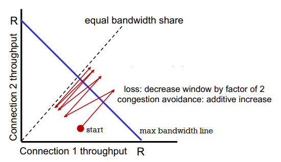
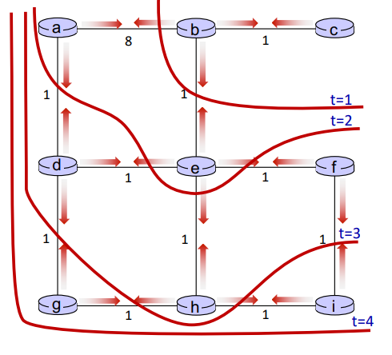

Instructor: Noura Limam

Time: MW 2:30PM - 3:50PM

.1A * 3 + .25MT + .35FE + .15PJ + .02Q * 5

- [Week 1. Jan 5](#week-1-jan-5)
- [Week 2. Jan 10](#week-2-jan-10)
- [Week 3. Jan 17](#week-3-jan-17)
- [Week 4. Jan 24](#week-4-jan-24)
- [Week 5. Jan 31](#week-5-jan-31)
- [Week 6. Feb 7](#week-6-feb-7)
- [Week 7. Feb 14](#week-7-feb-14)
- [Week 9. Feb 28](#week-9-feb-28)
- [Week 10. Mar 7](#week-10-mar-7)
- [Week 11. Mar 14](#week-11-mar-14)
- [Week 12. Mar 21](#week-12-mar-21)
- [Week 13. Mar 28](#week-13-mar-28)
- [Week 14. Apr 4](#week-14-apr-4)

# Week 1. Jan 5

## the internet
'nuts and bolts' view: connected computing devices
* _hosts_: end systems
* running network _apps_ at edge
* _packet switches_: forward packets (chunks of data)
  * routers, switchers
* _communication links_: fiber, radio, etc.
  * bandwidth is the transmission rate
* _networks_: (sub-)collection of devices, routers and links managed by an organization
* ___internet___: 'network of networks'


'service' view: infrastructure providing services to apps
* web, streaming media, social media, etc.
* provides _programming interface_ to distributed applications
  * 'hooks' allowing sending/receiving apps to connect to, use internet transport service
  * provides service options (analogous to postal service)

__definition.__ _protocols_ define the format, order of messages sent and received among network entities, and actins taken on message transmission and recept
* eg. HTTP, streaming video, skype, TCP, ethernet

_internet standards_: RFC, IETF

### closer look at network structure

* network edge:
  * hosts: clients and servers
  * servers often in data centers
* access networks, physical media:
  * wired, wireless communication links
* network core: 
  * interconnected routers
  * network of network

### host: sends packets of data
* takes application message
* breaks into smaller chunks (_packets_) of length L bits
* transmits packet into access network at transmission rate R
  * aka link capacity or link bandwidth
* _packet transmission delay_ = L/R
  * this is before last bit even starts being transmitted through wire

### access networks

in _cable-based access_, _frequency division multiplexing (FDM)_ is used to transmit different channels in different frequency bands over __shared__ cable.
* homes share access network to cable headend
* _HFC_: hybrid fiber coax

in _digital subscriber line (DSL)_, voice and data are transmitted at different frequencies over __dedicated__ line to central office.
* use existing telephone line to central office DSLAM
  * data over DSL phone line goes to internet
  * voice over DSL phone goes to telephone net

_home networks_:
```
|                                                      |
| WiFi ---- router/firewall/NAT ---- cable/DSL modem --|-- to/from headend/central office
|(54,450Mbps)      |                                   |
|            wired ethernet (1Gbps)                    |
```
often access point, router and modem are combined in a single box.

_wireless access networks_: shared wireless access network connects end system to router via base station aka 'access point'
* wireless local area networks (WLANs)
* wide-area cellular access networks

_enterprise networks_:
* companies, universities, etc.
* mixed of wired, wireless link technologies connecting mix of switches and routers

_data center networks_:
* high-bandwidth links (10s to 100s Gbps) connect hundreds to thousands of services together and to internet

### links: physical media
* _bit_ propagates between transmitter/receiver pairs
* _physical link_: lies between transmitter and receiver
* _guided media_: signals propagate in solid media (copper, fiber, coax)
* _unguided media_: signals propagate freely (radio)

_twisted pair (TP)_: two insulated copper wires (wrapped around each other)
* ethernet: more speed -> more pairs (wires)

_coaxial cable_: two concentric copper conductors
* bidirectional
* broadband: multiple frequency channels on cable; 100's Mbps per channel

_fiber optic cable_: glass fiber carrying light pulses, each pulse a bit
* high-speed point-to-point transmission (10's-100's Gbps)
* low error rate:
  * repeaters spaced far apart
  * immune to EM noice

_wireless radio_: signal carried in various 'band' in EM spectrum
* no physical 'wire'
* broadcast, 'half-duplex' (sender to receiver)
* has environmental effects: reflection, obstruction, interference/noise
* types:
  1. wireless LAN: 10-100's Mbps; 10's of meters
  2. wide-area: 10's Mbps over ~10 km
  3. bluetooth: short distances, limited rates
  4. terrestrial microwave: point-to-point; 45 Mbps channels
  5. satellite: up to 45 Mbps per channel; 270 ms end-end latency

### network core
* mesh of interconnected routers
* _packet-switching_: hosts break application-layer messages into packets
  * network forwards packets from one router to the next, across links on path from source to destination

key network-core functions:
* routing<span id="routing-forwarding"></span>:
  * global action
  * determine source-destination paths taken by packets
  * routing algorithms
  * going from San Jose to Northampton
* _forwarding (switching)_:
  * local action
  * move arriving packets from router's input link to appropriate router output link
  * moving car in intersection

store-and-forward switching:
```
me  ----- router ----- destination
```
* entire packet must arrive at router before it can be transmitted on next link
* two packet transmission delays (L/R)

__eg.__ assuming propagating in cable and processing take no time. 3 packets, L = 10 Kbits, R = 100 Mbps. then one-hop transmission delay = 0.1 ms. then total = 0.4 ms.

```
|            |            |t=0
|////////////|            |.1
|++++++++++++|////////////|.2
|============|++++++++++++|.3
|            |============|.4
source      router        dest
```
if we had one more router, then the total delay would be 0.5 ms.

_queueing packet switching_:
* router receives packets from multiple sources, but sends packets to one place
* _packet queuing and loss_: if arrival rate to link exceeds transmission rate of link of some period of time, packets will queue, waiting to be transmitted on output link
  * packets can be dropped (lost) if memory (buffer) in router fills up

# Week 2. Jan 10

_circuit switching_:
* alternative to packet switching
* links are divided into circuits (channels)
* end-end resources (links) are allocated and reserved for 'call' between source and destination
* no sharing => circuit-like (guaranteed) performance
* circuit segment idle if not used by call
* commonly used in traditional telephone networks
* methods of dividing:
  * frequency division multiplexing (FDM): optical, EM frequencies divided into narrow frequency bands
    * each call allocated its own band, can transmit at max rate of that narrow band
  * time division multiplexing (TDM): time divided into slots
    * each call allocated periodic slots, can transmit at max rate of frequency band during its time slot. if we have idle users, we waste transmit rate.

__eg.__ packet switching vs. circuit switching:
* there is 1Gb/s output link
* there are 35 users, each uses 100 Mb/s when active. they are active 10% of time
* if using circuit-switching, we can at max accommodate 10 users at same time
* if using packet switching, probability > 10 active at same time is less than 0.0004, so we can generally serve all users at same time
  * $\sum_{i=11}^{35} C_{35}^{i}p^{i}(1-p)^{35-i}$
* packet switching is good for 'bursty' data -> sometimes has data to send, but at other times not
  * resource sharing; simpler, no call setup
* packet switching has possible excessive congestion: packet delay and loss due to overflow
  * protocols needed for reliable data transfer and congestion control
* IETF DiffServ proposes standard to let packet switching behave similar to circuit switching

### internet structure
how to connect millions of access ISPs together?

we connect each access ISP to one global transit ISP network (interconnected ISPs)
* customer and provider ISPs have economic agreement
* global ISPs may be connected using _internet exchange points (IXPs)_ and _peering links (POP)_
* ... and regional networks may arise to connect access nets to ISPs


* at 'center' (small number of well-connected large networks)
  * tier-1 commercial ISPs (AT&T)
  * content provider networks (Google): private network that connects its data centers to internet, often bypassing tier-1 and regional ISPs

### performance
sources of packet delays:
1. transmission delay: L/R
2. queueing delay _(traffic intensity)_
   * depends on congestion level
   * L*a/R = arrival rate of bits / service rate of bits, where
     * a: average packet arrival rate
     * L: packet length (bits)
     * link bandwidth (bit transmission rate)
   * ~0: avg queueing delay small
   * -> 1: avg queueing delay large
   * \> 1: more work arriving is more than what can be processed - infinite average delay
3. _nodal processing delay_
   * check bit errors
   * determine output link
   * typically under 1 ms; we do not count
4. _propagation delay_
    * d/s, where
      * d = length of physical link
      * s = propagation speed

`traceroute`: provides delay measurements along end-end internet path.

packet loss:
* packet arriving to full queue is dropped
* lost packet may be retransmitted by previous node, by source end system, or not at all

_throughput_: rate (bits/time) at which bits are sent from sender to receiver
* _instantaneous_
* _average_
* _bottleneck link_: link on end-end path that constrains throughput with lowest transmission rate

__eg.__ what is end-end throughput per connection?
```
S  S  ...  S  (10)
\  \       /
      |
      R
      |
/  /  ...  \
C  C       C  (10)
```
min(RS, RC, R/10).

### security
internet was not originally designed to be much secure.
* original: 'a group of mutually trusting users attache to a transparent network'

packet interception:
* _packet sniffing_: promiscuous network interface reads all packets passing by in broadcast media (shared wireless)
* wireshark

fake identity:
* _IP spoofing_: injection of packet with false source address

_denial of service (DoS)_: attackers make resources unavailable to legitimate traffic by overwhelming resources with bogus traffic
1. select target
2. break into hosts around the network (botnet)
3. send packets to target from compromised hosts

lines of defense:
* _authentication_: providing you are who you say you are
  * cellular networks provide hardware identity via SIM card; no such hardware assist in traditional internet
* _confidentiality_: via encryption
* _integrity checks_: digital signatures to prevent tampering
* _access restrictions_: VPNs
* _firewalls_: 'middleboxes' in access and core networks
  * off-by-default: filter incoming traffic to restrict senders, receivers, and apps
  * detect and react to DoS

### protocol layers

layering:
* explicit structure allows identification, relationship of system's pieces
* modularization eases maintenance and updating

layered _internet protocol stack_:
1. _application_: supporting applications
   * HTTP, IMTP
2. _transport_: process-process data transfer
   * TCP, UDP
3. _network_: routing of datagrams from source to destination
   * IP, routing protocols
4. _link_: data transfer between neighboring network elements
   * ethernet, WiFi, PPP
5. _physical_

how to pass a message:
1. application exchanges _message_ M to implement some app service using services of transport layer
2. transport layer protocol transfers M (eg reliably) from one process to another, using services of network layer
   * it encapsulates app-layer message M with transport layer header Ht to create a transport-layer _segment_
3. network layer protocol transfers transport-layer segment [Ht M] from one host to another using link layer services
   * it encapsulates transport-layer segment [Ht M] with network-layer header Hn to create a _datagram_
4. link layer protocol transfers datagram [Hn Ht M] from host to neighboring hosts using network layer services
   * it encapsulates network datagram [Hn Ht M] with link-layer header Hl to create a link-layer _frame_
5. we do not cover physical layer
6. decapsulate the datagram in reverse order on receipt

switching devices do not implement all the layers:


# Week 3. Jan 17

## application layer
web app:
* write program that run end systems and communicate over network
* no need to write software for network-core devices. they do not run on user applications to allow rapid development

_client-server paradigm_:
* server:
  * always-on host
  * permanent IP
  * often in data centers, for scaling
* client:
  * contact, communicate with server
  * may be intermittently connected
  * may have dynamic IP
  * do not communicate with each other directly
* HTTP, IMAP, FTP

_peer-peer architecture_:
<span id="peer-peer-architecture"></span>
* service is not provided by an always-on server
* arbitrary end systems directly communicate
* self scalability: new peers bring new service capacity as well as new service demands
* peers are intermittently connected and change IP
  * complex management
* P2P

processes communicating:
* _process_: program running in a host
  * _client process_: that initiates communication
  * _server process_ that waits to be connected
* within same host, two communicate using _IPC_
* processes in different hosts communicate by exchanging _messages_
* in P2P apps, client and server process run on same machine

_sockets_:
* process sends/receives messages to/from its _socket_(door)
* two sockets involved: one on each side


process addressing:
* to receive messages, process must have identifier including
  * IP address (32bit)
  * _port numbers_ (16bit) associated with process
* HTTP: 80, mail: 25

app-layer protocols:
* defines types of messages exchanged
* message syntax
* message semantics
* rules for when and how processes send & respond

open protocols are defined in RFCs and allows interoperability by giving access of definition to everyone.

what app needs from transport service:
* reliability
* timing
* throughput
* security
  * 'elastic apps' make use of whatever throughput they get
* _[TCP service](#transport-control-protocol)_ <span id="tcp-service"></span>
  * reliable transport between sender and receiver
  * _flow control_: sender will not overwhelm receiver
  * _congestion control_: throttle sender when network is overloaded
  * _connection-oriented_: setup (handshake) required between client and server
  * does not provide timing, minimum throughput guarantee and security
* _[UDP service](#user-datagram-protocol)_ 
  * unreliable data transfer between sender and receiver
  * does not provide reliability, flow control, congestion control, timing, throughput guarantee, security, or connection setup
  * less overhead to network and faster
  * whatever missing from UDP can be implemented on app layer

|app|app layer protocol|transport protocol|
|-:|:-|-:|
file transfer|FTP|TCP|
email|SMTP|TCP|
web docs|HTTP|TCP|
internet telephony|SIP, RTP or proprietary|TCP/UDP|
streaming|HTTP, DASH|TCP|
interactive games|WOW, FPS (proprietary)|UDP/TCP|

security in TCP:
* vanilla TCP/UDP sockets has no encryption
* _transport layer security (TLS)_: on top of TCP
  * provides encrypted TCP connections
  * data integrity
  * end-point authentication
  * apps use TLS libraries

### HTTP
* web pages consist of _objects_ stored on different web servers
* base HTML-file includes several referenced objects, each addressable by a URL (host name + /path name)

_hypertext transfer protocol (HTTP)_:
* web's app-layer protocol
* client: browser requests, receives and displays content
* server sends object in response
* uses TCP
  1. client initiates TCP to `server:80`
  2. server accepts TCP connection from client
  3. HTTP messages exchanged between client and server
  4. TCP connection closed
* stateless: server maintains no information about past client requests

_non-persistent HTTP_ (HTTP1.0):
* TCP connection opened, at most one object sent, then closed
* problems:
  * requires 2RTTs per object
  * OS overhead for each TCP connection
  * so browsers often open multiple connections in parallel

response time:
* _round trip time (RTT)_: time for a small packet to travel from client to server and back
* non-persistent HTTP response time = 2RTT + file transmission ime


_persistent HTTP_ (HTTP1.1):
* allows multiple objects to be sent over single TCP connection
* as little as one RTT for all referenced objects
* problems:
  * pipelined means server responds in-order (FCFS)
  * small objects may have to wait for transmission _(head-of-line (HOL) blocking)_ behind large objects
  * loss recovery (retransmitting lost TCP segments) stalls object transmission

HTTP request message:
* ASCII (human-readable format)
```bash
GET /index.html HTTP/1.1\r\n
Host: www.example.com\r\n
User-Agent: Mozilla/5.0\r\n     # headers
Accept: text/html\r\n
Connection: keep-alive\r\n
\r\n                            # carriage return and line feed at line start indicates
                                # end of headers
# no body for GET request
```
* _POST_: user input in entity body sent from client
* _GET_: include user data in URL (`?abc&def=ghi`)
* _HEAD_: like GET, but wants only header
* _PUT_: upload object to server and completely replaces if existing
* ...

HTTP response message:
```bash
HTTP/1.1 200 OK\r\n
Date: Mon, 27 Jul 2009 12:28:53 GMT\r\n
Server: Apache/2.2.14 (Win32)\r\n
Last-Modified: Wed, 22 Jul 2009 19:15:56 GMT\r\n
Content-Length: 298\r\n
Content-Type: text/html\r\n
\r\n
# body
```
* 200 OK
* 301 Moved Permanently
* 404 Not Found
* ...

```bash
$ nc -c -v www.example.com 80
GET /index.html HTTP/1.1
Host: www.example.com

```
HTTP/2:
* key goal: decrease delay in multi-object HTTP requests
* increased flexibility at server in sending objects to client
  * methods, status codes, most header fields unchanged from HTTP/1.1
  * transmission order of requested objects based on client-specified priority (not necessarily FCFS)
  * can push unrequested objects to client
  * divide objects into smaller _frames_ which are scheduled to mitigate HOL blocking
* problems
  * recovery from packet loss still stalls object transmissions
    * as in HTTP/1.1, browsers incentive to open multiple parallel connections, increasing overall throughput
  * not secure over vanilla TCP connection

HTTP/3:
* adds security, per object error- and congestion-control (more pipelining) over UDP

### cookies
websites and client browser use _cookies_ to maintain state between transactions.
* used for: authorization, shopping cart, user session state

four components:
1. cookie header line of HTTP response message
2. cookie header line in next HTTP request message
3. cookie file kept on user's host, managed by user's browser
4. back-end database at website


how to keep state:
* at protocol endpoints: maintain state at sender/receiver over transactions
* in messages: cookie in HTTP messages carry state

privacy:
* cookies permit site to learn a lot about users
* 3rd party persistent cookies (tracking cookies) allow common identity to be tracked across multiple websites

### web caches
goal satisfy client requests without involving origin server
* user configures browser to a (local) web cache (proxy servers)
* browser sends all HTTP requests to cache; if not in cache, then request origin server
* web cache acts as both client and server
* server tells cache about object's allowable caching in response header (`Cache-Control: max-age=<seconds>/no-cache`)

advantage:
* reduce response time for client request
* reduce traffic on on institution's network
* enable 'poor' content providers to more effectively deliver content

__eg.__ RTT from pubic internet router to server is 2 seconds, average web object size is 100 K bits, there are 15 requests on average.
```
   origin servers
         |
public internet router
--------------------------------
         |
         | 1.54 Mbps access link
--------------------------------
institutional network router
         | 1 Gbps LAN
      clients
```
* the average data rate from server to browsers is 100K * 15 = 1.5 Mbps
* access link utilization is 1.5 Mbps / 1.54 Mbps = 0.97
  * => large queueing delays
* LAN utilization is 1.5 Mbps / 1 Gbps = 0.0015
* end-to-lay delay = internet delay + access link delay + LAN delay = 2s + minutes + μsecs => slow (estimation)

option 1: but faster access link
* access link rate is now 154 Mbps
* access link util = 0.0097, LAN util = 0.0015
* end-to-end lay = 2s + msecs + usecs ~ 2s

option 2: install web cache in institutional network
* now requests route to cache first
* suppose cache hit rate 0.4
* 40% requests served by cache with very low delay
* 60% requests served by origin
  * rate to browsers over access link = 0.6 * 1.5 Mbps = 0.9 Mbps
  * access link util = 0.9 Mbps / 1.54 Mbps = 0.58
* average end-end delay = 0.6(delay from origin servers) + 0.4(delay when satisfied by cahce) = 0.6\*2.01s + 0.4*(~msecs) ~ 1.2s

_conditional GET_:
* goal: do not send objects if cache has up-to-date cached version
  * no object transmission delay
* client specified data of cached copy in request (`If-modified-since: <date>`)
* server responds contains no object (304 Not Modified) if cached copy is up-to-date
* a little bit of delay incurred by cache. however if object is not updated we still save some time.

# Week 4. Jan 24
### email
three major components:
* _user agents_ (mail reader)
  * composing, editing and reading mails
  * outgoing, incoming emails stored on server
* mail servers
  * _mailbox_ contains incoming messages
  * _message queue_ of outgoing mails
* simple mail transfer protocol: _SMTP_
  * between mail servers to send email messages
  * client: sending mail server
  * 'server': receiving mail server

SMTP RFC:
* uses TCP to reliably transfer email messages to server with port 25
  * direct transfer: sending server (client) to receiving server
* after TCP connection, three phases of transfer:
  1. SMTP handshake
  2. SMTP transfer of message
  3. SMTP close
* command/response interactions (like HTTP)
  * commands: ASCII text
  * responses: code and phrase


sample interaction at step 3:
```bash
S: 220 example.com
C: HELO ecole.fr
S: 250 Hello ecole.fr, pleased to meet you
C: MAIL FROM: <alice@ecole.fr>
S: 250 alice@ecole.fr... Sender OK
C: RCPT TO: <bob@example.com>
S: 250 bob@example.com... Recipient OK
C: DATA  # start the email
S: 354 Enter mail, end with "." on a line by itself
C: FROM: alice@ecole.fr
C: TO: bob@example.com
C: SUBJECT: Hello!
C:
C: Do you like Math?
C: How about Science?
C: .
S: 250 Message accepted for delivery
C: QUIT
S: 221 example.com closing connection
```

comparison with HTTP:
* HTTP
  * client pull
  * each object encapsulated in its own response message
* SMTP
  * client push
  * multiple objects sent in multipart message
  * uses persistent connections
  * requires message to be in 7-bit ASCII
  * uses `CRLF.CRLF` to determine end of message
* both have ASCII command/response interactions

RFC 2822 define syntax for email message itself (different from commands above).

retrieving email uses different protocol than SMTP:
* IMAP: provides retrieval, deletion, folders on server
* HTTP: gmail provides web-based interface on top of SMTP (to send). IMAP (or POP) to retrieve

<details>
<summary>Show demo code</summary>

```bash
$ nc -C -v mxer.uwaterloo.ca 25
Connection to mxer.uwaterloo.ca 25 port [tcp/smtp] succeeded!
220 mxer.uwaterloo.ca ESMTP Sendmail 8.14.7/8.14.7 ready on mailchk-m02 at Mon, 24 Jan 2022 15:47:06 -0500 - problems to postmaster@uwaterloo.ca
HELO uwaterloo.ca
250 mailchk-m02.uwaterloo.ca Hello ubuntu.student.cs.uwaterloo.ca [127.0.0.1], pleased to meet you
MAIL FROM: ksnfanfnn@uwaterloo.ca
250 2.1.0 ksnfanfnn@uwaterloo.ca... Sender ok
RCPT TO: y3285wan@uwaterloo.ca
250 2.1.5 y3285wan@uwaterloo.ca... Recipient ok
DATA
354 Enter mail, end with "." on a line by itself
FROM: ksnfanfnn@uwaterloo.ca
TO: y3285wan@uwaterloo.ca
SUBJECT: Testing SMTP

Hello myself.
.
250 2.0.0 20OKl6BZ012876 Message accepted for delivery
QUIT
221 2.0.0 mailchk-m02.uwaterloo.ca closing connection
exit
```

</details>

### domain name system (DNS)
how to map between IP address and name, and vice versa?

* this core internet function is implemented as app-layer protocol
* DNS is distributed database implemented in hierarchy of many _name servers_
  * hosts, DNS servers communicate to resolve names
  * philosophy of internet: simple core, complexity at edges
* port 53

DNS services do:
* hostname-IP translation
* host aliasing: canonical, alias names
* mail server aliasing
* load distribution:
  * web servers are replicated: many IP maps to one name
* requirements:
  * homogenous distributed database: billion records, each simple
  * handles many trillions of queries a day
    * many more reads than writes
    * performance: almost every internet transaction interacts with DNS - ms count
  * organizationally, physically decentralized
    * millions of orgs responsible for their records
  * bulletproof: reliability, security

reasons to decentralize:
* avoid single point of failure
* traffic volume
* avoid distant centralized database
* better maintenance


to find IP for `www.amazon.com`, client first queries root for `.com` DNS server, which queries `amazon.com` DNS server, finally resolve full name.

_root name servers_:
* official, contact-of-last-resort by name servers that cannot resolve name
* critically important internet function
  * DNSSEC - provides security
* ICANN manages a few root DNS domain
* there are 13 logical root name 'servers' worldwide; each 'server' is replicated many times

_top-level domain (TLD)_:
* responsible for .com, .net, .cn, etc.
* network solutions: authoritative registry for .com, .net TLD
* educause: .edu TLD

_authoritative DNS servers_:
* org's own DNS servers providing authoritative hostname to IP mappings for org's named hosts
* can be provided by org or service provider

local DNS name servers:
* when host makes DNS query, it is sent to local DNS server first
* local DNS server returns reply, answering
  * from its local cache of recent name-to-addr translations (can outdate)
  * forwarding request into DNS hierarchy resolution
* local DNS server does not strictly belong to hierarchy
* each ISP has local DNS nama server
  * `ipconfig /all`

DNS resolution:
* iterated query: contacted server replies with name of server to contact
* recursive query: puts burden of name resolution on contacted name server
  * heavy load at upper levels of hierarchy without cache


caching DNS info:
* once (any) name server learns mapping, it caches mapping and immediately returns a cached mapping to respond query
  * improves response time
  * cache entries timeout after TTL
  * TLD servers typically cached in local name servers
* cached entries may be out of date
  * this is best effort

DNS records:
* _RR_ format: `(name, value, type, TTL)`
* type=A:
  * name=hostname, value=IP
* type=NS:
  * name=domain, value=hostname of authoritative name server for this domain
* type=CNAME:
  * name=alias name for some canonical name, value=canonical name
* type=NX:
  * value=name of SMTP mail server associated with name

DNS runs on both TCP and UDP, by default UDP, where query and reply have same format.
* for big UDP packet, server may drop. the client will retry with TCP.

```
<      2bytes       ><       2bytes       >
identification          flags                        (id: 16 bit for query, reply uses same number)
                                                     (flags: query/reply, recursion desired, recursion avai, reply is authorative)
# questions             # answer RRs
# authority RRs         # additional RRs
            questions                                (name, type fields)
            answers                                  (RRs in response)
            authority                                (records for authoritative servers)
            additional info
```

how to get info into the DNS:
1. register name `example.com` at DNS registrar
   * provide names, IP of authoritative name server (primary and secondary)
   * registrar inserts NS, A RRs into .com TLD server:
     * `(example.com, dns1.example.com, ns)`
     * `(dns1.example.com, 1.2.3.4, A)`
2. create authoritative server locally with IP `1.2.3.4`
   * A record for `www.example.com`
   * MX record for `example.com`

DNS security:
* DDoS attacks
  * bombard root servers with traffic
    * not successful to date
    * root servers have traffic filtering and other bulletproofing
    * local DNS servers cache IPs of TLD servers, bypassing root server
  * bombard TLD servers
    * potentially more dangerous
* spoofing attacks:
  * intercept DNS queries and return bogus replies
    * DNS cache poisoning
    * RFC 4033

```bash
$ dig www.uwaterloo.com A

$ dig @a.root-servers.net www.uwaterloo.com A
$ dig @any.ca-servers.ca www.uwaterloo.com A
$ dig @ext-dns-aws.uwaterloo.ca www.uwaterloo.com A
```

### socket programming
two socket types:
* UDP: unreliable datagram (group of bytes)
* TCP: reliable, byte stream-oriented

application example:
1. client reads line of characters from keyboards then sends data to server
2. server receivers data and converts data to uppercase
3. servers sends
4. client receives and displays line

with UDP:
* no handshaking before sending
* sender explicitly attaches IP destination and port to each packets
* receiver extracts sender IP address and port from received packet
* transmitted data may be lost or received out-of order
* app view: unreliable transfer of groups of bytes between server and client


```py
from socket import *

# server
serverPort = 12000
serverSocket = socket(AF_INET, SOCK_DGRAM)
serverSocket.bind(('', serverPort))
print('The server is ready to receive')
while True:
    message, clientAddress = serverSocket.recvfrom(2048)
    modifiedMessage = message.decode().upper()
    serverSocket.sendto(modifledMessage.encode(), clientAddress)

# client
serverName = 'hostname'
serverPort = 12000
clientSocket = socket(AF_INET, SOCK_DGRAM)
message = input('Input lowercase sentence: ')
clientSocket.seendto(message.encode(), (serverName, serverPort))
modifiedMessage, serverAddress = clientSocket.recvfrom(2048)
print('From server: ', modifiedMessage.decode())
clientSocket.close()
```

with TCP:
* client must contact server
  * server process must be first running
  * server must have created socket that welcomes client's contact
* client contacts server by:
  * creating TCP socket specifying IP:port
  * when client creates socket, client TCP establishes connection to server TCP
* when contacted by client, server TCP creates new socket for server for server process to communicate with that particular client
  * allowing server to talk with multiple clients
  * source port used to distinguish clients
* app viewpoint: reliable, in-order pipe between client and server


```py
from socket import *

# server
serverPort = 12000
serverSocket = socket(AF_INET, SOCK_STREAM)
serverSocket.bind(('', serverPort))
serverSocket.listen(1)
print('The server is ready to receive')
while True:
    connectionsSocket, address = serverSocket.accept()  # new sock created on return
    sentence = connectionsSocket.recv(1024).decode()
    capitalizedSentence = sentence.upper()
    connectionsSocket.send(capitalizedSentence.encode())
    connectionsSocket.close()

# client
serverName = 'hostname'
serverPort = 12000
clientSocket = socket(AF_INET, SOCK_STREAM)
clientSocket.connect((serverName, serverPort))
message = input('Input lowercase sentence: ')
clientSocket.send(message.encode())
modifiedMessage = clientSocket.recv(1024) # no need to attach name:port
print('From server: ', modifiedMessage.decode())
clientSocket.close()
```

# Week 5. Jan 31
### P2P
[desc](#peer-peer-architecture)

KPI: how much time to distribute file of size F from one server to N peers?


client-server:
* server transmission: must sequentially send N file copies
  * time to send one: $F/u_s$
  * time to send N: $NF/u_s$
* client: each client must download one copy
  * min client download time: $F/d_{\text{min}}$
  * where $d_{\text{min}}$ is min client download rate
* total: $D\geq\max(\frac{NF}{u_s},\frac{F}{d_{\text{min}}})$
  * at least increase linearly with N

using P2P:
* server transmission: must upload at least one copy
  * time to send one: $F/u_s$
* client: each client must download one copt
  * min client download time: $F/d_{\text{min}}$
* clients: as an aggregate must download NF bits
  * max upload rate (limiting max download rate) is $u_s+\sum u_i$
* total: $D\geq\max\{\frac{F}{u_s},\frac{F}{d_\text{min}},\frac{NF}{u_s+\sum u_i}\}$
  * numerator increases linearly in N... but $\sum u_i$ also increases, so not necessarily linear, but log

BitTorrent:
* file divided into 256KB chunks which peers in swarm send and receive
* _tracker_: tracks peers participating in swarm
* _swarm_: group of peers exchanging chunks
* steps:
   1. downloads torrent
   2. peer joining swarm
      1. has no chunks, but will accumulate them over time from other peers
      2. registers with track to get list of peers and connects to subset of peers (neighbors)
   3. while downloading, peer uploads chunks to other peers
   4. chunks downloaded are hashed to verify integrity
   5. peer may change peers with whom it exchanges chunks
   6. _churn_: peers may come and go
   7. once peer has entire file, it may (selfishly) leave or remain (altruistically) in torrent (seeders)
* requesting chunks:
  * different peers have different subsets of chunks
  * periodically user asks each peer for list of chunks they have, and request missing chunks, rarest first
  * request broadcasted
* sending chunks: tit-for-tat
  * sends chunks to those four peers currently sending her chunks at highest rate
    * other peers are choked
    * re-evaluate top 4 every 10s
    * this prevents leaching
  * every 30s, randomly select another peer and starts sending chunks
    * 'optimistically unchoke' this peer
* BitTorrent is tracker-less (decentralized index)
  * there can be a superpeer

### video streaming
stream video traffic is major consumer of internet bandwidth.

challenges:
* scale - how to reach ~1B users
* heterogeneity - different users have different capabilities
* solution: distributed, application-level infrastructure

simple scenario: streaming stored video
* server sends video file to client
* main challenges:
  * server-to-client bandwidth varies over time with congestion levels
  * packet loss: delay playout, result in poor quality

_dynamic, adaptive streaming over HTTP (DASH)_:
* server: divides video file into chunks
  * each chunk encoded at multiple rates
  * different rate encodings stored in different files
  * files replicated in various CND nodes
  * _manifest files_: provides URLs for different chunks
* client: periodically estimates server-to-client bandwidth
  * consult manifest and requests one chunk at a time
    * when to request chunk: so that buffer starvation/overflow do not occur
    * what rate: higher quality when more bandwidth available
    * where to request chunk: close to client or high bandwidth

streaming video = encoding + DASH + playout buffering

### content distribution networks (CDN)
challenge: how to stream content to hundreds of thousands of simultaneous users?
* option 1: single mega-server
  * single point of failure, point of congestion, long path to distant clients
* option 2: store and server multiple copies of videos at multiple geographically distributed sites
  * enter deep: push CDN servers deep into many access networks
  * bring home: smaller number (10's) of larger clusters in POPs near access nets

steps:
* CND: stores copies of content at CDN nodes
* subscriber requests content, service provider returns manifeset
  * using manifest, retrieves content at highest supportable rate
  * or different non-congested paths

CDNs are example of OTT (over the top): internet host-host communication as a service.

OTT challenges:
* coping with a congested internet from the edge
* what content to place in which CDN node
* from which CDN node to retrieve content at what rate

## transport layer
* provide logical communication between processes running on different processes
* action network in end:
  * sender: breaks app messages into segments and pass to network layer
  * receiver: reassembles segments, pass to app layer
* network layer: logical communication between hosts
* two services: [TCP, UDP](#tcp-service)
* no delay or bandwidth guarantees

_multiplexing_:
* sender: handle data from multiple sockets, add transport headers
* receiver: use header info to deliver received segments to correct socket
  1. host receives ip datagrams, each has source IP:port, dest IP:port; one transport-layer segment
  2. hose uses IP:port to direct segments to appropriate socket

```
          32 bits
src port     |     dest port
-------------+----------------
        other headers
------------------------------
        payload
```

connectionless demultiplexing in UDP:
* before sending datagrams, must specify IP:port
* receiving host checks port and directs segment to socket with that port
* demux: receiver uses dest port only
* if IP/UDP datagrams have dest same IP:port, but different source IP:port, they will be routed to same socket

connection-oriented demultiplexing in TCP:
* TCP socket is identified by 4-tuple: source IP:port, dest IP:port
* demux: receiver uses all 4 values to direct segment to socket
* server may support many simultaneous TCP sockets
  * each is identified by entire 4 tuple, each associated with a client

multiplexing happen at all layers.

### user datagram protocol (UDP)
<span id="user-datagram-protocol"></span>
* no frills, bare bones internet transport protocol.
* best effort: segments may be lost, out of order
* connectionless: no handshaking, each segment handled independently of others
* uses: streaming media, DNS, SNMP, HTTP/3

advantages:
* no connection establishment delay
* simple: no states
* small header size
* no congestion control: can function in the face of congestion
* if reliable (HTTP/3), congestion control needed, add at app layer

UDP segment header:
```
       32 bits
---------+----------
src port | dest port
---------+----------
length   | checksum    # length including header
---------+----------
      payload
```

UDP checksum:
* goal: detect errors in segment
* sender:
  * treat contents of UDP segment (including UDP headers & IP) as sequence of 16-bit ints
  * add one's complement sum of segment content as _checksum_
* receiver:
  * computes checksum of received segment
  * not equal: error detected; drop
  * equal: not necessarily mean errorless in connection...

__eg.__
```
  1 1 1 0 0 1 1 0 0 1 1 0 0 1 1 0
  1 1 0 1 0 1 0 1 0 1 0 1 0 1 0 1
---------------------------------
1 1 0 1 1 1 0 1 1 1 0 1 1 1 0 1 1
---------------------------------
  1 0 1 1 1 0 1 1 1 0 1 1 1 1 0 0 wrap around (carryout added)
---------------------------------
  0 1 0 0 0 1 0 0 0 1 0 0 0 0 1 1 checksum
```

# Week 6. Feb 7
f f 304 dns none http/tcp/dns/udp in/the/cache does/not/mean/anything mailserver cache/discard 12997158232 server/to/server copies 4321

### principles of reliable data transfer
* complexity of reliable data transfer protocol depend on characteristics of unreliable channel
* sender and receiver do not know state of each other (eg was the message received?)


implementation: rdt1.0: reliable transfer over a reliable channel:
* assume underlying channel perfectly reliable
* separate FSMs for sender and receiver, which sends/reads data from underlying channel


refinement: rdt2.0: channel with bit errors:
* underlaying channel may flip bits
  * we can check bit errors using checksum
* how to recover from errors?
* receiver sends feedback
  * _acknowledgement (ACK)_: receiver sends ack to sender
  * _negative acknowledgement (NACK)_: receivers explicitly tells sender that packet has errors
  * sender retransmits packet on receipt on NAK

rdt2.0 with no errors:


problem: what if ACK/NACK is corrupted?
* cannot just retransmit: possible duplicate NACKs sent by receiver
* sender adds sequence number to each pkt
* receiver discards if duplicate packet

refinement: rdt2.1:  


refinement: rdt2.2: NAK-free protocol
* same functionality as rdt2.1 but using ACKs only
* instead of NAK, receiver sends ACK for last packet received correctly
* duplicate ACK at sender means error: sender retransmits

refinement: rdt3.0: channel may lose packets
* sender waits for reasonable amount of time and retransmits
* if packet is just delayed not lost, duplicate packet is ok because seq number handles this
* countdown timer may be related to roundtrip time

rdt3.0 sender:


procedures:


performance of rdt3.0:
* sender has to wait for a time before sending the next packet
* _utilization_ $U_\text{sender}$: fraction of time sender busy sending

__eg.__ 1 Gbps link, 15 ms propagation delay, 8000 bit per packet. then $U_\text{sender}=\frac{L/R}{RTT+L/R}=\frac{.008}{30+.008}=.00027$ where RTT is round trip time, L/R is transmission delay.

```
L/R sender
 ^       \
 |        \
RTT       receiver
 |       /
 v      /
    sender
```

solution: use pipelining
* _pipelining_: sender allows multiple in-flight, yet-to-be-acked packets
  * need to manage out-of-order packets
  * range of seq numbers must be increased
  * buffering at sender and/or receiver

_go-back-N_ pipelining:
* sender: 'window' of up to N, consecutive transmitted but unacked packets
  * _cumulative ACK_: ACKs all packets up to, including seq number n
    * when receiving ACK(n), move window forward to begin at n+1
  * timer for oldest in-flight packet
  * timeout(n): retransmit packet n and all higher seq # packets in window

```
   send_base   next_seq_num
      v           v
||||||############[][][][][]-------
      ^--------------------^
         window size N

||: already ACKed
##: sent, not yet ACKed
[]: usable, not yet sent
--: not usable
```

* receiver:
  * ACK-only: always send ACK for correctly-received packet so far with highest seq number
    * may generate duplicate ACKs
    * need only remember recv_base
  * when receiving out-of-order packet:
    * can discard or buffer it: implementation detail
    * re-ACK packet with highest in-order seq number

```
    recv_base
        v
...|||||-XXX-----

||: received and ACKed
--: not received
XX: out of order and not ACKed
```

procedure:


_selective repeat_ pipelining:
* receiver individually acks all correctly received packets
  * buffer out-of-order packets as needed
* sender times-out and retransmits individually for unacked packets
  * sender maintains timer for each unacked packet
* sender window has N consecutive sequence numbers; limits sequence numbers of sent, unacked packets

```
   send_base   next_seq_num
      v           v
||||||##||##||####[][][][][]-------
      ^--------------------^
         window size N

||: already ACKed
##: sent, not yet ACKed
[]: usable, not yet sent
--: not usable
```
* sender:
  * if next available seq # is in window, send packet
  * if packet n times out, resend it and restart timer
  * if ACK(n) in [sendbase, sendbase+N], mark packet n as received
    * if n is smallest unacked packet, advance window base to next unacked seq #
* receiver:
  * if packet n in [recvbase, recvbase+N-1]:
    * send ACK(n)
    * buffer out-of-order packets
    * if in-order, deliver, and advance window to next not-yet-received packet
  * if packet n in [recvbase-N, recvbase-1]: ACK(n)
  * otherwise, ignore

does this beat the 'requirement' that one should ack _newest_ correctly received packet?

# Week 7. Feb 14

__eg.__ because we allow out-of-order packets, the typical seq # pool = window size + 1 will not work.

we have sequence numbers 0,1,2,3 and window size 3:


solution: window should not be the more than half of the seq # pool.

### transport control protocol (TCP)
<span id="transport-control-protocol"></span>
* point-to-point
* reliable, in-order byte stream: no 'message boundaries'
* full duplex data: bi-directional flow in same connection
  * MSS: maximum segment size
* cumulative ACKs: upon receiving nth packet, we are sure packets before it are received
* pipelining: congestion and flow control set window size
* connection-oriented: handshaking initializes states before data exchange
* flow controlled: sender do not overwhelm receiver

TCP segment header:


procedure:


* TCP is duplex, so there is really no distinction between sender and receiver. they both act as sender and receiver so both of them have seq numbers.
* seq numbers:
  * first ever packet: random sequence number
  * _sequence number_: byte stream 'number' of first byte in segment's data
  * acknowledgements: sequence number of next byte expected from other side
    * cumulative ACK

how to handle out-of-order packets? the TCP spec does not restrict.

how to set TCP timeout values?
* should be longer than RTT, but RTT varies
* too short: premature timeout, unnecessary retransmission
* too long: slow reaction to packet loss
* _sample RTT_: a way to estimate RTT
  * measured time from segment transmission until ACK receipt
    * ignore retransmissions
  * it will vary, we want it smoother: measure average several recent values, not just current value
  * `EstimatedRTT = (1- a)*EstimatedRTT + a*SampleRTT` = estimated RTT + 'safety margin'
  * `DevRTT = (1-b)*DevRTT + b*|SampleRTT-EstimatedRTT|` (typically b=.25)

TCP sender (simplified):
* when data received from app:
  * create segment with seq #
  * seq # is byte-stream number of first data byte in segment
  * start time if not already started
    * think of timer as for oldest unacked packet
    * expiration interval: `TimeOutInterval`
* when timeout:
  * retransmit timed-out packet
  * restart timer
* when ACK received:
  * if ACK acknowledges previously unacked segments:
    * update what is known to be ACKed
    * start timer if there are still unacked segments

TCP receiver;
* when received in-order segment with expected seq #, and all data up to expected seq # is already acked
  * delays ACK. wait up to 500ms for next segment.
  * if no next segment, send ACK
* when received in-order segment with expected seq #, one other segment has ACK pending
  * immediately send single cumulative ACK, acking both in-order segments
* when received out-of-order segment higher-than-expect seq #
  * gap detected
  * immediately send duplicate ACK indicating seq # of next expected byte
* when received segment that partially/completely fills gap
  * immediately send ACK, provided that segment starts at lower end of gap
* when received out-of-order segment lower-than-expect seq #
  * send cumulative ACK, ignore


TCP fast retransmit:
* if sender receives 3 additional ACKs for same data, resend unacked segment with smallest seq #
* without waiting for counter
* (3 duplicate ACKs likely implies lost segments)

TCP flow control:
* TCP receiver specifies free buffer space in `rwnd` field in TCP header
  * `RcvBuffer` size set via socket options (default 4096)
  * many OS autoadjust `RecvBuffer`
* sender limits amount of unacked data to received `rwnd`
* this guarantees receive buffer will not overflow if network layer delivers data faster than app layer removes data from socket buffers
* what happens if `rwnd` is 0 and sender receives no further packets?
  * try sending a very tiny packet instead of not doing anything

TCP connection management:
* before exchanging data, two parties handshake
  * agree to establish connection
  * agree on connection parameters (initial seq #)

_3-way handshake_:


SYN flood attack:
* client may flood with ACK packets to make server create connections
* how does server generate y after receiving client SYN? server uses x + some secret + server IP to create random number as y. after receiving another ACK, use the same info to recalculate it to check whether the message is legitimate.

close of connection:
* can be initiated by server or client


# Week 9. Feb 28

### principles of congestion control
too many sources sending too much data too fast for network to handle.

manifestations:
* long delays (primarily queueing in router buffers)
* packet losses (buffer overflow at routers)

causes of congestion:
* premature timeout causes retransmission => unneeded duplicates
  * the output throughput is below the maximum (R/2) as it drops duplicates
  * the more packet sent, the more probability for duplicates


* another cost of congestion: when packet is dropped, any upstream transmission capacity and buffering used for that packet was wasted


approaches:
* _end-end congestion control_:
  * no explicit feedback from network
  * congestion inferred from observed loss and delay
* _network-assisted congestion control_:
  * routers provide direct feedback to sending and receiving hosts with flows passing through congested router
  * may indicate congestion level or explictly set sending rate
  * TCP ECN, ATM, DECbit

### TCP congestion control: AIMD (TCP reno)
approach: senders can increase sending rate until packet loss occurs, then decrease rate on loss events.
* generally increase window size by a segment every RTT
* shrink window size by dividing by 2 on loss


* _multiplicative decrease_:
  * rate is cut in half when loss is detected by triple duplicate ACKs (TCP reno)
    * it means eventually congestion resolved
  * cut to 1 _MSS (maximum segment size)_ when loss detected by timeout (TCP tahoe)
    * it means congestion is heavy

benefits: a distributed, asynchronous algorithm has been shown to
* optimize congested flow rates network wide
* have desirable stability properties

sending bahavior:
* roughly: send `cwnd` bytes, wait RTT for ACKs, then send more bytes
  * TCP rate ~ `cwnd` / RTT bytes/s
  * where `cwnd` is dynamically adjusted window size
* TCP sender limits transmission `LastByteSend - LastByteAcked <= cnwd`

TCP slow start:
* when connection starts, we increase rate exponentially
  * initially `cwnd` = 1 MSS
  * then double `cwnd` every RTT
    * done by incrementing `cwnd` for every ACK received
* variable `ssthresh` (slow start threshold) used as threshold to switch to linear from exponential
  * on loss event, `ssthresh` is set to `cwnd` / 2 just before loss event
* depending on whther timeout or dup ACKs we do differently


[RFC 5681]


### explicit congestion notification
example of network-assisted congestion control.
* when packet is sent, two bits in IP header (ToS field) is marked by network router to indicate congestion (changed from 10 to 11)
  * this indication is carried to destination
* destination's response sets ECE bit to 1 on ACK segment to notify sender of congestion
* this involves both IP (IP header ECN bit marking) and TCP (TCP header's C,E bit marking)


### fairness of TCP
goal: if k TCP sessions share same bottleneck link of bandwith R, each should have average rate R/K.

consider two competing TCP sessions only in AIMD congestion avoidance mode, with same MSS and RTT, and so same throughput.
* additive increase giives slope of 1 as throughput increases
* multiplicative decrease decreases throughput proportionally



the red path swings around the max bandwidth line and eventually converges to the equal bandwidth line. so TCP under these assumptions is fair.

is UDP fair?
* multimedia apps often do not use TCP <= do not want rate throttled by congestion control
* they use UDP to send files at constant rate and tolerate packet loss
* they impact other TCP connections on the same bottleneck link
* there is no 'internet police' enforcing congestion control

is parallel TCP connections fair?
* party that has more parallel connections will have advantage

### TCP CUBIC
intuition:
* let $W_{\text{max}}$ be sending rate at which congestion loss was detected
* congestion state of bottleneck link probably has not changed much
* after cutting rate/windows in half on loss, initially ramp to $W_{\text{max}}$ faster, and then approach $W_{\text{max}}$ slowly


* let $K$ point in time when TCP window size reaches $W_{\text{max}}$, it is tunable
  * `cwnd = c * t-K^3+Wmax` where `c` is usually 0.4, where t is time of current loss
* increases $W$ as function of the cube of the distance between current time and $K$
  * larger increases when further away from K
  * smaller increases when nearer to K

TCP CUBIC is default in linux and is most popular in web servers.

### history
TCP and UDP are principal transport protocols for 40 years.

there are different flavors of TCP developed for specific scenerios:
|case|challenges|
|:-|:-|
|long, fat pipes|many packets in flight; loss shuts down pipeline|
|wireless networks|loss due to noisy wireless links, mobility; TCP treats this as congestion loss|
|long-delay links|long RTTs|
|data center networks|latency sensitive|
|background traffic flows|low priority; 'background' TCP flows|

now: moving transport-layer functions to app layer on top of UDP: HTTP/3: QUIC

### QUIC (quick UDP internet connections)
app-layer protocol on UDP
* better HTTP performance
* used by google
* error and congestion control: 'similar to well-known TCP ones'
* connection establishment: reliability, congestion control, euthentication, encryption, state established in one RTT
  * unlike TCP+TLS that require two handshakes
* multiple app-level 'streams' multiplexed over single QUIC connection
  * separate reliable data transfer, security
  * common congestion control
  * no head-of-line blocking


moving from network edge to network core...

# Week 10. Mar 7
## network layer/data plane
* it is in every internet device: hosts and routers
* router: examines header fields in IP datagrams passing through it and moves from input port them to output port along end-end path.
* [routing and forwarding](#routing-forwarding)

planes:
* _data plane_: local, per-router function
  * determines how datagram arriving on router input is forwarded ti router output port
* _[control plane](#network-layer-control-plane)_: network-wide logic
  * determines how datagram is routed among routers along end-end path from src host to dst host
  * traditional routing algorithm: implemented in routers
    * each router has forwarding table
    * individual routing algo components in each and every router interact in the control plane to determine optimal host
    * or only know information with its neighbors
  * _software-defined networking (SDN)_: implemented in (remote) servers
    * remote controller computers installs forwarding tables in routers

service model for channel transporting datagrams
* for individual datagrams:
  * guaranteed delivery
  * delivery within some time
* for flow of datagrams:
  * delivery in order
  * guaranteed minimum bandwidth to flow
  * restrictions on changes in interpacket spacing (jitter)
* IP protocol does not support any of them (best effort)

### routers 

```
                             +-------------+
                             | routing     |                                routing, management
                    +--------+ processor   |                                control plane (software)
                    |        +-------------+                                operates in ms time frame
- - - - - - - - - - - - - - - - - - - - - - - - - - - - - - - - - - - - - - - - -
                    |                                                       forwarding data plane
      +-------------v-+     +-------------+     +----------------+         (hardware) operates
  +---|---|-----|-----|---->+             +-----|---|-----|------|----->   in ns timeframe
      +---------------+     |             |     +----------------+
                    |       |  high-speed |
                    |       |  switching  |
                    |       |  frabric    |
                    |       |             |
      +-------------v--+    |             |     +----------------+
  +---|---|-----|------|---->+            +-----|---|-----|------|----->
      +----------------+    +-------------+     +----------------+

       input ports                                 output ports
```

input port:
```
   +----------------------------------------------------------------+
   |                                                                |
   |  +-------------+      +---------------+     +---------------+  |
   |  |    line     |      | link layer    |     | lookup,forward|  |    switch
+---->+ termination +------> protocol (rcv)+-----> queueing      +---->  fabric
   |  +-------------+      +---------------+     |   ||||||||||  |  |
   |                                             +---------------+  |
   +----------------------------------------------------------------+
```

* line term: physical layer, bit-level reception
* link layer: eg ethernet
* decentralized switching:
  * using header field values, look up output port using forwarding table in input port memory ('match + action')
  * goal: complete input port processing at line speed
  * _input port queueing_: if datagrams arrive faster than forwarding rate into switch fabric
  * _destination-based forwarding_: forward based only on dest IP (traditional)
  * _generalized forwarding_: forward based on any set of header field values

_longest prefix matching_: when looking for forwarding table entry gor given dest address, use longest address prefix that matches dest address
```
range                                  line interface
-----------------------------------------------------
11001000 00010111 00010*** ******** -> 0
11001000 00010111 00011000 ******** -> 1
```

* often performed using ternary content addressable memories (TCAMs)
  * _content addressable_: present address to TCAM: retrieve address in one clock cycle regardless of table size

switching fabrics:
* transfer packet from input link to output link
* _switching rate_: rate at which packets can be transferred
  * often measured as multiple of input/output line rate
  * N input => switching rate of N * line rate is desirable
* head-of-line blocking (HOL): queued datagrams in front of queue block others

output port queueing:
```
     +-----------------------------------------------------------------+
     |                                                                 |
     |  +----------------+      +----------------+     +-------------+ |
     |  | lookup,forward |      | link layer     |     |  line       | |
NR  --->+ queueing       +------> protocol (send)+-----> termination +------> rate R
     |  |  --||||||||||  |      +----------------+     +-------------+ |
     |  +----------------+                                             |
     +-----------------------------------------------------------------+
```
* buffering is required when datagrams arrive from fabric is faster than link transmission rate.
* _drop policy_: which datagram to drop if no free buffers? network neutrality vs pirority dropping
* scheduling discipline chooses among queued datagrams for transmission
* RFC 3439 rule of thumb: average buffering equal to 'typical' RTT times link capacity R
* too much bufferng can increase delays (particularly in home routers): long RTTs

buffer management:
* _drop_: tail drop (drop arriving packet) and priority (drop on priority basis)
* _marking_: which packets to mark to signal congestion (ECN, RED header fields)

packet scheduling: decide which packet to send next on link
* FCFS/FIFO: packets transmitted in order of arrival
* priority scheduling: arriving traffic is classigied, queued by class
  * any header fields can be used for classification
  * FCFS within priority class
* _round-robin_: also have classes
  * erver cycically, repeatedly scans class queues, sending one complete packet from each class
* _weight fair queueing (WFQ)_: generalized round robin
  * each class $i$ with weight $w_i$ gets weighted amount of service in each cycle $\frac{w_i}{\sum_j w_j}$

### internet protocol


* IP version is 4
* 'type' of service used to for prioritization etc...
* IP checksum only computed on header, unlike TCP/UDP checksum that is computed on entire packet. because TTL changes in routing, it must be recalculated each time.


ip fragmentation and reassembly:
* the max size of the datagram will be limited by MTU (maximum transmission unit), up to the underlying technology (ethernet, wifi...)
* large IP datagrams divided into several datagrams
* fragments can take different paths
* they are assemblied only at destination
* `[HIP HTCP ...|.......|...] => [HIP HTCP ..][HIP  .......][HIP  ...]`
* ip headers are used to identify and re-order them
  * (will not work using serial number) so use offset
* overhead exists: timer, waiting for expected fragment, ...

addressing
* _ip address_: 32 bits associated with each host or router interface
* _interface_: connection between host/router and physical link
  * routers typically have multiple interfaces (belonging to different subnets)
  * host typically has one or two interfaces

subnets:
* _subnets_: device interfaces that can physically reach each other  without passing through an intervening router
* IP address have two parts:
  * subnet part: devices in same subnet have common high order bits
  * host part: remaining low order bits
* subnets are defined by address and mask
* _classless interdomain routing (CIDR)_: `223.1.1.0/24` where /24 is number of bits in subnet portion of address
* classical: `223.1.1.0; subnet mask: 255.255.255.0`

```
subnet:      1101 1111  0000 0001  0000 0001  0000 0000
             -------------------------------
subnet mask: 1111 1111  1111 1111  1111 1111  0000 0000
```
* before classless, there were classful ip addresses where subnet mask matters and there are only 8, 16, 24, ...

how to get an IP address:
* how hosts get IP address within its subnet
  * hard-coded by sysadmin
  * or by _DHCP (dynamic host configuration protocol)_ get address from server
* how network get its own address?
  * subnet part: it gets allocated portion of its provider ISP's address space
* how do ISP get IP blocks? by ICANN (which allocates IP addresses through 5 regional registries)

DHCP: host dynamically obtains IP from network server when it joins network
*  can renew its lease on address in use
   *  server will recycle addresses
*  allows reuse of addresses (only hold address while connected/on)
*  support for mobile users who join/leave network 
* steps:
  * host broadcasts DHCP discover message
    * every interface card listens to broadcast address
  * DHCP server responds with DHCP offer message
  * host requests IP with DHCP request message
  * DHCP server sends DHCP ack message
* it also returns address of first-hop router for client, name and IP address of DNS server, and network mask

# Week 11. Mar 14
hierarchical addressing:
* not all routers need to know other blocks in their routing table
* route aggregated by routers (ISP's)
  * thanks to longest prefix matching we can use prefix to ask 'recursively' along the path for which router is for which IP
* allows efficient advertisement of routing information

are there enough 32-bit IP addresses?
* ICANN allocated last chunk of IPv4 addresses to RRs in 2011
* NAT helps IPv4 address space exhaustion
* IPv6 has 128-bit address space

### network address translation (NAT)
_NAT_: all devices in local network share just one IPv4 address as far as outside world is connected
```
                          10.0.0.4      ---- PC (10.0.0.1)
------------------------ |x|  ----      ---- PC (10.0.0.2)
      138.2.17.66                       ---- PC (10.0.0.3)

<---------------------->    <---------------------------->
    INETERNET                      LOCAL NETWORK
all datagrams leaving        datagrams with src or dest
local network have           in this network have local
same src IP but              addresses
different ports
```

* all devices in local network have 32-bit addresses in a private IP address space that can only be used in local network (10/8, 172.16/12, 192.168/16)
* advantages
  * just one IP needed from provider ISP for all providers
  * can change addresses of host in local network without notifying outside world
  * an change ISP without changing local address
  * security: devices inside local net not directly addressable, visible  by outside world

implementation (transparently):
* outgoing datagrams: replace `source IP:port` of every outgoing datagram to `NAT IP address:new port`
* remember (in NAT translation table) every `source IP:port` to `NAT IP address:new port` translation pair
* incoming datagrams: replace `NAT IP address:new port` in destination fields of every incoming datagram with corresponding `source IP:port` stored in NAT table
* recalculation of checksum for transport and network layers needed

controversy:
* routers 'should only' process up to layer 3 (network)
* violates end-to-end argument (port # manipulation by network-layer device)
* it is delaying deployment of IPv6...
* NAT traversal: what if client wants to connect to server behind NAT?
* but it is extensively used in home and instutional networks, cellular nets

### IPv6
motivations:
* IPv4 shortage
* speed processing/forwarding 40-byte fixed length header
* enable different network-layer treatment of flows


* no checksum, fragmentation/reassembly,
* or options (which are available as upper-layer, next-header protocol at router, so they are in 'payload')

transition from IPv4:
* network operate with mixed IPv4 and IPv6 routers
* _tunneling_: IPv6 datagrams are carried as payload in IPv4 datagram among IPv4-only routers
  * needs admin to configure manually
  * used extensively in other contexts (4G/5G)

### generalized forwarding
* _'match plus action'_ abstraction: match bits in arriving packet, take action
* _destination-based forwarding_: forward based on dest address
* _generalized forwarding_: many header fields can be used to determine action
  * drop/copy/modify/log matched packet, or send packet to controller

_flow table_:
* in this case, routing table is no longer simply a routing table
* _flow_: determined by header (in link, network, transport-layer fields)
* simple packet-handling rules:
  * `match`
  * `action`
  * _priority_: to disambiguate overlapping matches
  * _counters_: # bytes and # packets

OpenFlow:
```yaml
match:
  - ingress port
  - link layer:
    - src MAC
    - dst MAC
    - EtherType
    - VLAN ID
    - VLAN Pri
  - network layer:
    - src IP
    - dst IP
    - IP protocol
    - IP ToS
  - transport layer:
    - TCP/UDP src port
    - TCP/UDP dst port
action:
  - forward to port
  - drop
  - modify fields in header
  - encapsulate and forward to controller
stats:
  - packet counter
  - byte counter
```

match+action abstraction unifies different kinds of devices:
* router
  * match: longest dst IP prefix
  * action: forward out a link
* switch
  * match: dst MAC
  * action: forward or flood
* firewall
  * match: IP and TCP/UDP ports
  * action: permit/deny
* NAT
  * match: IP and port
  * action: rewrite address and port

many of these tables combined can have network-wide behaviors, which is a simple form of 'network programmability'
* programmable, per-packet programming
* hostorical roots: active networking
* today: more generalized programming P4

## network layer/control plane
<span id="network-layer-control-plane" />

### routing protocols

routing algorithm goal: determine 'good' paths from src to dst.
* _path_: sequence of routers that packet traverse from source host to dst host
* 'good': least cost, fastest, or least congested

routing algorithm classifications:
```
                                 global: all routers have complete
                                 topology, link cost info
                                 * 'link state' algos
                                           ^
                                           |
                                           |
                                           |
static: routers change                     |                  "dynamic": routers change
slowly over time       +-------------------+----------------> more quickly
                                           |                  * periodic updates or
                   how fast routers        |                    in response to link
                   change?                 |                    cost change
                                           |
                                           |
                                           +  global or decentralized info?

                                  decentralized: iterative process
                                  of computation, exchange of info
                                  with neighbors
                                  * routers initially only know link
                                    costs to  attached neighbors
                                  * 'distance vector' algos
```
graph notations:
* graph $G=(V,E)$ can be directed or undirected
* _cost of direct link_ connecting a and b: is $c_{ab}=w_{ab}\text{ if }ab\in E\text{ else }\infty$
  * cost is defined by network operator, can be inversely related to bandwith or related to congestion
* $D(v)$: current estimate of cost of least-cost-path from src to dst
* $p(v)$: predecessor node along path from source to v
* $N'$: set of nodes whose least-cost-path definitively known

_Dijkstra's link-state routing algorithm_:
* centralized: link costs known to all nodes
  * achieved via 'link state broadcast'
  * all nodes have same info
* computes least cost paths from one node ('src') to all other nodes
  * giving forwarding table for that node
* iterative: after k iterations, we know least-cost-paths to k destinations

```cpp
auto N' = {u}
for v in V:
    if vu in E:
        D[v] = c[uv]
    else:
        D[v] = infty

while N' != V:
    auto w = such that D[w] = min{D[w] for w in V-N'}
    N'.add(w)
    for v in w.neighbors - N':
        D[v] = min{D[v], D[w] + c[wv]}
```
the forwarding table is the least cost tree built by Dijkstra's algorithm.


* algo complexity: $O(|V|^2)$. more efficient implementations possible $O(|V|\log|V|)$.
* message complexity: each router must broadcast its link state info to other $|V|$ routers
* efficient broadcast algos: $O(|V|)$ link crossings to disseminatea broadcast message from one source
* each router's message crosses O(|V|) links: overall message complexity $O(|V|^2)$

osciilation: when a router changes info, since other routers compute path tree as soon as they receive new states, all routers will run the algo...
* solution: let router wait for a while before computing new path tree

# Week 12. Mar 21

_distance vector algorithm_:
* based on bellman-ford algorithm instead: $D_x(y)=\min_{v\in\text{neighbours}(x)}\{c_{xv}+D_v(y)\}$ where $D_x(y)$ is cost of least-cost path from x to y ($D_x$ is "distance vector" of x)
* key idea:
  * from time to time, each node sends its own distance vector estimate to its neighbors
  * when a node receives a distance vector estimate from a neighbor, it updates its own distance vector estimate
  * under minor and natural assumptions the estimates converge to real values
    * how to know convergence? neighbor sends estimate but this node's value does not change
* x stores the 'distance table'
* iterative and asynchronous: each local iteration is caused by local link cost change or message from neighbor
* distributed and self-stopping: no notification received => no action

```
while True:
    wait for change in local link cost or message from neighbor
    recompute DV estimates using DV received from neighbor
    if DV to any destination has changed, notify neighbours
```

state information diffusion: at iteration i, x's state influences distance computations up to i hops away



__eg.__ 'good news travels fast' when link cost decreases
```
C[xy] = 4  -> decreased to 1
C[xz] = 50
C[yz] = 1

+----- y -----+
| 4         1 |
x ----------- z
       50
```
1. y detects link-cost change, updates its DV, informs its neighbors
2. z receives update from y, updates its table, computes new least cost to x , sends its neighbors its DV.
3. y receives z’s update, updates its distance table. y’s least costs do not change, so y does not send a message to z. (converged)

__eg.__ 'bad news travels slow' when link cost increases
```
C[xy] = 4  -> increased to 60
```
1. y sees direct link to x has new cost 60, but z has said it has a path to x at cost of 5. So y computes “my new cost to x will be 6, via z); then notifies z of new cost of 6 to x
2. z learns that path to x via y has new cost 6, so z computes “my new cost to 
x will be 7 via y), notifies y of new cost of 7 to x
3. y learns that path to x via z has new cost 7, so y computes “my new cost to 
x will be 8 via y), notifies z of new cost of 8 to x
4. ...

this is 'count-to-infinity problem'. while the algo does not yet converge, the datagram from y to x may go back and forth between y and z.. _(black holing)_

_reverse poisoning_: node y can lie to its neighbour in the message that it has infinity distance so packet will not come back.. but this is not good for all situations as we can have bigger loops.
* we can also set a counter that alerts

comparisons
||LS|DV|
|:-|:-|:-|
|message complexity|O(n^2) messages sent|exchange between neighbours<br />varies convergence times|
|speed of convergence|O(n^2)<br /> may have oscillations|varies<br />may have routing loops and<br />count-to-infty problem|
|robustness<br />what if router malfunctions?|router can advertise incorrect cost<br />each router computes its own tabe|DV router can advertise incorrect path cost or black holing<br />errors propogates through network|

### intra-domain routing protocol

however in real world routers are different and they can have different bandwidths and routing algos..

scale: have billions of destinations
* cannot store all destinations in routing tables
* routing table exchange would swamp links
* _administrative autonomy (AS)_: each nertwork admin may want to control routing in its own network
  * internet is network of networks

2 levels of routing:
* _intra-AS (intra-domain)_: all routers in AS must run same intra-domain protocol
  * LS or DV
  * _gateway router_: at edge of its own AS, has links to other AS's
* _inter-AS (inter-domain)_: gateway perform inter-domain routing (as well as intra-domain)

common intra-AS routing protocols:
* RIP (Routing Information Protocol) [RFC 1723]
  * classic DV: DVs exchanged every 30s
  * no longer widely used
* EIGRP (Enhanced Interior Gateway Routing Protocol) [RFC 7868]
  * DV based
* OSPF (Open Shortest Path First) [RFC 2328]
  * link-state routing
  * aall OSPF messages are euthenticated
  * IS-IS protocol is essentially same as OSPF
  * Hierarchical OSPF:
    * two-level hieracrhhy: local area and backbone
    * link-state advertisements flood only in area, or backbone
    * each node has detailed area topology; only knows direction to each other destinations
    * reduces number of forwarding table entry and number of messages


### inter-domain routing protocol: BGP
* _BGP (Border Gateway Protocol)_: de facto inter-domain routing protocol
* allows subnet to advertise its existence, and the destinations it can reach, to rest of the internet
* BGP provides each AS a means to:
  * _eBGP_: obtain subnet reachability information from neighboring ASes
  * _iBGP_: propagate reachability information to all AS-internal routers.
  * determine good routes to other network based on reachability information and policy


* _BGP session_: two BGP routers (peers) exchange BGP messages over semi-permanent TCP connections
  * advertising paths to different dest network prefixes (GBP is 'path vector' protocol)
  * when AS3's gateway 3a advertises `path AS3, x` to AS2's gateway 2c, AS3 promises to AS2 it will forward datagrams to x
    * based on AS2 policy, AS2's router 2c accepts path and propagates (via iBGP) to all AS2 routers
    * then to AS1...
* BGP advertised route:
  * prefix: destination advertised
  * two attributes:
    * `AS-PATH`: list of ASes through which prefix advertisement has passed
    * `NEXT_HOP`: indicates specific internal-AS router to next-hop As
* policy-based routing:
  * gateway receiving route advertisement uses _import policy_ to accept/decline path
  * AS policy also determines whether to advertise path to other neighbors
  * if there is multiple received message policy can choose best one
  * route selection criteria:
    * local preference value attribute
    * shortest `AS-PATH`
    * closest `NEXT-HOP` router: hot potato
    * ...

why 2 levels of routing?
* policy:
  * inter-AS: admin wants control over how is traffic routed
  * intra-AS: single admin, so policy is less of issue
* scale: hierarchical routing saves table size, reduces update traffic
* performance:
  * inter-AS: policy more important
  * intra-AS: can focus on perf

_hot potato routing_: when receiving multiple advertisements routing to same place, choose local gateway that has least intra-domain cost so that the datagram leaves current AS quickly


* 2d learns it can route X via either 2a or 2c, it chooses 2a.

ISP only wants to route traffic to/from its customer networks (does not want 
to carry transit traffic between other ISPs – a typical “real world” policy)
* when A advertises path Aw to B and to C, B can choose not to advertise BAw to C
* so C will not know about CBAw path, and useCAw without B to get to w


# Week 13. Mar 28
### software defined networking (SDN) control plane
network layer is historically implemented via distributed, per-router contrl approach
* _monolithic_ router contains switching hardware, runs proprietary implementation of internet standard protocols in proprietary OS (eg cisco IOS)


around 2005, there was renewed interest in rethinking control plane: take control plane off the proprietary switches and have a _logically centralized_ control plane
  * easier network management: avoid router misconfiguration, greater flexibility or traffic flows
  * table-based forwarding (openflow api) allows 'programming' routers
    * centralized 'programming' easier: compute tables centrally and distribute
    * distributed 'programming' more difficult: compute tables as result of distributed algorithm (protocol) implemented in each-and-every router
  * openness

__eg.__ in traditional routing, what if network operator wants u-to-z traffic to flow along one path instead of another? need to re-define link weights so traffic routing algorithm 
computes routes accordingly (or even need a new one).
* what if we want to split traffic to two paths (load balancing)? not possible.
* what if we want different routes depending on where traffic comes from? impossible with dest-based routing.

SDN has 4 goals:
1. generalized 'flow-based' forwarding
2. control and data plane separation
3. control plane functions external to data-plane switches
4. programmable control applications

components:
* data-plane switches: fast, simple, commodity switches implementing generalized data-plane forwarding in hardware
  * flow table is computed and installed under controller supervision
  * has API for table-based switch control
  * protocol for communication with controller
* SDN controller (network OS):
  * maintain network state info
  * interacts with network switches 'below' via southbound API
  * interacts with network control apps 'above' via northbound API
  * implemented as distributed system for performance, scalability, fault-tolerance and robustness
* network-control apps: 'brains' of control
  * implement control functions using lower-level services, API provided by SDN contoller
  * unbundled: can be provided by 3rd party distinct from routing vendor of SDN controller
  * routing, access control, load balancing...

layers of SDN controller:
* interface layer to network apps: abtraction API
* network-side state management: state of network links, switches and services (a distributed database)
* communication: communicate between SDN controller and controlled switches


OpenFlow protocol:
* operates between controller and switches
* TCP is used to exchange messages with optional encryption
* 3 classes of messages:
  * controller-to-switch
  * asynchronous (switch to controller)
  * symmetric (miscallaneous)
* different from OpenFlow API (used to specify generalized forwarding)

key controller-to-switch messages
* _features_: controller queries switch features, and switch replies
* _configure_: controller queries/set switch configuraitons
* _modify-state_: add, delete and modify flow entries in OpenFlow tables
* _packet-out_: controller can send this packet out of specific switch port

key switch-to-controller messages
* _packet-in_: transfer packets and its control to controller
* _flow-removed_: flow table entry deleted at switch
* _port status_: inform controller of a change on port

network operators do not send these directly, but use  higher-level abstraction at controller.

### internet control message protocol (ICMP)
* used by hosts and routers tocommunicate network-level information
  * error reporting: unrechable host, network, port, protocol
  * echo request/reply: `ping`
* it is network layer 'above' IP: ICMP messages are carried in IP datagrams
* format: type, code, first 8 bytes of IP datagram causing error

implementing `traceroute`:
* source sends sets of UDP segments to destination
  * 1st set has TTL=1, 2nd set has TTL=2, etc.
* datagram in nth set arrives to nth router (after one hop, TTL is decremented until 0)
  * router will discard datagram and sends source ICMP message: type 11, code 0 (`ttl excpired`)
  * ICMP message possibly includes name of router and IP address
* when ICMP message is returned at source: it will record RTTs
* UDP segments will eventually arrives at destination host
  * destination returns ICMP message: type 3, code 3 (`port unreachable`)
  * source stops

## link layer
* in link layer, we do not distinguish hosts and routers; they are _nodes_
* _links_: communication channels that connect physically adjacent nodes along communication path
* _frames_ encapsulate datagrams

context:
* datagram transferred by different link protocols over different links
  * eg ethernet on first link, frame relay on second link, wifi on third link
* each link protocol provides different services: eg may or may not provide rdt over link

link layer services:
* _framing_: encapsulate datagrams into frames and add header and trailer
  * MAC address: used in frame to identify source and destination
* link access: channel access if shared medium
* reliable delivery between adjacent nodes
  * seldom used on low bit-error link (fiber, some twisted pair)
  * wireless links: high error rates
* error detection: errors caused by signal attenuation and noise
  * receiver detects errors and signals errors for retransmission or drop frame
* error correction: without resorting to retransmission

```
encapsulate -> add error checking bits, rdt, flow control, etc. -> check errors, etc. -> decapsulate
```

link layer is implemented in every host, in an 'adapter' (_network interface card (NIC)_) or on a chip attached into host system's buses.
* it is combination of hardware, software and firmware

two types of links:
* point-to-point:
  * PPP for dialup access
  * point-to-point link between Ethernet switches and hosts
* broadcast (shared wire or medium):
  * old-fashioned Ethernet (shared wire)
  * upstream HFC
  * 802.11 wireless LAN

### multiple access protocols
* assume single shared broadcast channel
* two or more simultaneous transmissions by nodes: can cause interference
  * _collision_: when node receives two or more signals at same time
* _multiple access protocol_: distributed algos that determine how nodes share chennel, ie when they can transmit
* communication about channel sharing must use channel itself

an ideal multiple access protocol:
* given broadcast channel of rate R bps
* desired characteristics:
  1. when one nodes wants to transmit, it can send at rate R
  2. when M nodes want to transmit, they can send at rate R/M
  3. fully decentralized:
     * no special node to coordinate transmissions
     * no synchronization of clocks and slots

### MAC protocols
three broad classes
1. _channel partitioning_: divide channel to time slots, frequencies or codes and allocate pieces to node for exclusive use
   * TD, FD
2. _random access_: do not divide channel and allow collisions. try to fix them
   * CSMA/CD (used in ehernet), CSMA/CA (used in 802.11)
3. _'taking turns'_: nodes take turns, but nodes with more to send can take longer turns
   * bluetooth, FDDI, token ring

TDMA (time division multiple access):
* each station gets fixed length slot (length = packet transmission time) in each round
* unused slos are idle

FDMA (frequency division multiple access):
* each station assigned fixed frequency band
* unused transmission time in frequency bands go idle

random access protocols:
* transmit all full channel data rate R when node has packets to send
* _MAC protocol_ specifies how to detect collisions and how to recover (eg via delayed retransmission)
* examples: CSMA, CSMA/CD, CSMA/CA

_CSMA (carrier sense multiple access):_
* listen before transmit
* if channel sensed idle, then transmit entire frame
* if channel sensed busy, deter transmission
* propagation delays mean two nodes may not hear each other's transmission => collisions can still occur
  * distance and propagation delay affect the probability of collision
* if collision occurs, entire packet transmission time is wasted

_CSMA/CD (with collision detection)_:
* has carrier sensing and deferral as in CSMA
  * collision is detected in short time
  * colliding transmissions are aborted to reduce channel wastage
* detection:
  * easy in wired LAN: detect signal incoming signal energy while transmitting
  * difficult in wireless LANs: received signal strength overwhelmed by local transmission strength 
  * _jam signal_ is sent by the detector to other NICs to alert them to collision (48bit 1010..)
* in ethernet CSMA/CD:
  * after aborting, NIC enters binary (exponential) backoff
  * after mth collision, NIC chooses K at random from {0,1,2, …, 2^m-1}. NIC waits K*512 _bit times_ (time to transmist 1 bit), and then listen to channel to retransmit again
  * more collisons => longer backoff
  * this is to prevent colliding again after aborting


a frame has to have at least 512 bits (in order for sender to know collision happened).

__eg.__ we have first collision, then two parties have $(k_a,k_b)\in\{0,1\}^2$. in which
* $(0,0),(1,1)$ means they will collide again: probability 1/2
* $(0,1),(1,0)$ means they will not collide: probability 1/2
* the average wait time is $\frac{1}{2}T$

if second collision happens, then two parties have $(k_a,k_b)\in\{0,1,2,3\}^2$
* $(0,0),(1,1),(2,2),(3,3)$ means they will collide again: probability 1/4
* average wait time $\frac{3}{2}T$

probability of repetitive (m+1)th collision is $\frac{2^m}{|[2^m-1]^2|}=\frac{2^m}{2^{2^m}}$.

efficiency: transDelay / (transDelay + 5*propDelay)

_CSMA/CA_: try to prevent colliding. before transmit, send a request to transmit message to access point which notifies others. minor collision can happen but is ok.
* why not CSMA/CD? it requires expensive attenna

_'taking turns'_:
* polling from central site: master node 'invites' slave nodes to transmit in turn
* concerns:
  * polling overhead
  * latency
  * single point of failure (master)
* can have 'reelection'
* _token passing_: control tokens are passed from one node to next sequentially
  * concerns:
    * token overhead
    * latency
    * single point of failure (token)

### LAN addressing
* 32-bit IP used for layer 3 (network layer) forwarding
* MAC (or LAN or physical or ethernet) addressis used to get frame from one interface to another physically-connected interface
* 48 bit MAC (for most LANs) are burned in NIC ROM, also sometimes software settable
* MAC addrress allocation is administered by IEEE. manufacturers buy portions of MAC address space
* MAC flat address => portible: can move LAN card from one LAN to another
  * IP hierarchical address not portable: depends on IP subnset to which it belongs

_ARP (address resolution protocol)_: translates IP to MAC address
* completely decentralized
* _ARP table_: each IP node on LAN has a table of mappings `(IP, MAC, TTL)`
* when A wants to send datagram to B and does not know B's MAC address
  * A broadcasts ARP query packet within subnet with B's IP address
  * B receives ARP packet and replies A with its MAC
  * A caches result until TTL expires
  * if A and B in different subnet, A's packet is sent to router, which replaces dst MAC address to which it knows, then send to next hop
* 'plug and play': nodes create their ARP tables without intervention from net administrator

ARP can also be used for annoucing.

# Week 14. Apr 4
### ethernet
physical topology:
* bus: all nodes in same collision domain (can collide with each other)
* star: prevails today
  * active switch in center
  * each 'spoke' runs a (separate) ehernet protocol (nodes that do not collide with each other)

802.1 frame structure
* preamble: bytes with pattern 10101010 followed by one byte with pattern 10101011
  * used to synchronize receiver and sender lock rates
* addresses: 6 byte source and dest MAC addresses
  * if adapter receives frame with matching destination address, or with broadcast address (e.g. ARP packet), it passes data
  * otherwise drop
in frame to network layer protocol
* type: indicates higher layer protocol (mostly IP)
* CRC (cyclic redundancy check): at receiver

features:
* connectionless
* unreliable: receiving NIC does not send acks or nacks to sending NIC
  * data in dropped frames are recovered only inf initial sender uses higher layer rdt
* ehternet's MAC protocol: unslotted CSMA/CD with binary backoff
* there are many ethernet standards
  * common MAC protocol and frame format
  * different speeds
  * different physical layer media: fiber, cable

### switch
* link-layer device: take an active role
  * store-forward ethernet frames
  * examines incoming frame's MAC and selectively forward frame to one or more outgoing links when frame is to be forwarded on segment, uses CSMA/CD to access segment
* transparent: hosts do not know switches exist
* plug-and-play, self-learning: switches do not need to be configured

multiple simultaneous transmissions
* hosts have dedicated, direct connections to switch
* ethernet protocol used on each incoming link, but no collisions; full duplex
* _switching_: multiple transmissions can happen at same time


how does switch know A' is reachable via intf4?
* it has a _switch table_: `(host MAC, interface to reach host, TTL)`
  * the interface IP is only used for finding reachability...
* switch can learn which hosts can be reached through which interfaces
  * when frame is received, switch learns location of sender: incoming LAN segment
  * then record sender/location pair in table

when frame is received at switch:
```py
record incoming link, MAC of sending host
index switch table using dest MAC
if found:
    if dest is on segment from which frame arrived:
        drop
    else:
        forward frame to outgoing interface
else:
    forward on all interfaces except arriving interface  # flooding
```

interconnecting switches handle forwarding similarly.

switches vs. routers:
* switch are on layer 2 (only uses l2 header info)
* routers are on layer 3 (only uses l3 header info)
* both are store-forward
  * routers: network-layer devices (sees network-layer headers)
  * switches: link-layer devices
* both have forwarding tables
  * routers: compute tables using routing algos and IP addresses
  * switches: learn forwarding table using flooding, learnings and MAC addresses

### virtual LAN (VLAN)
switches supporting VLAN capabilities can be configured to define multiple virtual LANS over single physical LAN infrastructure.
* switch ports can be grouped so that single physical switch operate as multiple virtual switches
* whenever we broadcast (eg arp, DHCP, unknown MAC), we do not have to send message to the whole LAN

features:
* traffic isolation: frames to/from subnet can only reach subnet
* dynamic membership: ports can be dynamically assigned along VLANs
* forwarding between VLANs: done via routing
  * in practice vendors sell combined switches plus routers
* _trunking_: trunk port carries frames between VLANs defined over multiple physical switches
  * frames forwarded within VLAN between switches cannot be done in vanilla 802.1
  * 802.1q protocol adds/removes additional header fields for frames forwarded between trunk ports


### life of a web request


1. connecting laptop needs to get its own IP of first-hop router and address of the DNS server: use DHCP
   1. DHCP request encapsulated in UDP, encapsulated in IP, encapsulated in 802.3 ethernet
   2. ethernet frame broadcast (with dest `ff:ff:ff:ff:ff:ff`) on LAN, received at router running DHCP server
   3. ethernet demuxed to IP demuxed, UDP demuxed to DHCP
   4. DHCP server formulates DHCP ACK containing client's IP address, IP address of first-hop router for client, name & IP address of DNS server
   5. encapsulation at DHCP server, frame forwarded (switch learning) through LAN, demultiplexing at client
   6. DHCP client receives DHCP ACK reply
2. before sending HTTP request, need IP of `www.google.ca`: use DNS
   1. DNS query created, encapsulated in UDP, encapsulated in IP, encapsulated in Eth. to send frame to router, need MAC address of router interface: ARP
   2. ARP query broadcast, received by router, which replies with ARP reply giving MAC address of router interface
   3. client now knows MAC address of first hop router, so can now send frame containing DNS query
   4. IP datagram containing DNS query forwarded via LAN switch from client to 1st hop router
   5. IP datagram forwarded from campus network into comcast network, routed (tables created by RIP, OSPF, IS-IS and/or BGP routing protocols) to DNS server
   6. demuxed to DNS server
   7. DNS server replies to client with IP address of `www.google.ca`
3. to send HTTP request, client first opens TCP socket to web server
    1. TCP SYN segment (step 1 in 3-way handshake) inter-domain routed to web server
    2. web server responds with TCP SYNACK (step 2 in 3-way handshake)
    3. TCP connection established
    4. HTTP request sent into TCP socket
    5. IP datagram containing HTTP request routed to `www.google.ca`
    6. web server responds with HTTP reply (containing web page)
    7. IP datagram containing HTTP reply routed back to client


CSMA/CD,false,false,1/32/204.8,true,false,doesnotknow,CinterceptA,false,selflearn


