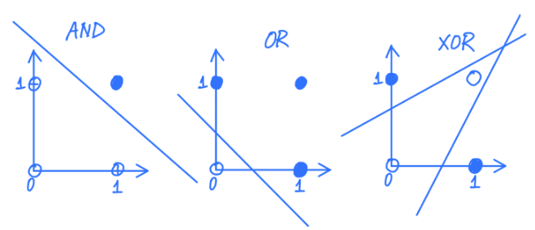

Instructor: Blake Van Berlo

Office: MW 11:30-12:30 DC2130

MW 10:00-11:20 MC4040

MT: Oct. 17

- [Week 1. Sept 7](#week-1-sept-7)
- [Week 2. Sept 12](#week-2-sept-12)
- [Week 3. Sept 19](#week-3-sept-19)
- [Week 4. Sept 26](#week-4-sept-26)
- [Week 5. Oct 3](#week-5-oct-3)
- [Week 7. Oct 17](#week-7-oct-17)
- [Week 8. Oct 24](#week-8-oct-24)
- [Week 9. Oct 31](#week-9-oct-31)
- [Week 10. Nov 7](#week-10-nov-7)
- [Week 11. Nov 14](#week-11-nov-14)
- [Week 12. Nov 21](#week-12-nov-21)
- [Week 13. Nov 29](#week-13-nov-29)

# Week 1. Sept 7

|||
|:-:|:-:|
|thinks like humans|thinks rationally|
|acts like humans|_acts rationally_|

thinking humanly (_cognitive modelling approach_)
* why? humans are one of few with intelligence
* how do humans think? introspection, psychological experiments, brain imaging (BRI)

acting humanly (_turing test approach_)
* an operational definition: interrogator asks the entity via test interface if the test passes then it is intelligent
* useful? lots of debate. gives a way to recognize intelligence but not how to achieve

_rationality_: abstract 'ideal' of intelligence. system is rational if it does 'right thing' given what they know

thinking rationally (_laws of though approach_)
* logicist tradition
* two obstacles:
  * translating natural languages to logic
  * slow to search through large number of statements

acting rationally (_rational agent approach_)
* agent means todo
* a rational agent acts to achieve best (expected) outcome (over uncertainty)
* what behaviors? operate autonomously, perceive environment, adapt to
change, create and pursue goals


model behaviors other than thoughts:
* acting rationally is more general than thinking rationally. correct thinking is only one way to achieve rationality
* when there is no logically correct thing to do, still need to act
* sometimes we do things without thinking - reflexes

use rationality over humans:
* human not necessarily intelligent
* rationality is mathematically well-defined and general
* analogy between intelligence and flying machines
  1. assume structures common to flying animals - fundamental for flying
  2. then understand principles of flying

# Week 2. Sept 12
## uninformed search
__defn.__ a _search problem_ has
* a set of _states_
* an _initial state_
* _goal states/test_: boolean function to tells whether given state is goal
* a _successor (neighbour) function_: action to take from one state to another
* optionally a _cost_ associated with each action
* a solution is a path from start state to a goal state (optionally with smallest cost).

__eg.__ 8-puzzle problem
```
5 3            1 2 3
8 7 6    =>    4 5 6
2 4 1          7 8 0
```

* states: $x_{00},x_{01},x_{02},...,x_{22}$, where $x_{ij}$ is the number in row $i$ and col $j$, $i,j\in\{0,1,2\},x_{ij}\in\{0,...,8\}$. $x_{ij}=0$ denotes empty square
* initial state: 530,876,241
* goal state: 123,456,780
* successor func: consider the empty square as a tile. B is a successor of A if and only if we can convert A to B by moving the empty tile up, down, left, or right by one step.

choosing formulations:
* state determines nodes; successor function determines edges
* ideally we want to minimize them

we often do not generate the graph explicitly and store it, but use tree as we explore the search graph.

__algo.__ _(searching for solution)_
1. construct search tree as we explore paths incrementally from start state
2. maintain a frontier of paths from start node
3. frontier contains all paths for expansion
4. expanding path: remove it from frontier, generate all neighbours of last node, and add paths ending with each neighbour to the frontier

```cpp
search(G, start, test):
    frontier = {s}
    while frontier is not empty:
        pop path n[0]...n[k] from frontier  // main difference
        if test(n[k]):
            return n[0]...n[k]
        for neighbour n of n[k]:
            add n[0]...n[k]n to frontier
```


### DFS
* treats frontier as LIFO stack
* expands last/most recent node added to the frontier
* search one path to completion before starting another (backtrack)

let $b$ be the branching factor, $m$ is max depth of the search tree, $d$ is the depth of the shallowest goal state, then
* space complexity: $O(bm)$
  * remembers $m$ nodes on current path and at most $b$ siblings for each node
* time complexity: $O(b^m)$
* complete (is it guaranteed to find solution?): no
  * will get stuck in infinite path
  * an infinite path may/may not be cycle
* optimal? no guarantee on cost

good when:
* space is limited
* many solutions exist, perhaps with long paths

bad when:
* have infinite paths
* solution is shallow
* there are multiple paths to a node

### BFS
fronter is FIFO queue
* space complexity: $O(b^d)$
  * must visit the top $d$ levels
* time complexity: $O(b^d)$
* complete?: yes
  * will not get stuck in cycle
* optimal? no, but guaranteed to have shallowest

useful when:
* space is not concern
* want solution with fewest arcs

bad when:
* all solutions are deep in tree
* problem is large and the graph is dynamically generated

### iterative-deepening search
* combines BFS and DFS
* for every depth limit from 1, perform depth-first search until depth limit is reached; then start over


* space complexity: $O(bd)$
  * execute DFS for each depth limit => guaranteed to terminate at depth d
* time complexity: $O(b^d)$
* complete? yes
* optimal? no

## heuristic search
* not treating each state identically
* uses heuristics to estimate how close the state to a goal
* try to find optimal solution

__defn.__ a _search heuristic_ $h(n)$ is an estimate of the cost of the cheapest path from node $n$ to a goal node.

good heuristics:
* problem-specific
* nonnegative
* $h(n)=0$ if $n$ is goal
* easy to compute without search

### lowest cost first search
* frontier is a priority queue ordered by $\mathrm{cost}(n)$
* expand the path with lowest cost
* aka _dijkstra algorithm_

properties
* space & time complexities: exponential
* completeness & optimality: yes under mild conditions
  1. branching factor is finite
  2. cost of every edge is bounded below by a positive constant

__eg.__
```
   S ---> A ---> B ---> C ---> ...
 1 |  1/2   1/4    1/8     
   v
   N
```
algo never completes.


### greedy best-first search
* frontier is a priority queue ordered by $h(n)$
* expand node with lowest $h(n)$

properties
* space & time complexities: exponential
  * can have bad heuristics to visit every path in theory
* complete? no, could stuck in cycle
* optimal? no

__eg.__ suppose cost of arc is its length, $h$ is the euclidean distance. then algo get stuck in this graph:


__eg.__ optimal path is SBCG, but algo found SAG:


### A* search
* frontier is a priority queue ordered by $f(n):=\mathrm{cost}(n)+h(n)$
* expand node with lowest $f(n)$

properties
* space & time complexities: exponential
* optimal? if the heuristic $h(n)$ is _admissible_, then solution is optimal.
  * among all optimal algos that start from the same start node and use same heuristic, A* expands fewest nodes
  * proof idea: any algo that does not expand all nodes with $f(n)<C^*$ may miss optimal solution

how to define admissible heuristic:
1. define a relaxed problem: by simplifying or removing constraints
2. solve relaxed problem without search
3. the cost of optimal solution to relaxed problem is an admissible heuristic to original problem

desireable heuristic properties:
* heuristic is admissible, ie $0\leq h(n)\leq h^*(n)$, where $h^*$ is cost of simplified solution
  * heuristic have higher values (it is close to $h^*$)
* heuristic that is very different for different states

__defn.__ given heuristics $h_1,h_2$, $h_2$ dominates $h_1$ if
* $\forall n\,h_2(n)\geq h_1(n)$
* $\exist n\, h_2(n)>h_1(n)$

__theorem.__ if $h_2$ dominates $h_1$, then A* using $h_2$ never expands more nodes than that uses $h_1$.

some heuristics for 8-puzzle:
* manhattan distance heuristic: sum of manhattan distance of the tiles from their goal positions
  * obtained by allowing any tile to move to any adj position
* misplaced tile heuristic: whether position has its goal tile
  * obtained by allowing tile to move to any empty location

__eg.__ which heuristic for 8-puzzle is better?  manhattan is better since it always adds at least 1 if tile is not in place, but misplaced tile heuristic only adds 1.

### cycle pruning
stop expanding path once we are following a cycle

```cpp
...
for neighbour n of n[k]:
    if n not in n[0]...n[k]:
        add n[0]...n[k]n to frontier
...
```

* time complexity for DFS: constant
* time complexity for BFS: linear in path length

### multiple-path pruning

if we found a path to a node, we can discard other paths to same node.
* cycle pruning is a special case of multi-path pruning

```cpp
search(G, start, test):
    frontier = {s}
    explored = {}
    while frontier is not empty:
        pop path n[0]...n[k] from frontier
        if n[k] in explored:
            continue
        add n[k] to explored
        if test(n[k]):
            return n[0]...n[k]
        for neighbour n of n[k]:
            add n[0]...n[k]n to frontier
```

__eg.__
* can LCFS discard optimal solution? no
* can A* discard optimal solution? yes
  * when we select a path to a node for 1st time, it may not be optimal

consistent heuristic:
* an admissible heuristic requires that for any node $m$ and any goal node $g$, we need $h(m)-h(g)\leq\mathrm{cost}(m,g)$.
* to ensure that A* with multi-pruning is optimal, we need a _consistent_ heuristic function, ie for any two nodes $m,n$ we have $h(m)-h(n)\leq\mathrm{cost}(m,n)$
  * so that we hit optimal path to a node first so it will not get discarded
* a consistent heuristic satisfies monotone restriction, ie for any edge $mn$, we have $h(m)-h(n)\leq\mathrm{cost}(m,n)$
  * needs proof

# Week 3. Sept 19
## constraint satisfaction
difference from heuristic search problem?
* it does not care about optimality
* it is aware of internal structure of state
  * eg. 4-queens: if we have 2 queens in same row, search will keep trying, whereas CSP will discard
* it is more efficient than search since it can discard large portion of search space

__defn.__ in _CSP_, each state contains:
* set X of variables
* set D of domainsL $D_i$ is the domain for variable $X_i$ for all i
* set C of constraints specifying allowable value combinations

a solution is an assignment of values to all variables satisfying all constraints.

__eg.__ state definition of 4-queens
* variables: $x_0,x_1,x_2,x_3$ where $x_i$ is row position of the queen in column $i$, where $i=0,1,2,3$
* domains: $D_{x_i}=0,1,2,3$ for all $x_i$
* constraints: no pair of queens are in same row or diagonal: $\forall i\,\forall j\left((i \neq j) \rightarrow\left(\left(x_i \neq x_j\right) \wedge\left(\left|x_i-x_j\right| \neq|i-j|\right)\right)\right)$

__eg.__ do you need to specify column constraint? no since it is already defined implicitly by separate variables for each column.

two ways of defining constraints:
* list/table format: give a list of values of the variables that satisfy constraints
* function/formula format: return true of values satisfy constraints (propositional formula)

### backtracking search
we need to reformulate problem into incremental problem.

```cpp
backtrack(assignment, CSP):
    if assignment is complete:
        return assignment
    var = unassigned variable
    for every value of var.domain:
        if adding {var=value} satisfies all constraints:
            add {var=value} to assignment
            result = backtrack(assignment, CSP)
            if result is not FAIL:
                return result
        remove {var=value} from assignment if it was added
    return FAIL
```

__eg.__ incremental CSP formulation for 4-queen:
* state: one queen per column in the leftmost k columns with no pair of queens attacking each other
  * same as above, but $x_i$ can be `_` to denote it has no assignment yet
* goal state: 4 queens on board. no pair of queens are attacking each other.
  * eg `2 3 0 1`
* initial state: empty board `_ _ _ _`
* successor function: add a queen to leftmost empty column such that it is not attacked by other existing queen
  * eg `0_ _ _` has successors `0 2 _ _` and `0 3 _ _`


### arc-consistency
* we consider binary constraints only
* how to handle constraints involving 3 or more variables?
  * convert to binary constraints
* how to handle unary constraints?
  * remove invalid values from variable domain

__notation.__ if $X,Y$ are two variables, write $c(X,Y)$ as a binary constraint.
* $\lang X,c(X,Y)\rang$ denotes an _arc_, where $X$ is primary variable and $Y$ is secondary


__defn.__ an arc $\lang X,c(X,Y)\rang$ is _arc-consistent_ iff for every value $v\in D_X$, there is a value $w\in D_Y$ such that $(v,w)$ satisfies the constraint $c(X,Y)$.

__eg.__ consider constraint $X<Y$. let $D_X=D_Y=\{1,2\}$. is the arc $\lang X,X<Y\rang$ consistent?  
no since if $x=2$ we cannot find value in $D_Y$ to satisfy constraint.

__algo.__ _(AC-3 arc consistency)_
```cpp
// reduce domains to permit only valid answers
AC3(arcs):
    S = all arcs
    while S is not empty:
        select and remove ⟨X, c(X, Y)⟩ from S
        remove every value in X.domain that does not have a value in Y.domain \
            that satisfies the constraint c(X, Y)
        if X.domain was reduced:
            if X.domain is empty:  // no solution
                return false
            for every Z != Y:
                add ⟨Z, c'(Z, X)⟩ to S  // or c'(X, Z)
    return true
```


__eg.__ why do we need to add arcs back to S after reducing a variable's domain?  
reducing a variable's domain may cause a previously consistent arc to become inconsistent

properties:
* does order of removing arcs matter? no
* there are three possible outcomes of the arc consistency problem:
  1. domain is empty => no solution
  2. every domain has 1 value => found solution without search
  3. every domain has at least 1 value and some domain has multiple values => need to search
* guaranteed to terminate? yes
* time complexity: $O(cd^3)$ for $n$ variables, $c$ binary constraints and the size of each domain is at most $d$
  * each arc $\lang X_k,X_i\rang$ can be added to queue at most $d$ times because we can delete at most $d$ values from $X_i$. checking consistency of an arc takes $O(d^2)$.

__algo.__ _(combining backtracking & arc consistency)_
1. perform backtracking search
2. after each value assignment, do arc consistency
3. if domain is empty, return no solution (backtracks)
4. if unique solution is found, return solution
5. otherwise, continue search on the unassigned variables

## local search
difference:
* space may be infinite => do not explore search space systematically
* do not care about path to the goal
* can find reasonably good states quickly on average
* not guaranteed to find solution even if one exists. cannot prove no solution exists
* can solve pure optimization problem

_complete-state formulation_: start with a complete assignment of values to variables, then take steps to improve solution iteratively

__defn.__ a _local search problem_ consists of:
* state: a complete assignment to all variables
* neighbour relation
* cost function

__eg.__ local search problem for 4-queens
* states:
  * variables: $x_0,x_1,x_2,x_3$ where $x_i$ is row position of the queen in col $i$.
  * domain: $x_i\in\{0,1,2,3\}\,\forall i$
* initial state: a random state
* goal state: 4 queens on board. no pair of queens are attacking each other
* neighbour relation:
   1. move one queen to another row in same column
   2. or swap row positions of two queens
* cost function: number of pairs of queens attacking each other directly or indirectly

the version 2 of the neighbour relation has disconnected components (eg. starting from `3211` we never get to optimal solution). however even if graph is connected we still might not find global optimum.

### greedy descent (hill climbing)
> descend into a canyon in a thick fog with amnesia/

* start with random state
* move to a neighbour with lowest cost if it is better than current state, otherwise stop

properties:
* makes rapid progress toward a solution
* can find local optimum only


__eg.__ consider `3210` with relation 2, it is not local optimum nor global.

__eg.__ consider `2301` with relation 1, it is (flat) local optimum but not global.

escape flat local maxima:
* _sideway moves_: allow algo to move to a neighbour that has same cost
  * may get into infinite loop => limit number of consecutive sideway moves
* _tabu list_: keep a small list of recently visited states and forbid algo to return to those states

choosing neighbour relation:
* use small incremental change to variable assignment
* tradeoff:
  * bigger neighbourhoods (preferred): compare more nodes at each step. more likely to find the best step. each step takes more time.
  * smaller neighbourhoods: compare fewer nodes at each step. less likely to find the best step. each step takes less time

random moves:
* random restarts: restart search in a different part of the space
  * probability of finding global optimum approaches to 1
* random moves: move to a random neighbour

__eg.__ random restart is good for a, random walk is good for b  


### simulated annealing
* start with high temperature and reduce it slowly
* at each step, choose a random neighbour
  * if it is better, move to it
  * otherwise, move to a neighbour probabilistically depending on:
    * current temp T
    * how much worse is the neighbour compared to current state
* at high temp, performs walks (exploration) more likely take worse steps
* as temp approaches to 0, perform greedy descent (exploitation)

let $A$ be current state and $A'$ is the worse neighbour, let $T$ be current temp, then we will move to $A'$ with prob $e^{-\frac{\Delta C}{T}}$ where $\Delta C=\mathrm{cost}(A')-\mathrm{cost}(A)$.
* Boltzmann distribution
* as $T\rightarrow0$ or $\Delta C\rightarrow\infty$ the prob approaches to 0

__algo.__
```cpp
simulated_annealing():
    current = initial_state
    T = large positive value
    while T > 0:
        next = random_choice(current.neighbours)
        dC = cost(next) - cost(current)
        if dC < 0:
            current = next
        else:
            current = next with prob e^(-dC/T)
    decrease(T)
    return current
```

in practice, geometric cooling is most widely used (multiply by .99 each step)

### population-based
instead of remembering one single state, we remember multiple states.

_beam search_
* remember k states
* choose k best states from all neighbours
* k controls space and parallelism

__eg.__
* what is beam search with k=1? greedy descent
* k=infinity? BFS

__eg.__  how is beam search different from k random restarts in parallel? in beam search, useful info can be passed across each thread.

problem with beam search: suffers from lack of diversity among k states => can quickly becomes concentrated in a small region.

_stochastic beam search_:
* choose k states probabilistically
  * prob is proportional to its fitness => can $\propto e^{\mathrm{cost}(A)/T}$
* maintains diversity in the population of states
* mimics natural selection
* asexual reproduction

genetic algo:
* sexual reproduction
* maintain population of k states
* randomly choose two to reproduce, prob of choosing a state for reproduction to proportional to fitness
* two parent states crossover to produce a child state
* child state mutates with small probability

# Week 4. Sept 26

## uncertainty
why uncertainty?
* agent does not know everything (current state and next states), but has to act
* decisions are made in the absence of info or in the presence of noise

probability is formal measure of uncertainty.

two camps:
1. Frequentists' view
   * objective
   * compute probabilities by counting the frequencies of events
   * cannot make decision without observation
2. Bayesian's view (primary)
   * subjective
   * probs are degrees of belief
   * start with prior beliefs and update beliefs based on evidence
   * different agents can have different beliefs. without data, can make decision based on uninformed prior

some axioms:
1. $0\leq P(A)\leq1$
2. $P(\mathrm{true})=1,P(\mathrm{false})=0$
3. inclusion-exclusion principle: $P(A\lor B)=P(A)+P(B)-P(A\land B)$

__defn.__
* a _probabilistic model_ contains a set of random variables
* an _atomic event_ assigns a value to every random variable
* a _joint probability distribution_ assigns a probability to every atomic event

__defn.__ $P(X)$ is _prior_ or _unconditional probability_, ie likelihood of X in the absence of any other information and is based on background info

__defn.__ $P(X|Y)$ is _posterior_ or _conditional probability_, ie based on Y as evidence.

__theorem.__ _(sum rule)_ $P(A)=P(A\land B)+P(A\land\lnot B)$.

__theorem.__ _(product rule)_ $P(A|B)=\frac{P(A\land B)}{P(B)}$.

__theorem.__ $P(X_n\land...\land X_1)=\prod_{i=1}^nP(X_i|X_{i-1}\land...\land X_1)$.

__eg.__ given
* $P(A)=.1$
* $P(W|A)=.9$
* $P(W|A\overline{G})=.9$
* $P(G|A)=.3$
* $P(G|AW)=.3$

then $P(AW\overline{G})=P(A)\cdot P(W|A)\cdot P(\overline{G}|AW)=.1\cdot.9\cdot.7=.063$.

__theorem.__ _(Bayes' rule)_ $P(X|Y)=\frac{P(Y|X)P(X)}{P(Y)}$.

### universal approach
steps:
1. convert conditional probability to joint probabilities
   * use product rule
2. change each joint probability to involve all variables
   * use sum rule
3. calculate a joint probability using chain rule

__eg.__ compute $P(A|C)$ given
* $P(A)=.6$
* $P(B|A)=.4,P(\overline{B}|\overline{A})=.2$
* $P(C|AB)=.1,P(C|\overline{A}B)=.2,P(C|A\overline{B})=.5,P(C|\overline{A}\overline{B})=.8$

1. step 1: $P(A|C)=\frac{P(AC)}{P(C)}$
2. step 2:
   * $P(AC)=P(ABC)+P(A\overline{B}C)$
   * $P(C)=P(ABC)+P(A\overline{B}C)+P(\overline{A}BC)+P(\overline{AB}C)$
3. step 3:
   * $P(ABC)=P(A)P(B|A)P(C|AB)$
   * $P(A\overline{B}C)=P(A)P(\overline{B}|A)P(C|A\overline{B})$
   * $P(\overline{A}BC)=P(\overline{A})P(B|\overline{A})P(C|\overline{A}B)$
   * $P(\overline{AB}C)=P(\overline{A})P(\overline{B}|\overline{A})P(C|\overline{AB})$
4. finally $P(A|C)=...=.614$

__defn.__ $X,Y$ are _independent_ if any of following is true:
* $P(X|Y)=P(X)$
* $P(Y|X)=P(Y)$
* $P(XY)=P(X)P(Y)$

__defn.__ $X,Y$ are _conditionally independent_ given $Z$ if any of following is true:
* $P(X|YZ)=P(X|Z)$
* $P(Y|XZ)=P(Y|Z)$
* $P(XY|Z)=P(X|Z)P(Y|Z)$

__eg.__ suppose we have $A,B,C$. how many probabilities do we need to specify the joint distribution?  
$P(A),P(B|A),P(C|AB)\implies1+2+4=7$ probabilities.


in general, we need $2^n-1$ probabilities to specify joint distribution of n boolean RVs.

__eg.__ suppose we have $A,B,C$ and $A,B$ are conditionally independent given $C$. how many probabilities do we need to specify the joint distribution?  
5.


### bayesian network
__defn.__ a _bayesian network_ is a DAG where
* each node corresponds to a random variable
* X is a _parent_ of Y if there is an arrow from node X to Y
* each node $X_i$ has a conditional probability distribution $P(X_i|\textrm{parents}(X_i))$ that quantifies effect of parents on the node

it is a compact version of joint distribution.

there are two ways to understand bayesian networks:
* a representation of joint probability distribution
* an encoding of conditional independence assumptions

we can compute each joint probability using
$$
P(X_n...X_1)=\prod_{i=1}^n(X_i|\mathrm{Parents}(X_i))
$$

__eg.__ what is probability of $A\overline{B}\overline{E}WG\overline{E}$?  

$$
\begin{aligned}
    P(\overline{BE}A\overline{R}GW)&=P(\overline{B})P(\overline{E})P(A|\overline{BE})P(\overline{R}|\overline{E})P(G|A)P(W|A)\\
    &=(1-0.0001)(1-0.0003)(0.01)(1-0.0002)(0.4)(0.8)\\
    &=3.2\cdot10^{-3}
\end{aligned}
$$

__eg.__ are B and W independent?
```
B -> A -> W
```
no. if B is true, then A is more likely true, so W is more likely true.

are B, W conditionally independent given A? yes.

__eg.__ are W and G independent?
```
A -> W
  -> G
```
no. if W is more likely true, then A is more likely true, so G is more likely true.

are W, G conditionally independent given A?  yes.

__eg.__ are E, B independent?
```
E -> A
B ->
```
yes.

are E, B conditionally independent given A? no. suppose A is true. if E is true, then it is less likely that A is caused by B. if B is true, then it is less likely A is caused by E.

# Week 5. Oct 3

__defn.__ observed variable $E$ _d-separates_ $X$ and $Y$ iff $E$ blocks every undirected path between $X$ and $Y$.

__claim.__ if $E$ d-separates $X$ and $Y$, then $X$ and $Y$ are conditionally independent given $E$.

what do we mean by block?
```py
case 1. if N is observed, then it blocks path between X, Y

X ---- A ---> N ---> B ---- Y
  any                   any
undirected          undirected
  path                 path

case 2. if N is observed, then it blocks path between X, Y

X ---- A <--- N ---> B ---- Y

case 3. if N and its descendants are NOT observed, then they block path between X, Y

X ---- A ---> N <--- B ---- Y
              |
              v
             ...

otherwise we cannot say guarantee independence relationship.
```

__eg.__  


* are TravelSubway and HighTemp independent? no as $E=\varnothing$ no. path is blocked
* are TravelSubway and HighTemp (conditionally) independent given Flu? yes. $E=\{\textrm{Flu}\}$; paths are blocked by observed evidence Flu (case 1).
* are Aches and HighTemp independent? no.
* are Aches and HighTemp independent given FLu? yes (case 1 and 2).
* are Flu and ExoticTrip independent? yes (case 3).
* are Flu and ExoticTrip independent given HighTemp? no. HighTemp is observed.

### constructing bayesian networks
for a joint probability distribution, there are many correct bayesian networks

__defn.__ given a bayesian network $A$, a bayesian network $B$ is correct iff:
  * if bayesian network B requires two variables to satisfy an independence relationship, bayesian network A must also require the two variables to satisfy the same independence relationship.

we prefer a network that requires fewer probabilities.

notes:
* having an edge between two variables does NOT mean the two variables are dependent
  ```
  A ---> B
  ```
* the absence of an edge between two variables satisfy an independence relationship
  ```
  A      B
  ```

an edge only represents correlation, not causality.

__algo.__ _(constructing correct bayesian network)_
1. order variables $\{X_1,...,X_n\}$
2. for each variable $X_i$,
   1. choose the node's parents such that $P(X_i|\mathrm{Parents}(X_i))=P(X_i|X_{i-1}\land...\land X_1)$
   2. ie choose the smallest set of parents from $\{X_1,...,X_{i-1}\}$ such that given $\mathrm{Parents}(X_i)$, $X_i$ is independent of all nodes in $\{X_1,...,X_{i-1}\}-\mathrm{Parents}(X_i)$
   3. create a link from each parent of $X_i$ to $X_i$
   4. write down conditionals probability table $P(X_i|\mathrm{Parents}(X_i))$

__eg.__ consider network
```
B ---> A ---> W
```
construct correct bayesian network by adding variables W, A, B.
```
W --> A --> B
```
in the original network, B and W have no edges so there is no requirement for B and W in new graph. we could draw arrow from W to B.

__eg.__ consider network
```
A ---> W
 \
  v
   G
```
construct correct bayes net by adding variables in the order: W, G, A.
```
W ---> G
 \    /
  v  v
    A
```
> __Step 1__: add W to the network
>
> __Step 2__: add G to the network
>
> What are the parent nodes of G? The network had one node before adding G. We have two options: Either G has no parent, or W is G’s parent.
>
> If W is not G’s parent, then the new network requires G and W to be unconditionally independent (since we haven’t added A to the network yet). Can the new network require this?
>
> Let’s look at the original network. In the original network, there is no edge between W and G. By d-separation, W and G are independent given A. However, if we haven’t observed A, W and G are not unconditionally independent. Since the original network does not require W and G to be unconditionally independent, the new network also cannot require W and G to be unconditionally independent. Therefore, W must be G’s parent.
>
> __Step 3__: add A to the network.
What are the parent nodes of A? W and G were added before adding A. We have four options: no parent, W is the only parent, G is the only parent, and W and G are both parents of A.
>
> In the original network, W and A are directly connected. The original network does not require W and A to be independent. Therefore, the new network cannot require W and A to be independent. W must be A’s parent.
>
> Similarly, in the original network, G and A are directly connected. The original network does not require G and A to be independent. Therefore, the new network cannot require G and A to be independent. G must be A’s parent as well.

__eg.__ consider network
```
E ---> A
      ^
     /
    B
```
construct correct bayes net by adding variables in the order: A, B, E.
```
A ---> B
 \    /
  v  v
   E
```

> __Step 1__: add A to the network.
> 
> __Step 2__: add B to the network.
> What are the parent nodes of B? The network had one node before adding B. We have two options: Either B has no parent, or A is B’s parent.
>
> In the original network, A and B are directly connected. The original network does not require A and B to be independent. Thus, the new network cannot require A and B to be independent. A must be B’s parent.
>
> __Step 3__: add E to the network.
> 
> What are the parent nodes of E? A and B were added before E. We have four options:
no parent, A is the only parent, B is the only parent, and A and B are both parents
of E.
>
> In the original network, A and E are directly connected. The original network does
not require A and E to be independent. Therefore, the new network cannot require A
and E to be independent. A must be E’s parent.
>
> Should B be E’s parent or not? If B is not E’s parent, then the new network requires
E to be independent of B given A. Can the new network require this? Let’s look at
the original network. In the original network, B and E are not independent given A.
Since the original network does not require B and E to be independent given A, then
the new network also cannot require B and E to be independent given A. Therefore,
B must also be E’s parent.

__eg.__  


original network has 12 probabilities, new net has 33 probabilities.

original network is easier since it is picked from casual relationships.

how to add fewest edges? cause precedes effect: pick causal relationship first, then effect.

### variable elimination

__eg.__ compute probabilistic query: $P(B|w\land g)=\lang P(b|w\land g),P(\lnot b|w\land g) \rang$, where B is _query variable_, W, G are _evidence variables_, E, A, R are _hidden variables_. lowercase letters are for values.
$$
\begin{aligned}
P(B | w \wedge g) &=\frac{P(B \wedge w \wedge g)}{P(w \wedge g)} \\
&=\frac{P(B \wedge w \wedge g)}{P(b \wedge w \wedge g)+P(\neg b \wedge w \wedge g)} \\
& \propto P(B \wedge w \wedge g) \\\
& \propto \sum_e \sum_a \sum_r P(B \wedge e \wedge a \wedge w \wedge g \wedge r) \\
& \propto \sum_e \sum_a \sum_r P(B) P(e) P(a | B \wedge e) P(w | a) P(g | a) P(r | e)\\\
& \propto P(B)\sum_e P(e)\sum_a P(a|B\land e)P(w|a)P(g|a)\sum_r P(r|e)\\\
& \propto P(B)\sum_e P(e)\sum_a P(a|B\land e)P(w|a)P(g|a)
\end{aligned}
$$
normalize at the end. 57 => 14 operations.

__algo.__ _(inference by enumeration)_
```py
enumerate(vars, bn, evidence):
    if vars is empty:
        return 1.0
    Y = vars[0]
    if Y has value y in evidence:
        return P(Y|parents(Y)) * Enumerate(vars[1:], bn, evidence)
    else:
        return ∑_y P(y|parents(Y)) * Enumerate(vars[1:], bn, evidence ∪ {y})
```

it is challenging to perform probabilistic inference so we use approximation.

__defn.__ a _factor_ is a function from some random variables to a number.

factors can represent a joint or conditional distribution or else.

__defn.__ to _restrict_ a factor, we mean assigning an observed value to evidence variable.

__defn.__ to _sum out_ a variable, we sum out $X_1$ with domain $\{v_1,...,v_k\}$ from factor $f(X_1,...,X_j)$ and produce a factor defined by:
$$
f_{\sum_{X_1}}(X_2,...,X_j)=f(X_1=v_1,...,X_j)+...+f(X_1=v_k,...,X_j)
$$

__defn.__ to _multiply_ factors $f_1(X,Y)$ and $f_2(X,Y)$ where $Y$ is the variable in common, the product is defined by (domain is cartesian product):
$$
(f_1\times f_2)(X,Y,Z)=f_1(X,Y) \times f_2(Y,Z)
$$

__defn.__ to _normalize_ a factor, divide each value by the sum of all values.

__eg.__ given factor $f(X,Y,Z)$:
|X|Y|Z|value
|:-:|:-:|:-:|:-:|
|t|t|t|.1|
|t|t|f|.9
|t|f|t|.2
|t|f|f|.8
|f|t|t|.4
|f|t|f|.6
|f|f|t|.3
|f|f|f|.7

what is $f_2(Y,Z)=f_1(X=x,Y,Z)$?
|Y|Z|value
|:-:|:-:|:-:|
|t|t|.1|
|t|f|.9
|f|t|.2
|f|f|.8

what is $f_3(Y)=f_2(Y,Z=\lnot z)$?
|Y|value
|:-:|:-:|
|t|.9
|f|.8

what is $f_4()=f_3(Y=\lnot y)$ $f_3()=.8$

what is $f_{\sum_{X}}(Y,Z)$?
|Y|Z|value
|:-:|:-:|:-:|
|t|t|.1+.4=.5
|t|f|.9+.6=1.5
|f|t|.2+.3=.5
|f|f|.8+.7=1.5

what is $(f_3\times f_{\sum_X})(Y,Z)$?
|Y|Z|value
|:-:|:-:|:-:|
|t|t|.9*.5
|t|f|.9*1.5
|f|t|.8*.5
|f|f|.8*1.5

__algo.__ _(variable elimination)_ to compute $P(X_q|X_{o1}=v_1\land...\land X_{oj}=v_j)$,
1. construct a factor for each conditional probability distribution
2. restrict observed variables to their observed values
3. eliminate each hidden variable $X_{hj}$
   1. multiply all factors that contain $X_{hj}$ to get $g_j$
   2. sum out variable $X_{hj}$ from factor $g_j$
4. multiply remaining factors
5. normalize resulting factor

__eg.__ find $P(B|\lnot a)$  


properties of VEA:
* complexity is exponential in space and time and depends on
  * size of the CPT in bayesian network
  * size of largest factor during execution
* every order of elimination yields a valid algorithm, but yield different intermediate factors

__eg.__ which of R and A do we eliminate first?  


eliminate R first. otherwise A's factor is big.

choosing elimination ordering:
* it is intractable to determine optimal order
* good greedy heuristic: eliminate variable that minimizes size of next factor
* use _polytree_ (singly connected network: at most one undirected path between any two nodes)
  * time and space complexity can be linear in the network size

__claim.__ _(irrelevant variables)_ every variable that is not an ancestor of a query variable or evidence variable is irrelevant to query.

# Week 7. Oct 17
## hidden markov models

* the world contains a series of time slices
* each time slice contains set of random variables:
  * $S_t$: unobservable state at time t
  * $O_t$: signal/observation at time t

we let the current state depend on a fix number of previous states.

__defn.__ _(1st order markov assumption)_ the _first-order markov process_ has transition model:
$$
P(S_t|S_{t-1}S_{t-2}...S_0)=P(S_t|S_{t-1})
$$
ie current state only depends on last state.

__defn.__ _(sensor markov assumption)_ each state is sufficient to generate the next observation:
$$
P(O_t|S_tS_{t-1}...S_0O_{t-1}...O_0)=P(O_t|S_t)
$$

stationary process:
* dynamics does not change over time
* conditional probability distribution for each time step remains the same
* advantages: simple to specify
  * natural: dynamics typically do not change. if it changes, it is due to another feature we can model
  * infinite number of params gives infinite network

__eg.__ the outside can rain or not, people can also probably bring umbrella into the room. so there is dependence between rain and umbrella.
* let $S_t$ be true iff it rains on day $t$
* let $O_t$ be true iff people bring umbrella on day $t$

then we have network  


### common tasks in inference

__defn.__ _(filtering)_: the posterior distribution over most recent state given all evidence to date is $P(S_t|O_{0:t})$
* which state am i in right now?

__algo.__
* let $f_{0:k}=P(S_k|o_{0:k})$, and $\alpha$ be a normalization constant
* base case: $f_{0:0}=P(S_0|o_0)=\alpha P(o_0|S_0)P(S_0)$
  * by bayes rule
* recursive case: $f_{0:k}=\alpha P(o_k|S_k)\sum_{s_k-1}P(S_k|s_{k-1})f_{0:(k-1)}$

__proof.__ the base case comes from bayes rule; the recursion is:
$$
\begin{aligned}
P(S_k | o_{0: k})&=P(S_k | o_k \wedge o_{0:(k-1)}) \\
&=\alpha P(o_k | S_k \wedge o_{0:(k-1)}) P(S_k | o_{0:(k-1)})&\text{(bayes rule)}\\
&=\alpha P(o_k | S_k) P(S_k | o_{0:(k-1)})&\text{(markov assumption)} \\
&=\alpha P(o_k | S_k) \sum_{s_{k-1}} P(S_k \wedge s_{k-1} | o_{0:(k-1)})&\text{(sum rule)} \\
&=\alpha P(o_k | S_k) \sum_{s_{k-1}} P(S_k | s_{k-1} \wedge o_{0:(k-1)}) P(s_{k-1} | o_{0:(k-1)})&\text{(product rule)} \\
&=\alpha P(o_k | S_k) \sum_{s_{k-1}} P(S_k | s_{k-1}) P(s_{k-1} | o_{0:(k-1)})&\text{(see network)}
\end{aligned}
$$
$\square$

__eg.__ filtering in the umbrella example
we have
$$
\begin{aligned}
    P(S_0|o_0)&=\alpha P(o_0|S_0)P(S_0)\\
    &=\alpha\lang0.9,0.2\rang*\lang0.5,0.5\rang\\
    &=\alpha\lang0.45,0.1\rang\\
    &=\lang0.818,0.182\rang
\end{aligned}
$$
then
$$
\begin{aligned}
    P(S_1|o_{0:1})&=\alpha P(o_1|S_1)\sum_{s_0}P(S_1|s_0)P(s_0|o_0)\\
&=\alpha P(o_1 | S_1) *(P(S_1 | s_0) * P(s_0 | o_0)+P(S_1 | \neg s_0) * P(\neg s_0 | o_0))\\
&=\alpha\langle P(o_1 | s_1), P(o_1 | \neg s_1)\rangle\\
&\quad*(\langle P(s_1 | s_0), P(\neg s_1 | s_0)\rangle * P(s_0 | o_0)\\
&\quad+\langle P(s_1 | \neg s_0), P(\neg s_1 | \neg s_0)\rangle * P(\neg s_0 | o_0))\\
&=\alpha\langle 0.9,0.2\rangle(\langle 0.7,0.3\rangle * 0.818+\langle 0.3,0.7\rangle * 0.182) \\
&=\alpha\langle 0.9,0.2\rangle(\langle 0.5726,0.2454\rangle+\langle 0.0546,0.1274\rangle) \\
&=\alpha\langle 0.9,0.2\rangle *\langle 0.6272,0.3728\rangle \\
&=\alpha\langle 0.56448,0.07456\rangle\\
&=\lang0.883,0.117\rang
\end{aligned}
$$

__defn.__ _(prediction)_ posterior distribution over the future given all evidence to date is $P(S_k|O_{0:t})$ for $k>t$.
* which state will i be tomorrow?

use the recursion: $P(S_{k+1}|o_{0:t})=\sum_{s_k}P(S_{k+1}|s_k)P(s_k|o_{0:t})$.

__defn.__ _(smoothing)_ posterior distribution over a past state, given all evidence to date is $P(S_k|O_{0:t})$ for $0\leq k<t$.
* which state was i in yesterday?

__algo.__ given observations from day 0 to t-1, to compute $P(S_k|o_{0:(t-1)})$ where $0\leq k\leq t-1$, we do
$$
\begin{aligned}
    P(S_k|o_{0:(t-1)})&=\alpha P(S_k|o_{0:k})P(o_{(k+1):(t-1)}|S_k)\\
    &=:\alpha f_{0:k}b_{(k+1):(t-1)}
\end{aligned}
$$
we calculate $b_{(k+1):(t-1)}$ using backward recursion:
* base case: $b_{t:(t-1)}=\lang1,1\rang$
* recursive: $b_{(k+1):(t-1)}=\sum_{s_k+1}P(o_{k+1}|s_{k+1})b_{(k+2):(t-1)}P(s_{k+1}|S_k)$

__proof.__ for the formula:
$$
\begin{aligned}
P&=(S_k | o_{0:(t-1)}) \\
&=P(S_k | o_{(k+1):(t-1)}  o_{0: k}) \\
&=\alpha P(S_k  o_{0: k}) P(o_{(k+1):(t-1)} | S_k  o_{0: k})&\text{(bayes rule)} \\
&=\alpha P(S_k  o_{0: k}) P(o_{(k+1):(t-1)} | S_k)&\text{(markov assumption)} \\
\end{aligned}
$$

for the backward recursion:
$$
\begin{aligned}
P(o_{(k+1):(t-1)} | S_k)
&=\sum_{s_{k+1}} P(o_{(k+1):(t-1)} | s_{k+1} | S_k) &\text{(sum rule)}\\
&=\sum_{s_{k+1}} P(o_{(k+1):(t-1)} | s_{k+1}  S_k) * P(s_{k+1} | S_k)&\text{(product rule)} \\
&=\sum_{s_{k+1}} P(o_{(k+1):(t-1)} | s_{k+1}) * P(s_{k+1} | S_k) &\text{(markov assumption)}\\
&=\sum_{s_{k+1}} P(o_{k+1}  o_{(k+2):(t-1)} | s_{k+1}) * P(s_{k+1} | S_k) \\
&=\sum_{s_{k+1}} P(o_{k+1} | s_{k+1}) * P(o_{(k+2):(t-1)} | s_{k+1}) * P(s_{k+1} | S_k)&\text{(markov assumption)}
\end{aligned}
$$
$\square$

__eg.__ compute $P(S_1|o_{0:2})$.  
k=1, t=3, we need to compute $\alpha f_{0:1}b_{2:2}$.
$$
\begin{aligned}
b_{2: 2}&=P(o_{2: 2} | S_1) \\
&=\sum_{s_2} P(o_2 | s_2) * b_{3: 2} * P(s_2 | S_1) \\
&=\sum_{s_2} P(o_2 | s_2) * P(o_{3: 2} | s_2) * P(s_2 | S_1) \\
&=\sum_{s_2} P(o_2 | s_2) * P(o_{3: 2} | s_2) *\langle P(s_2 | s_1), P(s_2 | \neg s_1)\rangle \\
&=(P(o_2 | s_2) * P(o_{3: 2} | s_2) *\langle P(s_2 | s_1), P(s_2 | \neg s_1)\rangle. \\
&.\quad \quad \quad+P(o_2 | \neg s_2) * P(o_{3: 2} | \neg s_2) *\langle P(\neg s_2 | s_1), P(\neg s_2 | \neg s_1)\rangle)\\
&=(0.9 * 1 *\langle 0.7,0.3\rangle+0.2 * 1 *\langle 0.3,0.7\rangle) \\
&=(0.9 *\langle 0.7,0.3\rangle+0.2 *\langle 0.3,0.7\rangle) \\
&=(\langle 0.63,0.27\rangle+\langle 0.06,0.14\rangle) \\
&=\langle 0.69,0.41\rangle
\end{aligned}
$$

__eg.__ reuse intermediate values to compute $P(S_0|0_{0:3})$ to $P(S_3|o_{0:3})$ in a row.  


__defn.__ _(most likely explanation)_ find the sequence of states that is most likely generated all the evidence to date is $P(S_{0:t}|O_{0:t})$
* which sequence of states is most likely to have generated the observations

# Week 8. Oct 24
## learning
* agent needs to remember its past in a way that is useful for its future
* want agent to do more, do better, do faster
* why want agent to learn?
  * cannot anticipate all possible situations
  * cannot anticipate changes over time
  * do not know how to program a solution

the learning architecture
* problem/task
* experience/data
* background knowledge/bias
* measure of improvement

types of learning problems:
* supervised learning: given input features, target features and training examples, predict value of target features for new examples given their values on input features
* unsupervised learning: learning classifications when examples do not have targets defined
  * eg clustering, dimensionality reduction
* reinforcement learning: learning what to do based on rewards and punishments

two types of supervised learning problems:
* classification: discrete target features (eg weather)
* regression: continuous target features (eg temperature)

## supervised learning
* given training examples of the form $(\vec{x},f(\vec{x}))$
* return a hypothesis function $h$ that approximate the true function $f$

learning as search problem:
* given a hypothesis space, learning is search problem
* search space is large for systematic search
* ml techniques are often some forms of local search

__eg.__ fitting points


all curves can be justified as the correct one from some perspective.

_no free lunch theorem_: to learning something useful, we have to make some assumptions - have an inductive bias
* assumptions include: do we have any outliers? does the curve follow a particular parametric form?

generalization:
* goal of ml is to find a hypothesis that can predict unseen examples correctly
* how to choose hypothesis that generalizes well?
  * _ockham's razor_: prefer simplest hypothesis consistent with data
  * _cross-validation_: more principled approach to choose hypothesis
* tradeoff between
  * complex hypothesis that fit training data well
  * simpler hypothesis that may generalizes better

bias-variance tradeoff:
* _bias_: if i have infinite data, how well can i fit data with my learned hypothesis?
  * a hypothesis with high bias makes strong assumptions, too simplistic, has few degrees of freedom, does not fit the training data well
* _variance_: how much does learned hypothesis vary given different training data?
  * hypothesis with high variance has a lot of degrees of freedom, is very flexible, and fits the training data well. but whenever the training data changes, the hypothesis changes a lot


### cross validation
* use part of the training data as a surrogate for test data (called validation data).
* use validation data to choose hypothesis

steps:
1. break training data into L equally sized partitions
2. train a learning algo on K-1 partitions
3. test on remaining 1 partition
4. do this K times
5. calculate average error to assess the model

after the cross validation
* either select one of K hypothesis as trained hypothesis
* train new hypothesis with new data using parameter selected by cross validation

## decision tree
* simple model for supervised classification
* a single discrete target feature (class)
* each internal node performs a boolean test on an input feature
* edges are labelled with values of input value (true/false)
* each leaf node specifies a value for target feature

how to build decision tree?
* need to determine order of testing input features
* given order of testing input features, we can build a decision tree by splitting the examples

which decision to create?
* which order of testing input features to use?
  * search space too big for systematic search => use greedy (myopic) search
* should we grow full tree?
  * need a bias. eg smallest tree (as it is more likely to predict unseen data well)

__eg.__ will Bertie plat tennis?
```
training set
Day Outlook Temp    Humidity    Wind    Tennis?
1   Sunny   Hot High    Weak    No
2   Sunny   Hot High    Strong  No
3   Overcast    Hot High    Weak    Yes
4   Rain    Mild    High    Weak    Yes
5   Rain    Cool    Normal  Weak    Yes
6   Rain    Cool    Normal  Strong  No
7   Overcast    Cool    Normal  Strong  Yes
8   Sunny   Mild    High    Weak    No
9   Sunny   Cool    Normal  Weak    Yes
10  Rain    Mild    Normal  Weak    Yes
11  Sunny   Mild    Normal  Strong  Yes
12  Overcast    Mild    High    Strong  Yes
13  Overcast    Hot Normal  Weak    Yes
14  Rain    Mild    High    Strong  No

test set
1   Sunny   Mild    High    Strong  No
2   Rain    Hot Normal  Strong  No
3   Rain    Cool    High    Strong  No
4   Overcast    Hot High    Strong  Yes
5   Overcast    Cool    Normal  Weak    Yes
6   Rain    Hot High    Weak    Yes
7   Overcast    Mild    Normal  Weak    Yes
8   Overcast    Cool    High    Weak    Yes
9   Rain    Cool    High    Weak    Yes
10  Rain    Mild    Normal  Strong  No
11  Overcast    Mild    High    Weak    Yes
12  Sunny   Mild    Normal  Weak    Yes
13  Sunny   Cool    High    Strong  No
14  Sunny   Cool    High    Weak    No
```
use the following order of testing features:
1. test outlook
2. for outlook = sunny, test temp
3. for outlook = rain, test wind
4. for all other cases, test humidity then wind


$$
\begin{aligned}
    &(Outlook=Sunny\land Temp=Cool)\\
    &\lor(Outlook=Sunny\land Temp=Mild\land Humidity=Normal)\\
    &\lor...
\end{aligned}
$$

stopping conditions
* all examples belong to same class (shown above)
* there are no more features to test to break tie
  * reason: we have noisy data. maybe there is feature we do not observe
  * resolve by majority vote
  * or probabilistic leaf
* there are no more examples
  * reason: did not observe the combination
  * resolve by using majority decision in the examples at parent node
  * or probabilistic leaf

__eg.__ no more features.  


__eg.__ no examples.  


__algo.__ _(learning decision tree)_
```cpp
learner(examples, features):
    if all examples are same class:
        return class label
    if no features left:
        return majority decision
    if no examples left:
        return parent's majority decision
    choose feature f
    for each value in f:
        build edge with label v
        build subtree using examples where value of f is v
```

### determining orders
each decision tree encodes a propositional formula. if we have n features, then each function corresponds to a truth table, each table has $2^n$ rows. there are $2^{2^n}$ possible truth tables.

we want to use greedy search => myopic decision at each step.
* remove uncertainty as soon as possible

__eg.__  which tree to use?  
  
use 1st tree.

__defn.__ given a distribution, $P(c_1),...,P(c_k)$ over $k$ outcomes $c_1,...,c_k$, the _entropy_ is
$$
I(P(c_1),...,P(c_k))=-\sum_{i=1}^kP(c_i)\log_2(P(c_i))
$$
it is a measure of uncertainty.

__eg.__ consider a distribution over two outcomes $\lang p,1-p\rang$ where $0\leq p\leq 1$. the max entropy is 1 (at p=1/2); min entropy by definition is 0 (at p=0 or 1).

when deciding feature, compute entropy before testing a feature:
$$
H_i=I\left(\frac{p}{p+n},\frac{n}{p+n}\right)
$$
where $p$ is # of positive cases and $n$ is # of negative cases. the expected entropy after testing the feature is
$$
H_f=\sum_{i=1}^k\frac{p_i+n_i}{p+n}I\left(\frac{p_i}{p_i+n_i},\frac{n_i}{p_i+n_i}\right)
$$
where $p_i,n_i$ corresponds to # of cases for feature value $v_i$. then the _information gain_ (entropy reduction) is $H_i-H_f$.

we should test the feature that has more information gain.

### real-valued features
* discretize the feature
  * disadvantage: lose valuable information. tree may be complex.
* allow multiway split
  * tree is complex but shallower
* or restrict to binary split
  * tree is simpler and compact => but deeper
  * may test feature multiple times
  * use this when domain is unbounded

method to choose split points
1. sort instances according to real-valued feature
2. possible split points are values that are midway between two different and adjacent values
3. suppose feature value changes from X to Y, should we consider (X+Y)/2 as possible split point?
   1. let $L_X$ be all labels for examples where feature takes value $X$
   2. let $L_Y$ be all labels for examples where feature takes value $Y$
   3. if there exists labels $a\in L_X,b\in L_Y$ such that $a\neq b$, then (X+Y)/2 is possible
4. determine expected info gain for each possible split point and choose one with largest gain

__eg.__ is midway between 21.7 and 22.2 possible split point if we have
```
1. 21.7 No
2. 22.2 No
3. 22.2 Yes
```
yes. the 1st and 3rd labels are different.


### overfitting
problem: growing a full tree is likely to lead to overfitting.

strategies:
* pre-pruning
  * set max depth
  * set min examples at leaf node
  * set min info gain
  * reduction in training error
* post-pruning
  * may work better
  * it is possible we need two information to predict but only one does not work (eg XOR)

# Week 9. Oct 31

## neural network
the relationships between input and output are complex, need to build model that mimics human brain.

simple model of neuron:


* a linear classifier - it fires when a linear combination of inputs exceed some threshold
* neuron $j$ computes a weighted sum of its input signals $in_j=\sum_{i=0}^nw_{ij}a_i$
* neuron $j$ applies an activation function $g$ to the weighted sum to derive output, ie $a_j=g(in_j)$
* where neuron i sends input signal $a_i$ to neuron j. the link between i and j has weight $w_{ij}$, which is strength of connection.
  * the neuron has a dummy input (bias) $a_0=1$ with an associated weight $w_{0j}$.

desirable properties of activation function
* nonlinear: complex relations are nonlinear; combining linear funcs still gives linear funcs
* mimics behavior of real neurons: neuron is fired iff weighted sum of input signal is large enough
* differentiable almost everywhere: need to use optimization algos eg. gradient descent, which requires differentiability

common activation functions:  

__defn.__ _(step function)_ 
$$
g(x)=\begin{cases}
    0, &x>0\\
    1, &x\leq0
\end{cases}
$$

__defn.__ _(sigmoid function)_
$$
\sigma(x)=\frac{1}{1+e^{-kx}}
$$


* mimics step function by tunning k. usually k=1 in practice.
  * as k increases, it becomes steeper and closer to step function
* differentiable everywhere
* has _vanishing gradient problem_: when x is very large, g(x) corresponds to little change in x. network learns slowly
* computationally expensive
* $\sigma'(x)=k\sigma(x)(1-\sigma(x))$

__defn.__ _(rectified linear unit / ReLU)_
$$
g(x)=\max(0,x)
$$
* most common
* computationally efficient; network converges quickly
* differentiable
* has _dying ReLU problem_: when inputs approach 0 or are negative, gradient is 0 and network does not learn

__defn.__ _(leaky ReLU)_
$$
g(x)=\max(0,x)+k\min(0,x)
$$


* where k is some small positive value (for negative region)

### perceptrons
kinds of networks:
* _feedforward network_
  * forms DAG
  * has connections only in one direction
  * represents a function of its inputs
* _recurrent network_
  * feeds its outputs into its inputs (not DAG)
  * can support short-term memory. for given input, behavior depends on its initial state, which may depend on previous inputs

perceptrons:
* single-layer feedforward neural network
* inputs directly connected to outputs
* can represent some logical functions (eg AND, OR, NOT)

__eg.__ using step function as activation function, what does this represent?  


$o_1=g(\sum_{i}w_ix_i)=g(1\cdot0.5+-x_1-x_2)=g(0.5-x_1-x_2)$
* when $x_1=1,x_2=1, g(0.5-1-1)=g(-1.5)=0$
* when $x_1=1,x_2=0, g(0.5-1-0)=g(-0.5)=0$
* when $x_1=0,x_2=1, g(0.5-0-1)=g(-0.5)=0$
* when $x_1=0,x_2=0,g(0.5-0-0)=1$

it is NOR gate.

limitations of perceptrons:
* [Perceptrons: An introduction to computational geometry. Minsky and Papert. MIT Press. Cambridge MA 1969.] showed it is not possible to has XOR gate using perceptrons
* need deeper networks
* it leads to first AI winter
* reason: a perceptron is linear classifier but XOR is not linearly separable



__eg.__ show it is not possible to use perceptron to learn XOR.  
suppose we can represent XOR using a perceptron and the activation function is step function. then we have
$$
\begin{aligned}
    w_{21}\cdot1+w_{11}\cdot0+w_{01}>0&\implies w_{21}>-w_{01}\\
w_{21}\cdot0+ w_{11}\cdot1+w_{01}>0&\implies w_{11}>-w_{01}\\
w_{21}\cdot1+w_{11}\cdot1+w_{01}\leq0&\implies w_{21}+w_{11}\leq-w_{01}\\
w_{21}\cdot0+ w_{11}\cdot0+w_{01}\leq0&\implies w_{01}\leq0\\
\end{aligned}
$$

adding first two equations we get $w_{21}+w_{11}>-2w_{01}$. from 4th equation we get $-2w_{01}\geq-w_{01}$.

then we have $w_{21}+w_{11}>-2w_{01}\geq-w_{01}\geq w_{21}+w_{11}$, a contradiction.


we can 2-layer perceptrons to learn the XOR function:  


it is a combination of an AND and NAND: $(x_1\land x_2)\land\lnot(x_1\land x_2))$.

### gradient descent
a local search algo to find minimum of a function.

steps:
1. initialize weights randomly
2. change each weight in proportion to the negative derivative of error wrt weight, ie $W:=W-\eta\frac{\partial E}{\partial W}$, where η is learning rate
3. terminate when
   * after some number of steps
   * error is small
   * or changes get small

if gradient is large, curve is steep and we are likely far from minimum (overshooting). if gradient is small, curve is flat and we are likely close to minimum.

updating weights based on data points:
* gradient descent updates weights after sweeping all examples
* to speed up learning, update weights after each example
  * _incremental_: update weights after each example
  * _stochastic_: example is chosen randomly
    * with cheaper steps, weights become more accurate quickly, but not guaranteed to converge as individual examples can move weights away from minimum
  * _batched_: update weights after a batch of examples

__eg.__ consider network  


let $\hat{y}=z^{(2)}$ be the output of this network.

_backpropagation_:
* efficient method to compute gradients in a multi-layer network
* given training examples $(\vec{x}_n,\vec{y}_n)$ and an error/loss function $E(\hat{y},y)$
  * forward pass: get error E given inputs and outputs
  * backward pass: get gradients $\frac{\partial E}{\partial W_{jk}^{(2)}}$ and $\frac{\partial E}{\partial W_{jk}^{(1)}}$
* update each weight by sum of partial derivatives for all training examples

forward pass:
* $a_j^{(1)}=\sum_ix_iW_{ij}^{(1)},z_j^{(1)}=g(a_j^{(1)})$
* $a_j^{(2)}=\sum_iz_j^{(1)}W_{ij}^{(2)},z_j^{(2)}=g(a_j^{(2)})$
* the error function is $E(z^{(2)},y)$

backward pass:
* $\frac{\partial E}{\partial W_{jk}^{(2)}}=\frac{\partial E}{\partial a_k^{(2)}}z_j^{(1)}=\delta_k^{(2)}z_j^{(1)}$ where $\delta_k^{(2)}=\frac{\partial E}{\partial z_k^{(2)}}g'(a_k^{(2)})$
* $\frac{\partial E}{\partial W_{ij}^{(1)}}=\frac{\partial E}{\partial a_j^{(1)}}x_i=\delta_j^{(1)}x_i$ where $\delta_j^{(1)}=\left(\sum_k\delta^{(2)}_kW_{jk}^{(2)}\right)g'(a_j^{(1)})$


in general to compute $\delta_j^{(\ell)}=\frac{\partial E}{\partial a_j^{(\ell)}}$ for unit j at layer ℓ, we have
$$
\delta_j^{(\ell)}=\begin{cases}
    \frac{\partial E}{\partial z_j^{(\ell)}}\cdot g'(a_j^{(\ell)}), &j\text{ is output unit}\\
    \left(\sum_k\delta_k^{(\ell+1)}W_{jk}^{(\ell+1)}\right)\cdot g'(a_j^{(\ell)}),&j\text{ is hidden unit}
\end{cases}
$$

> matrix notation:
> * $Z^{(1)}=g(A^{(1)})=XW^{(1)}$
> * $Z^{(2)}=g(A^{(2)})=g(Z^{(1)}W^{(2)})$
> * $\Delta^{(2)}=\frac{\partial E}{\partial Z^{(2)}}g'(A^{(2)})$
> * $\Delta^{(1)}=(W^{(2)}{\Delta^{(2)}}^\intercal)^\intercal*g'(A^{(1)})$ (?)
>   * remove the weights for bias nodes
> * $\frac{\partial E}{\partial W^{(1)}}=X^\intercal\Delta^{(1)}$ (?)
> * $\frac{\partial E}{\partial W^{(2)}}=Z^\intercal\Delta^{(2)}$ (?)

### comparison
when to use neural network:
* high dimensional or real inputs, noisy (sensor) data
* form of target function is unknown
* not important to explain to human

when not to use neural network:
* difficult to determine network structure (# layers, # neurons)
* difficult to interpret weights especially in multilayered networks
* tendency to overfit in practice

comparison with decision tree:
||neural network|decision tree|
|:-|:-:|:-:|
|data types|images, audio, text|tabular data
|size of data|lots; easily overfit|little
|form of target function|can model any function|nested if-else
|architecture|# layers, # neurons per layer,<br />activation func, initial weights,<br />learning rate;<br />all are important|some params to prevent overfitting
|interpret learned function|blackbox; difficult to interpret|easily interpretable
|time available to train|slow|fast

# Week 10. Nov 7

## clustering
unsupervised learning tasks:
* _representation learning_: learning low-dimensional representations of examples
* _generative learning_: learning probability distribution from which new examples can be drawn as samples

_clustering_: common unsupervised representation learning task.

two types of clustering:
* _hard clustering_: each example is assigned to 1 cluster with certainty
* _soft clustering_: each example has probability distribution over all clusters

## k-means
* hard clustering algo
* given number of clusters $k$, training examples $X\in M_{m\times n}(\R)$, we want to learn a representation that assigns examples to classes
* suppose each example has n real features: $x=\lang x_1,...,x_n\rang$, we learns a _centroid_ for each cluster that is shortest distance from x
  * eg euclidean distance $d_2(c,x)=\sqrt{\sum_{j=1}^n(c_j-x_j)^2}$

__eg.__ k=3, x=[x1,x2]  


__algo.__ _(k-means)_
1. assign each example $x$ to a random cluster: $Y\in\N^m$
2. randomly initialize $k$ centroids $C\in M_{k\times n}(\R)$
3. while not converged:
   1. for each cluster $c$:
      1. calculate centroid by calculating average feature value for each example currently classified as cluster $c$: $C_c\leftarrow \frac{1}{n_c}\sum_{j=1}^{n_c}X_{cj}$
   2. for each example $x$:
      1. assign x to the cluster whose centroid is closest: $Y_i\leftarrow \argmin_cd(C_c,X_i)$

finding best solution:
* k-means is guaranteed to converge with L2 distance
* solution not guaranteed to be optimal
* to find better solution, one can
  * run multiple times with different random initial cluster assignments
  * scale features so their domains are similar
* choice of k greatly determines outcome of the clustering
  * so long as we have $\leq k+1$ examples, running k-means with k+1 clusters will result in lower error than running with k clusters
  * too large k defeats the point of representation learning

_the elbow method_:
1. run k-means with multiple values of $k\in\{1,2,...,k_{\max}\}$
2. plot average distance across all examples and assigned clusters
3. select k where there is drastic reduction in error


it is manual so can be ambiguous.

_sihouette analysis_
1. run k-means with multiple values of $k\in\{1,2,...,k_{\max}\}$
2. calculate average _sihouette score_ $s(x)$ for each k across data set where
   $$
   s(x)=\begin{cases}
    \frac{b(x)-a(x)}{\max(a(x),b(x))}&,|C_x|>1\\
    0&,|C_x|=1
   \end{cases}
   $$
   * and $a(x)$ is average distance from example x to all other examples in its own cluster
   * $b(x)$ is smallest of average distance of x to examples in any other cluster
3. choose k that maximizes the score

### autoencoder
also a representation learning algo that learns to map examples to low-dimensional representation

it has 2 main components
* _encoder_ $e(x)$: maps $x$ to low-d representation $\hat z$
* _decoder_ $d(\hat z)$: maps $\hat z$ to its original representation $x$
* autoencoder implements $\hat{x}=d(e(x))$
  * $\hat{x}$ is the reconstruction of original input x
  * encoder and decoder are learned such that $\hat{z}$ contains as much info about x as needed to reconstruct it
  * we want to minimize squares of differences between input and prediction: $E=\sum_i(x_i-d(e(x_1)))^2$

__eg.__ linear autoencoder is simplest form of autoencoder, where $e$ and $d$ are linear functions with shared weight matrix $W$:
$$\begin{aligned}
    \hat{z}&=Wx\\
    \hat{x}&=W^\intercal\hat z
\end{aligned}
$$

__eg.__ deep neural network autoencoder
* e and d are feedforward neural networks, joined in series
* train with backpropagation


### generative adversarial networks (GANs)
a generative unsupervised learning algo to generate unseen examples that look like training examples

GAN iis pair of neural networks:
* _generator_ $g(z)$
  * z is usually sampled from gaussian distribution: given vector z in latent space, produces example x drawn from a distribution that approximates true distribution of training examples
* _discriminator_ $d(x)$: classifier that predicts whether x is real (from training set) or fake (made by g)
* it is trained with minmax error: $E=\mathbb{E}_x[\log d(x)]+\mathbb{E}[\log(1-d(g(z)))]$
  * discriminator tries to maximize E
  * generator tries to minimize E
  * decoder usually $d(x)\in\{0,1\}$
* after convergence:
  * g produces realistic images
  * d outputs 1/2, indicating max uncertainty

## algorithmic bias
Mathieu Doucet

examples: HR system fir screening job applicants based on ML; credit systems for screening loan applicants and setting interest rates; insurance systems; criminal risk assessment; crime prediction system to deploy police resources; university admission system

some questions
* _epistemic question_: how to know if prediction is based
* _normative question_: is it fair
* epistemic and technical question: why is it biased
* technical and engineering question: what can be done about it
* normative and practical/policy question: what should be done about it

statistical/moral
* prediction is not accurate (system predicts a nonexisting difference in groups which)
* in other cases, treating two groups differently would be unfair even if prediction is accurate (moral bias)

bias-in-bias-out
* predictive algos are based on historical training data
* historical data often reflect structural bias
* prediction end up perpetuating the bias
* there are two versions of this problem
  1. training data offer distorted and inaccurate picture of the world
  2. training data is accurate but the world is unjust and unfair

policymaker problem: how to use the prediction (if it is biased)

solutions:
* excluding protected group membership?
  * exclude race and gender data from training data
  * but can guess gender from name; can guess race from postal code (detroit)
* find less biased dataset
* prefer groups that are biased against

can the algorithm itself reflect bias?
* speed and accuracy tradeoff
* explainability vs efficiency
* individual vs group-level measures
* what kinds of errors are more costly

what are we predicting?
* in picking target, it is worth asking whether it actually reflects what is cared about
  * grades may not be good measure of student learning

# Week 11. Nov 14
## explainability

_black box model_: a model whose predictions are not understood because of its high complexity.

_interpretability_: how well we can understand how a model gives a prediction
* hard to achieve if not inherent
* can understand how it works by inspection
* eg decision trees, linear regression, bayes net are interpretable

_explainability_: how well we can understand why a model produces an output
* can generate explanations that summarize what model does in a human-friendly way
* eg heatmaps, feature importance weights

_intrinsic explanations_: explanations are a consequence of interpretable model design
* eg: with a decision tree we can trace through it to understand the decision
* some learning algos have explanation baked into learning

_post-hoc explanations_: explanations for models that are already trained
* first train then explain
* summarize how model makes decision in human-friendly way

_global explanations_: explains functionality of entire model

_local explanations_: explanations for individual predictions or for related examples

_model-specific explanations_: method only works for specific type of model architecture
* may exploit model structure

_model-agnostic explanations_: method can produce explanations for any model architecture

### LIME (local interpretable model-agnostic explanations)

Marco T ́ulio Ribeiro, S. Singh, and C. Guestrin, “’Why Should I Trust You?’: Explaining the predictions of any classifier,” CoRR, vol. abs/1602.04938, 2016

categorization: post-hoc, model-agnostic, local

steps:
1. normalize features
1. given any model $f$ that takes input $x$ and returns $\hat{y}$, create a new dataset $X'$ of fictitious examples surrounding $x$
2. train an interpretable model $g$ using $x'\in X'$ as inputs and $f(x')$ as labels
3. the explanation is obtained by inspecting $g$
   * eg rules of decision tree, weights of linear regression
   * local explanation

advantages:
* choice of surrogate model is flexible
* choice of black-box model is flexible (model-agnostic)
* can (in theory) be used for any type of data
* can see impacts of individual features

disadvantages
* usefulness is limited for some data types
* size of neighbourhood is hard to tune
* explanations can be unstable

### MACE (model-agnostic counterfactual explanations)
A. H. Karimi, G. Barthe, B. Balle, and I. Valera, “Model-agnostic counterfactual explanations for consequential decisions,” 2020, vol. 108, pp. 895–905

categorization: post-hoc, model-agnostic, local

_counterfactual explanation_: for example $x$, a counterfactual explanation is another (usually fictitious) example $x_c$ such that $x\neq x_c,f(x)\neq f(x_c)$.
* usually want counterfactuals as close as possible to original example
* human-friendly since human naturally think in terms of casual explanations

steps:
1. create a _characteristic formula_ $\phi_f$ that describes model's functionality
   * eg. decision tree <=> logical formula
2. define a _counterfactual formula_ $\phi_{\text{CF}f}$ for example $x$ that is true for counterfactual $x_c$ such that $f(x)\neq f(x_c)$ and $d(x,x_c)\leq\delta$
   * distance function is weighted sum of 3 norms: $d(x,x_c)=\alpha||D(x,x_c)||_0+\beta||D(x,x_c)||_1+\gamma||D(x,x_c)||_\infty$
   * 0-norm is number of differing features
   * 1-norm gives average abs difference
   * ∞-norm gives max change across features
   * distance formula: $\phi_d(x,x_c)=d(x,x_c)\leq\delta$
3. find closest counterfactual $x_c$ that satisfies $\phi(x,x_c)=\phi_{\text{CF}f}(x_c)\land\phi_d(x,x_c)$
   * repeatedly call boolean satisfiability oracle for progressively smaller $\delta$ until $\phi$ is satisfable

approximation:
* define accuracy parameter $\epsilon$, then we can do binary search over $\delta\in[0,1]$ such that $d(x_\epsilon,x)\leq d(x_c,x)+\epsilon$, where $x_\epsilon$ is the counterfactual returned and $x_c$ is actually closest counterfactual
* results in $O(\log\frac{1}{\epsilon})$ calls to oracle

not all explanations are useful. we can add more conditions (_plausibility criteria_) to the logical formula that specify features that cannot be changed.

__eg.__ You have a client who wants to sell their house for $1 500 000, but your model predicts it will sell for $1 430 000. The client asks why your model predicts a price lower than their target, so you apply MACE specifying in the logical formula that the minimum prediction is $1 500 000.

advantages:
* counterfactual explanations are very clear
* no ml required
* highly customizable (counterfactual formula, plausibility criteria, diversity criteria)

disadvantages:
* time complexity depends on complexity of satisfiability oracle
* there are multiple possible counterfactuals => reduces explanation simplicity

## decision network
* decision theory: how should agent act in uncertain world
* probability theory: what should agent believe based on evidence
* utility theory: what does agent want
* we want to associate each state of the world with a real number
* _principle of maximum expected utility_: a rational agent should choose action that maximizes expected utility
  * can be seen as defining all of AI
  * does not mean AI is solved by this

decision network = bayes net + actions + utilities
* _chance nodes_ (ellipse): represent random variables (as in bayes net)
* _decision nodes_ (rectangle): represent actions (decision variables)
* _utility node_ (diamond): represents utility (happiness) function on states
* a _policy_ specifies what agent should do under all contingencies
  * for each decision variable, policy specifies a value for the decision variable for each assignment of values to its parents

__eg.__ The robot must choose its route to pick up the mail. There is a short route and a long route. On the short route, the robot might slip and fall. The robot can put on pads. Pads won’t change the probability of an accident. However, if an accident happens, pads will reduce the damage. Unfortunately, the pads add weight and slow the robot down. The robot would like to pick up the mail as quickly as possible while minimizing the damage caused by an accident.


there is no unique utility function. use common sense to choose constraints

__eg.__ when accident occurs, does robot prefer short route or long?  
the robot must have taken the short route, so there is no utility for $\overline{PS}A$ and $P\overline{S}A$.

__eg.__ when an accident occurs, does robot prefer pads?  
the robot would prefer pads as it reduces damage => $U(PSA)>U(\overline{P}SA)$.

how to choose an action:
1. set evidence variables for current state
2. for each possible value of decision node
   1. set decision node to that value
   2. calculate posterior probability for parent nodes of the utility node
   3. calculate expected utility for action
3. return action with highest expected utility

__eg.__ compute expected utility of not wearing pads and choosing long route  
$$
\begin{aligned}
    E_U(\overline{P},\overline{S})&=P(\overline{PSA}|\overline{PS})U(\overline{PSA})+P(\overline{PS}A|\overline{PS})U(\overline{PS}A)\\
    &=P(\overline{A}|\overline{PS})U(\overline{PSA})+P(A|\overline{PS})U(\overline{PS}A)\\
    &=P(\overline{A}|\overline{S})U(\overline{PSA})+P(A|\overline{S})U(\overline{PS}A)\\
    &=1\cdot6+0\cdot-\infty\\
    &=6
\end{aligned}
$$

similarly we need other three values.


we can instead use VEA to evaluate the network:
1. prune all nodes that are not ancestors of utility node
2. eliminate (sum out) all chance nodes
3. for the single remaining factor, return the max assignment that gives max value

since we are making S, P decisions at same time, we can combine them into a single node, and its domain is the cross product of domains of original nodes.


__eg.__ consider the weather network, where decision node depends on a chance node.


since forecast has 3 values and there are 2 possible decisions, there are 2^3=8 possible policies.

__eg.__ consider the policy: take umbrella iff forecast is rainy. what is expected utility?
```cpp
EU = P(no_rain,leave_it)*u(no_rain,leave_it)
     + P(no_rain,take_it)*u(no_rain,take_it)
     + P(rain,leave_it)*u(rain,leave_it)
     + P(rain,take_it)*u(rain,take_it)
   = P(no_rain)*P(sunny or cloudy|no_rain)*u(no_rain,leave_it)
     + P(no_rain)*P(rainy|no_rain)*u(no_rain,take_it)
     + P(rain)*P(sunny or cloudy|rain)*u(rain,leave_it)
     + P(rain)*P(rainy|rain)*u(rain,take_it)
   = .7*(.7+.2)*100
     + .7*.1*20
     + .3*(.15+.25)*0
     + .3*.6*70
   = 77
```

VEA steps:
1. prune all nodes that are not ancestors of utility node
2. define a factor for every non-decision node
3. while there are decision nodes remaining
   1. eliminate every random variable that is not a parent of a decision node
   2. find optimal policy for the last decision and eliminate decision variable
4. return optimal policies
5. determine expected utility following the optimal policy by eliminating all remaining random variables


# Week 12. Nov 21
## markov decision process
ongoing problems:
* infinite horizon: process can go on forever
* indefinite horizon: agent will eventually stop but it does not know when to stop
* it may not make sense to consider only the utility at the end
  * the reward incorporates costs of actions and any rewards/punishments


* $S$: set of states
* $A$: set of actions
* $P(s'|s,a)$: a stationary model of transition probabilities
* $R(s,a,s')$: reward function (in special case, it only depends on new state)

comparing policies:
* define $R(s)$ as the reward received for entering state s, so we can take best reward
* total reward: $\sum_{t=0}^\infty R(S_t)$, can diverge
* average reward: $\lim_{n\rightarrow\infty}\frac{1}{n}\sum_{t=0}^nR(S_t)$, will be zero if total reward is finite

__defn.__ the _discounted reward/return_ is $G(S_0)=\sum_{t=0}^\infty\gamma^tR(S_t)$
  * where $\gamma\in[0,1]$ is _discount factor_
  * decreasing coefficients mean we prefer short-term reward over long term
  * if $R(S)\in[-R_{\max},R_{\max}]$, then $G(S_0)\leq\frac{R_{\max}}{1-\gamma}$

variations of MDP:
* fully-observable MDP: state is fully observable
* partially observable MDP: combines MDP and a hidden markov model

__eg.__ robot escapes the grid


* $s_{ij}$ means position at row i and column j
* there is a wall at $s_{22}$
* $s_{24},s_{34}$ are goal states with different return.
* other blank states have same return=-0.04
* reward function $R(s)$ is the reward of entering state $s$
* robot can move up, down, left, right
  * the action achieves its intended effect with probability 0.8
  * it may accidentally left turn by 90deg with probability 0.1
  * it may accidentally right turn by 90deg with probability 0.1
  * if robot bumps into wall, it stays in same sequence

the definition of reward function can have impact on the optimal policy
* -0.4278 < R(s) < -0.0850: agent takes shortest path to +1 and willing to risk into -1 by accident  
  
* R(s) < -1.6284: life is so painful so agent heads straight for the nearest exit even if it is -1  
  
* R(s) = -0.04: conservative. agent prefers to take long way around to avoid -1 by accident  
  
* -0.0221 < R(s) <= 0: agent takes no risk and avoids -1 as much as possible even if it might hit wall some times  
  
* R(s) > 0: agent avoids goal states  
  

### expected utility of policy
let
* $V^\pi$ be the expected utility of entering state s and following policy $\pi$ thereafter
* $V^*(s)$ (_value function_) be expected utility of entering state s and following the optimal policy $\pi^*$ thereafter

we can obtain the optimal policy using the expected utility
1. compute the _action value function_: $Q^*(s,a)=\sum_{s'}P(s'|s,a)V^*(s')$
   * this is expected utility if i am in state s and take action a
2. in state s, choose an action that maximizes this: $\pi^*(s)=\argmax_a Q^*(s,a)$

__eg.__ given values of $V^*$ for $\gamma=1$, what is the optimal action for state $s_{13}$?  

* Q(s_13,down) = .8*.660 + .1*.388 + .1*.655 = .6323
* Q(s_13,up) = .8*.611 + .1*.655 + .1*.388 = .5931
* similar for left and right. the optimal step is left

### value iteration
we know
* $V^*(s)=R(s)+\gamma\max_a Q^*(s,a)$
* $Q^*(s,a)=\sum_{s'}P(s'|s,a)V^*(s')$

combing them we get the $|S|$ _bellman equations_ for $|S|$ unknowns:
$$
V^*(s)=R(s)+\gamma\max_a\sum_{s'\in N(s)}P(s'|s,a)V^*(s')
$$

they are nonlinear equations because of 'max'. there is no poly time algo.

__algo.__ _(value iteration)_
1. start with arbitrary initial values for $V_0(s)$
2. at ith iteration, compute $V_{i+1}(s)\leftarrow R(s)+\gamma\max_a\sum_{s'\in N(s)}P(s'|s,a)V_i(s')$
3. terminate when $\max_s|V_i(s)-V_{i+1}(s)|$ is small enough

the $V_i$'s are guaranteed to converge to optimal values if we iterate infinitely often.

each state accumulates negative rewards until algo finds a path to the +1 goal node.

we can update $V^*(s)$ for all states s by:
* synchronously: store and use $V_i(s)$ to compute $V_{i+1}(s)$ (two tables)
* asynchronously: stores $V_i(s)$ and update the values one at a time in any order (modifying values in place)

note: don't need to compute V for terminal nodes.

### policy iteration
we do not need accurate estimates of the util function to have an optimal policy.

alternates between two steps:
1. policy evaluation: given a policy $\pi_i$ we compute $V^{\pi_i}(s)$
2. policy improvement: compute new policy $\pi_{i+1}$ using $V^{\pi_i}$
3 terminate when there is no changes in policy
    * it must terminate as there finite # of policies and each step yields a better one

__algo.__ _(policy iteration)_
1. start with a random policy
2. evaluate policy: $V^{\pi_i}(s)=R(s)+\gamma\sum_{s'}P(s'|s,\pi_i(s))V^{\pi_i}(s')$
   * this is system of linear equations; can solve in $O(|S|^3)$
3. improve policy: $\pi_{i+1}(s)=\argmax_a Q^{\pi_i}(s,a)=\argmax_a\sum_{s'}P(s'|s,a)V^{\pi_i}(s')$
4. terminate when there is no changes in policy

it must terminate as there finite # of policies and each step yields a better one.

to solve the policy evaluation we can also do approximation by performing a number of simplified value iteration steps
1. for each step j, do $V_{j+1}(s)\leftarrow R(s)+\gamma\sum_{s'}P(s'|s,\pi(s))V_j(s')$.

__eg.__ apply policy iteration for given grid. assume $\gamma=1$. agent moves to intended position with intended direction with prob 0.8; 0.1 prob for turning left, 0.1 prob for turning right.
```
+-----+-----+
|-0.04| +1  |
+-----+-----+
|-0.04| -1  |
+-----+-----+
```
initial policy is `π1(s) = right ` for all s. then we have
```
V(s11) = -.04 + 1(.8(1) + .1V(s11) + .1V(s21))
V(s21) = -.04 + 1(.8(-1) + .1V(s11) + .1V(s21))
=> V(s11) = .75, V(s21) = -.85

π2(s11) = argmax{
    .8(1) + .1(.75) + .1(-.85),  // right
    .8(.75) + .1(.75) + .1(1),   // up
    .8(.75) + .1(-.85) + .1(.75),// left
    .8(-.85) + .1(.75) + .1(1)   // down
} = right
π2(s12) = argmax{...} = up
```

to use iterative approach to solve for V:
```
let V(s11)_0 = V(s21)_0 = 0

V(s11)_1 = -.04 + 1(.8(1) + .1(0) + .1(0)) = .76
V(s21)_1 = -.04 + 1(.8(-1) + .1(0) + .1(0)) = -.84
V(s11)_2 = -.04 + 1(.8(1) + .1(.76) + .1(-.84))
V(s21)_2 = ...
```

# Week 13. Nov 29
## reinforcement learning
consider fully observable, single-agent reinforcement learning. it is a markov decision process:
* given set of states S and actions A
* observes the state and the rewards received (does not know it in advance)
* carries out an action
* goal is to maximize discounted reward

challenges in reinforcement learning:
* which action was responsible for this reward/punishment
* how will action impact utility
* tradeoff between exploration and exploitation

### passive adaptive dynamic programming
simplified case: passive learning agent
* fix a policy $\pi$
* goal is to learn $V^\pi(s)$
* does not know transition model P(s'|s,a) nor reward function R(s)
* solution: we learn P(s'|s, a) and R(s) using observed transitions and rewards
  * then learn $V^\pi$ by solving bellman equations (policy iteration)
* this is model-based approach - uses model of environment

__algo.__ _(passive ADP)_
1. follow policy $\pi$ and generate an experience $\lang s,a,s',r'\rang$
2. update reward function $R(s')=r'$
3. update transition probability:
   * $N(s,a)=N(s,a)+1$ (count of number of actions taken in state s)
   * $M(s,a,s')=M(s,a,s')+1$
   * $P(s'|s,a)=\frac{M(s,a,s')}{N(s,a)}$
4. derive $V^\pi(s)$ by using bellman eqs: $V(s)=R(s)+\gamma\sum_{s'}P(s'|s,\pi(s))V(s')$
4. repeat

### active adaptive dynamic programming
each step, agent can
* exploit: take an action that maximizes V(s)
* explore: take an action that is different from optimal one
* purposes of actions: provide rewards; gather more data to learn better model
* a greedy agent seldom converges to the optimal policy because the learned model is not same as environment (tradeoff).

3 strategies for exploration & exploration:

* _ϵ-greedy_ exploration strategy
  * select random action with prob ϵ
  * select best action with prob 1-ϵ
  * we can decrease ϵ over time
* _softmax_ selection using gibbs/boltzmann distribution
  * choose action $a$ with prob $e^{Q(s,a)/T}(\sum_a e^{Q(s,a)/T})^{-1}$
  * where T>0 is temperature. when T is high, distribution is close to uniform; when T is low, higher-valued funcs have higher probs
* initialize values optimistically to converge exploration


for optimistic util values, we learn  $V^+(s)$ (the optimistic estimates of V(s)):
$$
V^+(s)\leftarrow R(s)+\gamma\max_a f\left(\sum_{s'}P(s'|s,a)V^+(s'),N(s,a)\right)\\
\,\\
f(u,n)=\begin{cases}
    R^+,&n<N_e\\
    u,&\text{else}
\end{cases}
$$
where
* $f(u,n)$ tradeoffs exploration and exploitation
* if we have not visited (s,a) at least $N_e$ times, assume its expected value is $R^+$ (make state attractive for explroration initially)
* otherwise, use the current util value $V^+(s)$
  * f should be increasing in u and decreasing in n

__algo.__ _(active ADP)_
1. initialize $R(s),V^+(s),N(s,a),N(s,a,s')$
2. repeat until we have visited each $(s,a)$ at least $N_e$ times and $V^+$ converges
   1. determine best action a for current state s using $V^+(s)$
      $$
      a=\argmax_a f\left(\sum_{s'}P(s'|s,a)V^+(s'),N(s,a)\right)
      $$
       * or random action (greedy) / softmax
   2. take action $a$ and generate an experience $\lang s,a,s',r'\rang$
   3. update reward function $R(s')\leftarrow r'$
   4. update transition probability:
      * $N(s,a)=N(s,a)+1$
      * $M(s,a,s')=M(s,a,s')+1$
      * $P(s'|s,a)=\frac{M(s,a,s')}{N(s,a)}$
   5. update $V^+(s)\leftarrow R(s)+\gamma\max_a f\left(\sum_{s'}P(s'|s,a)V^+(s'),N(s,a)\right)$

__eg.__ assume $\gamma=.9,N_e=.9,R^+=5,R(s_{11})=R(s_{21})=-.04$,
```
+-----+-----+
|-0.04| +1  |
+-----+-----+
|-0.04| -1  |
+-----+-----+

observations:
N(s,a) = 5 for all s, a
N(s,a,s') = 3 for intended direction
          = 1 for any other direction with positive transition prob

current estimates:
V+(s11) = -.6573, V+(s21) = .9002
```
at first, f selects R+,
```
a = argmax{5,5,5,5}  => choose a random policy, say a=down
suppose we experienced <s11,down,s21,-.04>
update R(s21) = .04
       N(s11,down) = 5+1 = 6
       M(s21,down,s21) = 3+1 = 4
       P(s21|s11,down) = 4/6
       P(s12|s11,down) = 1/6
       P(s11|s11,down) = 1/6
       P(s22|s11,down) = 0/6
       V+(s11) = -.04 + .9 max{5,5,5,5} = 4.46
       V+(s21) = ... = 4.46
```

### Q-learning

we can learn either
* bellman eqs for V: $V(s)=R(s)+\gamma\sum_{s'}P(s'|s,a)V(s')$
* bellman eqs for Q: $Q(s,a)=\sum_{s'}P(s'|s,a)(R(s')+\gamma\max_{a'}Q(s',a'))$
* they are equivalent; we want to learn Q

assume we observed $\lang s,a,s',r'\rang$, assume transition always occur ($P(s'|s,a)=1$), then we have an estimate $Q'(s,a)=R(s')+\gamma\max_{a'} Q(s',a')$. we define the _temproal difference (TD)_ to be $Q'(s,a)-Q(s,a)$.

__algo.__ _(passive Q-learning)_
1. follow policy $\pi$ and generate an experience $\lang s,a,s',r'\rang$
2. update reward function: $R(s')=r'$
3. update Q(s,a) using the temporal difference update rule
    $$
    \begin{aligned}
        Q(s,a)&\leftarrow Q(s,a)+\alpha\left(R(s')+\gamma\max_{a'} Q(s',a')-Q(s,a)\right)\\
        &=(1-\alpha)Q(s,a)+\alpha\left(R(s')+\gamma\max_{a'} Q(s',a')\right)
    \end{aligned}
    $$
4. repeat

where $0<\alpha<1$ is learning rate. if $\alpha$ decreases as N(s,a) increases, Q values will converge to optimal values. eg $\alpha(N(s,a))=\frac{10}{9+N(s,a)}$.

__algo.__ _(active Q-learing)_
1. initialize $R(s),Q(s,a),N(s,a),M(s,a,s')$
2. repeat until we have visited each $(s,a)$ at least $N_e$ times and $Q(s,a)$ converges
   1. determine best action a for current state s
      $$
      a=\argmax_a f\left(Q(s,a),N(s,a)\right)
      $$
       * or random action (greedy) / softmax
   2. take action $a$ and generate an experience $\lang s,a,s',r'\rang$
   3. update reward function $R(s')\leftarrow r'$
   4. update Q(s,a) using the temporal difference update rule (greedy)
    $$
        Q(s,a)\leftarrow Q(s,a)+\alpha\left(R(s')+\gamma\max_{a'} Q(s',a')-Q(s,a)\right)
    $$

__eg.__ how to initialize $Q(s_T,a)$ for terminal state $s_T$ on any action a? init to 0 since there is no action to take => no util.

__remark.__ we get the policy using $\pi(s)=\argmax_a Q(s,a)$

properties of Q-learning:
* learns Q instead of V
* model-free: does not need to learn transition probabilities P(s'|s,a)
* learns an approximation of optimal Q-values as long as agent explores sufficiently
* smaller learning rate => closer it will converge, but slower

ADP vs Q-learning:
* whether we need P
* ADP needs more computation per experience. it tries to maintain consistency in util values between neighbouring states using bellman eqs
* ADP converges much faster than Q-learning. Q-learning learns slower and shows much higher variability

### state-action-reward-state-action SARSA
in Q-learning, we have $\lang s,a,r',s',a'\rang$ as experience.

__algo.__ _(SARSA)_
1. initialize $R(s),Q(s,a)$
2. repeat until $Q(s,a)$ converges
   1. if starting a new episode, determine $a$ for initial state $s_0$ using current policy (determined by exploration strategy). $s\leftarrow s_0$
   2. take action $a$ and generate an experience $\lang s,a,r',s'\rang$
   3. update reward function: $R(s')\leftarrow r'$
   4. determine action $a'$ for state $s'$ using current policy
   5. update $Q(s,a)$ using temporal difference update rules
    $$
        Q(s,a)\leftarrow Q(s,a)+\alpha\left(R(s')+\gamma Q(s',a')-Q(s,a)\right)
    $$
   6. update $a\leftarrow a',s\leftarrow s'$

Q-learning vs. SARSA
* Q-learning is off-policy and SARSA is on-policy
* for a greedy agent, they are same; if agent explores, they are very different
* Q-learning is more flexible: it learns to behave well even exploration policy is random or adversarial
* SARSA is more realistic: it can avoid exploration with large penalties. it learns what will actually happen instead of what the agent would like to happen
* Q-learning is more appropriate for offline learning when agent does not explore. SARSA is more appropriate when agent explores

__eg.__ in a high-stakes online learning problem (eg self-driving car), would it better to use Q-learning or SARSA? use SARSA as it is often more likely to learn less risk policies.
