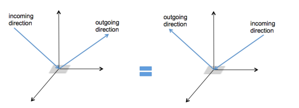
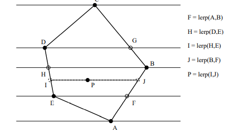
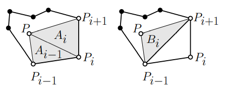
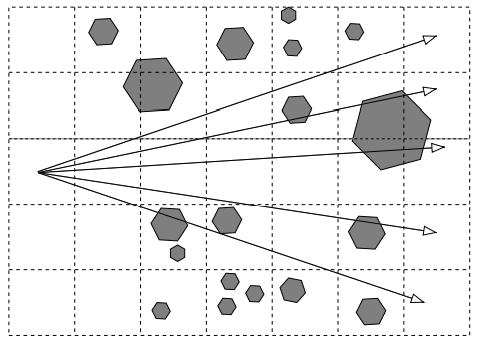

Website: https://student.cs.uwaterloo.ca/~cs488/Winter2022/  
http://pedrinho.cs.uwaterloo.ca/~gvgbaran/CS488/Winter22/CS488-W22.html CS488

<details>
<summary>..</summary>
graphics22
</details>

Instructor: Gladimir Baranoski

Time: TTh 8:30AM - 9:50AM

.1A * 5 + .04Q * 5 + .3FE

- [Week 2. Jan 11](#week-2-jan-11)
- [Week 3. Jan 18](#week-3-jan-18)
- [Week 4. Jan 25](#week-4-jan-25)
- [Week 5. Feb 1](#week-5-feb-1)
- [Week 6. Feb 8](#week-6-feb-8)
- [Week 7. Feb 15](#week-7-feb-15)
- [Week 9. Mar 1](#week-9-mar-1)
- [Week 10. Mar 8](#week-10-mar-8)
- [Week 11. Mar 15](#week-11-mar-15)
- [Week 12. Mar 22](#week-12-mar-22)
- [Week 13. Mar 29](#week-13-mar-29)
- [Week 14. Apr 5](#week-14-apr-5)

# Week 2. Jan 11

_forward rendering_: rendering primitives are transformed from model to device (hardware and OpenGL)

_backward rendering_: start with a point in image and work out what model primitives project to it (raytracing)

the graphics pipeline for _forward projection_:
* _rendering_ is the conversion of a (3D) scene into a (2D) image
* scenes consist of _models_ in 3D space
* models consist of _primitives_ supported by rendering system
* the scene -> image conversion is broken into steps called _graphics pipeline_
```
            modelling                        viewing
          transformations                 transformation
+------+      +---+         +----------+             +----------+                                            +----------+
|model +----->+M1 |         |          |             |          |                                            |          |
+------+      +---+         |   3D     |     +---+   |   3D     |       +-----------------------------+      |  2D/3D   |     +---------+      +-------+
                    +------>+  world   +---->+ V +-->+   view   +------>+  (P -> clip -> normalize)   +----->+  device  +---->+ raster- +----->+  2D   |
+------+      +---+         |  scene   |     +---+   |   scene  |       |          projection         |      |  scene   |     | ization |      | image |
|model +----->+M2 |         |          |             |          |       +-----------------------------+      |          |     +---------+      +-------+
+------+      +---+         +----------+             +----------+                                            +----------+                       DCS/SCS
 MCS                          WCS                      VCS                                                     NDCS                             device/screen
 modelling                    world                    viewer                                                  normalized                       coord.
 coordinate                   coord.                   coord.                                                  device                           system
 system                       system                   system                                                  coord.
                                                                                                               system
```

primitives:
* typical primitives directly supported by hardware: points (pixels), line segments, polygons (convex polygons or triangles)
* others: spline curves, spline surfaces, implicit surfaces, etc.

algorithms:
* _transformation_: convert representations of models/primitives from one coordinate system
to another
* _clipping/hidden surface removal_: remove primitives and parts of primitives that are
not visible on the display
* _rasterization_: convert a projected screen-space primitive to a set of pixels
* _picking_: select a 3D object by clicking an input device over a pixel location
* _shading and illumination_: simulate the interaction of light with a scene
* _animation_: simulate movement by rendering a sequence of frames

available apis:
* xlib, GDI: 2d rasterization
* PostScript, PDF, SVG: 2D transformations and 2d rasterization
* OpenGL, D3D: 3d pipeline
* APIs provide access to rendering hardware via conceptual model
* APIs hide which graphics algorithms are or are not implemented in hardware by simulating missing pieces in software

## devices
_calligraphic display devices_: draw polygon and line segments directly
* eg plotters, laser light projection systems, direct beam control CRTs

_raster display devices_: draw pixels
* requires rasterization algorithms to quickly determine sampled representations of geometric primitives

_raster cathode ray tube (CRT)_:
* benefits:
  * capable of high resolution
  * good color fidelity
  * high contrast (100/1)
  * high update rate
* electron beam scanned in regular pattern of horizontal _scanlines_
* _raster images_ stored in _frame buffer_
* RGB values stored in _color buffers_ read by raster
  * intensity of electron beam modified by the pixel value
* _color CRTs_ have 3 different colors of phosphor and 3 independent electron guns
* _shadow masks_ allow each gun to irradiate only one color of phosphor

_liquid crystal display (LCD)_:
* traits:
  * flat panels
  * flicker free
  * decreased viewing angle
* random access to cells like memory
* cells contain liquid crystal molecules that align when charged
* unaligned molecules twist light
* polarizing filters allow only light through unaligned molecules
* subpixel color filter masks used for RGB

## maths
points and vectors are different objects:
* points represent a position specified with coordinate values in the same reference frame so that the distance from origin depends on choice of reference frame
* vector is difference of two points
* have different operations
* behave differently under transformation

__defn.__ a _vector space_ $V$ is a set of vectors that
1. has _addition_: $\mathbf{u},\mathbf{v}\in V\implies \mathbf{u}+\mathbf{v}\in V$
2. has _scalar multiplication_: $\mathbf{u}\in V\implies\alpha\mathbf{u}\in V$ where $\alpha$ is member of some field
3. _axioms of vector spaces_:
   1. _addition commutes_: $\mathbf{u}+\mathbf{v}=\mathbf{v}+\mathbf{u}$
   2. _addition assoccates_: $(\mathbf{u}+\mathbf{v})+\mathbf{w}=\mathbf{u}+(\mathbf{v}+\mathbf{w})$
   3. _scalar multiplication distributes_: $\alpha(\mathbf{u}+\mathbf{v})=\alpha\mathbf{u}+\alpha\mathbf{v}$
   4. _unique zero element_: $\mathbf{0}+\mathbf{u}=\mathbf{u}$
   5. _field unit element_: $1\mathbf{u}=\mathbf{u}$

__defn.__ set $B=\{\mathbf{v}_1,...,\mathbf{v}_n\}$ _spans_ $V$ iff any $\mathbf{v}\in V$ can be written as a _linear combination_ $\mathbf{v}=\sum_{i\in[n]}\alpha_{i}\mathbf{v}_i$.

__defn.__ a _basis_ is any minimal spanning set. all bases are the same size.

__defn.__ _dimension_ is the number of vector in basis (we work in 2d and 3d spaces).

__defn.__ an _affine space_ is a set of vectors $V$ and a set of points $\mathcal{P}$ where
1. vectors $V$ form a vector space
2. points can be combined with vectors to make new points, ie $P+\mathbf{v}\Rightarrow Q\,\,\forall P,Q\in \mathcal{P},\mathbf{v}\in V$

__remark.__ affine spaces do not have origin or angles

__defn.__ a _frame_ $F=(\mathbf{v_1},...,\mathbf{v}_n,O)$ is a vector basis plus an _origin_ point $O$.

the dimension of an affine space is same as that of $V$.

__defn.__ an _inner product space_ for vector space $V$ is a binary operator $V^2\rightarrow\mathbb{R}$ with
1. $\mathbf{u}\cdot\mathbf{v}=\mathbf{v}\cdot\mathbf{u}$
2. $(\mathbf{u}+\mathbf{v})\cdot\mathbf{w}=\mathbf{u}\cdot\mathbf{w}+\mathbf{v}\cdot\mathbf{w}$
3. $\mathbf{u}\cdot\mathbf{u}\geq0$
4. $(\alpha\mathbf{u})\cdot\mathbf{v}=\alpha(\mathbf{u}\cdot\mathbf{v})$

__defn.__ a _metric space_ is any space with a _distance metric_ $d(P,Q)$ defined on its elements.
* _axioms of metric_ $d(P,Q)$
  1. $d(P,Q)\geq0$
  2. $d(P,Q)=0\iff P=Q$
  3. $d(P,Q)=d(Q,P)$
  4. $d(P,Q)\leq d(P,R)+d(R,Q)$
* distance is intrinsic to space, not a property of the frame

__defn.__ an _euclidean space_ is where distance metric is based on a dot product:
$$
\begin{aligned}
\mathbf{u}\cdot\mathbf{v}&=u_xv_x+u_yv_y+u_zv_z\\
&=||\mathbf{u}|||\mathbf{v}||\cos(\angle\mathbf{u}\mathbf{v})
\end{aligned}
$$

__defn.__ the _norm_ of vector is $|\mathbf{u}|=\sqrt{\mathbf{u}\cdot\mathbf{u}}$.

__defn.__ the _scalar projection_ of vector $\mathbf{u}$ on $\mathbf{v}$ is $\mathbf{u}\rightarrow\mathbf{v} =||\mathbf{u}||\cos(\angle\mathbf{u}\mathbf{v})=\frac{\mathbf{u}\cdot\mathbf{v}}{||\mathbf{v}||}$.

__defn.__ _(perpendicularity)_ $\mathbf{u}\cdot\mathbf{v}=0\implies \mathbf{u}\perp\mathbf{v}$.
* does not exist in affine spaces

__defn.__ _(cross product)_
$$
\begin{aligned}
\mathbf{u}\times\mathbf{v}&=(u_yv_z-u_zv_y,u_zv_x-u_xv_z,u_xv_y-u_yv_x)\\
||\mathbf{u}\times\mathbf{v}||&=||\mathbf{u}||||\mathbf{v}||\sin(\angle\mathbf{u}\mathbf{v})
\end{aligned}
$$

__defn.__ a _cartesian space_ is an euclidean space with an _orthonormal frame_ $(\mathbf{\mathbf{i},\mathbf{j},\mathbf{k}},O)$.
1. _orthogonal_: $\mathbf{i}\cdot\mathbf{j}=\mathbf{j}\cdot\mathbf{k}=\mathbf{k}\cdot\mathbf{i}=0$
2. _normal_: $|\mathbf{i}|=|\mathbf{j}|=|\mathbf{k}|=1$

__notation.__ the _standard frame_ is $F_S=(\mathbf{\mathbf{i},\mathbf{j},\mathbf{k}},O)$.

we use an extra coordinate to distinguish vectors and points:
* 0 for vectors: $\mathbf{v}=(v_x,v_y,v_z,0)$ means $\mathbf{v}=v_x\mathbf{i}+v_y\mathbf{j}+v_z\mathbf{k}$
* 1 for points: $P=(v_x,v_y,v_z,1)$ means $P=v_x\mathbf{i}+v_y\mathbf{j}+v_z\mathbf{k}+O$
* coordinates have no meaning without an associated frame
  * standard frame is assumed if not stated
* we sometimes omit the last coordinate for brevity

# Week 3. Jan 18

### basic geometric transformations
assume the standard frame.

_2d translation_:
$$
\overbrace{\left[\begin{array}{ccc}
1 & 0 & \Delta x \\
0 & 1 & \Delta y \\
0 & 0 & 1
\end{array}\right]}^{T(\Delta x, \Delta y)}\left[\begin{array}{l}
x \\
y \\
1
\end{array}\right]=\left[\begin{array}{c}
x+\Delta x \\
y+\Delta y \\
1
\end{array}\right]
$$
* also specified by a vector $[\Delta x,\Delta y,0]^\intercal$
* a point $[x,y,1]^\intercal$ will map to $[x+\Delta x,y+\Delta y,1]^\intercal$
* a vector will remain unchanged after translation
* translation is _not_ linear transformation
  * translation is linear on sum of vectors...
* a class of _rigid body transformations_ (preserves shape and size)
* matrix form is more expensive, but preferred because it treats points and vectors uniformly, consistent with other transformations, and easier for composing

_2d scale about origin_:
$$
\overbrace{\left[\begin{array}{ccc}
s_{x} & 0 & 0 \\
0 & s_{y} & 0 \\
0 & 0 & 1
\end{array}\right]}^{S\left(s_{x}, s_{y}\right)}\left[\begin{array}{c}
x \\
y \\
0 \text { or } 1
\end{array}\right]=\left[\begin{array}{c}
s_{x} x \\
s_{y} y \\
0 \text { or } 1
\end{array}\right]
$$
* specified by factors $s_x,s_y\in\mathbb{R}$
* a point $[x,y,1]^\intercal$ maps to $[s_xx,s_yy,1]^\intercal$
* a vector $[x,y,0]^\intercal$ maps to $[s_xx,s_yy,0]^\intercal$
* is linear

_2d rotation_: counterclockwise about origin by angle $\theta$
$$
\overbrace{\left[\begin{array}{ccc}
\cos \theta & -\sin \theta & 0 \\
\sin \theta & \cos \theta & 0 \\
0 & 0 & 1
\end{array}\right]}^{R(\theta)}\left[\begin{array}{c}
x \\
y \\
0 \text { or } 1
\end{array}\right]=\left[\begin{array}{c}
x^{\prime} \\
y^{\prime} \\
0 \text { or } 1
\end{array}\right]
$$
* applies to points or vectors
* is linear

_2d shear_: intermixes coordinates according to $\alpha,\beta\in\mathbb{R}$
$$
\overbrace{\left[\begin{array}{lll}
1 & \beta & 0 \\
\alpha & 1 & 0 \\
0 & 0 & 1
\end{array}\right]}^{S h(\alpha, \beta)}\left[\begin{array}{c}
x \\
y \\
0 \text { or } 1
\end{array}\right]=\left[\begin{array}{c}
x+\beta y \\
\alpha x+y \\
0 \text { or } 1
\end{array}\right]
$$
* applies to points or vectors
* is linear

__eg.__ horizontal (x-axis) shear (45 degrees)


* x-axis: $\alpha=0,\beta=1$
* y-axis: $\alpha=1,\beta=0$

_reflection_: through a line
* applies to points or vectors
* is linear

__eg.__ reflect through x-axis:
$$
\left[\begin{array}{ccc}
1 & 0 & 0 \\
0 & -1 & 0 \\
0 & 0 & 1
\end{array}\right]\left[\begin{array}{c}
x \\
y \\
0 \text { or } 1
\end{array}\right]=\left[\begin{array}{c}
x \\
-y \\
0 \text { or } 1
\end{array}\right]
$$
reflect through y-axis:
$$
\left[\begin{array}{ccc}
-1 & 0 & 0 \\
0 & 1 & 0 \\
0 & 0 & 1
\end{array}\right]\left[\begin{array}{c}
x \\
y \\
0 \text { or } 1
\end{array}\right]=\left[\begin{array}{c}
-x \\
y \\
0 \text { or } 1
\end{array}\right]
$$

__remark.__ an arbitrary sequence of rotation, translation, scale and transformations results in an _affine transformation_ which preserves the parallelism of lines, but not lengths and angles.

__eg.__ how to rotate around an arbitrary point $P=[x_0,y_0,1]^\intercal$?
1. translate $P$ to origin: $T(-x_0,-y_0)$
2. rotate around origin: $R(\theta)$
3. translate origin back to $P$: $T(x_0,y_0)$

the desired transformation is $T(x_0,y_0)\circ R(\theta)\circ T(-x_0,-y_0)$ = matrix multiplication

__remark.__ read from right to left.

### basic 3d geometric transformations
assume coordinate system is right handled.

_translation_:
$$
T(\Delta x,\Delta y,\Delta z)=
\left[\begin{array}{cccc}
    1&0&0&\Delta x\\
    0&1&0&\Delta y\\
    0&0&1&\Delta z\\
    0&0&0&1
\end{array}\right]
$$

_scale_: about origin
$$
S\left(s_{x},s_{y},s_{z}\right)=
\left[\begin{array}{cccc}
    s_{x}&0&0&0\\
    0&s_{y}&0&0\\
    0&0&s_{z}&0\\
    0&0&0&1
\end{array}\right]
$$

_rotation_: about an axis
$$
\begin{aligned}
&R_{z}(\theta)=\left[\begin{array}{cccc}
\cos \theta & -\sin \theta & 0 & 0 \\
\sin \theta & \cos \theta & 0 & 0 \\
0 & 0 & 1 & 0 \\
0 & 0 & 0 & 1
\end{array}\right] \\
&R_{x}(\theta)=\left[\begin{array}{cccc}
1 & 0 & 0 & 0 \\
0 & \cos \theta & -\sin \theta & 0 \\
0 & \sin \theta & \cos \theta & 0 \\
0 & 0 & 0 & 1
\end{array}\right] \\
&R_{y}(\theta)=\left[\begin{array}{cccc}
\cos \theta & 0 & \sin \theta & 0 \\
0 & 1 & 0 & 0 \\
-\sin \theta & 0 & \cos \theta & 0 \\
0 & 0 & 0 & 1
\end{array}\right]
\end{aligned}
$$

_shear with fixed coordinate system_:
$$
Sh=\left[\begin{array}{cccc}
1 & 0 & 0 & 0 \\
\alpha_{1} & 1 & 0 & 0 \\
\alpha_{2} & 0 & 1 & 0 \\
0 & 0 & 0 & 1
\end{array}\right]\left[\begin{array}{cccc}
1 & \beta_{1} & 0 & 0 \\
0 & 1 & 0 & 0 \\
0 & \beta_{2} & 1 & 0 \\
0 & 0 & 0 & 1
\end{array}\right]\left[\begin{array}{llll}
1 & 0 & \gamma_{1} & 0 \\
0 & 1 & \gamma_{2} & 0 \\
0 & 0 & 1 & 0 \\
0 & 0 & 0 & 1
\end{array}\right]
$$
* shear with fixed coordinate plane: one of $\alpha_i$'s, $\beta_i$'s, $\gamma_i$'s = 0

_shear in 'w-subspace'_ in direction $\mathbf{n}$ by angle $\theta$:
$$
Sh=\left[\begin{array}{cc}
I_{3\times3}&\tan\theta\mathbf{n}\\
0&1
\end{array}\right]
$$
* translation in 3D is shear in 4D


__eg.__ how to rotate around an arbitrary axis by $\theta$?
1. translate that axis so it passes the coordinate origin: $T$
2. rotate the translated axis such that it coincides with one of x, y, z axes
   * if onto z axis, apply two rotations using $R_x(\alpha),R_y(\beta)$ where angles are determined by geometry
3. perform specified rotation on selected axis by $\theta$: $R_z(\theta)$
4. apply inverse rotations
5. apply inverse translation

the desired transformation is $R(\theta)=T^{-1}R_x^{-1}(\alpha)R_y^{-1}(\beta)\circ R_z(\theta)\circ R_y(\beta)R_x(\alpha)T$.

__eg.__ assume we rotate along vector $\mathbf{v}=(x,y,z)$ (ie line that crosses origin and $\mathbf{v}$) by $\theta$, and $|\mathbf{v}|=1$. determine the rotation matrix.
1. pick closest axis to $\mathbf{v}$ by $\max_i\mathbf{e}_i\cdot\mathbf{v}=\max(x,y,z)$.
   * assume we choose x-axis
2. project $\mathbf{v}$ onto $\mathbf{a}:=(x,0,z)$ in xz-plane
3. compute $\cos\alpha,\sin\alpha$ where $\alpha$ is angle of $\mathbf{a}$ with x-axis
   * $\cos\alpha=\frac{x}{\sqrt{x^2+z^2}}$
   * $\sin\alpha=\frac{z}{\sqrt{x^2+z^2}}$
4. use them to create $R_y(-\alpha)$
5. rotate $\mathbf{v}$ onto xy-plane by $R_y(-\alpha)$ to create $\mathbf{b}:=R_y(-\alpha)\mathbf{v}=(\sqrt{x^2+z^2},y,0)$
6. compute $\cos\beta,\sin\beta$ where $\beta$ is angle of $\mathbf{b}$ with x-axis
    * $\cos\beta=\sqrt{x^2+z^2}$
    * $\sin\beta=y$
7. use them to create $R_z(-\beta)$
8. rotate $\mathbf{b}$ onto x-axis using $R_z(-\beta)$
9. rotate object about x-axis by $\theta$ using $R_x(\theta)$
10. reverse x-axis rotation: $R_z(\beta)$
11. reverse y-axis rotation: $R_y(\alpha)$

the overall transformation is $R(\theta,\mathbf{v})=R_y(\alpha)R_z(\beta)R_x(\theta)R_z(-\beta)R_y(-\alpha)$.


### changing basis
given frames $F_1=(\mathbf{w}_1,\mathbf{w}_2,O_W)$ and $F_2=(\mathbf{v}_1,\mathbf{v}_2,O_V)$. we have a 2d point $P\equiv\mathbf{p}=[x,y,1]^\intercal$ relative to $F_1$, how to change it to $F_2$?

the matrix that maps from $F_1$ to $F_2$ is $M$. if $F_2$ is orthogonal we have
$$
\begin{aligned}
    M_{i,j}&=\frac{\mathbf{w}_j\cdot\mathbf{v}_i}{\mathbf{v}_i^2}\\
    M_{i,3}&=\frac{(O_W-O_V)\cdot\mathbf{v}_i}{\mathbf{v}_i^2}\\
    M_{3,}&=[0,0,1]
\end{aligned}
$$
otherwise, we need to compute, the top-left portion $M_{1:2,1:2}=[[\mathbf{w}_1]_{F_2},[\mathbf{w}_2]_{F_2}]$ ie solve $F_1=F_2M_{1:2,1:2}$, so that $M\mathbf{p}$ is the coordinates desired. (does not work for non-ortho?)

the last column is used for offset!

note:
* frame elements are usually specified in standard frame for space
* frames are usually orthonormal
* a point mapped by change of basis does not change

__eg.__
$$
\begin{aligned}
F_{W} =\left(\mathbf{w}_{1}, \mathbf{w}_{2}, \mathbf{w}_{3}, \mathcal{O}_{W}\right)
&=\left(\mathbf{i},\mathbf{j},\mathbf{k},\left[\begin{array}{l}
0 \\
0 \\
0 \\
1
\end{array}\right]\right) \\
F_{V} =\left(\mathbf{v}_{1}, \mathbf{v}_{2}, \mathbf{v}_{3}, \mathcal{O}_{V}\right)
&=\left(\left[\begin{array}{c}
\sqrt{2} / 2 \\
\sqrt{2} / 2 \\
0 \\
0
\end{array}\right],\left[\begin{array}{l}
0 \\
0 \\
1 \\
0
\end{array}\right],\left[\begin{array}{c}
\sqrt{2} / 2 \\
-\sqrt{2} / 2 \\
0 \\
0
\end{array}\right],\left[\begin{array}{l}
1 \\
0 \\
3 \\
1
\end{array}\right]\right)
\end{aligned}
$$
the transformation matrix is
$$
M=\left[\begin{array}{cccc}
\sqrt{2} / 2 & \sqrt{2} / 2 & 0 & -\sqrt{2} / 2 \\
0 & 0 & 1 & -3 \\
\sqrt{2} / 2 & -\sqrt{2} / 2 & 0 & -\sqrt{2} / 2 \\
0 & 0 & 0 & 1
\end{array}\right]
$$

__eg.__ we can also use some transformations to align $F_2$ on $F_1$.


to map $\mathbf{p}$ from frame $F_1$ to $F_2$, a translation $T(-d_x,0)$ would suffice.

__remark.__ if we apply a transformation $T$ to another transformation (eg a reference frame), we use $T^{-1}$.

### viewing frames
typically our space $S$ is a cartesian space
* the standard frame is the _world frame_ which is _right-handed_
* the scene description is specified in terms of world frame


_right handed coordinate system_:
* x to the left ($\mathbf{y}\times\mathbf{z}$)
* y is up _(up vector)_
  * (where to rotate the camera for portrait or landscape photos)
* z straight ahead _(view direction / lookAt)_

_left handed coordinate system_:
* x to the right
* y is up (up vector)
* z straight ahead (view direction)

we can change basis by
1. specify frame relative to reviewer
2. change coordinates to this frame

```cpp
V = inverse(mat4{
    {x, 0}, {y, 0}, {z, 0}, {origin, 1},
})
```

once we are in the viewing coordinates,
1. usually place a clipping box around the scene
2. box is oriented relative to viewing frame

_orthographic projection_: made by removing the z-coordinate. relative to $F_V=(\mathbf{i},\mathbf{j},\mathbf{k},O)$, we do
$$
\mathrm{Ortho}(Q)=\mathrm{Ortho}(q_1\mathbf{i}+q_2\mathbf{j}+q_3\mathbf{k}+O)=q_1\mathbf{u}+q_2\mathbf{v}+O'
$$
or
$$
\begin{aligned}
    \left[\begin{array}{c}
    q_{1} \\
    q_{2} \\
    1
    \end{array}\right]=\left[\begin{array}{llll}
    1 & 0 & 0 & 0 \\
    0 & 1 & 0 & 0 \\
    0 & 0 & 0 & 1
    \end{array}\right]\left[\begin{array}{c}
    q_{1} \\
    q_{2} \\
    q_{3} \\
    1
    \end{array}\right]
\end{aligned}
$$
* squashes 3d to 2d, where we can do window-to-viewport mapping
* projection of the clipping box is used as the window

# Week 4. Jan 25
### transforming normals
truth: we can only apply affine transformations to points
* vectors can be transformed correctly iff they are defined by difference of points
* normal vectors __are not__ defined by difference of points (they are _covectors_, which are _dual_ to vectors)
* while tangent vectors __are__ defined by difference of points.

if just use the same transform matrix, the circle's normal is not transformed correctly with nonuniform scale/shear:


to transform normal $\mathbf{n}$ by transformation $M$, we use
$$
\mathbf{n}'=(M_{1:3,1:3}^{-1})^\intercal\mathbf{n}
$$
where $M_{1:3,1:3}$ is the upper 3x3 submatrix (linear part).

_proof._ suppose we have a point $P\equiv\mathbf{p}$ and a tangent $\mathbf{T}\equiv\mathbf{t}$ at $P$. after transformation there are
$$
\mathbf{p}'=M\mathbf{p}\\
\mathbf{t}'=M\mathbf{t}=M_{1:3,1:3}\mathbf{t}
$$
note normals must be perpendicular to tangents, so we have
$$
0=\mathbf{n}^\intercal\mathbf{t}=\mathbf{n}^\intercal M_{1:3,1:3}^{-1}M_{1:3,1:3}\mathbf{t}=(M_{1:3,1:3}^{-1}\mathbf{n}^\intercal)^{\intercal}(M_{1:3,1:3}\mathbf{t})=\mathbf{n}'^\intercal\mathbf{t}'\equiv\mathbf{N}'\cdot\mathbf{T}'
$$
$\square$

notes:
* natural representation of $\mathbf{T}$ is as a row matrix
* only worry if we have non-uniform scale/shear
* if $M_T$ is orthonormal, then $(M^{-1}_T)^\intercal=M_T$
* transform implicit form of lines and planes similarly
* the full expression of the matrix is
  $$\frac{1}{|M_T|}
  \left[\begin{array}{lll}
    m_{22} m_{33}-m_{23} m_{32} & m_{23} m_{31}-m_{21} m_{33} & m_{21} m_{32}-m_{22} m_{31} \\
    m_{13} m_{32}-m_{12} m_{33} & m_{11} m_{33}-m_{13} m_{31} & m_{12} m_{31}-m_{11} m_{32} \\
    m_{12} m_{23}-m_{13} m_{22} & m_{13} m_{21}-m_{11} m_{23} & m_{11} m_{22}-m_{12} m_{21}
  \end{array}\right]
  $$

__eg.__ a plane is defined by normal times difference of two points: $\mathbf{n}^\intercal(p-p_0)=0$. points $p$ on the plane are transformed using $M$, find the new normal $\mathbf{n}'$.

suppose that matrix is $Q$, then we have
$$
\begin{aligned}
    (Q\mathbf{n})^\intercal M(p-p_0)&=0\\
    \mathbf{n}^\intercal Q^\intercal M(p-p_0)&=0
\end{aligned}
$$
to make this hold, we must have $Q^\intercal M=$ a multiple of identity matrix. hence we get $Q=(M^{-1})^\intercal$, and $\mathbf{n}'=(M^{-1})^\intercal\mathbf{n}$.

## windows and viewports
we start with 3D scene, but eventually project to 2D scene (which is infinite). we map a finite rectangular region of 2D device scene to device.
* _window_: rectangular region of interest in scene
* _viewport_: rectangular region on device
* usually both are aligned with coordinate axes

given a window point $(x_w,y_w)$, we want to map to viewport point $(x_v,y_v)$, given $L_w,H_w$ are length & height of window, and $L_v,H_v$ are length & height of viewport. use:
$$
x_v=\frac{L_v}{L_w}(x_w-x_{wl})+x_{vl}
$$

similarly for $y_v$, where $x_{wl},x_{vl}$ are window & viewport corners.

if $\frac{H_w}{L_w}\neq\frac{H_v}{L_v}$, the image is distorted. the quantities are called _aspect ratios_ of the window and viewport.

(usually these coords are in $[-1, 1]^2$ NDC)

### normalized device coordinates
where to specify viewport? could specify it in device coordinates...

if we map directly from WCS to a DCS, then changing our device requires writing the mapping. instead, we use _normalized device coordinates (NDC)_ as intermediate system that gets mapped to device layer.
* windows in WCS is mapped to viewports specified within a unit square in NDC space
* then map viewports from NDC to screen

## clipping
we want to remove points outside a region of interest (discard parts of primitives outside window).

_point clipping_: remove points outside window
  * a point is either entirely in region or not

_line clipping_: remove portion of line segment outside window
  * line segments can straddle the region boundary
  * Liang-Barsky algorithm efficiently clips line segments to a halfspace
  * halfspaces can be combined to bound a convex region
  * can use some of its ideas to clip points

_parametric representation of line_: $L(t)=(1-t)A+tB=A+t(B-A)$
* A and B are distinct points
* for $t\in\mathbb{R}$, it defines an infinite line
* for $t\in[0,1]$, it defines a line segment from A to B
* good for generating points on a line
* not so good for testing if given point is on the line

_implicit representation of line_: $\ell(Q)=(Q-P)\cdot\mathbf{n}$
* $P$ is a point on the line
* $\mathbf{n}$ is vector perpendicular to line
* $\ell(Q)$ gives signed distance from any point $Q$ to line
  * sign tells if $Q$ is on left or right relative to direction of $\mathbf{n}$
* $\ell(Q)=0$ if $Q$ is on the line
* use same form for implicit representation of a halfspace

_clipping point to halfspace_:
* represent window edge as implicit line/halfspace
* use implicit form of edge to classify a point $Q$
* convention for the normal: points to the __inside__
* check sign of $\ell(Q)$:
  * $\ell(Q)>0$: inside
  * otherwise clip $Q$
    * it  is on edge or outside (may want to keep things on the boundary)

_clipping line segment to halfspace_:
* if line segment is entirely inside, keep it
* if line segment is entirely outside, discard it
* otherwise generate new line segment

given window edge as implicit form $\ell(Q)=(Q-P)\cdot\mathbf{n}$, and the line segment as parametric form $L(t)=A+t(B-A)$, we have two trivial cases:
* $\ell(A)<0\land\ell(B)<0$: outside
* $\ell(A)>0\land\ell(B)>0$: inside
* we need to divide are boundary points inside or outside

otherwise we need to clip line segment:


we want $t$ such that $\ell(L(t))=0$, ie $(L(t)-P)\cdot\mathbf{n}=(A+t(B-A)-P)\cdot n=0$, and so
$$
\begin{aligned}
    t&=\frac{(A-P)\cdot\mathbf{n}}{(A-B)\cdot\mathbf{n}}\\
    &=\frac{(A-P)\cdot\mathbf{n}}{(A-P)\cdot\mathbf{n}-(B-P)\cdot\mathbf{n}}\\
\end{aligned}
$$
not we can reuse the computed values from trivial tests. finally, just clip four halfspaces in turn.

algo _(liang-barsky)_:
```cpp
clip_line_segment(A, B):
    for each edge P, n:
        wecA = (A - P) ⋅ n
        wecB = (B - P) ⋅ n
        if wecA < 0 and wecB < 0:
            return false  // outside
        if wecA >= 0 and wecB >= 0:
            return A, B   // inside
        t = wecA / (wecA - wecB)
        if wecA < 0:      // in diagram
            A = A + t * (B - A)
        else:
            B = A + t * (B - A)
    return A, B
```

note:
* can clip any convex window
* optimizations can be made for horizontal and vertical window edges

### for 3D
* half-space now lies on one side of a plane
* plane also given by normal and point
* implicit formula for plane in 3D is same as that for line in 2D
* parametric formula for line to be clipped is unchanged

## projections
### projections
_perspective projection_:
* identify all points with a line through the eyepoint
* slice lines with viewing plane, take intersections point as projection
* not affine transformation, but projective transformation
* opposed to _parallel orthographic_ where direction of projection is parallel to projection plane


_projective transformation_:
* angles are not preserved as in affine transformation
* distances are not preserved as in affine transformation
* ratios of distances are not preserved
* affine combinations are not preserved
* straight lines are mapped to straight lines
* cross ratios are preserved:
  $$
  \frac{a_1:a_2}{b_1:b_2}=\frac{a'_1:a'_2}{b'_1:b'_2}
  $$
  

|affine transformation|projective transformation|
|:--|:--|
image of 2 pts on a line determine image of line|image of 3 pts on a line determine image of line|
image of 3 pts on a plane determine image of plane|image of 4 pts on a plane determine image of plane|
in dimension n space, image of n+1 points/vectors defines affine map|in dimension n space, image of n+2 points/vectors defines map
vectors map to vectors<br>$\mathbf{v}=Q-R=R-S\implies A(Q)-A(R)=A(R)-A(S)$|mapping of vectors is ill-formed<br>$\mathbf{v}=Q-R=R-S\not\implies P(Q)-P(R)=P(R)-P(S)$
can represent with matrix multiply|can represent with matrix multiply and normalization|

```
Q-------R-------S

A(Q)           P(Q)
 \               \
  \               P(R)
   A(R)            \
    \               \
     \               \
      A(S)            P(S)
```

### perspective map

_perspective map_: given point $S$, find its projection $P$


* by similar triangles, $P=(\frac{xd}{z},d)$
* in 3D, $(x,y,z)\mapsto(\frac{xd}{z},\frac{yd}{z},d)$
* making _homogenous coordinates_: having identified all points on a line through origin with a point in the projection plane: $(x,y,z)\equiv(kx,ky,kz),k\neq0$
* this map loses all $z$ information, so inadequate - which one is in front?
* matrix form with $d=1$:
  $$
  \left[\begin{array}{llll}
    1 & 0 & 0 & 0 \\
    0 & 1 & 0 & 0 \\
    0 & 0 & 1 & 0 \\
    0 & 0 & 1 & 0
    \end{array}\right]\left[\begin{array}{l}
    x \\
    y \\
    z \\
    1
    \end{array}\right]=\left[\begin{array}{l}
    x \\
    y \\
    z \\
    z
    \end{array}\right] \equiv\left[\begin{array}{c}
    x / z \\
    y / z \\
    1 \\
    1
  \end{array}\right]
  $$
    * it loses depth information
* the following matrix retains depth information although reversed
  $$
  \left[\begin{array}{llll}
    1 & 0 & 0 & 0 \\
    0 & 1 & 0 & 0 \\
    0 & 0 & 1 & 1 \\
    0 & 0 & 1 & 0
    \end{array}\right]\left[\begin{array}{l}
    x \\
    y \\
    z \\
    1
    \end{array}\right]=\left[\begin{array}{c}
    x \\
    y \\
    z+1 \\
    z
    \end{array}\right]
  $$
    * variations on entries allow us to do near/far clipping, NDC, etc.

_psedudo-opengl version_ of the perspective map:


the 'box' in world space is known as _'truncated viewing pyramid'_ or _'frustum'_.

for simplicity, we project to the $z=1$ plane. we want to map $x$ to $\frac{x}{z}$ and $y$ to $\frac{y}{z}$, we use a matrix multiplication following by a _normalization_

$$
\begin{aligned}
\left[\begin{array}{llll}
1 & 0 & 0 & 0 \\
0 & 1 & 0 & 0 \\
0 & 0 & a & c \\
0 & 0 & b & d
\end{array}\right]\left[\begin{array}{l}
x \\
y \\
z \\
1
\end{array}\right] &=\left[\begin{array}{c}
x \\
y \\
a z+c \\
b z+d
\end{array}\right]
\equiv\left[\begin{array}{c}
\frac{x}{b z+d} \\
\frac{y}{b z+d} \\
\frac{a z+c}{b z+d} \\
1
\end{array}\right]
\end{aligned}
$$
we want to solve for $a,b,c,d$ such that $z\in[n,f]$ maps to $z'\in[-1,1]$, and we get

$$
\begin{aligned}
\left[\begin{array}{llll}
1 & 0 & 0 & 0 \\
0 & 1 & 0 & 0 \\
0 & 0 & \frac{f+n}{f-n} & \frac{-2fn}{f-n} \\
0 & 0 & 1 & 0
\end{array}\right]\left[\begin{array}{l}
x \\
y \\
z \\
1
\end{array}\right] &=\left[\begin{array}{c}
x \\
y \\
\frac{z(f+n)-2fn}{f-n} \\
z
\end{array}\right]
\equiv\left[\begin{array}{c}
\frac{x}{z} \\
\frac{y}{z} \\
\frac{z(f+n)-2fn}{z(f-n)} \\
1
\end{array}\right]
\end{aligned}
$$
* could use the formula instead of performing matrix multiplication followed by divide...
* if we multiply this matrix with geometric transforms, the only addition work is divide

the OpenGL perspective matrix uses $a=-\frac{f+n}{f-n},b=-1$
* openGL looks down $z=-1$ rather than $z=1$
* so when we specify $n$ and $f$, they are given as positive distance down $z=-1$

the upper left entries are different:
* openGL uses one matrix to both project and map to NDC

openGL maps $y$ to $[-1,1]$:


* map distance $d$ to 1
* $y\mapsto\frac{y}{z}$ is current projection
* $y\mapsto\frac{y}{zd}$ gives the scaling

(we do not want to map both x and y to [-1,1] because we may not have square windows)

but we have placed our projection plane at $z=1$, so this is really $y\mapsto\frac{yc}{zd}$ where $c=1$, and $\frac{c}{d}=\cot\frac{\theta}{2}$, so $y\mapsto\frac{y}{z}\cot\frac{\theta}{2}$.

finally, because x-y aspect ratio may not be 1, we will scale $x$ to give desired ratio: $x\mapsto\frac{x}{z}\mapsto\frac{x}{z}\cot\frac{\theta}{2}\mapsto\frac{x}{z}\frac{\cot{\theta}/{2}}{\text{aspect}}$.

the final matrix is:
$$
\left[\begin{array}{cccc}
\frac{\cot (\theta / 2)}{\text { aspect }} & 0 & 0 & 0 \\
0 & \cot \frac{\theta}{2} & 0 & 0 \\
0 & 0 & \pm \frac{f+n}{f-n} & \frac{-2 f n}{f-n} \\
0 & 0 & \pm 1 & 0
\end{array}\right]
$$
where $\plusmn$ is 1 if we look down the z axis, -1 if look down the -z axis.

note:
* openGL uses slightly more general form that allows skewed viewing pyramids.
* projection matrix can be expressed as shear of rotation in 4D

__eg.__ why do we map Z?
* 3D -> 2D projections map all z to same value, but we need z to determine occlusion, so it does not work
* further, we want 3D lines to map to 3D lines (useful in hidden surface removal)
* $(x,y,z,1)\mapsto(\frac{xn}{z},\frac{yn}{z},n,1)$ can map to lines, but loses depth


$(x,y,z,1)\mapsto(\frac{xn}{z},\frac{yn}{z},z,1)$ can retain depth  


* but it cannot map line to lines
* P,Q,R maps to P',Q',R' under projective transform
* however the map results in $P^p,Q^p,R^p$ which are not on a straight line
* we even have lines crossing ($Q^pS^p$) when it should not (QS)

the map
$$
(x,y,z,1)\mapsto\left(\frac{xn}{z},\frac{yn}{z},\frac{zf+zn-2fn}{z(f-n)},1\right)
$$
can map lines to lines and preserves depth info.


__eg.__ behaviors of Z.

we know
* $f$ maps t0 1
* $n$ maps to 0
* $\frac{2fn}{f+n}$ maps to 0 (solve $P(z)=\frac{zf+zn-2fn}{z(f-n)}=0$)
* $n<\frac{2fn}{f+n}<n$

what happens if $z\rightarrow0$ or $z\rightarrow\infty$?
* $\lim_{z\rightarrow 0^+}P(z)=\lim_{z\rightarrow 0^+}\frac{-2fn}{z(f-n)}=-\infty$
* $\lim_{z\rightarrow 0^-}P(z)=\lim_{z\rightarrow 0^-}\frac{-2fn}{z(f-n)}=\infty$
* $\lim_{z\rightarrow\infty}=\lim_{z\rightarrow\infty}\frac{z(f+n)}{z(f-n)}=\frac{f+n}{f-n}$


what happens if varying f and n?
* $\lim_{f\rightarrow n}P(z)=\lim_{f\rightarrow n}\frac{z(f+n)-2fn}{z(f-n)}=\frac{2zn-2n^2}{z\cdot0}\rightarrow\plusmn\infty$
  * object behind camera can be mapped in front of camera...
* $\lim_{f\rightarrow\infty}P(z)=\frac{zf-2fn}{zf}=\frac{z-2n}{z}$
* $\lim_{n\rightarrow0}P(z)=\frac{zf}{zf}=1$
* when $f>> n$, we have $\frac{2fn}{f+n}\rightarrow 2n\implies\frac{2fn}{f+n}-n\doteq n, f-\frac{2fn}{f+n}\doteq f-2n$, we still map a region of size 1.

# Week 5. Feb 1
### clipping in 3d
* we should clip to the near plane before we project, otherwise we may attempt to project a point with z=0, and x/z and y/z are undefined
* we could clip all 6 sides of the truncated viewing pyramid
  * but plane equation are simpler if we clip after projection, as sides are parallel to coordinate planes
* can also clip in homogeneous coordinates

_homogeneous point_: the point representation $(\overline{x},\overline{y},\overline{z},\overline{w})$ after applying a perspective transformation to a point.

$$
\begin{bmatrix}
    nr&0&0&0\\
    0&ns&0&0\\
    0&0&\frac{f+n}{f-n}&\frac{-2 f n}{f-n}\\
    0&0&1&0
\end{bmatrix}\begin{bmatrix}
    x\\y\\z\\1
\end{bmatrix}=\begin{bmatrix}
    \overline{x}\\\overline{y}\\\overline{z}\\\overline{w}
\end{bmatrix}\equiv\begin{bmatrix}
    \frac{\overline{x}}{\overline{w}}\\\frac{\overline{y}}{\overline{w}}\\\frac{\overline{z}}{\overline{w}}\\1
\end{bmatrix}=:\begin{bmatrix}
    X\\Y\\Z\\1
\end{bmatrix}
$$

region mapping:


clipping is not good after normalization:
* $-1\leq\frac{\overline{x},\overline{y},\overline{z}}{\overline{w}}\leq1$
* numerator and denominator can be positive or negative, creating ambiguity
* normalization expended on points that are subsequently clipped
* instead in homogeneous coordinates: $-|\overline{w}|\leq\overline{x},\overline{y},\overline{z}\leq|\overline{w}|$

in order to graphically represent a homogeneous point, we could draw four axes. however for simplicity, we can draw a pair $\overline{x},\overline{w}$, similar for other pairs.


assume we have NDC window of $[-1,1]^2$. to clip to $X=-1$:
* projected coordinates: clip to $X=-1$
* homogeneous coordinates: clip to $\frac{\overline{x}}{\overline{w}}=-1$
* homogeneous plane: $\overline{w}+\overline{x}=0$

the point is visible if $\overline{w}+\overline{x}>0$. assume we have a line $(1-t)p_1+tp_2$, then the boundary point is:
$$
((1-t)\overline{w}_1+t\overline{w}_2)+((1-t)\overline{x}_1+t\overline{x}_2)=0\\
t=\frac{\overline{w}_1+\overline{x}_1}{\overline{w}_1+\overline{x}_1-\overline{w}_2-\overline{x}_2}
$$

we repeat for remaining boundaries:
* $X=1$
* $Y=-1$
* $Y=1$
* $Z=-1$
* $Z=1$

## A2
expressing pipeline:
$$
P\cdot VT\cdot V\cdot M\cdot MT\cdot \mathbf{p}
$$
where $VT$ is viewing transformation, $MT$ is modelling transformation. the result will be available for clipping, homogenization and projecting to viewport.

## polygons
simple polygon:
* planar set of ordered points $v_0,...,v_{n-1}$ (sometimes we repeat at end of list)
* no line crossing
* no holes
* points ordered counterclockwise
* normally define an interior and exterior
* try to avoid degeneracies (plane shrinking into line), but sometimes unavoidable


the _winding number_ is # of leaving-intersections - # of entering-intersections if we shoot a ray from inside the polygon. if it is > 0, then point is inside.

polygon is _convex_ if for any two points inside polygon, the line segment joining them is also inside.
* convex polygon behave better in many operations

affine transformations may introduce degeneracies, eg orthographic projection may project entire polygon to a line segment.

### polygon clipping
requirements:
* window must be convex
* polygon to be clipped can be convex or not

given polygon $v_1,...,v_n$
* the edges are $v_1v_2,...,v_{n-1}v_n,v_nv_1$
* idea: process all polygon edges in succession against a window edge, then repeat for next sequential window edge

comparison with line clipping:
* line:
  * clip only against possibly intersecting window edges
  * deal with window edges in any order
  * deal with line segment endpoints in either order
* polygon:
  * each window edge must be used
  * polygon edges must be handled in sequence
  * polygon edge endpoints have a given order
  * stripped-down line-segment/window-edge clip is a subtask

algo _(Sutherland-Hodgman)_:
* case 1: polygon edge is entirely inside window edge
  * let $\mathbf{s}:=v_i$ be starting vertex, $\mathbf{p}:=v_{i+1}$ be ending vertex, $\mathbf{i}$ be intersection point, $w_j$ be next polygon vertex output
  * $\mathbf{p}$ is next vertex of resulting polygon
  * `w[j] = p; ++j`
* case 2: polygon edge crosses window edge going out
  * $i$ is next vertex of resulting polygon
  * `w[j] = i; ++j`
* case 3: polygon edge entirely outside window edge
  * no output
* case 4: polygon edge crosses window edge going in
  * $\mathbf{i},\mathbf{p}$ are next two vertices of resulting polygon
  * `w[j] = i; w[j+1] = p; j += 2`


### polygon scan conversion
* once mapped to device coordinates, want to scan convert polygon
* scan converting a general polygon is complicated
* here we look at scan conversion of a triangle


* look at y value of vertices. split triangle along horizontal line at middle y value
* step along L1, L2 together along the scan lines from $\overline{AC}$ and from $\overline{BC}$ respectively
* scan convert each horizontal line

algo:
```cpp
// assume triangle has been split and A,B,C are in device coordinates
// and A.x < B.x, A.y = B.y != C.y
scan_triangle(A, B, C):
    // we plot pixels incrementally using the slope
    auto y = A.y
         d0 = (C.x-A.x)/(C.y-A.y)  // 1 / slope of AC
         d1 = (C.x-B.x)/(C.y-B.y)  // 1 / slope of BC
         x0 = A.x
         x1 = B.x
    while Y <= C.y:
        for x = x0, x1:
            plotPixel(x, y)
        x0 += d0
        x1 += d1
        ++y
```

### line segment scan conversion (DDA)
assume we have a line of positive slope:
$$
y=mx+b\\
m=\frac{y_2-y_1}{x_2-x_1}\\
b=y_1-mx_1
$$
if slope is <= 1, then we sample at unit x unit intervals ($\Delta x=1$) and compute successive y value as
$$
y_{k+1}=y_k+m,k=1,...
$$
if slope > 1, then we reverse the roles of x and y ($\Delta y=1$) and compute successive x value as
$$
x_{k+1}=x_k+\frac{1}{m}
$$
given if we draw from left to right. note for drawing pixels, we have to round the (x, y) to nearest integer, but for next iteration we keep the decimals.

# Week 6. Feb 8
## hidden surface removal
when drawing lots of polygons, we want to draw only visible to viewer.

kinds:
* image-precision: visibility determined point by point at each pixel position n projection plane
* object-precision: compare objects directly with each other and discard entire/partial objects if they are not visible

### backface culling
* if polygon normal is facing away from viewer ($N\cdot V>0$) then it is backfacing and are removed
* note $V$ is vector from eye to point on polygon; cannot use view direction for this
* for solid objects, it means the polygon will not be seen by viewer


* drawback:
  * the polygon must enclose a volume (if two sided, then cannot use)
  * if objects are nnt convex, need to do more work
* advantages:
  * fast, can discard at least half the polygons
  * usually performed in conjunction with other algorithms
  * easy to integrate to hardware

### painter's algorithm
steps:
1. sort polygons on farthest $z$
2. resolve ambiguities were z's overlap
   * there are nasty cases where splitting polygons are needed
3. scan convert from largest z to smallest z
   * since closest polygons are draw last, they are on top

it is $\Omega(n^2)$ algo with lots of subtle detail.
* advantage:
  * device independent
* drawback:
  * needs all polygons in advance (not online algo)
  * tough detail
  * slow

### warnock's algorithm
it is divide-conquer algo.

warnock(polylist, viewport):
1. if the polygon list in 'simple' in viewport, then draw polygons
   * simple means there is <= 1 polygon clipped to viewport
   * and viewport is only 1 pixel in size
   * shade pixel based on closest polygon in the pixel
2. otherwise:
   1. split the viewport vertically and horizontally into 4 sub-viewports
   2. for each sub-viewport:
      1. warnock(polygon list in sub-viewport, sub-viewport)

runtime: $O(pn)$ where p is # of pixels and n # of polygons
* advantage:
  * easy implementation
* drawback:
  * not very fast
  * semi-device dependent

this algo can be seen as one of first uses of quadtrees.


### z-buffer algorithm
* perspective transformation maps viewing pyramid to viewing box in a manner that maps lines to lines, it also maps polygons to polygons
* idea: when scan convert, step in z as well as x and y
* in addition to framebuffer, we have a depth (z) buffer where we write z values
* initially, z buffer values set to infinity
  * (depth of far clipping plane (z=1) will also suffice)
  * (the choice of data type of z is important depending on the range of z)
* it is image-precision algorithm
```cpp
// assume triangle has been split and A,B,C are in device coordinates
// and A.x < B.x, A.y = B.y != C.y
scan_triangle(A, B, C):
    auto y = A.y
         d0 = (C.x-A.x)/(C.y-A.y)
         d0z = (C.z-A.z)/(C.y-A.y)
         d1 = (C.x-B.x)/(C.y-B.y)
         d1z = (C.z-B.z)/(C.y-B.y)
         x0 = A.x
         z0 = A.z
         x1 = B.x
         z1 = B.z
    while Y <= C.y:
        auto z = z0
             d2z = (z1-z0)/(x1-x0)
        for x = x0, x1:
            plotPixel(x, y, z)
            z += d2z
        x0 += d0
        z0 += d0z
        x1 += d1
        z1 += d1z
        ++y

plotPixel(int x, int y, float z, colour):
    if z < zbuf[x][y]:
        zbuf[x][y] = z
        framebuffer[x][y] = colour
```

runtime: $O(p_c+n)$ where $p_c$ is # of scan converted pixels, n is # of polygons

it is algorithm of choice for hardware implementation
* advantages:
  * easy implementation
  * simple hardware implementation
  * online algorithm
* drawback:
  * doubles memory usage (at least)
  * scale/device dependent
  * viewing dependent

### binary space partitioning
the objects are built into a tree of 'front' and 'back's
1. pick any object as the root
2. for objects in front of root, recurse and attach the root as the 'front' child
3. for objects in back of root, recurse and attach the root as the 'back' child
4. an object may be in both front and back, then spitting is required (1 triangle -> cut into 3)


to draw the scene, if viewer is in root's front halfspace, do tree traversal:
1. first draw back children
2. then draw roots
3. finally draw front children

otherwise reverse order of traversal.

this algo is object-precision, viewing-independent and 'geometry-load' (not online).

## background of light
practical choice: geometrical optics and radiative transfer theory
* simulation of interference, diffraction and polarization usually requires more computation
* it is more efficient to model light as rays (with energy) rather than waves

we mainly consider 'white' light (flat spectral distribution).

types of process of light emission:
* thermal: heat => light
* luminescent light emissions: incident energy => electron excited => electron return to ground state => photon
  * fluorescence, phosphorescence
* assumption: energy associated with an an wavelength $\lambda_1$ is independent from energy at another wavelength $\lambda_2$

we also assume light interacting with a material comes from a light source without being subject to scattering phenomena (eg indirect skylight).

radiometric quantities:
* _radiant energy_ $Q$: fundamental quantity representing energy of a packet of rays
  * in light transport simulations, it is usually assumed that there is a steady state of energy flow representing the amount of light hitting a surface or film plane during a set period of time
  * unit: joules
* _radiant power/flux_ $\Phi$:
  * unit W or J/s
* _radiant intensity_ $I$: amount of radiant power travelling from source in a certain direction, per unit of solid angle
  * unit: W/sr
* solid angle $\omega$: by a surface area $S$ with radius $r$ is equal to $\frac{S}{r^2}$ sr
  * $d\omega=\frac{dA}{r^2}=\sin\theta d\theta d\phi$
* _radiance_ $L:=\frac{dI(x,\psi)}{dA\cos\theta}=\frac{d^2\Phi(x,y)}{d\omega\cos\theta}$
  * is neither dependent on the size of the object being viewed, nor on the distance to the viewer

when a radiometric term is written at a specific wavelength, it is called a _spectral radiometric term_.

### appearance
variations in spectral distribution of light distributed by a material:
* _hue_: attribute of color perception by means of which an object is judged to be red, yellow, green, blue, purple and so forth
* _lightness_: attribute by which white objects are distinguished from gray objects, and light from dark objects
* _saturation_: attribute that indicates degree of departure from the gray of the same lightness

when light interacts with material, it can be also propagated (reflected/transmitted) following different spatial distributions depending on the material microstructure.


measurements of distribution of propagated light: reflectance and transmittance:
* nine different representations of reflectance and transmittance
* depending on incident and propagated light geometries:
  * directional geometry: designates a differential solid angle $d\omega$ about a single direction $\psi=(\theta,\phi)$
  * conical geometry: designates a solid angle $\omega$ of any configuration (eg right circular cone)
  * hemispherical: designates a full hemispherical solid angle $\omega=2\pi$
  * directional-hemispherical geometry assumed
* _reflectance_: fraction of light at wavelength $\lambda$ at point $x$ th`at is neither absorbed into nor transmitted through given surface
  * $\rho(\lambda)=\frac{\Phi_r(\lambda)}{\Phi_i(\lambda)}$ = reflected flux / incident flux
* _transmittance_: fraction of light at wavelength that is transmitted
  * $\tau(\lambda)=\frac{\Phi_t(\lambda)}{\Phi_i(\lambda)}$ = transmitted flux / incident flux
* light that is neither reflected nor transmitted is absorbed. all three quantities sum to 1.

spatial patterns of light distributions:
* bidirectional scattering-surface distribution function (BSSDF)
  * bidirectional scattering-surface reflectance distribution function (BSSRDF)
  * bidirectional scattering-surface transmittance distribution function (BSSTDF)
  * difficult function to measure, store and compute due to incidence and outgoing dirs, wavelength and position and surface
* simplified: bidirectional scattering distribution function (BSDF/BDF)
  * bidirectional reflectance distribution function (BRDF)
  * bidirectional transmittance distribution function (BTDF)
  * assumes uniform scattering properties, then dependence on the location of point of observation can be omitted
  * $f(\psi_i,\psi,\lambda)=\frac{dL(\psi,\lambda)}{L_i(\psi_i,\lambda)d\omega_i\cos\theta_i}$ = ratio between radiance propagated at surface in direction $\psi$ and radiant energy (/unit area/unit time) incident from a direction $\psi_i$ at surface
  * must be normalized => conserve energy
  * symmetry/reciprocity condition: $f_r(\psi_i,\psi,\lambda)=f_r(\psi,\psi_i,\lambda)$

  

__eg.__ BRDF special case: perfect diffuse where incident light is reflected equally in all directions. so the BRDF is simply a constant ($\frac{1}{\pi}$).

# Week 7. Feb 15
### tristimulus values

it is possible to quantify the effect stimulating cones of the eye:
$$
\begin{bmatrix}
    l\\m\\s
\end{bmatrix}=
\int_VL_p(\lambda)\begin{bmatrix}
    \overline{l}(\lambda)\\\overline{m}(\lambda)\\\overline{s}(\lambda)
\end{bmatrix}
d\lambda
$$
it is an inner product over visible spectrum $V$ of the input stimulus $L_p(\lambda)$ projecting onto the spectral sensitives of the cones: $\overline{l}$ for long wavelength region, $\overline{m}$ for medium wavelength region, $\overline{s}$ for short wavelength region.

_the CIE XYZ color space_:
$$
\begin{bmatrix}
X\\Y\\Z
\end{bmatrix}=
\int_VL_p(\lambda)\begin{bmatrix}
    \overline{x}(\lambda)\\\overline{y}(\lambda)\\\overline{z}(\lambda)
\end{bmatrix}
d\lambda
\\\,\\
\begin{bmatrix}
X\\Y\\Z
\end{bmatrix}=\begin{bmatrix}
\overline{x}\\\overline{y}\\\overline{z}
\end{bmatrix}
L_p\tag{discrete}
$$

the $\overline{x},\overline{y},\overline{z}$ are the color matching functions (CIE 1931).

CIE chromaticity diagram:


the colors in the diagram are specified using chromaticity coordinates using the CIE XYZ tristimulus values:
$$
x=\frac{X}{X+Y+Z}\\
y=\frac{Y}{X+Y+Z}\\
z=1-x-z
$$

the result factors out effects of brightness.

the xyz is device-agnostic system.

one can convert the spectral signal $L_p(\lambda)$ resulting from rendering applications to RGB values, by employing RGB tristimulus values $\overline{r},\overline{g},\overline{b}$ using some device-dependent transformation $T$:
$$
\begin{bmatrix}
    \overline{r}(\lambda)\\\overline{g}(\lambda)\\\overline{b}(\lambda)
\end{bmatrix}
=T\begin{bmatrix}
    \overline{x}(\lambda)\\\overline{y}(\lambda)\\\overline{z}(\lambda)
\end{bmatrix}
$$

> __eg.__ to obtain T for the standard CRT:  
> ||x|y|z
> |:-:|:-:|:-:|:-:|
> |red|.63|.34|.03|
> |green|.31|.595|.095|
> |blue|.155|.07|.775|
> |white|.313|.329|.358|
>
> first we use the entries to write
> $$
> A=\begin{bmatrix}x_r&x_g&x_b\\y_r&y_g&y_b\\z_r&z_g&z_b\end{bmatrix}
> $$
> using the coordinates of thw white point compute
> $$
> \mathbf{b}=A^{-1}\begin{bmatrix}\frac{x_w}{y_w}\\1\\\frac{z_w}{y_w}\end{bmatrix}
> $$
> let $C$ be the matrix whose diagonal is the entries of $\mathbf{b}$, the answer is $T=(AC)^{-1}$.

after obtaining $\overline{r},\overline{g},\overline{b}$, the tristimulus color is quantified by sampling spectral signal:
$$
\begin{aligned}
&R=\int_{380 \mathrm{~nm}}^{720 \mathrm{~nm}} L_{p}(\lambda) \bar{r}(\lambda) d \lambda \\
&G=\int_{380 \mathrm{~nm}}^{720 \mathrm{~nm}} L_{p}(\lambda) \bar{g}(\lambda) d \lambda \\
&B=\int_{380 \mathrm{~nm}}^{720 \mathrm{~nm}} L_{p}(\lambda) \bar{b}(\lambda) d \lambda
\end{aligned}
$$
where the range of $V$ can vary based on individuals. in practice, summations are used.

_metamerism_: multiple kinds of light sources finally appear the same in viewer's eyes. eg: materials with different reflectance appear the same color under one illuminant. it is both a blessing and a curse
* for dyes for clothing, metameric shifts between store lighting, daylight, etc
* however, we can use a scanner or camera as a measuring device to approximate reflectance

### gamma
monitors are not linear with respect to input. as an approximate characterization of this nonlinearity, monitors are commonly characterized by a _gamma value_ (which is a degree of freedom):
$$
\text{displayed itensity}=a^\gamma\cdot\text{maximum intensity}
$$
where $a\in[0,1]$ is the input pixel value.


usually, we can use this chessboard to correct our input so that a value of $a=0.5$ is displayed with intensity halfway between black (0) and white (1). the gamma of a monitor can be inferred by finding a gray value that appears to have the same intensity as the black and white pattern. once we have the gamma, using the transformation $a\mapsto a^{\gamma/1}$, we will get displayed intensity = maximum intensity.

### optics
materials are characterized by the _complex index of refraction_:
$$
N(\lambda)=\mu(\lambda)+jk(\lambda)
$$
* $\lambda$ is wavelength
* $\mu(\lambda)$ is real index of refraction (how much an EM wave slows down relative to its speed in vacuum)
* $k(\lambda)$ is extinction coefficient (how easily an EM wave can penetrate into medium)

when light hits smooth surface, reflection occurs:


the _law of reflection_ says incident angle $\theta_i$ is equal to reflection angle $\theta_r$, and will on in the same plane $\mathbf{n}$. the angle can be obtained: $\cos\theta_i=\frac{\mathbf{n}\cdot\mathbf{i}}{|\mathbf{n}||\mathbf{i}|}$. so we can get the reflection direction:
$$
\mathbf{r}=\mathbf{i}+2\cos\theta_i\mathbf{n}=\mathbf{i}-2(\mathbf{i\cdot\mathbf{n}})\mathbf{n}
$$

the _law of refraction_ says $\mu_i\sin\theta_i=\mu_t\sin\theta$. then the refraction direction is given by:
$$
\mathbf{t}=-\mathbf{n}\cos\theta_t+\mathbf{m}\sin\theta_t
$$
where $\mathbf{m}$ is a vector perpendicular to $\mathbf{n}$ and is in same plane as $\mathbf{n},\mathbf{i}$.

by [P.S. Heckbert. Writing a ray tracer. In A. Glassner, editor, An Introduction to Ray Tracing, San Diego, CA, 1989. Academic Press] it can be expanded:
$$
\mathbf{t}=\left[-\frac{\eta_{i}}{\eta_{t}}(\mathbf{i} \cdot \mathbf{n})-\sqrt{1-\left(\frac{\eta_{i}}{\eta_{t}}\right)^{2}\left(1-(\mathbf{i} \cdot \mathbf{n})^{2}\right)}\right] \mathbf{n}+\frac{\eta_{i}}{\eta_{t}} \mathbf{i}
$$

when $\theta_t\geq90\degree$ (sqrt becomes negative), we have _total internal reflection_. the critical angle is $\theta_c=\arcsin(\frac{\mu_t}{\mu_i})$.

[E Hecht and A. Zajac. Optics. Addison-Wesley, Reading, Massachusetts, 1974] at an interface between dielectrics, light can also be _attenuated_, which is given by the _Fresnel coefficients for reflection and transmission_. it can be split into directions perpendicular and parallel to an interface:
$$
F_{R\perp}=\frac{b_1^2+b_2^2-2b_1\cos\theta_i+\cos^2\theta_i}{b_1^2+b_2^2+2b_1\cos\theta_i+\cos^2\theta_i}\\~\\
F_{R\parallel}=F_{R\perp}\frac{b_1^2+b_2^2-2b_1\sin\theta_i\tan\theta_i+\sin^2\theta_i\tan^2\theta_i}{b_1^2+b_2^2+2b_1\sin\theta_i\tan\theta_i+\sin^2\theta_i\tan^2\theta_i}\\~\\
b_1^2=\frac{1}{2\eta_i^2}(\sqrt{(\eta_t^2-k^2-\eta_i^2\sin^2\theta_i)^2+4\eta_t^2k^2}+\eta_t^2-k^2-\eta_i^2\sin^2\theta_i\\~\\
b_2^2=\frac{1}{2\eta_i^2}(\sqrt{(\eta_t^2-k^2-\eta_i^2\sin^2\theta_i)^2+4\eta_t^2k^2}-(\eta_t^2-k^2-\eta_i^2\sin^2\theta_i)
$$
for any $k$. $\mathbf{F}_R$ for polarized light is the weighted sum of the polarized components, in which the weights must sum to one. for unpolarized light, the coefficient is the average of the two components. when $k=0$, it is:
$$
F_{R}=\frac{\left(\eta_{i}^{2}-\eta_{t}^{2}\right)^{2} c_{i t}^{2}+\left(\cos \theta_{i}^{2}-\cos \theta_{t}^{2}\right)^{2} n_{i t}^{2}}{\left(c_{i t}\left(\eta_{i}^{2}+\eta_{t}^{2}\right)+n_{i t}\left(\cos \theta_{i}^{2}+\cos \theta_{t}^{2}\right)\right)^{2}}
$$
where $c_{it}=\cos\theta_i\cos\theta_t,n_{it}=\eta_i\eta_t$. these equations apply without regard to the direction of propagation. we also remark there is no absorption at an interface between dielectrics, so the Fresnel coefficient for transmission is simply $F_T=1-F_R$. once light is transmitted into medium, absorption may occur.

### local illumination models


_Lambertian model for diffuse materials_: suppose
* it propagates light equally in all directions
* amount of light propogated is directly proportional to the cosine of the angle of incidence $\theta_i$.


[A.S. Glassner. Principles of Digital Image Synthesis. Morgan Kaufmann Publishers, Inc, San Francisco, 1995.][F.E. Nicodemus, J.C. Richmond, J.J. Hsia, I.W. Ginsberg, and T. Limperis. Geometrical considerations and nomenclature for reflectance. In L.B. Wolff, S.A. Shafer, and G.E. Healey, editors, Physics-Based Vision Principles and Practice: Radiometry, pages 94–145, Boston, 1992. Jones and Bartlett Publishers.] as consequence, the BRDF of a perfect diffuse model is given by $\frac{\rho}{\pi}$, where $\rho$ is the material's reflectance. then we have


$$
L_{\text{out}}=\rho(\lambda)L_\text{in}(\psi_i,\lambda)\cos\theta_i \\~\\
L_\text{out}(\mathbf{v})=k_dL_\text{in}(\mathbf{l})(\mathbf{v}\cdot\mathbf{n})
$$
where $L_\text{in,out}$ are incident and propagated (outgoing) rediances, $\psi_i,\psi$ are directions of incidence and propagation. in the second equation, reflectance is replaced by coefficient $k_d$ usually an RGB triple representing color of material.

for complete environment, Lambertian lighting model is:
$$
L_\text{out}(\mathbf{v})=\int_\Omega\frac{k_d}{\pi}L_\text{in}(\mathbf{l})(\mathbf{l}\cdot\mathbf{n})d\sigma\mathbf{l}
$$

where $\Omega$ is the hemishpere of all possible incoming directions and $d\sigma$ is the solid angle measure. if $k_d\in[0,1]$, then factor of $\pi$ is required to conserve energy.

normally we do summations. for complete environment, after considering attenuation, multiple lights and ambient light, there is:
$$
L_\text{out}(\mathbf{v})=k_aI_a+\sum_i\rho(\mathbf{v},\mathbf{l}_i)I_i\frac{\mathbf{l}_i\cdot\mathbf{n}}{c_1+c_2r_i+c_3r_i^2}
$$
where
* the denominator is responsible for attenuation for some constants $c_1,c_2,c_3$ (inverse square law is too harsh).
* $k_aI_a$ is ambient light (inttensity) with a constant $k_a$ (usually RGB triple)
  * this is approximation as computing real global light interactions can be expensive
  * omitting global interaction may make the object look too dark

if we want to simulate appearance of material that have perfect specular (mirror) light propogation bahavior, we can use law of reflection to obtain reflected vector. similarly if we want coherent transmission (for transparent materials), use Snell's law to get transmitted vector.

### specular reflection
Lambertian term models matte surface but not shiny ones as they have 'hightlights' because energy reflected depends on viewer's position.

the _classic Phong Bui-Tuong lighting model_ is:
$$
L_\text{out}(\mathbf{v})=k_aI_a+k_d(\mathbf{l}\cdot\mathbf{n})I_d+k_s(\mathbf{r}\cdot\mathbf{v})^pI_s
$$

or using the previous notation:
$$
\rho(\mathbf{v},\mathbf{l})=k_d+k_s\frac{(\mathbf{r}\cdot\mathbf{v})^p}{\mathbf{n}\cdot\mathbf{l}}
$$

where
* the vector $\mathbf{r}$ is $\mathbf{l}$ reflected by the surface: $\mathbf{r}=-\mathbf{l}+2(\mathbf{l}\cdot\mathbf{n})\mathbf{n}$
* exponent $p$ controls sharpness of highlight
  * small => wide highlight
  * large => narrow highlight
* specular term at a maximum $k_s$ when $\mathbf{v}=\mathbf{r}$


Blinn introduced the _Blinn-Phong lighting model_ variation:
$$
L_\text{out}(\mathbf{v})=k_aI_a+k_d(\mathbf{l}\cdot\mathbf{n})I_d+k_s(\mathbf{h}\cdot\mathbf{n})^pI_s
$$
where
* the halfway vector $\mathbf{h}=\frac{\mathbf{v}+\mathbf{l}}{|\mathbf{v}+\mathbf{l}|}$
  * it avoids angle >= 90 degress that result in unplausible result when utlized by other components of Phong model's formulation
* the value $\mathbf{h}\cdot\mathbf{n}$ measures deviation from idal mirror configuration of v and l

openGL uses blinn-phong model

## shading
shading corresponds to the darkening or coloring an object.

given $L_\text{in},\mathbf{l}$ and surface properties (including surface normal), we want $L_\text{out}$ in direction $\mathbf{v}$
* need surface at every point
* commonly surface is polygonal:
  * true polygonal surface: use polygon normal
  * sampled surface: sample position and normal, create polygonal approximation
* also want colour of each pixel in rasterized surface

_flat shading_: shade entire polygon one colour
* do calculation at
  * one polygon vertex: center of polygon
  * or all vertices and average colours
* problem: surface looks faceted. not good for curved surface


### gouraud shading

_Gouraud shading_ interpolates colours across a polygon from the vertices.
* lighting calculations only performed at vertices
* interpolation is well-defined for triangles
  * it is not good idea to extend to convex polygons... try convert to triangles?
* Barycentric combinations are also affine combinations. triangular gouraud shading is invariant under affine transformations.
* to implement, can use repeated affine combination along edges, across spans during rasterzation


_shading by slicing_: for polygons with more then 3 vertices, do
1. sort vertices by y-coordinate
2. slice polygon into trapezoids with parallel top and bottom
3. interpolate colours along each edge of the trapezoid
4. interpolate colours along each scanline



problem: not invariant under rotation:


_triangulate and shade_: make triangles then shade triangles
* problem: expensive, and can see triangulation


_mean value coordinates_: provides generalization of Barycentric coordinates
$$
w_i=\frac{r_{i+1}A_{i-1}-r_iB_i+r_{i-1}A_i}{A_{i-1}A_i}
$$
where $r_i=||P-P_i||$. this is not normalized. to normalize, devide by $\sum_i w_i$.




_bilinear interpolation_: a patch from an object is a polygon depidcted by parameters $u,v$ in its parametric form.


the areas can be expressed as:
$$
A_{00}=(1-u)(1-v)\\
A_{01}=(1-u)(v)\\
A_{10}=u(1-v)\\
A_{11}=uv
$$
then using vertices' colors $C_{ij}$, we can interpolate colors using:
$$
\text{Color}(u,v)=C_{00}A_{00}+C_{01}A_{01}+C_{10}A_{10}+C_{11}A_{11}
$$

the bilinear interpolation is subject to Mach band effect, which is illusion that suggest the presence of edges where in fact the radiance values are varying smoothly.


Gouraud shading is usually used in shading of objects characterzied by a diffuse (Lambertian) light reflection behavior. it cannot handle highlights properly (they will vanish).

__eg.__ how to mitigate mach band effect and disappeared highlights? use non-linear interpolation.

### phong shading
_phong shading_ interpolates lighting model parameters, not colours.
* much better rendition of highlights
* a normal is specified at each vertex of a polygon
  * vertex normals are independent of the polygon normal
  * they should relate to the surface being approximated by the polygonal mesh
* the normal is interpolated across the polygon (using Gouraud techniques)
  * nominally done by vector addition and renormalization
  * several 'fast' approximations exist
* view and light vectors may also be interpolated or approximated

steps:
1. for each pixel:
   1. interpolate the normal
   2. interpolate other shading parameters
   3. compute the view and light vectors
   4. evaluate lighting model

the lighting model does not have to be the Phong lighting model.

phong shading can be simulated with programmable vertex and fragment shaders on modern graphics hardware:
* classic gouraud is linear in device space
* modern graphics hardware performs rational linear interpolation
* interpolating normals, view vectors and light vectors using generic interpolation hardware
* usually also interpolate diffuse term after computing it in vertex shader
* other kinds of advanced shading is possible

## scene graph
we can use a hierachy to organize multiple objects in a scene. each child will be some transformation in coordinates relative to its parent.


* transform ferry to model using $M_0$
* transform car body to model using $M_0M_1$, where $M_1$ is used to transform it to the ferry's coordinate (rotation, translate)
* transform left wheel to world using $M_0M_1M_2$

a matrix stack can be used traverse such hierachy:
```cpp
traverse(root):
    push(root.M)  // local
    draw object using composite matrix from stack
    for child in root.children:
        traverse(child)
    pop()
```

note scaling matrix, you probably do not want this to apply to children.

# Week 9. Mar 1
## ray tracing
* problem: many rays never reach eyes
* idea: trace rays backword from eye
  * only works for BSDF


```cpp
for each pixel:
    ray = (eye, pixel - eye)
    intersect(ray, scene)
    // shade the hit object
```

the objects whose intersection points are closest to screen are visible, and pixels associated with their projection on screen are shaded accordingly.

need to do:
* know which pixels
* perform intersections
* perform shading

### ray casting/tracing
_ray casting_: selecting the initial ray.
* ray: half line determined by eyepoint and a point associated with chosen pixel
* interpretations:
  * ray is path of photons that reach eye
  * ray is sampling probe that gathers color/visibility information
* setting: _eyepoint_, _virtual screen_ (array of virtual pixels) and _scene_ are organized in a convenient coordinate frame (eg view/world)


to determine ray direction, we need world coordinates of the pixels traversed by the ray. given a screen coordinate $p_k(x_k,y_k)$, we utilize the pipeline in reverse order using parameters image size ($n_x,n_y$), look-from, look-at, up vectors, fov $\theta$, aspect ratio $w/h$ and a distance $d$ (focal length) in world coordinates


steps:
1. let $z_k=0$ and traslate $(x_k,y_k,z_k)$ by $(\frac{-n_x}{2},\frac{-n_y}{2},d)$ with translation matrix $T_1$
2. scale by $(\frac{-h}{n_y},\frac{w}{n_x},1)$ where $h=2d\tan\frac{\theta}{2}$ using scaling matrix $S_2$ to preserve aspect ratio and change the x-axis direction. we get viewing coordinates
3. rotate by $R_3=[\mathbf{u},\mathbf{v},\mathbf{w},\mathbf{e}_4]$ where
   * $\mathbf{w}=\frac{\text{Lookat-LookFrom}}{|\text{Lookat-LookFrom}|}$
   * $\mathbf{u}=\frac{\text{Up}\times\mathbf{w}}{|\text{Up}\times\mathbf{w}|}$
   * $\mathbf{v}=\mathbf{w}\times\mathbf{u}$
4. translate by $(\text{LookFrom}_x,\text{LookFrom}_y,\text{LookFrom}_z,1)$ with $T_4$

the result $p_\text{world}$ is $T_4R_3S_2T_1p_k$.

the ray can be written as:
* origin: LookFrom
* direction: $p_\text{world}$ - LookFrom

__puzzle.__ do we need to use perspective matrix? no. we fix the eye position, so rays have different directions, so perspective is already accounted for. to have orthographic-like projection, put rays through each pixel in same direction.

### intersections
_triangles_:

with vertices $P_0(x_0,y_0,z_0),P_1(x_1,y_1,z_1),P_2(x_2,y_2,z_2)$, the parametric form for a triangle is
$$
P(x,y,z)=P_0+\beta(P_1-P_0)+\gamma(P_2-P_0)
$$
where $0\leq\beta,\gamma\leq1$.

the ray can be expressed parametrically as
$$
P(x,y,z)=\mathbf{a}+t(\mathbf{b}-\mathbf{a})
$$
where $\mathbf{a}$ is ray origin and $0\leq t\leq1$. $\mathbf{b}-\mathbf{a}$ gives ray direction.

letting two equations equal we can get the intersection point:
$$
\begin{aligned}
&a_{x}-P_{0 x}=\beta\left(P_{1 x}-P_{0 x}\right)+\gamma\left(P_{2 x}-P_{0 x}\right)-t\left(b_{x}-a_{x}\right) \\
&a_{y}-P_{0 y}=\beta\left(P_{1 y}-P_{0 y}\right)+\gamma\left(P_{2 y}-P_{0 y}\right)-t\left(b_{y}-a_{y}\right) \\
&a_{z}-P_{0 z}=\beta\left(P_{1 z}-P_{0 z}\right)+\gamma\left(P_{2 z}-P_{0 z}\right)-t\left(b_{z}-a_{z}\right)
\end{aligned}
$$

for performance use cramer's rule one has
$$
\beta=\left|\begin{array}{ccc}
    P_{1x}-P_{0x} & P_{2x}-P_{0x} & b_{x}-a_{x} \\
    P_{1y}-P_{0y} & P_{2y}-P_{0y} & b_{y}-a_{y} \\
    P_{1z}-P_{0z} & P_{2z}-P_{0z} & b_{z}-a_{z}
\end{array}\right|^{-1}\left|\begin{array}{ccc}
    a_x-P_{0x} & P_{2x}-P_{0x} & b_{x}-a_{x} \\
    a_y-P_{0y} & P_{2y}-P_{0y} & b_{y}-a_{y} \\
    a_z-P_{0z} & P_{2z}-P_{0z} & b_{z}-a_{z}
\end{array}\right|
$$
etc.

_spheres_:

consider sphere with center $\mathbf{c}$ and radius $r$ defined implicitly as:
$$
(P-\mathbf{c})\cdot(P-\mathbf{c})=r^2\\
(P_x-c_x)^2+(P_y-c_y)^2+(P_z-c_z)^2=r^2
$$

to get intersection, we substitute ray's equation into this equation to get
$$
(\mathbf{b}-\mathbf{a})^2t^2+(\mathbf{b}-\mathbf{a})\cdot(\mathbf{a}-\mathbf{c})2t+(\mathbf{a}-\mathbf{c})^2-r^2=0
$$
* zero root: ray misses sphere
* one root: ray is tangent to sphere at single point
* two roots: ray hits sphere then leaves

if we want a intersection point between point of origin of the ray (a) and a specific destination point (b), then we should test for $0\leq t\leq 1$. in the case of two intersections, we pick the closest to the origin.


### basic ray tracing
after obtaining primary rays, intersections with basic primitives, we can trace the rays through the scene to determine the color of a specific pixel on screen.


```cpp
ray_color(ray r, point2D uv, int maxHits):
    auto [
        hit,
        kd, ks, ke,  // color (RGB triples)
        n,  // normal at intersection point
        t,  // parameter of ray equation at intersection point
        material_type  // diffuse or specular
    ] = intersect(r, scene)
    if hit:
        Color col = ke*Le + kd*La  // Le: emitted radiance, La: ambient radiance
        p = ray(t) // intersection point
        if material_type is diffuse:
            col = col + kd * direct_light(p, uv)
        if material_type is specular and maxHits < /* preset value */:
            auto reflected_ray = reflection(r.direction, n)
            col = col + ks * ray_color(reflected_ray, uv, maxHits+1)
        return col
    else:  // no object is hit, use background color
        return background_color  // RGB triple
```
* `uv` corresponds to a 2D point whose values correspond to random numbers in [0, 1]
* `maxHits` is used to limit how many times a ray can bounce to avoid infinite loops (eg mirrors facing each other). it also makes physical sense as as light is attenuated each time its contribution becomes ignorable
* `intersection` also returns surface normal and object's type
* `direct_light` computes contribution of the light source  
  * > it tests the intersection of a shadow ray (originating on a diffuse object) with any object in the scene. The shadow ray has as its origin the intersection point on the last intersected diffuse object, and as its destination a point (specified by parametric coordinates u and v) on the light source. If there are no objects intersected by the shadow ray between its origin and destination, then the contribution from the light source is accounted for. Otherwise, it is not. If there are more than one light source in the scene, this process is repeated for each one of them.
  * > note that, if a ray other than a shadow ray hits a light source and there are no other light sources in the scene, the ray propagation is terminated and the contribution of the light source is accounted for without the need of computing a shadow ray
  * just use the diffuse shading model
* `reflection` gets the ray reflected on the specular object using law of reflection
* as an extension, `refraction` can be used for transparent objects by using law of refraction recursively, similar to above

surface normal is required to obtain indicence angles required by law of reflection and refraction.
* for simple polygon, use cross product to get normal
* for implicit objects, use gradient: $\nabla=[\frac{\partial}{\partial x},\frac{\partial}{\partial y},\frac{\partial}{\partial z}]$

> for OO design, we should have some base class `Surface` with derived classes `Triangle`, `Sphere`, `Group` with `intersect` virtual methods.

### aliasing
raster image sampling is a sampling of a continuous function. if they sample too far apart, the we do not get true representation of scene.
* can get stairstep/'jaggies', moire patterns, loss of small objects
* temporal: backward rotating wheels (sample too far apart in time), crawling jaggies, flashing objects

nyquist limit:
* regular sampling restricts frequencies at which we sample
* _nyquist limit_: theory tells we must sample at twice the highest frequency in image to avoid aliasing
* trouble: man-made objects have distinct edges -> infinite frequency

resolution:
* after getting image, run low pass filter: not full solution
* use higher resolution monitor:
  * alleviates jaggies
  * but does not help much with moire patterns
  * small objects still vanish
  * CPU load
* better sampling:
  * _area sampling_: treat lines as boxes and color shades based on fraction of pixel covered
    * gives better images at sufficiently far distance
      * looks blurry if too close  
    * 
  * _weighted sampling_: give different weights depending on position in pixel
    * unweighted sampling is a box filter: $I=\int_{x\in\text{Box}}I_xdI$ with equal contributions
    * filter may extend outside pixel: avoids certain temporal aliasing problems
    * 'correct' filter is infinite

ray tracing:
* can not always integrate under pixel
* _super sampling_: take more samples and weight with filter
  * if sampling pattern is regular, then still get aliasing
* _stochastic sampling_: 'jitter' the samples by
  * choose random location within pixel
  * or displace small, random distances from regular grid
  * idea: eye is sensitive to coherent errors (causing aliasing), but poor at incoherent errors (noise)

### sampling improvements
* regular sampling (a): pixels divided into strata/regions, and one sample is placed at centers
  * low cost, error is regular is more probable for aliasing
* random sampling (b): randomly select samples within pixel
  * low cost, may result in clumping or clustering of samples
* jittering (c): pixels divided into regions and random sample is placed in each
  * higher cost, less regularity in errors and less clumping


oversampling: by increasing number of rays per pixel, one can also mitigate other limitations of the basic ray tracing framework such as sharp shadows, sharp reflections, sharp refractions, but they also add cost.

distributed ray tracing approach by [R.L. Cook, T. Porter, and L. Carpenter. Distributed ray tracing. Computer Graphics (SIGGRAPH
Proceedings), 18(4):165–174, July 1984.] consists in stochastically distributing (perturbing) rays rather than simply adding many more of them:

* gloss/translucency: perturb reflection/refraction directions of the 'ideal' reflected/transmitted rays;
* soft shadow: perturb shadow rays by sampling their destination on the area sources using similar approaches used to sample the rays' traversing positions on the pixels;  
  
* depth of field: instead of a virtual pinhole camera, consider a virtual camera with lens, and perturb the primary rays using the lens' optical parameters, take average;  
  
* motion blur: perturb the primary rays on time.

### the rendering equation
[J.T. Kajiya. The rendering equation. Computer Graphics (SIGGRAPH Proceedings), 20(4):143–150,
1986]

in simplified form it is written as:
$$
L(x,\psi,\lambda)=L_e(x,\psi,\lambda)+L_p(x,\psi,\lambda)
$$
meaning that the radiance of a point $x$ on a surface in direction $\psi$ and wavelength $\lambda$ is given by the sum of the emitted radiance component $L_e$ and propagated radiance component $L_p$. usually $L_e$ is known, and the computation of $L_p$ is the major computational problem.

for ray tracing framework for the simulation of light propagation mechanisms, $L_p$ can be computed as
$$
L_p(x,\psi,\lambda)=\int_{\text{incoming }\psi_i}f(x,\psi,\psi_i,\lambda)L_i(x,\psi_i,\lambda)\cos\theta_id\vec{\omega}_i
$$
where
* $\theta_i$ is angle between surface normal at $x$ at direction $\psi_i$
* $d\vec{\omega}_i$ is differential solid angle where $L_i$ arrives.
* $f_r$ is BRDF (reflection), and BTDF for transmission is analogous


the ray tracing uses determinstic methods (gaussian quadrature) or probabilistic methods to solve the integral. more specifically, new directions followed by a ray are sampled recursively at each intersection point such that
$$
\begin{aligned}
L_{r}(x, \psi)=& L_{e}(x, \psi)+\\
& f_{r}\left(x, \psi, \psi_{i}\right) L_{e}\left(x^{\prime}, \psi^{\prime}\right)+\\
& f_{r}\left(x, \psi, \psi_{i}\right) f_{r}\left(x^{\prime}, \psi^{\prime}, \psi_{i}^{\prime}\right) L_{e}\left(x^{\prime \prime}, \psi^{\prime \prime}\right)+\ldots
\end{aligned}
$$
where $L_r$ is reflected radiance. each ray bounce can be seen as a state of a random walk.

# Week 10. Mar 8
### texture mapping
if we want to render a brick wall, we could geometrically model the details of each brick and the grooves between them... but can also simply map a raster file depicting a brick wall.

we can do texture mapping in different rendering pipelines or ray tracing. if done by ray tracing, we do
1. find intersection point $p(x,y,z)$ on the surface
2. convert to u, v coordinates between [0, 1] of the (parametric) surface
3. pick correct pixel/color from the raster file using weighted average


__eg.__ suppose we want to map the texture file (right) to the rectangular region (left),


after getting the point $p(u,v)$, find the corresponding location in the raster file:
$$
d_i=(w-1)u,~d_j=(h-1)v
$$
then find $u_p,v_p$ in [0, 1] for that pixel
$$
i=\texttt{int}(d_i),~j=\texttt{int}(d_j),~u_p=d_i-i,~v_p=d_j-j
$$
make sure they are within the raster file and clamp if needed (unless we want to repeat). then obtain the color of surrounding pixels:
$$
C_{00}=\text{color}(i,j),~C_{01}=\text{color}(i, j+1),~C_{10}=\text{color}(i+1, j),~C_{11}=\text{color}(i+1, j+1)
$$
finally interpolate color using bilinear interpolation
$$
C(u,v)=C_{00}(1-u_p)(1-v_p)+C_{01}(1-u_p)v_p+C_{10}u_p(1-v_p)+C_{11}u_pv_p
$$

> how to find the transformation from $p(x,y,z)$ to $(u,v)$? for complicated (curvy) surfaces, can use
> * geometry methods
>   * orthographic/projective mapping: just use the same $\text{Ortho}$ or $P$ matrix to map $p(x,y,z)$ to $(u,v)$ and discard $z$. viewing direction can be averaged normal. works ok for mostly flat surfaces.
>   * for sphere-like objects, use spherical coordinates $(\theta,\phi)$ (discard $\rho$)
>   * for cylinder-like objects, use cylindrical coordinates. note projection outward from an axis works better than projection from a point to sphere
>   * _cubemap_: just enclose the object with cube with 6 faces, and apply projective to each of them
> * interpolated texture coordinates: for mesh of triangles, we can store u, v values excplicitly in each triangle, then use barycentric interpolation to paint
>   * with perspective correction interpolation
> 
> [Ch 11 "Fundamentals of Computer Graphics" by S. Marschner and P. Shirley]

the main idea is straightforward, but it requires attention for correct use, eg
* different surfaces can have distinct parametric representations
* the application of texture on certain surfaces may require special adjustments to avoid distortion or to aliasing,
* and the texture mapping objects composed of many parts may lead to apperance continuity issues.
  * _seam_: curve on the surface where the texture coordinates change suddenly so that we can have low distortion everywhere else

if needed, tile the polygon
* for some textures, tiling introduces unwanted pattern
* there are various method to extend textures
* improves image

### bump (normal) mapping
* in texture mapping, textures appear smooth (no shadows) or wrong
* similar to texture mapping, but we peturb the normal rather than color
  * bump information is provided in a raster file (bump map)


* perturbed normal is used for lighting caculation
* result is convicing - usually fail to notice silhouette is wrong

__eg.__ suppose a surface represented parametrically by $Q(u,v)$ where $0\leq u,v\leq1$. its tanget $Q_v,Q_u$ can be computed using partial derivatives.


we can then compute
$$
X=N\times Q_v,~Y=N\times Q_u
$$
then the displacement is:
$$
D=B_uX-B_vY
$$
where $B_u,B_v$ are partial derivatives (tangents) of the bump map at $B(u,v)$. using user-defined threshold ϵ (eg 1/64), these partial derivatives can be approximated:
$$
B_u=\frac{B(u+\epsilon,v)-B(u-\epsilon,v)}{2\epsilon}\\
B_v=\frac{B(u,v+\epsilon)-B(u,v-\epsilon)}{2\epsilon}
$$
then we can get $N'=N+D$.


* large geometric features require geometry (window wells)
  * the 'bumps' are not geometrically present, so this technique cannot be used to create shadowing (fraction of incoming light which is shadowed on the way in) and masking (fraction of reflected light which is obscured in the way out)
  * to have shadows, one could use displacement mapping that alters object's geometry
* texture mapping adds flat detail (soup can detail)
* normal mapping appropriate when angle of light affects shading in obvious ways (cylinder block walls)
* misused normal maps draw unwatend attention (flickiering)

### solid textures
it is hard to texture map onto curved surfaces, so we use a 3D texture. given a point $p(x,y,z)$ on the surface, the color is $T(x,y,z)$ where $T$ is the texture field.

for example:
```c
if (floor(x) + floor(y) + floor(z)) % 2 == 0 {
  return red;
} else {
  return silver;
}
// gives a '3D checker board'
```


turbulance can also be created, for example in 1D:
$$
\texttt{turbulance}(x)=\sum_{i=0}^k\left|\left[\frac{\texttt{noise}(2^ix)}{2^i}\right]\right|
$$
where $k$ is the smallest integer satisfying
$$
\frac{1}{2^{k+1}}<\text{pixel size}
$$

using solid textres avoids the problem of continuity when painting multiple objects, but requires analytical formula.

### shadow mapping and environment mapping
... read Sections 11.1, 11.2, 11.4 and 11.5 of the e-book "Fundamentals of Computer Graphics" by S. Marschner and P. Shirley

_environment map_: if light source is far from the object, then the object's lighting vary a little, so we can consider the only variable is the direction. we can view the light source as having a raster image that is to be used with spherical coordinates. for the object, it will be on the light source's sphere, so we can give it texture mimicking reflection of the sky.

### performance
ray intersect object is often expensive and can be improved in two ways:
* reduce cost of ray intersect object
* intersect ray with fewer objects

bounding box:
* place box or sphere around each object
* only compute ray intersect object if ray intersects bounding box
* if box is aligned with coordinate axes, ray intersect box is cheap
* may be difficult to construct good bouding boxes
* most useful when ray intersect objects is very expensive
* be careful with CSG (constructive solid geometry) / hierarchy
  * >  if a ray misses the bounding volume at a given node
in the hierarchy, we can reject that node’s entire subtree from further consideration. results in logarithmic time


spatial subdivision:
* divide space into subregions and place objects into appropriate subregions
* when tracing ray, only intersect with objects in subregions through which the ray passes
* useful when there are lots of small objects
* may be difficult to determine subdivisions
  * can be regular ($O(\sqrt[3]{N})$), or adapted by distribution of objects (octree (O(logN)))



### path tracing
in basic ray tracing approach, a ray path can have two branches: reflect and transmit.  [J.T. Kajiya. The rendering equation. Computer Graphics (SIGGRAPH Proceedings), 20(4):143–150, 1986.] proposes extension that follows most probable path at each intersection and shoots rays toward light source. it can be seen as algorithm that samples most important paths


steps:
* at intersection point, compute fresnel coefficient $F_R$ using refractive indices of the incidence medium and the transmission medium, and the incidence angle
* generate random number $x\in[0,1]$
* if $x\leq F_R$ follow reflected ray using reflection law, otherwise follow transmitted ray using transmission law

note this applies to non-diffuse materials, for diffuse materials, no other ray propagates from them except shadow rays.

it can be altered by using weight $w$ that is initially 1. after generating random number, we still follow reflected and transmitted rays but with weights $wF_R,(1-w)F_R$ respectively. if weight is lower than some threshold, we stop (similar to counter).

this can be extended to be combined with distributed ray tracing approach


when ray hits interface between air and polish material, compute fresnel coefficient and compare with random number. for a ray reflected on the air-polish interface, we can perturb its direction, by polar and azimuthal angular displacements:
$$
\alpha=\cos^{-1}(1-x_1)^{1/(n_p+1)},~\beta=2\pi x_2
$$
obtained by [G.V.G. Baranoski and J.G. Rokne. Light Interaction with Plants: A Computer Graphics Perspective. Horwood Publishing, Chichester, UK, 2004. Chapter 2.]. where $x_1,x_2\in[0,1]$ are random, and $n_p$ is phong-like exponent. larger $n_p$ -> glossier surface.

when ray hits diffuse substrate<span id="diffuse-cosine" />, a reflected ray with a cosine distribution is generated by perturbing material's normal using polar and azimuthal angular displacements:
$$
\alpha_d=\cos^{-1}(1-x_3)^{1/2},~\beta_d=2\pi x_4
$$
where $x_3,x_4\in[0,1]$ are random.

# Week 11. Mar 15
## radiosity method
### standard (classic) radiosity method
like ray tracing method, the radiosity method can also be used to solve the rendering equation. instead of expressing $L_p$ in terms of all directions visible to a point like in ray tracing, we consider term $L_p$ witten as integral over all surfaces within the environment:

$$
L_p(x,d\psi,\lambda)=\int_{\text{all }x_j}f(x,\psi,\psi_i,\lambda)L_i(x,\psi_i,\lambda)\cos\theta_iV(x,x_j)\frac{\cos\theta_jdA_j}{||x_j-x||^2}
$$
where
* $f(x,\psi,\psi_i,\lambda)$: BSDF of surface at $x$
* $L_i(x,\psi_i,\lambda)$: incident radiance at $x$ in direction $\psi_i$
* $dA_j$: differential area surrounding $x_j$
* $V$: visibility term
  * need to determine oneself using BSP-tree or ray-casting


in this model, we use radiosity (radiant exitance) $M$ instead of radiance (we use conversion $M=\pi L$ later), and assume all surfaces are diffuse reflectors. we also use the concept of form factor.

__defn.__ the _form factor/configuration factor_ indicates how a patch $i$ 'sees' a patch $j$, ie it specifies the ratio between the fractionn of radiant flux $\Phi_{ij}$ that leaves patch $i$ and arrives $j$, to the total radiant flux $\Phi_i$ that leaves patch $i$:
$$
F_{ij}=\frac{\Phi_{ij}}{\Phi_i}=\frac{1}{A_i}\oiint_{A_i}\oiint_{A_j}\frac{\cos\theta_i\cos\theta_j}{\pi||x_i-x_j||^2}V(x_i,x_j)dA_idA_j
$$
where
* $A_i$: area of patch $i$
* $\theta_i$: angle between line $x_i-x_j$ and normal of patch $i$
* $\theta_j$: angle between line $x_i-x_j$ and normal of patch $j$
* $dA_i$: differential area of patch $i$
* $dA_j$: differential area of patch $j$

> see [Section 18.5 of the e-book "Principles of Digital Image Synthesis" by A..Glassner](http://www.realtimerendering.com/Principles_of_Digital_Image_Synthesis_v1.0.1.pdf) for derivation.

computation is form factors is usually the performance bottleneck. there are some identities that can be used to simplify the computation:
1. reciprocity: $A_iF_{ij}=A_jF_{ji}$
2. summation: $\sum_{j=1}^nF_{ij}\leq1~\forall i=1,2,...,n$
   * if we assume a closed envornment, then the sum is 1
3. a planar of a convex patch cannot see itself, ie $F_{ii}=0$

if we assume a closed enviverment whose surfaces are divided into $n$ patches, then total radiant flux (power) leaving a patch depends on spectral radiant flux emitted by this patch plus spetral radiant flux reflected from the patch (recursively). also assume environment composes of only diffuse surfaces, then we can drop the directional and positional dependencies, and we have
$$
\Phi_j(\lambda)=\Phi_j^E(\lambda)+\rho_j(\lambda)\sum_{i=1}^nF_{ij}\Phi_j(\lambda)~\forall j=1,2,...,.
$$
where
* $\Phi_j(\lambda)$: total spectral radiant flux leaving patch $j$
* $\Phi_j^E(\lambda)$: spectral radiant flux emitted by patch $j$
* $\rho_j(\lambda)$: reflectance of patch $j$
* $F_{ij}$: form factor of patch $i$ seeing patch $j$
* $\Phi_i(\lambda)$: total spectral radiant flux leaving patch $i$

the perfect diffuse BRDF is for a patch $j$ is given by:
$$
f_d(\lambda)=\frac{\rho_j(\lambda)}{\pi}
$$
the $\pi$ term is absorbed in the definition of form factor $F_{ij}$.

we can write the equation as _spectral radiant exitance_ (spectral radiant flux leaving an element per unit area) and _spectral irradiance_ (spectral radiant flux emitted by element per unit area):
$$
\Phi_j(\lambda)=\pi M_j(\lambda)A_j\\~\\
\Phi_j^E(\lambda)=\pi E_j(\lambda)A_j
$$
where
* $M_j(\lambda)$: spectral radiant exitance of patch $j$
* $E_j(\lambda)$: spectral irradiance emitted by patch $j$
* $A_j$: area of patch $j$

by substitution we get:
$$
\pi M_j(\lambda)A_j=\pi E_j(\lambda)A_j+\rho_j(\lambda)\sum_{i=1}^nF_{ij}\pi M_i(\lambda)A_i
$$
applying reciprocity relationship and divide by $A_j\pi$, we get the classical expression in terms of spectral radiant exitance for patch $j$:
$$
M_j(\lambda)=E_j(\lambda)+\rho_j(\lambda)\sum_{i=1}^nF_{ji}M_i(\lambda)
$$

["Modeling the Interaction of Light Between Diffuse Surfaces" by C.M. Goral et al.]

__remark.__ radiosity = radiant exitance = radiant flux density.

now we have a system of linear equations $Gm=e$ whose coefficient matrix is $G$, the unknowns $m$ are radiant exitances, and $e$ is vector of irradiances. the elements of $G$ are $G_{ij}=\delta_{ij}-\rho_iF_{ij}$ where $\delta_{ij}$ is kronecker delta. the matrix is also called _radiosity coefficient matrix_ and is commonly represented by:
$$
G=I-PF
$$
where $P$ is a diagonal matrix whose diagonal entries $p_{ii}=\rho_i$, and $F$ is form factor matrix.

since this matrix is sparse, and we do not need high accuracy but speed, direct methods like gaussian elimination and LU decomposition are not suitable. these aspects plus the special properties of $G$ ir nonsingularity and diagonal dominance, iterative methods like conjugate gradient and the Chebyshev methods are more suitable.

as colors are usually represented as RGB triple, we need to solve this system 3 times. then we use interpolation techniques to get smooth picture.

[M.F. Cohen and J.R. Wallace. Radiosity and Realistic Image Synthesis. Academic Press Professional, Cambridge, 1993.]

### improvements
* increasing the number of patches by brute force will add computational cost (n(n-1)/2 interactions). hierarchical approaches can be used to capture conspicuous radiant exitance gradients in scene, such as wall corner that is more prone to illumunation changing, objects far away can be aggregated.. <span style="color:gray">[A.S. Glassner. Principles of Digital Image Synthesis. Morgan Kaufmann Publishers, Inc, San Francisco,1995]</span>  
  
* classical radiosity implementation assumes surfaces are diffuse. this can be relaxed, eg a mirros surface can be handled as a window to a environment identical to the one rendered
  
* non-participating media: light attenuation by traversed medium (air) could be handled by use of global illumination techniques in conjunction with zonal strategies <span style="color:gray">[P. Shirley. Physically Based Lighting for Computer Graphics. PhD thesis, Dept. of Computer Science, University of Illinois, November 1990.]</span>, involving surface-volume and volume-volume form factors..
* in classical implementation, form factors are recomputed each time geometry changes. active researches are started to only recompute those has changed visibility <span style="color:gray">[M.F. Cohen and J.R. Wallace. Radiosity and Realistic Image Synthesis. Academic Press Professional, Cambridge, 1993.]</span>

### radiosity via ray tracing approach
as in path-tracing strategy, consider a ray carries a certain amount of radiant power/rediant flux $\Phi$. initially we pick a patch from which we shoot (cast) some rays to the environment. normally, the selected patch corresponds to a light source. as patches are assumed to be diffuse, [rays follow cosine distribution](#diffuse-cosine), we perturb its normal and shoot the ray $\mathbf{r}_d$.

once we shoot the ray from light source, we recursively determine patches hit by the ray and record the information.

```cpp
shoot_rays(int Nr):
    auto n = new int[Nr] {0}  // counter of number hits received by patch n[i]
    for patch i in patches:
        for j = 0, Nr, 1:
            auto ray = create ray rj with cos distribution from light source
            auto maxHits = 0
            find_patch(rj, maxHits)
    return n

    find_patch(Ray rj int maxHits):
        auto [i, p] = find patch i hit by ray r at point p
        ++n[i]
        auto u = random(0, 1)
        if u <= patches[i].R and maxHits < /*predefined constant*/:
            auto rd = generated reflected ray rd with cos distribution from p
            find_patch(rd, maxHits) + 1
```
* `Nr` is number of rays to shoot
* `patches[i].R` is refkectance of patch i. if reflectance is RGB triple, then its value is the dominant normalized color component

after we trace random walks of the `Nr` rays shot from the light, we can compute the power incident on patch $i$ as:
$$
\Phi_i=\Phi_\text{total}\frac{n_i}{N_r}
$$
where $\Phi_\text{total}$ is user-specified value for total power shot from light source

since patches are diffuse, the radiance can be calculated as:
$$
L_i=\frac{\rho_i\Phi_i}{\pi A_i}
$$
where $\rho_i$ is the reflectance, $A_i$ area of patch $i$ [P. Shirley. A ray tracing method for illumination calculation in diffuse-specular scenes. In Graphics Interface, pages 205–212, Toronto, 1990. Canadian Information Processing Society.].

if reflectance is represented by RGB triple, this calculation needs to be calculated 3 times.

this method solves rendering equation by recursively computing reflected component, and can be represented as a Neumann series:
$$
L_r(x)=E+f_{rd~i}E+f_{rd~i}(f_{rd~j}E)+...
$$
where $E$ is light source irradiance and $f_{rd~i}=\frac{\rho_i}{\pi}$ is BRDF of diffuse patches.

> if we shoot $N_r$ rays with cos distribution from patch $i$ and $m$ rays arrive at patch $j$, then the form factor can be approximated as: $F_{ij}=\frac{m}{N_r}$.

one can also have diffuse, translucent, surfaces (lampshade). in this case, the algo would also consider rays transmitted with cos distribution, and the rendering equation will have a transmitted component handled similarly.
$$
L_{\text{total}}=L_{\text{emitted}}+(L_\text{reflected}+L_\text{transmitted})
$$


> Note the color bleeding effect (when the diffuse reflection of a colored patch influences the color of another patch), typical of diffuse interreflections, on the sphere surface. Note also some degree of noise on the surfaces. Since diffuse surfaces reflect light in all directions, to closely approximate this behavior, one has to use a relatively large number of rays. Usually the presence of noise in images generated using stochastic techniques is associated with the use of an insufficient number of rays for a given scene.

### standard multipass method
* pros for ray tracing:
  * suitable for objects whose scattering behavior is closer to that of specular material
  * however to handle diffuse material, requires to sample large number of directions
* pros for radiosity:
  * suitable for objects whose scattering is closer to that of a perfect lambertian (diffuse) material
  * however to handle high frequency signals (highlights), requires very fine patches
* however we cannot simply combine them as they are based on different assumptions. moreover, the diffuse terms in the radiosity framework and the specular terms in the ray tracing framework depend on all incoming radiances, which can contain both diffuse and specular components.

standard multipass method has two main passes:
1. radiosity pass: generates results from multiple diffuse interreflections in the environment which are obtained using a relative coarse mesh. as radiosity is view-independent, it can be stored and used later to replace ad hoc ambient component
2. ray tracing pass: adds view dependent features (hightlights). the relative visibility of objects is normally handled in the stage.


note no single type of light should be included more than once in the computation of final radiance of point (patch). we can substract the direct component from the first pass.


the color-bleeding effect can be obtained using the radiosity pass.

in standard ray tracing method, we follow light backwards. there are view-independent effects like caustics (bright regions elicited by light rays reflected/refracted by curved surface or object acting as a lens) that require tracing forward. we can have a third pass to trace rays from light sources through non-diffuse objects, storing their contributions to nearby surfaces. if the surfaces are somewhat regualar (polygon) they can be stored in a simple matrix (_illumination map_), otherwise, more complex data structures like trees can be used.

# Week 12. Mar 22
## splines
splines: constructing curve segments.
* sampling: looks bad if undersampled, and wrong if we edit
* we want editable representation with 'nice' properties

### cubic hermite curve
> review about _hermite cubics_: a segment of a cubic Hermite spline allows the positions and first derivatives of both of its endpoints to be specified. A chain of segments can be linked into a $C^1$ spline by using the same values for the position and derivative of the end of one segment and for the beginning of the next.
> 
> given a set of $n$ control points, where every other control point is a derivative value, a cubic Hermite spline contains $(n - 2)/2$ cubic segments.

### Bernstein polynomials

_linear blend_: create segment from an affine combination of points using two control points:
$$
P_0^1(t)=(1-t)P_0+tP_1
$$


_quadratic blend_: create segment from an affine combination of line segments using three control points:
$$
\begin{aligned}
    P_0^1(t)&=(1-t)P_0+tP_1\\
    P_1^2(t)&=(1-t)P_1+tP_2\\
    P_0^2(t)&=(1-t)P_0^1(t)+tP_1^1(t)
\end{aligned}
$$


_cubic blend_: create segment from an affine combination of quadratic segments using four control points:
$$
\begin{aligned}
    P_0^1(t)&=(1-t)P_0+tP_1\\
    P_1^1(t)&=(1-t)P_1+tP_2\\
    P_2^1(t)&=(1-t)P_2+tP_3\\
    P_0^2(t)&=(1-t)P_0^1(t)+tP_1^1(t)\\
    P_1^2(t)&=(1-t)P_1^1(t)+tP_2^1(t)\\
    P_0^3(t)&=(1-t)P_0^2(t)+tP_1^2(t)
\end{aligned}
$$


algo _(de Casteljau)_: given $i$ points
1. join the points $P_i$'s by line segments
2. divide each segment in halves by ratio $t:(1-t)$. join the $t:(1-t)$ points of those line segments by line segments
3. repeat for the resultant points if necessary (until there is one segment)
4. the $t:(1-t)$ points on the final line segment is a point on the curve
5. the final line segment is tangent to the curve at $t$

if we expand the terms, we see the original input points appear as coefficients of _Bernstein polynomials_:

$$
\begin{aligned}
P_{0}^{0}(t) &=1 \cdot P_{0} \\
P_{0}^{1}(t) &=(1-t) P_{0}+t P_{1} \\
P_{0}^{2}(t) &=(1-t)^{2} P_{0}+2(1-t) t P_{1}+t^{2} P_{2} \\
P_{0}^{3}(t) &=(1-t)^{3} P_{0}+3(1-t)^{2} t P_{1}+3(1-t) t^{2} P_{2}+t^{3} P_{3} \\...\\
P_{0}^{n}(t) &=\sum_{i=0}^{n} P_{i} B_{i}^{n}(t) \\
\text { where } & B_{i}^{n}(t)=\frac{n !}{(n-i) ! i !}(1-t)^{n-i} t^{i}=\left(\begin{array}{c}
n \\
i
\end{array}\right)(1-t)^{n-i} t^{i}
\end{aligned}
$$

properties:
* the Bernstein polynomials of degree $n$ form a basis of all degree-n polynomials
* _partition of unity_: $\sum_{i=0}^n B_i^n(t)=1$.
  * _proof._ $1=(t+(1-t))^n=\sum_{i=0}^n\left(\begin{matrix}n\\i\end{matrix}\right)(1-t)^{n-i}t^i=\sum_{i=0}^nB_i^n(t)$. $\square$
* _non-negativity_: $B_i^n(t)\geq0~\forall t\in[0,1]$.

### Bézier splines
__defn.__ a degree $n$ (order $n+1$) _Bézier curve segment_ is
$$
P(t)=\sum_{i=0}^n P_i B_i^n(t)
$$
where $P_i$'s are k-dimensional _control points_.

> curve of degree $n$ is controlled by $n+1$ control points. the curve interpolates its first and last control points, and the shape is directly influenced by the other points.

properties:
* _convex hull_: since $\sum_{i=0}^n B_i^n(t)=1$ and $B_i^n(t)\geq0~\forall t\in[0,1]$, $P(t)$ is a convex combination of the points $P_i$ for $t\in[0,1]$, so lies within the convex hull of all $P_i$'s.  
  
  
* _symmetric_: reversing control points yeilds same curve (with reversed parameterization)
* _variation diminishing_: any line segment intersects the curve no more times than it crosses the set of line segments connecting the control points
* _affine invariance_: since bezier curve is affine combinations of its control points, any affine transformation of a curve is the curve of the transformed control points:
  $$
  T\left(\sum_{i=0}^nP_iB_i^n(t)\right)=\sum_{i=0}^nT(P_i)B_i^n(t)
  $$
  * does not hold for projective transformations
* _derivative_: $\frac{d}{dt}B_i^n(t)=n(B_{i-1}^{n-1}(t)-B_i^{n-1}(t))$, so $P'(0)=n(P_1-P_0),P'(1)=n(P_n-P_{n-1})$  

  
* _smoothly joined segments (_ $C^1$ _)_: let $P_{n-1},P_n$ be last two control points for this this segment, and $Q_0,Q_1$ be first two control points of next segment, then $P_n=Q_0$ and $P_n-P_{n-1}=Q_1-Q_0$.  

  
* _smoothly joined segments (_ $G^1$ _)_: $P_n=Q_0$ and $P_n-P_{n-1}=\beta(Q_1-Q_0)~\exist\beta>0$
* $C^2$ _continuity (A-frame)_: $(P_n-P_{n-1})-(P_{n-1}-P_{n-2})=(Q_2-Q_1)-(Q_1-Q_0)$
  
  
* _recursive subdivision_: $B_i^n(t)=(1-t)B_i^{n-1}+tB_{i-1}^{n-1}(t)$, so there is de Casteljau's algo:
  $$
  \begin{aligned}
    P_i^0(t)&=P_i\\
    P_{i}^k(t)&=(1-t)P_i^{k-1}(t)+tP_{i+1}^{k-1}(t)\\
    P(t)&=P_0^n(t)\\
  \end{aligned}
  $$
  * we can it to evaluate point at $t$, or subdivide into two new curves:  
    * $P_0^0,P_0^1,...,P_0^n$ are control points for the left half
    * $P_n^0,P_{n-1}^1,...,P_0^n$ are control points for the right half   
  
  

> see [Ch 15.6.1 "Fundamentals of Computer Graphics" by S. Marschner and P. Shirley] for algebraic derivation of Bézier curves.

### spline continuity
polynomials are inadequate:
* Weierstrass Approximation Theorem: we can approximate any $C^0$ (ccontinuous) curve to any tolerance with polynomials.
* it may require higher degree:
  * non-local
  * expensive to compute
  * slow convergence as degree increases
  * control points need to be off-screen to get fine detail

piecewise polynomials (splines):
* piece together lots of low degree polynomials
* benefits:
  * fast to evaluate
  * good convergence properties
  * potentially local
* problem: continuity between pieces

$C^0$ _piecewise cubic bezier_:
* piecewise cubic
* bezier form
* bezier property: curve interpolates first control point
* bezier property: curve interpolates last control point
* $C^0$: set last control point of one segment to be first control point of next segment


$C^1$ _piecewise cubic bezier_:
* assume uniform parameterization $[0,1],[1,2],...$
* need $C^0$ first: $P_3=Q_0$
* $C^1$: $P_3-P_2=Q_1-Q_0$
* given this constraint, we only need two control points per segment, plus one more for start and one more for end


cubic hermite interpolation:
* given points $P_0,...,P_N$ and vectors $\mathbf{v}_0,...,\mathbf{v}_N$, we want to find piecewise $C^1$ cubic $P$ such that $P(i)=P_i$ and $P'(i)=\mathbf{v}_i$ for $i=0,...,N$
* solution: use cubic bezier segment per interval, then
  $$
  \begin{aligned}
      P_{i,0}&=P_i\\
      P_{i,1}&=P_i+\frac{\mathbf{v}_i}{3}\\
        P_{i,2}&=P_{i+1}-\frac{\mathbf{v}_{i+1}}{3}\\
        P_{i,3}&=P_{i+1}
  \end{aligned}
  $$

_Catmull-Rom splines_:
* when modelling, specifying derivatives can be either good or bad, but more commonly bad
* we want to specify points
* idea: make up derivatives and use cubic hermite
  * for $i=1,...,N-1$ let $\mathbf{v}_i=\frac{1}{2}(P_{i+1}-P_{i-1})$
  * for $i=0$, set to $0$
  * for $i=N$, set to $P_1-P_0$ (perhaps scaled)
* parameterization: uniform, chord length or centripetal?


$C^2$ _piecewise cubic bezier_:
* A-frame construction gives $C^2$ constraints on bezier segments
* it is difficult for user to place points in this manner, so let user place four control points, program auto places next three, user places one more, program places next three..
* could hide program-placed control points


* we only need one control point per segment, plus one more for start and one more for end


the grey points are _B-spline_ control points. we can use them to recover the black points.

why not use interpolatory curves?
* ans1: high degree interpolatory has oscillation
* ans2: do not confuse modeling with representation
  * sketch with mouse and least squares fit a B-spline
  * direct manipulation avoids exposing control points

### B-splines
> __defn.__ for a given sequence of knots $t_1,t_2,...t_n$, there is a unique, up to a scaling factor, spline $B_{i,n}$ satisfying
> $$
> B_{i, n}(x)= \begin{cases}0 & \text { if } x<t_{i} \text { or } x \geq t_{i+n} \\ \text {non-zero } & \text { otherwise }\end{cases}
> $$
> if we additionally constrain that $\sum_{i=0}^nB_{i,n}(x)=1$, then the scaling factor is fixed, and the resulting functions $B_{i,n}(x)$ are called _B-splines_. their linear combination is _B-spline curve_.
> * in general, B-splines (basis splines) provide a method for approximating a set of $n$ points with a curve made up of polynomials of degree $d$ that gives $C^{d – 1}$ continuity.

to evaluate B-splines, we would convert to bezier and evaluate the bezier curves
  * there is also Cox–de Boor algorithm similar to de Casteljau's

nonuniformity:
* in general, B-splines can go over arbitrary intervals $[t_0,t_1],[t_1,t_2],...$ where $t_0<t_1<t_2<...$
* $t_i$'s are called _knots_
* B-splines have different basis functions

> see [Ch 15.6.2 "Fundamentals of Computer Graphics" by S. Marschner and P. Shirley] for B-splines.

### tensor product patches
__defn.__ a _control polygon_ is polygonal mesh with vertices $P_{i,j}$.

__defn.__ _patching blending functions_ are products of curve basis functions
$$
P(s,t)=\sum_{i=0}^{n} \sum_{j=0}^{n} P_{i,j}B_{i,j}^n(s,t)
$$
where $B_{i,j}^n(s,t)=B_i^n(s)B_j^n(t)$.


> for the bezier case, just like bezier curve has 4 control points, a _bezier patch_ has 16 control points. traversing along any parametric direction we traverse a bezier curve.
> 
> 

properties:
* _sum to one_: $\sum_{i=0}^n\sum_{j=0}^nB_i^n(s)B_j^n(t)=1$.
* _nonnegativity_: $B_i^n(s)B_j^n(t)\geq0,0\leq s,t\leq1$.
* _convex hull_: surface patch is in the convex hull of control points.
* _affinely invariant_: transform of patch = transform of control points.
* subdivision, recursion and evaluation: as for curves in each variable separately and independently
  * tangent plane is not produced by de Casteljau => normals must be computed from partial derivatives
* partial derivatives: each is a tangent vector in a parametric direction:
  $$
  \frac{\partial}{\partial s}P(s,t)=\sum_{i=0}^{n} \sum_{j=0}^{n} P_{i,j}\left[\frac{d}{ds}B_i^n(s)\right]B_j^n(t)\\
  \frac{\partial}{\partial t}P(s,t)=\sum_{i=0}^{n} \sum_{j=0}^{n} P_{i,j}B_i^n(s)\left[\frac{d}{dt}B_j^n(t)\right]
  $$
    * the (unnormalized) surface normal is $\pm\left[\frac{\partial}{\partial s}P(s,t)\times\frac{\partial}{\partial t}P(s,t)\right]$, where sign dictates what is outward pointing normal
  * in particular, the _cross-boundary tangent_ for $s=0$ is
  $$
  n\sum_{i=0}^n(P_{i,1}-P_{i,0})B_i^n(t)
  $$

  
  * similarly for other boundaries
* _smoothly joined patches_: add constraint $P_{i,n}-P_{i,n-1}=\beta(Q_{i,1}-Q_{i,0})~\exist\beta>0$ (and similarly for other boundaries)  

  
  * generally the quilt has the form of a grid: squares meeting four at a corner.
  * > if we want to make a shape where adjacent patches meet three at a corner or five at a corner, the conditions for continuity are much messier and the resultant shape is not as controllable

how to render:
* can render by stepping: $s=0,\delta,2\delta,...,1;t=0,\gamma,2\gamma,...,1$, then joining up sodes and diagonals to make triangular mesh
* or by subdividing and rendering the control polygon

tensor product B-splines:
* could use B-splines instead of bezier => automatic continuity between patches

tensor product patch works well for rectilinear patches, but problems arise when filling non-rectangular holes.


# Week 13. Mar 29

## animation
animation: rapid display of slightly different images creates illusion of motion.

* conventional approach: kyframed animation (keyframes and inbetween frames)
* computer assisted: human key frames, computer inbetweening
  * supporting techniques: squish-box deformations and skeletons, motion capture, kinetic and inverse kinetics
  * other approaches: physically-based dynamics, constriant-based animation, procedural animation, behavioral animation


(traditional) 2D cel animation:
* labor intensive
  1. start with story board
  2. master artist draws keyframes to define action
  3. sweat-shop artists draw in between frames
* rules:
  1. _stretch and squash (anti-aliasing)_: defining the rigidity and mass of an object by distorting its shape during an action.
  2. _timing_: spacing actions to define the weight and size of objects and the personality of characters
  3. _anticipation_: the preparation for an action.
  4. _staging_: presentating an idea so that it is unmistakably clear
  5. _follow through and overlapping action_: termination of an action and establishing its relationship to the next action
  6. _straight ahead action and pose-to-pose action_: the two contrasting approaches to the creation of movement.
  7. _slow in and out_: spacing of the inbetween frames to achieve subtlety of timing and movement.
  8. _arcs_: visual path of action for natural movement
  9. _exaggeration_: accentuating the essence of an idea via the design and the action.
  10. _secondary action_: action of an object resulting from another action
  11. _appeal_: creating a design or an action that the audience enjoys watching
* https://www.youtube.com/watch?v=532dg6u4Q-k&list=PLytwd4QzJ8wXgIgJR3naUbzE5VMOW7uGk&index=73
* ["Principles of Traditional Animation Applied to 3D Computer Animation" by J. Lasseter]

automated keyframing:
* use interpolation algos for inbetween frames
* keyframes correspond to settings of parameters at different points in time
* \+ computer provides repeatability and automatic management of keyframes
* \- interpolation is not as smart as human => may have to provide more keyframes and/or additional info to get good result

utility:
* immediate geometric or visible significance
  * entries in a transformation matrix are not good parameters
* static properties maintained automatically
* relationships between parts of articulated objects maintained automatically
* interpolation routines are geared toward parameter types
  * motion paths, orientation, camera attitude, and surface properties: different types of control.
  * real-time interface to interactively set parameters and iteratively improve animation

### functional animation
* independent scalar function specified for each 'keyframed' parameter
* basic capability to support others
* most useful for truly scalar quantities (eg brightness of light source)
* splines are useful for representing functions
* must have continuity: both automatic maintenance and selective breaking
* functions can be edited explicitly as graphs or implicitly through a a direct manipulation interface

_linear interpolation (lerp)_: given two parameters $p_0,p_1$ at times $t_0,t_1$, the value of the parameter at time $t$ is given by:
$$
p(t)=\frac{t_1-t}{t_1-t_0}p_0+\frac{t-t_0}{t_1-t_0}p_1
$$
* pros: rate of change within a segment is constant => easy control
* cons: discontinuities in derivative exist at all key frame points

given constant rate of change, we can create variable rate of change. given any function $\tau=f(t)$, we can reparameterize with $\tau$:
$$
p(\tau)=p(f(t))=\frac{f(t_1)-f(t)}{f(t_1)-f(t_0)}p_0+\frac{f(t)-f(t_0)}{f(t_1)-f(t_0)}p_1
$$

spline interpolation:
* pros:
  * continuity control
  * fewer keyframes may be required for a given level of 'quality'
* cons:
  * control points for splines may have to be computed based on interpolation constraints at control points
  * extra info may be required at keyframes, such as tangent vectors
  * splines are more expensive to evaluate (non-issue)
  * splines are more difficult to implement (non-issue)

transformation matrix animation:
* one way: interpolate a transformation matrix
* keyframes are 'poses' of objects given by animator
* functional animation applied independently to all entries of the matrix
* it does not support animation of rigid bodies
  * eg. given two poses of an object that differ by a 180-degree rotation, under linear interpolation (of reflection), object will turn inside out, collapse to a plane in the middle of the interpolation

rigid body animation:
* rigid body transformations only have 6 degrees of freedom while general affine transformations have 12
* two obtain good interpolation, consider 3 DOFs from translation and 3 DOFs from rotation

### motion path animation
when we translate a point along a path, we want
* independent control of velocity along path
* continuity control

splines can easily support continuity control, but velocity control is more difficult:
* visually notice discontinuities in 2nd derivative => need $C^3$ splines (degree 4)
* equal increment in spline parameter does not correspond to equal increment of distance along spline
* different segments of spline with same parametric length can have different physical lengths
* if we parameterize spline directly with time parametric objects will move at non-uniform speed

_arc length parameterization_:
1. given spline path $P(u)=[x(u),y(u),z(u)]$, compute arclength of spline as function of $u$: $s=A(u)$
2. find inverse: $u=A^{-1}(s)$
3. substitute $u=A^{-1}(s)$ into $P(u)$ to find motion path parameterized by arc length: $P(s)=P(A^{-1}(s))$
4. $u,s$ thus should be global parameters, extending across all segments of the original spline

the arclength is given by:
$$
s=A(u)=\int_{0}^u\sqrt{\left(\frac{dx(v)}{dv}\right)^2+\left(\frac{dy(v)}{dv}\right)^2+\left(\frac{dz(v)}{dv}\right)^2}dv
$$
issue: $s=A(u)$ does not have analytic solution if motion path is cubic spline => $A^{-1}(s)$ has no analytic solution.

velocity control:
1. let $s=f(t)$ specify distance along spline as function of $t$
2. function $f(t)$, being just scalar value, can be supported with a functional animation technique (eg. another spline)
3. function $f(t)$ may be specified as integral of yet another function $v(t)=\frac{d}{dt}f(t)$
   * integral of one spline function can be found analytically, through computation of control points
4. motion path as function of time is $P(A^{-1}(f(t)))$

issue in real-time animation:
* exact arc-length parameterization is not feasible
* alternative: compute points on the spline at equally-spaced parametric values, and use linear interpolation along chords
* linear interpolation should consider distance between samples to maintain constant velocity


### interpolating rotations
we interpolate angles rather than transformation matrices. in 3d, orientation requires 3 degrees of freedom, interpolation is nastier and harder to visualize.

there are two approaches: euler angle and quaternions.

_Euler angles_: x-roll, then y-roll, then z-roll
* \+ widely used in practice
* \+ easy to implement
* \+ inexpensive computationally
* \- parametric singularity (gimbal lock): a DOF can suddenly vanish
* \- anisotropy: order of axes are important
* \- nonobviousness: parameters lack useful geomatric significance
* \- unpredictable interpolation
* \- hard to solve inverse problem: given orientation, what are angles? (they are not unique)
* \- coordinate system dependence

with $c_a=\cos\theta_a,s_a=\sin\theta_a$, the transformation is:
$$
\begin{aligned}
R\left(\theta_{x}, \theta_{y}, \theta_{z}\right) &=\left[\begin{array}{cccc}
c_{y} c_{z} & c_{y} s_{z} & -s_{y} & 0 \\
s_{x} s_{y} c_{z}-c_{x} s_{z} & s_{x} s_{y} s_{z}+c_{x} c_{z} & s_{x} c_{y} & 0 \\
c_{x} s_{y} c_{z}+s_{x} s_{z} & c_{x} s_{y} s_{z}-s_{x} c_{z} & c_{x} c_{y} & 0 \\
0 & 0 & 0 & 1
\end{array}\right] \\
&=R_{x}\left(\theta_{x}\right) R_{y}\left(\theta_{y}\right) R_{z}\left(\theta_{z}\right)
\end{aligned}
$$
animation between two rotations involves interpolating the three angles independently.

_gimbal lock_: suppose $\theta_y=\frac{\pi}{2}$, then the matrix $R(\theta_x,\frac{\pi}{2},\theta_z)$ becomes:
$$
\begin{aligned}
R\left(\theta_{x}, \theta_{y}, \theta_{z}\right) &=\left[\begin{array}{cccc}
0 & 0 & -1 & 0 \\
s_{x} c_{z}-c_{x} s_{z} & s_{x} s_{z}+c_{x} c_{z} & 0 & 0 \\
c_{x} c_{z}+s_{x} s_{z} & c_{x} s_{z}-s_{x} c_{z} & 0 & 0 \\
0 & 0 & 0 & 1
\end{array}\right] \\
&=\left[\begin{array}{cccc}
0 & 0 & -1 & 0 \\
\sin \left(\theta_{x}-\theta_{z}\right) & \cos \left(\theta_{x}-\theta_{z}\right) & 0 & 0 \\
\cos \left(\theta_{x}-\theta_{z}\right) & \sin \left(\theta_{x}-\theta_{z}\right) & 0 & 0 \\
0 & 0 & 0 & 1
\end{array}\right]
\end{aligned}
$$
* a y-roll by $\frac{\pi}{2}$ rotates the x-axis onto the negative z-axis, so afterwards, a x-roll by $\theta$ is same as z-roll by $-\theta$
* problems:
  * during interactive manipulation the object seems to 'stick'
  * certain orientations can be hard to obtain if approached from wrong direction
  * interpolation through these parametric singularities will behave strangely

quaternions approach:
* \+ isotropic: avoid problem of euler angles
* \+ inverse problem is easy to solve
* \+ user interface tends to be simpler
* \- more involved mathematically
* \- interpolation can be expensive in practice

__defn.__ a quaternion is a scalar plus a vector component $q=(s,\mathbf{v}),s\in\R, \mathbf{v}\in\R^3$.
* length: $|q|=\sqrt{s^2+|\mathbf{v}|^2}$
* conjugate: $\overline{q}=(s,-\mathbf{v})$
* product: $q_1q_2=(s_1s_2-\mathbf{v}_1\cdot\mathbf{v}_2,s_1\mathbf{v}_2+s_2\mathbf{v}_1+\mathbf{v}_1\times\mathbf{v}_2)$
  * not commutative but associative
* unit quaternion: $q_r=(\cos\theta,\sin\theta\mathbf{v}),|\mathbf{v}|=1$
  * equivalent to a rotation by $2\theta$ around the unit $\mathbf{v}$
  * note $q_r$ is equivalent to $-q_r$ in terms of rotation
* to rotate a point $q_P=(0,P)$, its rotation is $q_{P'}=q_rq_Pq_r^{-1}$
  * for unit quaternions, its inverse is its conjugate

interpolating unit quaternions:
* _spherical interpolation (slerp)_ of quaternions gives better results than interpolation of euler angles
* first find angle between quaternions: $\omega=\cos^{-1}(q_1q_2)$
* given parameter $u\in[0,1]$ the slerp is
  $$
  q(u)=q_1\frac{\sin((1-u)\omega)}{\sin\omega}+q_2\frac{\sin u\omega}{\sin\omega}
  $$

### animating camera motion
their requirements are different from object motion:
* specification of camera motion has a long cinematic tradition that should be respected
* camera should always be level unless otherwise specified
* image of objects of interest should be stable on the film plane

camera cinematic terminology:
* _dolly_: move forward along the line of sight of the camera (towards object of interest)
* _track_: move horizontally, perpendicular to the line of sight of the camera. more generally, move in a horizontal plane
* _crane_: raise camera vertically
* _tilt (bank)_: rotate about horizontal axis perpendicular to the line of sight of the camera
* _pan (yaw)_: rotate about vertical axis of camera (after tilt)
* _zoom (in/out)_: change angular FOV of the camera
* _focus_: change the focal depth, ie distance at which objects are in focus
* _depth of field_: changing the aperture size has effect of changing depth of field, ie the range of depths over which objects can be considered to be in focus

camera cinematics:
* animated zoom changes perspective, which can be annoying => use dolly to enlarge image of object
* camera should almost never be rotated about its view direction (unless you want seasick audience)
* changing focal depth can be used to track objects of interest but requires sophisticated renderer
* use smooth spline animation for camera animation => quick camera should normally be replaced by cuts unless special effect is desired
* animation of spotlight sources is similar to animation of a camera => support of a 'light's-eye-view' is often uesful

camera animation specs:
* with a camera, usually more interested in what it is looking at than its exact orientation
* camera animation may be specified by:
  * motion path for camera itself
  * motion path for a `lookAt`point (possibly derived from motion of object)
* camera moved along the motion path and the orientation of camera determined by the `lookAt` point
* ideally, 'focus would be pulled' to match distance to object
* tilt might be constraint to lie within a certain range

### kinemetics
kinemetics: study of motion independent of the forces that cause the motion, including position, velocity and acceleration

_forward kinematics_: determination of x, v, a of all the links in an articulated model given the x, v, a of the root of the model and all transformation between links
* it is necessity for seletal keyframed animation
* easy to implement

_inverse kinematics_: derivation of motion of intermediate links in an articulated body given the motion of some key links
* often nonlinear, underdetermined or overdetermined, possibly ill-conditioned
* complexity of determining solution is proportional to the number of free links
* one free joint between two fixed ones can be solved fairly easily, for example, with only one spare DOF
* extra constraints may be needed to obtain unique and stable solution
  * eg: requiring a joint to point downwards as a gross approximation to gravity
  * joint motion constraints (hinge vs. revolute vs. ball) are also useful.
* additional optimization objectives:
  * resulting optimization problem solved iteratively as animation proceeds
  * minimize kinetic energy of structure
  * minimize total elevation of structure
  * minimize maximum (average) torque
  * ...

> in most situations, the animator just wants them to move naturally 'on their own,' and one is much more interested in specifying the behavior of the endpoint of a joint chain

# Week 14. Apr 5
## realism

<span style="color:darkgrey">["Three Varieties of Realism in Computer Graphics" by J.A. Ferwerda.]</span>

variables of realism:
* physical realism: image provides same visual stimulation as the scene
  * must have accurate descriptions of shapes, material and illumination, and light properties
  * in most cases images are not realizable on existing displays
  * very expensive for little purpose
* photo-realism: image provides same visual response as the scene
  * indistinguishable from a photograph => image has to be photo-metrically realistic
  * need to take observer's visual system to account. but shortcut can be taken based on this
    * can undermines image's value as a predictive simulation and reduce quality
  * not clear whether photo-realism is necessary in wide range of graphic applications
  * classifies most renderings as failures ignoring their obvious utility (consider user manual)
* function realism: image provides same visual information as the scene
  * defined in terms of _fidelity_ of the info that image provides
  * admits wide range of rendering styles from physical realism to photo-realism, to non-photorealistic rendering
  * eg: flight simulators

determining functional realism:
* explore relationships between
  * accuracy (correctness of image with respect to some physically measurable property of scene such as radiance) and
  * fidelity (does image allow observe to perceive important info?)
* a number of studies explored relationships between characteristics of rendered images and the abilities of observers to perform visual tasks (by factorial experiments)
* can have _probabilistic inference_ instead, allowing fidelity provided by image to be quantified

  $$
  p(S|I)=\frac{p(I|S)p(S)}{p(I)}
  $$
  * $p(S|I)$: the reliability of info provided about some scene property given an image
  * $p(I|S)$: likelihood of obtaining that image
  * $p(S)$: how often scene property occurs
  * $p(I)$: scaling constant
* similay to visible difference detector (VDP), can propose a functional difference detector


